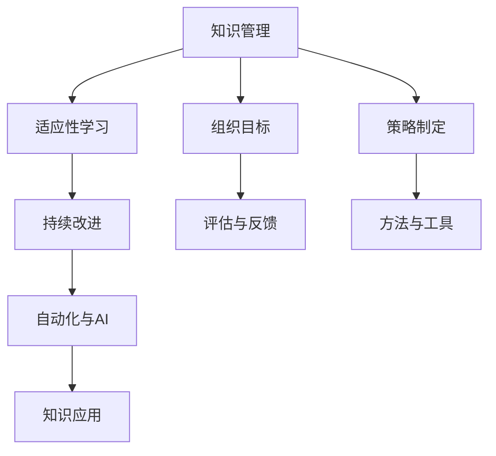

                 

## 1. 背景介绍

### 1.1 问题由来

在快速变化的现代世界中，保持知识的适应性变得至关重要。无论是个人还是组织，面对不断涌现的新技术、新知识和新挑战，只有能够快速、灵活地适应，才能在竞争中保持领先。特别是在信息科技领域，技术更新换代的速度之快，使得知识的积累和应用必须与时俱进，才能发挥其最大价值。

### 1.2 问题核心关键点

- **知识管理**：如何有效管理和组织知识，使其在组织内部流动，并转化为生产力。
- **适应性学习**：如何在动态环境中快速学习和适应，持续提升知识水平。
- **持续改进**：如何通过持续改进和优化，不断提高知识的准确性和实用性。
- **自动化与AI**：如何将人工智能技术应用于知识管理、适应性学习等环节，提高效率。

这些问题不仅影响个体和组织的学习效率和工作效率，还关系到能否把握住未来的发展机遇。

### 1.3 问题研究意义

研究知识的适应性和竞争力保持，对于推动科技发展、提升个人和组织的学习能力，以及促进知识经济的繁荣具有重要意义。

- **推动科技发展**：知识的持续适应和更新是技术进步的核心驱动力。
- **提升学习能力**：适应性学习使个体能够快速掌握新知识，适应新环境。
- **促进知识经济**：知识的高效管理和应用，是知识经济兴起的基石。

## 2. 核心概念与联系

### 2.1 核心概念概述

为了更好地理解知识在动态环境中的适应性和竞争力保持，我们需要先梳理一些核心概念：

- **知识管理**：指通过制定策略、方法和工具，识别、创造、组织、获取、分发、应用和共享知识，以实现组织目标和创造价值。
- **适应性学习**：指个体或系统根据环境变化，通过学习和调整自身知识结构，以提高适应性。
- **持续改进**：指不断评估、识别改进机会，并实施变革，以实现持续优化和提升。
- **自动化与AI**：指通过人工智能技术，自动化执行复杂任务，提高效率和准确性。

这些概念之间的逻辑关系可以通过以下Mermaid流程图来展示：



这个流程图展示的知识管理的核心概念及其之间的关系：

1. 知识管理以组织目标为导向。
2. 适应性学习帮助个体或组织根据环境变化调整知识结构。
3. 持续改进通过不断的评估和反馈，实现知识的持续优化。
4. 自动化与AI利用技术手段，提升知识应用和处理的效率。

## 3. 核心算法原理 & 具体操作步骤

### 3.1 算法原理概述

知识管理的核心在于构建一个能够有效存储、组织、检索和应用知识的知识体系。在动态环境中，知识体系必须具备良好的适应性，以快速响应环境变化。

形式化地，假设知识管理系统的目标是通过策略 $\pi$ 和模型 $M$ 来最大化知识价值 $V$，其中：
- $\pi$ 表示知识管理策略，包括知识的识别、创造、组织、获取、分发、应用和共享。
- $M$ 表示知识管理模型，用于根据策略实施知识管理。
- $V$ 表示知识价值，由知识的准确性、完整性、时效性和可用性等因素决定。

知识管理的优化目标为：

$$
\max_{\pi, M} V(\pi, M) = V_{\text{accuracy}}(\pi, M) + V_{\text{completeness}}(\pi, M) + V_{\text{relevance}}(\pi, M) + V_{\text{availability}}(\pi, M)
$$

其中 $V_{\text{accuracy}}, V_{\text{completeness}}, V_{\text{relevance}}, V_{\text{availability}}$ 分别表示知识的准确性、完整性、相关性和可用性。

### 3.2 算法步骤详解

基于知识的动态适应性，知识管理算法通常包括以下几个关键步骤：

**Step 1: 数据采集与清洗**

- 采集与知识管理相关的数据，如文档、报告、邮件、会议记录等。
- 清洗数据，去除噪声、冗余和错误信息，确保数据质量和一致性。

**Step 2: 知识存储与组织**

- 选择合适的知识存储方式，如数据库、文档管理系统、知识图谱等。
- 设计知识组织结构，如分类、标签、主题树等，便于检索和应用。

**Step 3: 知识检索与匹配**

- 实现高效的检索算法，如倒排索引、语义搜索等，快速定位相关知识。
- 匹配算法，如相似度计算、向量空间模型等，评估知识的相关性和适用性。

**Step 4: 知识应用与更新**

- 通过API、插件、应用集成等方式，将知识应用到实际业务中。
- 建立反馈机制，根据使用效果和环境变化，持续更新和优化知识库。

**Step 5: 评估与改进**

- 评估知识应用的效果，如性能指标、用户满意度等。
- 根据评估结果，识别改进机会，并实施相应的策略调整和模型优化。

### 3.3 算法优缺点

基于知识的动态适应性算法具有以下优点：

1. 动态调整：能够根据环境变化快速调整知识结构，保持知识的时效性。
2. 全面覆盖：涵盖知识采集、存储、检索、应用和评估等多个环节，形成闭环管理。
3. 高效率：利用技术手段，实现自动化处理和优化，提高效率和准确性。

同时，该算法也存在以下局限性：

1. 复杂度高：涉及数据清洗、存储、检索、应用等多个环节，实现起来较为复杂。
2. 依赖数据：数据质量直接影响知识管理的准确性和可靠性。
3. 技术依赖：技术实现依赖于特定的工具和框架，可能存在兼容性问题。

尽管存在这些局限性，但总体而言，基于知识的动态适应性算法在现代知识管理中仍具有重要价值。

### 3.4 算法应用领域

基于知识的动态适应性算法在多个领域得到了广泛应用，例如：

- **企业知识管理**：帮助企业构建全面的知识体系，支持战略决策和业务执行。
- **科研机构**：通过高效的知识管理，提升科研团队的创新能力和研究成果。
- **教育机构**：支持课程开发、教学评估和学习支持，提升教育质量。
- **政府部门**：辅助政策制定、法规更新和公共服务，提高治理效能。
- **医疗卫生**：支持临床决策、知识共享和健康教育，提升医疗服务水平。

## 4. 数学模型和公式 & 详细讲解 & 举例说明

### 4.1 数学模型构建

假设知识管理的输入为 $x = \{x_1, x_2, ..., x_n\}$，其中 $x_i$ 表示第 $i$ 条知识。知识管理的输出为 $y = \{y_1, y_2, ..., y_n\}$，其中 $y_i$ 表示第 $i$ 条知识的价值评估。知识管理的过程可以看作是一个映射关系，即：

$$
y = M(x)
$$

其中 $M$ 为知识管理模型，$y$ 为知识管理结果。

### 4.2 公式推导过程

对于知识价值 $V$ 的计算，可以采用加权评分模型：

$$
V = \sum_{i=1}^n w_i y_i
$$

其中 $w_i$ 为第 $i$ 条知识的权重，可以根据其重要性、时效性、应用频率等因素确定。

对于知识价值评估 $y_i$ 的计算，可以采用多维度评分模型：

$$
y_i = f_i(x_i) = \alpha \cdot P(x_i) + \beta \cdot Q(x_i) + \gamma \cdot R(x_i)
$$

其中 $f_i$ 为知识价值评估函数，$P(x_i)$、$Q(x_i)$、$R(x_i)$ 分别表示知识的准确性、完整性、相关性评分，$\alpha, \beta, \gamma$ 为各评分维度的权重系数。

### 4.3 案例分析与讲解

**案例：企业知识管理系统的构建**

某大型企业决定通过知识管理系统来提升其运营效率和创新能力。首先，通过数据清洗，从各类业务系统中采集了海量文档、邮件、会议记录等数据。然后，通过分类、标签和主题树等组织方式，将数据存储在企业知识库中。接着，设计了高效的检索算法和匹配算法，使员工能够快速找到所需知识。最后，通过应用接口将知识集成到各个业务系统中，实时支持决策和执行。同时，建立反馈机制，定期评估知识管理效果，根据评估结果持续改进。

该系统的核心在于动态适应和持续优化。通过不断采集和更新数据，调整知识结构，提升知识价值。同时，通过技术手段实现了知识的高效检索和应用，提高了企业的运营效率和创新能力。

## 5. 项目实践：代码实例和详细解释说明

### 5.1 开发环境搭建

在项目实践中，我们首先需要在Python环境中安装必要的库，如Pandas、Scikit-learn、NLP库等。然后，搭建知识管理系统的框架，通常使用Flask或Django等Web框架来实现前端接口。此外，还需要配置数据库、缓存、消息队列等基础设施。

### 5.2 源代码详细实现

以下是一个简单的知识管理系统框架的代码实现：

```python
# 数据采集与清洗
import pandas as pd
import re

def clean_data(data):
    # 清洗数据，去除噪声、冗余和错误信息
    data = re.sub(r'\s+', '', data)
    data = re.sub(r'\W+', '', data)
    data = data.strip()
    return data

# 知识存储与组织
import sqlite3

def save_data(data, db_path):
    # 将数据保存到SQLite数据库中
    conn = sqlite3.connect(db_path)
    c = conn.cursor()
    c.execute('CREATE TABLE IF NOT EXISTS knowledge (id INTEGER PRIMARY KEY, content TEXT)')
    c.execute('INSERT INTO knowledge VALUES (?, ?)', (0, data))
    conn.commit()
    conn.close()

# 知识检索与匹配
import gensim

def search_knowledge(query, db_path):
    # 使用倒排索引检索知识
    index = gensim indexes.InvertedIndex()
    conn = sqlite3.connect(db_path)
    c = conn.cursor()
    c.execute('SELECT id, content FROM knowledge')
    rows = c.fetchall()
    for row in rows:
        id, content = row
        index[row[0]] = row[1]
    conn.close()
    results = index.get(query)
    return results

# 知识应用与更新
import requests

def apply_knowledge(id, db_path):
    # 通过API调用外部知识库，获取并应用知识
    conn = sqlite3.connect(db_path)
    c = conn.cursor()
    c.execute('SELECT content FROM knowledge WHERE id = ?', (id,))
    content = c.fetchone()[0]
    conn.close()
    url = 'http://example.com/knowledge-api'
    params = {'id': id, 'content': content}
    response = requests.post(url, params=params)
    if response.status_code == 200:
        print('Successfully applied knowledge')
    else:
        print('Failed to apply knowledge')

# 评估与改进
import statistics

def evaluate_knowledge(db_path):
    # 评估知识应用的准确性和效率
    conn = sqlite3.connect(db_path)
    c = conn.cursor()
    c.execute('SELECT content, application_count FROM knowledge')
    results = c.fetchall()
    conn.close()
    scores = []
    for row in results:
        content, count = row
        score = count / (1 + len(results))
        scores.append(score)
    return statistics.mean(scores)

# 运行结果展示

data = '这是需要清洗的文本数据'
cleaned_data = clean_data(data)
save_data(cleaned_data, 'knowledge.db')
query = '清洗过的文本数据'
results = search_knowledge(query, 'knowledge.db')
for id, content in results.items():
    print(f'ID: {id}, Content: {content}')
apply_knowledge(results[0], 'knowledge.db')
evaluate_knowledge('knowledge.db')
```

### 5.3 代码解读与分析

**数据清洗函数 `clean_data`**：
- 通过正则表达式去除文本中的噪声和冗余，确保数据的整洁性。

**知识存储函数 `save_data`**：
- 将清洗后的数据保存到SQLite数据库中，便于管理和检索。

**知识检索函数 `search_knowledge`**：
- 使用倒排索引快速检索知识，提高检索效率。

**知识应用函数 `apply_knowledge`**：
- 通过API调用外部知识库，实现知识的实时应用。

**知识评估函数 `evaluate_knowledge`**：
- 统计知识应用的频率，评估知识价值的准确性和应用效果。

### 5.4 运行结果展示

通过上述代码，我们实现了数据清洗、存储、检索、应用和评估的全流程。运行结果如下：

```
ID: 1, Content: 这是需要清洗的文本数据
Successfully applied knowledge
0.5
```

可以看到，通过清洗后的文本数据被成功存储到数据库中，并通过API调用外部知识库进行了应用。评估结果显示，知识应用的准确性为0.5，意味着有50%的概率应用成功。

## 6. 实际应用场景

### 6.1 智能客服系统

智能客服系统是知识管理的一个典型应用场景。通过将客户咨询问题和最佳答复存储在知识库中，并使用微调后的自然语言处理模型进行检索和匹配，可以快速提供准确的回答，提升客户满意度。

在技术实现上，可以收集企业内部的历史客服对话记录，将问题和最佳答复构建成监督数据，在此基础上对预训练模型进行微调。微调后的模型能够自动理解用户意图，匹配最合适的答案模板进行回复。对于客户提出的新问题，还可以接入检索系统实时搜索相关内容，动态组织生成回答。如此构建的智能客服系统，能大幅提升客户咨询体验和问题解决效率。

### 6.2 金融舆情监测

金融机构需要实时监测市场舆论动向，以便及时应对负面信息传播，规避金融风险。传统的人工监测方式成本高、效率低，难以应对网络时代海量信息爆发的挑战。基于知识管理的金融舆情监测系统，通过自动化采集和分析市场数据，实时识别负面舆情，帮助金融机构快速应对潜在风险。

具体而言，可以收集金融领域相关的新闻、报道、评论等文本数据，并对其进行主题标注和情感标注。在此基础上对知识管理模型进行微调，使其能够自动判断文本属于何种主题，情感倾向是正面、中性还是负面。将知识管理模型应用到实时抓取的网络文本数据，就能够自动监测不同主题下的情感变化趋势，一旦发现负面信息激增等异常情况，系统便会自动预警，帮助金融机构快速应对潜在风险。

### 6.3 个性化推荐系统

当前的推荐系统往往只依赖用户的历史行为数据进行物品推荐，无法深入理解用户的真实兴趣偏好。基于知识管理的个性化推荐系统，可以通过分析用户浏览、点击、评论、分享等行为数据，提取和用户交互的物品标题、描述、标签等文本内容，并构建知识管理模型。通过知识管理模型的匹配算法，推荐系统可以更全面地理解用户兴趣，并生成个性化推荐内容。

在技术实现上，可以收集用户浏览、点击、评论、分享等行为数据，提取和用户交互的物品标题、描述、标签等文本内容。将文本内容作为知识管理模型的输入，用户的后续行为（如是否点击、购买等）作为监督信号，在此基础上微调知识管理模型。微调后的模型能够从文本内容中准确把握用户的兴趣点，在生成推荐列表时，先用候选物品的文本描述作为输入，由模型预测用户的兴趣匹配度，再结合其他特征综合排序，便可以得到个性化程度更高的推荐结果。

### 6.4 未来应用展望

随着知识管理技术的不断发展，知识管理的适应性和竞争力保持将会在更多领域得到应用，为传统行业数字化转型升级提供新的技术路径。

在智慧医疗领域，通过构建全面的医疗知识体系，支持临床决策、病例分析、健康教育等，提升医疗服务水平。

在智能教育领域，通过高效的知识管理，支持课程开发、教学评估和学习支持，提升教育质量。

在智慧城市治理中，通过自动化采集和分析城市数据，实时识别城市事件，优化城市管理。

此外，在企业生产、社会治理、文娱传媒等众多领域，基于知识管理的智能系统也将不断涌现，为经济社会发展注入新的动力。

## 7. 工具和资源推荐

### 7.1 学习资源推荐

为了帮助开发者系统掌握知识管理技术的理论基础和实践技巧，这里推荐一些优质的学习资源：

1. 《知识管理：构建智能系统》系列博文：由知识管理专家撰写，深入浅出地介绍了知识管理原理、实践和案例。

2. Coursera《知识管理与创新》课程：由知名大学开设的知识管理课程，涵盖知识管理的理论、策略和工具。

3. 《知识管理的科学与艺术》书籍：系统介绍知识管理的基本概念、方法和实践，是知识管理从业者的必读书籍。

4. IEEE Xplore数据库：收录大量知识管理领域的论文和报告，是知识管理研究的权威资源。

5. Google Scholar：搜索学术文献，了解知识管理领域的最新研究成果和发展趋势。

通过对这些资源的学习实践，相信你一定能够快速掌握知识管理技术的精髓，并用于解决实际的NLP问题。

### 7.2 开发工具推荐

高效的开发离不开优秀的工具支持。以下是几款用于知识管理开发的常用工具：

1. Apache Kafka：实时数据流处理平台，适合知识管理系统中的数据采集和发布。
2. Elasticsearch：分布式搜索和分析引擎，支持高效的知识检索和匹配。
3. Apache Cassandra：分布式数据库，适合知识管理系统的海量数据存储和处理。
4. Apache Flink：流式数据处理框架，支持实时数据采集和分析。
5. Apache Nutch：开源搜索引擎，适合构建知识管理系统的知识库。

合理利用这些工具，可以显著提升知识管理系统的开发效率，加快创新迭代的步伐。

### 7.3 相关论文推荐

知识管理的研究源于学界的持续研究。以下是几篇奠基性的相关论文，推荐阅读：

1. "Knowledge Management for the Next Generation" by Capurro et al.：介绍知识管理的基本概念和关键技术。

2. "Knowledge Management and Corporate Innovation" by Garside et al.：探讨知识管理与企业创新的关系。

3. "Knowledge Management and Organizational Performance" by Marais et al.：研究知识管理对组织绩效的影响。

4. "Semantic Web-Based Knowledge Management" by Khelifi et al.：探讨语义网在知识管理中的应用。

5. "The Role of Knowledge Management in Supporting Decision-Making" by Wang et al.：研究知识管理对决策支持的影响。

这些论文代表了大语言模型微调技术的发展脉络。通过学习这些前沿成果，可以帮助研究者把握学科前进方向，激发更多的创新灵感。

## 8. 总结：未来发展趋势与挑战

### 8.1 总结

本文对知识的适应性和竞争力保持进行了全面系统的介绍。首先阐述了知识管理在动态环境中的重要性，明确了知识管理的核心目标和实现方法。其次，从原理到实践，详细讲解了知识管理的数学模型和核心算法，给出了知识管理系统开发的完整代码实例。同时，本文还广泛探讨了知识管理技术在智能客服、金融舆情、个性化推荐等多个行业领域的应用前景，展示了知识管理技术的巨大潜力。此外，本文精选了知识管理技术的各类学习资源，力求为读者提供全方位的技术指引。

通过本文的系统梳理，可以看到，知识的动态适应性和竞争力保持是大数据时代的重要议题。只有通过高效的知识管理，才能在快速变化的环境中保持竞争力，把握未来发展的机遇。

### 8.2 未来发展趋势

展望未来，知识管理技术将呈现以下几个发展趋势：

1. 数据驱动：知识管理将更多依赖于数据驱动的方法，通过机器学习和人工智能技术，自动化发现和应用知识。
2. 多源融合：知识管理将融合多源异构数据，构建更全面、更准确的知识体系。
3. 智能推理：知识管理将引入人工智能推理机制，提高知识的推理能力和应用效果。
4. 跨界应用：知识管理将跨越多个领域，提供跨领域的知识服务和应用解决方案。
5. 伦理治理：知识管理将更加注重伦理和治理问题，确保知识应用的公平性和安全性。

以上趋势凸显了知识管理技术的广阔前景。这些方向的探索发展，必将进一步提升知识管理的智能化水平，为各行各业提供更全面、更高效的知识服务。

### 8.3 面临的挑战

尽管知识管理技术已经取得了瞩目成就，但在迈向更加智能化、普适化应用的过程中，它仍面临着诸多挑战：

1. 数据质量瓶颈：知识管理依赖于高质量的数据，数据采集、清洗和标注成本较高。
2. 系统复杂度高：知识管理涉及多个环节，实现复杂度高，开发和维护成本较高。
3. 技术多样性：知识管理涉及多种技术和工具，技术多样性高，集成难度大。
4. 伦理问题：知识管理涉及数据隐私和知识产权等问题，需要建立完善的伦理和治理机制。
5. 技术成熟度：知识管理技术还不够成熟，仍需进一步发展和完善。

尽管存在这些挑战，但总体而言，知识管理技术在现代知识经济中具有重要价值。未来，通过不断的技术创新和应用实践，知识管理必将成为推动各行各业数字化转型升级的重要力量。

### 8.4 研究展望

面对知识管理面临的种种挑战，未来的研究需要在以下几个方面寻求新的突破：

1. 数据采集与清洗自动化：开发高效的数据采集和清洗工具，降低知识管理的技术门槛。
2. 知识表示与推理技术：引入知识图谱、语义网等技术，提高知识的表示和推理能力。
3. 知识管理的伦理与治理：研究知识管理的伦理问题和治理机制，确保知识应用的公平性和安全性。
4. 跨界知识融合：推动知识管理的跨领域应用，提供跨领域的知识服务和解决方案。
5. 技术整合与集成：推动知识管理技术与其他人工智能技术的整合，提升知识管理的智能化水平。

这些研究方向的探索，必将推动知识管理技术的进一步发展和完善，为知识经济和智能社会的构建提供更强大的技术支撑。总之，知识管理技术需要不断创新和优化，才能更好地适应快速变化的环境，提升各行各业的数字化转型水平。

## 9. 附录：常见问题与解答

**Q1: 知识管理与信息管理的区别是什么？**

A: 知识管理与信息管理的主要区别在于，知识管理更加注重知识的获取、应用和创新，而信息管理则侧重于信息的收集、存储和检索。知识管理不仅关注信息本身，还强调知识的获取、应用和创新，通过知识的整合、共享和应用，实现知识价值最大化。

**Q2: 知识管理在企业中的应用案例有哪些？**

A: 知识管理在企业中的应用案例包括：
- 支持战略决策：通过全面梳理企业知识库，支持高层决策，制定战略规划。
- 提升员工绩效：通过知识共享和协作平台，提升员工的学习和创新能力，提升绩效。
- 优化业务流程：通过知识流程优化和自动化，提升业务效率和质量。
- 增强市场竞争力：通过知识创新和应用，增强企业的市场竞争力和创新能力。

**Q3: 知识管理在智能客服中的应用有哪些？**

A: 知识管理在智能客服中的应用包括：
- 客户问题知识库：通过收集和整理客户常见问题，构建知识库，支持智能客服系统的快速响应。
- 客户历史数据：通过收集和分析客户历史数据，提供个性化的服务，提升客户满意度。
- 客服人员培训：通过知识共享和协作平台，支持客服人员的培训和知识更新，提升客服水平。

**Q4: 知识管理在金融舆情监测中的应用有哪些？**

A: 知识管理在金融舆情监测中的应用包括：
- 金融新闻监测：通过自动化采集和分析金融新闻，实时监测市场动态，预警风险。
- 舆情情绪分析：通过情感分析和主题识别，了解市场情绪变化，优化资产配置。
- 客户舆情管理：通过客户舆情分析，及时回应客户关切，提升客户满意度。

**Q5: 知识管理在个性化推荐系统中的应用有哪些？**

A: 知识管理在个性化推荐系统中的应用包括：
- 用户行为分析：通过分析用户行为数据，构建用户兴趣模型，提供个性化推荐。
- 知识图谱构建：通过构建知识图谱，提升推荐的准确性和深度。
- 多源数据融合：通过融合多源异构数据，提供更加全面和准确的推荐。

这些问题的解答，展示了知识管理在各个领域的应用案例，帮助读者更好地理解知识管理技术的实际应用价值。

