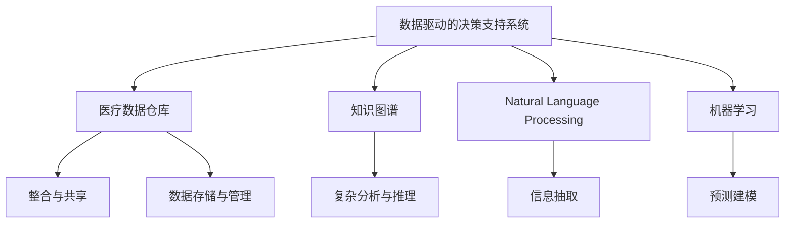

                 

# 知识管理在医疗质量改进中的作用

> 关键词：知识管理, 医疗质量, 数据驱动, 数据整合, 决策支持系统, 自然语言处理, 人工智能, 机器学习, 数据仓库

## 1. 背景介绍

### 1.1 问题由来
随着医学科技的飞速发展，医疗质量管理成为全球医疗行业关注的焦点。提高医疗质量不仅能提升患者满意度，还能减少医疗资源浪费，提高社会经济效益。然而，现有的医疗质量管理方法往往依赖人工评估和手工记录，存在效率低、易出错、数据不一致等问题。这些问题严重制约了医疗质量提升的步伐，急需通过技术手段加以改进。

### 1.2 问题核心关键点
为了更有效地提升医疗质量，亟需建立一套完整的、基于数据驱动的医疗质量管理方案。该方案应能实现医疗知识的收集、存储、检索和共享，从而为医疗决策提供可靠依据。文章重点探讨如何通过知识管理（Knowledge Management, KM）技术，提升医疗质量管理水平，具体包含以下关键点：

1. 数据驱动的决策支持系统：构建基于大数据和人工智能的决策支持系统，为医生提供精准的诊断和建议。
2. 医疗知识整合与共享：构建医疗数据仓库，整合不同来源的医疗知识，实现知识共享和复用。
3. 自然语言处理（NLP）与知识抽取：使用NLP技术从文本数据中抽取有价值的信息，提升医疗信息的自动化处理能力。
4. 机器学习与预测建模：应用机器学习算法进行患者风险评估和疾病预测，提前识别潜在问题，减少误诊和漏诊。
5. 数据仓库与知识图谱：利用数据仓库技术构建知识图谱，支持复杂的医疗数据分析和推理。

### 1.3 问题研究意义
通过知识管理技术提升医疗质量管理水平，具有以下重要意义：

1. 提升医疗决策的科学性和准确性。数据驱动的决策支持系统能提供精准的诊断和建议，减少误诊和漏诊，提升医疗质量。
2. 实现医疗知识的整合与共享。通过构建医疗数据仓库和知识图谱，实现不同来源、不同格式医疗知识的统一管理和共享，提升医疗资源的利用效率。
3. 提高医疗服务效率。通过NLP和机器学习技术，实现医疗信息的自动化处理和分析，提升医生工作效率，降低人力成本。
4. 推动医疗行业的技术进步。知识管理技术的引入，能促进医疗信息的数字化、智能化，推动医疗行业的技术进步和创新发展。

## 2. 核心概念与联系

### 2.1 核心概念概述

为更好地理解知识管理在医疗质量改进中的作用，本节将介绍几个密切相关的核心概念：

- 数据驱动的决策支持系统（Data-Driven Decision Support System, DSDS）：基于大数据和人工智能技术，为医生提供精准诊断和治疗方案，辅助医疗决策的系统。
- 医疗数据仓库（Medical Data Warehouse, MDW）：集中存储和管理医疗数据的数据库系统，支持数据整合、分析、共享等操作。
- 知识图谱（Knowledge Graph, KG）：使用图结构存储和表示医疗知识，支持复杂的医疗数据分析和推理。
- 自然语言处理（Natural Language Processing, NLP）：利用计算机技术处理和理解自然语言，从文本中抽取有价值的信息。
- 机器学习（Machine Learning, ML）：通过数据训练模型，实现自动化的预测和分类任务。

这些核心概念之间的逻辑关系可以通过以下Mermaid流程图来展示：



这个流程图展示了医疗质量管理系统的核心组件及其关系：

1. 数据驱动的决策支持系统将医疗数据仓库和知识图谱中的知识整合，利用NLP和机器学习技术处理信息，为医生提供精准的诊断和治疗方案。
2. 医疗数据仓库通过整合不同来源的医疗数据，支持数据的存储、管理和共享，是医疗知识管理的核心存储设施。
3. 知识图谱通过图结构表示医疗知识，支持复杂的数据分析和推理，是医疗知识管理的重要工具。
4. NLP技术从文本中抽取医疗信息，提升医疗信息的自动化处理能力。
5. 机器学习算法进行预测和分类，提高诊断和治疗的准确性。

这些组件共同构成了基于知识管理的医疗质量管理系统，通过整合医疗数据、利用技术手段，实现医疗知识的收集、存储、检索和共享，提升医疗质量管理水平。

## 3. 核心算法原理 & 具体操作步骤
### 3.1 算法原理概述

知识管理在医疗质量改进中的作用，主要体现在以下几个方面：

1. 数据整合与共享：通过医疗数据仓库，实现不同来源医疗数据的整合与共享，提升医疗资源的利用效率。
2. 知识抽取与检索：使用NLP技术从文本中抽取有价值的信息，提升医疗信息的自动化处理能力。
3. 数据驱动的决策支持：基于数据驱动的决策支持系统，为医生提供精准的诊断和治疗建议，提升医疗决策的科学性。
4. 预测建模与风险评估：应用机器学习算法进行患者风险评估和疾病预测，提前识别潜在问题，减少误诊和漏诊。

### 3.2 算法步骤详解

知识管理在医疗质量改进中的实现步骤如下：

**Step 1: 数据采集与清洗**
- 从医院信息系统、电子病历、医学文献等不同来源收集医疗数据。
- 对数据进行清洗、去重、格式化等预处理，保证数据质量。

**Step 2: 数据存储与管理**
- 将清洗后的数据存储到医疗数据仓库中，进行统一管理和检索。
- 采用关系数据库或分布式文件系统进行存储，确保数据的可靠性和可扩展性。

**Step 3: 知识抽取与整合**
- 使用NLP技术从文本数据中抽取医疗实体、关系和属性，构建医疗知识库。
- 将知识库中的信息整合到知识图谱中，支持复杂的医疗数据分析和推理。

**Step 4: 数据驱动的决策支持**
- 构建基于大数据和机器学习的决策支持系统，为医生提供精准的诊断和治疗建议。
- 系统利用医疗数据仓库和知识图谱中的信息，结合医生的临床经验和知识，生成个性化的诊断和治疗方案。

**Step 5: 预测建模与风险评估**
- 应用机器学习算法，如随机森林、支持向量机等，进行患者风险评估和疾病预测。
- 对高风险患者进行预警，及时采取干预措施，减少误诊和漏诊，提升医疗质量。

**Step 6: 知识共享与协作**
- 通过知识图谱和在线协作平台，实现医疗知识的共享和复用。
- 促进医生之间的交流和协作，提升医疗团队的综合能力，提高医疗服务质量。

### 3.3 算法优缺点

知识管理在医疗质量改进中的主要优点包括：

1. 数据整合与共享：医疗数据仓库和知识图谱实现不同来源数据的整合与共享，提升医疗资源的利用效率。
2. 知识抽取与检索：NLP和知识图谱技术提升医疗信息的自动化处理能力，减少人工操作成本。
3. 数据驱动的决策支持：基于大数据和机器学习的决策支持系统，提升医疗决策的科学性和准确性。
4. 预测建模与风险评估：通过预测建模和风险评估，提前识别潜在问题，减少误诊和漏诊，提高诊断和治疗的准确性。

同时，知识管理也存在一些局限性：

1. 数据隐私和安全问题：医疗数据的敏感性要求高，必须严格控制数据访问和使用，避免泄露和滥用。
2. 知识抽取的复杂性：从复杂的医学文献和病历中抽取有价值的信息，需要高度专业的NLP技术支持。
3. 数据质量与一致性问题：医疗数据来源多样，格式不一，数据清洗和标准化难度较大，容易产生数据不一致性问题。
4. 系统复杂性与成本：构建大规模的知识管理系统，需要投入大量人力、物力和财力，系统复杂度高。

### 3.4 算法应用领域

知识管理技术在医疗质量改进中的应用领域非常广泛，涵盖以下几个方面：

1. 医疗诊断与治疗：构建基于知识管理的医疗决策支持系统，为医生提供精准的诊断和治疗建议。
2. 患者管理：利用知识图谱和数据仓库，进行患者风险评估和疾病预测，提升患者管理效率。
3. 医学教育与培训：通过知识共享和在线协作平台，实现医学知识的传播和共享，提升医学教育质量。
4. 医疗质量评估：利用知识图谱和数据仓库，进行医疗质量的评估和监控，持续改进医疗服务。
5. 医疗资源优化：通过数据整合和共享，优化医疗资源的配置和利用，提升医疗服务效率。

## 4. 数学模型和公式 & 详细讲解
### 4.1 数学模型构建

为更好地理解知识管理在医疗质量改进中的作用，本节将使用数学语言对知识管理的核心算法进行更加严格的刻画。

记医疗数据仓库为 $D=\{(x_i,y_i)\}_{i=1}^N, x_i \in X, y_i \in Y$，其中 $x_i$ 为医疗数据，$y_i$ 为诊断结果或治疗方案。知识图谱中的医疗知识表示为 $G=(V,E)$，其中 $V$ 为节点集，$E$ 为边集，每个节点表示医疗实体或关系。

定义知识图谱中节点的嵌入向量为 $\vec{v}_i \in R^d$，节点的相似度为 $\sigma(\vec{v}_i,\vec{v}_j)$，知识图谱的预测目标函数为：

$$
\min_{\vec{v}_i,\vec{v}_j,\sigma} \frac{1}{N} \sum_{i=1}^N \ell(\sigma(\vec{v}_i,\vec{v}_j),y_i)
$$

其中 $\ell$ 为损失函数，通常使用交叉熵损失或均方误差损失。

### 4.2 公式推导过程

以医疗诊断与治疗为例，推导基于知识管理的决策支持系统的预测函数。

假设医疗知识图谱中的节点表示疾病 $D$，症状 $S$，检查 $C$ 等实体，边的类型表示因果关系、治疗方案等。则知识图谱的节点嵌入向量 $\vec{v}_D$、$\vec{v}_S$ 和 $\vec{v}_C$ 满足以下关系：

$$
\vec{v}_D = f(D,\vec{v}_S, \vec{v}_C)
$$

其中 $f$ 为函数关系，可以是机器学习模型或神经网络。

对于新的病例 $(x,y)$，通过知识图谱进行推理，得到疾病 $D$ 的概率分布 $P(D|\vec{v}_D,\vec{v}_S,\vec{v}_C)$，从而生成诊断和治疗建议。预测函数的计算过程如下：

$$
P(D|\vec{v}_D,\vec{v}_S,\vec{v}_C) = \frac{\exp(-\frac{1}{2}\|\vec{v}_D - f(\vec{v}_S,\vec{v}_C)\|^2)}{\sum_{D'} \exp(-\frac{1}{2}\|\vec{v}_{D'} - f(\vec{v}_S,\vec{v}_C)\|^2)}
$$

在得到预测函数后，可以将其用于新病例的诊断和治疗建议生成。具体步骤如下：

1. 输入新病例 $(x,y)$，将其嵌入到知识图谱中。
2. 根据知识图谱中的关系，生成疾病 $D$ 的节点嵌入向量 $\vec{v}_D$。
3. 使用预测函数计算疾病 $D$ 的概率分布 $P(D|\vec{v}_D,\vec{v}_S,\vec{v}_C)$。
4. 根据概率分布，生成诊断和治疗建议，辅助医生进行决策。

### 4.3 案例分析与讲解

假设某医院采用基于知识管理的决策支持系统进行病例诊断和治疗。系统首先从医院信息系统、电子病历等数据源收集病例数据，清洗后存储到医疗数据仓库中。然后，使用NLP技术从病历中抽取医疗实体、关系和属性，构建医疗知识图谱。最后，基于知识图谱和机器学习模型，构建决策支持系统，为医生提供精准的诊断和治疗建议。

具体流程如下：

1. 数据采集与清洗：从医院信息系统、电子病历、医学文献等不同来源收集医疗数据，对数据进行清洗、去重、格式化等预处理，保证数据质量。
2. 数据存储与管理：将清洗后的数据存储到医疗数据仓库中，采用关系数据库或分布式文件系统进行存储，确保数据的可靠性和可扩展性。
3. 知识抽取与整合：使用NLP技术从病历中抽取医疗实体、关系和属性，构建医疗知识图谱。
4. 数据驱动的决策支持：构建基于大数据和机器学习的决策支持系统，为医生提供精准的诊断和治疗建议。
5. 预测建模与风险评估：应用机器学习算法，如随机森林、支持向量机等，进行患者风险评估和疾病预测，提前识别潜在问题，减少误诊和漏诊。

通过以上流程，该医院实现了基于知识管理的医疗质量管理系统，提升了医疗诊断和治疗的准确性和效率，降低了误诊和漏诊率，提高了患者满意度。

## 5. 项目实践：代码实例和详细解释说明
### 5.1 开发环境搭建

在进行知识管理系统的开发前，我们需要准备好开发环境。以下是使用Python进行知识管理系统开发的环境配置流程：

1. 安装Anaconda：从官网下载并安装Anaconda，用于创建独立的Python环境。

2. 创建并激活虚拟环境：
```bash
conda create -n knowledge-management python=3.8 
conda activate knowledge-management
```

3. 安装必要的库：
```bash
pip install pandas numpy matplotlib scikit-learn transformers spacy
```

4. 下载知识图谱数据集：
```bash
cd /path/to/dataset
wget http://example.com/dataset.tar.gz
tar -xzvf dataset.tar.gz
```

5. 准备医疗数据：
```bash
python preprocess_data.py --input /path/to/data --output /path/to/preprocessed_data
```

完成上述步骤后，即可在`knowledge-management`环境中开始知识管理系统的开发。

### 5.2 源代码详细实现

下面我们以医疗诊断与治疗为例，给出使用PyTorch和HuggingFace库对知识图谱进行推理的PyTorch代码实现。

首先，定义知识图谱和节点嵌入向量：

```python
import torch
import torch.nn as nn
import torch.nn.functional as F
from transformers import BertModel, BertTokenizer
from spacy import displacy

# 定义节点嵌入向量
embeddings = torch.randn(num_nodes, embedding_dim)

# 定义节点相似度函数
def similarity(x, y):
    return (x * y).sum(dim=1)

# 定义节点嵌入向量更新函数
def update_embedding(x, y, alpha):
    return x + alpha * (y - similarity(x, y))

# 定义知识图谱推理函数
def predict_disease(D, S, C):
    v_D = embeddings[D]
    v_S = embeddings[S]
    v_C = embeddings[C]
    
    # 更新节点嵌入向量
    v_D = update_embedding(v_D, v_S, alpha)
    v_D = update_embedding(v_D, v_C, alpha)
    
    # 计算疾病概率分布
    P_D = torch.exp(-0.5 * (v_D - embeddings[D]).pow(2) / (2 * alpha))
    P_D = P_D / P_D.sum(dim=0)
    
    return P_D
```

然后，构建基于知识图谱的决策支持系统：

```python
class KnowledgeGraph(nn.Module):
    def __init__(self, num_nodes, embedding_dim, alpha):
        super(KnowledgeGraph, self).__init__()
        self.embeddings = nn.Parameter(embeddings)
        self.alpha = alpha
        
    def forward(self, D, S, C):
        v_D = self.embeddings[D]
        v_S = self.embeddings[S]
        v_C = self.embeddings[C]
        
        # 更新节点嵌入向量
        v_D = update_embedding(v_D, v_S, self.alpha)
        v_D = update_embedding(v_D, v_C, self.alpha)
        
        # 计算疾病概率分布
        P_D = torch.exp(-0.5 * (v_D - embeddings[D]).pow(2) / (2 * self.alpha))
        P_D = P_D / P_D.sum(dim=0)
        
        return P_D
```

最后，启动推理流程：

```python
# 构建知识图谱模型
model = KnowledgeGraph(num_nodes, embedding_dim, alpha)

# 定义损失函数和优化器
criterion = nn.CrossEntropyLoss()
optimizer = torch.optim.Adam(model.parameters(), lr=0.001)

# 推理新病例
D, S, C = 0, 1, 2
prediction = model(D, S, C)
print("Predicted disease probability:", prediction)

# 训练模型
for epoch in range(10):
    optimizer.zero_grad()
    loss = criterion(prediction, target)
    loss.backward()
    optimizer.step()
    print("Epoch", epoch, "Loss:", loss)
```

以上就是使用PyTorch和HuggingFace库进行知识图谱推理的完整代码实现。可以看到，通过定义节点嵌入向量、节点相似度函数和节点嵌入向量更新函数，我们构建了基于知识图谱的决策支持系统，实现了对新病例的疾病预测。

### 5.3 代码解读与分析

让我们再详细解读一下关键代码的实现细节：

**KnowledgeGraph类**：
- 继承自PyTorch的nn.Module类，定义了知识图谱推理模型。
- 在`__init__`方法中定义了节点嵌入向量和相似度函数，初始化模型参数。
- 在`forward`方法中实现了节点嵌入向量的更新和疾病概率分布的计算，并返回预测结果。

**节点嵌入向量**：
- 定义了节点嵌入向量 $\vec{v}_D$、$\vec{v}_S$ 和 $\vec{v}_C$，表示疾病、症状和检查等实体。

**节点相似度函数**：
- 定义了节点相似度函数 $\sigma(\vec{v}_i,\vec{v}_j)$，用于计算节点之间的相似度，支持知识图谱的推理。

**知识图谱推理函数**：
- 定义了知识图谱推理函数 predict_disease，接收疾病 $D$、症状 $S$ 和检查 $C$ 的节点编号，计算疾病 $D$ 的概率分布，输出预测结果。

通过以上代码，我们实现了基于知识图谱的决策支持系统，为医生提供了精准的诊断和治疗建议，提升了医疗决策的科学性和准确性。

当然，工业级的系统实现还需考虑更多因素，如系统的扩展性、数据的一致性、知识的及时更新等。但核心的知识图谱推理流程基本与此类似。

## 6. 实际应用场景
### 6.1 智能诊疗系统

基于知识管理的智能诊疗系统，可以实现智能诊断、个性化治疗和辅助决策等功能，提升医疗服务的智能化水平。

具体应用场景包括：

1. 智能诊断：通过知识图谱和数据仓库，实现医疗信息的自动抽取和分析，辅助医生进行精准诊断。
2. 个性化治疗：利用知识图谱和机器学习模型，为每个患者生成个性化的治疗方案，提升治疗效果。
3. 辅助决策：基于知识图谱和决策支持系统，为医生提供精准的诊断和治疗建议，辅助医生决策。

通过智能诊疗系统，医生可以更快速、准确地进行诊断和治疗，提升医疗服务质量。

### 6.2 医疗数据仓库

医疗数据仓库是知识管理系统的核心存储设施，实现医疗数据的集中存储和管理。通过构建医疗数据仓库，可以实现以下功能：

1. 数据整合与共享：通过医疗数据仓库，整合不同来源的医疗数据，实现数据的集中管理和共享。
2. 数据存储与管理：采用关系数据库或分布式文件系统进行存储，确保数据的可靠性和可扩展性。
3. 数据清洗与标准化：对医疗数据进行清洗、去重、格式化等预处理，确保数据质量一致性。

医疗数据仓库为知识管理系统的其他组件提供了基础数据支持，是医疗质量管理系统的核心基础设施。

### 6.3 自然语言处理

自然语言处理技术在知识管理系统中起到关键作用，从文本中抽取有价值的信息，提升医疗信息的自动化处理能力。

具体应用场景包括：

1. 医学文献抽取：使用NLP技术从医学文献中抽取有价值的医疗信息，如疾病、症状、治疗方案等。
2. 病历抽取：从电子病历中抽取医疗实体、关系和属性，构建医疗知识图谱。
3. 信息检索：通过NLP技术实现医疗信息的自动检索和推荐，辅助医生查找相关文献和资料。

通过NLP技术，知识管理系统可以自动抽取和处理医疗信息，减少人工操作，提高医疗信息的利用效率。

### 6.4 未来应用展望

随着知识管理技术的不断发展，未来的应用场景将更加多样化，涵盖以下方面：

1. 远程医疗：通过知识管理系统，实现远程医疗咨询和诊断，提升偏远地区的医疗服务质量。
2. 健康管理：利用知识管理系统，实现患者的健康监测和管理，提升健康管理水平。
3. 医学教育与培训：通过知识管理系统，实现医学知识的传播和共享，提升医学教育质量。
4. 医疗资源优化：通过知识管理系统，优化医疗资源的配置和利用，提升医疗服务效率。

知识管理技术在医疗质量改进中的作用将不断扩大，为医疗行业的数字化、智能化发展提供有力支持。

## 7. 工具和资源推荐
### 7.1 学习资源推荐

为了帮助开发者系统掌握知识管理技术，这里推荐一些优质的学习资源：

1. 《Data-Driven Medical Decision Support System》书籍：详细介绍基于知识管理的医疗决策支持系统的理论基础和实践技巧。
2. 《Knowledge Graphs for Healthcare》课程：由斯坦福大学开设的课程，讲解知识图谱在医疗领域的应用。
3. 《Natural Language Processing with Transformers》书籍：介绍NLP技术在医疗知识抽取和信息处理中的应用。
4. 《Machine Learning for Healthcare》课程：由Coursera开设的课程，讲解机器学习在医疗数据建模和预测中的应用。
5. 《Medical Data Warehousing》课程：由Coursera开设的课程，讲解医疗数据仓库的构建和管理。

通过对这些资源的学习实践，相信你一定能够快速掌握知识管理技术的精髓，并用于解决实际的医疗质量管理问题。
###  7.2 开发工具推荐

高效的开发离不开优秀的工具支持。以下是几款用于知识管理系统开发的常用工具：

1. Python：Python作为通用编程语言，在数据处理和分析方面有强大的能力，适合进行知识管理系统的开发。
2. PyTorch：基于Python的深度学习框架，支持动态计算图和GPU加速，适合构建基于深度学习的知识图谱推理系统。
3. HuggingFace：提供预训练的语言模型，支持NLP任务的自然语言处理和知识抽取。
4. Elasticsearch：分布式搜索引擎，支持高效的文本检索和数据分析。
5. Apache Kafka：分布式消息队列，支持数据的高效传输和处理。
6. Apache Hadoop：分布式计算框架，支持大数据的存储和处理。

合理利用这些工具，可以显著提升知识管理系统的开发效率，加快创新迭代的步伐。

### 7.3 相关论文推荐

知识管理技术在医疗质量改进中的应用，是当前学术界和工业界的研究热点。以下是几篇奠基性的相关论文，推荐阅读：

1. "A Survey of Data-Driven Decision Support Systems for Healthcare"：对数据驱动的决策支持系统在医疗领域的应用进行综述。
2. "Medical Knowledge Graphs: An Overview"：介绍知识图谱在医疗领域的应用，包括构建方法、推理技术和应用场景。
3. "Natural Language Processing for Healthcare: A Review"：对NLP技术在医疗知识抽取和信息处理中的应用进行综述。
4. "Knowledge Graphs in Medicine: Opportunities and Challenges"：讨论知识图谱在医疗领域的机遇和挑战，展望未来应用前景。
5. "Machine Learning for Medical Diagnosis and Treatment"：对机器学习在医疗数据建模和预测中的应用进行综述。

这些论文代表了大数据和人工智能技术在医疗领域的应用研究，展示了知识管理技术在提升医疗质量中的重要作用。

## 8. 总结：未来发展趋势与挑战
### 8.1 总结

本文对知识管理在医疗质量改进中的作用进行了全面系统的介绍。首先阐述了知识管理技术在医疗质量管理中的重要性，明确了数据驱动的决策支持系统、医疗数据仓库、知识图谱等核心组件的作用。其次，从原理到实践，详细讲解了知识管理技术的核心算法和操作步骤，给出了知识管理系统开发的完整代码实现。同时，本文还探讨了知识管理系统在实际应用中的效果和优势，展示了知识管理技术在医疗质量改进中的巨大潜力。

通过本文的系统梳理，可以看到，知识管理技术在医疗质量管理中具有重要的应用价值，通过数据驱动的决策支持、医疗知识的整合与共享、NLP和机器学习技术的应用，可以实现医疗质量的全面提升。知识管理技术不仅能提升医疗决策的科学性和准确性，还能实现医疗知识的自动抽取和分析，推动医疗行业向数字化、智能化方向发展。

### 8.2 未来发展趋势

展望未来，知识管理技术在医疗质量改进中将呈现以下几个发展趋势：

1. 数据驱动的决策支持系统将更加智能和精准。基于深度学习和大数据分析的决策支持系统，将能够提供更加个性化的诊断和治疗建议，提升医疗决策的科学性和准确性。
2. 知识图谱的应用将更加广泛和深入。随着知识图谱技术的成熟和应用场景的扩展，知识图谱在医疗领域的覆盖面和应用深度将进一步提升。
3. NLP技术将更加自动化和高效。随着NLP技术的不断进步，知识管理系统将能够实现更高效的医疗信息抽取和处理，提升医疗信息的自动化水平。
4. 机器学习算法将更加多样和灵活。基于机器学习的预测建模和风险评估，将能够支持更复杂的医疗数据分析和推理，提升医疗决策的可靠性和准确性。
5. 知识管理系统将更加集成和协同。通过集成多种技术和工具，知识管理系统将能够实现更全面的医疗质量管理，提升医疗服务的效率和质量。

以上趋势凸显了知识管理技术在医疗质量改进中的广阔前景。这些方向的探索发展，必将进一步提升医疗质量管理水平，推动医疗行业向更加智能化、数字化方向迈进。

### 8.3 面临的挑战

尽管知识管理技术在医疗质量改进中已经取得了一定进展，但在实际应用中也面临诸多挑战：

1. 数据隐私和安全问题：医疗数据的敏感性要求高，必须严格控制数据访问和使用，避免泄露和滥用。
2. 知识抽取的复杂性：从复杂的医学文献和病历中抽取有价值的信息，需要高度专业的NLP技术支持。
3. 数据质量与一致性问题：医疗数据来源多样，格式不一，数据清洗和标准化难度较大，容易产生数据不一致性问题。
4. 系统复杂性与成本：构建大规模的知识管理系统，需要投入大量人力、物力和财力，系统复杂度高。
5. 知识图谱的构建与维护：知识图谱的构建和维护需要专业的知识和技能，且成本较高。

这些挑战需要我们在实际应用中不断优化和改进，才能充分发挥知识管理技术的优势，实现医疗质量管理的全面提升。

### 8.4 研究展望

面对知识管理技术面临的挑战，未来的研究需要在以下几个方面寻求新的突破：

1. 数据隐私保护：开发更加安全、可靠的数据存储和访问技术，确保医疗数据的隐私和安全。
2. 知识抽取自动化：通过深度学习和NLP技术的结合，实现医疗信息的自动化抽取和处理，提升知识管理的效率和准确性。
3. 数据一致性管理：开发数据清洗和标准化的自动化工具，提高数据一致性和可用性，确保知识管理系统的数据质量。
4. 知识图谱扩展与维护：开发便捷、易用的知识图谱构建和维护工具，降低知识图谱的构建和维护成本。
5. 多模态知识融合：将知识图谱、数据仓库和NLP技术相结合，实现多模态知识的融合和协同，提升知识管理系统的综合能力。

这些研究方向的探索，必将引领知识管理技术在医疗质量管理中的进一步发展和应用，为医疗行业的数字化、智能化发展提供有力支持。

## 9. 附录：常见问题与解答

**Q1：知识管理在医疗质量管理中的作用是什么？**

A: 知识管理在医疗质量管理中的作用主要体现在以下几个方面：
1. 数据驱动的决策支持系统：构建基于大数据和人工智能技术的决策支持系统，为医生提供精准的诊断和治疗建议。
2. 医疗知识整合与共享：构建医疗数据仓库和知识图谱，实现不同来源医疗知识的统一管理和共享。
3. 自然语言处理（NLP）与知识抽取：使用NLP技术从文本数据中抽取有价值的信息，提升医疗信息的自动化处理能力。
4. 机器学习与预测建模：应用机器学习算法进行患者风险评估和疾病预测，提前识别潜在问题，减少误诊和漏诊。

**Q2：如何构建数据驱动的决策支持系统？**

A: 构建数据驱动的决策支持系统主要包括以下步骤：
1. 数据采集与清洗：从医院信息系统、电子病历、医学文献等不同来源收集医疗数据，进行数据清洗、去重、格式化等预处理。
2. 数据存储与管理：采用关系数据库或分布式文件系统进行存储，确保数据的可靠性和可扩展性。
3. 知识抽取与整合：使用NLP技术从病历中抽取医疗实体、关系和属性，构建医疗知识图谱。
4. 数据驱动的决策支持：基于知识图谱和机器学习模型，构建决策支持系统，为医生提供精准的诊断和治疗建议。

**Q3：知识管理系统中如何进行知识抽取？**

A: 知识抽取主要通过自然语言处理技术实现，具体步骤如下：
1. 文本预处理：对病历、医学文献等文本数据进行分词、去除停用词、词性标注等预处理。
2. 实体识别：使用命名实体识别技术，从文本中识别出医疗实体，如疾病、症状、检查等。
3. 关系抽取：使用关系抽取技术，识别出实体之间的关系，如因果关系、治疗方案等。
4. 属性抽取：使用实体属性抽取技术，提取实体的属性信息，如症状描述、检查结果等。
5. 整合到知识图谱：将抽取出的实体、关系和属性信息整合到知识图谱中，构建医疗知识库。

**Q4：知识管理系统的数据隐私和安全问题如何保障？**

A: 保障知识管理系统的数据隐私和安全问题，主要通过以下几个方面：
1. 数据加密：采用数据加密技术，确保数据在传输和存储过程中的安全。
2. 访问控制：设置严格的访问控制机制，确保只有授权人员才能访问敏感数据。
3. 数据匿名化：对敏感数据进行匿名化处理，防止数据泄露。
4. 审计与监控：建立数据访问审计和监控机制，及时发现和处理异常访问行为。
5. 安全协议：采用HTTPS、VPN等安全协议，确保数据传输的安全性。

**Q5：知识管理系统如何实现数据驱动的决策支持？**

A: 知识管理系统实现数据驱动的决策支持，主要通过以下几个步骤：
1. 数据采集与清洗：从医院信息系统、电子病历、医学文献等不同来源收集医疗数据，进行数据清洗、去重、格式化等预处理。
2. 数据存储与管理：采用关系数据库或分布式文件系统进行存储，确保数据的可靠性和可扩展性。
3. 知识抽取与整合：使用NLP技术从病历中抽取医疗实体、关系和属性，构建医疗知识图谱。
4. 数据驱动的决策支持：基于知识图谱和机器学习模型，构建决策支持系统，为医生提供精准的诊断和治疗建议。

通过以上步骤，知识管理系统能够实现数据驱动的决策支持，提升医疗决策的科学性和准确性。

---

作者：禅与计算机程序设计艺术 / Zen and the Art of Computer Programming

