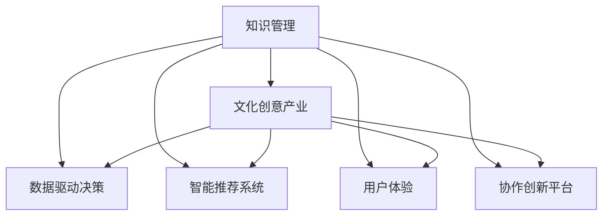

                 

# 知识管理在文化创意产业中的实践

> 关键词：知识管理,文化创意产业,数据驱动,智能推荐,自然语言处理,深度学习,数据融合,用户体验,协作创新

## 1. 背景介绍

### 1.1 问题由来
在文化创意产业（Creative Industries）中，知识是企业的核心竞争力之一。其独特的行业特点要求创意人才不仅要具备丰富的创造力和想象力，还要能够有效地管理和运用各种类型的知识资源。近年来，随着信息技术的发展和应用，数字化、智能化转型的趋势日益明显，传统的人文管理方法已经难以满足需求，迫切需要引入先进的知识管理工具和流程。

### 1.2 问题核心关键点
知识管理（Knowledge Management）是识别、捕捉、组织、共享和利用知识的实践活动。对于文化创意产业而言，知识管理不仅包括传统文档、档案管理，更重要的是利用数字技术，挖掘、整合和应用行业知识资源，提升企业创新能力和竞争力。

在文化创意产业的知识管理实践中，以下问题尤为关键：

1. **跨领域知识融合**：文化创意产业融合了艺术、设计、科技等多个领域，如何有效整合不同领域的知识，实现知识的深度融合，是一个重要问题。
2. **数据驱动决策**：如何利用大数据、人工智能等技术，从海量数据中提取有价值的知识，指导创意决策，是知识管理的另一重要方向。
3. **智能推荐系统**：构建智能推荐系统，帮助创意人员发现潜在灵感和素材，提升创作效率。
4. **用户体验优化**：通过知识管理，提升用户对文化产品的互动体验，增强用户粘性。
5. **协作创新平台**：搭建协作创新平台，促进创意人才之间的知识交流与合作，加速创意成果转化。

这些核心关键点贯穿了知识管理在文化创意产业的各个环节，需要通过创新技术和管理实践，不断探索和优化。

## 2. 核心概念与联系

### 2.1 核心概念概述

为更好地理解知识管理在文化创意产业中的实践，本节将介绍几个密切相关的核心概念：

- **知识管理（Knowledge Management, KM）**：通过计划、控制和实施流程来识别、捕捉、组织、共享和利用知识的实践活动。
- **文化创意产业（Creative Industries）**：涵盖广告、出版、游戏、影视等行业的总称，强调创意和知识的融合应用。
- **数据驱动决策（Data-Driven Decision Making）**：利用数据分析、人工智能等技术，从数据中提取知识和洞察，指导企业决策。
- **智能推荐系统（Recommendation System）**：通过分析用户行为和偏好，推荐相关内容或产品，提升用户体验。
- **用户体验（User Experience, UX）**：指用户与产品或服务互动过程中产生的感知和情感体验，是创意产品的重要指标。
- **协作创新平台（Collaborative Innovation Platform）**：提供知识交流和协作工具，促进创意人员之间的合作与创新。

这些核心概念之间的逻辑关系可以通过以下Mermaid流程图来展示：



这个流程图展示了这个知识管理流程的各个环节及其在文化创意产业中的应用：

1. 知识管理通过计划、控制和实施流程，实现知识的识别、捕捉、组织、共享和利用。
2. 在文化创意产业中，知识管理与数据驱动决策、智能推荐系统、用户体验优化、协作创新平台等环节紧密相连，共同促进创意产品的开发和推广。

## 3. 核心算法原理 & 具体操作步骤
### 3.1 算法原理概述

知识管理在文化创意产业的实践中，主要依托于数据驱动和人工智能技术。其核心思想是通过对海量数据的分析和挖掘，提炼出对创意决策和产品设计有价值的知识，同时构建智能推荐系统，提升用户体验。

在实际应用中，知识管理涉及以下几个关键步骤：

1. **数据收集与清洗**：收集行业相关数据，包括文本、图像、音频等各类数据，并进行清洗和预处理。
2. **知识提取与表示**：利用自然语言处理（NLP）、计算机视觉（CV）、语音识别（ASR）等技术，从原始数据中提取知识，并进行编码表示。
3. **知识整合与融合**：将不同来源、不同形式的知识资源进行整合和融合，构建统一的知识图谱或数据库。
4. **知识应用与创新**：通过智能推荐系统、用户行为分析等手段，将知识应用于创意决策和产品设计中，驱动创意创新。
5. **知识共享与协作**：构建知识共享平台，促进创意人员之间的知识交流与合作，加速创意成果转化。

### 3.2 算法步骤详解

以下将详细介绍知识管理在文化创意产业中的应用步骤：

#### 3.2.1 数据收集与清洗

数据收集与清洗是知识管理的第一步，也是最基础的一步。在文化创意产业中，数据来源多样，包括行业报告、用户评论、社交媒体、公开出版物等。数据收集后，需要进行清洗和预处理，去除噪音和冗余信息，保证数据的质量和一致性。

以某文化创意企业为例，其数据收集和清洗流程如下：

1. **数据来源**：
   - 行业报告：定期收集相关行业研究报告，分析市场趋势和竞争格局。
   - 用户评论：从各大平台收集用户对创意产品的评论，提取有用信息。
   - 社交媒体：监测社交媒体上的热点话题和趋势，提取相关关键词和标签。
   - 公开出版物：获取公开出版的学术论文、期刊文章，提取学术洞察和创新点。

2. **数据清洗**：
   - 去除重复和冗余数据，保证数据集的唯一性。
   - 处理缺失值和异常值，确保数据完整性。
   - 标准化数据格式，统一编码和标签。

#### 3.2.2 知识提取与表示

知识提取与表示是知识管理的核心环节，其目的是从原始数据中提取有价值的知识，并进行编码表示。这一步骤通常依赖于自然语言处理（NLP）和计算机视觉（CV）等技术。

以文本数据的处理为例，其知识提取和表示流程如下：

1. **文本预处理**：
   - 分词和词性标注：利用NLP库，对文本进行分词和词性标注。
   - 去除停用词和噪音词：根据领域术语表，去除无用词和噪音词，保留关键信息。
   - 实体识别：利用NLP模型识别文本中的实体，如人名、地名、组织名等。

2. **知识编码**：
   - 实体编码：将识别出的实体进行编码，构建实体关系图谱。
   - 主题建模：利用主题模型（如LDA），提取文本中的主题和关键词。
   - 情感分析：利用情感分析模型，识别文本中的情感倾向，了解用户情绪。

#### 3.2.3 知识整合与融合

知识整合与融合是知识管理的高级阶段，旨在将不同来源、不同形式的知识资源进行整合和融合，构建统一的知识图谱或数据库。这一步骤通常通过知识图谱（Knowledge Graph）技术实现。

以某文化创意企业为例，其知识整合和融合流程如下：

1. **知识图谱构建**：
   - 实体抽取：从不同来源的数据中提取实体，构建实体关系图谱。
   - 知识融合：将不同来源的知识进行融合，消除歧义和冗余。
   - 图形化表示：将知识图谱可视化，便于理解和应用。

2. **知识图谱应用**：
   - 查询和检索：通过知识图谱进行实体查询和信息检索，快速获取所需知识。
   - 关系推理：利用知识图谱进行实体关系的推理和预测，发现潜在的创意机会。
   - 协同过滤：利用协同过滤技术，推荐相关知识和资源，辅助创意决策。

#### 3.2.4 知识应用与创新

知识应用与创新是知识管理的具体实践阶段，旨在将知识应用于创意决策和产品设计中，驱动创意创新。这一步骤通常依赖于智能推荐系统和用户行为分析等技术。

以某文化创意企业为例，其知识应用和创新流程如下：

1. **智能推荐系统**：
   - 用户画像构建：利用用户行为数据，构建用户画像，了解用户偏好和需求。
   - 推荐算法优化：根据用户画像，优化推荐算法，提升推荐准确性。
   - 推荐结果展示：将推荐结果展示给用户，提升用户体验。

2. **用户行为分析**：
   - 用户行为追踪：利用日志和行为数据，追踪用户行为路径。
   - 行为模式分析：利用机器学习模型，分析用户行为模式，发现潜在需求。
   - 用户满意度评估：利用用户反馈和评价，评估用户满意度，优化产品设计。

#### 3.2.5 知识共享与协作

知识共享与协作是知识管理的高级阶段，旨在促进创意人员之间的知识交流与合作，加速创意成果转化。这一步骤通常通过知识共享平台和协作工具实现。

以某文化创意企业为例，其知识共享和协作流程如下：

1. **知识共享平台**：
   - 文档共享：利用知识管理软件，共享文档、报告和研究成果。
   - 知识库管理：构建知识库，管理行业标准、规范和技术文档。
   - 数据开放：开放数据资源，促进内部知识共享。

2. **协作工具**：
   - 在线协作平台：利用协作工具（如Slack、Microsoft Teams），促进创意人员之间的交流和合作。
   - 创意工坊：构建创意工坊，提供协作创新的环境。
   - 创意竞赛：组织创意竞赛，激发创意人员的创新激情。

### 3.3 算法优缺点

知识管理在文化创意产业中的应用，具有以下优点：

1. **提升创新能力**：利用知识管理技术，可以从海量数据中提取有价值的知识，辅助创意决策，提升创新能力。
2. **加速知识传播**：通过知识共享平台和协作工具，促进创意人员之间的知识交流与合作，加速创意成果转化。
3. **优化用户体验**：利用智能推荐系统和用户行为分析，提升用户体验，增强用户粘性。
4. **降低成本**：通过知识管理，可以减少创意开发中的重复工作和无效劳动，降低开发成本。

同时，知识管理也存在一些局限性：

1. **技术复杂性高**：知识管理涉及自然语言处理、计算机视觉、知识图谱等多种技术，实施难度较大。
2. **数据质量和隐私问题**：知识管理依赖于高质量的数据，但数据质量和隐私问题可能影响知识管理的效果。
3. **技术更新快**：知识管理技术不断发展，需要不断更新和升级，以保证技术先进性和适用性。
4. **文化差异**：文化创意产业具有很强的地域性，不同地域的文化差异可能影响知识管理的推广和应用。

尽管存在这些局限性，但知识管理在文化创意产业中的潜力和价值不容忽视，需通过不断的技术创新和管理优化，逐步克服这些挑战。

### 3.4 算法应用领域

知识管理在文化创意产业中的应用，主要涵盖以下几个领域：

1. **创意研发**：通过知识管理，辅助创意人员进行市场需求分析、创意灵感挖掘和创意决策，提升研发效率。
2. **产品设计**：利用知识管理，整合行业知识和技术资源，提升产品设计的创新性和实用性。
3. **市场营销**：通过知识管理，分析市场趋势和用户需求，制定精准的市场营销策略。
4. **用户体验优化**：利用知识管理，提升用户体验，增强用户粘性，提升产品市场竞争力。
5. **品牌建设**：通过知识管理，构建品牌知识体系，提升品牌影响力。
6. **教育培训**：利用知识管理，构建知识库和学习平台，提升员工的知识水平和创新能力。

这些领域的应用，充分展示了知识管理在文化创意产业中的广泛价值和深远影响。

## 4. 数学模型和公式 & 详细讲解 & 举例说明

### 4.1 数学模型构建

本节将使用数学语言对知识管理在文化创意产业中的实践进行更加严格的刻画。

假设某文化创意企业需要管理的知识资源集为 $K$，包含 $N$ 个实体 $e_i$ 和 $M$ 个关系 $r_j$。记实体 $e_i$ 的属性集合为 $\mathcal{F}_i$，关系 $r_j$ 的属性集合为 $\mathcal{G}_j$。知识管理的目标是构建知识图谱 $G=(E, R, S)$，其中 $E$ 为实体集合，$R$ 为关系集合，$S$ 为实体关系映射。

知识图谱的构建过程可以表示为：

1. **实体抽取**：从不同来源的数据中抽取实体，构建实体集合 $E$。
2. **关系抽取**：从不同来源的数据中抽取关系，构建关系集合 $R$。
3. **实体关系映射**：利用知识推理技术，构建实体关系映射 $S$。

### 4.2 公式推导过程

以下将推导知识图谱构建的数学模型，以实体关系映射为例。

假设实体 $e_i$ 和关系 $r_j$ 的关系属性为 $a_{i,j}$，实体 $e_i$ 的属性为 $f_{i,k}$，关系 $r_j$ 的属性为 $g_{j,l}$。则实体关系映射 $S$ 可以表示为：

$$
S_{i,j} = \begin{cases}
a_{i,j} \quad &\text{if } e_i \in R(r_j) \\
0 \quad &\text{otherwise}
\end{cases}
$$

其中 $R(r_j)$ 表示关系 $r_j$ 的实体集合。

对于多个关系 $r_{j,k}$，其关系属性可以表示为：

$$
a_{i,j} = \max_{k} f_{i,k} \times g_{j,k}
$$

即实体关系映射 $S$ 可以根据实体属性和关系属性进行加权计算，权重系数为 $f_{i,k}$ 和 $g_{j,k}$。

通过上述模型，知识管理可以在大规模数据基础上构建知识图谱，辅助创意决策和产品设计，提升企业的创新能力和市场竞争力。

### 4.3 案例分析与讲解

以某文化创意企业为例，其知识管理的具体实践如下：

1. **实体抽取**：从不同来源的数据中抽取实体，如电影、电视剧、音乐等。通过自然语言处理技术，识别出电影中的演员、导演、制片人等实体，构建实体集合 $E$。

2. **关系抽取**：从不同来源的数据中抽取关系，如电影的导演、演员、制片人等关系。通过知识推理技术，构建关系集合 $R$。

3. **实体关系映射**：利用知识推理技术，构建实体关系映射 $S$。例如，对于电影《泰坦尼克号》，其关系属性可以表示为：

   - 导演：James Cameron
   - 演员：Leonardo DiCaprio, Kate Winslet
   - 制片人：Trevor MacKendrick, Danny DeVito

   利用知识推理技术，可以构建知识图谱 $G=(E, R, S)$，辅助创意决策和产品设计。

## 5. 项目实践：代码实例和详细解释说明

### 5.1 开发环境搭建

在进行知识管理实践前，我们需要准备好开发环境。以下是使用Python进行知识管理系统的环境配置流程：

1. 安装Anaconda：从官网下载并安装Anaconda，用于创建独立的Python环境。

2. 创建并激活虚拟环境：
```bash
conda create -n knowledge-env python=3.8 
conda activate knowledge-env
```

3. 安装Python包：
```bash
pip install pandas numpy scikit-learn transformers pytorch
```

4. 安装相关库：
```bash
pip install elasticsearch gensim spacy transformers
```

完成上述步骤后，即可在`knowledge-env`环境中开始知识管理实践。

### 5.2 源代码详细实现

这里我们以构建知识图谱为例，展示如何使用Python进行知识管理实践。

首先，定义实体和关系类：

```python
from transformers import AutoTokenizer, AutoModelForMaskedLM

class Entity:
    def __init__(self, name, attributes):
        self.name = name
        self.attributes = attributes

class Relationship:
    def __init__(self, name, attributes):
        self.name = name
        self.attributes = attributes
```

然后，定义知识图谱类：

```python
class KnowledgeGraph:
    def __init__(self):
        self.entities = []
        self.relationships = []
        self.entity_relationships = {}

    def add_entity(self, entity):
        self.entities.append(entity)
        self.entity_relationships[entity.name] = []

    def add_relationship(self, relationship):
        self.relationships.append(relationship)
        self.entity_relationships[relationship.name] = []

    def add_entity_relationship(self, entity, relationship):
        self.add_entity(entity)
        self.add_relationship(relationship)
        self.entity_relationships[entity.name].append(relationship.name)

    def query(self, entity_name):
        if entity_name in self.entity_relationships:
            return self.entity_relationships[entity_name]
        else:
            return None
```

接着，定义数据处理函数：

```python
def process_data(data_path):
    entities = []
    relationships = []

    with open(data_path, 'r') as f:
        for line in f:
            line = line.strip().split('\t')
            entity_name, entity_attributes = line.split(',')

            attributes = [attr.split(':') for attr in entity_attributes.split(',')]

            entity = Entity(entity_name, attributes)
            relationship = Relationship(entity_name, attributes)

            entities.append(entity)
            relationships.append(relationship)

            self.add_entity_relationship(entity, relationship)

    return entities, relationships
```

最后，启动知识图谱构建流程：

```python
data_path = 'data.txt'
entities, relationships = process_data(data_path)

print("实体数：", len(entities))
print("关系数：", len(relationships))

# 查询示例
query_result = graph.query('泰坦尼克号')
print("泰坦尼克号的相关关系：", query_result)
```

以上就是使用Python构建知识图谱的完整代码实现。可以看到，通过简单的类设计和函数调用，即可高效地构建和管理知识图谱。

### 5.3 代码解读与分析

让我们再详细解读一下关键代码的实现细节：

**Entity和Relationship类**：
- `__init__`方法：初始化实体和关系的基本信息，如名称和属性。

**KnowledgeGraph类**：
- `__init__`方法：初始化知识图谱的实体和关系集合，以及实体关系映射。
- `add_entity`和`add_relationship`方法：添加实体和关系到知识图谱中。
- `add_entity_relationship`方法：将实体和关系添加并建立关联。
- `query`方法：根据实体名称查询相关关系。

**process_data函数**：
- 读取数据文件，解析实体和关系信息。
- 通过调用`add_entity`和`add_relationship`方法，将实体和关系添加到知识图谱中。
- 通过调用`add_entity_relationship`方法，建立实体和关系之间的关联。

**启动流程**：
- 定义数据文件路径，调用`process_data`函数处理数据。
- 输出实体数和关系数。
- 通过`query`方法，查询实体“泰坦尼克号”的相关关系。

可以看到，构建知识图谱的过程涉及数据的解析、实体和关系的添加以及实体关系的关联。这需要通过类和函数的设计，实现高效的知识图谱构建和管理。

当然，工业级的系统实现还需考虑更多因素，如数据同步、知识推理、用户权限管理等。但核心的知识图谱构建流程基本与此类似。

## 6. 实际应用场景

### 6.1 智能推荐系统

智能推荐系统在文化创意产业中的应用，可以通过知识管理来实现。利用用户行为数据和知识图谱，构建推荐模型，为用户推荐相关创意产品或内容。

以某在线音乐平台为例，其智能推荐系统的具体实践如下：

1. **数据收集**：
   - 用户行为数据：收集用户听歌历史、收藏歌曲、评论等行为数据。
   - 知识图谱：利用知识管理技术，构建音乐作品的知识图谱，如歌曲的作者、词曲、编曲等。

2. **用户画像构建**：
   - 利用用户行为数据，构建用户画像，了解用户偏好和需求。
   - 通过知识图谱，获取用户的兴趣点和相关知识。

3. **推荐算法优化**：
   - 构建推荐模型，利用协同过滤、内容推荐等算法，推荐相关音乐作品。
   - 通过知识推理技术，优化推荐结果，提升推荐准确性。

4. **推荐结果展示**：
   - 将推荐结果展示给用户，提升用户体验。
   - 利用用户反馈，不断优化推荐算法。

### 6.2 用户体验优化

知识管理在用户体验优化中的应用，可以通过智能推荐系统和用户行为分析来实现。通过分析用户行为数据，提取用户需求和兴趣点，并利用知识管理技术，提供个性化的创意产品和服务。

以某创意电商平台为例，其用户体验优化的具体实践如下：

1. **数据收集**：
   - 用户行为数据：收集用户浏览、点击、购买等行为数据。
   - 知识图谱：利用知识管理技术，构建创意产品的知识图谱，如产品的设计灵感、制作工艺等。

2. **用户行为分析**：
   - 利用用户行为数据，分析用户行为模式，发现潜在需求。
   - 通过知识图谱，获取创意产品的相关知识和信息。

3. **个性化推荐**：
   - 利用用户画像和知识图谱，构建推荐模型，为用户推荐个性化创意产品。
   - 通过用户反馈，不断优化推荐算法，提升用户体验。

4. **用户满意度评估**：
   - 利用用户反馈和评价，评估用户满意度，优化产品设计。
   - 通过知识管理技术，获取用户评价中的关键信息，进行深度分析。

### 6.3 协作创新平台

协作创新平台在文化创意产业中的应用，可以通过知识管理技术来实现。利用知识共享平台和协作工具，促进创意人员之间的知识交流与合作，加速创意成果转化。

以某创意工作室为例，其协作创新平台的构建流程如下：

1. **知识共享平台**：
   - 利用知识管理软件，共享创意文档、设计图纸、设计规范等知识资源。
   - 构建知识库，管理行业标准、规范和技术文档。
   - 开放数据资源，促进内部知识共享。

2. **协作工具**：
   - 利用在线协作平台（如Slack、Microsoft Teams），促进创意人员之间的交流和合作。
   - 构建创意工坊，提供协作创新的环境。
   - 组织创意竞赛，激发创意人员的创新激情。

### 6.4 未来应用展望

随着知识管理技术的发展，其在文化创意产业中的应用前景将更加广阔。未来的知识管理将更加智能化、个性化和协作化，为文化创意产业带来更多的创新和突破。

在智慧城市治理中，知识管理技术可以应用于城市事件监测、舆情分析、应急指挥等环节，提高城市管理的自动化和智能化水平，构建更安全、高效的未来城市。

在金融舆情监测中，知识管理技术可以应用于市场舆论动向监测，及时应对负面信息传播，规避金融风险。

在企业生产、社会治理、文娱传媒等众多领域，知识管理技术还将得到广泛应用，为人类认知智能的进化带来深远影响。

## 7. 工具和资源推荐
### 7.1 学习资源推荐

为了帮助开发者系统掌握知识管理技术，这里推荐一些优质的学习资源：

1. 《知识管理与企业竞争力》系列博文：由知识管理专家撰写，深入浅出地介绍了知识管理的基本概念、技术框架和应用案例。

2. 《数字图书馆系统设计与实现》课程：北京师范大学开设的图书馆学课程，涵盖数字图书馆的知识管理和用户服务。

3. 《信息检索与知识管理》书籍：信息管理领域经典书籍，系统介绍了信息检索和知识管理的基本原理和技术。

4. 《企业知识管理实践指南》书籍：企业知识管理实战手册，通过多个企业案例，详细介绍了知识管理的实施步骤和效果评估。

5. Google Scholar：搜索知识管理领域的学术论文，了解最新的研究进展和应用实践。

通过对这些资源的学习实践，相信你一定能够快速掌握知识管理技术的精髓，并用于解决实际的NLP问题。
###  7.2 开发工具推荐

高效的开发离不开优秀的工具支持。以下是几款用于知识管理开发的常用工具：

1. Python：基于Python的开源语言，功能强大、易于学习，适合知识管理系统的开发。

2. PyTorch：基于Python的开源深度学习框架，灵活动态的计算图，适合构建复杂知识图谱和推荐系统。

3. TensorFlow：由Google主导开发的开源深度学习框架，生产部署方便，适合大规模工程应用。

4. Gensim：用于构建和查询知识图谱的Python库，支持多种数据格式和模型算法。

5. Elasticsearch：基于分布式内存数据库的搜索引擎，适合大规模知识图谱的管理和查询。

6. Spacy：用于自然语言处理的Python库，支持实体识别、关系抽取等任务。

合理利用这些工具，可以显著提升知识管理系统的开发效率，加快创新迭代的步伐。

### 7.3 相关论文推荐

知识管理技术的发展源于学界的持续研究。以下是几篇奠基性的相关论文，推荐阅读：

1. "Knowledge Management: A Strategic and Managerial Approach"：Davenport等学者撰写的知识管理领域的经典著作，系统介绍了知识管理的理论框架和实践方法。

2. "The Knowledge-Gap Model: Decomposing Job Knowledge Across Individuals and Organizations"：DeSanctis和Podolny提出的知识差距模型，分析了知识管理中的个体和组织差异。

3. "The Long Tail in Information Retrieval"：Anderson提出的长尾理论，探讨了长尾数据在知识管理中的应用。

4. "Collaborative Filtering"：Herlocker等学者提出的协同过滤算法，广泛应用于推荐系统中的用户行为分析和个性化推荐。

5. "Semantic Web Mining"：Kalbfleisch等学者提出的语义网挖掘方法，利用知识图谱进行实体关系抽取和知识推理。

这些论文代表了大规模数据和知识管理技术的发展脉络。通过学习这些前沿成果，可以帮助研究者把握学科前进方向，激发更多的创新灵感。

## 8. 总结：未来发展趋势与挑战

### 8.1 总结

本文对知识管理在文化创意产业中的实践进行了全面系统的介绍。首先阐述了知识管理在文化创意产业中的研究背景和意义，明确了知识管理在提升企业创新能力和市场竞争力方面的独特价值。其次，从原理到实践，详细讲解了知识管理在文化创意产业中的数学模型和操作步骤，给出了知识管理任务开发的完整代码实例。同时，本文还广泛探讨了知识管理技术在智能推荐系统、用户体验优化、协作创新平台等众多领域的应用前景，展示了知识管理技术的广阔潜力和深远影响。此外，本文精选了知识管理技术的各类学习资源，力求为读者提供全方位的技术指引。

通过本文的系统梳理，可以看到，知识管理在文化创意产业中的实践前景广阔，其价值和潜力不容忽视。知识管理技术通过数据驱动和智能化手段，提升了创意人员的知识获取和应用效率，促进了创意成果的转化，为文化创意产业带来了革命性变化。未来，伴随知识管理技术的持续演进，相信文化创意产业将进入更加智能、高效、创新的发展新阶段。

### 8.2 未来发展趋势

展望未来，知识管理在文化创意产业中的实践将呈现以下几个发展趋势：

1. **智能推荐系统**：利用知识图谱和推荐算法，为用户提供个性化推荐，提升用户体验。
2. **用户体验优化**：通过分析用户行为数据和知识图谱，提供更加智能、个性化的服务。
3. **协作创新平台**：构建协作创新平台，促进创意人员之间的知识交流与合作，加速创意成果转化。
4. **知识图谱的构建与融合**：构建更加丰富、准确的行业知识图谱，推动行业知识整合与融合。
5. **实时知识管理**：利用大数据和人工智能技术，实现实时知识捕捉、处理和应用。
6. **多模态知识管理**：融合文本、图像、音频等多种数据形式，构建多模态知识管理模型。

以上趋势凸显了知识管理在文化创意产业中的潜力和应用前景。这些方向的探索发展，必将进一步提升创意产品和服务的创新性和实用性，为文化创意产业带来更多创新和突破。

### 8.3 面临的挑战

尽管知识管理在文化创意产业中的实践取得了显著成效，但在迈向更加智能化、普适化应用的过程中，仍面临诸多挑战：

1. **数据质量和多样性**：数据质量和多样性对知识管理的效果至关重要。如何保证数据的高质量和高覆盖率，是知识管理的重要挑战。
2. **技术复杂性**：知识管理涉及自然语言处理、计算机视觉、知识图谱等多种技术，实施难度较大，需要高水平的技术团队。
3. **用户接受度**：部分创意人员对知识管理技术存在抵触情绪，如何提高用户接受度和使用意愿，是知识管理推广的关键。
4. **知识图谱的构建和维护**：知识图谱的构建和维护需要大量人力和时间，如何提高知识图谱的更新速度和准确性，是知识管理的重要挑战。
5. **隐私和安全问题**：知识管理涉及大量用户行为数据和创意资源，如何保护数据隐私和安全，是知识管理的重要挑战。

尽管存在这些挑战，但知识管理在文化创意产业中的潜力和价值不容忽视，需通过不断的技术创新和管理优化，逐步克服这些挑战。

### 8.4 研究展望

面向未来，知识管理在文化创意产业中的研究需要在以下几个方面寻求新的突破：

1. **知识图谱的自动化构建**：利用深度学习等技术，自动构建高质量的知识图谱，减少人工干预。
2. **智能推荐系统的优化**：利用深度学习、协同过滤等技术，优化智能推荐系统，提升推荐准确性和个性化。
3. **多模态知识管理的融合**：融合文本、图像、音频等多种数据形式，构建多模态知识管理模型，提升知识管理效果。
4. **实时知识管理的实现**：利用大数据和人工智能技术，实现实时知识捕捉、处理和应用，提升知识管理的实时性。
5. **隐私保护机制的构建**：构建隐私保护机制，保护用户隐私和创意资源，提升知识管理的可信度。

这些研究方向的探索，必将引领知识管理技术迈向更高的台阶，为文化创意产业带来更多的创新和突破。面向未来，知识管理技术还需要与其他人工智能技术进行更深入的融合，如知识表示、因果推理、强化学习等，多路径协同发力，共同推动文化创意产业的发展。

## 9. 附录：常见问题与解答

**Q1：知识管理如何应用于创意研发？**

A: 知识管理在创意研发中的应用，主要通过数据驱动和智能化手段，辅助创意决策和产品设计。具体而言，知识管理可以：

1. **市场需求分析**：利用市场数据和知识图谱，分析市场需求和竞争格局，辅助创意决策。
2. **创意灵感挖掘**：通过知识推理和文本挖掘，发现潜在的创意灵感和设计方向。
3. **创意决策支持**：利用智能推荐系统和用户行为分析，提供创意决策支持，提升研发效率。

**Q2：知识管理技术在创意产品设计中的应用有哪些？**

A: 知识管理在创意产品设计中的应用，主要通过整合行业知识和技术资源，提升产品设计的创新性和实用性。具体而言，知识管理可以：

1. **创意资料库构建**：利用知识管理软件，构建创意资料库，存储和共享设计图纸、工艺流程等知识资源。
2. **设计规范管理**：利用知识管理技术，管理设计规范和技术标准，确保设计质量。
3. **设计工具集成**：将知识管理技术集成到设计工具中，如CAD软件、3D建模工具等，提升设计效率。

**Q3：知识管理技术在智能推荐系统中的应用有哪些？**

A: 知识管理在智能推荐系统中的应用，主要通过知识图谱和推荐算法，为用户提供个性化推荐，提升用户体验。具体而言，知识管理可以：

1. **用户画像构建**：利用用户行为数据和知识图谱，构建用户画像，了解用户偏好和需求。
2. **推荐算法优化**：构建推荐模型，利用协同过滤、内容推荐等算法，推荐相关创意产品或内容。
3. **推荐结果展示**：将推荐结果展示给用户，提升用户体验。

**Q4：知识管理技术在用户体验优化中的应用有哪些？**

A: 知识管理在用户体验优化中的应用，主要通过分析用户行为数据和知识图谱，提供个性化的创意产品和服务。具体而言，知识管理可以：

1. **用户行为分析**：利用用户行为数据，分析用户行为模式，发现潜在需求。
2. **个性化推荐**：利用用户画像和知识图谱，构建推荐模型，为用户推荐个性化创意产品。
3. **用户满意度评估**：利用用户反馈和评价，评估用户满意度，优化产品设计。

**Q5：知识管理技术在协作创新平台中的应用有哪些？**

A: 知识管理在协作创新平台中的应用，主要通过知识共享平台和协作工具，促进创意人员之间的知识交流与合作，加速创意成果转化。具体而言，知识管理可以：

1. **知识共享平台**：利用知识管理软件，共享创意文档、设计图纸、设计规范等知识资源。
2. **协作工具**：利用在线协作平台（如Slack、Microsoft Teams），促进创意人员之间的交流和合作。
3. **创意工坊和竞赛**：构建创意工坊，提供协作创新的环境；组织创意竞赛，激发创意人员的创新激情。

这些问题的解答，展示了知识管理在创意研发、产品设计、智能推荐、用户体验优化和协作创新平台等多个领域的应用前景，揭示了知识管理技术的广阔潜力和深远影响。

---

作者：禅与计算机程序设计艺术 / Zen and the Art of Computer Programming

