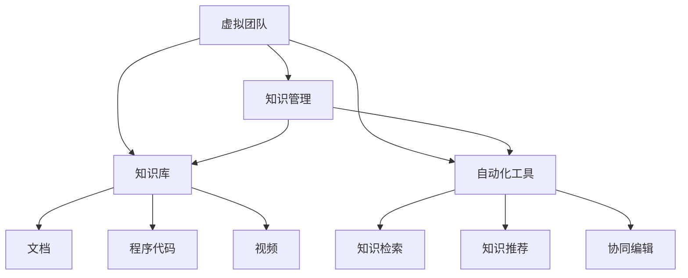

                 

# 知识管理在虚拟团队中的实践

> 关键词：知识管理,虚拟团队,协同工作,知识库,自动化工具,信息管理,知识共享,知识协同,远程工作

## 1. 背景介绍

### 1.1 问题由来
随着全球化和数字化进程的加速，虚拟团队在企业中的应用日益广泛。虚拟团队由地理位置分散的成员组成，通过在线协作工具和平台进行沟通、共享和合作，打破了时间和空间的限制。这种新型的团队模式为企业带来了更灵活的组织结构和更高的工作效率，但同时也面临着沟通不充分、协作难度大、知识流动不畅等问题。

知识管理（Knowledge Management, KM）是一种通过有组织地收集、存储、共享和应用组织内外部知识的过程。在虚拟团队中，知识管理尤为重要，因为知识的快速流动和共享能够显著提升团队的协作效率和创新能力。然而，虚拟团队中分散的成员、异步的沟通方式和多样化的工作习惯，使得传统知识管理方法难以有效实施。

### 1.2 问题核心关键点
虚拟团队的知识管理主要面临以下几个挑战：

- **知识隔离**：团队成员在不同时区和地理位置上的工作安排导致知识共享和交流不畅。
- **异步协作**：虚拟团队的工作节奏和沟通方式异步，难以实现实时交流。
- **知识沉淀**：缺乏系统化的知识库和文档管理机制，团队成员难以找到所需信息。
- **协作信任**：虚拟团队成员之间的信任感不足，影响知识共享意愿。

## 2. 核心概念与联系

### 2.1 核心概念概述

为更好地理解虚拟团队中的知识管理，本节将介绍几个关键概念及其相互关系：

- **虚拟团队（Virtual Team）**：由地理位置分散的成员组成，通过在线协作工具和平台进行沟通、共享和合作。
- **知识管理（Knowledge Management）**：通过有组织地收集、存储、共享和应用组织内外部知识的过程。
- **知识库（Knowledge Base）**：一个集中存储和管理知识资源的数据库，包括文档、数据、程序代码、视频等多种形式。
- **自动化工具（Automated Tools）**：使用软件和算法自动化的知识管理工具，如知识检索、知识推荐、协同编辑等。
- **信息管理（Information Management）**：对信息进行收集、整理、存储和共享的管理过程。
- **知识共享（Knowledge Sharing）**：团队成员之间通过交流和分享知识的过程。
- **知识协同（Knowledge Collaboration）**：团队成员共同参与知识收集、共享和应用的活动。
- **远程工作（Remote Work）**：通过网络进行办公和协作，不受时间和地点限制的工作模式。

这些概念之间的联系可以通过以下Mermaid流程图来展示：



这个流程图展示了虚拟团队中知识管理的关键要素及其相互关系：

1. 虚拟团队通过知识管理来提高知识共享和协作效率。
2. 知识管理依赖于知识库和自动化工具的支持。
3. 知识库包括文档、程序代码、视频等多种形式的资源。
4. 自动化工具通过知识检索、推荐和协同编辑等技术提升知识管理效果。

## 3. 核心算法原理 & 具体操作步骤

### 3.1 算法原理概述

虚拟团队的知识管理主要通过以下步骤实现：

1. **知识收集**：团队成员在日常工作中生成和收集各类知识。
2. **知识存储**：将收集到的知识存储在集中管理的数据库中，如知识库、云存储等。
3. **知识整理**：对存储的知识进行分类、标注和组织，以便于检索和使用。
4. **知识共享**：通过在线协作工具和平台，团队成员之间进行知识共享和交流。
5. **知识应用**：团队成员在工作过程中应用共享的知识，提升工作效率和质量。

这些步骤涉及到多个核心算法，如知识分类、信息检索、知识推荐和协作平台等。

### 3.2 算法步骤详解

#### 3.2.1 知识收集
知识收集通常通过在线协作工具和平台实现，如Slack、Microsoft Teams等。团队成员在日常工作中生成和上传各类文档、代码、报告、会议记录等，以便后续整理和共享。

**步骤**：
1. 团队成员在协作工具中创建任务和文档。
2. 将生成的知识以附件或链接的形式上传到知识库。
3. 标注知识类型和主题，方便后续检索和使用。

#### 3.2.2 知识存储
知识存储通常使用云存储解决方案，如AWS S3、Google Cloud Storage等。知识库管理系统（KMS）也是常用的存储解决方案，如Confluence、Notion等。

**步骤**：
1. 选择合适的存储方案，建立统一的存储路径和命名规范。
2. 将知识按照类别和主题进行分类存储。
3. 定期备份和归档知识库，确保数据安全和完整性。

#### 3.2.3 知识整理
知识整理涉及对存储的知识进行分类、标注和组织，以便于检索和使用。这一步骤通常由知识管理工具自动完成，如JIRA、Trello等。

**步骤**：
1. 使用标签、分类、关键词等元数据标注知识。
2. 对知识进行自动分类，如按项目、客户、主题等分类。
3. 生成知识地图和目录，提供可视化视图。

#### 3.2.4 知识共享
知识共享通过在线协作工具和平台实现，如SharePoint、Google Drive等。团队成员可以在协作工具中查看、编辑和评论共享的知识。

**步骤**：
1. 创建共享文档和链接，提供访问权限。
2. 使用评论和讨论功能，促进知识交流。
3. 定期更新和维护共享的知识。

#### 3.2.5 知识应用
知识应用通过将知识集成到工作流程和任务中实现。这一步骤通常由工作管理工具（如Asana、JIRA等）和自动化工具（如Zapier、Integromat等）支持。

**步骤**：
1. 将知识嵌入到工作流程和任务中，如文档审批、会议提醒等。
2. 使用自动化工具将知识自动集成到相关任务和流程中。
3. 定期回顾和优化知识应用效果。

### 3.3 算法优缺点

虚拟团队的知识管理具有以下优点：

1. **灵活性**：知识库和协作工具可以跨平台使用，团队成员可以在不同设备和地点进行知识管理和共享。
2. **高效性**：自动化工具和知识检索技术可以大幅提高知识查找和应用效率。
3. **可追溯性**：知识库和协作工具提供详细的访问记录，方便追溯知识来源和使用情况。
4. **可扩展性**：云存储和知识库管理系统可以方便地扩展和更新，支持大规模知识管理。

同时，这一方法也存在以下缺点：

1. **依赖技术**：知识管理的效果高度依赖于协作工具和知识库管理系统的技术水平和数据质量。
2. **学习成本**：团队成员需要花时间学习使用知识库和协作工具，培训成本较高。
3. **数据隐私**：知识库和协作工具可能面临数据泄露和隐私保护问题。
4. **知识冗余**：多个团队成员可能上传相同内容，导致知识库冗余。
5. **更新频率**：知识库需要定期更新和维护，工作量较大。

### 3.4 算法应用领域

虚拟团队的知识管理在多个领域中得到广泛应用，包括但不限于：

- **软件开发**：代码审查、问题追踪、文档管理等。
- **市场销售**：客户需求分析、产品介绍、案例研究等。
- **产品设计**：设计图纸、原型、用户反馈等。
- **客户支持**：常见问题解答、FAQ、客户案例等。
- **培训与发展**：培训材料、课程、员工手册等。

## 4. 数学模型和公式 & 详细讲解 & 举例说明

### 4.1 数学模型构建

本节将使用数学语言对虚拟团队中的知识管理过程进行描述。

假设虚拟团队有 $N$ 个成员，每个成员生成的知识为 $K_i$，知识库中存储的知识为 $K$，知识库中的知识类型为 $T$，知识管理的参数为 $\theta$。知识管理的目标是最大化知识共享和协作效率，即：

$$
\max_{K_i, K} \sum_{i=1}^N \sum_{t \in T} W_{i,t} \log P(K_i \mid K_t, \theta)
$$

其中 $W_{i,t}$ 表示知识类型 $t$ 对成员 $i$ 的重要性，$P(K_i \mid K_t, \theta)$ 表示在知识库 $K_t$ 和知识管理参数 $\theta$ 的条件下，生成知识 $K_i$ 的概率。

### 4.2 公式推导过程

以下对知识管理的数学模型进行详细推导：

1. **知识生成概率**：知识管理工具通过自动化算法，将知识 $K_i$ 自动存储和分类。每个知识类型 $t$ 的概率为：

$$
P(K_i \mid K_t, \theta) = \frac{\exp(\theta^T \phi(K_i))}{\sum_{j=1}^M \exp(\theta^T \phi(K_j))}
$$

其中 $\phi(K_i)$ 是知识 $K_i$ 的特征向量，$\theta$ 是知识管理的参数向量。

2. **知识重要性权重**：根据知识类型 $t$ 的重要性和团队成员的贡献，计算每个成员 $i$ 生成的知识 $K_i$ 的重要性权重 $W_{i,t}$：

$$
W_{i,t} = \frac{I_i \cdot P(T=t)}{\sum_{j=1}^N I_j \cdot P(T=t)}
$$

其中 $I_i$ 表示成员 $i$ 的贡献度，$P(T=t)$ 表示知识类型 $t$ 出现的概率。

3. **知识共享和协作目标**：知识管理的最终目标是最大化知识共享和协作效率，即：

$$
\max_{K_i, K} \sum_{i=1}^N \sum_{t \in T} W_{i,t} \log P(K_i \mid K_t, \theta)
$$

通过以上推导，可以看出知识管理的目标是通过自动化算法和知识分类，最大化知识共享和协作的效果，提升团队的工作效率和创新能力。

### 4.3 案例分析与讲解

以软件开发为例，团队成员在日常工作中生成代码、文档、需求分析等知识。知识管理工具将生成的知识自动存储和分类，如GitHub、Confluence等。团队成员可以在协作工具中查看、编辑和评论共享的知识，如Slack、Microsoft Teams等。知识管理的目标是最大化代码质量、项目进度和团队协作效果。

**示例**：
- 代码审查：在GitHub中生成代码变更请求，自动关联到知识库中的需求和设计文档。
- 需求管理：在Confluence中生成需求文档，自动关联到GitHub中的代码变更。
- 项目管理：在JIRA中生成任务和里程碑，自动关联到知识库中的文档和案例。

通过以上示例可以看出，知识管理通过自动化工具和系统集成，可以大幅提升软件开发过程中的知识共享和协作效率。

## 5. 项目实践：代码实例和详细解释说明

### 5.1 开发环境搭建

在进行知识管理实践前，我们需要准备好开发环境。以下是使用Python进行知识管理的开发环境配置流程：

1. 安装Anaconda：从官网下载并安装Anaconda，用于创建独立的Python环境。

2. 创建并激活虚拟环境：
```bash
conda create -n knowledge-env python=3.8 
conda activate knowledge-env
```

3. 安装必要的Python包：
```bash
pip install flask numpy pandas requests
```

4. 安装协作工具和知识库管理系统：
```bash
conda install confluence
conda install git
```

完成上述步骤后，即可在`knowledge-env`环境中开始知识管理实践。

### 5.2 源代码详细实现

这里我们以知识库管理系统为例，给出使用Flask框架实现的知识管理系统的代码实现。

首先，定义知识库管理系统的数据模型：

```python
from flask_sqlalchemy import SQLAlchemy
from datetime import datetime

db = SQLAlchemy()

class KnowledgeBase(db.Model):
    id = db.Column(db.Integer, primary_key=True)
    name = db.Column(db.String(255), nullable=False)
    type = db.Column(db.String(255), nullable=False)
    content = db.Column(db.Text, nullable=False)
    created_at = db.Column(db.DateTime, default=datetime.utcnow)

class Document(db.Model):
    id = db.Column(db.Integer, primary_key=True)
    name = db.Column(db.String(255), nullable=False)
    content = db.Column(db.Text, nullable=False)
    created_at = db.Column(db.DateTime, default=datetime.utcnow)
```

然后，定义知识库管理系统的Flask应用：

```python
from flask import Flask, request, jsonify

app = Flask(__name__)

@app.route('/knowledge', methods=['POST'])
def add_knowledge():
    name = request.json.get('name')
    type = request.json.get('type')
    content = request.json.get('content')
    
    kb = KnowledgeBase(name=name, type=type, content=content)
    db.session.add(kb)
    db.session.commit()
    
    return jsonify({'id': kb.id}), 201

@app.route('/knowledge', methods=['GET'])
def get_knowledge():
    kb = KnowledgeBase.query.all()
    kb_json = []
    for k in kb:
        kb_json.append({'id': k.id, 'name': k.name, 'type': k.type, 'content': k.content, 'created_at': k.created_at})
    
    return jsonify(kb_json)

if __name__ == '__main__':
    app.run(debug=True)
```

最后，启动Flask应用：

```bash
flask run
```

在浏览器中访问 `http://localhost:5000/knowledge`，即可对知识库进行增删改查操作。

### 5.3 代码解读与分析

让我们再详细解读一下关键代码的实现细节：

**KnowledgeBase类**：
- `__init__`方法：初始化知识库的基本属性，包括名称、类型、内容等。
- `id`属性：数据库中的主键ID。
- `name`属性：知识库的名称。
- `type`属性：知识库的类型。
- `content`属性：知识库的内容。
- `created_at`属性：知识库的创建时间。

**Document类**：
- `__init__`方法：初始化文档的基本属性，包括名称、内容等。
- `id`属性：数据库中的主键ID。
- `name`属性：文档的名称。
- `content`属性：文档的内容。
- `created_at`属性：文档的创建时间。

**add_knowledge函数**：
- 从请求中获取知识库名称、类型和内容，创建新的知识库并保存到数据库中。
- 返回新知识库的ID。

**get_knowledge函数**：
- 从数据库中查询所有知识库，并返回JSON格式的列表。

通过以上代码实现，我们可以搭建一个基本的知识库管理系统，支持知识的增删改查操作。

## 6. 实际应用场景

### 6.1 智能制造
在智能制造领域，虚拟团队需要高效协作，共享知识库，以提升生产效率和产品质量。通过知识管理，团队成员可以在设计、生产和维护过程中共享各类文档、图纸、技术规范等知识，提升协作效率和创新能力。例如，制造企业可以通过知识库管理系统，对生产过程和设备维护进行知识管理，确保生产流程的稳定性和可追溯性。

### 6.2 远程医疗
远程医疗是虚拟团队知识管理的典型应用场景之一。医生和医疗技师在地理位置分散的情况下，需要高效协作，共享医疗知识和案例。通过知识管理，团队成员可以在诊断、治疗和教育过程中共享病历、影像、研究成果等知识，提升医疗质量和效率。例如，远程医疗平台可以通过知识库管理系统，对医疗知识进行分类和标注，支持医生和技师之间的知识共享和协作。

### 6.3 电子商务
电子商务平台涉及大量的客户需求和市场分析知识，虚拟团队需要通过知识管理来提升客户服务质量和市场响应速度。通过知识管理，团队成员可以共享客户反馈、市场报告、营销策略等知识，提升决策效率和客户满意度。例如，电商平台可以通过知识库管理系统，对客户需求和市场数据进行分类和分析，支持市场团队和客服团队的知识共享和协作。

### 6.4 未来应用展望

未来，虚拟团队的知识管理将呈现以下几个趋势：

1. **智能化知识管理**：通过引入人工智能和机器学习技术，知识管理可以变得更加智能化。例如，使用自然语言处理技术进行知识分类和标注，使用推荐算法进行知识推荐，使用机器学习进行知识生成等。
2. **可视化知识管理**：通过引入可视化工具，知识管理可以更加直观和易用。例如，使用知识地图和仪表盘展示知识库的结构和内容，支持团队成员快速查找和使用知识。
3. **协同知识管理**：通过引入协同工具，知识管理可以变得更加协作和实时。例如，使用在线协作工具和平台支持团队成员之间的实时交流和协作，使用知识协同工具支持团队成员之间的协作和讨论。
4. **自适应知识管理**：通过引入自适应技术，知识管理可以更加灵活和适应性强。例如，使用自适应学习算法根据团队成员的学习行为和偏好，推荐个性化的知识内容，支持团队成员的学习和成长。
5. **多模态知识管理**：通过引入多模态技术，知识管理可以更加丰富和全面。例如，支持文本、图片、视频等多种形式的知识管理，支持团队成员通过不同的渠道获取和分享知识。

## 7. 工具和资源推荐

### 7.1 学习资源推荐

为了帮助开发者系统掌握虚拟团队中的知识管理技术，这里推荐一些优质的学习资源：

1. **《知识管理与组织学习》（Knowledge Management and Organizational Learning）**：一本系统介绍知识管理理论和方法的经典书籍，涵盖知识管理的概念、框架和实践案例。
2. **《虚拟团队管理》（Virtual Team Management）**：一本介绍虚拟团队管理的书籍，涵盖虚拟团队的组织结构、沟通方式和协作工具等内容。
3. **《知识库管理工具选型指南》（Knowledge Management Tool Selection Guide）**：一篇详细介绍知识库管理工具的博客文章，涵盖知识库管理的最佳实践和工具推荐。
4. **《知识管理与人工智能》（Knowledge Management and Artificial Intelligence）**：一篇介绍知识管理与人工智能结合的博客文章，涵盖知识管理中的AI应用和前沿技术。
5. **《虚拟团队中的知识管理》（Knowledge Management in Virtual Teams）**：一篇介绍虚拟团队中知识管理的案例分析和最佳实践的博客文章，涵盖知识管理系统的搭建和优化。

通过对这些资源的学习实践，相信你一定能够快速掌握虚拟团队中的知识管理技术，并用于解决实际的虚拟团队管理问题。

### 7.2 开发工具推荐

高效的开发离不开优秀的工具支持。以下是几款用于虚拟团队中知识管理开发的常用工具：

1. **Flask**：一个轻量级的Web框架，支持快速搭建知识管理Web应用。
2. **SQLAlchemy**：一个Python ORM库，支持与关系型数据库的集成，方便数据管理和操作。
3. **Confluence**：一个知识管理平台，支持文档、知识库、项目空间等功能。
4. **GitHub**：一个代码托管平台，支持版本控制和协作。
5. **Slack**：一个协作平台，支持实时沟通和信息共享。
6. **Microsoft Teams**：一个协作平台，支持在线会议、文档共享和任务管理。

合理利用这些工具，可以显著提升虚拟团队中的知识管理开发效率，加快创新迭代的步伐。

### 7.3 相关论文推荐

虚拟团队中的知识管理涉及多个研究领域，以下是几篇奠基性的相关论文，推荐阅读：

1. **《知识共享与虚拟团队绩效》（Knowledge Sharing and Virtual Team Performance）**：一项关于知识共享与虚拟团队绩效的研究，探讨了知识共享对虚拟团队绩效的影响。
2. **《知识库管理的挑战与策略》（Challenges and Strategies of Knowledge Management）**：一项关于知识库管理的挑战与策略的研究，探讨了知识库管理中的问题与解决方案。
3. **《虚拟团队中的知识管理模型》（Knowledge Management Models in Virtual Teams）**：一篇关于虚拟团队中知识管理模型的研究，探讨了不同知识管理模型在虚拟团队中的应用。
4. **《知识共享与协作技术》（Knowledge Sharing and Collaboration Technologies）**：一项关于知识共享与协作技术的综述，探讨了不同知识共享与协作技术的应用和效果。
5. **《基于知识管理的虚拟团队协作》（Virtual Team Collaboration Based on Knowledge Management）**：一项关于基于知识管理的虚拟团队协作的研究，探讨了知识管理对虚拟团队协作的影响。

这些论文代表了大语言模型微调技术的发展脉络。通过学习这些前沿成果，可以帮助研究者把握学科前进方向，激发更多的创新灵感。

## 8. 总结：未来发展趋势与挑战

### 8.1 研究成果总结

本文对虚拟团队中的知识管理进行了全面系统的介绍。首先阐述了虚拟团队的知识管理背景和重要性，明确了知识管理在提升团队协作效率和创新能力方面的独特价值。其次，从原理到实践，详细讲解了知识管理的基本步骤和核心算法，给出了知识管理系统开发的完整代码实例。同时，本文还广泛探讨了知识管理在智能制造、远程医疗、电子商务等多个领域的应用前景，展示了知识管理范式的巨大潜力。最后，本文精选了知识管理的各类学习资源，力求为读者提供全方位的技术指引。

通过本文的系统梳理，可以看到，虚拟团队中的知识管理是一种能够提升团队协作效率和创新能力的有效手段。这种管理方法通过集中存储和管理知识，支持团队成员之间的知识共享和协作，能够大幅提升工作效率和质量。

### 8.2 未来发展趋势

展望未来，虚拟团队的知识管理将呈现以下几个发展趋势：

1. **智能化**：通过引入人工智能和机器学习技术，知识管理可以变得更加智能化。例如，使用自然语言处理技术进行知识分类和标注，使用推荐算法进行知识推荐，使用机器学习进行知识生成等。
2. **可视化**：通过引入可视化工具，知识管理可以更加直观和易用。例如，使用知识地图和仪表盘展示知识库的结构和内容，支持团队成员快速查找和使用知识。
3. **协同化**：通过引入协同工具，知识管理可以变得更加协作和实时。例如，使用在线协作工具和平台支持团队成员之间的实时交流和协作，使用知识协同工具支持团队成员之间的协作和讨论。
4. **自适应**：通过引入自适应技术，知识管理可以更加灵活和适应性强。例如，使用自适应学习算法根据团队成员的学习行为和偏好，推荐个性化的知识内容，支持团队成员的学习和成长。
5. **多模态化**：通过引入多模态技术，知识管理可以更加丰富和全面。例如，支持文本、图片、视频等多种形式的知识管理，支持团队成员通过不同的渠道获取和分享知识。

### 8.3 面临的挑战

尽管虚拟团队中的知识管理已经取得了一定成果，但在迈向更加智能化、协作化应用的过程中，仍面临诸多挑战：

1. **数据隐私**：知识库和协作工具可能面临数据泄露和隐私保护问题，需要制定严格的数据管理和隐私保护措施。
2. **技术复杂性**：知识管理涉及多个技术和工具，复杂度较高，需要团队成员具备较强的技术能力和协作意识。
3. **用户接受度**：知识管理工具的使用需要团队成员的广泛参与和支持，用户接受度不足可能会影响知识管理的效果。
4. **知识冗余**：多个团队成员可能上传相同内容，导致知识库冗余，需要有效的知识管理和筛选机制。
5. **知识质量**：知识库中存储的知识质量参差不齐，需要建立质量控制和审核机制。

### 8.4 研究展望

未来，虚拟团队的知识管理需要在以下几个方面寻求新的突破：

1. **引入AI技术**：利用自然语言处理、机器学习等AI技术提升知识管理的智能化水平，实现知识分类、推荐、生成等自动化功能。
2. **多模态融合**：引入多模态数据融合技术，支持文本、图片、视频等多种形式的知识管理，实现更全面和丰富的知识共享。
3. **自适应学习**：引入自适应学习技术，根据团队成员的学习行为和偏好，推荐个性化的知识内容，支持团队成员的学习和成长。
4. **知识图谱**：引入知识图谱技术，构建知识库中的知识关联图谱，实现知识的深度挖掘和应用。
5. **协同创新平台**：构建虚拟团队中的协同创新平台，支持团队成员之间的知识共享和协作，提升创新效率和质量。

这些研究方向的探索，必将引领虚拟团队中的知识管理技术迈向更高的台阶，为虚拟团队的协作和创新提供更加强大的技术支持。面向未来，虚拟团队中的知识管理还需要与其他人工智能技术进行更深入的融合，如知识表示、因果推理、强化学习等，多路径协同发力，共同推动虚拟团队的知识管理水平提升。

## 9. 附录：常见问题与解答

**Q1：如何选择合适的知识管理工具？**

A: 选择合适的知识管理工具需要考虑以下几个因素：
1. 功能需求：根据知识管理的具体需求，选择支持文档管理、协作、搜索等功能丰富的工具。
2. 技术平台：选择适合自己技术栈和团队习惯的工具，如基于Web的协作工具、基于本地的知识库管理系统等。
3. 用户友好性：选择易于使用、界面友好的工具，避免团队成员在学习和使用过程中产生阻力。
4. 成本预算：考虑工具的购买、部署和维护成本，选择性价比高的工具。

**Q2：知识管理工具的部署方式有哪些？**

A: 知识管理工具的部署方式主要有以下几种：
1. 云部署：将知识管理工具部署在云平台上，支持随时随地访问和协作。
2. 本地部署：将知识管理工具部署在本地服务器上，支持集中管理和访问。
3. 混合部署：结合云和本地部署，既享受云平台的便捷性，又保证数据的安全性和隐私性。

**Q3：知识管理工具如何进行数据备份和恢复？**

A: 知识管理工具通常提供数据备份和恢复功能，具体操作方式如下：
1. 数据备份：使用知识管理工具的备份功能，定期对知识库进行备份。
2. 数据恢复：在数据丢失或损坏时，使用备份数据进行恢复。
3. 版本控制：启用版本控制功能，记录知识库的变更历史，方便回溯和恢复。

**Q4：知识管理工具如何实现知识共享和协作？**

A: 知识管理工具通常通过以下方式实现知识共享和协作：
1. 文档共享：支持团队成员在线共享文档，并设置访问权限。
2. 版本控制：支持文档的版本管理和追踪，记录每个版本的变更记录。
3. 评论和讨论：支持团队成员在文档上添加评论和讨论，促进知识交流。
4. 协作工具：集成协作工具，如在线会议、任务管理等，支持团队成员之间的实时交流和协作。

**Q5：知识管理工具如何支持知识的自动分类和标注？**

A: 知识管理工具通常通过以下方式支持知识的自动分类和标注：
1. 标签和分类：使用标签和分类功能，对知识进行分类和标注。
2. 自然语言处理：使用自然语言处理技术，自动识别和分类知识，并进行标注。
3. 机器学习：使用机器学习算法，根据知识内容自动分类和标注。
4. 人工审核：结合人工审核机制，确保分类和标注的准确性和一致性。

通过对这些问题的回答，可以看出虚拟团队中的知识管理需要从技术、工具和流程等多个方面综合考虑，才能实现知识共享和协作的提升。

---

作者：禅与计算机程序设计艺术 / Zen and the Art of Computer Programming

