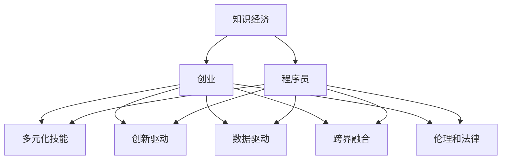

                 

# 知识经济下程序员的创业之道

## 1. 背景介绍

### 1.1 问题由来
当前，全球经济正加速向以知识为核心驱动力的知识经济转型。在这一背景下，以技术为核心的企业迎来新的发展机遇，特别是在人工智能、大数据、云计算等领域的创业者。然而，传统的创业思路已经不能满足知识经济的要求，程序员在创业过程中需要具备更多元化的技能和视野，以适应知识经济下的竞争环境。

### 1.2 问题核心关键点
知识经济下，程序员创业的核心关键点在于：
1. **多元化技能**：不仅需要精通编程和算法，还需要具备数据处理、产品设计、市场运营等跨领域能力。
2. **创新驱动**：要紧跟技术前沿，持续创新，以解决实际问题为导向，提升产品价值。
3. **数据驱动**：利用大数据和人工智能技术，优化产品设计和运营策略，实现精准营销和客户分析。
4. **跨界融合**：结合不同行业的特点和需求，打造跨界融合的解决方案，拓展市场空间。
5. **伦理和法律**：在技术和商业创新过程中，要遵循伦理和法律规范，确保产品安全和用户隐私。

### 1.3 问题研究意义
研究知识经济下程序员的创业之道，对于提升程序员的创业能力和市场竞争力，推动技术创新和产业升级，具有重要意义：

1. **提升创业成功率**：多元化和数据驱动的创业思路，有助于程序员更好地把握市场需求，优化产品设计，提高创业成功率。
2. **推动技术进步**：通过创业者不断探索和实践，新技术和产品可以快速迭代，引领行业发展。
3. **促进产业发展**：跨界融合的解决方案，可以推动多个行业领域的协同发展，实现产业升级和创新。
4. **强化伦理意识**：注重产品伦理和法律合规，确保技术应用的安全性和可靠性，提升企业声誉和市场信任。

## 2. 核心概念与联系

### 2.1 核心概念概述

为更好地理解知识经济下程序员的创业之道，本节将介绍几个密切相关的核心概念：

- **知识经济**：以知识和信息为核心驱动力的经济模式，强调创新、技术应用和知识传播的重要性。
- **创业**：指创业者通过创建新的企业或业务模式，创造社会价值和经济效益的过程。
- **程序员**：具备编程技能、算法知识和软件工程经验的专业人士，通常在企业中担任技术开发、架构设计和项目管理等角色。
- **多元化技能**：包括但不限于编程、数据科学、产品设计、市场运营、项目管理等多领域的知识和能力。
- **创新驱动**：以技术创新为核心动力，不断探索新的解决方案，以满足市场需求。
- **数据驱动**：利用大数据和人工智能技术，进行数据分析和决策支持，提升产品和服务质量。
- **跨界融合**：将不同领域的知识和技能进行整合，提供跨界创新产品或服务。
- **伦理和法律**：在技术应用和商业创新中，遵循伦理和法律规范，确保社会责任和合规性。

这些核心概念之间的逻辑关系可以通过以下Mermaid流程图来展示：



这个流程图展示了这个框架中的关键概念及其之间的关系：

1. 知识经济为创业提供了时代背景和市场需求。
2. 程序员是创业过程中技术和创新的核心执行者。
3. 创业需要多元化的技能，以确保产品设计和市场运营的全面性。
4. 创新驱动和技术应用是创业的核心动力。
5. 数据驱动提供了精准的决策支持和用户分析能力。
6. 跨界融合拓展了产品和服务的多样性。
7. 伦理和法律确保了技术应用的合规性和社会责任。

这些概念共同构成了知识经济下程序员创业的基础框架，指导创业者在技术创新和市场运营中做出科学决策。

## 3. 核心算法原理 & 具体操作步骤

### 3.1 算法原理概述

知识经济下程序员的创业之道，涉及多个学科的知识和技能。以下是基于算法原理和操作步骤的详细解释：

### 3.2 算法步骤详解

**Step 1: 市场调研**
- 分析市场需求，识别目标用户群体的特点和需求。
- 收集竞争对手和行业发展趋势信息，评估市场空间和潜在机会。
- 结合自身技能和资源，确定创业方向和核心竞争力。

**Step 2: 产品设计**
- 根据市场需求，进行产品功能和技术架构的设计。
- 运用跨领域知识，整合不同模块，设计完整的产品流程。
- 利用数据驱动，进行用户画像和市场分析，优化产品功能。

**Step 3: 技术实现**
- 选择合适的技术和工具，进行产品开发和实现。
- 应用编程技能，编写高效、可维护的代码。
- 利用数据科学和大数据分析技术，提升产品性能和用户体验。

**Step 4: 市场运营**
- 制定营销策略，进行品牌建设和用户推广。
- 利用数据分析和用户反馈，优化市场运营效果。
- 跟踪市场变化，及时调整产品策略和运营模式。

**Step 5: 客户服务**
- 建立客户支持体系，提供优质的售后服务。
- 通过数据分析和客户反馈，提升服务质量和客户满意度。
- 定期进行产品迭代和优化，保持市场竞争力。

### 3.3 算法优缺点

知识经济下程序员创业的方法具有以下优点：
1. 多元化技能：综合多个领域的知识和技能，提升创业成功率。
2. 数据驱动：利用大数据和人工智能技术，实现精准的市场分析和用户预测。
3. 跨界融合：结合不同行业的特点，提供创新的解决方案，拓展市场空间。
4. 创新驱动：紧跟技术前沿，不断探索和实践，引领行业发展。

同时，这种方法也存在一定的局限性：
1. 技术依赖：对技术实现和产品设计的要求较高，需要持续学习和提升。
2. 资源需求：创业初期需要较大的资金投入和技术积累，对资源配置有一定要求。
3. 市场竞争：知识经济环境下，市场竞争激烈，需要持续创新和优化产品。
4. 伦理挑战：在技术应用中，需要严格遵循伦理和法律规范，确保社会责任和合规性。

尽管存在这些局限性，但知识经济下程序员的创业之道仍然是大势所趋，具备巨大的发展潜力和市场前景。

### 3.4 算法应用领域

基于知识经济下程序员的创业之道，适用于多种创业场景，包括但不限于：

- **人工智能产品开发**：结合数据科学和算法，开发智能推荐、图像识别、语音识别等AI应用。
- **大数据分析**：利用大数据技术，进行数据挖掘、用户行为分析和市场预测。
- **互联网创新**：开发互联网应用，如电商平台、社交媒体、在线教育等，实现跨界融合。
- **传统行业数字化转型**：为传统行业提供数字化解决方案，提升运营效率和市场竞争力。
- **健康医疗技术**：开发健康医疗应用，如智能诊断、健康监测、远程医疗等，改善人民健康。
- **金融科技**：结合金融数据和算法，开发金融服务应用，如智能投顾、风险管理、金融分析等。

## 4. 数学模型和公式 & 详细讲解 & 举例说明

### 4.1 数学模型构建

知识经济下程序员的创业之道，涉及多个学科的数学模型和公式。以下是几个常用的数学模型构建过程：

**数据驱动的推荐系统**：
- 用户行为分析：构建用户行为矩阵，记录用户在不同产品上的行为数据。
- 物品推荐模型：构建协同过滤、基于内容的推荐模型，预测用户对物品的兴趣评分。
- 模型评估：利用AUC、RMSE等指标，评估推荐模型的性能。

**创新驱动的产品设计**：
- 用户需求分析：通过问卷调查、访谈等方式，收集用户需求数据。
- 产品原型设计：构建产品原型，并进行用户测试和反馈收集。
- 迭代优化：根据用户反馈，进行产品迭代和优化。

**数据驱动的市场运营**：
- 市场细分：利用聚类分析等技术，将市场细分为不同用户群体。
- 精准营销：根据用户画像和市场细分结果，设计精准营销策略。
- 效果评估：通过转化率、ROI等指标，评估市场运营效果。

### 4.2 公式推导过程

以下以推荐系统为例，推导协同过滤推荐模型的计算公式：

设用户行为矩阵为 $I \times J$ 的稀疏矩阵 $A$，其中 $A_{ij} = 1$ 表示用户 $i$ 对物品 $j$ 感兴趣，$A_{ij} = 0$ 表示不感兴趣。设物品向量为 $J$ 维向量 $\boldsymbol{p_j} \in \mathbb{R}^J$，其中 $p_{j,k}$ 表示物品 $j$ 在第 $k$ 个特征上的评分。

协同过滤推荐模型的目标是最小化预测误差：

$$
\min_{\boldsymbol{p}} \sum_{i=1}^I \sum_{j=1}^J (A_{ij} \cdot \boldsymbol{p_j}^\top - \hat{y}_{ij})
$$

其中 $\hat{y}_{ij}$ 为模型预测用户 $i$ 对物品 $j$ 的兴趣评分。

对于任意用户 $i$，协同过滤模型基于物品间的相似性，预测其对物品 $j$ 的评分：

$$
\hat{y}_{ij} = \alpha \cdot \boldsymbol{p_j}^\top \cdot \frac{1}{\sum_{k=1}^J \frac{A_{kj}^2}{1+\epsilon}} \cdot \sum_{k=1}^J A_{ik} \cdot \frac{\boldsymbol{p_k}}{\sqrt{\sum_{l=1}^J p_{k,l}^2}}
$$

其中 $\alpha$ 为调节参数，$\epsilon$ 为避免分母为零的正则化项。

### 4.3 案例分析与讲解

**推荐系统案例**：
- **用户画像**：通过对用户行为数据的分析，构建用户画像，如年龄、性别、兴趣爱好等。
- **物品推荐**：利用协同过滤模型，根据用户画像推荐可能感兴趣的物品。
- **效果评估**：通过A/B测试，评估推荐系统的效果，进行迭代优化。

**市场运营案例**：
- **市场细分**：利用聚类分析，将用户分成不同群体，如年轻用户、女性用户等。
- **精准营销**：针对不同用户群体，设计个性化的营销策略，如年轻用户推荐时尚产品，女性用户推荐美妆产品。
- **效果评估**：通过转化率和ROI等指标，评估市场运营效果，进行持续优化。

## 5. 项目实践：代码实例和详细解释说明

### 5.1 开发环境搭建

在进行项目实践前，我们需要准备好开发环境。以下是使用Python进行PyTorch开发的环境配置流程：

1. 安装Anaconda：从官网下载并安装Anaconda，用于创建独立的Python环境。

2. 创建并激活虚拟环境：
```bash
conda create -n pytorch-env python=3.8 
conda activate pytorch-env
```

3. 安装PyTorch：根据CUDA版本，从官网获取对应的安装命令。例如：
```bash
conda install pytorch torchvision torchaudio cudatoolkit=11.1 -c pytorch -c conda-forge
```

4. 安装TensorFlow：
```bash
pip install tensorflow
```

5. 安装各类工具包：
```bash
pip install numpy pandas scikit-learn matplotlib tqdm jupyter notebook ipython
```

完成上述步骤后，即可在`pytorch-env`环境中开始项目实践。

### 5.2 源代码详细实现

下面我们以推荐系统为例，给出使用PyTorch进行协同过滤推荐系统开发的PyTorch代码实现。

首先，定义用户行为矩阵和物品特征矩阵：

```python
import numpy as np
import torch
from sklearn.decomposition import PCA
from sklearn.metrics import mean_squared_error

user_item_matrix = np.random.randn(1000, 100)
item_vector = np.random.randn(100, 10)
```

然后，定义协同过滤推荐模型：

```python
class CollaborativeFilteringModel(torch.nn.Module):
    def __init__(self, alpha=0.5, epsilon=1e-10):
        super(CollaborativeFilteringModel, self).__init__()
        self.alpha = alpha
        self.epsilon = epsilon
        
    def forward(self, user_item_matrix, item_vector):
        user_vector = torch.sparse_coo_tensor(user_item_matrix) @ item_vector
        user_vector = torch.nn.functional.softmax(user_vector / (torch.sparse_coo_tensor(item_vector).pow(2) + self.epsilon).sqrt(), dim=1)
        user_vector = user_vector @ torch.sparse_coo_tensor(item_vector)
        return self.alpha * (torch.sparse_coo_tensor(user_item_matrix) @ user_vector).t() - user_item_matrix
        
model = CollaborativeFilteringModel()
```

接着，定义优化器和损失函数：

```python
optimizer = torch.optim.SGD(model.parameters(), lr=0.01)
loss_function = torch.nn.MSELoss()
```

然后，定义训练和评估函数：

```python
def train_step(model, user_item_matrix, item_vector):
    optimizer.zero_grad()
    predictions = model(user_item_matrix, item_vector)
    loss = loss_function(predictions, user_item_matrix)
    loss.backward()
    optimizer.step()
    return loss.item()

def evaluate(model, user_item_matrix, item_vector):
    predictions = model(user_item_matrix, item_vector).detach().numpy()
    mse = mean_squared_error(user_item_matrix, predictions)
    print(f"MSE: {mse:.3f}")
```

最后，启动训练流程并在测试集上评估：

```python
epochs = 10
for epoch in range(epochs):
    loss = train_step(model, user_item_matrix, item_vector)
    print(f"Epoch {epoch+1}, loss: {loss:.3f}")
    
evaluate(model, user_item_matrix, item_vector)
```

以上就是使用PyTorch进行协同过滤推荐系统开发的完整代码实现。可以看到，在实现推荐系统时，需要考虑用户行为矩阵的稀疏性、物品特征向量的表示方式、协同过滤模型的参数优化等关键问题。

### 5.3 代码解读与分析

让我们再详细解读一下关键代码的实现细节：

**用户行为矩阵和物品特征矩阵**：
- `user_item_matrix` 和 `item_vector` 分别为用户行为矩阵和物品特征矩阵，其值可以通过实际数据生成。
- 用户行为矩阵为稀疏矩阵，表示用户对物品的兴趣程度，0表示不感兴趣，1表示感兴趣。
- 物品特征矩阵表示物品在各个特征上的评分。

**协同过滤推荐模型**：
- `CollaborativeFilteringModel` 类实现了协同过滤推荐模型的前向传播过程。
- 通过用户行为矩阵和物品特征矩阵的矩阵乘法，得到用户向量，并进行softmax归一化。
- 将用户向量与物品特征矩阵的乘积作为推荐评分，并通过损失函数计算误差。

**优化器和损失函数**：
- `optimizer` 和 `loss_function` 分别用于优化模型参数和计算损失。

**训练和评估函数**：
- `train_step` 函数实现了模型的训练过程，包含前向传播、损失计算和反向传播。
- `evaluate` 函数在测试集上评估模型的预测效果，计算均方误差。

可以看到，推荐系统的实现涉及了数据处理、模型定义、优化器选择、损失函数设计等多个环节。在实际开发中，还需要考虑数据预处理、模型调参、性能优化等更多问题。

## 6. 实际应用场景

### 6.1 电商平台推荐系统

基于知识经济下程序员的创业之道，电商平台的推荐系统可以大幅提升用户体验和交易转化率。通过协同过滤推荐算法，可以分析用户行为数据，推荐个性化的商品。推荐系统还可以根据用户反馈和交易数据，不断优化推荐模型，提升推荐效果。

在技术实现上，可以收集用户浏览、点击、购买等行为数据，构建用户行为矩阵和物品特征矩阵。在此基础上进行协同过滤推荐模型的训练和优化，并将推荐结果显示在电商平台的界面上。用户可以通过推荐系统找到感兴趣的商品，提升购物体验。

### 6.2 在线教育平台推荐系统

在线教育平台的推荐系统可以根据学生的学习行为和兴趣，推荐个性化的课程和学习资源。通过协同过滤推荐算法，可以分析学生的学习数据，如课程完成度、答题时间、成绩等，预测其对不同课程的兴趣程度。推荐系统还可以根据学生的学习反馈，不断优化推荐模型，提升学习效果。

在技术实现上，可以收集学生的学习行为数据，构建用户行为矩阵和课程特征矩阵。在此基础上进行协同过滤推荐模型的训练和优化，并将推荐结果显示在在线教育平台的界面上。学生可以通过推荐系统找到感兴趣的课程和学习资源，提升学习效果。

### 6.3 社交媒体个性化推荐

社交媒体的个性化推荐系统可以根据用户的行为和兴趣，推荐个性化的内容和用户群体。通过协同过滤推荐算法，可以分析用户的点赞、评论、分享等行为数据，预测其对不同内容的兴趣程度。推荐系统还可以根据用户的反馈，不断优化推荐模型，提升内容分发效果。

在技术实现上，可以收集用户的社交行为数据，构建用户行为矩阵和内容特征矩阵。在此基础上进行协同过滤推荐模型的训练和优化，并将推荐结果显示在社交媒体的界面上。用户可以通过推荐系统找到感兴趣的内容和用户群体，提升社交体验。

## 7. 工具和资源推荐

### 7.1 学习资源推荐

为了帮助开发者系统掌握知识经济下程序员的创业之道，这里推荐一些优质的学习资源：

1. **《程序员创业指南》**：全面介绍程序员创业所需的知识和技术，包括市场分析、产品设计、技术实现、市场运营等多个方面。

2. **Coursera的《创业与创新》课程**：斯坦福大学开设的创业课程，涵盖创业基础知识和实践技巧，适合初学者入门。

3. **Kaggle的推荐系统竞赛**：Kaggle平台上的推荐系统竞赛，提供大量真实数据和挑战性任务，帮助开发者提升推荐算法技能。

4. **TensorFlow官方文档**：TensorFlow的官方文档，提供丰富的教程和样例代码，适合学习和实践推荐系统等深度学习任务。

5. **《大数据之路》**：介绍大数据技术及其在实际应用中的方法，适合对数据处理和推荐系统有深入需求的学习者。

通过学习这些资源，相信你一定能够系统掌握知识经济下程序员的创业之道，并应用于实际开发中。

### 7.2 开发工具推荐

高效的开发离不开优秀的工具支持。以下是几款用于知识经济下程序员创业开发的常用工具：

1. **PyTorch**：基于Python的开源深度学习框架，适合快速迭代研究。

2. **TensorFlow**：由Google主导开发的开源深度学习框架，生产部署方便，适合大规模工程应用。

3. **Jupyter Notebook**：交互式开发环境，支持代码编写、数据可视化、模型评估等多种功能。

4. **GitHub**：代码托管平台，便于团队协作和版本控制。

5. **Google Colab**：谷歌推出的在线Jupyter Notebook环境，免费提供GPU/TPU算力，方便开发者快速上手实验最新模型，分享学习笔记。

6. **AWS**：亚马逊云服务，提供云计算基础设施和人工智能服务，支持大规模深度学习任务。

合理利用这些工具，可以显著提升知识经济下程序员的创业效率，加快创新迭代的步伐。

### 7.3 相关论文推荐

知识经济下程序员的创业之道，涉及多个学科的前沿研究。以下是几篇奠基性的相关论文，推荐阅读：

1. **《知识经济中的创业机会与挑战》**：探讨知识经济对创业的影响和挑战，提供战略指导。

2. **《数据驱动的产品设计与创新》**：分析数据在产品设计和创新中的作用，提出基于数据的创新方法。

3. **《协同过滤推荐算法》**：介绍协同过滤推荐算法的基本原理和实现方法，适合学习和实践推荐系统。

4. **《知识经济中的技术创新与企业竞争力》**：分析技术创新对企业竞争力的影响，提供技术战略参考。

5. **《知识经济下的人机协同创新》**：探讨知识经济下的人机协同创新模式，提供方法和实践参考。

这些论文代表了大数据和人工智能技术在创业中的应用前景，通过学习这些前沿成果，可以帮助研究者把握学科前进方向，激发更多的创新灵感。

## 8. 总结：未来发展趋势与挑战

### 8.1 总结

本文对知识经济下程序员的创业之道进行了全面系统的介绍。首先阐述了知识经济和程序员创业的背景和意义，明确了创业过程中多元化和数据驱动的重要性。其次，从原理到实践，详细讲解了创业过程中涉及的数学模型和操作步骤，给出了推荐系统的完整代码实现。同时，本文还广泛探讨了推荐系统在电商、教育、社交等多个领域的应用前景，展示了创业思路的巨大潜力。此外，本文精选了创业过程中的各类学习资源，力求为读者提供全方位的技术指引。

通过本文的系统梳理，可以看到，知识经济下程序员的创业之道不仅涉及技术和算法，还涵盖产品设计、市场运营、伦理法律等多个方面。多元化和数据驱动的创业思路，有助于程序员更好地把握市场需求，优化产品设计，提高创业成功率。未来的创业趋势和挑战，需要我们不断探索和优化，以应对知识经济下日益激烈的市场竞争。

### 8.2 未来发展趋势

展望未来，知识经济下程序员的创业之道将呈现以下几个发展趋势：

1. **技术前沿驱动**：随着深度学习和大数据技术的不断发展，推荐系统、智能推荐等技术将成为创业中的核心驱动力。
2. **跨界融合拓展**：跨界融合的解决方案，将促进多个行业的协同发展，拓展市场空间。
3. **数据驱动优化**：利用大数据和人工智能技术，进行市场分析和用户预测，提升产品和运营效果。
4. **创新驱动持续**：紧跟技术前沿，不断探索新的解决方案，引领行业发展。
5. **伦理和法律保障**：在技术应用和商业创新中，严格遵循伦理和法律规范，确保社会责任和合规性。

以上趋势凸显了知识经济下程序员创业的广阔前景。这些方向的探索发展，必将进一步提升创业成功率和技术应用效果，推动行业创新和产业升级。

### 8.3 面临的挑战

尽管知识经济下程序员的创业之道已经取得了显著成效，但在迈向更加智能化、普适化应用的过程中，它仍面临诸多挑战：

1. **技术复杂性**：推荐系统和大数据技术涉及多个学科的知识，对技术实现和算法优化要求较高。
2. **资源需求高**：创业初期需要较大的资金和技术积累，对资源配置有一定要求。
3. **市场竞争激烈**：知识经济环境下，市场竞争激烈，需要持续创新和优化产品。
4. **伦理和法律问题**：在技术应用中，需要严格遵循伦理和法律规范，确保社会责任和合规性。

尽管存在这些挑战，但知识经济下程序员的创业之道仍然是大势所趋，具备巨大的发展潜力和市场前景。

### 8.4 未来突破

面对知识经济下程序员创业所面临的挑战，未来的研究需要在以下几个方面寻求新的突破：

1. **提升技术可解释性**：增强推荐系统和数据驱动产品的可解释性，提高用户信任和接受度。
2. **优化算法性能**：利用更高效的算法和数据结构，提升推荐系统的速度和准确性。
3. **拓展应用场景**：结合不同行业的需求，开发多样化的推荐和智能产品。
4. **增强用户参与**：通过用户反馈和交互，不断优化产品和运营策略。
5. **强化数据隐私保护**：严格保护用户数据隐私，增强数据安全。

这些研究方向的探索，必将引领知识经济下程序员创业迈向更高的台阶，为技术应用和市场创新提供新的突破。

## 9. 附录：常见问题与解答

**Q1：知识经济下程序员创业是否需要掌握大量技术知识？**

A: 知识经济下程序员创业需要掌握多元化的技能，包括编程、数据科学、产品设计、市场运营等多个领域。具体需要掌握的技术知识包括但不限于深度学习、数据挖掘、推荐算法、自然语言处理等。掌握这些知识，有助于提升创业成功率和产品竞争力。

**Q2：如何平衡技术实现和产品设计？**

A: 在知识经济下程序员创业中，技术实现和产品设计需要紧密结合，相辅相成。可以采用敏捷开发的方法，将技术实现与用户需求不断迭代优化。在产品设计中，需要充分考虑用户需求和技术实现的可行性，确保产品的可持续性和市场竞争力。

**Q3：数据驱动的产品设计如何保证准确性？**

A: 数据驱动的产品设计需要保证数据的质量和代表性，进行充分的分析和验证。可以通过A/B测试、用户调查等方式，验证推荐模型的效果和准确性。同时，需要不断优化数据处理和算法模型，提升产品性能。

**Q4：推荐系统如何应对大规模数据处理？**

A: 推荐系统在大规模数据处理中，需要考虑算法复杂度和资源需求。可以采用分布式计算、模型并行等技术，提升系统处理能力。同时，需要优化数据存储和传输，降低数据处理成本。

**Q5：如何提升推荐系统的实时性？**

A: 推荐系统需要兼顾实时性和准确性，可以通过缓存机制、模型压缩等方法，提升推荐速度。同时，需要优化算法和数据结构，减少计算和存储开销，提升系统效率。

这些问题的解答，有助于知识经济下程序员更好地应对创业中的挑战，优化产品设计和技术实现，提升创业成功率。

