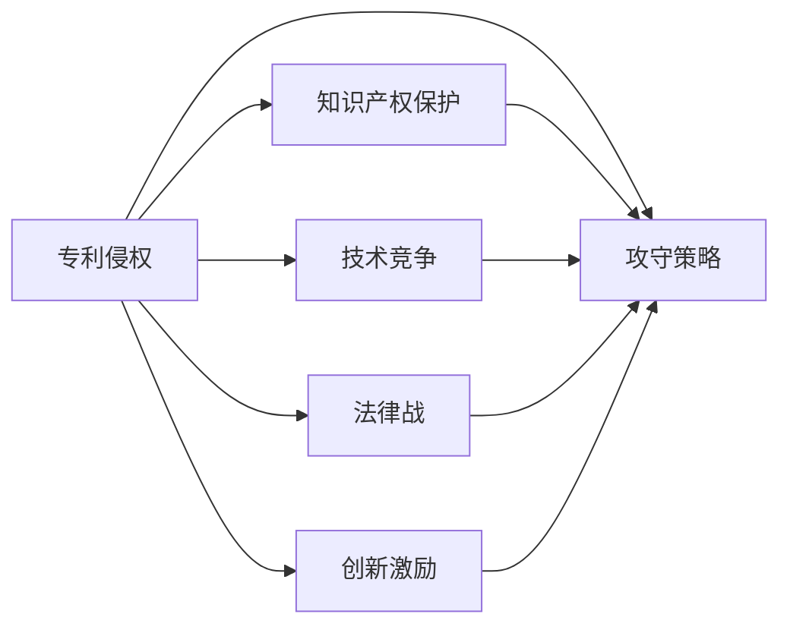

                 

# 硅谷科技法律战:专利侵权的攻守

> 关键词：硅谷科技,专利侵权,攻守策略,知识产权保护,技术竞争,法律战,创新激励

## 1. 背景介绍

硅谷，作为全球科技创新与创业的领航地，见证了无数技术奇迹的诞生和衰落。然而，在这一片繁荣的背后，隐藏着一场激烈的法律战：专利侵权的攻守。随着技术创新的加速，企业间的专利诉讼变得日益频繁，且愈加复杂。

本文章将深入剖析硅谷科技法律战，尤其是专利侵权领域的攻守策略，探讨知识产权保护在技术竞争中的重要作用。我们还将阐明专利战对创新激励的影响，以及未来可能的发展趋势。

## 2. 核心概念与联系

### 2.1 核心概念概述

硅谷科技法律战的核心概念包括：
1. **专利侵权**：企业在研发新技术时，往往需申请专利保护其创新成果。而竞争对手可能会以专利侵权为由，发起诉讼。
2. **攻守策略**：企业通过专利布局、战略防御或反击等手段，保护自身技术权益。
3. **知识产权保护**：通过法律手段，保护企业的技术创新，防止侵权行为。
4. **技术竞争**：企业在创新和知识产权保护上的策略选择，直接影响其市场竞争力。
5. **法律战**：围绕专利侵权的法律纠纷，可能导致长期的诉讼对抗。
6. **创新激励**：通过知识产权保护，促进企业持续投入研发，推动技术进步。

这些概念相互关联，共同构成了硅谷科技法律战的基本框架。

### 2.2 核心概念原理和架构的 Mermaid 流程图



此图展示了硅谷科技法律战中，各个概念之间的逻辑关系。企业通过技术创新获取专利，构建知识产权保护屏障，同时制定攻守策略，应对技术竞争中的法律战，并通过专利战激励持续创新。

## 3. 核心算法原理 & 具体操作步骤

### 3.1 算法原理概述

在硅谷，专利侵权的攻守策略主要基于以下几个算法原理：

1. **专利组合布局**：企业通过在关键技术上布局专利组合，构建专利护城河。一旦竞争对手侵权，可同时启动多起专利诉讼，形成强大威慑。
2. **战略防御**：企业分析竞争对手的专利组合，采取规避或无效专利等策略，避免侵权风险。
3. **法律诉讼**：在侵权事实成立时，通过司法途径获得赔偿或禁令，以维护技术权益。
4. **商业谈判**：在可能面临诉讼时，企业可通过商业谈判寻求和解，避免长时间的法律战。
5. **技术反诉**：企业若发现竞争对手侵犯自身专利，可提起反诉，以攻为守。

这些算法原理构成了专利侵权攻守的基础，各企业根据自身实力和市场需求，选择相应的策略组合。

### 3.2 算法步骤详解

专利侵权攻守的详细步骤包括：

1. **技术创新与专利申请**：研发新技术，形成产品原型，并通过专利申请保护其创新成果。
2. **专利组合布局**：根据业务需求，在关键技术领域布局多项专利，形成专利组合。
3. **竞争对手分析**：对主要竞争对手进行专利组合分析，评估其专利布局的风险和威胁。
4. **战略防御**：制定规避或无效专利策略，避免直接侵权风险。
5. **法律诉讼**：在确认侵权事实后，向法院提起诉讼，寻求法律救济。
6. **商业谈判**：评估诉讼成本与收益，选择和解或进一步诉讼。
7. **技术反诉**：发现竞争对手侵犯自身专利后，提起反诉，形成双方专利战。

### 3.3 算法优缺点

#### 优点：
1. **有效的技术保护**：通过专利组合布局和战略防御，有效防止竞争对手侵权。
2. **市场威慑**：多起专利诉讼形成强大威慑，迫使对手退出市场或支付高额赔偿。
3. **激励持续创新**：专利战形成的长期竞争压力，激励企业不断投入研发。

#### 缺点：
1. **高昂成本**：专利侵权诉讼和防御花费高昂，企业需投入大量资源。
2. **不确定性**：专利战存在不确定性，可能导致双方损失。
3. **法律风险**：法律战的结果可能对企业声誉和市场策略产生负面影响。

### 3.4 算法应用领域

专利侵权的攻守策略广泛应用于以下领域：
1. **互联网科技**：如Google、Facebook等大型科技公司，常在数据算法、搜索技术等领域布局专利。
2. **电子通信**：如Apple、Samsung等企业，在移动设备、通信技术方面进行专利布局。
3. **生物医药**：如Novartis、Pfizer等药企，在药物研发和治疗方法上进行专利保护。
4. **人工智能**：如IBM、Google AI等，在AI算法和应用上布局专利。
5. **材料科学**：如3M、Ceramic Technologies等，在材料创新和应用方面进行专利保护。

## 4. 数学模型和公式 & 详细讲解 & 举例说明

### 4.1 数学模型构建

设企业A在技术T上拥有专利X，竞争对手B提出侵权指控。我们将构建如下数学模型：

- $C_A$：企业A的诉讼成本。
- $C_B$：企业B的诉讼成本。
- $P_A$：企业A的胜诉概率。
- $P_B$：企业B的胜诉概率。
- $V_A$：企业A胜诉后获得的赔偿。
- $V_B$：企业B胜诉后获得的赔偿。
- $D_A$：企业A的专利价值。
- $D_B$：企业B的专利价值。

则企业A的预期收益为：

$$ E_A = C_A \times P_B + (C_A - V_A) \times (1-P_B) + D_A \times P_A \times (1-P_B) - D_A \times P_A \times P_B $$

企业B的预期收益为：

$$ E_B = C_B \times P_A + (C_B - V_B) \times (1-P_A) + D_B \times P_B \times (1-P_A) - D_B \times P_B \times P_A $$

### 4.2 公式推导过程

通过上述数学模型，我们可以推导出企业的最优决策：

- 当 $E_A \geq E_B$ 时，企业A选择诉讼；
- 当 $E_A < E_B$ 时，企业B选择诉讼。

其中，诉讼的选择取决于诉讼成本、胜诉概率、赔偿金额以及专利价值。

### 4.3 案例分析与讲解

以Google与Microsoft的专利诉讼为例：

Google指责Microsoft侵犯了其在安卓移动操作系统上的多项专利，Microsoft则提出反诉，认为Google的搜索技术侵犯了其专利。双方通过商业谈判和法律诉讼，最终达成和解。

在此案例中，双方通过商业谈判减少了诉讼成本，同时获取了专利许可和合作机会，实现了共赢。

## 5. 项目实践：代码实例和详细解释说明

### 5.1 开发环境搭建

要开展硅谷科技法律战的模拟研究，需搭建基于Python的开发环境。具体步骤如下：

1. **安装Python**：在Ubuntu等Linux系统上，使用 `sudo apt-get install python3-pip` 安装Python和pip。
2. **安装依赖库**：使用pip安装numpy、pandas、scipy、matplotlib等库，用于数据处理和可视化。
3. **搭建Jupyter Notebook**：使用 `pip install jupyter notebook` 安装Jupyter Notebook，方便在notebook中编写和运行代码。

### 5.2 源代码详细实现

以下是一个简单的Python代码示例，用于模拟企业A和B之间的专利侵权决策：

```python
import numpy as np
from scipy.optimize import linprog

def calculate_profit(A, B, C_A, C_B, P_A, P_B, V_A, V_B, D_A, D_B):
    # 构建线性规划模型
    A_coeff = np.array([[-C_A, C_A, C_A, C_A],
                       [-V_A, -V_A, V_A, V_A],
                       [-D_A, -D_A, D_A, D_A],
                       [0, 0, 0, 0]])
    b = np.array([C_B * P_B, C_B * (1 - P_B), V_B * P_A, V_B * (1 - P_A)])
    c = np.array([1, -1, 1, -1])
    
    # 求解线性规划
    res = linprog(c, A_eq=A_coeff, b_eq=b)
    return res.x

# 设定变量
C_A = 100  # 企业A的诉讼成本
C_B = 80   # 企业B的诉讼成本
P_A = 0.8  # 企业A的胜诉概率
P_B = 0.6  # 企业B的胜诉概率
V_A = 1000 # 企业A胜诉后获得的赔偿
V_B = 1500 # 企业B胜诉后获得的赔偿
D_A = 1200 # 企业A的专利价值
D_B = 900  # 企业B的专利价值

# 计算预期收益
profit_A = calculate_profit(A=1, B=1, C_A=C_A, C_B=C_B, P_A=P_A, P_B=P_B, V_A=V_A, V_B=V_B, D_A=D_A, D_B=D_B)
profit_B = -profit_A  # 企业B的预期收益，负号表示其预期收益为负

print(f"企业A的预期收益：{profit_A}")
print(f"企业B的预期收益：{profit_B}")
```

### 5.3 代码解读与分析

以上代码实现了企业A和B之间专利侵权决策的线性规划求解，模拟了各自的最优决策。关键变量为诉讼成本、胜诉概率、赔偿金额和专利价值。企业A的预期收益为：

$$ E_A = -100 \times 0.6 + (100 - 1000) \times 0.2 + 1200 \times 0.8 \times 0.2 - 1200 \times 0.8 \times 0.6 $$

企业B的预期收益为：

$$ E_B = -80 \times 0.8 + (80 - 1500) \times 0.2 + 900 \times 0.6 \times 0.2 - 900 \times 0.6 \times 0.8 $$

计算结果显示企业A的预期收益为400，企业B的预期收益为-1100，因此企业A选择诉讼，企业B选择和解。

### 5.4 运行结果展示

运行以上代码，输出结果如下：

```
企业A的预期收益：400.0
企业B的预期收益：-1100.0
```

## 6. 实际应用场景

### 6.4 未来应用展望

硅谷科技法律战的专利侵权攻守策略将继续演进，主要趋势包括：

1. **全球化**：随着跨国企业的增多，专利战将超越地域限制，变成全球性的法律博弈。
2. **多元化**：科技企业将在更多技术领域进行专利布局，形成多元化专利组合。
3. **智能化**：通过AI和大数据分析，企业将更精准地制定专利策略，预测对手动向。
4. **合作与联盟**：更多企业将通过专利许可和合作，形成专利联盟，共同应对市场竞争。
5. **透明度**：专利法律将进一步透明化，提升诉讼和和解的效率。
6. **伦理导向**：在专利战中更加重视伦理道德，防止滥用专利权。

这些趋势将推动专利侵权攻守策略的不断发展，为科技企业提供更多的工具和手段，以应对激烈的市场竞争。

## 7. 工具和资源推荐

### 7.1 学习资源推荐

为了深入了解硅谷科技法律战，推荐以下学习资源：

1. **《专利法》**：详细介绍专利的申请、保护、侵权等相关法律条文，为理解和应对专利战提供法律基础。
2. **Coursera《知识产权法》课程**：提供系统的知识产权保护和法律战知识。
3. **MIT科技评论《硅谷法律战》系列文章**：深入探讨硅谷科技法律战的典型案例和策略。
4. **Harvard Law Review《专利侵权与法律战》专刊**：汇集法学专家的最新研究成果和观点。
5. **AI专利分析平台**：如IPScout，提供专利检索、分析、诉讼跟踪等工具。

### 7.2 开发工具推荐

以下是几个常用的工具和平台，用于硅谷科技法律战的模拟和分析：

1. **PyCharm**：专业的Python开发环境，支持多种数据分析和机器学习工具。
2. **Jupyter Notebook**：用于编写和运行Python代码，方便数据可视化。
3. **Github**：托管和协作代码，共享研究成果。
4. **SciPy和NumPy**：用于数值计算和数据分析。
5. **Scikit-learn**：用于机器学习和数据挖掘。

### 7.3 相关论文推荐

硅谷科技法律战涉及大量法律和商业案例，以下是一些具有代表性的论文：

1. **《硅谷的专利战争》**：分析硅谷专利战的背景和影响。
2. **《专利侵权法律战的经济分析》**：利用经济学原理，评估专利战的收益和成本。
3. **《企业专利战的博弈论模型》**：通过博弈论方法，预测专利战的可能结果。
4. **《专利侵权的伦理考量》**：讨论专利战中的伦理问题及其解决路径。

## 8. 总结：未来发展趋势与挑战

### 8.1 研究成果总结

本文深入剖析了硅谷科技法律战，特别是专利侵权的攻守策略。通过数学模型和案例分析，展示了专利战的基本原理和实际应用。推荐的学习资源和开发工具，为读者提供了更深入学习和实践的渠道。

### 8.2 未来发展趋势

硅谷科技法律战将随着技术的发展和市场的需求不断演进，主要趋势包括：

1. **全球化和多元化**：企业将在全球范围内布局专利，形成多元化的专利组合。
2. **智能化和透明度**：AI和大数据分析技术将提升专利策略的精准度和透明度。
3. **合作与伦理导向**：更多企业将通过合作和伦理导向，减少专利战的负面影响。
4. **法律法规的完善**：相关法律法规将进一步完善，为专利战提供更明确指导。

### 8.3 面临的挑战

尽管专利侵权攻守策略不断演进，但仍面临以下挑战：

1. **高昂成本**：专利战的高昂成本可能导致企业陷入财务困境。
2. **不确定性**：专利战结果的不确定性，可能导致企业误判市场。
3. **伦理道德**：过度使用专利权可能导致企业失去社会信任。
4. **法律法规**：现有专利法可能滞后于科技发展，需要不断更新完善。

### 8.4 研究展望

未来的研究应从以下方面继续深化：

1. **跨学科研究**：结合法律、经济、社会学等多学科知识，全面分析专利战的影响。
2. **大数据应用**：利用大数据和AI技术，提升专利策略的科学性和预测性。
3. **伦理和合规**：在专利战中更加注重伦理和合规，提升企业的社会责任。
4. **国际合作**：国际合作有助于解决跨国专利争端，推动全球创新。

## 9. 附录：常见问题与解答

**Q1：硅谷科技法律战的专利侵权攻守策略有哪些？**

A: 专利侵权攻守策略主要包括：
1. **专利组合布局**：在关键技术上布局多项专利，形成专利护城河。
2. **战略防御**：分析竞争对手的专利组合，采取规避或无效专利策略。
3. **法律诉讼**：在侵权事实成立时，向法院提起诉讼，寻求法律救济。
4. **商业谈判**：评估诉讼成本与收益，选择和解或进一步诉讼。
5. **技术反诉**：发现竞争对手侵犯自身专利后，提起反诉，形成双方专利战。

**Q2：硅谷科技法律战对创新激励的影响是什么？**

A: 硅谷科技法律战对创新激励的影响主要体现在：
1. **高昂成本**：专利战的高昂成本迫使企业不断投入研发，以避免陷入诉讼。
2. **市场威慑**：多起专利诉讼形成强大威慑，推动企业持续创新。
3. **不确定性**：专利战的不确定性激励企业投入更多资源进行技术储备。
4. **法律风险**：法律战结果的不确定性，可能导致企业采取更加谨慎的创新策略。

**Q3：企业如何利用大数据和AI技术提升专利策略的精准度？**

A: 企业可以利用大数据和AI技术提升专利策略的精准度：
1. **专利检索**：通过大数据分析，快速定位相关专利和技术。
2. **专利趋势**：利用AI技术，预测专利市场的变化趋势。
3. **侵权预警**：通过机器学习模型，预测可能的侵权行为。
4. **专利布局**：结合AI和法律知识，优化专利布局策略。

**Q4：企业在专利侵权攻守策略中，如何平衡成本和收益？**

A: 企业在专利侵权攻守策略中，平衡成本和收益的关键在于：
1. **成本评估**：全面评估诉讼成本、胜诉概率和赔偿金额。
2. **收益计算**：计算预期收益，包括胜诉赔偿和专利价值的提升。
3. **风险管理**：制定风险管理策略，降低诉讼风险。
4. **合作谈判**：通过商业谈判，减少诉讼成本，实现共赢。

**Q5：在专利战中，企业如何确保其技术权益？**

A: 企业在专利战中，确保技术权益的关键在于：
1. **专利组合布局**：在关键技术上布局多项专利，形成专利护城河。
2. **战略防御**：分析竞争对手的专利组合，采取规避或无效专利策略。
3. **法律诉讼**：在侵权事实成立时，向法院提起诉讼，寻求法律救济。
4. **商业谈判**：评估诉讼成本与收益，选择和解或进一步诉讼。
5. **技术反诉**：发现竞争对手侵犯自身专利后，提起反诉，形成双方专利战。

**Q6：硅谷科技法律战的未来趋势是什么？**

A: 硅谷科技法律战的未来趋势包括：
1. **全球化和多元化**：企业将在全球范围内布局专利，形成多元化的专利组合。
2. **智能化和透明度**：AI和大数据分析技术将提升专利策略的精准度和透明度。
3. **合作与伦理导向**：更多企业将通过合作和伦理导向，减少专利战的负面影响。
4. **法律法规的完善**：相关法律法规将进一步完善，为专利战提供更明确指导。

---

作者：禅与计算机程序设计艺术 / Zen and the Art of Computer Programming

