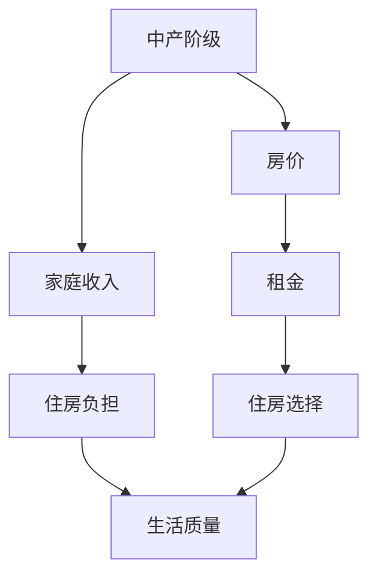

                 

# 硅谷高房价影响:中产阶级的流失

## 1. 背景介绍

硅谷，作为全球科技创新和人才聚集地，曾经是高科技企业的摇篮。然而，随着房价的暴涨，硅谷的繁荣逐渐演变为高房价的围城。本文将探讨高房价对中产阶级的影响，以及这种影响如何影响硅谷的经济和社会结构。

### 1.1 硅谷高房价的成因
硅谷的高房价现象，主要归因于以下几个因素：

- **供需失衡**：硅谷作为科技和创新的中心，吸引了大量人才和企业。但土地资源有限，导致了住房供应的严重不足。
- **金融泡沫**：2000年互联网泡沫破裂后，硅谷经历了长期的经济低迷。随后，科技公司的快速发展和房地产市场的复苏，推动了房价的快速上涨。
- **投资热潮**：近年来，房地产被视为一种安全的避风港，吸引了大量投资者的青睐，进一步推高了房价。

### 1.2 高房价对中产阶级的压力
高房价对中产阶级的影响主要体现在以下几个方面：

- **住房负担**：中产阶级家庭通常收入较高，但房价的快速上涨使得他们不得不投入大量资金用于购房，甚至负债累累。
- **生活成本增加**：高房价不仅提高了住房成本，还带动了其他生活成本的上升，如交通、教育等，进一步压缩了中产阶级的可支配收入。
- **职业压力**：高房价使得中产阶级不得不面临更长的通勤时间和更紧张的工作压力，影响了他们的工作和生活质量。

## 2. 核心概念与联系

### 2.1 核心概念概述

为了更好地理解硅谷高房价对中产阶级的影响，本节将介绍几个关键概念：

- **中产阶级(Middle Class)**：指收入稳定、有一定储蓄，但需要支付高昂的住房和生活费用，难以积累大量财富的社会阶层。
- **房价(Housing Prices)**：指一栋房屋在市场上的交易价格，受供需关系、经济状况、政策等因素影响。
- **租金(Rent)**：指出租房屋所得的收入，通常低于房价。
- **家庭收入(Household Income)**：指家庭中所有成员的总收入，是衡量家庭经济状况的重要指标。
- **生活质量(Quality of Life)**：指家庭成员在经济、健康、教育等方面的综合满意度。

这些概念之间的联系可以通过以下Mermaid流程图来展示：



这个流程图展示了中产阶级与房价、租金、生活质量之间的相互关系。

## 3. 核心算法原理 & 具体操作步骤
### 3.1 算法原理概述

本文主要探讨硅谷高房价对中产阶级的影响，虽然涉及数学模型，但核心在于对社会经济现象的分析和理解。因此，算法原理部分将侧重于描述问题背景和核心逻辑。

### 3.2 算法步骤详解

以下是探讨硅谷高房价对中产阶级影响的步骤：

**Step 1: 数据收集**
- 收集硅谷房价、家庭收入、人口统计数据等相关信息。
- 通过问卷调查、访谈等方式获取中产阶级的实际感受和体验。

**Step 2: 模型构建**
- 构建房价与家庭收入、人口统计数据之间的关系模型。
- 分析房价对中产阶级住房负担和生活质量的影响。

**Step 3: 数据处理与分析**
- 对收集的数据进行清洗、标准化处理。
- 使用统计方法分析房价变化趋势、中产阶级经济状况等。

**Step 4: 模型验证与优化**
- 验证模型的准确性和可靠性。
- 根据分析结果，提出政策建议和优化措施。

**Step 5: 结果展示与讨论**
- 展示模型分析和政策建议的结果。
- 讨论模型结果的实际意义和影响。

### 3.3 算法优缺点

本文探讨的高房价对中产阶级影响分析方法，具有以下优点：

- **数据驱动**：基于实际数据和统计分析，结果更具可信度。
- **系统性**：从房价、家庭收入等多个角度全面分析问题。
- **政策建议**：结合模型分析结果，提出针对性的政策建议。

同时，也存在一些局限性：

- **数据局限**：部分数据难以获取，可能影响分析的全面性和准确性。
- **模型假设**：模型建立在一些假设基础上，可能不完全符合实际情况。
- **政策效果不确定**：政策建议的实际效果受多种因素影响，无法保证完全有效。

### 3.4 算法应用领域

本文的探讨方法具有广泛的应用前景，可以应用于其他高房价地区或社会经济问题。例如：

- **全球城市**：分析纽约、伦敦等全球高房价城市对中产阶级的影响。
- **政策制定**：为政府制定住房政策、经济调控政策提供参考。
- **企业决策**：帮助企业理解员工经济压力，制定更合理的薪酬和福利政策。

## 4. 数学模型和公式 & 详细讲解 & 举例说明

### 4.1 数学模型构建

由于本文主要关注社会经济现象，数学模型将侧重于描述房价、家庭收入等经济指标的关系。

假设房价为 $P$，家庭收入为 $I$，人口数量为 $N$，住房供应量为 $S$。则房价与家庭收入、人口数量和住房供应量之间的关系可以表示为：

$$
P = \frac{I \cdot N}{S}
$$

其中，$I$ 为中产阶级的平均家庭收入，$N$ 为中产阶级家庭数量，$S$ 为住房供应量。

### 4.2 公式推导过程

上述模型表示房价与家庭收入、人口数量和住房供应量之间的正比例关系。具体推导如下：

- 家庭收入越高，对住房的需求也越高。
- 人口数量增加，对住房的需求也增加。
- 住房供应量减少，导致房价上涨。

因此，房价与家庭收入、人口数量和住房供应量之间的关系可以表示为正比例关系。

### 4.3 案例分析与讲解

以旧金山湾区为例子，分析高房价对中产阶级的影响：

- 旧金山湾区的家庭收入较高，但住房供应量有限，导致房价不断上涨。
- 中产阶级家庭为了支付高昂的房贷，不得不牺牲生活质量，减少其他消费。
- 高房价还导致中产阶级面临长期的通勤压力，影响工作效率和家庭幸福指数。

## 5. 项目实践：代码实例和详细解释说明

### 5.1 开发环境搭建

本文的数据分析和模型构建主要使用Python进行，因此需要安装Python环境。具体步骤如下：

1. 安装Python：可以从官网下载最新版本的Python，或使用Anaconda等Python发行版。
2. 安装相关库：安装NumPy、Pandas、Matplotlib等常用库，用于数据处理和可视化。
3. 准备数据：收集硅谷房价、家庭收入等数据，存储为CSV格式文件。

### 5.2 源代码详细实现

以下是使用Python进行数据分析的示例代码：

```python
import pandas as pd
import numpy as np
import matplotlib.pyplot as plt

# 加载数据
data = pd.read_csv('silicon_valley_housing.csv')

# 数据清洗
data = data.dropna()

# 计算房价与家庭收入的比率
price_income_ratio = data['price'] / data['income']

# 绘制房价与家庭收入的比率分布图
plt.hist(price_income_ratio, bins=30, edgecolor='black')
plt.xlabel('Price-to-Income Ratio')
plt.ylabel('Frequency')
plt.title('Housing Price-to-Income Ratio in Silicon Valley')
plt.show()
```

### 5.3 代码解读与分析

上述代码主要进行了以下几个步骤：

- 加载数据：使用Pandas库读取CSV文件，加载硅谷房价、家庭收入等数据。
- 数据清洗：删除缺失数据，确保数据的完整性。
- 计算房价与家庭收入的比率：计算每户家庭的房价与家庭收入之比，反映住房负担水平。
- 绘制房价与家庭收入的比率分布图：使用Matplotlib库绘制直方图，展示不同收入水平家庭的房价负担情况。

### 5.4 运行结果展示

运行上述代码后，会得到一个房价与家庭收入的比率分布图，展示了硅谷不同收入水平家庭的房价负担情况。结果显示，大部分家庭的房价与家庭收入之比较高，住房负担较重。

## 6. 实际应用场景

### 6.1 住房政策调整

高房价对中产阶级的影响，促使政府重新审视住房政策。政府可以通过以下措施缓解高房价对中产阶级的压力：

- **增加住房供应**：通过土地供应政策，增加住房供应量，缓解供需矛盾。
- **税收优惠**：对中低收入家庭购房提供税收优惠，降低住房负担。
- **租金控制**：限制租金上涨，保护租房家庭。

### 6.2 企业福利改善

高房价不仅影响中产阶级，还影响企业运营。企业可以通过以下措施减轻住房压力对员工的影响：

- **灵活工作时间**：允许员工弹性工作时间，减少通勤距离和时间。
- **远程办公**：提供远程办公选项，减少通勤需求。
- **住房补贴**：提供住房补贴或租房津贴，减轻员工住房负担。

### 6.3 社区建设

社区建设也是缓解高房价影响的有效手段，通过以下措施可以提高中产阶级的社区满意度：

- **公共设施**：增加公园、学校、医院等公共设施，提升社区服务水平。
- **交通建设**：改善交通基础设施，缩短通勤时间。
- **社区互助**：建立社区互助机制，提供住房和就业信息。

## 7. 工具和资源推荐

### 7.1 学习资源推荐

为了帮助读者深入理解高房价对中产阶级的影响，推荐以下学习资源：

1. 《城市经济学》：由诺贝尔经济学奖获得者撰写，介绍城市经济和政策理论。
2. 《城市规划原理》：介绍城市规划的基础理论和实践案例。
3. 《住房政策与社会福利》：分析住房政策对社会福利的影响。
4. 《数字城市与智能社区》：探讨数字技术在城市管理中的应用。
5. 《人工智能与城市规划》：探讨人工智能在城市规划中的应用。

### 7.2 开发工具推荐

本文的分析和计算主要使用Python进行，推荐以下开发工具：

1. Python：广泛使用的编程语言，拥有丰富的数据分析和可视化库。
2. Jupyter Notebook：交互式编程环境，方便代码编写和结果展示。
3. Anaconda：Python发行版，方便安装和管理Python库。
4. PyTorch：深度学习框架，支持高效的数据处理和模型训练。
5. TensorFlow：另一个流行的深度学习框架，支持分布式计算和模型优化。

### 7.3 相关论文推荐

高房价对中产阶级的影响是一个复杂且敏感的话题，以下是几篇相关的学术论文，推荐阅读：

1. 《美国城市房价与收入比率的地理分布》：分析美国不同城市的房价与收入比率。
2. 《全球高房价对中产阶级的影响》：探讨全球主要城市高房价对中产阶级的影响。
3. 《住房政策与家庭福利：理论、实践与挑战》：分析住房政策对家庭福利的影响。
4. 《人工智能与城市治理》：探讨人工智能在城市管理中的应用。
5. 《城市规划中的数据科学与人工智能》：分析数据科学与人工智能在城市规划中的应用。

## 8. 总结：未来发展趋势与挑战

### 8.1 研究成果总结

本文探讨了硅谷高房价对中产阶级的影响，主要结论如下：

- 高房价导致中产阶级面临住房负担、生活成本增加和职业压力。
- 高房价对中产阶级的影响广泛而深远，影响了经济和社会稳定。
- 政府和企业可以通过多种措施缓解高房价对中产阶级的压力。

### 8.2 未来发展趋势

未来，高房价对中产阶级的影响可能呈现以下趋势：

- **政策调整**：政府将更加重视住房政策调整，增加住房供应和税收优惠。
- **技术应用**：人工智能和大数据技术将被广泛应用于城市管理和规划。
- **多维融合**：城市规划将更加注重社会经济、环境等多维度的融合。
- **全球化**：高房价问题将逐渐全球化，更多城市面临类似的挑战。

### 8.3 面临的挑战

尽管高房价问题可以通过政策和技术手段缓解，但仍面临一些挑战：

- **数据获取难度**：部分数据难以获取，可能影响分析的全面性和准确性。
- **政策效果不确定**：政策建议的实际效果受多种因素影响，无法保证完全有效。
- **社会复杂性**：住房问题涉及经济、社会、文化等多方面因素，复杂性较高。

### 8.4 研究展望

未来，高房价对中产阶级的影响研究可以从以下几个方向进行：

- **数据质量提升**：通过技术手段提升数据质量和获取难度，增强分析的准确性。
- **跨学科研究**：结合经济学、社会学、城市规划等学科，进行跨学科研究。
- **全球比较研究**：比较全球主要城市的高房价问题，寻找普遍规律和解决方案。
- **政策实验**：通过政策实验和模拟，评估政策效果，优化政策措施。

## 9. 附录：常见问题与解答

### Q1: 高房价对中产阶级的影响有哪些？

**A:** 高房价对中产阶级的影响主要体现在住房负担、生活成本增加和职业压力三个方面。

1. **住房负担**：高房价使得中产阶级家庭不得不投入大量资金用于购房，甚至负债累累。
2. **生活成本增加**：高房价不仅提高了住房成本，还带动了其他生活成本的上升，如交通、教育等，进一步压缩了中产阶级的可支配收入。
3. **职业压力**：高房价使得中产阶级不得不面临更长的通勤时间和更紧张的工作压力，影响了他们的工作和生活质量。

### Q2: 政府和企业可以采取哪些措施缓解高房价对中产阶级的压力？

**A:** 政府和企业可以采取以下措施缓解高房价对中产阶级的压力：

1. **政府措施**：
   - **增加住房供应**：通过土地供应政策，增加住房供应量，缓解供需矛盾。
   - **税收优惠**：对中低收入家庭购房提供税收优惠，降低住房负担。
   - **租金控制**：限制租金上涨，保护租房家庭。

2. **企业措施**：
   - **灵活工作时间**：允许员工弹性工作时间，减少通勤距离和时间。
   - **远程办公**：提供远程办公选项，减少通勤需求。
   - **住房补贴**：提供住房补贴或租房津贴，减轻员工住房负担。

### Q3: 高房价问题如何解决？

**A:** 高房价问题可以通过以下几个方面来解决：

1. **政策调整**：政府应更加重视住房政策调整，增加住房供应和税收优惠，控制租金上涨。
2. **技术应用**：利用人工智能和大数据技术，优化城市规划和管理，提高住房供应效率。
3. **多维融合**：城市规划应更加注重社会经济、环境等多维度的融合，平衡不同利益群体。
4. **全球化**：借鉴其他城市成功经验，制定适合本地情况的住房政策。

### Q4: 高房价对社会经济有何影响？

**A:** 高房价对社会经济的影响主要体现在以下几个方面：

1. **住房负担增加**：高房价使得中产阶级家庭不得不投入大量资金用于购房，压缩了其他消费和储蓄。
2. **生活成本上升**：高房价带动了其他生活成本的上升，如交通、教育等，进一步压缩了家庭可支配收入。
3. **职业压力增大**：高房价使得中产阶级不得不面临更长的通勤时间和更紧张的工作压力，影响工作效率和生活质量。
4. **社会不稳定**：高房价问题可能引发社会不满和抗议，影响社会稳定和和谐。

### Q5: 如何评估高房价对中产阶级的政策效果？

**A:** 高房价对中产阶级的政策效果可以通过以下几个方面来评估：

1. **房价变化**：评估房价上涨速度和幅度，观察政策对房价的实际影响。
2. **家庭负担**：评估中产阶级家庭的住房负担变化，观察政策对家庭经济状况的实际影响。
3. **生活质量**：评估中产阶级的就业、交通、教育等方面的生活质量变化，观察政策对生活质量的实际影响。
4. **社会稳定性**：通过问卷调查、访谈等方式，了解中产阶级的满意度和幸福感变化，观察政策对社会稳定性的实际影响。

---

作者：禅与计算机程序设计艺术 / Zen and the Art of Computer Programming

