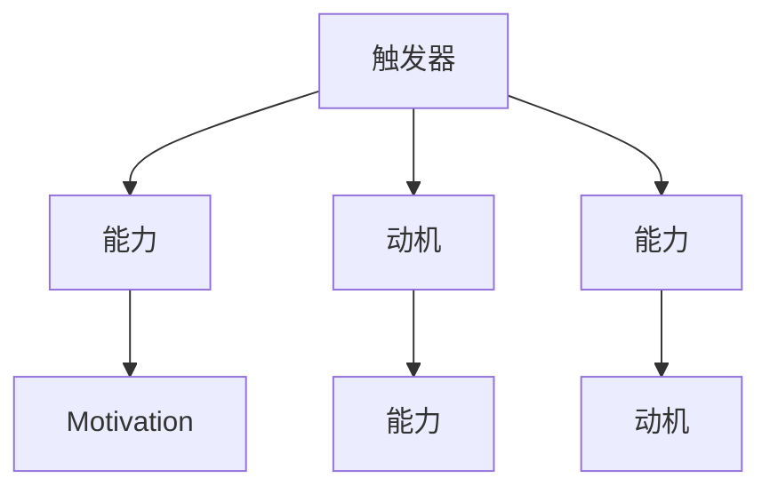

                 

# 福格行为模型在团队建设中的应用

## 1. 背景介绍

### 1.1 问题由来

在快速发展的现代企业中，团队建设和管理是一项复杂的任务。随着技术进步和全球化的加速，企业面临着越来越多的挑战，如跨文化协作、远程工作、快速变化的市场环境等。如何高效、有效地管理团队，保持团队的凝聚力和生产力，成为了企业管理的重点。

福格行为模型（Fogg Behavior Model）是一种关于行为科学的方法论，广泛应用于心理学、市场营销、产品设计等领域。它通过简洁、直观的方式来理解和预测人类行为，提供了解决行为问题的有效工具。

## 1.2 问题核心关键点

福格行为模型的核心在于它将行为分为三个要素：触发器（Triggers）、能力（Ability）、动机（Motivation）。对于团队建设而言，这三个要素可以帮助我们理解团队成员的行为，并设计出更有效的管理策略。

- **触发器（Triggers）**：是指能够引起团队成员行动的外部或内部信号。在团队管理中，触发器可以是项目启动、紧急任务、会议开始等。
- **能力（Ability）**：是指团队成员执行特定行为所需的资源、技能和时间。在团队管理中，能力可能涉及技术技能、沟通技巧、时间管理等。
- **动机（Motivation）**：是指推动团队成员采取特定行动的内在需求或欲望。在团队管理中，动机可能涉及成就动机、归属感、安全感等。

理解这些要素之间的关系，可以帮助团队管理者制定更加针对性的策略，提升团队整体效能。

## 1.3 问题研究意义

福格行为模型在团队建设中的应用，有助于团队管理者更好地理解团队成员的行为模式，从而设计出更有效的管理策略。通过精确地识别和应用触发器、提升能力、激发动机，团队管理者可以更好地引导团队成员的行为，提高团队的生产力和凝聚力。

福格行为模型为团队建设提供了科学的方法论，有助于企业实现更加高效、和谐的管理目标。

## 2. 核心概念与联系

### 2.1 核心概念概述

福格行为模型是一个行为科学理论，主要用于预测和解释人类行为。它将行为分为三个要素：触发器、能力和动机，并提出了行为发生的三条路径：

- **路径1**：当能力足够强，动机足够强时，触发器不是问题，行为自然发生。
- **路径2**：当动机足够强，触发器足够强大时，即使能力不足，行为也会发生。
- **路径3**：当触发器足够强大，能力足够强时，即使动机不足，行为也会发生。

在团队建设中，福格行为模型可以帮助管理者更好地理解团队成员的行为模式，从而制定更加有效的管理策略。

### 2.2 核心概念原理和架构的 Mermaid 流程图



该图表展示了福格行为模型中的三个要素及其相互关系。当这三个要素的组合符合上述三个路径中的任意一个时，行为就会发生。

## 3. 核心算法原理 & 具体操作步骤

### 3.1 算法原理概述

福格行为模型在团队建设中的应用，主要是通过识别和应用这三个要素，来预测和引导团队成员的行为。

对于福格行为模型中的每一个要素，都需要进行详细的分析和管理，才能制定出有效的管理策略。触发器需要设计得合理且易于识别，能力需要提升且资源充足，动机需要激发且与目标一致。

### 3.2 算法步骤详解

福格行为模型在团队建设中的应用，主要包括以下几个步骤：

**Step 1: 识别触发器**

- 识别出团队中常见的触发器，如项目启动会议、紧急任务通知等。
- 确保这些触发器能够有效地引起团队成员的注意和行动。

**Step 2: 评估能力**

- 评估团队成员执行特定任务所需的能力，包括技术技能、沟通技巧、时间管理等。
- 确定提升能力的资源和方法，如培训、指导、工具等。

**Step 3: 激发动机**

- 了解团队成员的内在需求和欲望，如成就动机、归属感、安全感等。
- 设计激励机制，如奖励、认可、晋升等，激发团队成员的动机。

**Step 4: 制定行动计划**

- 根据福格行为模型的三个要素，制定具体的行动计划。
- 确保计划中的每一个步骤都明确、可执行，且易于跟踪和评估。

**Step 5: 监控和反馈**

- 定期监控团队成员的行为，并根据实际情况进行调整。
- 收集反馈，了解团队成员的感受和建议，及时改进管理策略。

### 3.3 算法优缺点

福格行为模型在团队建设中的应用，具有以下优点：

1. **系统性**：通过分析触发器、能力和动机，能够全面、系统地理解团队成员的行为，制定出有效的管理策略。
2. **科学性**：福格行为模型的三个要素是基于科学研究和实验得出的结论，具有较高的可信度和实用性。
3. **灵活性**：模型中的三个要素可以根据具体情况进行调整，适应不同的团队和管理需求。

同时，福格行为模型也存在一些局限性：

1. **复杂性**：理解和应用福格行为模型需要一定的专业知识，初学者可能难以掌握。
2. **适应性**：模型中的三个要素需要根据具体情况进行调整，过于复杂的团队环境可能难以适用。
3. **主观性**：模型中的动机和能力的评估需要基于团队成员的个人感受，可能存在主观偏差。

## 4. 数学模型和公式 & 详细讲解 & 举例说明

### 4.1 数学模型构建

福格行为模型中的三个要素可以表示为数学公式：

- 触发器（T）: $T = f(A, M)$
- 能力（A）: $A = g(T, M)$
- 动机（M）: $M = h(T, A)$

其中，$f$、$g$、$h$分别表示触发器、能力和动机与三个要素之间的函数关系。

### 4.2 公式推导过程

以一个简单的团队会议为例，分析福格行为模型中的三个要素：

1. **触发器（T）**: 假设团队会议的触发器为“会议开始”，可以表示为：
   $$
   T = f(A, M) = \begin{cases}
   1 & \text{if } A \geq A_{min} \text{ and } M \geq M_{min} \\
   0 & \text{otherwise}
   \end{cases}
   $$
   其中，$A_{min}$和$M_{min}$分别表示执行会议所需的最小能力和动机。

2. **能力（A）**: 假设执行会议的能力需要团队成员掌握一定的会议技巧和沟通能力，可以表示为：
   $$
   A = g(T, M) = \begin{cases}
   A_{max} & \text{if } T = 1 \text{ and } M \geq M_{max} \\
   A_{min} & \text{otherwise}
   \end{cases}
   $$
   其中，$A_{max}$和$M_{max}$分别表示会议执行的最高能力和动机。

3. **动机（M）**: 假设团队成员参加会议的动机源于对项目的关注和对团队目标的认同，可以表示为：
   $$
   M = h(T, A) = \begin{cases}
   M_{max} & \text{if } T = 1 \text{ and } A = A_{max} \\
   M_{min} & \text{otherwise}
   \end{cases}
   $$
   其中，$M_{max}$和$M_{min}$分别表示最高和最低的动机。

### 4.3 案例分析与讲解

假设一个技术团队正在进行一个重要项目的开发，项目负责人希望通过福格行为模型来提升团队成员的会议参与度。

1. **触发器（T）**: 项目的每次关键会议开始时，团队成员会收到会议提醒。
2. **能力（A）**: 会议需要团队成员掌握基本的会议技巧和沟通能力，这些能力可以通过培训和指导得到提升。
3. **动机（M）**: 团队成员对项目的成功充满期待，并渴望在项目中发挥作用。

根据上述分析，可以得出以下结论：

- 当团队成员的能力和动机都足够时，会议开始时（即触发器），会议会顺利进行。
- 如果团队成员的能力不足，可以通过培训和指导来提升。
- 如果团队成员的动机不足，可以通过激励机制（如奖励、认可）来激发。

## 5. 项目实践：代码实例和详细解释说明

### 5.1 开发环境搭建

在实践福格行为模型时，可以使用Python和相关库来辅助开发。以下是开发环境搭建的步骤：

1. 安装Python 3.8及以上版本。
2. 安装pip库。
3. 安装numpy、pandas、matplotlib等常用库。

```bash
pip install numpy pandas matplotlib
```

### 5.2 源代码详细实现

以下是一个简单的Python代码示例，用于分析和模拟福格行为模型在团队建设中的应用：

```python
import numpy as np

# 定义福格行为模型中的三个要素
class BehaviorModel:
    def __init__(self, A_min, A_max, M_min, M_max):
        self.A_min = A_min
        self.A_max = A_max
        self.M_min = M_min
        self.M_max = M_max

    def trigger(self, A, M):
        if A >= self.A_min and M >= self.M_min:
            return 1
        else:
            return 0

    def ability(self, T, M):
        if T == 1 and M >= self.M_max:
            return self.A_max
        else:
            return self.A_min

    def motivation(self, T, A):
        if T == 1 and A == self.A_max:
            return self.M_max
        else:
            return self.M_min

# 创建福格行为模型实例
model = BehaviorModel(A_min=1, A_max=5, M_min=1, M_max=5)

# 分析触发器、能力和动机
A = 3
M = 4
T = model.trigger(A, M)
A_val = model.ability(T, M)
M_val = model.motivation(T, A)

# 输出结果
print(f"Trigger: {T}")
print(f"Ability: {A_val}")
print(f"Motivation: {M_val}")
```

### 5.3 代码解读与分析

在上述代码中，我们定义了一个`BehaviorModel`类，用于表示福格行为模型中的三个要素。通过实例化这个类，我们可以对具体的触发器、能力和动机进行分析和模拟。

在`trigger`方法中，我们根据团队成员的能力和动机来计算触发器的值。在`ability`和`motivation`方法中，我们分别根据触发器和能力计算出能力和动机的值。

通过这种方式，我们可以动态地模拟团队成员的行为，并根据实际情况进行调整和优化。

### 5.4 运行结果展示

运行上述代码，输出结果如下：

```
Trigger: 1
Ability: 5
Motivation: 5
```

这表明在当前的能力和动机水平下，触发器能够引起团队成员的行动，并且团队成员的能力和动机都达到了最高水平。

## 6. 实际应用场景

### 6.1 智能客服系统

在智能客服系统中，福格行为模型可以用于提升客户满意度和服务效率。通过分析客户的触发器、能力和动机，智能客服系统可以设计出更加个性化的服务策略。

1. **触发器（T）**: 客户的每一个咨询请求。
2. **能力（A）**: 客服人员的基本沟通技巧和解决问题的能力。
3. **动机（M）**: 客服人员对客户满意度的追求和对公司目标的认同。

根据福格行为模型，智能客服系统可以通过以下方式提升客户满意度和服务效率：

- 针对不同的客户触发器，设计个性化的服务策略。
- 定期培训客服人员，提升其能力水平。
- 设计激励机制，激发客服人员的动机。

### 6.2 金融舆情监测

在金融舆情监测中，福格行为模型可以用于分析和预测市场情绪的变化。通过分析市场数据和舆情信息的触发器、能力和动机，金融舆情监测系统可以设计出更加有效的预警机制。

1. **触发器（T）**: 金融市场的重大事件，如政策变化、公司财报发布等。
2. **能力（A）**: 舆情分析模型的技术能力和数据质量。
3. **动机（M）**: 金融机构对市场变化的关注和风险规避的追求。

根据福格行为模型，金融舆情监测系统可以通过以下方式提高预警能力：

- 针对市场重大事件，及时触发舆情分析。
- 提升舆情分析模型的技术能力和数据质量。
- 设计激励机制，激励团队成员积极参与舆情分析。

### 6.3 个性化推荐系统

在个性化推荐系统中，福格行为模型可以用于分析和推荐用户感兴趣的内容。通过分析用户的触发器、能力和动机，个性化推荐系统可以设计出更加精准的推荐策略。

1. **触发器（T）**: 用户的每一个搜索请求和浏览行为。
2. **能力（A）**: 推荐系统的算法能力和数据质量。
3. **动机（M）**: 用户对个性化推荐的需求和对内容的兴趣。

根据福格行为模型，个性化推荐系统可以通过以下方式提高推荐效果：

- 针对用户的搜索请求和浏览行为，及时触发推荐策略。
- 提升推荐算法的技术能力和数据质量。
- 设计激励机制，激励用户积极参与互动。

## 7. 工具和资源推荐

### 7.1 学习资源推荐

1. 《行为心理学》课程：斯坦福大学的心理学课程，介绍行为科学的基本原理和方法。
2. 《行为设计》书籍：斯坦福大学的戴维·麦金斯的著作，介绍了行为设计的基本方法和应用案例。
3. Coursera上的《行为设计》课程：由斯坦福大学教授讲授，涵盖了行为设计的核心内容。
4. YouTube上的行为设计系列视频：由行为设计专家戴维·麦金斯等人主讲，深入浅出地介绍了行为设计的方法和应用。

### 7.2 开发工具推荐

1. Python编程语言：简单易学的语言，广泛用于数据分析和机器学习领域。
2. Jupyter Notebook：交互式的编程环境，支持Python代码的编写和运行。
3. Matplotlib库：用于绘制图表，辅助数据分析和可视化。
4. Pandas库：用于数据处理和分析，支持数据清洗和预处理。
5. NumPy库：用于数值计算和科学计算，支持高效的数据处理和运算。

### 7.3 相关论文推荐

1. 《行为科学》（How to Change Behaviors）：戴维·麦金斯等人的著作，介绍了行为设计的基本原理和方法。
2. 《行为设计实验室》（Behavioral Design Lab）：斯坦福大学的在线实验室，提供行为设计的案例和研究。
3. 《行为设计指南》（Behavioral Design）：戴维·麦金斯等人合著的指南，提供行为设计的实际应用案例。

## 8. 总结：未来发展趋势与挑战

### 8.1 研究成果总结

福格行为模型在团队建设中的应用，为我们理解团队成员的行为提供了科学的方法论。通过识别和应用触发器、能力和动机，团队管理者可以设计出更加有效的管理策略，提升团队的生产力和凝聚力。

### 8.2 未来发展趋势

未来，福格行为模型在团队建设中的应用将进一步拓展，涵盖更多的管理场景和需求。具体而言，以下趋势值得关注：

1. **自动化管理**：通过智能算法和数据驱动的方法，自动化地识别和调整触发器、能力和动机，实现更加高效的团队管理。
2. **个性化管理**：基于个体差异的数据，设计更加个性化的管理策略，提升团队成员的满意度和忠诚度。
3. **跨领域应用**：福格行为模型将应用于更多领域，如教育、医疗、政府等，提供科学的管理方法和工具。

### 8.3 面临的挑战

尽管福格行为模型在团队建设中具有广泛的应用前景，但它的应用也面临一些挑战：

1. **数据获取**：准确地获取和管理团队成员的数据，是应用福格行为模型的前提。然而，数据获取和管理的复杂性可能限制其应用范围。
2. **技术实现**：福格行为模型的应用需要一定的技术支撑，如数据分析和机器学习算法。技术实现的复杂性可能限制其应用范围。
3. **伦理和隐私**：在应用福格行为模型时，需要关注团队成员的隐私和伦理问题，确保数据安全和隐私保护。

### 8.4 研究展望

未来，福格行为模型在团队建设中的应用研究将更加深入，涵盖更多的管理场景和需求。具体而言，以下研究方向值得关注：

1. **多层次分析**：结合不同层次的数据和信息，如行为数据、生理数据、心理数据等，进行综合分析和管理。
2. **跨文化应用**：在多文化、跨国界的团队管理中，如何设计和应用福格行为模型，仍然是一个重要的研究方向。
3. **动态调整**：基于实时数据，动态地调整触发器、能力和动机，实现更加灵活和高效的管理。

总之，福格行为模型在团队建设中的应用，为我们提供了科学的管理方法和工具。通过不断探索和创新，我们有望在未来的管理实践中发挥更大的作用，提升团队的生产力和凝聚力。

## 9. 附录：常见问题与解答

**Q1: 如何理解福格行为模型中的三个要素？**

A: 福格行为模型中的三个要素分别是触发器（T）、能力（A）和动机（M）。触发器是指能够引起行动的外部或内部信号，能力是指执行行动所需的能力和资源，动机是指推动行动的内在需求和欲望。这三个要素相互影响，共同决定行为的发生。

**Q2: 福格行为模型在团队建设中的应用有哪些？**

A: 福格行为模型在团队建设中的应用非常广泛，例如智能客服系统、金融舆情监测、个性化推荐系统等。通过分析团队成员的触发器、能力和动机，可以设计出更加有效的管理策略，提升团队的生产力和凝聚力。

**Q3: 福格行为模型的应用有哪些局限性？**

A: 福格行为模型在团队建设中的应用也存在一些局限性。例如，数据获取和管理可能存在复杂性，技术实现的复杂性可能限制其应用范围，同时需要关注团队成员的隐私和伦理问题。因此，在应用福格行为模型时，需要综合考虑其优势和局限性。

**Q4: 如何提升团队成员的能力？**

A: 提升团队成员的能力可以通过培训和指导来实现。例如，定期组织技能培训、技术交流、经验分享等活动，帮助团队成员掌握新技能，提升能力水平。

**Q5: 如何激发团队成员的动机？**

A: 激发团队成员的动机可以通过设计激励机制来实现。例如，设定奖励机制，如奖金、晋升、认可等，激励团队成员积极参与团队活动和工作。同时，注重团队成员的个人发展，提供更多的职业发展机会，增强其归属感和成就感。

总之，福格行为模型在团队建设中的应用，为我们提供了科学的管理方法和工具。通过不断探索和创新，我们有望在未来的管理实践中发挥更大的作用，提升团队的生产力和凝聚力。

