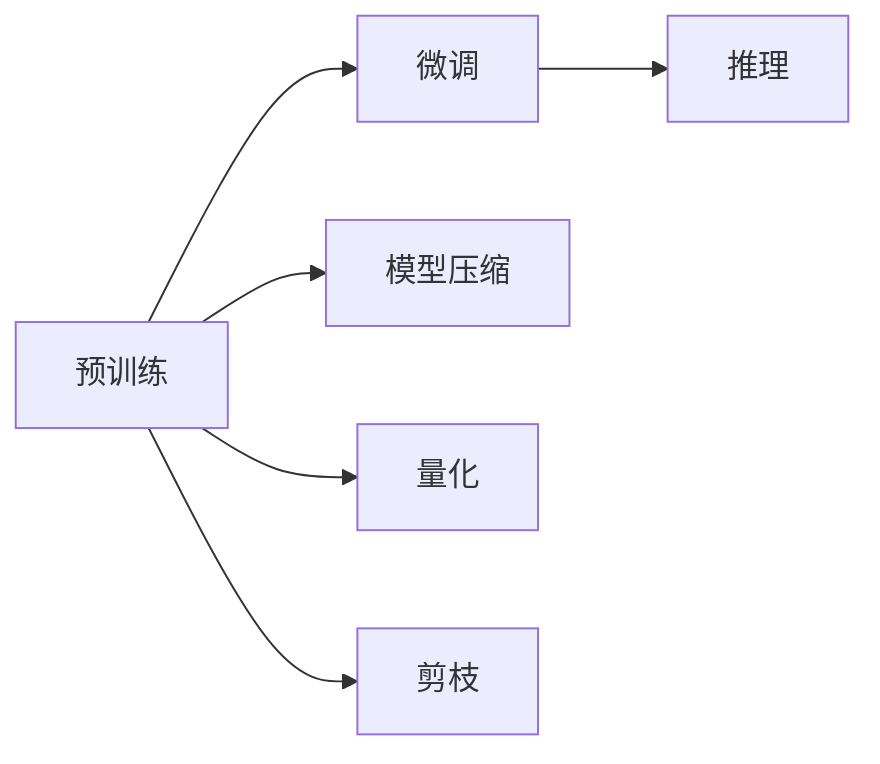

                 

## 1. 背景介绍

在深度学习模型和自然语言处理(NLP)领域，大语言模型（Large Language Model，LLM）的推理速度是一个被广泛关注的问题。LLM如BERT、GPT等，因其卓越的性能和广泛的应用场景，逐渐成为了研究者和工程师们关注的焦点。然而，由于其庞大的参数量，LLM的推理速度往往受到限制，难以满足实时性要求。为了提升LLM的推理性能，研究者和工程师们提出了多种优化策略，并取得了显著进展。本文将深入探讨LLM推理速度的发展历程，并剖析其中的关键技术，希望能为相关研究和应用提供参考。

## 2. 核心概念与联系

### 2.1 核心概念概述

在大语言模型的推理过程中，存在许多关键概念和联系，以下是对这些概念的简单介绍：

- **大语言模型（LLM）**：基于自回归或自编码模型，通过在大规模无标签文本语料上预训练得到的语言模型。
- **预训练（Pre-training）**：在大规模无标签文本语料上，通过自监督学习任务训练模型，获得通用语言表示的过程。
- **微调（Fine-tuning）**：在预训练模型的基础上，使用下游任务的少量标注数据，通过有监督学习优化模型在特定任务上的性能。
- **推理（Inference）**：将输入数据传入模型进行计算，输出预测结果的过程。
- **模型压缩（Model Compression）**：通过降低模型复杂度或参数量来提升推理速度和资源利用率的方法。
- **量化（Quantization）**：将浮点模型转换为定点模型，以减少内存占用和计算开销。
- **剪枝（Pruning）**：去除模型中的冗余参数或权重，减少模型大小和计算量。

这些概念构成了LLM推理速度发展的核心框架，如图1所示。

```mermaid
graph TB
    A[大语言模型 (LLM)] --> B[预训练]
    A --> C[微调]
    A --> D[推理]
    D --> E[模型压缩]
    D --> F[量化]
    D --> G[剪枝]
    E --> D
    F --> D
    G --> D
```

### 2.2 核心概念原理和架构的 Mermaid 流程图

下面是一个简单的流程图，展示了LLM推理过程中，预训练、微调和推理之间的关系：



## 3. 核心算法原理 & 具体操作步骤

### 3.1 算法原理概述

LLM的推理过程可以分为预训练、微调和推理三个步骤。在预训练阶段，模型通过自监督学习任务在大规模无标签文本语料上训练，学习到丰富的语言知识。在微调阶段，模型通过少量标注数据，针对特定任务进行优化，提升在特定任务上的性能。在推理阶段，模型将输入数据传入，计算并输出预测结果。

为了提升推理速度，研究者和工程师们提出了多种优化策略，包括模型压缩、量化、剪枝等。这些策略能够有效地降低模型的复杂度和参数量，从而提升推理速度和资源利用率。

### 3.2 算法步骤详解

#### 3.2.1 预训练

预训练是大语言模型构建的基础。在预训练阶段，模型通过自监督学习任务，在大规模无标签文本语料上训练，学习到丰富的语言知识。以BERT为例，预训练过程包括掩码语言模型和下一句预测两个任务。

- **掩码语言模型**：将输入序列中的某些位置随机掩码，让模型预测被掩码的位置。
- **下一句预测**：将一对句子作为输入，判断它们是否是连续的。

通过预训练，模型学习到通用语言表示，可以迁移到各种下游任务中进行微调。

#### 3.2.2 微调

微调是将预训练模型应用于特定任务的过程。在微调阶段，模型通过少量标注数据，针对特定任务进行优化，提升在特定任务上的性能。

以情感分析任务为例，微调过程包括以下步骤：

1. 收集情感标注数据集。
2. 将数据集划分为训练集、验证集和测试集。
3. 使用预训练模型作为初始化参数，构建情感分析任务适配层。
4. 在训练集上训练模型，使用交叉熵损失函数作为目标函数。
5. 在验证集上评估模型性能，调整超参数。
6. 在测试集上评估模型性能，输出最终结果。

#### 3.2.3 推理

推理是将输入数据传入模型，计算并输出预测结果的过程。在推理阶段，模型通过前向传播计算，输出预测结果。

以问答任务为例，推理过程包括以下步骤：

1. 输入自然语言问题。
2. 将问题编码成模型可接受的格式。
3. 将问题作为输入，通过前向传播计算，得到模型输出。
4. 对模型输出进行解码，得到最终答案。

### 3.3 算法优缺点

#### 3.3.1 优点

- **性能提升**：通过微调和推理优化，可以显著提升模型在特定任务上的性能。
- **泛化能力强**：预训练模型学习到丰富的语言知识，可以迁移到各种下游任务中进行微调。
- **资源优化**：通过模型压缩、量化、剪枝等策略，可以降低模型的复杂度和参数量，提升推理速度和资源利用率。

#### 3.3.2 缺点

- **标注成本高**：微调过程需要大量的标注数据，成本较高。
- **过拟合风险**：微调和推理优化可能引入过拟合风险，影响模型泛化性能。
- **模型复杂度高**：预训练模型的参数量较大，推理速度较慢。

### 3.4 算法应用领域

大语言模型在多个领域都有广泛应用，包括但不限于：

- 自然语言处理（NLP）：情感分析、命名实体识别、机器翻译等。
- 推荐系统：个性化推荐、协同过滤等。
- 医疗：病历分析、医疗问答等。
- 金融：舆情监测、智能客服等。

## 4. 数学模型和公式 & 详细讲解 & 举例说明

### 4.1 数学模型构建

在LLM推理过程中，涉及多个数学模型，包括预训练模型、微调模型和推理模型。以下是一个简单的模型构建流程：

1. **预训练模型**：
   - 输入：大规模无标签文本语料。
   - 目标函数：掩码语言模型和下一句预测任务。

2. **微调模型**：
   - 输入：标注数据集。
   - 目标函数：特定任务的损失函数，如交叉熵损失函数。

3. **推理模型**：
   - 输入：自然语言问题。
   - 输出：模型预测结果。

### 4.2 公式推导过程

以BERT模型为例，其预训练过程包括掩码语言模型和下一句预测两个任务。以下是掩码语言模型的公式推导过程：

$$
\mathcal{L} = -\frac{1}{N}\sum_{i=1}^N \sum_{j=1}^L (\log p(x_j|M_{\theta}(x_{<j})) + (1-\log(1-p(x_j|M_{\theta}(x_{<j})))
$$

其中，$x_j$ 表示输入序列中第 $j$ 个位置，$M_{\theta}(x_{<j})$ 表示模型在输入序列前 $j-1$ 个位置上的输出。

### 4.3 案例分析与讲解

以情感分析任务为例，微调过程包括以下步骤：

1. **数据准备**：
   - 收集情感标注数据集，将其划分为训练集、验证集和测试集。
   - 将数据集中的每个文本进行编码，得到模型可接受的格式。

2. **模型构建**：
   - 使用BERT作为预训练模型，构建情感分析任务适配层。
   - 适配层的输出维度为情感类别数，使用交叉熵损失函数作为目标函数。

3. **模型训练**：
   - 在训练集上训练模型，使用交叉熵损失函数作为目标函数。
   - 在验证集上评估模型性能，调整超参数。

4. **模型测试**：
   - 在测试集上评估模型性能，输出最终结果。

## 5. 项目实践：代码实例和详细解释说明

### 5.1 开发环境搭建

在搭建开发环境时，需要安装相应的深度学习框架和工具库。以TensorFlow和PyTorch为例，安装过程如下：

1. 安装TensorFlow：
   ```bash
   pip install tensorflow
   ```

2. 安装PyTorch：
   ```bash
   pip install torch torchvision torchaudio
   ```

### 5.2 源代码详细实现

以下是一个简单的代码示例，展示了如何使用TensorFlow进行情感分析任务的微调：

```python
import tensorflow as tf
from tensorflow.keras import layers, models

# 加载BERT模型
bert_model = tf.keras.models.load_model('bert_model.h5')

# 构建情感分析任务适配层
adapt_model = models.Sequential([
    layers.Dense(128, activation='relu', input_shape=(768,)),
    layers.Dense(1, activation='sigmoid')
])

# 合并BERT模型和适配层
final_model = models.Model(inputs=bert_model.input, outputs=adapt_model(bert_model.output))

# 定义损失函数和优化器
loss = tf.keras.losses.BinaryCrossentropy()
optimizer = tf.keras.optimizers.Adam()

# 编译模型
final_model.compile(optimizer=optimizer, loss=loss, metrics=['accuracy'])

# 在训练集上训练模型
final_model.fit(train_dataset, epochs=10, validation_data=val_dataset)

# 在测试集上评估模型
final_model.evaluate(test_dataset)
```

### 5.3 代码解读与分析

以上代码展示了如何使用TensorFlow进行情感分析任务的微调。其中，`bert_model`表示预训练模型，`adapt_model`表示适配层，`final_model`表示微调后的模型。在训练过程中，使用交叉熵损失函数和Adam优化器进行优化。

### 5.4 运行结果展示

训练完成后，可以通过以下代码进行推理：

```python
# 加载模型
final_model.load_weights('final_model.h5')

# 对测试集进行推理
test_dataset = preprocess(test_dataset)
results = final_model.predict(test_dataset)

# 输出预测结果
for result in results:
    if result > 0.5:
        print("Positive")
    else:
        print("Negative")
```

## 6. 实际应用场景

### 6.1 智能客服系统

智能客服系统是LLM推理速度优化的重要应用场景之一。在智能客服系统中，LLM可以快速响应客户咨询，自动生成回复，提升客户体验。

### 6.2 金融舆情监测

在金融舆情监测中，LLM可以通过推理实时监测网络舆情，分析舆情趋势，预测市场动态。

### 6.3 个性化推荐系统

个性化推荐系统通过LLM推理，根据用户的历史行为和偏好，生成个性化的推荐结果，提升用户满意度。

## 7. 工具和资源推荐

### 7.1 学习资源推荐

1. **《深度学习基础》**：李宏毅老师著，系统讲解深度学习理论和实践。
2. **《自然语言处理入门》**：斯坦福大学提供的入门课程，涵盖NLP基础和深度学习模型。
3. **《PyTorch官方文档》**：详细介绍了PyTorch的使用方法和最佳实践。
4. **《TensorFlow官方文档》**：详细介绍了TensorFlow的使用方法和最佳实践。

### 7.2 开发工具推荐

1. **Jupyter Notebook**：一个交互式的开发环境，方便进行模型训练和调试。
2. **TensorBoard**：一个可视化工具，方便监控模型训练过程和结果。
3. **Weights & Biases**：一个模型训练实验跟踪工具，方便记录和分析实验结果。

### 7.3 相关论文推荐

1. **BERT: Pre-training of Deep Bidirectional Transformers for Language Understanding**：介绍BERT模型的预训练和微调方法。
2. **Transformers from Scratch**：介绍使用PyTorch实现自回归模型的方法。
3. **AdaLoRA: Adaptive Low-Rank Adaptation for Parameter-Efficient Fine-Tuning**：介绍一种参数高效微调方法，可以在固定大部分预训练参数的情况下，只更新极少量的任务相关参数。

## 8. 总结：未来发展趋势与挑战

### 8.1 研究成果总结

本文详细介绍了LLM推理速度的发展历程，并剖析了其中的关键技术。通过预训练、微调和推理等步骤，LLM模型在各种NLP任务上取得了显著的性能提升。

### 8.2 未来发展趋势

1. **模型压缩**：未来的LLM模型将继续朝着更小、更轻的方向发展，压缩技术将成为重要研究方向。
2. **量化**：定点模型将在未来的推理中发挥重要作用，量化技术将继续优化。
3. **剪枝**：通过剪枝技术，进一步减少模型参数量，提升推理速度。
4. **多模型集成**：多个模型联合推理将提升推理性能和鲁棒性。

### 8.3 面临的挑战

1. **模型复杂度高**：预训练模型参数量较大，推理速度较慢。
2. **过拟合风险**：微调和推理优化可能引入过拟合风险。
3. **标注成本高**：微调过程需要大量的标注数据，成本较高。

### 8.4 研究展望

1. **新模型架构**：探索新型的模型架构，提升推理速度和资源利用率。
2. **新优化算法**：研究新的优化算法，提高模型的收敛速度和性能。
3. **新训练策略**：研究新的训练策略，提升模型的泛化能力和稳定性。

## 9. 附录：常见问题与解答

### Q1：什么是预训练？

A: 预训练是指在大规模无标签文本语料上，通过自监督学习任务训练通用语言模型的过程。预训练可以学习到丰富的语言知识，为下游任务的微调提供基础。

### Q2：什么是微调？

A: 微调是在预训练模型的基础上，使用下游任务的少量标注数据，通过有监督学习优化模型在特定任务上的性能。微调可以提升模型在特定任务上的性能，但需要大量的标注数据。

### Q3：什么是模型压缩？

A: 模型压缩是指通过降低模型复杂度或参数量，提升推理速度和资源利用率的方法。常见的模型压缩技术包括剪枝和量化。

### Q4：什么是量化？

A: 量化是将浮点模型转换为定点模型，以减少内存占用和计算开销。量化可以显著提升推理速度和资源利用率。

### Q5：什么是剪枝？

A: 剪枝是指去除模型中的冗余参数或权重，减少模型大小和计算量。剪枝可以优化模型结构，提升推理速度。

---

作者：禅与计算机程序设计艺术 / Zen and the Art of Computer Programming

