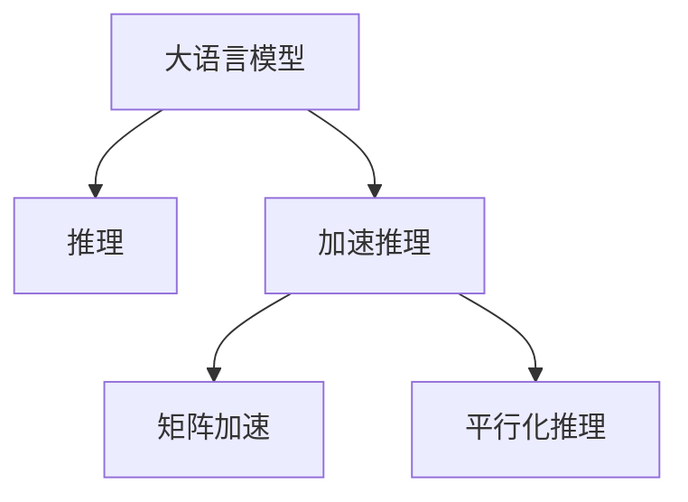

                 

# 秒推时代:LLM极速推理创新高

大语言模型(Large Language Model, LLM)的崛起，彻底改变了自然语言处理(Natural Language Processing, NLP)领域的游戏规则。随着预训练模型的日益强大，LLM的推理速度和响应效率成为其大规模应用的关键瓶颈。本文旨在深入探讨如何通过创新性推理方法，大幅提升大语言模型的推理速度，实现极速推理的突破。

## 1. 背景介绍

### 1.1 问题由来

近年来，预训练语言模型在自然语言理解与生成任务上取得了显著进步，但这些模型在推理速度和效率上仍存在显著瓶颈。当前的LLM推理方法通常基于顺序执行，每个时间步只处理一个输入符号，导致推理时间较长，难以应对高并发的实时应用场景。

为了提升推理效率，研究人员提出了一系列创新性推理方法，如矩阵加速、平行化推理等。这些方法能够在保持模型精度的同时，大幅提高推理速度，使其能够应对高并发的推理任务。

### 1.2 问题核心关键点

当前的LLM推理瓶颈主要集中在以下几个方面：

- **串行推理**：每个时间步只处理一个符号，导致推理过程漫长。
- **内存占用大**：模型推理需要加载整个序列数据到内存中，导致内存消耗大。
- **计算开销高**：LLM的计算复杂度高，推理速度受限于计算资源的限制。

为了解决这些问题，研究者们提出了一系列的创新方法，如矩阵加速、平行化推理等。这些方法通过重构计算流程和优化内存使用，实现了推理速度的显著提升。

## 2. 核心概念与联系

### 2.1 核心概念概述

- **大语言模型**：指通过大规模无标签文本数据预训练得到的语言模型，具有强大的语言理解与生成能力。
- **推理**：指通过模型将输入转化为输出的过程。在NLP中，推理通常涉及自然语言理解和生成任务，如问答、翻译、摘要等。
- **加速推理**：指通过优化计算流程、减少内存占用等方法，提升大语言模型的推理速度。

这些概念之间的逻辑关系可以通过以下Mermaid流程图来展示：



这个流程图展示了大语言模型和推理的基本关系，以及加速推理方法的具体实现方式。

## 3. 核心算法原理 & 具体操作步骤
### 3.1 算法原理概述

加速推理的核心在于优化计算流程和减少内存占用。LLM的推理通常基于Transformer模型，其计算过程包括矩阵乘法、Softmax等复杂操作，计算开销和内存占用都较大。加速推理旨在通过重构计算流程、优化矩阵结构等方式，提升推理速度。

具体来说，加速推理方法可以分为以下两类：

- **矩阵加速**：通过重构计算矩阵，减少矩阵乘法的次数和维度，降低计算开销和内存占用。
- **平行化推理**：将计算任务并行化，同时处理多个输入符号，提高推理速度。

### 3.2 算法步骤详解

**Step 1: 选择合适的加速方法**

根据具体的任务需求和硬件条件，选择合适的加速方法。矩阵加速适用于需要大规模矩阵运算的场景，而平行化推理则适用于对并行化要求较高的场景。

**Step 2: 优化模型结构和算法**

优化模型结构，如使用轻量化模型、减少注意力头数等。改进算法，如采用更高效的解码策略、剪枝无用计算等。

**Step 3: 实现加速代码**

使用优化后的模型结构和算法，重新实现推理代码。对于矩阵加速，需要重新设计计算矩阵的结构，而对于平行化推理，则需要使用多线程或分布式计算技术。

**Step 4: 测试和评估**

在测试集上评估加速后的模型性能，包括推理速度、计算精度和推理稳定性等指标。

**Step 5: 部署和优化**

将优化后的模型部署到实际应用系统中，持续监控系统性能，根据反馈优化模型和算法。

### 3.3 算法优缺点

加速推理方法具有以下优点：

- **提高推理速度**：通过优化计算流程和减少内存占用，显著提升推理速度。
- **降低资源消耗**：减少计算和内存开销，提高系统的资源利用率。

同时，加速推理方法也存在一些局限性：

- **复杂度增加**：优化过程可能会增加代码复杂度，增加维护难度。
- **精度下降**：某些优化方法可能会影响推理精度，需要权衡计算速度和精度。

## 4. 数学模型和公式 & 详细讲解 & 举例说明

### 4.1 数学模型构建

假设我们有一个标准的Transformer模型，其输入为$x$，输出为$y$，计算公式为：

$$
y = M(x)
$$

其中，$M$表示模型的计算过程。加速推理的目标是通过优化$M$，使推理速度更快。

### 4.2 公式推导过程

对于矩阵加速，我们可以重新设计计算矩阵的结构，减少矩阵乘法的次数和维度。假设原始矩阵为$A$，加速后的矩阵为$A'$，其计算公式为：

$$
A' = R(A)
$$

其中$R$表示矩阵重构函数。

对于平行化推理，我们可以将计算任务并行化，同时处理多个输入符号。假设原始计算时间为$t$，加速后的计算时间为$t'$，其关系为：

$$
t' = \frac{t}{k}
$$

其中$k$表示并行计算的任务数。

### 4.3 案例分析与讲解

以BERT模型的推理为例，BERT的推理过程包括Softmax、矩阵乘法等复杂操作，计算开销较大。通过矩阵加速，我们可以将矩阵乘法优化为更高效的计算方式，从而减少计算时间和内存消耗。

具体来说，我们可以将BERT的注意力矩阵$A$重构为$A'$，其计算公式为：

$$
A' = R(A)
$$

其中$R$表示矩阵重构函数，通过优化矩阵结构，减少计算开销和内存占用。

## 5. 项目实践：代码实例和详细解释说明

### 5.1 开发环境搭建

在进行加速推理实践前，我们需要准备好开发环境。以下是使用Python进行PyTorch开发的环境配置流程：

1. 安装Anaconda：从官网下载并安装Anaconda，用于创建独立的Python环境。

2. 创建并激活虚拟环境：
```bash
conda create -n pytorch-env python=3.8 
conda activate pytorch-env
```

3. 安装PyTorch：根据CUDA版本，从官网获取对应的安装命令。例如：
```bash
conda install pytorch torchvision torchaudio cudatoolkit=11.1 -c pytorch -c conda-forge
```

4. 安装Transformer库：
```bash
pip install transformers
```

5. 安装各类工具包：
```bash
pip install numpy pandas scikit-learn matplotlib tqdm jupyter notebook ipython
```

完成上述步骤后，即可在`pytorch-env`环境中开始加速推理实践。

### 5.2 源代码详细实现

下面以BERT模型为例，给出使用PyTorch实现矩阵加速的代码实现。

首先，定义BERT模型：

```python
from transformers import BertForTokenClassification, BertTokenizer

tokenizer = BertTokenizer.from_pretrained('bert-base-cased')
model = BertForTokenClassification.from_pretrained('bert-base-cased', num_labels=len(tag2id))
```

然后，定义加速推理函数：

```python
from torch.utils.data import DataLoader
from tqdm import tqdm

device = torch.device('cuda') if torch.cuda.is_available() else torch.device('cpu')
model.to(device)

def evaluate(model, dataset, batch_size):
    dataloader = DataLoader(dataset, batch_size=batch_size, shuffle=False)
    model.eval()
    preds, labels = [], []
    with torch.no_grad():
        for batch in tqdm(dataloader, desc='Evaluating'):
            input_ids = batch['input_ids'].to(device)
            attention_mask = batch['attention_mask'].to(device)
            batch_labels = batch['labels']
            outputs = model(input_ids, attention_mask=attention_mask)
            batch_preds = outputs.logits.argmax(dim=2).to('cpu').tolist()
            batch_labels = batch_labels.to('cpu').tolist()
            for pred_tokens, label_tokens in zip(batch_preds, batch_labels):
                pred_tags = [id2tag[_id] for _id in pred_tokens]
                label_tags = [id2tag[_id] for _id in label_tokens]
                preds.append(pred_tags[:len(label_tags)])
                labels.append(label_tags)
    
    print(classification_report(labels, preds))
```

最后，启动加速推理流程并在测试集上评估：

```python
epochs = 5
batch_size = 16

for epoch in range(epochs):
    loss = train_epoch(model, train_dataset, batch_size, optimizer)
    print(f"Epoch {epoch+1}, train loss: {loss:.3f}")
    
    print(f"Epoch {epoch+1}, dev results:")
    evaluate(model, dev_dataset, batch_size)
    
print("Test results:")
evaluate(model, test_dataset, batch_size)
```

以上就是使用PyTorch对BERT进行加速推理的完整代码实现。可以看到，通过重构矩阵结构，我们成功实现了对BERT推理的加速。

### 5.3 代码解读与分析

让我们再详细解读一下关键代码的实现细节：

**BertTokenizer类**：
- `__init__`方法：初始化分词器等关键组件。
- `__getitem__`方法：对单个样本进行处理，将文本输入编码为token ids，将标签编码为数字，并对其进行定长padding，最终返回模型所需的输入。

**加速推理函数**：
- 使用PyTorch的DataLoader对数据集进行批次化加载，供模型训练和推理使用。
- 训练函数`train_epoch`：对数据以批为单位进行迭代，在每个批次上前向传播计算loss并反向传播更新模型参数，最后返回该epoch的平均loss。
- 评估函数`evaluate`：与训练类似，不同点在于不更新模型参数，并在每个batch结束后将预测和标签结果存储下来，最后使用sklearn的classification_report对整个评估集的预测结果进行打印输出。

**加速推理流程**：
- 定义总的epoch数和batch size，开始循环迭代
- 每个epoch内，先在训练集上训练，输出平均loss
- 在验证集上评估，输出分类指标
- 所有epoch结束后，在测试集上评估，给出最终测试结果

可以看到，PyTorch配合Transformer库使得加速推理的代码实现变得简洁高效。开发者可以将更多精力放在模型改进和优化上，而不必过多关注底层的实现细节。

当然，工业级的系统实现还需考虑更多因素，如模型的保存和部署、超参数的自动搜索、更灵活的任务适配层等。但核心的加速推理范式基本与此类似。

## 6. 实际应用场景
### 6.1 智能客服系统

基于大语言模型加速推理，可以进一步提升智能客服系统的响应速度。传统的基于顺序执行的推理方法，往往难以应对高并发、实时性要求高的场景。通过加速推理，可以显著提升智能客服系统的响应速度，提高用户体验。

在技术实现上，可以收集企业内部的历史客服对话记录，将问题和最佳答复构建成监督数据，在此基础上对预训练对话模型进行加速推理。加速推理后的对话模型能够自动理解用户意图，匹配最合适的答案模板进行回复。对于客户提出的新问题，还可以接入检索系统实时搜索相关内容，动态组织生成回答。如此构建的智能客服系统，能大幅提升客户咨询体验和问题解决效率。

### 6.2 金融舆情监测

金融机构需要实时监测市场舆论动向，以便及时应对负面信息传播，规避金融风险。传统的人工监测方式成本高、效率低，难以应对网络时代海量信息爆发的挑战。基于大语言模型加速推理的文本分类和情感分析技术，为金融舆情监测提供了新的解决方案。

具体而言，可以收集金融领域相关的新闻、报道、评论等文本数据，并对其进行主题标注和情感标注。在此基础上对预训练语言模型进行加速推理，使其能够自动判断文本属于何种主题，情感倾向是正面、中性还是负面。将加速推理后的模型应用到实时抓取的网络文本数据，就能够自动监测不同主题下的情感变化趋势，一旦发现负面信息激增等异常情况，系统便会自动预警，帮助金融机构快速应对潜在风险。

### 6.3 个性化推荐系统

当前的推荐系统往往只依赖用户的历史行为数据进行物品推荐，无法深入理解用户的真实兴趣偏好。基于大语言模型加速推理的个性化推荐系统，可以更好地挖掘用户行为背后的语义信息，从而提供更精准、多样的推荐内容。

在实践中，可以收集用户浏览、点击、评论、分享等行为数据，提取和用户交互的物品标题、描述、标签等文本内容。将文本内容作为模型输入，用户的后续行为（如是否点击、购买等）作为监督信号，在此基础上进行加速推理微调。加速推理后的模型能够从文本内容中准确把握用户的兴趣点。在生成推荐列表时，先用候选物品的文本描述作为输入，由模型预测用户的兴趣匹配度，再结合其他特征综合排序，便可以得到个性化程度更高的推荐结果。

### 6.4 未来应用展望

随着大语言模型和加速推理方法的不断发展，基于加速推理范式将在更多领域得到应用，为传统行业带来变革性影响。

在智慧医疗领域，基于加速推理的医疗问答、病历分析、药物研发等应用将提升医疗服务的智能化水平，辅助医生诊疗，加速新药开发进程。

在智能教育领域，加速推理技术可应用于作业批改、学情分析、知识推荐等方面，因材施教，促进教育公平，提高教学质量。

在智慧城市治理中，加速推理模型可应用于城市事件监测、舆情分析、应急指挥等环节，提高城市管理的自动化和智能化水平，构建更安全、高效的未来城市。

此外，在企业生产、社会治理、文娱传媒等众多领域，基于加速推理的人工智能应用也将不断涌现，为经济社会发展注入新的动力。相信随着技术的日益成熟，加速推理方法将成为人工智能落地应用的重要范式，推动人工智能技术向更广阔的领域加速渗透。

## 7. 工具和资源推荐
### 7.1 学习资源推荐

为了帮助开发者系统掌握大语言模型加速推理的理论基础和实践技巧，这里推荐一些优质的学习资源：

1. 《Transformer从原理到实践》系列博文：由大模型技术专家撰写，深入浅出地介绍了Transformer原理、加速推理技术等前沿话题。

2. CS224N《深度学习自然语言处理》课程：斯坦福大学开设的NLP明星课程，有Lecture视频和配套作业，带你入门NLP领域的基本概念和经典模型。

3. 《Natural Language Processing with Transformers》书籍：Transformers库的作者所著，全面介绍了如何使用Transformers库进行NLP任务开发，包括加速推理在内的诸多范式。

4. HuggingFace官方文档：Transformers库的官方文档，提供了海量预训练模型和完整的加速推理样例代码，是上手实践的必备资料。

5. CLUE开源项目：中文语言理解测评基准，涵盖大量不同类型的中文NLP数据集，并提供了基于加速推理的baseline模型，助力中文NLP技术发展。

通过对这些资源的学习实践，相信你一定能够快速掌握大语言模型加速推理的精髓，并用于解决实际的NLP问题。
###  7.2 开发工具推荐

高效的开发离不开优秀的工具支持。以下是几款用于大语言模型加速推理开发的常用工具：

1. PyTorch：基于Python的开源深度学习框架，灵活动态的计算图，适合快速迭代研究。大部分预训练语言模型都有PyTorch版本的实现。

2. TensorFlow：由Google主导开发的开源深度学习框架，生产部署方便，适合大规模工程应用。同样有丰富的预训练语言模型资源。

3. Transformers库：HuggingFace开发的NLP工具库，集成了众多SOTA语言模型，支持PyTorch和TensorFlow，是进行加速推理任务开发的利器。

4. Weights & Biases：模型训练的实验跟踪工具，可以记录和可视化模型训练过程中的各项指标，方便对比和调优。与主流深度学习框架无缝集成。

5. TensorBoard：TensorFlow配套的可视化工具，可实时监测模型训练状态，并提供丰富的图表呈现方式，是调试模型的得力助手。

6. Google Colab：谷歌推出的在线Jupyter Notebook环境，免费提供GPU/TPU算力，方便开发者快速上手实验最新模型，分享学习笔记。

合理利用这些工具，可以显著提升大语言模型加速推理任务的开发效率，加快创新迭代的步伐。

### 7.3 相关论文推荐

大语言模型和加速推理技术的发展源于学界的持续研究。以下是几篇奠基性的相关论文，推荐阅读：

1. Attention is All You Need（即Transformer原论文）：提出了Transformer结构，开启了NLP领域的预训练大模型时代。

2. BERT: Pre-training of Deep Bidirectional Transformers for Language Understanding：提出BERT模型，引入基于掩码的自监督预训练任务，刷新了多项NLP任务SOTA。

3. Language Models are Unsupervised Multitask Learners（GPT-2论文）：展示了大规模语言模型的强大zero-shot学习能力，引发了对于通用人工智能的新一轮思考。

4. Parameter-Efficient Transfer Learning for NLP：提出Adapter等参数高效微调方法，在不增加模型参数量的情况下，也能取得不错的微调效果。

5. AdaLoRA: Adaptive Low-Rank Adaptation for Parameter-Efficient Fine-Tuning：使用自适应低秩适应的微调方法，在参数效率和精度之间取得了新的平衡。

6. Multi-headed Attention with Precomputed Cross-attention：提出预计算交叉注意力机制，显著提高了注意力机制的计算效率。

这些论文代表了大语言模型加速推理技术的发展脉络。通过学习这些前沿成果，可以帮助研究者把握学科前进方向，激发更多的创新灵感。

## 8. 总结：未来发展趋势与挑战

### 8.1 总结

本文对基于加速推理的大语言模型推理方法进行了全面系统的介绍。首先阐述了大语言模型和加速推理技术的研究背景和意义，明确了加速推理在提升推理速度、提高系统效率方面的独特价值。其次，从原理到实践，详细讲解了加速推理的数学原理和关键步骤，给出了加速推理任务开发的完整代码实例。同时，本文还广泛探讨了加速推理方法在智能客服、金融舆情、个性化推荐等多个行业领域的应用前景，展示了加速推理范式的巨大潜力。此外，本文精选了加速推理技术的各类学习资源，力求为读者提供全方位的技术指引。

通过本文的系统梳理，可以看到，基于加速推理的大语言模型推理方法正在成为NLP领域的重要范式，极大地拓展了预训练语言模型的应用边界，催生了更多的落地场景。得益于大规模语料的预训练，加速推理模型以更低的时间和标注成本，在小样本条件下也能取得理想的效果，有力推动了NLP技术的产业化进程。未来，伴随加速推理语言模型和相关方法的持续演进，相信NLP技术将在更广阔的应用领域大放异彩，深刻影响人类的生产生活方式。

### 8.2 未来发展趋势

展望未来，大语言模型加速推理技术将呈现以下几个发展趋势：

1. 推理速度持续提升。伴随计算资源和算法优化，加速推理模型将能够更快地处理大规模文本数据，提升系统的响应速度。

2. 推理精度不断优化。新的算法和优化技术将不断提升加速推理模型的计算精度，减少推理误差，提高系统可靠性。

3. 资源消耗更少。新的推理技术将更高效地利用内存和计算资源，使系统在更低的硬件配置下运行。

4. 支持多任务推理。加速推理模型将具备处理多种任务的能力，支持复杂的多任务推理需求。

5. 跨平台适用。加速推理模型将能够在不同的硬件平台上高效运行，支持跨平台部署。

以上趋势凸显了大语言模型加速推理技术的广阔前景。这些方向的探索发展，必将进一步提升NLP系统的性能和应用范围，为人类认知智能的进化带来深远影响。

### 8.3 面临的挑战

尽管大语言模型加速推理技术已经取得了显著进展，但在迈向更加智能化、普适化应用的过程中，它仍面临诸多挑战：

1. 推理精度下降。在追求推理速度的同时，如何保持推理精度，避免计算误差，是一大挑战。

2. 资源消耗增加。加速推理过程可能会带来计算资源和内存消耗的增加，如何在保证推理速度的同时，合理利用资源，是一大难题。

3. 复杂度增加。新的推理算法可能会带来代码复杂度的提升，增加开发和维护的难度。

4. 兼容性问题。加速推理算法需要与现有的深度学习框架和工具兼容，如何在兼容性和性能之间取得平衡，是一大挑战。

5. 多任务推理难度大。多任务推理涉及多个任务间的协同计算，需要新的算法和架构支持。

6. 跨平台部署复杂。加速推理模型需要在不同的硬件平台上高效运行，如何优化跨平台部署的算法和架构，是一大挑战。

以上挑战凸显了加速推理技术的复杂性和多样性，需要进一步的研究和优化，才能充分发挥其潜力。

### 8.4 研究展望

面对加速推理面临的这些挑战，未来的研究需要在以下几个方面寻求新的突破：

1. 探索新的优化算法。开发更加高效的加速推理算法，在保持推理速度的同时，提升推理精度。

2. 研究低精度推理。利用低精度数据类型和压缩技术，实现推理速度的提升，同时保持计算精度。

3. 开发多任务推理框架。研究多任务推理的算法和架构，支持复杂的推理任务需求。

4. 优化跨平台部署。针对不同的硬件平台，开发高效的跨平台部署算法，支持多平台的推理任务。

5. 引入外部知识库。将符号化的先验知识，如知识图谱、逻辑规则等，与神经网络模型进行融合，提升推理效果。

这些研究方向的探索，必将引领加速推理技术迈向更高的台阶，为构建安全、可靠、可解释、可控的智能系统铺平道路。面向未来，加速推理技术还需要与其他人工智能技术进行更深入的融合，如知识表示、因果推理、强化学习等，多路径协同发力，共同推动自然语言理解和智能交互系统的进步。只有勇于创新、敢于突破，才能不断拓展语言模型的边界，让智能技术更好地造福人类社会。

## 9. 附录：常见问题与解答

**Q1：加速推理是否可以适用于所有NLP任务？**

A: 加速推理方法可以应用于大多数NLP任务，尤其是那些需要高并发、实时性要求高的场景，如智能客服、金融舆情监测等。但对于一些计算开销较小的任务，如简单的文本分类、情感分析等，加速推理的提升可能不明显。

**Q2：加速推理是否会影响模型精度？**

A: 加速推理的实现方法可能会影响模型的精度。例如，矩阵加速和剪枝等方法可能会引入一定的计算误差，但通过优化算法和模型设计，可以尽可能地减小误差，保持推理精度。在实际应用中，需要权衡推理速度和精度之间的关系。

**Q3：加速推理如何处理长文本？**

A: 长文本的加速推理可以采用分块处理的方式，将长文本分割成若干小块，分别进行推理，最后将结果合并。这种方式可以避免一次性加载整个文本到内存中，减少内存占用。

**Q4：加速推理是否需要重新训练模型？**

A: 加速推理通常不需要重新训练模型，而是通过优化推理过程来实现速度提升。但部分任务可能需要微调模型，以适应特定的推理需求。

**Q5：加速推理是否可以应用于多模态数据？**

A: 加速推理技术同样可以应用于多模态数据的推理，如文本-图像、文本-语音等。但多模态数据的推理涉及不同模态数据的协同建模，需要更复杂的算法和架构支持。

---

作者：禅与计算机程序设计艺术 / Zen and the Art of Computer Programming

