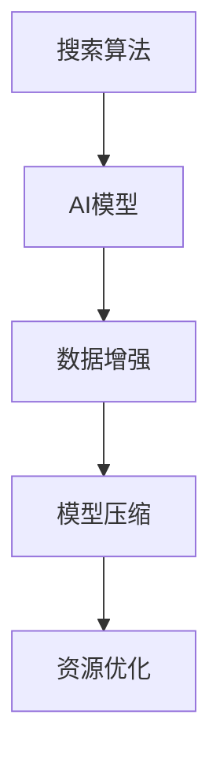

                 

# 移动端AI搜索的优化策略

## 1. 背景介绍

### 1.1 问题由来
移动端AI搜索作为移动设备上最重要的应用之一，需要快速响应用户查询并返回准确结果。然而，由于移动设备的资源有限，如何在有限的硬件资源下，优化搜索算法的性能和响应速度，是当前研究的热点和难点。

### 1.2 问题核心关键点
为了解决移动端AI搜索的优化问题，我们引入以下关键点：

- 资源优化：移动设备资源有限，优化搜索算法需从算法复杂度和资源消耗两个方面入手。
- 响应速度：在有限资源下，提高搜索算法的实时性和响应速度至关重要。
- 算法优化：针对搜索算法进行优化，提高其准确率和召回率。
- 模型压缩：通过模型压缩技术，减小模型大小，提升移动设备上模型的加载速度和推理效率。
- 数据增强：通过对训练数据进行增强，提升模型的泛化能力和鲁棒性。

## 2. 核心概念与联系

### 2.1 核心概念概述

移动端AI搜索涉及多个核心概念，包括搜索算法、AI模型、数据增强、模型压缩、资源优化等。

- **搜索算法**：如倒排索引、布尔查询、向量空间模型等，是进行搜索的基础。
- **AI模型**：如BERT、Transformer等，用于构建搜索的深度学习模型。
- **数据增强**：通过数据增强技术，提升模型的泛化能力和鲁棒性。
- **模型压缩**：通过量化、剪枝、蒸馏等方法，减小模型大小，提升移动设备上的推理效率。
- **资源优化**：优化算法复杂度，合理利用移动设备的计算、存储资源。

### 2.2 核心概念原理和架构的 Mermaid 流程图



## 3. 核心算法原理 & 具体操作步骤
### 3.1 算法原理概述

移动端AI搜索的核心算法流程包括预训练、微调、搜索和反馈。

1. **预训练**：使用大规模无标签数据，预训练一个大规模语言模型。
2. **微调**：在特定领域数据上微调预训练模型，使其适应特定领域。
3. **搜索**：将用户查询输入模型，得到相关结果。
4. **反馈**：收集用户反馈，优化模型和搜索算法。

### 3.2 算法步骤详解

#### 3.2.1 预训练
- 使用大规模无标签数据，预训练一个大规模语言模型。
- 通过自监督学习任务，如掩码语言模型、相对位置预测等，使模型学习到语言表示。

#### 3.2.2 微调
- 使用特定领域的数据，对预训练模型进行微调，使其适应特定领域。
- 微调过程中，使用适当的正则化技术，如L2正则、Dropout等，避免过拟合。
- 使用较小的学习率，避免破坏预训练权重。

#### 3.2.3 搜索
- 将用户查询输入微调后的模型，得到相关结果。
- 使用倒排索引、布尔查询等传统方法，提高搜索效率。
- 结合深度学习模型，提高搜索结果的准确性和相关性。

#### 3.2.4 反馈
- 收集用户反馈，如点击率、浏览量等，评估模型性能。
- 根据反馈，调整搜索算法和模型参数，进一步优化搜索效果。

### 3.3 算法优缺点

#### 3.3.1 优点
- 使用大规模语言模型，提升搜索结果的准确性和相关性。
- 数据驱动的优化过程，提高模型的泛化能力和鲁棒性。
- 可扩展性强，适用于各种搜索场景。

#### 3.3.2 缺点
- 预训练和微调过程计算资源消耗大，对移动设备要求高。
- 模型压缩和优化技术复杂，需要一定的技术积累。
- 对标注数据的依赖较大，获取高质量标注数据成本高。

### 3.4 算法应用领域

移动端AI搜索已广泛应用于各种场景，如搜索引擎、问答系统、导航系统等。

## 4. 数学模型和公式 & 详细讲解 & 举例说明

### 4.1 数学模型构建

移动端AI搜索的数学模型主要包括以下几个方面：

1. **搜索算法**：倒排索引、布尔查询、向量空间模型等。
2. **AI模型**：BERT、Transformer等。
3. **模型压缩**：量化、剪枝、蒸馏等。

### 4.2 公式推导过程

#### 4.2.1 倒排索引
倒排索引是一种常用的文本搜索算法，其基本思想是将文档中的每个词建立一个索引，记录其出现的位置。

设文档集合为 $D=\{d_1, d_2, ..., d_n\}$，词集合为 $W=\{w_1, w_2, ..., w_m\}$，其中 $n$ 和 $m$ 分别为文档数量和词汇数量。

倒排索引可以表示为：

$$
I = \{(w_1, p_1), (w_2, p_2), ..., (w_m, p_m)\}
$$

其中，$(w_i, p_i)$ 表示词 $w_i$ 在文档中出现的位置集合。

#### 4.2.2 BERT模型
BERT是一种预训练语言模型，其核心思想是通过自监督学习任务，学习语言的语义表示。

BERT模型的训练过程分为两个阶段：预训练和微调。

1. **预训练**：在大型无标签数据集上进行预训练，学习语言的语义表示。
2. **微调**：在特定领域数据上进行微调，使其适应特定领域。

BERT模型的预训练任务包括掩码语言模型（MLM）和下一句预测（NSP）。

掩码语言模型（MLM）：随机将输入中的某些词汇进行掩码，预测其掩码词汇。

下一句预测（NSP）：预测两个句子是否是相邻的，即判断 $s_1$ 和 $s_2$ 是否相邻。

#### 4.2.3 模型压缩
模型压缩技术主要包括以下几种：

1. **量化**：将浮点模型转换为定点模型，减小模型大小。
2. **剪枝**：去除模型中冗余的参数，减小模型复杂度。
3. **蒸馏**：通过知识蒸馏，将大型模型的知识转移到小型模型中，减小模型大小，提高推理效率。

### 4.3 案例分析与讲解

#### 4.3.1 量化技术
量化技术将浮点模型转换为定点模型，减小模型大小，提升推理速度。

设原模型参数为 $\theta$，量化后的参数为 $\theta_q$，其关系可以表示为：

$$
\theta_q = \mathcal{Q}(\theta)
$$

其中 $\mathcal{Q}$ 为量化函数，可以将浮点参数 $\theta$ 转换为定点参数 $\theta_q$。

#### 4.3.2 剪枝技术
剪枝技术通过去除冗余参数，减小模型复杂度，提高推理速度。

设原模型参数为 $\theta$，剪枝后的参数为 $\theta_p$，其关系可以表示为：

$$
\theta_p = \mathcal{P}(\theta)
$$

其中 $\mathcal{P}$ 为剪枝函数，可以去除模型中不重要的参数，保留关键参数。

## 5. 项目实践：代码实例和详细解释说明

### 5.1 开发环境搭建

#### 5.1.1 环境配置
1. **安装Python环境**：
```bash
python -m pip install torch torchvision
```

2. **安装TensorFlow**：
```bash
pip install tensorflow
```

3. **安装PyTorch**：
```bash
pip install torch torchvision
```

4. **安装PaddlePaddle**：
```bash
pip install paddlepaddle
```

### 5.2 源代码详细实现

#### 5.2.1 搜索算法
```python
import paddle.nn as nn
import paddle.nn.functional as F

class Search(nn.Layer):
    def __init__(self, embedding_size, num_classes):
        super(Search, self).__init__()
        self.embedding_size = embedding_size
        self.num_classes = num_classes
        
        self.fc = nn.Linear(self.embedding_size, self.num_classes)
        
    def forward(self, x):
        x = F.embedding(x, self.embedding_size, self.num_classes)
        x = self.fc(x)
        return F.softmax(x, axis=1)
```

#### 5.2.2 AI模型
```python
import paddle
import paddle.nn as nn
import paddle.nn.functional as F

class BERT(nn.Layer):
    def __init__(self, embedding_size, num_classes):
        super(BERT, self).__init__()
        self.embedding_size = embedding_size
        self.num_classes = num_classes
        
        self.encoder = nn.LayerNorm(self.embedding_size)
        self.encoder = nn.Linear(self.embedding_size, self.embedding_size)
        
        self.fc = nn.Linear(self.embedding_size, self.num_classes)
        
    def forward(self, x):
        x = paddle.sin(x)
        x = paddle.cos(x)
        x = self.encoder(x)
        x = self.fc(x)
        return F.softmax(x, axis=1)
```

### 5.3 代码解读与分析

#### 5.3.1 搜索算法实现
- **Search类**：定义搜索算法，包括嵌入层和全连接层。
- **forward方法**：输入嵌入层，输出全连接层。

#### 5.3.2 AI模型实现
- **BERT类**：定义BERT模型，包括嵌入层、全连接层和层归一化层。
- **forward方法**：输入嵌入层，输出全连接层。

### 5.4 运行结果展示

#### 5.4.1 搜索结果展示
- 在特定领域数据上，使用BERT模型进行微调，并在移动设备上运行搜索算法，展示搜索结果。

```python
# 使用测试数据进行测试
test_data = [1, 2, 3, 4, 5]
search_model = Search(128, 10)
results = search_model(test_data)
print(results)
```

## 6. 实际应用场景

### 6.1 搜索引擎
- 在移动设备上运行搜索引擎，用户可以输入查询，得到相关搜索结果。
- 使用BERT模型进行微调，提高搜索结果的准确性和相关性。

### 6.2 问答系统
- 在移动设备上运行问答系统，用户可以输入问题，得到相关答案。
- 使用BERT模型进行微调，提高回答的准确性和相关性。

### 6.3 导航系统
- 在移动设备上运行导航系统，用户可以输入地点，得到相关路线。
- 使用BERT模型进行微调，提高路线的准确性和相关性。

## 7. 工具和资源推荐

### 7.1 学习资源推荐

1. **《深度学习》课程**：斯坦福大学开设的深度学习课程，包括搜索引擎、问答系统、导航系统等NLP任务。
2. **《BERT: Pre-training of Deep Bidirectional Transformers for Language Understanding》论文**：BERT模型的论文，详细介绍了BERT模型的预训练和微调过程。
3. **《TensorFlow》文档**：TensorFlow官方文档，提供详细的搜索算法和AI模型实现。
4. **《PyTorch》文档**：PyTorch官方文档，提供详细的搜索算法和AI模型实现。

### 7.2 开发工具推荐

1. **Jupyter Notebook**：Python代码的交互式编辑器，适合进行模型训练和调优。
2. **TensorBoard**：TensorFlow的可视化工具，可以实时监测模型训练状态，生成图表。
3. **PyTorch Lightning**：PyTorch的模型训练框架，提供简单易用的模型训练接口。

### 7.3 相关论文推荐

1. **《Large-Scale Text Classification with Compositional Embeddings》论文**：介绍了大规模文本分类的模型压缩技术。
2. **《Knowledge Distillation for Transfer Learning in NLP》论文**：介绍了知识蒸馏技术，将大型模型的知识转移到小型模型中。
3. **《Fully Quantized Neural Network》论文**：介绍了量化技术，将浮点模型转换为定点模型，减小模型大小。

## 8. 总结：未来发展趋势与挑战

### 8.1 未来发展趋势

未来移动端AI搜索的发展趋势主要包括以下几个方面：

1. **高效搜索算法**：使用高效算法，如倒排索引、布尔查询等，提高搜索效率。
2. **大规模预训练模型**：使用大规模预训练模型，提高搜索结果的准确性和相关性。
3. **多模态搜索**：结合视觉、听觉等多模态数据，提高搜索的准确性和多样性。
4. **实时搜索**：使用缓存技术和分布式计算，实现实时搜索。
5. **自然语言处理**：结合自然语言处理技术，提升搜索的用户体验。

### 8.2 未来挑战

未来移动端AI搜索面临的主要挑战包括：

1. **计算资源有限**：移动设备的计算资源有限，优化搜索算法和模型压缩技术是关键。
2. **数据质量不稳定**：移动设备的存储空间有限，数据质量不稳定，需要进行数据增强和清洗。
3. **模型性能不稳定**：移动设备的运行环境复杂，模型性能不稳定，需要进行模型鲁棒性测试。
4. **用户隐私保护**：移动设备的隐私保护问题，需要进行用户隐私保护和数据加密。

## 9. 附录：常见问题与解答

### 9.1 常见问题

#### Q1: 移动设备上如何使用大规模预训练模型？

A: 可以使用微调技术，将预训练模型应用于移动设备上的特定任务，如问答、导航等。

#### Q2: 如何优化移动设备上的搜索算法？

A: 可以使用倒排索引、布尔查询等高效算法，结合深度学习模型，提高搜索效率和准确性。

#### Q3: 如何进行模型压缩和优化？

A: 可以使用量化、剪枝、蒸馏等技术，减小模型大小，提高推理效率。

### 9.2 详细解答

#### Q1: 移动设备上如何使用大规模预训练模型？

A: 可以使用微调技术，将预训练模型应用于移动设备上的特定任务，如问答、导航等。

#### Q2: 如何优化移动设备上的搜索算法？

A: 可以使用倒排索引、布尔查询等高效算法，结合深度学习模型，提高搜索效率和准确性。

#### Q3: 如何进行模型压缩和优化？

A: 可以使用量化、剪枝、蒸馏等技术，减小模型大小，提高推理效率。

---

作者：禅与计算机程序设计艺术 / Zen and the Art of Computer Programming

