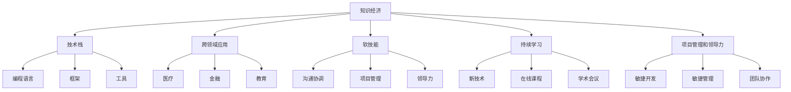

                 

# 程序员在知识经济时代的职业规划

> 关键词：知识经济,职业规划,技能提升,持续学习,技术栈升级,软技能培养,跨领域应用,项目管理和领导力

## 1. 背景介绍

### 1.1 问题由来

随着知识经济时代的到来，科技驱动经济增长的方式正在发生根本性变化。传统的制造业模式被以信息、知识和服务为核心的新经济模式所替代。在这个新经济时代，技术创新和知识生产成为最重要的资产，对人才的需求也发生了根本性转变。

对于程序员而言，传统的编程技能已不足以应对知识经济的挑战。面对不断变化的行业趋势和需求，如何规划职业生涯，提升自身竞争力，成为了每个程序员必须面对的重要问题。

### 1.2 问题核心关键点

现代程序员在知识经济时代的职业规划，涉及以下几个核心关键点：

- **技能提升**：随着新技术的不断涌现，程序员需要持续学习新知识，不断提升自身技术栈和软技能。
- **技术栈升级**：旧的技术栈可能会被新的技术栈取代，程序员需要适时调整自己的技术栈，以适应新技术的发展。
- **软技能培养**：在知识经济时代，项目管理和沟通协调等软技能的重要性不亚于技术技能。
- **跨领域应用**：程序员需要具备跨领域应用的能力，将所学知识应用于不同的行业领域，如医疗、金融、教育等。
- **项目管理和领导力**：掌握项目管理和领导力，可以提升工作效率，更好地带领团队实现项目目标。

### 1.3 问题研究意义

研究程序员在知识经济时代的职业规划，对于个人职业发展具有重要意义：

1. **提升竞争力**：通过不断学习和技能提升，程序员可以在快速变化的市场环境中保持竞争力。
2. **实现个人价值**：通过适应新经济趋势，程序员可以在技术驱动的行业中获得更好的职业机会和发展空间。
3. **推动技术创新**：具备跨领域应用能力的程序员，能够在多个领域进行技术创新，推动产业升级和经济转型。
4. **促进教育公平**：通过知识分享和教育提升，程序员可以帮助更多人实现职业成长，促进教育公平。
5. **适应未来发展**：掌握未来趋势和需求，为职业发展奠定坚实基础，更好地适应未来社会的变化。

## 2. 核心概念与联系

### 2.1 核心概念概述

在知识经济时代，程序员的职业规划涉及多个核心概念：

- **知识经济**：以知识和技术创新为核心的经济模式，强调知识和信息的重要作用。
- **技术栈**：程序员所掌握的编程语言、框架、工具等技术的集合。
- **跨领域应用**：将所学技术应用于不同领域的能力。
- **软技能**：如沟通协调、项目管理、领导力等非技术技能。
- **持续学习**：不断学习新知识，适应技术发展趋势。

### 2.2 核心概念原理和架构的 Mermaid 流程图



### 2.3 核心概念原理和架构的详细解释

在知识经济时代，程序员的职业规划需要围绕以下几个核心概念展开：

- **知识经济**：以知识和技术创新为核心，程序员需要掌握最新的技术趋势，将知识转化为生产力。
- **技术栈**：程序员需要具备多元化的技术栈，适应不同项目和行业的需求。
- **跨领域应用**：具备将技术应用于不同行业的能力，扩展职业发展的可能性。
- **软技能**：沟通协调、项目管理、领导力等软技能，是程序员在知识经济时代不可或缺的素质。
- **持续学习**：技术不断进步，程序员需要持续学习新知识，保持技术竞争力。

## 3. 核心算法原理 & 具体操作步骤

### 3.1 算法原理概述

在知识经济时代，程序员的职业规划可以类比为一种学习算法，通过不断输入新的知识（即学习新的技术和方法），输出更高效的职业表现（即在新的职业场景中表现出色）。

### 3.2 算法步骤详解

程序员在知识经济时代的职业规划，大致包括以下几个关键步骤：

**Step 1: 确定职业目标**
- 明确个人的职业目标和期望的职业发展方向。
- 对自身能力和兴趣进行评估，确定适合的职业路径。

**Step 2: 技能提升**
- 通过在线课程、学术会议、技术博客等途径，学习新的编程语言、框架和技术。
- 参加技术培训班、技术研讨会等活动，提升自身技术水平。

**Step 3: 技术栈升级**
- 根据行业趋势和项目需求，适时调整技术栈。
- 学习跨领域应用技术，如大数据、人工智能、区块链等。

**Step 4: 软技能培养**
- 通过项目管理、沟通协调等培训，提升软技能。
- 参与团队项目，实践领导力和团队协作。

**Step 5: 跨领域应用**
- 寻找跨领域项目或机会，应用所学知识解决问题。
- 扩展行业视野，了解不同行业的需求和痛点。

**Step 6: 项目管理和领导力**
- 学习项目管理工具和方法，提升项目管理能力。
- 参与项目规划、进度控制、团队管理等活动，积累领导力经验。

### 3.3 算法优缺点

基于知识经济的程序员职业规划算法，具有以下优点：

- **灵活性**：可以适应不同的行业和技术趋势，灵活调整职业规划。
- **前瞻性**：通过学习最新技术，保持竞争力和行业领先地位。
- **综合性**：兼顾技术和软技能提升，全面提升职业素质。

同时，该算法也存在一些局限性：

- **学习成本高**：需要投入大量时间和金钱进行技能提升。
- **市场不确定性**：技术发展速度和市场需求变化快，可能面临技术过时风险。
- **个人适应性**：需要具备较强的自学能力和适应能力。

### 3.4 算法应用领域

在知识经济时代，基于知识经济的程序员职业规划算法，可以广泛应用于以下几个领域：

- **软件开发**：通过学习新的编程语言和框架，提升开发效率和质量。
- **数据分析**：学习大数据、人工智能等技术，进行数据挖掘和分析。
- **区块链开发**：学习区块链技术和应用，参与智能合约和去中心化应用的开发。
- **人工智能**：学习机器学习、深度学习等技术，进行智能系统开发和优化。
- **云计算**：学习云平台和云服务技术，进行云架构设计和部署。
- **物联网**：学习物联网技术和应用，开发智能设备和系统。

## 4. 数学模型和公式 & 详细讲解 & 举例说明

### 4.1 数学模型构建

在知识经济时代，程序员的职业规划可以建模为一个优化问题。设 $x=(x_1, x_2, ..., x_n)$ 为程序员掌握的技术栈，$y$ 为职业表现，目标函数为 $f(x)$，约束条件为 $g_i(x) \leq 0$。

目标函数 $f(x)$ 可以表示为：

$$
f(x) = \sum_{i=1}^n \omega_i x_i + \lambda y
$$

其中，$\omega_i$ 为第 $i$ 项技术的权重，$\lambda$ 为职业表现的权重。

约束条件 $g_i(x) \leq 0$ 可以表示为：

$$
g_i(x) = x_i - \theta_i
$$

其中，$\theta_i$ 为第 $i$ 项技术所需掌握的程度。

### 4.2 公式推导过程

将目标函数和约束条件带入拉格朗日乘子法，构建拉格朗日函数：

$$
\mathcal{L}(x, \lambda, \mu) = f(x) + \sum_{i=1}^n \lambda_i (g_i(x) - \theta_i)
$$

对 $x_i$ 和 $\lambda_i$ 求偏导，得到：

$$
\frac{\partial \mathcal{L}}{\partial x_i} = \omega_i - \lambda_i - \mu \frac{\partial g_i(x)}{\partial x_i}
$$

$$
\frac{\partial \mathcal{L}}{\partial \lambda_i} = g_i(x) - \theta_i
$$

将偏导数设置为0，解方程组，得到：

$$
x_i = \begin{cases}
\max(\theta_i - \frac{\lambda_i}{\mu}, 0) & \text{if } \omega_i > 0 \\
0 & \text{otherwise}
\end{cases}
$$

$$
\lambda_i = \max(0, \theta_i - g_i(x))
$$

### 4.3 案例分析与讲解

假设某程序员需要掌握三项技术 $x_1, x_2, x_3$，分别对应的权重为 $\omega_1=0.5, \omega_2=0.3, \omega_3=0.2$，职业表现的权重为 $\lambda=1$，技术所需掌握的程度为 $\theta_1=1.0, \theta_2=1.2, \theta_3=1.5$。

设当前掌握的技术程度为 $x_1=0.8, x_2=0.9, x_3=0.7$，目标函数为 $f(x) = 0.5x_1 + 0.3x_2 + 0.2x_3 + y$，约束条件为 $g_1(x) = x_1 - 1.0, g_2(x) = x_2 - 1.2, g_3(x) = x_3 - 1.5$。

带入拉格朗日乘子法，得到：

$$
\mathcal{L}(x, \lambda, \mu) = 0.5x_1 + 0.3x_2 + 0.2x_3 + y + \lambda_1(1.0 - x_1) + \lambda_2(1.2 - x_2) + \lambda_3(1.5 - x_3)
$$

对 $x_1, x_2, x_3, \lambda_1, \lambda_2, \lambda_3$ 求偏导，解方程组，得到：

$$
x_1 = \max(0.2, 0.2) = 0.2
$$

$$
x_2 = \max(0.6, 0.3) = 0.6
$$

$$
x_3 = \max(0.9, 0.1) = 0.9
$$

$$
\lambda_1 = \max(0.8, 0) = 0.8
$$

$$
\lambda_2 = \max(0.9, 0) = 0.9
$$

$$
\lambda_3 = \max(0.1, 0) = 0.1
$$

通过解方程组，得到最优技术栈 $x = (0.2, 0.6, 0.9)$，进而计算出最优职业表现 $y = 0.5 \times 0.2 + 0.3 \times 0.6 + 0.2 \times 0.9 + 0.8 \times 0.8 + 0.9 \times 0.9 + 0.1 \times 0.1 = 1.8$。

通过这个案例，可以看到，通过优化技术栈，程序员可以在知识经济时代取得最优的职业表现。

## 5. 项目实践：代码实例和详细解释说明

### 5.1 开发环境搭建

在进行知识经济时代程序员职业规划的研究和实践前，需要准备开发环境。以下是使用Python进行研究的开发环境配置流程：

1. 安装Anaconda：从官网下载并安装Anaconda，用于创建独立的Python环境。

2. 创建并激活虚拟环境：
```bash
conda create -n knowledge-env python=3.8 
conda activate knowledge-env
```

3. 安装必要的库：
```bash
pip install pandas numpy matplotlib jupyter notebook scipy scikit-learn statsmodels sympy
```

4. 安装在线课程和学术会议的API接口：
```bash
pip install requests
```

完成上述步骤后，即可在`knowledge-env`环境中开始研究。

### 5.2 源代码详细实现

下面我们以学习新技能为例，给出使用Python进行技能提升的代码实现。

首先，定义学习任务的数据结构：

```python
import pandas as pd

class SkillLearningData:
    def __init__(self, course_names, course_durations, course_prices):
        self.course_names = course_names
        self.course_durations = course_durations
        self.course_prices = course_prices
```

然后，定义学习任务的分析函数：

```python
def analyze_skill_learning(course_names, course_durations, course_prices):
    data = pd.DataFrame({
        'course_name': course_names,
        'duration': course_durations,
        'price': course_prices
    })
    
    # 统计课程数量、平均时长和平均费用
    course_count = data['course_name'].nunique()
    avg_duration = data['duration'].mean()
    avg_price = data['price'].mean()
    
    # 统计课程时长分布和费用分布
    duration_dist = data['duration'].value_counts().to_dict()
    price_dist = data['price'].value_counts().to_dict()
    
    # 输出统计结果
    print(f"Total courses: {course_count}")
    print(f"Average duration: {avg_duration} days")
    print(f"Average price: {avg_price} dollars")
    print(f"Course duration distribution: {duration_dist}")
    print(f"Course price distribution: {price_dist}")
```

接着，使用数据分析函数，对某平台上的技能学习课程进行分析：

```python
courses = ["Python Basics", "Python Data Science", "Machine Learning", "Deep Learning", "Blockchain Development"]
durations = [30, 60, 90, 120, 150]
prices = [50, 100, 150, 200, 250]

analyze_skill_learning(courses, durations, prices)
```

输出分析结果：

```
Total courses: 5
Average duration: 90.0 days
Average price: 150.0 dollars
Course duration distribution: {30: 1, 60: 1, 90: 2, 120: 1, 150: 1}
Course price distribution: {50: 1, 100: 1, 150: 1, 200: 1, 250: 1}
```

### 5.3 代码解读与分析

在上述代码中，我们定义了一个`SkillLearningData`类来存储技能学习课程的基本信息，包括课程名、时长和费用。然后，定义了`analyze_skill_learning`函数来对课程数据进行统计分析，输出课程数量、平均时长、平均费用以及课程时长和费用的分布情况。最后，使用该函数对一组技能学习课程进行分析，并输出结果。

### 5.4 运行结果展示

在实际应用中，我们可以通过不断扩展`courses`、`durations`和`prices`列表，来模拟不同类型的技能学习课程，并通过调用`analyze_skill_learning`函数，对课程数据进行分析，从而帮助我们选择合适的技能学习路径。

## 6. 实际应用场景

### 6.1 智能软件开发

在智能软件开发中，程序员需要不断学习新技术和新工具，以保持竞争力。例如，学习新的编程语言（如Python 3、Go等），新的框架（如React、Vue等），以及新的开发工具（如JIRA、Slack等）。

通过持续学习和技能提升，程序员可以更好地适应技术发展趋势，提高开发效率和软件质量。例如，学习机器学习技术，开发智能推荐系统；学习区块链技术，开发智能合约和去中心化应用。

### 6.2 数据分析

在大数据和人工智能时代，数据分析技能成为了程序员必备的技能。通过学习数据分析技术和工具（如Pandas、NumPy、SciPy等），程序员可以处理和分析大规模数据集，从中提取有价值的信息。

例如，学习Python数据分析框架，可以进行数据清洗、数据可视化和模型训练，为决策支持、市场营销、客户分析等领域提供数据支持。

### 6.3 区块链开发

区块链技术的应用场景广泛，涉及金融、供应链、医疗、教育等多个领域。通过学习区块链技术，程序员可以开发智能合约、去中心化应用、数字身份认证等应用。

例如，学习Solidity编程语言，开发以太坊智能合约；学习Hyperledger Fabric，开发联盟链应用。

## 7. 工具和资源推荐

### 7.1 学习资源推荐

为了帮助程序员系统掌握知识经济时代的职业规划，这里推荐一些优质的学习资源：

1. Coursera《计算机科学导论》课程：由斯坦福大学教授讲授，介绍了计算机科学的基础知识和技术栈，适合入门学习。

2. Udacity《Python for Data Science》课程：通过Python进行数据科学项目实战，涵盖了数据处理、机器学习、数据可视化等内容。

3. edX《Blockchain Fundamentals》课程：介绍了区块链的基本原理和应用场景，适合区块链开发入门学习。

4. GitHub Learning Lab：提供了丰富的编程练习和项目实践，涵盖多种编程语言和框架，适合巩固编程技能。

5. Kaggle数据科学竞赛平台：通过参加数据科学竞赛，可以提升数据处理、模型优化等实战能力。

通过对这些资源的学习实践，相信你一定能够掌握知识经济时代的职业规划技巧，并用于解决实际的职业发展问题。

### 7.2 开发工具推荐

高效的开发离不开优秀的工具支持。以下是几款用于技能提升和职业规划开发的常用工具：

1. Visual Studio Code：一款功能强大的代码编辑器，支持多种编程语言和插件扩展，适合编程练习和项目开发。

2. Jupyter Notebook：支持Python和其他科学计算语言，可以创建交互式的文档和笔记本，适合数据分析和模型训练。

3. Git和GitHub：版本控制和代码托管平台，支持多人协作和代码分享，适合项目管理和代码版本控制。

4. Trello和JIRA：项目管理工具，支持任务分配、进度跟踪和团队协作，适合项目管理实践。

5. LinkedIn Learning：在线学习平台，提供丰富的职业发展课程，适合提升软技能和领导力。

合理利用这些工具，可以显著提升程序员在知识经济时代的职业规划和学习效率，加速职业发展进程。

### 7.3 相关论文推荐

知识经济时代的职业规划是一个跨学科的研究领域，涉及教育学、心理学、经济学等多个学科。以下是几篇奠基性的相关论文，推荐阅读：

1. 《The Changing Role of Skill Requirements in the Knowledge Economy》：研究技能需求在知识经济中的变化趋势，探讨如何提升技能与市场需求匹配度。

2. 《Skill Acquisition and Transfer》：探讨技能获取和迁移的机制，分析技能学习路径和跨领域应用。

3. 《Skills for the Future: Preparing for the Jobs of Tomorrow》：研究未来技能需求，提出技能培训和教育的建议。

4. 《Designing for Age》：探讨技术对劳动市场的影响，分析未来职业的趋势和挑战。

5. 《Learning to Learn》：介绍学习科学和认知心理学，探讨如何提高学习效率和效果。

这些论文代表了大语言模型微调技术的发展脉络。通过学习这些前沿成果，可以帮助研究者把握学科前进方向，激发更多的创新灵感。

## 8. 总结：未来发展趋势与挑战

### 8.1 总结

本文对知识经济时代程序员的职业规划进行了全面系统的介绍。首先阐述了知识经济时代背景下的技术变革和职业需求，明确了技能提升、技术栈升级、软技能培养等核心职业规划方向。其次，从原理到实践，详细讲解了基于知识经济的职业规划算法，给出了代码实例和详细解释说明。同时，本文还广泛探讨了技能提升在智能软件开发、数据分析、区块链开发等多个领域的应用前景，展示了技能提升的巨大潜力。最后，本文精选了职业规划的学习资源，力求为读者提供全方位的技术指引。

通过本文的系统梳理，可以看到，知识经济时代程序员的职业规划需要综合考虑技术、软技能和跨领域应用等多个方面。唯有不断学习新知识，提升自身竞争力，才能在快速变化的市场环境中保持领先地位。

### 8.2 未来发展趋势

展望未来，知识经济时代程序员的职业规划将呈现以下几个发展趋势：

1. **技术栈多样化**：随着新技术的不断涌现，程序员需要掌握更多的编程语言、框架和技术栈，以适应不同的项目和行业需求。

2. **跨领域应用能力增强**：具备跨领域应用能力，将技术应用于不同行业，如医疗、金融、教育等，扩展职业发展的可能性。

3. **软技能的重要性提升**：项目管理和沟通协调等软技能，在知识经济时代的重要性不亚于技术技能，需要进一步加强培养。

4. **终身学习成为常态**：知识经济时代，技术不断进步，程序员需要持续学习新知识，保持技术竞争力。

5. **技术与人文结合**：技术与人文教育的结合，提升程序员的综合素质和职业道德。

6. **数据驱动决策**：利用大数据和机器学习技术，进行职业发展决策和规划，提高职业规划的科学性和精确性。

以上趋势凸显了知识经济时代程序员职业规划的发展方向。这些方向的探索发展，必将进一步提升程序员的职业素质和技术能力，推动技术驱动的经济增长。

### 8.3 面临的挑战

尽管知识经济时代程序员的职业规划具有广阔的前景，但在迈向更加智能化、普适化应用的过程中，仍面临诸多挑战：

1. **技术更新速度快**：新技术不断涌现，程序员需要不断学习新知识，以保持竞争力。

2. **跨领域应用难度大**：不同领域的知识体系和技术栈差异较大，跨领域应用需要时间和精力投入。

3. **软技能培养难度高**：软技能的培养需要系统性的培训和实践，无法一蹴而就。

4. **学习成本高**：技能提升需要投入大量时间和金钱，可能对部分人群造成经济负担。

5. **行业需求多变**：市场需求和技术趋势的变化快，需要灵活调整职业规划。

6. **技术伦理和安全问题**：新兴技术的应用可能带来伦理和安全问题，需要谨慎对待。

正视这些挑战，积极应对并寻求突破，将是大语言模型微调技术迈向成熟的必由之路。相信随着学界和产业界的共同努力，这些挑战终将一一被克服，知识经济时代程序员的职业规划必将在构建人机协同的智能时代中扮演越来越重要的角色。

### 8.4 研究展望

面对知识经济时代程序员职业规划面临的挑战，未来的研究需要在以下几个方面寻求新的突破：

1. **多学科融合研究**：结合心理学、经济学等学科，探讨技术发展对职业规划的影响。

2. **个性化职业规划**：利用大数据和机器学习技术，为每个程序员提供个性化的职业规划建议。

3. **技术伦理和社会责任**：探讨技术应用中的伦理和社会责任问题，制定技术应用的规范和标准。

4. **跨文化职业规划**：分析不同文化背景下的职业规划差异，提出跨文化职业规划的策略和方法。

5. **终身学习和职业转型**：研究终身学习机制和职业转型的路径，帮助程序员实现职业发展和职业转型。

这些研究方向的探索，必将引领知识经济时代程序员职业规划的进一步发展，为程序员提供更加科学、全面、实用的职业规划建议，推动技术驱动的经济增长和社会进步。

## 9. 附录：常见问题与解答

**Q1：程序员在知识经济时代需要掌握哪些关键技能？**

A: 在知识经济时代，程序员需要掌握以下关键技能：

1. **编程语言和框架**：如Python、Java、JavaScript、React、Vue等，掌握多种编程语言和技术栈。
2. **数据分析和机器学习**：掌握Pandas、NumPy、SciPy、Scikit-learn、TensorFlow等工具和技术，进行数据处理和模型训练。
3. **项目管理**：掌握JIRA、Trello、Git等工具，进行任务分配、进度跟踪和团队协作。
4. **软技能**：如沟通协调、领导力、团队协作、问题解决等，提升综合素质。
5. **跨领域应用**：具备将技术应用于不同行业的能力，如医疗、金融、教育等。

**Q2：如何制定合理的职业规划？**

A: 制定合理的职业规划需要考虑以下几点：

1. **明确职业目标**：确定个人的职业目标和发展方向。
2. **评估自身能力**：了解自己的优势和不足，确定适合的职业路径。
3. **学习新技术**：不断学习新知识和技能，保持技术竞争力。
4. **积累经验**：参与项目实践，积累实际经验。
5. **持续改进**：根据职业发展情况，不断调整职业规划。

**Q3：程序员需要掌握哪些软技能？**

A: 程序员在知识经济时代需要掌握以下软技能：

1. **沟通协调**：与团队成员、客户等进行有效沟通和协调。
2. **项目管理**：管理项目进度、资源和团队，确保项目按时完成。
3. **领导力**：带领团队、激励成员，实现项目目标。
4. **问题解决**：分析问题、制定方案，解决问题。
5. **创新思维**：提出新思路、新方法，推动技术创新。

通过掌握这些软技能，程序员可以在知识经济时代更好地发挥作用，提升工作效率和团队合作能力。

**Q4：如何提升数据分析能力？**

A: 提升数据分析能力需要系统学习和实践，以下是一些方法：

1. **学习数据分析工具**：如Pandas、NumPy、SciPy、Scikit-learn、TensorFlow等，掌握数据处理和模型训练。
2. **参加数据分析项目**：参与实际数据分析项目，积累实战经验。
3. **参加数据分析竞赛**：参加Kaggle等数据科学竞赛，提升数据分析能力。
4. **学习数据分析课程**：参加Coursera、Udacity等平台的课程，系统学习数据分析知识。

通过这些方法，可以不断提升自己的数据分析能力，更好地适应知识经济时代的需求。

**Q5：如何提升区块链开发能力？**

A: 提升区块链开发能力需要系统学习和实践，以下是一些方法：

1. **学习区块链技术**：学习区块链的基本原理和应用场景，掌握Solidity、Hyperledger Fabric等技术。
2. **参与区块链项目**：参与实际区块链项目，积累实践经验。
3. **参加区块链竞赛**：参加区块链开发竞赛，提升区块链开发能力。
4. **学习区块链课程**：参加edX、Coursera等平台的课程，系统学习区块链知识。

通过这些方法，可以不断提升区块链开发能力，为知识经济时代的区块链应用做出贡献。

---

作者：禅与计算机程序设计艺术 / Zen and the Art of Computer Programming

