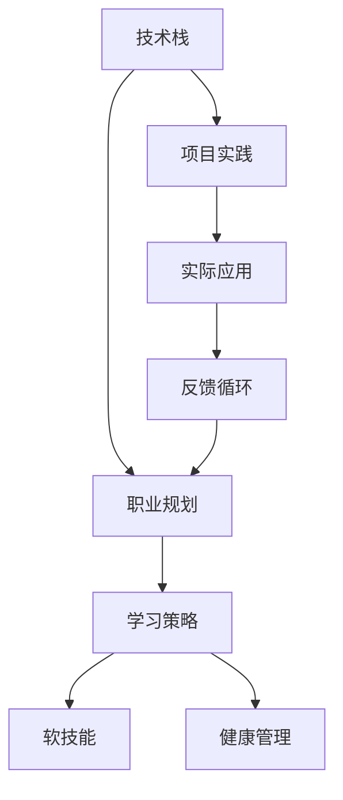

                 

## 1. 背景介绍

中年职场危机是一个普遍且严峻的问题，尤其在全球数字化转型加速的背景下，许多程序员都在面临或将面临这一危机。技术日新月异，行业需求快速变化，知识更新速度远超以往。如何保持自身竞争力，实现职业转型，是许多程序员亟需解决的问题。本文旨在探讨程序员如何应对中年职场危机，从提升技术能力、转型职业路径、保持健康心态等方面给出建议。

## 2. 核心概念与联系

### 2.1 核心概念概述

要应对中年职场危机，首先需要理解几个关键概念：

- **技术栈**：程序员所掌握的技术工具和语言。
- **职业规划**：职业生涯中长期的目标设定和路径规划。
- **学习策略**：高效的学习方法和技巧。
- **软技能**：非技术技能，如沟通、领导、团队合作等。
- **健康管理**：身体和心理健康的管理与维护。

这些概念彼此关联，共同构成了一个系统的职业发展框架。

### 2.2 核心概念原理和架构的 Mermaid 流程图



该流程图展示了技术栈、职业规划、学习策略、软技能和健康管理之间的联系。技术栈和项目实践有助于提升职业竞争力，职业规划和学习策略指导个人发展，软技能和健康管理则提升整体生活质量。最终，这些元素通过反馈循环相互促进，共同推动个人职业发展。

## 3. 核心算法原理 & 具体操作步骤

### 3.1 算法原理概述

应对中年职场危机，可以类比为一种算法优化问题，即在现有资源（如时间、知识储备）下，通过调整参数（如学习策略、软技能提升等），最大化职业满意度和未来发展潜力。

### 3.2 算法步骤详解

1. **需求分析**：
   - 自我评估：分析当前技术栈和职业定位，明确个人职业发展目标和需求。
   - 环境调研：了解行业趋势、技术发展方向、岗位需求等外部因素。

2. **路径规划**：
   - 目标设定：根据自我评估和环境调研结果，设定短期和长期职业目标。
   - 路径规划：设计实现目标的具体路径，包括技术学习路径、职业转换路径等。

3. **策略实施**：
   - 技术提升：选择合适的技术栈进行学习和实践，持续跟进技术前沿。
   - 软技能培养：提升沟通、领导、团队合作等非技术技能，增强职场竞争力。
   - 健康管理：重视身体和心理健康，保持良好的工作与生活平衡。

4. **评估反馈**：
   - 阶段性评估：定期回顾学习进展、职业发展状态，调整策略。
   - 持续改进：根据反馈进行持续改进，不断优化学习路径和职业规划。

### 3.3 算法优缺点

**优点**：
- 系统性：通过综合考虑技术、职业、学习、健康等多方面因素，制定全面的职业发展计划。
- 适应性：根据个人职业目标和环境变化，灵活调整策略，保持职业竞争力。
- 持续性：通过评估和反馈，实现持续改进，逐步达成职业目标。

**缺点**：
- 复杂性：需要综合考虑多方面因素，规划和实施过程可能较为复杂。
- 动态性：行业和技术发展迅速，需不断调整规划和策略，增加实施难度。
- 个性化：每个人的情况和需求不同，需要个性化定制发展路径。

### 3.4 算法应用领域

该算法适用于各种职业发展场景，特别是面临技术更新、行业变动的中年程序员。无论是在职提升、转岗跳槽、还是创业转型，都可以借鉴该算法原理和方法，制定适合自己的职业发展计划。

## 4. 数学模型和公式 & 详细讲解 & 举例说明

### 4.1 数学模型构建

设 $t$ 为当前时间，$\theta$ 为当前技术栈，$T$ 为目标技术栈，$P$ 为当前职业定位，$P_{target}$ 为目标职业定位，$L$ 为当前学习策略，$S$ 为当前软技能水平，$H$ 为当前健康状态，$R$ 为职业满意度和未来发展潜力。

模型构建如下：

$$ R(t) = f(\theta(t), P(t), L(t), S(t), H(t)) $$

其中 $f$ 为映射函数，具体形式如下：

$$ f(\theta(t), P(t), L(t), S(t), H(t)) = \omega_1 \times \text{技术提升函数} + \omega_2 \times \text{职业发展函数} + \omega_3 \times \text{学习策略函数} + \omega_4 \times \text{软技能提升函数} + \omega_5 \times \text{健康管理函数} $$

### 4.2 公式推导过程

1. **技术提升函数**：
   $$ \text{技术提升函数} = \frac{1}{\tau} \int_{t_0}^{t} \left| \frac{\partial \theta(t)}{\partial t} \right| dt $$
   其中 $\tau$ 为技术提升的速率参数。

2. **职业发展函数**：
   $$ \text{职业发展函数} = \frac{1}{\tau} \int_{t_0}^{t} \left| \frac{\partial P(t)}{\partial t} \right| dt $$
   其中 $\tau$ 为职业发展速率参数。

3. **学习策略函数**：
   $$ \text{学习策略函数} = \frac{1}{\tau} \int_{t_0}^{t} \left| \frac{\partial L(t)}{\partial t} \right| dt $$
   其中 $\tau$ 为学习策略调整速率参数。

4. **软技能提升函数**：
   $$ \text{软技能提升函数} = \frac{1}{\tau} \int_{t_0}^{t} \left| \frac{\partial S(t)}{\partial t} \right| dt $$
   其中 $\tau$ 为软技能提升速率参数。

5. **健康管理函数**：
   $$ \text{健康管理函数} = \frac{1}{\tau} \int_{t_0}^{t} \left| \frac{\partial H(t)}{\partial t} \right| dt $$
   其中 $\tau$ 为健康管理速率参数。

### 4.3 案例分析与讲解

以一个中层技术经理为例，当前技术栈为Java、Python，职业定位为技术总监，目标为转型至数据科学领域。

1. **需求分析**：
   - 自我评估：技术栈熟练，但缺乏数据科学相关知识。
   - 环境调研：数据科学需求增长，未来发展潜力大。

2. **路径规划**：
   - 目标设定：短期学习数据科学基础，长期成为数据科学总监。
   - 路径规划：
     - 短期：学习SQL、数据可视化、数据清洗。
     - 中期：深入学习机器学习、深度学习、数据工程。
     - 长期：转型为数据科学总监，领导数据团队。

3. **策略实施**：
   - 技术提升：选择Coursera、Udacity等平台学习数据科学课程。
   - 软技能培养：参加领导力培训，提升团队管理能力。
   - 健康管理：每周三次健身房锻炼，保持身体健康。

4. **评估反馈**：
   - 阶段性评估：每季度回顾学习进展，调整学习策略。
   - 持续改进：根据反馈调整学习内容和速度，保持学习动力。

## 5. 项目实践：代码实例和详细解释说明

### 5.1 开发环境搭建

1. **安装Python和相关依赖**：
   ```bash
   sudo apt-get update
   sudo apt-get install python3-pip python3-dev
   pip3 install numpy pandas scikit-learn matplotlib
   ```

2. **安装Jupyter Notebook**：
   ```bash
   pip3 install jupyter notebook
   jupyter notebook
   ```

3. **设置虚拟环境**：
   ```bash
   python3 -m venv myenv
   source myenv/bin/activate
   ```

### 5.2 源代码详细实现

以学习数据科学为例，使用Python和Jupyter Notebook进行实践。代码示例如下：

```python
import pandas as pd
import numpy as np
from sklearn.model_selection import train_test_split
from sklearn.linear_model import LogisticRegression
from sklearn.metrics import accuracy_score

# 加载数据
data = pd.read_csv('data.csv')
X = data.drop('target', axis=1)
y = data['target']

# 划分数据集
X_train, X_test, y_train, y_test = train_test_split(X, y, test_size=0.2, random_state=42)

# 训练模型
model = LogisticRegression()
model.fit(X_train, y_train)

# 评估模型
y_pred = model.predict(X_test)
accuracy = accuracy_score(y_test, y_pred)
print(f'Accuracy: {accuracy:.2f}')
```

### 5.3 代码解读与分析

1. **数据加载**：使用Pandas加载CSV数据。
2. **数据划分**：使用Scikit-learn库将数据集划分为训练集和测试集。
3. **模型训练**：使用Logistic回归模型进行训练。
4. **模型评估**：使用准确率作为评估指标。

通过这个简单的例子，展示了如何利用Python进行数据科学项目开发。

### 5.4 运行结果展示

执行上述代码后，可以得到模型在测试集上的准确率。

## 6. 实际应用场景

### 6.1 技术提升

通过项目实践，可以不断提升技术能力，保持与技术前沿的同步。例如，参与开源项目、技术博客写作、参加技术会议等，都能有效提升个人技术水平。

### 6.2 职业转换

通过项目实践和实际经验积累，可以逐步实现职业转换。例如，从Java开发转型至数据科学，可以通过参与数据科学项目、阅读相关书籍、参加培训等方式，逐步积累所需知识，最终实现职业转型。

### 6.3 创业转型

对于有创业意向的程序员，可以通过项目实践积累经验，建立团队，开发创新产品，最终实现从职场到创业的转变。

## 7. 工具和资源推荐

### 7.1 学习资源推荐

1. **Coursera**：提供大量计算机科学和数据科学的在线课程，涵盖入门到高级内容。
2. **Udacity**：提供基于项目的学习方式，通过完成实际项目来提升技能。
3. **edX**：提供大量来自世界名校的在线课程，覆盖多个技术领域。
4. **LeetCode**：提供大量编程题目，通过刷题提升技术能力。

### 7.2 开发工具推荐

1. **GitHub**：代码托管平台，方便版本控制和协作开发。
2. **Jupyter Notebook**：数据科学和机器学习开发的强大工具。
3. **PyCharm**：Python开发利器，提供高效的项目管理和调试功能。
4. **Visual Studio Code**：轻量级的跨平台代码编辑器，支持多种编程语言。

### 7.3 相关论文推荐

1. **《软件工程师的职业规划与职业转型研究》**：探讨软件工程师的职业规划和转型策略。
2. **《大数据时代程序员的职业发展路径》**：分析大数据时代程序员的职业发展需求和路径。
3. **《技术栈迁移与职业发展策略》**：研究技术栈迁移对职业发展的影响和策略。

## 8. 总结：未来发展趋势与挑战

### 8.1 研究成果总结

本文通过分析技术栈、职业规划、学习策略、软技能和健康管理等多个因素，提出了一种应对中年职场危机的算法框架。通过实践，程序员可以提升技术能力，实现职业转换，保持健康心态。

### 8.2 未来发展趋势

1. **技术演进**：AI和大数据技术的发展将持续推动各行各业的变革，对程序员的职业能力提出更高要求。
2. **终身学习**：技术更新速度快，终身学习将成为程序员的必备技能。
3. **跨界融合**：技术与其他领域的融合将带来更多创新机会，如技术+金融、技术+医疗等。
4. **远程协作**：远程工作模式将更加普及，远程协作工具和技术将迎来发展机遇。

### 8.3 面临的挑战

1. **技术迭代快**：新技术层出不穷，需要持续学习和适应。
2. **行业需求变**：行业需求快速变化，需要灵活调整职业规划。
3. **知识更新难**：技术栈复杂，需要系统性学习。
4. **工作与生活平衡**：工作压力大，需要合理管理时间，保持工作与生活平衡。

### 8.4 研究展望

未来研究将集中在以下几个方向：
1. **个性化学习策略**：根据个人特点和需求，定制个性化学习路径。
2. **多学科融合**：研究技术与其他学科的融合，探索更多跨界创新机会。
3. **健康与技术结合**：研究健康管理与技术提升的结合，提升整体生活质量。
4. **远程协作优化**：研究远程协作工具和技术的优化，提升远程工作体验。

## 9. 附录：常见问题与解答

**Q1：如何保持学习动力？**

A: 设定短期和长期目标，逐步实现小目标，保持成就感。同时，多参与社区活动和项目，获得外部激励。

**Q2：如何平衡工作与生活？**

A: 制定合理的工作计划，避免过度加班。注重健康管理，保持身体健康和心理健康。

**Q3：如何选择学习资源？**

A: 根据个人需求和兴趣，选择适合的学习资源。可以参考平台推荐、课程评价和社区反馈，选择高质量的课程。

**Q4：如何提升软技能？**

A: 参加相关培训和讲座，实践项目管理、团队协作等实际项目。多与人交流，提升沟通和领导能力。

**Q5：如何应对职业转型？**

A: 提前规划，设定目标和路径。通过项目实践和积累经验，逐步实现职业转换。同时，保持学习心态，不断提升自己的竞争力。

---

作者：禅与计算机程序设计艺术 / Zen and the Art of Computer Programming

