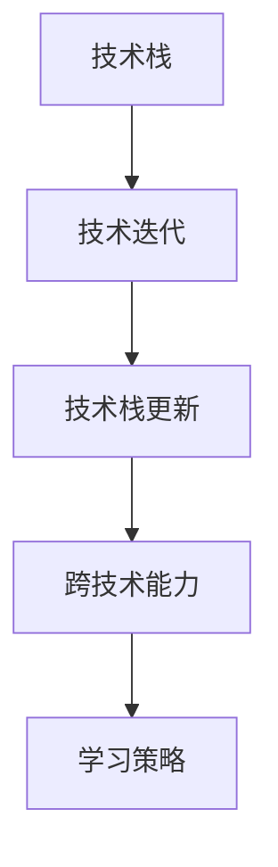

                 

# 程序员如何应对技术栈快速更新

> 关键词：技术栈更新,技术迭代,学习策略,跨技术能力,软件工程实践,未来技术趋势

## 1. 背景介绍

### 1.1 问题由来

在现代软件开发领域，技术栈的快速更新是常态。无论是前端框架、后端技术、数据库还是人工智能算法，新的工具、技术和框架层出不穷，开发者需要不断学习以跟上行业的发展步伐。然而，技术栈的快速更新也带来了诸多挑战，包括学习成本增加、现有技能贬值、项目切换困难等，极大地考验了程序员的适应能力和学习能力。如何有效应对技术栈的快速更新，是每个程序员都需要面对的重要课题。

### 1.2 问题核心关键点

技术栈快速更新的关键在于技术栈的变化和演变。技术栈的变化可能包括但不限于以下几个方面：

- **新的框架和工具**：如React、Vue、Angular等前端框架，Spring Boot、Django、Flask等后端框架，以及各种数据处理和分析工具。
- **新兴的技术和理念**：如DevOps、持续集成(CI/CD)、容器化(Docker/Kubernetes)、微服务架构、云计算等。
- **AI和机器学习算法**：如深度学习、自然语言处理、计算机视觉等领域的算法和模型。

了解技术栈的这些变化，明确其演变的趋势，有助于程序员更有针对性地进行学习，从而快速适应变化，避免被技术淘汰。

### 1.3 问题研究意义

在技术快速迭代的时代，程序员需要具备高度的适应性和学习能力，以不断更新自己的技术栈。只有掌握最新的技术和工具，才能在竞争激烈的市场中保持竞争力，甚至在技术变革中走在前端。同时，技术栈的快速更新也反映了行业对效率、性能和安全性的追求，这些正逐渐成为现代软件工程的核心需求。因此，掌握学习新技术的策略，提升跨技术能力，对于程序员来说具有重要意义。

## 2. 核心概念与联系

### 2.1 核心概念概述

为了更好地应对技术栈的快速更新，我们首先需要明确几个核心概念：

- **技术栈**：开发项目中使用的所有技术，包括编程语言、框架、库、工具和平台等。
- **技术迭代**：技术从诞生、发展、成熟到最终被淘汰的过程。
- **技术栈更新**：随着技术迭代，现有技术栈中部分技术被新的技术替代的过程。
- **跨技术能力**：程序员在不同技术栈之间灵活切换，快速掌握新技能的能力。
- **学习策略**：程序员为了保持技术栈更新而采用的系统性学习方法。

这些概念之间的关系可以用以下Mermaid流程图来表示：



这个流程图展示了技术栈、技术迭代、技术栈更新、跨技术能力和学习策略之间的逻辑关系。了解这些概念，可以帮助程序员更好地规划自己的学习路径，提升技术栈的适应性。

## 3. 核心算法原理 & 具体操作步骤
### 3.1 算法原理概述

技术栈更新的学习过程，本质上是一个有组织、有计划的跨技术学习过程。其核心思想是通过系统的学习和实践，逐步掌握新的技术栈，提升跨技术能力。这一过程可以概括为以下几个关键步骤：

1. **识别需求**：明确需要掌握的新技术栈。
2. **制定计划**：制定系统的学习计划，包括学习内容、学习资源、学习时间等。
3. **实践练习**：通过项目实践、代码编写、实验验证等方式，巩固所学知识。
4. **评估反馈**：通过自我评估和外部反馈，识别学习效果和存在的问题，不断调整学习策略。

### 3.2 算法步骤详解

基于上述原理，技术栈更新的学习流程可以分为以下几个步骤：

**Step 1: 需求识别**

首先需要明确需要掌握的新技术栈。这包括但不限于新框架、新工具、新算法等。可以通过以下方式进行需求识别：

- **项目需求**：通过参与新项目或改造现有项目，明确新项目的技术需求。
- **行业趋势**：关注行业内的技术发展趋势，如DevOps、云计算、AI等。
- **技术社区**：加入技术社区，了解技术圈内的新技术动态。

**Step 2: 制定学习计划**

一旦明确了学习需求，就需要制定详细的学习计划，确保学习的系统性和有效性。学习计划应包括但不限于以下几个方面：

- **学习目标**：设定具体、可衡量的学习目标，如掌握某个新框架、理解某个新算法等。
- **学习内容**：列出需要学习的内容，如框架的核心原理、算法的应用场景等。
- **学习资源**：选择适合自己的学习资源，如官方文档、在线课程、书籍等。
- **学习时间**：制定合理的学习时间表，确保学习的持续性和规律性。

**Step 3: 实践练习**

学习新技术的关键在于实践。通过项目实践、代码编写、实验验证等方式，可以更好地巩固所学知识，提升跨技术能力。具体的实践方式包括但不限于以下几个方面：

- **小项目实践**：通过小型项目实践，逐步掌握新技术的应用。
- **代码编写**：编写相关的代码示例，加深对新技术的理解。
- **实验验证**：通过实验验证新技术的性能和特点，发现问题并进行解决。

**Step 4: 评估反馈**

评估和反馈是学习过程中的重要环节，有助于识别学习效果和存在的问题，及时调整学习策略。具体的评估反馈方式包括但不限于以下几个方面：

- **自我评估**：通过自测和测试，评估自己的学习效果。
- **代码审查**：通过代码审查，识别技术应用中的错误和不足。
- **导师指导**：通过导师或前辈的指导，获得有价值的反馈和建议。

通过以上步骤，可以系统地掌握新技术，提升跨技术能力，从而更好地应对技术栈的快速更新。

### 3.3 算法优缺点

技术栈更新的学习过程具有以下优点：

1. **系统性**：通过制定详细学习计划，可以避免盲目学习，提升学习效率。
2. **实践性强**：通过实践练习，可以更好地巩固所学知识，提升跨技术能力。
3. **反馈及时**：通过评估反馈，可以及时识别问题，进行调整，确保学习效果。

同时，这一过程也存在以下缺点：

1. **时间成本高**：系统性学习需要投入大量时间和精力，对于工作繁忙的程序员可能不太现实。
2. **学习压力大**：学习新技术的同时，还需要处理原有项目，容易感到压力。
3. **资源需求高**：学习新技术需要获取大量的学习资源，如官方文档、在线课程、书籍等。

尽管存在这些缺点，但通过合理规划和管理，技术栈更新的学习过程仍然是提升跨技术能力、保持技术栈活力的有效手段。

### 3.4 算法应用领域

技术栈更新的学习过程适用于多个领域，包括但不限于：

- **软件开发**：掌握新的编程语言、框架、库等。
- **数据科学**：学习新的数据处理、分析工具和算法。
- **云计算**：掌握云平台和云服务，如AWS、Google Cloud、Azure等。
- **人工智能**：学习新的AI算法和框架，如TensorFlow、PyTorch等。

## 4. 数学模型和公式 & 详细讲解 & 举例说明

### 4.1 数学模型构建

技术栈更新的学习过程可以通过数学模型来描述。假设程序员的技术栈更新过程可以分为n个阶段，每个阶段需要学习m种技术，每种技术的学习时间为t_i，学习后的掌握度为p_i。则总的学习时间为T，掌握度为P。

可以建立以下数学模型：

$$
T = \sum_{i=1}^n m \cdot t_i
$$

$$
P = \prod_{i=1}^n p_i
$$

其中，t_i表示第i阶段学习m种技术的总时间，p_i表示学习后对第i阶段技术的掌握度。

### 4.2 公式推导过程

通过上述模型，我们可以对技术栈更新过程进行优化。优化目标是在总时间T和掌握度P之间找到一个平衡点。优化方法包括但不限于以下几个方面：

1. **时间优化**：通过缩短学习时间，提高学习效率。
2. **掌握度优化**：通过提高学习掌握度，提升学习效果。
3. **优先级调整**：根据技术的重要性，调整学习顺序。

### 4.3 案例分析与讲解

以学习一种新的编程语言为例，我们可以建立如下数学模型：

假设学习语言A的总时间为T_A，学习后的掌握度为P_A，学习语言B的总时间为T_B，学习后的掌握度为P_B。则总的学习时间为：

$$
T = T_A + T_B
$$

总的学习掌握度为：

$$
P = P_A \cdot P_B
$$

通过优化T和P，可以找到最佳的学习路径。例如，可以先学习掌握度更高的语言A，再学习语言B，总时间可以更短，但掌握度可能相对较低。反之，也可以先学习语言B，再学习语言A，总时间更长，但掌握度可能更高。

## 5. 项目实践：代码实例和详细解释说明
### 5.1 开发环境搭建

在进行技术栈更新的学习实践前，我们需要准备好开发环境。以下是使用Python进行Django开发的环境配置流程：

1. 安装Python：从官网下载并安装Python，用于开发Web应用。
2. 安装Django：使用pip安装Django，并创建新的Django项目。
3. 安装必要的依赖库：如MySQL数据库、Pillow图像处理库等。
4. 配置开发环境：设置开发数据库、日志输出等环境变量。

完成上述步骤后，即可在开发环境中进行技术栈更新的学习实践。

### 5.2 源代码详细实现

下面以学习Django框架为例，给出详细的代码实现：

```python
# 1. 创建Django项目
$ django-admin startproject myproject

# 2. 创建Django应用
$ python manage.py startapp myapp

# 3. 编写视图函数
from django.http import HttpResponse

def hello(request):
    return HttpResponse("Hello, Django!")

# 4. 配置路由
from django.urls import path
from . import views

urlpatterns = [
    path('', views.hello, name='hello'),
]

# 5. 运行Django应用
$ python manage.py runserver
```

通过以上代码，可以完成Django框架的学习实践。可以看到，Django的学习过程包括创建项目、应用、视图函数、路由配置等多个步骤。通过系统地学习和实践，可以更好地掌握Django框架，提升跨技术能力。

### 5.3 代码解读与分析

**创建Django项目**：通过`django-admin startproject`命令创建Django项目，可以生成项目目录和配置文件。

**创建Django应用**：通过`python manage.py startapp`命令创建Django应用，可以在项目中增加新的模块。

**编写视图函数**：视图函数是Django框架中的核心组件，用于处理HTTP请求并返回响应。

**配置路由**：路由配置用于定义URL与视图函数的映射关系，使Django框架能够正确处理请求。

**运行Django应用**：通过`python manage.py runserver`命令启动Django应用，可以在浏览器中访问Web应用。

通过上述代码的实践，可以系统地掌握Django框架，提升跨技术能力，从而更好地应对技术栈的快速更新。

### 5.4 运行结果展示

运行上述代码后，可以在浏览器中访问`http://127.0.0.1:8000/`，看到"Hello, Django!"的欢迎页面。这表明Django框架的学习实践已经成功完成。

## 6. 实际应用场景
### 6.1 智能自动化系统

智能自动化系统是技术栈更新的重要应用场景之一。通过掌握多种自动化工具和技术，程序员可以构建更加高效、可靠的系统，提升生产效率。

以机器人流程自动化(RPA)为例，掌握Selenium、PyAutoGUI等自动化工具，可以自动执行重复性高的任务，提升工作效率。通过学习AWS Lambda、Google Cloud Functions等云函数，可以在云平台上实现自动化任务。掌握Docker/Kubernetes等容器化技术，可以构建可扩展、可维护的系统架构。

### 6.2 大数据分析系统

大数据分析系统是技术栈更新的另一个重要应用场景。通过掌握多种数据处理和分析工具，程序员可以构建高效、准确的数据分析系统。

以Hadoop生态为例，掌握Hadoop MapReduce、Spark等大数据处理框架，可以高效处理大规模数据。通过学习Hive、Pig等数据仓库工具，可以构建数据管理和查询系统。掌握Kafka等消息队列技术，可以构建实时数据处理系统。

### 6.3 人工智能系统

人工智能系统是技术栈更新的前沿应用场景。通过掌握多种AI算法和框架，程序员可以构建高效、智能的AI应用。

以TensorFlow为例，掌握TensorFlow的模型训练和部署流程，可以构建高性能的AI模型。通过学习PyTorch等深度学习框架，可以构建更加灵活、高效的AI系统。掌握Keras等高级API，可以简化模型构建和训练过程。

## 7. 工具和资源推荐
### 7.1 学习资源推荐

为了帮助开发者系统掌握技术栈更新的理论基础和实践技巧，这里推荐一些优质的学习资源：

1. Coursera和edX等在线教育平台：提供大量高质量的课程和讲座，涵盖多种技术栈。
2. Udacity和Pluralsight等技术社区：提供实战项目和实验环境，帮助开发者实践新技术。
3. GitHub和Stack Overflow等社区平台：提供丰富的开源项目和代码示例，供开发者学习和参考。
4. 书籍《深入理解Python》、《Java编程思想》等经典书籍：提供系统性的理论知识和实践案例。
5. 博客和文章：关注行业内的技术动态和最佳实践，如Medium、CSDN等。

通过对这些资源的学习实践，相信你一定能够快速掌握技术栈更新的精髓，并用于解决实际的开发问题。

### 7.2 开发工具推荐

高效的开发离不开优秀的工具支持。以下是几款用于技术栈更新开发的常用工具：

1. Python和Java：流行的编程语言，具有丰富的第三方库和工具支持。
2. Docker和Kubernetes：容器化和编排工具，可以构建可扩展、可维护的系统。
3. AWS和Google Cloud：云服务平台，提供丰富的计算、存储和网络资源。
4. GitHub和Bitbucket：代码托管平台，提供版本控制和协作工具。
5. JIRA和Trello：项目管理工具，帮助团队跟踪和协作。

合理利用这些工具，可以显著提升技术栈更新的开发效率，加快创新迭代的步伐。

### 7.3 相关论文推荐

技术栈更新的研究源于学界的持续研究。以下是几篇奠基性的相关论文，推荐阅读：

1. "A Survey on Techniques and Applications of Continuous Software Evolution"：综述了持续软件演进技术的研究现状和应用案例。
2. "Design Patterns"：介绍了多种设计模式，帮助开发者更好地组织和管理代码。
3. "Deep Learning for Self-Driving Cars"：介绍了深度学习在自动驾驶中的应用，展示了AI技术的前沿进展。
4. "Cloud Computing: Concepts, Technology and Architecture"：介绍了云计算的概念、技术和架构，展示了云计算的应用前景。
5. "The Evolution of Software"：探讨了软件演进的规律和挑战，提出了持续演进的方法和策略。

这些论文代表了大规模技术栈更新的研究脉络。通过学习这些前沿成果，可以帮助研究者把握学科前进方向，激发更多的创新灵感。

## 8. 总结：未来发展趋势与挑战

### 8.1 总结

本文对技术栈快速更新的学习过程进行了全面系统的介绍。首先阐述了技术栈更新在学习中的重要性，明确了学习需求、制定计划、实践练习和评估反馈等关键环节。通过详细的代码实例和案例分析，展示了如何系统地掌握新技术，提升跨技术能力。同时，本文还探讨了技术栈更新在智能自动化系统、大数据分析系统和人工智能系统中的应用场景，展示了技术栈更新的广泛应用价值。

通过本文的系统梳理，可以看到，技术栈快速更新的学习过程是一个系统性、实践性的学习过程。掌握这一过程，可以帮助程序员更好地应对技术栈的快速更新，提升跨技术能力，从而在激烈的竞争中立于不败之地。

### 8.2 未来发展趋势

展望未来，技术栈更新和学习过程将呈现以下几个发展趋势：

1. **跨技术学习的系统性增强**：未来的学习将更加注重系统性和整合性，将多种技术栈进行整合，形成更加全面、高效的技术体系。
2. **学习资源的数字化和智能化**：未来的学习资源将更加数字化和智能化，如在线课程、虚拟实验室、智能推荐系统等，提升学习效率和效果。
3. **学习过程的个性化和定制化**：未来的学习将更加注重个性化和定制化，根据个人的学习需求和进度，定制化推荐学习内容和路径。
4. **学习评估的多维度化**：未来的学习评估将更加多维度，结合技能评估、项目评估、团队评估等多种方式，全面衡量学习效果。

以上趋势展示了技术栈更新和学习过程的广阔前景。这些方向的探索发展，必将进一步提升技术栈更新的系统性和效率，推动技术栈演进的步伐。

### 8.3 面临的挑战

尽管技术栈更新和学习过程已经取得了不少进展，但在迈向更加智能化、普适化应用的过程中，仍面临诸多挑战：

1. **学习资源的不足**：当前的学习资源虽然丰富，但对于某些新领域和新技术，学习资源仍显不足。如何获取和整合更多高质量的学习资源，将是未来的一大挑战。
2. **学习效果的评估**：现有技术栈更新和学习过程的评估方式较为单一，如何设计多维度的评估指标，全面衡量学习效果，还需进一步探索。
3. **学习效率的提升**：当前的学习过程较为繁琐，如何通过技术手段提升学习效率，缩短学习周期，还需进一步优化。
4. **跨技术能力的提升**：虽然技术栈更新有助于提升跨技术能力，但在不同技术栈之间进行切换时，仍然面临一定的难度。如何提高跨技术能力的迁移性，还需深入研究。
5. **技术的持续更新**：技术栈更新和学习是一个动态过程，如何保持对新技术的敏感性和快速响应能力，避免被新技术淘汰，还需不断提升技术水平和创新能力。

面对这些挑战，未来的研究需要在以下几个方面寻求新的突破：

1. **引入更多的跨技术学习框架**：引入更多的跨技术学习框架和工具，如Docker、Kubernetes等，提升学习效率和效果。
2. **设计更加灵活的学习路径**：设计更加灵活的学习路径，允许开发者根据自身需求和进度，自主选择学习内容和时间。
3. **引入AI辅助学习**：引入AI技术辅助学习，如推荐系统、智能导师等，提升学习效果和用户体验。
4. **优化学习评估体系**：设计更加多维度的学习评估体系，包括技能评估、项目评估、团队评估等多种方式，全面衡量学习效果。
5. **推动技术的持续演进**：通过持续学习和创新，保持对新技术的敏感性和快速响应能力，不断提升技术水平和创新能力。

这些研究方向的探索，必将引领技术栈更新和学习过程迈向更高的台阶，为程序员提供更加全面、高效的学习平台，推动技术栈演进的步伐。总之，技术栈更新和学习过程需要不断创新和优化，才能适应快速变化的技术环境和市场需求。

### 8.4 研究展望

未来，技术栈更新和学习过程的研究将继续深入，具体方向可能包括以下几个方面：

1. **跨技术学习的理论框架**：构建跨技术学习的理论框架，系统化描述技术栈更新和学习过程，为研究者和开发者提供理论指导。
2. **学习资源的智能推荐**：开发智能推荐系统，根据用户的学习需求和历史数据，推荐合适的学习资源和路径，提升学习效率和效果。
3. **学习效果的动态评估**：设计动态评估体系，实时监控学习效果，根据学习进度和反馈，调整学习策略，确保学习效果和目标一致。
4. **跨技术能力的迁移性研究**：研究跨技术能力的迁移性，设计更加灵活的学习路径，提升跨技术能力的迁移性和应用范围。
5. **技术的持续演进机制**：研究技术的持续演进机制，设计动态的技术更新路径，确保技术栈的活性和适应性。

这些研究方向的探索，必将推动技术栈更新和学习过程的不断进步，为程序员提供更加全面、高效的学习平台，推动技术栈演进的步伐。总之，技术栈更新和学习过程需要不断创新和优化，才能适应快速变化的技术环境和市场需求。

## 9. 附录：常见问题与解答

**Q1：技术栈更新需要投入大量时间和精力，是否值得？**

A: 技术栈更新和学习虽然需要投入大量时间和精力，但能够显著提升跨技术能力，保持技术栈的活性和适应性。在竞争激烈的IT行业，不断学习和更新技术栈是保持竞争力的重要手段。

**Q2：学习新技术的过程中，如何保持动力和兴趣？**

A: 学习新技术的过程中，保持动力和兴趣至关重要。可以通过以下几个方法：

1. **设定明确的学习目标**：设定具体、可衡量的学习目标，使学习过程有方向和动力。
2. **寻找学习伙伴**：与志同道合的学习伙伴一起学习，互相鼓励和支持。
3. **实践项目**：通过实践项目，将所学知识应用到实际场景中，提升学习效果。
4. **获取即时反馈**：及时获取学习反馈，如代码审查、导师指导等，增强学习信心。

**Q3：如何评估自己的学习效果？**

A: 评估自己的学习效果可以从以下几个方面入手：

1. **自测和测试**：通过自测和测试，评估自己对新技术的掌握程度。
2. **代码审查**：通过代码审查，识别技术应用中的错误和不足，提升学习效果。
3. **项目评估**：通过实际项目，评估新技术的应用效果和实际价值。
4. **团队反馈**：通过团队反馈，了解同事和客户对新技术的评价和建议，及时调整学习策略。

**Q4：如何应对学习过程中的瓶颈和挑战？**

A: 学习过程中的瓶颈和挑战是不可避免的，可以通过以下几个方法应对：

1. **分解学习任务**：将学习任务分解成多个小任务，逐步完成，避免任务过于庞大而感到压力。
2. **寻求帮助**：在遇到难题时，及时寻求导师、同事或社区的帮助，共同解决问题。
3. **调整学习计划**：根据实际情况，灵活调整学习计划，避免过于紧张或松散。
4. **保持健康生活**：保持良好的生活习惯，如适当运动、合理饮食、充足睡眠等，提升学习效果。

通过以上方法，可以更好地应对学习过程中的瓶颈和挑战，提升学习效果和用户体验。

---

作者：禅与计算机程序设计艺术 / Zen and the Art of Computer Programming

