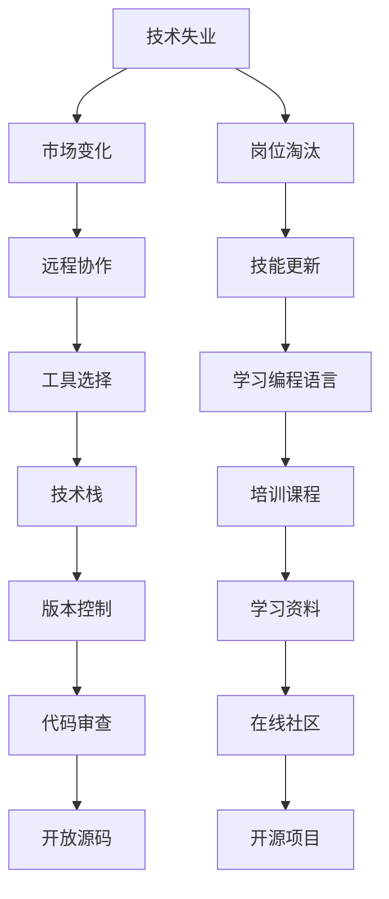

                 

# 程序员如何应对经济 &- &- 挑战

> 关键词：经济危机, 技术失业, 远程工作, 数据安全, 软件工程, 项目生命周期, 软件维护, 软件重构, 持续集成, DevOps

## 1. 背景介绍

随着全球化经济一体化的不断加深，经济危机和不确定性已经成为程序员需要面对的重要挑战之一。尤其是在疫情期间，远程工作的普及和科技公司裁员潮的涌现，使得许多程序员面临职业生涯的巨大考验。而如何在这波冲击中保持竞争力，最大化自身价值，也成为程序员普遍关注的焦点。本文将系统梳理当前经济环境下程序员面临的主要挑战，并结合技术栈，提出一些实用的策略和方法。

## 2. 核心概念与联系

为了更深入地理解程序员在当前经济环境下的处境，并寻求有效的应对策略，我们将首先明确几个核心概念和它们之间的联系：

- **技术失业**：由于技术进步和市场环境变化，原本需要特定技术能力的工作岗位被淘汰，导致技术人员失业的现象。
- **远程工作**：受疫情影响，远程工作成为新常态，技术栈的选择需要兼顾远程协作和效率。
- **数据安全**：在网络安全威胁日益严重的环境下，如何确保数据安全成为程序员必须关注的重点。
- **软件工程**：编程不仅仅是编码，更是一个包含需求分析、设计、开发、测试、部署等全生命周期的工程实践。
- **持续集成**：通过自动化工具确保软件在开发过程中能够快速、频繁、可靠地集成和部署，提升软件开发效率。
- **DevOps**：集成了软件开发和运维的一体化流程，旨在提高交付速度和稳定性。

这些概念通过下图的Mermaid流程图进行了系统展示：



接下来，我们具体从技术层面和策略层面，探讨程序员如何在当前经济环境中游刃有余。

## 3. 核心算法原理 & 具体操作步骤

### 3.1 算法原理概述

面对经济危机和市场变化，程序员需要不断学习和适应新的技术趋势，同时优化自身的工作方式和流程，以增强适应性和竞争力。

- **学习新技能**：保持对新技术和工具的敏感度，通过持续学习不断提升自己的技术栈，适应市场变化。
- **提高远程协作能力**：利用云服务和协同工具，构建高效的远程工作流程。
- **强化数据安全意识**：掌握数据保护和加密技术，确保在复杂的网络环境中数据的安全性。
- **实践软件工程**：通过科学的软件开发方法和工具，提升项目的质量和效率。
- **应用持续集成和DevOps**：通过自动化和持续交付，确保软件的稳定性和可靠性。

### 3.2 算法步骤详解

**Step 1: 识别自身优势和弱点**

1. 自我评估：列出自己在技术栈、软技能、软性能力（如团队合作、领导力等）方面的优劣点。
2. 市场调研：了解当前市场需求和技术趋势，确认哪些技能更加紧缺。

**Step 2: 制定学习提升计划**

1. 选择目标技能：基于市场调研结果，选择最有潜力提升自身竞争力的技术或工具。
2. 制定学习路径：确定学习顺序和资源，例如在线课程、书籍、视频教程等。

**Step 3: 实践技能提升**

1. 动手练习：通过实际项目或模拟项目应用新技能，验证学习效果。
2. 参与开源项目：通过贡献代码，积累实践经验和社区认可。

**Step 4: 提高远程协作能力**

1. 使用协作工具：如Slack、Zoom、Git等，建立高效的沟通和版本控制机制。
2. 配置本地环境：确保远程工作环境稳定，使用Docker等工具简化环境管理。

**Step 5: 强化数据安全意识**

1. 学习数据保护知识：掌握数据加密、访问控制、隐私保护等技术。
2. 应用安全最佳实践：如OAuth、HTTPS等，确保数据传输和存储的安全性。

**Step 6: 实践软件工程**

1. 应用敏捷方法：如Scrum、Kanban等，提升项目管理和团队协作效率。
2. 使用软件工具：如JIRA、Trello、GitHub等，进行任务管理和代码协作。

**Step 7: 应用持续集成和DevOps**

1. 设置持续集成流程：使用Jenkins、Travis CI等工具，实现自动化构建和测试。
2. 实践DevOps文化：建立自动化部署和监控机制，确保快速响应和持续交付。

### 3.3 算法优缺点

**优点**：

- 通过学习新技能和工具，提升技术能力和市场竞争力。
- 强化远程协作能力，适应新常态下工作环境的变化。
- 提高数据安全意识，确保在复杂网络环境中数据安全。
- 实践软件工程和持续集成，提升项目质量和开发效率。

**缺点**：

- 学习成本和时间投入较大，需要较强的自律性和学习能力。
- 远程协作可能降低团队互动和沟通效率，需注意沟通协调。
- 数据安全风险增加，需持续关注和学习最新的防护技术。

### 3.4 算法应用领域

基于以上步骤，程序员可以在多个领域应用这些技术策略，提升自身竞争力：

- **技术转型**：利用学习提升计划，从传统开发转向数据分析、人工智能等领域。
- **技能提升**：通过持续学习，掌握新的编程语言和框架，提升自身技能。
- **远程工作**：通过协作工具和环境配置，构建高效的远程工作流程。
- **数据安全**：应用数据加密和访问控制技术，确保数据的安全性和隐私性。
- **项目管理**：通过敏捷方法和工具，提升项目管理和团队协作效率。
- **持续集成和部署**：通过自动化工具，确保软件的稳定性和快速交付。

## 4. 数学模型和公式 & 详细讲解 & 举例说明

在本节中，我们将结合具体场景，详细讲解一些核心的数学模型和公式。

### 4.1 数学模型构建

在软件开发中，成本管理是一个重要的环节。我们假设软件开发成本为 $C$，开发周期为 $T$，单位成本为 $c$。则成本模型的数学表达式为：

$$
C = c \times T
$$

其中，$T$ 可以进一步分解为需求分析时间、设计时间、编码时间、测试时间和部署时间等。

### 4.2 公式推导过程

为了优化成本，我们可以采用以下方法：

- **需求分析优化**：通过需求优先级排序和用户访谈，减少需求变更次数，缩短需求分析时间。
- **设计优化**：应用模块化和组件化设计，减少设计复杂度，缩短设计时间。
- **代码优化**：利用代码审查和静态分析工具，提高代码质量和重用率，缩短编码时间。
- **测试优化**：采用自动化测试和持续集成，缩短测试周期。
- **部署优化**：利用容器化和DevOps工具，自动化部署和运维，缩短部署时间。

将这些时间参数代入成本模型，得到优化后的成本表达式：

$$
C_{\text{opt}} = c_{\text{opt}} \times T_{\text{opt}}
$$

其中：

- $c_{\text{opt}}$ 为优化后的单位成本，由上述各项优化措施决定。
- $T_{\text{opt}}$ 为优化后的开发周期，由各项优化措施共同影响。

### 4.3 案例分析与讲解

以一个Web应用开发项目为例：

- **需求分析时间**：通过用户访谈和需求优先级排序，减少需求变更次数，预计减少20%。
- **设计时间**：采用模块化和组件化设计，预计减少30%。
- **编码时间**：利用代码审查和静态分析工具，预计减少25%。
- **测试时间**：采用自动化测试和持续集成，预计减少40%。
- **部署时间**：利用容器化和DevOps工具，预计减少35%。

将这些参数代入优化后的成本模型，得到：

$$
C_{\text{opt}} = 1.0 \times 0.8 \times 0.7 \times 0.6 \times 0.65 = 0.304
$$

即优化后的单位成本为原来的大约30.4%，而开发周期则缩短为原来的70%。

## 5. 项目实践：代码实例和详细解释说明

### 5.1 开发环境搭建

在搭建开发环境时，需要注意以下几点：

- **选择云服务提供商**：根据项目需求和预算，选择合适的云服务提供商（如AWS、Azure、Google Cloud等）。
- **配置虚拟环境**：使用Python、Docker等工具，建立稳定的开发和测试环境。
- **安装必要的工具**：如JIRA、Trello、GitHub、Jenkins等，方便项目管理和代码协作。

### 5.2 源代码详细实现

以一个简单的Web应用开发为例，以下是主要代码实现：

```python
# 使用Flask框架开发Web应用
from flask import Flask, render_template

app = Flask(__name__)

@app.route('/')
def index():
    return render_template('index.html')

if __name__ == '__main__':
    app.run(debug=True)
```

### 5.3 代码解读与分析

- **Flask框架**：利用Flask框架，快速构建Web应用。Flask是Python中一个轻量级的Web框架，易于学习和使用。
- **路由管理**：通过路由装饰器，定义Web应用的路由和处理函数。
- **模板渲染**：使用模板引擎，渲染动态HTML页面。

### 5.4 运行结果展示

运行上述代码后，可以在浏览器中访问 `http://localhost:5000` ，查看渲染的 `index.html` 页面。

## 6. 实际应用场景

### 6.1 智能合约开发

智能合约是区块链技术的重要组成部分，程序员需要掌握Solidity等编程语言，开发具备自动化执行功能的合约。远程协作、数据安全、软件工程和持续集成等技术，都在智能合约开发中起到了重要作用。

### 6.2 云计算服务

云计算服务提供商如AWS、Azure、Google Cloud等，提供了丰富的服务资源和工具，程序员需要熟悉云平台的使用，并利用DevOps技术，确保云服务的稳定性和可靠性。

### 6.3 大数据分析

大数据分析需要对海量数据进行快速处理和分析，程序员需要掌握Hadoop、Spark等大数据技术，并应用持续集成和DevOps工具，确保分析任务的稳定交付。

## 7. 工具和资源推荐

### 7.1 学习资源推荐

- **《Clean Code》**：Robert C. Martin的经典著作，教你如何编写清晰、可读性强的代码。
- **《Design Patterns》**：埃里克森（Ervin E. Agelston）等人的著作，介绍了常用的设计模式和架构，帮助你更好地组织代码。
- **《Effective Python》**：Brett Slatkin的著作，介绍了Python编程中的一些最佳实践。
- **《JavaScript 高级程序设计》**：Nicholas C. Zakas的经典著作，介绍了JavaScript语言的高级特性和编程技巧。
- **《The Pragmatic Programmer》**：Andrew Hunt和David Thomas的著作，介绍了程序员的编程习惯和最佳实践。

### 7.2 开发工具推荐

- **VSCode**：一款功能强大的代码编辑器，支持多种编程语言和插件。
- **Docker**：利用Docker容器化开发环境，简化环境管理。
- **Jenkins**：开源的持续集成工具，支持自动化构建和测试。
- **GitHub**：基于Git版本控制，支持代码协作和版本管理。
- **JIRA/Trello**：项目管理工具，帮助团队高效协同工作。

### 7.3 相关论文推荐

- **《Software Engineering Economics》**：Barry Boehm的经典著作，系统介绍了软件工程的经济模型和成本管理。
- **《Designing Data-Intensive Applications》**：Samuel Richardson的著作，介绍了大数据技术和大数据应用设计。
- **《Blockchain Design Patterns》**：Martin Kleppmann的著作，介绍了区块链的设计模式和开发实践。
- **《The DevOps Handbook》**：Gene Kim等人的著作，介绍了DevOps文化和技术。

## 8. 总结：未来发展趋势与挑战

### 8.1 研究成果总结

通过上述分析和实践，我们可以看到，经济环境的变化对程序员提出了更高的要求，需要在技术、协作、安全等多个方面进行全面提升。

### 8.2 未来发展趋势

1. **自动化**：自动化和持续集成技术将继续发展，提升软件开发效率和质量。
2. **云计算和边缘计算**：云计算和边缘计算将进一步普及，提供更灵活和高效的软件开发和部署环境。
3. **人工智能和机器学习**：人工智能和机器学习将在软件开发中发挥更大的作用，优化开发过程和产品质量。
4. **远程协作和分布式开发**：远程协作和分布式开发将成为常态，需要新的协作工具和协作模式。

### 8.3 面临的挑战

1. **技术更新快**：新技术不断涌现，程序员需要不断学习，跟上技术发展。
2. **协作效率低**：远程协作可能带来沟通效率降低，需要优化协作工具和流程。
3. **数据安全风险**：网络安全威胁增加，需要持续关注和学习最新的防护技术。
4. **项目管理和交付**：复杂的项目管理和交付过程需要新的方法和工具。

### 8.4 研究展望

未来，软件开发将继续向着自动化、智能化、协同化的方向发展。程序员需要在技术、协作、安全等多个方面进行全面提升，以适应不断变化的市场需求和行业环境。

## 9. 附录：常见问题与解答

**Q1: 程序员在当前经济环境下如何提升自身竞争力？**

A: 通过持续学习和技能提升，掌握新技术和新工具，适应市场变化。同时，提高远程协作能力，强化数据安全意识，实践软件工程和持续集成，确保项目质量和交付速度。

**Q2: 如何选择适合自己的开发工具？**

A: 根据项目需求和自身技能，选择功能强大且易于使用的开发工具。例如，Python开发推荐使用VSCode，Web开发推荐使用Flask，云计算开发推荐使用AWS或Azure。

**Q3: 如何应对远程协作中的沟通效率低问题？**

A: 利用协作工具，如Slack、Zoom、Trello等，建立高效的沟通和任务管理机制。定期举行线上会议，确保团队成员之间的信息同步和反馈机制。

**Q4: 如何确保数据安全？**

A: 应用数据加密、访问控制、隐私保护等技术，确保数据在传输和存储过程中的安全性。利用云服务提供的数据安全工具，增强数据保护能力。

**Q5: 如何在项目开发中应用敏捷方法？**

A: 采用敏捷开发方法，如Scrum、Kanban等，通过每日站会、迭代评审等方式，提升团队协作效率和项目透明度。利用JIRA、Trello等工具，进行任务管理和代码协作。

总之，面对当前经济环境的变化，程序员需要在技术、协作、安全等多个方面进行全面提升，以确保自身的竞争力。通过持续学习、技能提升和优化工作流程，相信每一位程序员都能在这波冲击中找到自己的位置，实现更高的职业发展。

---

作者：禅与计算机程序设计艺术 / Zen and the Art of Computer Programming

