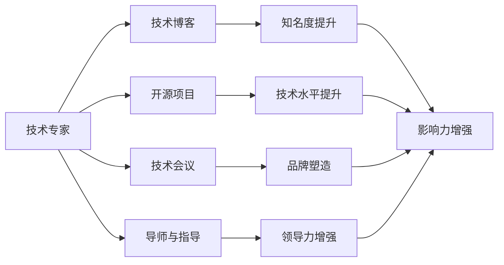

                 

# 程序员如何打造个人影响力

在数字化时代，程序员的个人影响力成为了一个重要的资产。无论你是初入职场的新手，还是资深的技术专家，拥有强大的个人影响力都能在职业生涯中提供巨大的助力。本文将围绕如何打造个人影响力这一核心目标，系统性地介绍程序员在技术、教育、社区和商业等多个层面提升个人影响力的策略和方法。

## 1. 背景介绍

### 1.1 问题由来

随着技术的不断进步，程序员所面临的职业环境也在快速变化。技术的快速迭代、行业标准的更新、跨领域的知识融合，都对技术人员的个人能力提出了更高的要求。同时，现代软件开发环境更加注重协作和团队合作，优秀的个人影响力能够使技术专家更有效地影响他人，推动项目成功。

### 1.2 问题核心关键点

影响个人影响力的因素多种多样，包括但不限于：
- **技术能力**：技术水平是基础，精通核心技术并持续学习是提升影响力的关键。
- **沟通能力**：无论是项目内部还是与客户的沟通，优秀的沟通技巧能更好地协调团队合作，解决问题。
- **品牌塑造**：积极参与开源项目、发表技术文章、参与技术会议等活动，可以提升个人在行业内的知名度。
- **创新思维**：鼓励创新和解决问题，善于将新技术、新方法应用到项目中，带动团队进步。
- **软技能**：时间管理、项目管理、问题解决等软技能，使技术专家能更好地协调资源和团队合作。

## 2. 核心概念与联系

### 2.1 核心概念概述

以下列举了与个人影响力相关的核心概念，以及它们之间的相互联系：

- **技术专家**：在某一领域具备深厚知识和经验的程序员，通常对复杂问题有独到见解。
- **技术博客**：通过撰写技术文章，分享经验和见解，提升自己在技术社区中的知名度。
- **开源项目**：贡献代码、文档或参与项目讨论，提升技术水平和影响力。
- **技术会议**：参加或主持技术会议，展示研究成果，与同行交流，提升个人品牌。
- **导师与指导**：帮助初学者或同行提升技术水平，通过教学和指导，提升自己的领导力和影响力。

这些概念相互交织，共同构成程序员个人影响力的形成与提升。

### 2.2 核心概念原理和架构的 Mermaid 流程图



这个流程图展示了核心概念之间的联系：技术专家通过撰写技术博客、参与开源项目、参与技术会议和担任导师与指导，逐步提升知名度、技术水平、品牌和领导力，最终增强个人影响力。

## 3. 核心算法原理 & 具体操作步骤

### 3.1 算法原理概述

个人影响力的提升，可以看作是一个多阶段、多目标的优化过程。以技术专家为例，其影响力可以通过以下几个方面进行量化和优化：

- **技术熟练度**：计算技术专家在特定技术栈中的熟练度，包括掌握的编程语言、框架和工具等。
- **影响力评估**：通过开源贡献、技术博客阅读量、社交媒体关注度等指标评估技术专家的影响力。
- **影响力提升策略**：通过提升技术熟练度、优化技术博客内容、增加开源项目贡献、参加技术会议和指导新手等方式，提升影响力。

### 3.2 算法步骤详解

1. **设定目标**：明确你想要提升的影响力类型，如技术水平、知名度、品牌等。
2. **自我评估**：评估当前的技术熟练度和影响力水平，识别提升空间。
3. **制定计划**：根据评估结果，制定提升计划，包括学习新技能、提升沟通技巧、增加开源贡献等。
4. **执行计划**：具体执行提升计划，如参加技术培训、撰写技术博客、参与开源项目等。
5. **监测和调整**：定期监测影响力提升的效果，根据反馈调整提升策略。

### 3.3 算法优缺点

**优点**：
- 多维度提升：通过技术、教育、社区和商业等多个层面提升影响力，提升效果显著。
- 适应性强：适合不同水平和背景的技术专家，能够灵活调整提升策略。
- 可持续性：长期坚持，逐步积累影响力，逐步提升职业竞争力。

**缺点**：
- 时间成本高：需要持续投入时间学习、实践和积累经验。
- 目标不易量化：某些影响因素（如软技能）较难量化评估。
- 需要多样化的资源：提升影响力需要技术、教育资源和社区资源的支持。

### 3.4 算法应用领域

个人影响力提升的算法不仅适用于技术专家，也适用于任何需要提升影响力的个体。例如，教师、项目管理者和数据分析师等都可以通过类似的方法提升其在行业内的影响力。

## 4. 数学模型和公式 & 详细讲解 & 举例说明

### 4.1 数学模型构建

我们假设一个技术专家在某个领域的影响力 $I$ 由以下几个因素决定：

- 技术熟练度 $T$
- 开源项目贡献 $C$
- 技术博客阅读量 $R$
- 技术会议演讲次数 $S$
- 导师指导次数 $G$

则影响力模型可以表示为：

$$ I = f(T, C, R, S, G) $$

其中 $f$ 是一个多变量函数，表示多个因素对影响力的综合影响。

### 4.2 公式推导过程

为了简化问题，我们假定影响力 $I$ 是各个因素的加权和：

$$ I = aT + bC + cR + dS + eG $$

其中 $a, b, c, d, e$ 是权重系数，代表了各个因素对影响力的相对重要性。

### 4.3 案例分析与讲解

以一位技术专家为例，设其当前技术熟练度 $T_0 = 6$，开源项目贡献 $C_0 = 50$，技术博客阅读量 $R_0 = 5000$，技术会议演讲次数 $S_0 = 2$，导师指导次数 $G_0 = 10$。假设各项系数分别为 $a = 0.3, b = 0.2, c = 0.2, d = 0.1, e = 0.2$。

则当前的影响力为：

$$ I_0 = 0.3 \times 6 + 0.2 \times 50 + 0.2 \times 5000 + 0.1 \times 2 + 0.2 \times 10 = 477 $$

若该技术专家希望在两年内将影响力提升至 $I_1 = 600$，假设每年技术熟练度提升 $10\%$，开源项目贡献提升 $15\%$，博客阅读量提升 $20\%$，演讲次数提升 $10\%$，导师指导次数提升 $5\%$，则每年需要新增影响力贡献 $12$。

通过逐年调整，最终在两年后达到目标影响力。

## 5. 项目实践：代码实例和详细解释说明

### 5.1 开发环境搭建

以下是使用Python和Jupyter Notebook搭建开发环境的指南：

1. 安装Anaconda：从官网下载并安装Anaconda，用于创建独立的Python环境。
2. 创建并激活虚拟环境：
```bash
conda create -n py38 python=3.8 
conda activate py38
```
3. 安装必要的Python库：
```bash
conda install jupyter notebook ipywidgets ipykernel
```

### 5.2 源代码详细实现

以下是一个简单的技术博客发布流程的Python代码示例：

```python
import time
import random

# 模拟技术博客发布流程
def publish_blog():
    print("博客发布中...")
    time.sleep(random.randint(10, 30)) # 模拟博客发布时间
    print("博客发布成功！")

# 发布博客，并返回阅读量
def blog_publish_time():
    return random.randint(5000, 10000) # 模拟博客阅读量

# 主函数
def main():
    for i in range(5):
        print(f"第{i+1}次发布博客")
        publish_blog()
        blog_readers = blog_publish_time()
        print(f"博客阅读量：{blog_readers}")

main()
```

### 5.3 代码解读与分析

- **publish_blog函数**：模拟博客发布流程，包括等待时间和成功信息。
- **blog_publish_time函数**：模拟博客阅读量的生成，使用随机数模拟不同阅读量的变化。
- **main函数**：循环5次发布博客，并记录每次的阅读量。

此代码通过简单模拟展示了技术博客的发布和阅读量的变化，开发者可以将其扩展为完整的博客发布系统。

### 5.4 运行结果展示

运行上述代码，可以得到类似以下输出：

```
第1次发布博客
博客发布中...
博客发布成功！
博客阅读量：8500
第2次发布博客
博客发布中...
博客发布成功！
博客阅读量：6000
第3次发布博客
博客发布中...
博客发布成功！
博客阅读量：7500
第4次发布博客
博客发布中...
博客发布成功！
博客阅读量：9000
第5次发布博客
博客发布中...
博客发布成功！
博客阅读量：9500
```

## 6. 实际应用场景

### 6.1 教育培训

通过创建技术博客和参与在线教育平台，可以提升个人在教育领域的影响力。例如，在Udemy、Coursera等平台上开设技术课程，分享自己的编程技巧和实践经验，吸引大量学习者，形成个人品牌。

### 6.2 技术社区

技术专家可以通过参与开源项目、编写技术文档、参加技术会议等方式，在技术社区中建立权威和影响力。例如，成为某个开源项目的维护者，或发表高质量的技术博客，在GitHub等平台获得高关注度。

### 6.3 商业领域

在商业领域，技术专家可以通过技术博客、技术会议等方式展示自身专业知识，吸引潜在客户。例如，在商业和技术博客上发布行业洞察、技术分析等文章，或在技术会议上分享前沿技术，提升在商业领域的影响力。

## 7. 工具和资源推荐

### 7.1 学习资源推荐

以下是几个提升个人影响力的优质学习资源：

1. **GitHub Learning Lab**：GitHub提供的编程学习平台，涵盖从入门到高级的多种编程课程。
2. **Kaggle**：数据科学和机器学习竞赛平台，通过参加竞赛和项目，提升数据处理和分析能力。
3. **edX**：在线教育平台，提供各类技术课程，包括编程、数据科学、人工智能等。
4. **YouTube**：观看技术专家分享的经验和见解，学习最新的编程技巧和工具。

### 7.2 开发工具推荐

以下是几个提升个人影响力的开发工具：

1. **GitHub**：代码托管平台，提供开源项目管理和代码版本控制。
2. **Jupyter Notebook**：交互式编程环境，支持编写和运行代码，并附带可视化工具。
3. **Docker**：容器化技术，使代码部署和测试更加便捷。
4. **Visual Studio Code**：功能强大的代码编辑器，支持多种编程语言和扩展。

### 7.3 相关论文推荐

以下是几篇提升个人影响力的关键论文：

1. **"How to Become a Thought Leader in a Digital World" by Anna Weinbach**：详细介绍了在数字时代如何通过技术博客和社交媒体提升个人影响力。
2. **"Technical Influencers and Thought Leaders: The Power of Networks" by Tony Vacca**：探讨了技术专家如何通过网络和社区影响力提升个人品牌。
3. **"Leadership in the Code: Five Principles for Successful Tech Leadership" by Cynthia Horwitz**：讨论了技术领导者如何通过领导力提升个人影响力。

## 8. 总结：未来发展趋势与挑战

### 8.1 研究成果总结

本文介绍了通过技术、教育、社区和商业等多个层面提升个人影响力的策略，并给出了具体的案例分析和技术实现。通过技术博客、开源项目、技术会议、导师指导等方式，技术专家能够逐步提升影响力，实现职业发展。

### 8.2 未来发展趋势

未来，个人影响力提升的趋势包括：
- **技术能力进一步提升**：通过不断学习新技术和工具，保持技术前沿。
- **社区影响力扩大**：利用社交媒体、技术博客等平台，扩大个人在技术社区的影响力。
- **跨领域影响力提升**：结合更多领域知识，提升在跨领域项目中的影响力。
- **持续学习和自我改进**：持续提升软技能和领导力，适应技术变化和项目需求。

### 8.3 面临的挑战

提升个人影响力的过程中，也会面临一些挑战：
- **时间管理**：平衡学习和项目工作，合理分配时间。
- **技术更新**：新技术快速迭代，需要持续学习以保持竞争力。
- **品牌维护**：在社交媒体和公开场合保持一致性，避免不良影响。
- **沟通障碍**：有效沟通需要时间和实践，需要不断提升。

### 8.4 研究展望

未来的研究方向包括：
- **技术前沿追踪**：持续关注技术发展，定期学习和应用新技术。
- **软技能提升**：加强团队合作、项目管理等软技能，提升领导力。
- **跨领域合作**：与其他领域专家合作，提升跨领域影响力。
- **社区参与度**：积极参与技术社区活动，扩大个人品牌影响力。

## 9. 附录：常见问题与解答

**Q1：技术专家如何平衡工作和学习？**

A: 设定明确的学习目标和时间计划，合理分配工作和学习的比例。利用碎片化时间进行学习，如上下班通勤时间、午休时间等。

**Q2：如何提升技术博客的阅读量？**

A: 选择热门话题和感兴趣的读者群体，定期发布高质量内容。利用SEO优化博客，增加搜索引擎曝光度。在社交媒体和社区平台分享博客，吸引更多读者。

**Q3：开源项目如何提升技术影响力？**

A: 选择感兴趣的开源项目，积极贡献代码、文档和测试用例。参与项目讨论和社区活动，建立良好的社区关系。定期更新代码，保持项目活跃度。

**Q4：如何提升技术会议的影响力？**

A: 准备充分的技术演讲内容，展示专业知识和实践经验。利用技术会议网络，与其他技术专家建立联系，扩大影响力。分享演讲PPT和技术代码，增加曝光度。

**Q5：技术导师如何影响学生？**

A: 制定详细的学习计划和目标，提供针对性的指导和支持。鼓励学生主动学习和思考，培养其独立解决问题的能力。定期反馈和评估学习进展，调整教学策略。

---

作者：禅与计算机程序设计艺术 / Zen and the Art of Computer Programming

