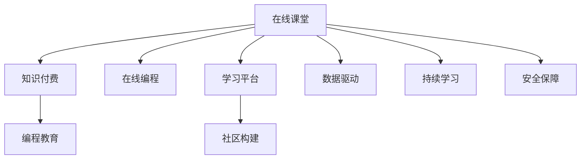

                 

# 程序员如何打造知识付费的在线课堂

> 关键词：在线课堂, 知识付费, 编程教育, 在线编程, 学习平台, 社区构建, 数据驱动, 持续学习, 安全保障

## 1. 背景介绍

在信息技术飞速发展的今天，终身学习已经成为个人成长和职业发展的重要驱动力。然而，传统教育模式往往难以满足人们灵活学习的需要，尤其是在不断变化的IT领域，终身学习成为一种常态。在线教育以其灵活性、可及性、成本效益高的特点，成为越来越多人的首选。

特别是知识付费平台的兴起，让有需求的编程学习者能够更方便地获取高质量的学习资源。在线编程环境和互动性强的社区也逐渐成为编程学习的重要工具。本文旨在探讨如何利用在线教育平台构建一个面向程序员的知识付费在线课堂，以便为编程学习者提供更加高效、灵活、互动的学习体验。

## 2. 核心概念与联系

### 2.1 核心概念概述

在讨论如何打造知识付费的在线课堂之前，我们先明确一些核心概念：

- **在线课堂(Online Classroom)**：利用互联网技术搭建的教育平台，通过视频、文本、代码等多种形式，为学习者提供多样化的学习内容和方法。
- **知识付费(Knowledge-As-Service, KaaS)**：用户为获取专业知识而支付费用的模式，通常以课程、文章、视频、音频等多种形式呈现。
- **编程教育(Programming Education)**：教育领域专门针对编程语言的理论知识和实际应用的培训。
- **在线编程(Online Programming)**：通过互联网平台进行编程学习，通常结合代码编辑器、编译器、运行环境等工具。
- **学习平台(Learning Platform)**：提供课程、论坛、作业提交等服务的在线教育平台，支持用户进行协作和互动。
- **社区构建(Community Building)**：通过组织线上活动、互动讨论、项目协作等方式，建立活跃的在线学习社区。
- **数据驱动(Data-Driven)**：利用大数据和人工智能技术，根据学习者的行为和反馈，优化学习路径和资源推送。
- **持续学习(Continuous Learning)**：持续不断地学习和获取新知识，以适应技术发展的变化。
- **安全保障(Security Assurance)**：确保在线学习平台的数据安全和用户隐私。

这些概念之间存在紧密联系，共同构成了知识付费在线课堂的核心框架。通过这些概念，我们可以更好地理解在线课堂的构建思路和关键技术点。

### 2.2 核心概念原理和架构的 Mermaid 流程图



## 3. 核心算法原理 & 具体操作步骤

### 3.1 算法原理概述

构建一个知识付费的在线课堂，涉及到多种技术的综合应用，包括但不限于云计算、大数据、人工智能、前端后端开发等。其核心算法原理可概述如下：

- **云计算技术(Cloud Computing)**：利用云平台提供的计算、存储和网络资源，快速部署和扩展在线课堂的各项功能。
- **大数据技术(Big Data)**：通过收集和分析学习者的行为数据，优化学习路径和课程推荐。
- **人工智能技术(AI)**：采用自然语言处理(NLP)、机器学习(ML)等技术，实现智能问答、个性化推荐等功能。
- **前端后端技术(Frontend-Backend Tech)**：结合前端UI设计和后端API服务，提供流畅的用户体验。
- **安全保障技术(Security Tech)**：采用加密技术、访问控制等措施，确保平台的数据安全和用户隐私。

### 3.2 算法步骤详解

1. **需求分析**：明确在线课堂的功能需求，包括课程展示、学习路径定制、实时互动、数据统计分析等。
2. **平台规划**：确定云平台和服务器架构，选择合适的基础设施提供商。
3. **系统设计**：设计前后端技术栈，选择合适的编程语言、框架和工具。
4. **课程开发**：根据需求，开发课程内容，包括视频、文本、代码示例等。
5. **互动设计**：设计互动功能，如实时问答、代码讨论、项目协作等。
6. **安全保障**：确保平台的安全性，包括数据加密、访问控制等。
7. **测试部署**：进行系统测试和部署，确保平台的稳定性和性能。
8. **用户运营**：通过社区活动、在线讲座等形式，提升用户粘性。
9. **迭代优化**：根据用户反馈，持续优化课程内容和功能。

### 3.3 算法优缺点

#### 优点：

- **灵活性**：在线课堂可以根据学习者的需求和兴趣灵活调整课程内容，提供个性化学习路径。
- **可及性**：通过互联网，学习者可以在任何时间、任何地点进行学习，不受时间和地点的限制。
- **成本效益**：相较于传统线下教育，在线课程的开发和运营成本较低，用户可以以较低价格获取高质量资源。
- **互动性**：在线编程环境可以提供实时的代码执行和反馈，增加学习互动性和实践性。

#### 缺点：

- **缺乏即时反馈**：在线课程的即时互动性较弱，难以提供实时、即时的学习反馈。
- **依赖互联网**：学习效果受网络环境的影响较大，网络中断会影响学习进度。
- **缺乏面对面的交流**：在线课程难以提供老师和学生之间的面对面的互动交流。

### 3.4 算法应用领域

知识付费在线课堂的应用领域非常广泛，包括但不限于以下几个方面：

- **编程课程**：提供Python、Java、C++等编程语言的课程，涵盖从入门到高级的各种知识点。
- **数据科学**：涵盖数据分析、机器学习、深度学习等领域，提供实战项目和案例分析。
- **网络安全**：提供网络攻击防护、密码学等领域的课程，帮助学习者掌握网络安全技能。
- **人工智能**：提供计算机视觉、自然语言处理等领域的课程，帮助学习者了解AI技术的最新进展。
- **项目管理**：提供敏捷开发、Scrum等项目管理工具和方法的课程，帮助学习者提升项目管理能力。
- **软技能**：提供沟通技巧、团队协作、时间管理等软技能的课程，帮助学习者在职场中更加成功。

## 4. 数学模型和公式 & 详细讲解 & 举例说明

### 4.1 数学模型构建

在在线课堂的建设过程中，涉及到大量的数据处理和分析。以下是一个基本的数学模型，用于描述学习者的学习路径优化：

- **用户行为数据**：学习者点击、浏览、学习时长等行为数据。
- **课程评价数据**：学习者对课程的评分和反馈。
- **课程推荐模型**：利用机器学习算法，根据用户行为和课程评价数据，推荐合适的课程和学习路径。

### 4.2 公式推导过程

假设用户的学习路径可以用一个图来表示，其中节点表示课程，边表示学习路径，权重表示用户的学习兴趣和学习效果。根据用户的行为数据和课程评价数据，可以构建一个加权图，如下所示：

$$ G(V,E,W) $$

其中，$V$表示节点集合，$E$表示边集合，$W$表示权重集合。

根据用户的学习行为，可以计算每个课程的用户兴趣得分$I$和效果得分$E$，如下所示：

$$ I = \sum_{u \in V} c_u \cdot w_u $$
$$ E = \sum_{u \in V} e_u \cdot w_u $$

其中，$c_u$和$e_u$分别表示用户对课程的点击行为和评价，$w_u$表示用户对课程的兴趣和效果的权重。

根据计算出的兴趣得分和效果得分，可以构建一个加权图$G$，用于推荐合适的学习路径。

### 4.3 案例分析与讲解

以下是一个简单的案例分析：

**案例背景**：假设有一个在线编程学习平台，用户A在学习Python语言的过程中，点击了多个关于数据结构和算法的基础课程，并对这些课程进行了评分。

**分析过程**：
1. 根据用户A的学习行为，计算每个课程的用户兴趣得分$I$和效果得分$E$。
2. 利用机器学习算法，构建一个加权图$G$，表示用户A的学习路径。
3. 根据图$G$和用户A的学习目标，推荐合适的后续课程和学习路径。

**结果展示**：
- 用户A可能对Python的基础语法和数据结构课程有较高的兴趣和较好的学习效果。
- 根据用户A的兴趣和效果得分，推荐学习进阶课程如面向对象编程、算法设计等。
- 根据用户A的学习目标，推荐与该目标相关的课程，如Python网络爬虫、数据分析等。

## 5. 项目实践：代码实例和详细解释说明

### 5.1 开发环境搭建

为了搭建一个知识付费的在线课堂，我们需要一个集成的开发环境。以下是一个示例开发环境：

- **服务器环境**：使用AWS或阿里云等云平台，搭建Web服务器和数据库服务器。
- **编程语言**：前端使用JavaScript、React等技术，后端使用Node.js、Express等技术。
- **数据库**：使用MySQL、MongoDB等关系型或非关系型数据库。
- **前端框架**：使用React、Vue等前端框架，提供丰富的UI组件和交互功能。
- **云服务**：使用云函数、云存储等云服务，实现用户数据的存储和访问。
- **开发工具**：使用VSCode、Sublime等IDE工具，提高开发效率。

### 5.2 源代码详细实现

以下是一个简单的代码示例，用于实现用户行为数据的收集和分析：

**前端代码**：

```javascript
import React, { useState } from 'react';

function UserBehavior() {
    const [behavior, setBehavior] = useState({});

    const handleClick = (course) => {
        setBehavior(prev => ({ ...prev, [course]: 1 }));
    }

    return (
        <div>
            {/* 课程列表 */}
            {courses.map((course) => (
                <div key={course.id} onClick={() => handleClick(course)}>
                    {course.title}
                </div>
            ))}
        </div>
    );
}

export default UserBehavior;
```

**后端代码**：

```javascript
const express = require('express');
const bodyParser = require('body-parser');
const mysql = require('mysql');

const app = express();
const port = 3000;
const connection = mysql.createConnection({
    host: 'localhost',
    user: 'root',
    password: 'password',
    database: 'online_learning'
});

app.use(bodyParser.json());

app.get('/behavior', (req, res) => {
    connection.query('SELECT * FROM user_behavior', (err, result) => {
        if (err) throw err;
        res.json(result);
    });
});

app.post('/behavior', (req, res) => {
    const { course } = req.body;
    connection.query('INSERT INTO user_behavior (course) VALUES (?)', [course], (err, result) => {
        if (err) throw err;
        res.json({ message: 'Behavior added successfully' });
    });
});

app.listen(port, () => {
    console.log(`Server is running on port ${port}`);
});
```

### 5.3 代码解读与分析

以上代码示例展示了如何通过前端和后端实现用户行为数据的收集和存储。具体分析如下：

- **前端代码**：使用React和State Hook，实现用户对课程的点击行为。
- **后端代码**：使用Express和MySQL，实现用户行为数据的事务存储和查询。

## 6. 实际应用场景

### 6.1 在线编程平台

在线编程平台是知识付费在线课堂的重要组成部分，以下是几个实际应用场景：

- **互动编程**：提供实时的代码执行环境，支持用户在线编写和调试代码。
- **在线实验**：提供代码示例和实验任务，帮助用户理解编程概念和语法。
- **项目协作**：支持团队协作和代码版本控制，方便用户进行项目管理和代码共享。

### 6.2 在线教育平台

在线教育平台是知识付费在线课堂的主要载体，以下是几个实际应用场景：

- **课程展示**：通过课程视频、文本、代码等多种形式展示课程内容。
- **实时互动**：通过聊天室、问答系统等工具，实现用户和教师的实时互动。
- **个性化推荐**：根据用户的学习行为和兴趣，推荐合适的课程和学习路径。
- **作业提交**：提供作业提交和评分功能，帮助教师和学生进行评估。

### 6.3 在线学习社区

在线学习社区是知识付费在线课堂的重要补充，以下是几个实际应用场景：

- **用户讨论**：通过论坛、社交媒体等工具，帮助用户讨论学习问题和技术难题。
- **项目展示**：通过博客、GitHub等平台，展示用户的学习成果和项目作品。
- **专家讲座**：邀请行业专家进行在线讲座和分享，提升用户的学习质量。

## 7. 工具和资源推荐

### 7.1 学习资源推荐

为了更好地学习在线课堂的构建和运营，以下是一些优质的学习资源：

- **Coursera**：提供丰富的在线课程和专业证书，涵盖多个领域的编程和数据科学课程。
- **Udacity**：提供技术和职业导向的在线课程，提供纳米学位和证书课程。
- **edX**：提供来自世界顶尖大学和机构的在线课程，涵盖多个学科和技能。
- **Kaggle**：提供数据科学和机器学习竞赛，帮助学习者提升数据处理和建模能力。
- **GitHub**：提供开源代码和项目，帮助学习者学习和贡献代码。

### 7.2 开发工具推荐

以下是一些用于在线课堂开发的常用工具：

- **VSCode**：开源的IDE工具，支持多种编程语言和框架，提供丰富的插件和扩展。
- **Sublime Text**：轻量级的文本编辑器，支持多种编程语言和插件扩展。
- **npm/yarn**：Node.js的包管理工具，便于管理项目依赖和版本控制。
- **Docker**：容器化技术，帮助开发者构建和部署一致的开发和运行环境。
- **Kubernetes**：容器编排工具，帮助开发者管理大规模应用的部署和运维。

### 7.3 相关论文推荐

以下是几篇关于在线教育平台和知识付费领域的经典论文：

- **大规模在线教育平台设计**：探讨在线教育平台的设计原则和关键技术点。
- **个性化推荐系统在在线教育中的应用**：研究如何通过推荐系统，提升在线教育平台的用户体验和学习效果。
- **知识付费平台的商业模型和运营策略**：分析知识付费平台的商业模式和运营策略，探讨如何提升平台的用户粘性和商业价值。

## 8. 总结：未来发展趋势与挑战

### 8.1 总结

本文详细探讨了如何利用在线教育平台构建知识付费的在线课堂，涵盖在线编程、互动学习、个性化推荐等多个方面。通过分析核心概念和算法原理，提供了详细的项目实践案例，并推荐了相关的学习资源和开发工具。

### 8.2 未来发展趋势

未来在线教育平台的发展趋势如下：

- **智能化和个性化**：利用人工智能和大数据分析，提升课程推荐和学习路径优化，提供更加个性化的学习体验。
- **互动性和沉浸感**：通过虚拟现实(VR)和增强现实(AR)技术，提升用户的互动体验和沉浸感。
- **跨平台和跨设备**：支持多终端和多平台访问，提升用户的学习灵活性和便捷性。
- **社区和社交化**：建立更加活跃的学习社区，提升用户的学习动力和交流互动。

### 8.3 面临的挑战

在线教育平台的发展也面临以下挑战：

- **技术和数据安全**：在线教育平台的数据和用户隐私需要得到充分的保护。
- **用户体验和界面设计**：在线教育平台需要提供简洁、易用的界面设计，提升用户体验。
- **师资和内容质量**：在线教育平台需要保证教师和课程的质量，提升学习效果。
- **市场竞争和盈利模式**：在线教育平台需要找到合适的盈利模式，提升市场竞争力。

### 8.4 研究展望

未来在线教育平台的研究方向包括：

- **AI驱动的教育**：利用人工智能技术，提升在线教育平台的智能化水平。
- **数据驱动的个性化**：通过大数据分析和机器学习，提供更加个性化的学习体验。
- **多模态教育**：结合文本、视频、音频等多种形式，提升学习效果。
- **虚拟现实和增强现实**：利用VR和AR技术，提升学习的沉浸感和互动性。

## 9. 附录：常见问题与解答

**Q1：如何提高在线编程平台的性能？**

A: 可以通过优化代码执行环境和提升数据处理速度来提高在线编程平台的性能。例如，使用云函数和CDN加速代码执行，使用大数据分析优化数据查询和处理。

**Q2：如何提升在线教育平台的互动性？**

A: 可以通过引入实时聊天系统、在线问答系统、虚拟教室等方式提升在线教育平台的互动性。同时，提供多媒体内容的播放和互动功能，提升用户的沉浸感和参与感。

**Q3：如何保护在线教育平台的数据安全？**

A: 可以通过加密技术、访问控制、数据匿名化等方式保护在线教育平台的数据安全。同时，定期进行安全审计和漏洞扫描，提升平台的安全防护能力。

**Q4：如何确保在线教育平台的内容质量？**

A: 可以通过建立严格的课程审核机制、邀请专家进行内容审核、定期更新课程内容等方式确保在线教育平台的内容质量。同时，提供用户评价和反馈机制，及时发现和纠正内容问题。

**Q5：如何提升在线教育平台的市场竞争力？**

A: 可以通过差异化定位、独特的课程内容、优质的师资资源等方式提升在线教育平台的市场竞争力。同时，利用社交媒体和市场推广手段，提升平台的知名度和用户粘性。

---

作者：禅与计算机程序设计艺术 / Zen and the Art of Computer Programming

