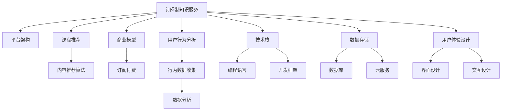

                 

# 程序员如何打造订阅制知识服务

> 关键词：订阅制知识服务,程序员,知识付费,平台构建,商业模型,用户行为分析,课程推荐,技术栈,编程工具,开发环境,数据存储,机器学习,用户体验设计

## 1. 背景介绍

### 1.1 问题由来

随着互联网的发展和知识经济的崛起，人们越来越意识到知识的重要性。在知识付费时代，订阅制知识服务成为了一种主流的需求。对于程序员而言，订阅制知识服务不仅能够获取最新的技术资讯和编程技能，还能与同行交流分享，加速自身职业成长。然而，如何打造高效、可持续的订阅制知识服务，成为一个亟待解决的问题。

### 1.2 问题核心关键点

构建订阅制知识服务，需要考虑以下几个关键点：

- 确定目标用户群体：了解目标用户的技术水平、兴趣领域、学习需求等，为其量身定制服务。
- 设计服务内容：选择合适的课程内容、难度、长度等，确保内容的高质量和实用性。
- 确定定价策略：合理设置订阅价格，平衡成本与收益。
- 构建平台架构：开发高效、易用的知识服务平台，提供稳定可靠的运行环境。
- 制定商业模型：选择合适的商业模式，如按月、按年订阅，或根据课程价值定价等。
- 进行用户行为分析：利用数据科学手段，分析用户行为，优化产品设计。
- 推荐系统设计：构建个性化推荐系统，提升用户满意度。
- 技术栈选择：根据平台需求，选择合适的编程语言、框架和工具。
- 数据存储与处理：保证数据的安全性和高效性，优化数据处理流程。
- 用户体验设计：注重界面友好、功能完整、交互流畅，提升用户粘性。

本文将系统性地介绍如何构建订阅制知识服务，从平台设计到用户推荐、内容优化等多个方面进行分析。通过深入剖析，希望为技术类订阅服务的打造提供参考。

## 2. 核心概念与联系

### 2.1 核心概念概述

为了更好地理解订阅制知识服务，本节将介绍几个密切相关的核心概念：

- 订阅制知识服务(Subscription-Based Knowledge Service)：通过订阅付费，获取知识服务的模式，包括但不限于编程课程、技术资讯、项目案例等。
- 平台架构(Architecture)：指知识服务平台的技术架构设计，包括前端、后端、数据库、云服务、安全等模块。
- 课程推荐(Content Recommendation)：利用算法为用户推荐最适合的课程内容。
- 商业模型(Commercial Model)：定义平台收益和成本的分配方式，如按月、按年订阅、单次付费等。
- 用户行为分析(User Behavior Analysis)：通过对用户行为数据的收集和分析，优化产品设计和用户体验。
- 技术栈(Technology Stack)：开发过程中使用的编程语言、框架、库等。
- 数据存储(Data Storage)：平台运行过程中数据的存储方式和方案。
- 用户体验设计(User Experience Design)：注重界面美观、操作简便、交互流畅，提升用户满意度。

这些核心概念之间的逻辑关系可以通过以下Mermaid流程图来展示：



这个流程图展示了订阅制知识服务的主要组成部分及其相互关系：

1. 订阅制知识服务作为起点，涵盖了课程推荐、用户行为分析、商业模型等多个方面。
2. 平台架构是知识服务的基础，包括前端、后端、数据库等模块设计。
3. 课程推荐依赖于内容推荐算法，为用户提供个性化的课程推荐。
4. 商业模型决定了订阅付费的方式，用户如何获取课程。
5. 用户行为分析通过行为数据收集和数据分析，优化产品设计。
6. 技术栈和数据存储是技术实现的重要组成部分。
7. 用户体验设计注重界面美观、交互流畅，提升用户粘性。

## 3. 核心算法原理 & 具体操作步骤

### 3.1 算法原理概述

订阅制知识服务的核心算法原理基于机器学习和大数据技术，通过分析用户行为数据，为用户推荐最适合的课程内容。其核心步骤包括数据收集、用户行为分析、推荐系统设计、商业模型制定等。

### 3.2 算法步骤详解

基于订阅制知识服务的核心算法原理，以下详细讲解其具体操作步骤：

#### 3.2.1 数据收集与处理

订阅制知识服务的数据主要来自以下几个方面：

- 用户注册信息：包括用户的基本信息、技术水平、兴趣领域等。
- 用户行为数据：包括课程浏览、点击、观看、评分等行为数据。
- 课程信息：包括课程名称、描述、时长、难度、评分等。
- 反馈信息：包括用户对课程的反馈、评价、建议等。

#### 3.2.2 用户行为分析

通过用户行为数据分析，可以了解用户的学习习惯、兴趣偏好、需求变化等，从而优化产品设计，提升用户体验。具体步骤包括：

- 数据清洗与预处理：去除噪声、填补缺失值等。
- 特征提取：提取有意义的特征，如课程浏览时间、评分、反馈内容等。
- 用户画像构建：通过聚类、分类等方法，构建用户画像，描述用户特征。
- 行为预测：使用机器学习模型，预测用户下一步行为，如选择课程、完成学习等。

#### 3.2.3 推荐系统设计

推荐系统是订阅制知识服务的重要组成部分，通过分析用户行为，为用户推荐最合适的课程内容。常用的推荐算法包括：

- 协同过滤算法：基于用户行为相似度推荐。
- 基于内容的推荐算法：分析课程内容特征，推荐相似课程。
- 混合推荐算法：结合协同过滤和内容推荐，提升推荐效果。
- 深度学习推荐算法：如矩阵分解、神经网络等，优化推荐性能。

#### 3.2.4 商业模型制定

订阅制知识服务的商业模型包括按月、按年订阅，或根据课程价值定价等。具体步骤包括：

- 用户定价策略：根据用户不同需求，设计不同的订阅价格。
- 用户行为分析：分析用户支付意愿，优化定价策略。
- 收益分配：设定合理的收益分配比例，平衡平台与课程方利益。
- 促销策略：设计促销活动，吸引用户订阅。

### 3.3 算法优缺点

订阅制知识服务具有以下优点：

- 用户粘性高：订阅用户有较强的持续学习需求，能够带来稳定的流量和收益。
- 课程内容丰富：通过订阅，用户可以获得更多优质课程内容。
- 用户反馈及时：用户可以通过评价、反馈等形式，对课程进行评估，优化课程质量。

同时，也存在一些缺点：

- 付费门槛高：订阅制需要一定的经济基础，限制了一部分用户。
- 用户流失率高：用户一旦停止订阅，可能会失去长期收益。
- 课程内容更新慢：一次性购买课程，可能导致课程内容更新不及时。

### 3.4 算法应用领域

订阅制知识服务在多个领域得到了广泛应用，如编程、设计、管理等。以下列举几个具体应用场景：

- 编程课程：如Python、Java、前端开发等，通过订阅获取最新课程和项目案例。
- 设计课程：如UI设计、用户体验、产品设计等，通过订阅获取设计工具、案例分析。
- 管理课程：如项目管理、团队管理、战略管理等，通过订阅获取实战经验和案例。

## 4. 数学模型和公式 & 详细讲解 & 举例说明

### 4.1 数学模型构建

订阅制知识服务的数学模型主要基于用户行为数据，构建用户画像和推荐系统。以下介绍几个核心数学模型：

#### 4.1.1 用户画像构建模型

用户画像构建模型通过聚类算法，将用户分为不同群体，描述用户特征。以K-means聚类为例，数学公式为：

$$
k-means: \min_{\mu_k} \sum_{i=1}^{n}\min_{k}\|x_i - \mu_k\|
$$

其中，$x_i$为第i个用户行为数据，$\mu_k$为第k个聚类的中心点，$n$为用户总数。

#### 4.1.2 推荐系统矩阵分解模型

推荐系统矩阵分解模型将用户-课程矩阵进行分解，找到隐含的用户和课程特征。以奇异值分解(SVD)为例，数学公式为：

$$
U\Sigma V^T \approx X
$$

其中，$X$为用户-课程矩阵，$U$、$V$为特征矩阵，$\Sigma$为奇异值矩阵。

#### 4.1.3 深度学习推荐模型

深度学习推荐模型使用神经网络对用户和课程进行表示学习，优化推荐效果。以自编码器为例，数学公式为：

$$
z = W_{enc}x + b_{enc}
$$

$$
x' = W_{dec}z + b_{dec}
$$

其中，$x$为输入向量，$z$为编码层输出，$x'$为解码层输出，$W_{enc}$、$W_{dec}$为权重矩阵，$b_{enc}$、$b_{dec}$为偏置项。

### 4.2 公式推导过程

以下是推荐系统矩阵分解模型的详细推导过程：

假设用户-课程矩阵为$X$，将其分解为$U\Sigma V^T$，其中$U$为用户特征矩阵，$V$为课程特征矩阵，$\Sigma$为奇异值矩阵。根据矩阵乘法，有：

$$
U\Sigma V^T X = U\Sigma V^T \Sigma U V^T X = UXV^T X
$$

由于$X$是稀疏矩阵，$U$、$V$是低秩矩阵，$\Sigma$是对角矩阵，可以通过奇异值分解的方式，最小化误差：

$$
\min_{U,\Sigma,V} \|X - U\Sigma V^T\|_F^2
$$

其中$\|\cdot\|_F$为矩阵的Frobenius范数。

### 4.3 案例分析与讲解

以一个简单的案例来解释推荐系统的实际应用：

假设有一个在线学习平台，用户通过订阅获得课程。平台收集用户行为数据，如课程浏览时间、评分、反馈等。通过K-means聚类算法，将用户分为不同群体，如“编程新手”、“高级开发者”、“数据科学家”等。然后，使用矩阵分解模型，将用户-课程矩阵分解为低秩矩阵，找到用户和课程的隐含特征。最后，通过深度学习模型，训练神经网络，优化推荐效果，为用户推荐最合适的课程内容。

## 5. 项目实践：代码实例和详细解释说明

### 5.1 开发环境搭建

在构建订阅制知识服务前，我们需要准备好开发环境。以下是使用Python进行Flask开发的环境配置流程：

1. 安装Anaconda：从官网下载并安装Anaconda，用于创建独立的Python环境。

2. 创建并激活虚拟环境：
```bash
conda create -n pytorch-env python=3.8 
conda activate pytorch-env
```

3. 安装Flask：
```bash
pip install flask
```

4. 安装必要的依赖包：
```bash
pip install pandas numpy matplotlib scikit-learn
```

5. 安装Flask-SQLAlchemy和Flask-MongoEngine：
```bash
pip install Flask-SQLAlchemy Flask-MongoEngine
```

完成上述步骤后，即可在`pytorch-env`环境中开始微调实践。

### 5.2 源代码详细实现

下面我们以Flask框架为例，给出构建订阅制知识服务平台的PyTorch代码实现。

首先，定义用户和课程的数据模型：

```python
from flask_sqlalchemy import SQLAlchemy
from flask_mongoengine import MongoEngine
from pymongo import MongoClient

# SQLAlchemy
db = SQLAlchemy(app)
# MongoEngine
client = MongoClient('mongodb://localhost:27017/')
mongo = MongoEngine(app)

class User(db.Model):
    id = db.Column(db.Integer, primary_key=True)
    name = db.Column(db.String(50), nullable=False)
    email = db.Column(db.String(50), nullable=False)
    role = db.Column(db.String(50), nullable=False)
    courses = db.relationship('Course', backref='users')

class Course(db.Model):
    id = db.Column(db.Integer, primary_key=True)
    name = db.Column(db.String(50), nullable=False)
    description = db.Column(db.String(500), nullable=False)
    duration = db.Column(db.Integer, nullable=False)
    price = db.Column(db.Float, nullable=False)
    participants = db.Column(db.Integer, nullable=False)
    user_id = db.Column(db.Integer, db.ForeignKey('user.id'))

# MongoEngine
course_collection = mongo.db.courses
```

然后，定义用户行为记录的数据模型：

```python
class UserBehavior(db.Model):
    id = db.Column(db.Integer, primary_key=True)
    user_id = db.Column(db.Integer, db.ForeignKey('user.id'), nullable=False)
    course_id = db.Column(db.Integer, db.ForeignKey('course.id'), nullable=False)
    action = db.Column(db.String(50), nullable=False)
    timestamp = db.Column(db.DateTime, nullable=False)
    data = db.Column(db.String(500), nullable=False)

# MongoEngine
user_behavior_collection = mongo.db.user_behaviors
```

接着，定义推荐系统模型：

```python
from sklearn.decomposition import TruncatedSVD
from tensorflow.keras.layers import Input, Embedding, Dense
from tensorflow.keras.models import Model

user_input = Input(shape=(d_dim,), name='user')
course_input = Input(shape=(c_dim,), name='course')

# SVD
user_features = TruncatedSVD(n_components=10).fit_transform(user_input)
course_features = TruncatedSVD(n_components=10).fit_transform(course_input)
dot_product = Dot(dots=1, normalize=True)([user_features, course_features])
predictions = Dense(1, activation='sigmoid')(dot_product)

model = Model(inputs=[user_input, course_input], outputs=predictions)
model.compile(optimizer='adam', loss='binary_crossentropy', metrics=['accuracy'])
```

最后，启动Flask应用：

```python
if __name__ == '__main__':
    app.run(debug=True)
```

以上代码实现了基于SQLAlchemy和MongoEngine的订阅制知识服务平台的基本功能，包括用户管理、课程管理、用户行为记录和推荐系统。通过Flask-SQLAlchemy和Flask-MongoEngine，可以快速构建数据库模型，并通过SQLAlchemy和MongoEngine进行数据存储和检索。

### 5.3 代码解读与分析

让我们再详细解读一下关键代码的实现细节：

**User类和Course类**：
- 定义了用户和课程的基本信息，如姓名、邮箱、角色、课程名称、描述、时长等。
- 用户与课程之间建立关系，方便推荐系统的构建。

**UserBehavior类**：
- 记录用户对课程的浏览、点击、观看、评分等行为，包括用户ID、课程ID、动作、时间戳、数据等。
- 使用MongoEngine进行数据存储，方便数据实时分析和查询。

**推荐系统模型**：
- 使用TruncatedSVD对用户和课程进行降维，提取隐含特征。
- 通过Dot层计算用户和课程的相似度，使用Dense层进行二分类预测，输出是否订阅该课程的概率。

**Flask应用启动**：
- 启动Flask应用，通过debug模式查看日志和调试。
- 在实际部署中，可以使用Gunicorn或Docker等工具进行优化和扩展。

## 6. 实际应用场景

### 6.1 智能编程助手

基于订阅制知识服务的智能编程助手，可以帮助程序员快速掌握新技术和工具，提高开发效率。例如，构建一个编程课程订阅服务，为程序员提供最新的编程语言、框架、工具教程。

通过推荐系统，智能编程助手能够根据程序员的技能水平、学习兴趣，推荐最适合的课程内容。同时，提供课程评分、用户评价等信息，方便程序员进行课程选择。

### 6.2 个性化编程学习

订阅制知识服务可以提供个性化的编程学习服务，为程序员提供量身定制的学习方案。例如，根据用户的学习进度和理解能力，推荐适合的课程内容，提升学习效果。

通过用户行为分析，订阅服务能够识别出用户的知识盲点和薄弱环节，推荐针对性的学习资料。同时，使用机器学习模型，预测用户的学习进度和效果，优化课程推荐策略。

### 6.3 企业内训

企业可以基于订阅制知识服务，构建内部的技术培训和知识共享平台。例如，收集企业内部的技术文档、项目案例、员工培训资料等，进行整合和优化，为用户提供系统化的学习资源。

通过订阅服务，企业能够按需提供课程内容，满足不同岗位和技术栈的需求。同时，利用推荐系统，提升员工的学习效率和知识共享水平。

## 7. 工具和资源推荐

### 7.1 学习资源推荐

为了帮助开发者系统掌握订阅制知识服务的技术基础和实践技巧，这里推荐一些优质的学习资源：

1. 《Flask Web开发实战》系列博文：由Flask官方作者撰写，深入浅出地介绍了Flask的开发技巧和最佳实践。

2. 《深度学习推荐系统》课程：斯坦福大学开设的推荐系统课程，有Lecture视频和配套作业，带你入门推荐系统。

3. 《Python编程：从入门到实践》书籍：Python编程的经典入门教材，涵盖了数据处理、网络编程、机器学习等多个方面。

4. 《机器学习实战》书籍：提供了大量实际案例和代码示例，适合动手实践。

5. 《用户行为分析与机器学习》书籍：详细讲解用户行为分析的方法和应用场景，适合数据分析和推荐系统开发。

通过这些资源的学习实践，相信你一定能够快速掌握订阅制知识服务的精髓，并用于解决实际的NLP问题。

### 7.2 开发工具推荐

高效的开发离不开优秀的工具支持。以下是几款用于订阅制知识服务开发的常用工具：

1. Flask：轻量级的Web框架，适合快速迭代开发。

2. SQLAlchemy：流行的Python ORM库，支持多种数据库，方便数据存储和查询。

3. MongoEngine：Python MongoDB文档驱动的对象文档映射库，方便进行数据操作。

4. Pandas：数据分析和处理库，适合对用户行为数据进行统计和分析。

5. NumPy：科学计算库，适合进行数据处理和模型训练。

6. TensorFlow：开源机器学习框架，支持深度学习推荐模型。

7. PyTorch：深度学习框架，支持多种深度学习算法。

合理利用这些工具，可以显著提升订阅制知识服务的开发效率，加快创新迭代的步伐。

### 7.3 相关论文推荐

订阅制知识服务的发展源于学界的持续研究。以下是几篇奠基性的相关论文，推荐阅读：

1. "Courses at Scale: The Future of Online Learning"（在线课程研究）：Liu et al., 2019。

2. "Deep Learning Recommendation Systems: A Review and Outlook"（深度学习推荐系统综述）：He et al., 2017。

3. "Hybrid Recommendation Systems: A Survey"（混合推荐系统综述）：Bharath et al., 2017。

4. "Collaborative Filtering: The Textbook"（协同过滤理论）：Wang et al., 2011。

5. "Factorization Machines"（因子分解机）：Rendle et al., 2010。

这些论文代表了大规模推荐系统的发展脉络。通过学习这些前沿成果，可以帮助研究者把握学科前进方向，激发更多的创新灵感。

## 8. 总结：未来发展趋势与挑战

### 8.1 总结

本文对订阅制知识服务进行了全面系统的介绍。首先阐述了订阅制知识服务的重要性和构建背景，明确了其对程序员的价值。其次，从原理到实践，详细讲解了订阅制知识服务的核心算法原理和具体操作步骤，给出了订阅制知识服务平台的具体代码实例。同时，本文还广泛探讨了订阅制知识服务在多个行业领域的应用前景，展示了其巨大的应用潜力。此外，本文精选了订阅制知识服务的各类学习资源，力求为读者提供全方位的技术指引。

通过本文的系统梳理，可以看到，订阅制知识服务作为新兴技术，在程序员群体中具有广阔的应用前景。利用订阅制知识服务，程序员能够及时获取最新技术和知识，提升自身竞争力。未来，随着技术的不断进步和市场需求的推动，订阅制知识服务必将成为程序员不可或缺的资源。

### 8.2 未来发展趋势

展望未来，订阅制知识服务将呈现以下几个发展趋势：

1. 用户行为分析更加深入：通过分析更多行为数据，构建更准确的推荐模型。

2. 推荐系统更加个性化：利用机器学习模型，提供更加个性化的课程推荐。

3. 推荐算法更加多样化：结合多种推荐算法，优化推荐效果。

4. 推荐系统更加自动化：引入自动调参、模型压缩等技术，提升推荐系统效率。

5. 订阅模式更加灵活：引入按需订阅、按需购买等模式，提升用户粘性。

6. 平台整合更多功能：结合数据分析、智能搜索、个性化展示等，提升用户体验。

以上趋势凸显了订阅制知识服务的发展前景，其技术优势和市场需求将进一步促进技术进步和产业发展。

### 8.3 面临的挑战

尽管订阅制知识服务已经取得了一定的成功，但在迈向更加智能化、普适化应用的过程中，仍面临诸多挑战：

1. 数据隐私和安全：用户数据隐私保护和平台数据安全是重要挑战，需要制定完善的数据保护机制。

2. 推荐系统的泛化能力：如何提升推荐系统对新用户的适应性，避免过度拟合。

3. 用户粘性维持：如何提高用户订阅率，降低用户流失率，保持平台稳定发展。

4. 课程质量和多样性：如何保证课程内容的高质量和多样化，满足用户需求。

5. 平台开发成本：如何平衡平台开发成本和收益，确保可持续发展。

6. 内容审核机制：如何建立科学合理的课程审核机制，避免有害内容传播。

以上挑战需要持续关注和解决，才能确保订阅制知识服务的长久发展。

### 8.4 研究展望

面对订阅制知识服务所面临的种种挑战，未来的研究需要在以下几个方面寻求新的突破：

1. 引入更多用户行为特征：结合多源数据，提升用户行为预测的准确性。

2. 优化推荐系统算法：开发更加高效的推荐算法，提升推荐效果。

3. 引入先验知识：结合领域专家知识，优化推荐系统设计。

4. 优化用户粘性策略：采用个性化推送、用户激励等策略，提高用户订阅率。

5. 引入多模态数据：结合视觉、音频等多模态数据，提升推荐系统性能。

这些研究方向的探索，将进一步推动订阅制知识服务的发展，为用户提供更加丰富、高效的个性化学习体验。

## 9. 附录：常见问题与解答

**Q1：订阅制知识服务与传统知识付费有何不同？**

A: 订阅制知识服务与传统知识付费的区别在于，订阅制提供持续的学习体验，用户可以按月或按年订阅，获得持续的课程更新和学习资源。而传统知识付费则是一次性购买，获取课程内容和资料，课程内容一般不再更新。

**Q2：订阅制知识服务如何降低用户流失率？**

A: 订阅制知识服务可以通过以下方式降低用户流失率：
1. 提供高质量课程内容：通过优化课程质量，提升用户体验。
2. 个性化推荐：通过推荐系统，提供符合用户兴趣的课程内容。
3. 及时反馈和支持：通过用户反馈和在线客服，及时解决用户问题。
4. 用户激励：通过积分、折扣、赠课等激励措施，增加用户粘性。

**Q3：如何评估订阅制知识服务的商业模型？**

A: 评估订阅制知识服务的商业模型，需要考虑以下几个方面：
1. 订阅价格：合理定价，平衡成本和收益。
2. 用户规模：分析用户增长趋势，预测用户数量。
3. 用户粘性：评估用户活跃度和订阅时间，优化用户体验。
4. 课程收益：分析课程订阅情况，提升课程收益。
5. 推荐系统效果：评估推荐系统推荐准确性，提升用户满意度。

**Q4：如何构建高效的推荐系统？**

A: 构建高效的推荐系统，需要考虑以下几个方面：
1. 数据收集：收集用户行为数据，如课程浏览、点击、观看、评分等。
2. 用户画像构建：通过聚类、分类等方法，构建用户画像，描述用户特征。
3. 推荐算法选择：选择协同过滤、基于内容的推荐算法、混合推荐算法、深度学习推荐算法等。
4. 模型训练：使用机器学习模型，训练推荐模型，优化推荐效果。
5. 数据优化：采用数据降维、特征选择等技术，提升推荐系统效率。
6. 实时更新：定期更新推荐系统，适应用户需求变化。

**Q5：如何保护用户数据隐私？**

A: 保护用户数据隐私，需要采取以下措施：
1. 数据加密：对用户数据进行加密处理，防止数据泄露。
2. 数据匿名化：去除敏感信息，保护用户隐私。
3. 访问控制：建立严格的访问控制机制，限制数据访问权限。
4. 数据审计：定期进行数据审计，发现并修复数据安全问题。
5. 法律法规遵循：遵守相关法律法规，保护用户数据隐私。

通过这些措施，可以有效保护用户数据隐私，提升用户信任和平台安全性。

---

作者：禅与计算机程序设计艺术 / Zen and the Art of Computer Programming

