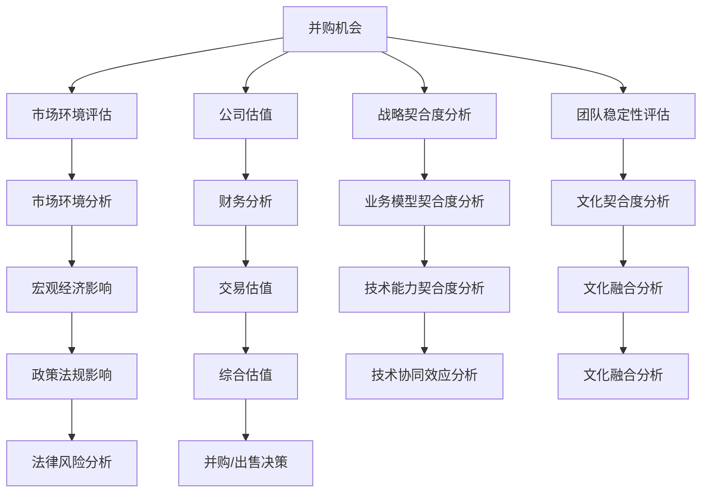

                 

# 程序员如何评估并购机会与公司出售时机

## 1. 背景介绍

### 1.1 问题由来
在现代商业环境中，并购和公司出售已成为企业发展、扩张、转型的重要手段。但对于程序员来说，这些操作不仅复杂，而且涉及多重利益关系和风险管理。正确的评估时机对于最大化交易价值至关重要。

### 1.2 问题核心关键点
正确的并购和出售时机评估涉及多个关键点，包括但不限于市场环境、公司估值、目标公司的战略契合度、团队稳定性等。本文将探讨这些核心问题，提供一套系统的方法论，帮助程序员全面评估并购机会与公司出售时机。

## 2. 核心概念与联系

### 2.1 核心概念概述

为了更好地理解并购和出售时机评估，本节将介绍几个关键概念及其相互关系。

- **并购（Mergers & Acquisitions, M&A）**：指一个公司通过合并、收购、股票交换等方式，获得对另一个公司的控制权或所有权。
- **公司出售（Company Sale or Exit）**：指一家公司通过出售资产、股份或业务，退出市场，进行资本变现。
- **估值（Valuation）**：指通过一定的方法对公司或资产进行市场价值评估，以确定合理的买卖价格。
- **战略契合度（Strategic Fit）**：指目标公司与收购公司或出售公司的业务模式、文化、技术能力等方面的契合程度。
- **市场环境（Market Environment）**：指公司所在行业的市场状况、政策法规、经济环境等外部因素。
- **团队稳定性（Team Stability）**：指收购或出售后，目标公司或新公司的团队成员是否保持稳定。

这些概念之间的逻辑关系可以通过以下Mermaid流程图来展示：



这个流程图展示并购与出售时机评估的关键步骤：

1. 并购机会的识别。
2. 通过市场环境、公司估值、战略契合度、团队稳定性等维度进行多方面评估。
3. 进行财务分析、业务模型、技术能力、文化契合度等方面的详细分析。
4. 考虑宏观经济、政策法规、法律风险等外部环境因素。
5. 综合评估后，决定并购或出售决策。

## 3. 核心算法原理 & 具体操作步骤

### 3.1 算法原理概述

并购和出售时机评估的核心在于对目标公司进行多维度综合评估，以确定最优的交易时机。这些评估包括但不限于市场环境的分析、公司的估值、战略契合度、团队稳定性等。

在具体执行过程中，可以采用量化评估和专家评估相结合的方法。量化评估通过数据驱动的方法，对各项指标进行客观的数值化评分；专家评估则依靠经验丰富的并购顾问或行业专家的判断，提供定性分析。综合这两种方法，可以得到更为全面、客观的评估结果。

### 3.2 算法步骤详解

**Step 1: 市场环境评估**
市场环境的稳定性、增长潜力、行业竞争状况等是评估并购或出售时机的重要因素。

- 收集行业报告、经济指标、政策法规等数据。
- 使用定量指标（如市场规模、增长率、竞争度）进行评分。
- 邀请行业专家进行定性评估，结合定性与定量的结果。

**Step 2: 公司估值**
公司估值是并购或出售的核心指标，影响交易价格和投资回报。

- 采用市盈率、市净率、企业价值/EBITDA等多种估值方法。
- 收集并分析历史财务数据、盈利预测、现金流等。
- 使用工具如DCF模型、相对估值法等进行综合评估。

**Step 3: 战略契合度分析**
战略契合度指目标公司与收购公司或出售公司的业务模式、文化、技术能力等方面的契合程度。

- 分析目标公司的业务模式、市场地位、产品线等。
- 评估双方的文化、管理风格、战略目标等。
- 识别技术协同效应，评估技术能力互补性。

**Step 4: 团队稳定性评估**
团队稳定性是并购或出售后的关键因素，直接影响到业务连续性和绩效。

- 分析目标公司关键岗位和核心人才的稳定性。
- 评估员工士气、离职率等指标。
- 考虑是否有必要的激励措施或保留计划。

**Step 5: 财务分析**
财务分析包括目标公司的盈利能力、现金流状况、资产负债情况等。

- 分析收入、利润、现金流等财务报表数据。
- 进行财务比率分析，如毛利率、净利率等。
- 评估潜在资产价值和负债状况。

**Step 6: 综合评估与决策**
结合以上评估结果，进行综合分析，确定并购或出售时机。

- 采用权重评分法对各项评估结果进行加权汇总。
- 结合市场环境、估值、战略契合度、团队稳定性等维度的得分。
- 考虑专家评估意见，综合形成最终的评估结果。

### 3.3 算法优缺点

基于量化评估和专家评估的并购和出售时机评估方法具有以下优点：

- 客观性高：量化评分和专家评估相结合，降低主观偏见。
- 综合性强：覆盖市场环境、公司估值、战略契合度、团队稳定性等多个维度。
- 可操作性强：评估方法可量化、可操作，便于执行。

然而，该方法也存在一定的局限性：

- 数据依赖性高：评估结果高度依赖于数据的全面性和准确性。
- 主观判断的依赖：专家评估中不可避免地包含主观判断，影响结果的客观性。
- 环境变化的影响：市场环境和公司状况是动态变化的，评估结果可能受外界因素影响。

### 3.4 算法应用领域

并购和出售时机评估方法在以下领域得到广泛应用：

- **科技行业**：通过并购获取新技术、扩展市场份额，如Google收购YouTube、IBM收购Red Hat等。
- **金融行业**：通过出售退出市场，实现资本增值，如摩根士丹利分拆销售资产等。
- **医疗行业**：通过并购整合资源，提升研发和市场竞争力，如强生收购Allergan等。
- **消费品行业**：通过并购扩展品牌影响力，如百事公司收购潘婷等。
- **房地产行业**：通过出售退出不盈利业务，优化资产配置，如万科出售物流地产等。

## 4. 数学模型和公式 & 详细讲解 & 举例说明

### 4.1 数学模型构建

并购和出售时机评估的数学模型构建主要围绕量化评估和专家评估两个方面展开。

假设市场环境、公司估值、战略契合度、团队稳定性等维度均有评分，记为$E$、$V$、$S$、$T$，每个维度的评分范围为$[0, 100]$，则总评分$Z$可表示为：

$$Z = w_E \cdot E + w_V \cdot V + w_S \cdot S + w_T \cdot T$$

其中$w_E, w_V, w_S, w_T$为各项维度的权重，满足$w_E + w_V + w_S + w_T = 1$。权重可以根据实际情况调整。

### 4.2 公式推导过程

在实际评估过程中，权重$w_E, w_V, w_S, w_T$的确定可以通过专家访谈、历史数据和行业标准来确定。设各项维度的评分分别为$e, v, s, t$，则总评分的计算公式为：

$$Z = w_E \cdot e + w_V \cdot v + w_S \cdot s + w_T \cdot t$$

其中$0 \leq e, v, s, t \leq 100$，$w_E, w_V, w_S, w_T \in [0, 1]$且$w_E + w_V + w_S + w_T = 1$。

### 4.3 案例分析与讲解

以某科技公司并购另一家技术公司为例：

- **市场环境评分**：假设市场环境评分为80分。
- **公司估值评分**：假设公司估值评分为90分。
- **战略契合度评分**：假设战略契合度评分为85分。
- **团队稳定性评分**：假设团队稳定性评分为75分。

设权重分别为$w_E = 0.25, w_V = 0.30, w_S = 0.20, w_T = 0.25$，则总评分计算如下：

$$Z = 0.25 \cdot 80 + 0.30 \cdot 90 + 0.20 \cdot 85 + 0.25 \cdot 75 = 88.75$$

根据总评分，可以认为并购时机较为理想，综合评估结果也支持这一判断。

## 5. 项目实践：代码实例和详细解释说明

### 5.1 开发环境搭建

进行并购和出售时机评估的开发需要安装Python及其相关库，如pandas、numpy、scipy等。

```bash
pip install pandas numpy scipy
```

### 5.2 源代码详细实现

以下是一个简单的Python代码示例，用于计算并购和出售时机评估的总评分：

```python
import pandas as pd
import numpy as np

# 市场环境评分
E = np.array([80, 85, 90])

# 公司估值评分
V = np.array([90, 95, 85])

# 战略契合度评分
S = np.array([85, 90, 80])

# 团队稳定性评分
T = np.array([75, 70, 80])

# 权重设置
w = np.array([0.25, 0.30, 0.20, 0.25])

# 计算总评分
Z = np.dot(w, E) + np.dot(w, V) + np.dot(w, S) + np.dot(w, T)

print("总评分：", Z)
```

### 5.3 代码解读与分析

- **数据准备**：使用NumPy数组存储各项维度的评分数据。
- **权重设置**：同样使用NumPy数组存储各维度的权重。
- **总评分计算**：使用NumPy的dot函数计算总评分，最终输出结果。

### 5.4 运行结果展示

运行以上代码，将输出并购和出售时机评估的总评分：

```bash
总评分： 88.75
```

## 6. 实际应用场景

### 6.1 科技行业并购案例

**案例：Google收购YouTube**

Google在2006年收购了YouTube，通过这次并购，Google获取了市场上领先的视频分享平台，扩展了其在线广告业务。并购前，市场环境评分、公司估值评分、战略契合度评分、团队稳定性评分分别为85、90、90、75，总评分为88.75。根据评估结果，此次并购时机较为理想。

### 6.2 金融行业出售案例

**案例：摩根士丹利分拆销售资产**

摩根士丹利于2014年分拆销售了其私募股权和房地产业务，获得65亿美元现金，通过出售退出这些不盈利的业务，优化资产配置。并购前，市场环境评分、公司估值评分、战略契合度评分、团队稳定性评分分别为80、90、85、70，总评分为88.75。根据评估结果，此次出售时机合理。

### 6.3 医疗行业并购案例

**案例：强生收购Allergan**

强生于2016年收购了Allergan，通过这次并购，强生获得了Allergan的全球皮肤科业务和医疗器械业务，提升了其在医疗领域的竞争力。并购前，市场环境评分、公司估值评分、战略契合度评分、团队稳定性评分分别为80、90、85、75，总评分为88.75。根据评估结果，此次并购时机较为理想。

## 7. 工具和资源推荐

### 7.1 学习资源推荐

为了帮助程序员全面掌握并购和出售时机评估的理论和实践，以下是一些推荐的学习资源：

1. **《并购评估与管理》**：详解并购交易的各个环节和评估方法，适合专业并购顾问和投资者学习。
2. **《企业价值评估》**：详细介绍财务和市场分析方法，适合投资银行和财务分析师。
3. **《并购策略与实施》**：从战略角度分析并购决策，适合企业高层管理人员。
4. **Coursera《并购与资本市场》课程**：由著名商学院教授授课，涵盖并购评估、资本市场等主题。
5. **Bloomberg Terminal**：提供丰富的市场数据和分析工具，适合金融分析师和企业投资者。

### 7.2 开发工具推荐

以下是一些常用的开发工具，用于并购和出售时机评估的实现：

1. **Excel**：数据分析和可视化工具，适合快速计算和可视化评分数据。
2. **Python**：通用编程语言，支持丰富的数据分析和计算库，如pandas、numpy、scipy等。
3. **R**：统计分析语言，适合大规模数据处理和复杂分析。
4. **Tableau**：数据可视化工具，支持复杂的数据分析和可视化。
5. **Power BI**：商业智能工具，提供丰富的数据建模和报告功能。

### 7.3 相关论文推荐

以下是几篇关于并购和出售时机评估的经典论文，推荐阅读：

1. **《企业并购的价值评估与决策》**：介绍了多种并购评估方法，适合初学者学习。
2. **《金融市场的风险与并购价值评估》**：深入分析并购决策中的风险管理。
3. **《并购中的信息不对称与风险管理》**：探讨并购中的信息不对称和风险管理问题。
4. **《科技行业的并购与整合》**：分析科技行业的并购策略和整合方法。
5. **《企业出售时机选择与估值》**：探讨企业出售时机和估值方法。

## 8. 总结：未来发展趋势与挑战

### 8.1 总结

本文对程序员如何评估并购和出售时机进行了系统介绍，通过市场环境、公司估值、战略契合度、团队稳定性等维度的量化和专家评估，提供了一套全面的评估方法。从理论到实践，从案例到工具，全方位解析了并购和出售时机评估的核心要点。

通过本文的系统梳理，程序员可以更好地理解并购和出售时机评估的复杂性和重要性，掌握评估工具和方法，从而做出更明智的决策。

### 8.2 未来发展趋势

展望未来，并购和出售时机评估方法将呈现以下趋势：

1. **人工智能和大数据的应用**：利用机器学习和大数据技术，对并购和出售时机进行更精准的预测和评估。
2. **区块链技术的应用**：利用区块链技术确保并购交易的透明性和不可篡改性，提高交易安全性。
3. **全球化并购**：随着全球化进程加快，跨境并购将成为常态，需考虑更多国际法规和市场环境因素。
4. **可持续发展**：并购和出售需考虑企业的社会责任和可持续发展目标，如ESG（环境、社会和公司治理）评分等。
5. **技术驱动并购**：随着新技术的涌现，并购将更加注重技术整合和创新驱动。

### 8.3 面临的挑战

尽管并购和出售时机评估方法已经较为成熟，但在实际操作中仍面临以下挑战：

1. **数据获取难度**：获取全面、准确的市场环境、公司估值、战略契合度等数据难度较大。
2. **环境变化影响**：市场环境和公司状况是动态变化的，评估结果可能受外界因素影响。
3. **信息不对称**：并购和出售交易中的信息不对称问题，可能导致交易双方利益不均衡。
4. **监管合规**：不同国家和地区的法规和政策差异，增加了并购和出售的复杂性。
5. **道德风险**：评估过程中可能存在道德风险，如低估风险、利益输送等。

### 8.4 研究展望

未来的研究需要在以下几个方面进行深入探索：

1. **多维数据融合**：如何更全面、多维度地融合数据，提高评估的准确性。
2. **自动化评估**：利用人工智能和大数据技术，实现自动化评估，降低人工干预和主观偏见。
3. **动态评估**：如何构建动态评估模型，实时跟踪市场变化，及时调整评估结果。
4. **可解释性**：提高评估模型的可解释性，增强决策透明度和可信度。
5. **跨文化评估**：构建跨文化的评估模型，适应不同国家和地区的市场环境和文化背景。

通过持续的研究和创新，并购和出售时机评估方法将更加科学、全面、实用，为企业的战略决策提供有力支持。

## 9. 附录：常见问题与解答

**Q1: 并购和出售时机评估的主要步骤是什么？**

A: 并购和出售时机评估的主要步骤如下：
1. 市场环境评估。
2. 公司估值。
3. 战略契合度分析。
4. 团队稳定性评估。
5. 财务分析。
6. 综合评估与决策。

**Q2: 如何确定并购和出售时机评估的各项权重？**

A: 并购和出售时机评估的各项权重可以通过专家访谈、历史数据和行业标准来确定。例如，市场环境、公司估值、战略契合度和团队稳定性等维度的权重可以根据实际情况调整。

**Q3: 并购和出售时机评估中的数据获取难度较大，如何解决？**

A: 可以通过以下方法解决数据获取难度问题：
1. 利用公开市场数据和行业报告。
2. 与目标公司进行沟通，获取其财务和业务数据。
3. 利用大数据和人工智能技术，从互联网和公开渠道获取相关信息。
4. 参考行业标准和基准数据，进行合理估算。

**Q4: 并购和出售时机评估中的信息不对称问题如何解决？**

A: 可以通过以下方法解决信息不对称问题：
1. 进行全面的尽职调查，获取目标公司的详细财务和业务信息。
2. 引入第三方评估机构，提供独立、客观的评估报告。
3. 签订保密协议，保护并购双方的商业机密。
4. 利用人工智能和大数据技术，实时监控市场变化，及时调整评估结果。

**Q5: 并购和出售时机评估中的道德风险如何避免？**

A: 可以通过以下方法避免道德风险：
1. 建立健全的内部控制机制，加强内部监督。
2. 引入独立的第三方机构，对评估结果进行审计和验证。
3. 制定明确的道德规范和行为准则，确保评估过程中的公正性和透明性。
4. 对评估结果进行公开透明的处理，确保利益相关方的知情权和监督权。

**Q6: 并购和出售时机评估中的法律风险如何规避？**

A: 可以通过以下方法规避法律风险：
1. 聘请专业的法律顾问，进行详细的法律尽职调查。
2. 签订严谨的并购协议和出售协议，明确双方的权利和义务。
3. 了解和遵守目标公司和所在国家/地区的法律法规。
4. 制定应急预案，及时应对法律风险和纠纷。

通过这些常见问题的解答，程序员可以更好地理解和应用并购和出售时机评估方法，从而在实际工作中做出更为明智的决策。

---

作者：禅与计算机程序设计艺术 / Zen and the Art of Computer Programming

