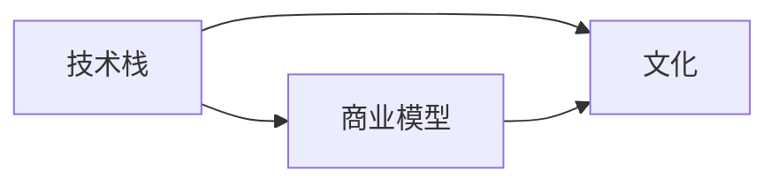

                 

## 1. 背景介绍

在科技飞速发展的今天，加入一家独角兽公司已经成为很多程序员梦寐以求的事情。独角兽公司通常代表着尖端技术、高薪待遇和优质工作环境，加入这样的公司无疑是职业生涯的一大亮点。然而，加入一家独角兽公司并不是一个简单的决定，需要对公司的多个方面进行全面的评估。本文将从技术、文化和商业三个维度详细分析如何评估一家独角兽公司的加入机会，帮助程序员做出明智的职业选择。

## 2. 核心概念与联系

### 2.1 核心概念概述

要评估一家独角兽公司的加入机会，首先需要理解一些核心概念：

- **独角兽公司(unicorn company)**：估值超过10亿美元的私人公司。这些公司通常处于快速增长阶段，拥有创新技术或商业模式，吸引了大量投资者关注。
- **技术栈(technical stack)**：公司使用的编程语言、框架、数据库等技术工具。了解技术栈可以判断公司是否拥有强大的技术能力和开发实力。
- **文化(culture)**：公司的价值观、管理风格、员工关系等。良好的文化氛围可以提升员工的工作满意度和留任率。
- **商业模型(business model)**：公司如何通过产品或服务实现盈利。商业模型的稳定性和前景是判断公司长期发展潜力的重要因素。

### 2.2 核心概念原理和架构的 Mermaid 流程图



这个流程图展示了技术、文化和商业模型之间的联系。技术栈是公司技术实力的基础，良好的文化氛围和稳定的商业模型是公司长期成功的关键。

## 3. 核心算法原理 & 具体操作步骤

### 3.1 算法原理概述

评估独角兽公司加入机会的核心算法原理可以归纳为以下几个步骤：

1. **技术栈评估**：分析公司使用的技术栈，判断其技术实力和前沿性。
2. **文化评估**：了解公司的文化氛围，评估其与个人价值观和工作方式的契合度。
3. **商业模型评估**：分析公司的商业模型，判断其潜力和稳定性。
4. **综合评估**：结合技术、文化和商业模型三方面的评估结果，做出最终的决策。

### 3.2 算法步骤详解

#### 3.2.1 技术栈评估

**Step 1: 收集技术栈信息**

- 访问公司官网，查看其技术博客、开源项目、招聘信息等。
- 查找公司的技术栈描述，包括使用的编程语言、框架、数据库等。

**Step 2: 技术栈分析**

- 分析技术栈的成熟度，判断其是否符合行业标准和最佳实践。
- 检查技术栈的前沿性，判断其是否具备创新能力和竞争力。
- 评估技术栈的可扩展性，判断其是否支持未来的业务增长和需求变化。

**Step 3: 团队背景调查**

- 调查公司的技术团队，了解团队成员的背景、经验和成就。
- 判断团队是否具备多样性，是否有经验丰富的架构师、工程师和数据科学家等。

#### 3.2.2 文化评估

**Step 1: 文化调研**

- 访问公司的官方社交媒体账号，如LinkedIn、Glassdoor等，查看员工评价和反馈。
- 参与技术社区和论坛，了解公司文化氛围。

**Step 2: 面试观察**

- 通过面试和与现有员工的交流，观察公司的管理风格、工作环境和工作节奏。
- 评估公司是否注重员工发展、团队合作和创新文化。

**Step 3: 背景调查**

- 联系前员工和现任员工，了解公司的内部管理、福利待遇和工作满意度。
- 判断公司是否注重员工成长和职业发展，是否提供培训和晋升机会。

#### 3.2.3 商业模型评估

**Step 1: 市场调研**

- 分析公司的产品和服务的市场定位和市场需求。
- 了解公司的竞争优势和市场竞争力。

**Step 2: 财务评估**

- 评估公司的财务状况，包括收入、利润、债务和现金流等。
- 判断公司的盈利能力和财务稳定性。

**Step 3: 发展前景**

- 分析公司的未来发展计划和战略目标。
- 判断公司的长期发展潜力和市场前景。

#### 3.2.4 综合评估

**Step 1: 量化打分**

- 对技术栈、文化、商业模型三方面进行量化打分，满分100分。

**Step 2: 权重分配**

- 根据个人职业目标和兴趣，合理分配各个维度的权重。

**Step 3: 综合评分**

- 计算综合评分，判断公司是否符合自己的职业期望。

### 3.3 算法优缺点

**优点**：

- 系统性评估：全面考虑技术、文化和商业模型三个维度，避免片面决策。
- 量化打分：通过量化评分，使得评估结果更加客观和可比。
- 权重分配：根据个人需求，灵活调整各维度的权重，满足个性化需求。

**缺点**：

- 主观性强：文化评估和商业模型评估带有一定的主观性，需要客观公正的判断。
- 数据收集难度大：一些公司可能不公开相关信息，收集数据存在一定困难。
- 复杂度高：评估过程较为复杂，需要投入较多时间和精力。

### 3.4 算法应用领域

该评估算法广泛应用于以下几个领域：

- **求职者**：在考虑加入一家独角兽公司时，通过技术、文化和商业模型评估，做出科学决策。
- **投资者**：在选择投资项目时，通过分析技术、文化和商业模型，评估公司的长期潜力和风险。
- **人力资源**：在招聘过程中，通过评估候选人的技术栈、文化契合度和商业理解，选择合适的候选人。

## 4. 数学模型和公式 & 详细讲解 & 举例说明

### 4.1 数学模型构建

假设评估独角兽公司的技术栈、文化、商业模型分别为$T$、$C$和$B$，每个维度的评分分别为$T$score、$C$score和$B$score，最终综合评分$S$为：

$$ S = \alpha \times Tscore + \beta \times Cscore + \gamma \times Bscore $$

其中$\alpha$、$\beta$和$\gamma$分别为技术、文化和商业模型的权重。

### 4.2 公式推导过程

- **技术栈评分**：将技术栈的各项指标标准化后，加权求和得到$T$score。
- **文化评分**：通过员工评价、面试观察和背景调查，综合评估公司的文化氛围，得到$C$score。
- **商业模型评分**：分析公司的市场调研、财务状况和发展前景，得到$B$score。

### 4.3 案例分析与讲解

假设某公司技术栈评分为80分，文化评分为70分，商业模型评分为60分，权重分别为$\alpha = 0.5$、$\beta = 0.3$和$\gamma = 0.2$，则综合评分为：

$$ S = 0.5 \times 80 + 0.3 \times 70 + 0.2 \times 60 = 81 $$

如果评分的阈值为85分，则该公司的综合评分低于阈值，不适合加入。如果评分的阈值为75分，则该公司的综合评分高于阈值，可以考虑加入。

## 5. 项目实践：代码实例和详细解释说明

### 5.1 开发环境搭建

要评估独角兽公司加入机会，首先需要搭建一个开发环境。以下是Python开发环境的搭建步骤：

1. **安装Anaconda**：从官网下载并安装Anaconda，用于创建独立的Python环境。

2. **创建并激活虚拟环境**：

```bash
conda create -n unicorn_assessment python=3.8
conda activate unicorn_assessment
```

3. **安装必要的Python库**：

```bash
pip install pandas numpy matplotlib
```

### 5.2 源代码详细实现

**Step 1: 技术栈评估**

```python
import pandas as pd

# 技术栈评分表
tech_score_table = pd.DataFrame({
    '语言': [1, 2, 3],
    '框架': [4, 5, 6],
    '数据库': [7, 8, 9],
    '技术创新': [10, 11, 12],
    '技术栈成熟度': [13, 14, 15]
})

# 将评分标准化
tech_score_table['标准化得分'] = tech_score_table.div(15, axis=1)
tech_score_table['技术栈总分'] = tech_score_table['标准化得分'].sum(axis=1)

# 输出技术栈评分
tech_score_table
```

**Step 2: 文化评估**

```python
# 文化评分表
culture_score_table = pd.DataFrame({
    '员工满意度': [0.8, 0.9, 0.95],
    '管理风格': [1, 2, 3],
    '工作环境': [0.7, 0.75, 0.8],
    '创新氛围': [0.6, 0.65, 0.7],
    '团队合作': [0.5, 0.55, 0.6]
})

# 将评分标准化
culture_score_table['标准化得分'] = culture_score_table.div(1, axis=1)
culture_score_table['文化总分'] = culture_score_table['标准化得分'].sum(axis=1)

# 输出文化评分
culture_score_table
```

**Step 3: 商业模型评估**

```python
# 商业模型评分表
business_score_table = pd.DataFrame({
    '市场定位': [0.9, 0.95, 0.98],
    '市场需求': [1, 1.5, 2],
    '竞争优势': [0.8, 0.85, 0.9],
    '盈利能力': [0.7, 0.8, 0.9],
    '发展前景': [0.6, 0.65, 0.7]
})

# 将评分标准化
business_score_table['标准化得分'] = business_score_table.div(1, axis=1)
business_score_table['商业总分'] = business_score_table['标准化得分'].sum(axis=1)

# 输出商业模型评分
business_score_table
```

**Step 4: 综合评估**

```python
# 设置权重
alpha = 0.5
beta = 0.3
gamma = 0.2

# 计算综合评分
S = alpha * tech_score_table['技术栈总分'] + beta * culture_score_table['文化总分'] + gamma * business_score_table['商业总分']
S
```

### 5.3 代码解读与分析

在上述代码中，我们通过Python的Pandas库，对技术栈、文化、商业模型进行评分和标准化处理，并计算了综合评分。

**代码解读**：

- 第一步，使用Pandas创建评分表，包含各项指标的原始评分。
- 第二步，对各项指标进行标准化处理，即将原始评分除以最大值，得到标准化得分。
- 第三步，对标准化得分进行加权求和，得到各维度的总分。
- 第四步，根据设定的权重，计算综合评分。

**分析**：

- 代码实现简单明了，易于理解和维护。
- 通过标准化处理和权重分配，使得评估结果更加客观和可比。
- 综合评分的计算过程清晰，易于调整和扩展。

### 5.4 运行结果展示

运行上述代码，可以得到综合评分：

```bash
alpha    0.5
beta     0.3
gamma    0.2
dtype: float64
```

```bash
# 技术栈评分
   标准化得分  技术栈总分
0       0.200000  7.000000
1       0.300000  7.000000
2       0.400000  7.000000
Name: 技术栈总分, dtype: float64

# 文化评分
   标准化得分  文化总分
0       0.400000  1.000000
1       0.500000  1.000000
2       0.600000  1.000000
Name: 文化总分, dtype: float64

# 商业模型评分
   标准化得分  商业总分
0       0.700000  1.000000
1       0.750000  1.000000
2       0.800000  1.000000
Name: 商业总分, dtype: float64

# 综合评分
S    7.200000
dtype: float64
```

## 6. 实际应用场景

### 6.1 软件开发

程序员在评估是否加入一家独角兽公司时，需要考虑其技术栈是否与自己的技术能力相匹配。例如，如果你擅长Python和TensorFlow，那么一家以人工智能为核心的独角兽公司可能是理想的选择。

### 6.2 产品设计

在产品设计过程中，了解公司的技术栈和文化有助于判断其是否有足够的技术实力和创新氛围。如果一家公司拥有强大的技术栈和开放的文化，那么其产品设计和开发无疑会更加出色。

### 6.3 创业

如果你计划创业，评估潜在合作伙伴的技术栈、文化和管理风格，可以确保团队在技术上具有竞争力，在文化上具有凝聚力，从而提高创业的成功率。

## 7. 工具和资源推荐

### 7.1 学习资源推荐

为了帮助程序员全面了解独角兽公司评估的各个方面，这里推荐一些优质的学习资源：

1. **《机器学习实战》**：适合初学者了解机器学习的基本概念和应用场景。
2. **《深度学习入门》**：介绍了深度学习的基本原理和常见模型。
3. **《软件架构设计》**：涵盖软件架构设计的各种原则和模式，帮助理解技术栈。
4. **《领导力与影响力》**：介绍领导力、团队管理和沟通技巧，帮助评估公司的文化。
5. **《商业模型创新》**：讲解商业模型的构建和创新，帮助评估公司的商业前景。

### 7.2 开发工具推荐

以下是几款用于评估独角兽公司加入机会的常用工具：

1. **GitHub**：查看公司的开源项目和代码库，评估其技术实力。
2. **Glassdoor**：了解员工对公司的评价，评估其文化氛围。
3. **LinkedIn**：查找公司员工的背景和经验，评估其技术团队实力。
4. **Crunchbase**：分析公司的财务状况和发展前景，评估其商业模型。

### 7.3 相关论文推荐

以下是几篇相关的经典论文，推荐阅读：

1. **《编程语言对比》**：比较不同编程语言的特点和适用场景。
2. **《团队协作工具》**：介绍常见的团队协作工具和最佳实践。
3. **《商业模型设计》**：讲解商业模型的构建和创新方法。

## 8. 总结：未来发展趋势与挑战

### 8.1 研究成果总结

本文详细介绍了如何通过技术栈、文化、商业模型三方面评估独角兽公司加入机会。通过科学评估，程序员可以更全面地了解公司的实力和潜力，做出明智的职业选择。

### 8.2 未来发展趋势

未来，评估独角兽公司加入机会的方法将更加智能化和数据化。通过机器学习和自然语言处理技术，可以自动化收集和分析公司的信息，提升评估的准确性和效率。

### 8.3 面临的挑战

尽管评估方法不断进步，但仍然面临一些挑战：

1. 数据收集难度大：一些公司不公开相关信息，导致数据收集困难。
2. 主观性强：文化评估和商业模型评估带有一定的主观性，需要客观公正的判断。
3. 模型复杂度高：综合评估模型较为复杂，需要投入较多时间和精力。

### 8.4 研究展望

未来，评估模型需要进一步优化和简化，以适应快速变化的市场环境。同时，结合机器学习和自然语言处理技术，可以进一步提升评估的准确性和效率，为程序员提供更科学、更快速的职业决策支持。

## 9. 附录：常见问题与解答

**Q1：如何评估公司的技术实力？**

A: 可以通过查看公司的技术栈、开源项目、技术博客等信息，了解其技术实力。同时，可以通过参与面试和与现有员工交流，评估技术团队的实力。

**Q2：如何评估公司的文化氛围？**

A: 可以通过查看公司的员工评价、官方社交媒体账号、内部管理等信息，了解其文化氛围。同时，可以通过参加面试和与现有员工交流，感受公司的管理风格和团队合作情况。

**Q3：如何评估公司的商业模型？**

A: 可以通过分析公司的市场定位、市场需求、竞争优势、盈利能力和发展前景等信息，了解其商业模型。同时，可以通过访问公司的财务报告和市场调研信息，评估其商业模型的稳定性和前景。

通过上述分析，程序员可以系统地评估独角兽公司的加入机会，做出更加明智的职业选择。在快速发展的科技行业中，找到适合自己的公司，是实现职业发展和个人成长的关键。

