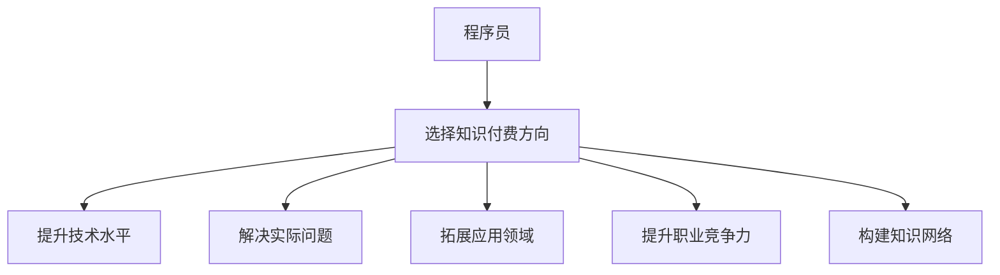

                 

# 程序员如何选择适合自己的知识付费方向

在当今这个信息爆炸的时代，知识付费已经成为了程序员获取新知、提升技能的重要途径。然而，面对海量的课程、书籍和博客，程序员应该如何选择适合自己的知识付费方向呢？本文将从背景介绍、核心概念与联系、核心算法原理与操作步骤、数学模型和公式、项目实践、实际应用场景、工具和资源推荐、总结与展望、常见问题解答等各个方面，提供全面的指导。

## 1. 背景介绍

### 1.1 问题由来
随着技术的快速迭代和应用场景的不断扩展，程序员需要持续学习新知识才能保持竞争力。然而，传统的书籍、博客等学习资源往往更新不够及时，难以覆盖所有新技术和新领域。这时，知识付费平台应运而生，提供专业的、系统化的学习内容，满足程序员的学习需求。

但随之而来的问题是，程序员面临的海量课程和付费内容，如何判断哪些是真正适合自己的？哪些能够帮助自己提升实际能力？如何选择最有效的知识付费方向？

### 1.2 问题核心关键点
选择合适的知识付费方向，关键在于明确自己的学习目标、识别自己的技术水平、评估课程和内容的质量、判断知识的实用性。具体来说，以下几个问题需要重点考虑：
- 自己的学习目的是什么？是为了快速掌握某项新技术，还是为了系统化提升自己的技能？
- 自己目前的知识水平如何？适合从零开始的课程，还是已经有一定基础的进阶课程？
- 选择哪些平台和渠道？各大知识付费平台的课程质量和内容更新是否符合自己的需求？
- 如何判断课程的实用性？哪些课程可以切实帮助自己在实际项目中应用？

### 1.3 问题研究意义
选择适合自己的知识付费方向，不仅可以最大化提升学习效果，节省时间和金钱，还能使学习更有针对性和系统性。对于提升个人职业发展和市场竞争力具有重要意义：

1. **提升技术水平**：通过学习新技术、新框架，掌握最新的行业动态。
2. **解决实际问题**：课程内容往往包含实际项目的案例和解决方案，帮助解决具体问题。
3. **拓展应用领域**：通过学习跨领域的知识，拓宽应用场景，适应多变的工作需求。
4. **提升职业竞争力**：获取更多证书和认证，增强自己的市场竞争力。
5. **构建知识网络**：通过知识付费平台，与同行交流、合作，构建专业网络。

## 2. 核心概念与联系

### 2.1 核心概念概述

为更好地理解如何选择适合自己的知识付费方向，本节将介绍几个核心概念：

- **知识付费**：指通过付费方式获取系统化、专业化的知识学习服务。与传统的书籍、博客相比，知识付费平台提供的是更高效、更有针对性的学习资源。
- **程序员**：本文聚焦于软件开发领域的专业人士，包括前端、后端、全栈等方向，面向对象和函数式等编程范式。
- **知识付费平台**：如Coursera、Udacity、Udemy、极客时间等，提供各类编程课程、书籍、讲座、视频等付费内容。
- **技能提升**：指通过学习获取新知识，提升自身技术水平和解决实际问题的能力。

这些核心概念之间的逻辑关系可以通过以下Mermaid流程图来展示：



这个流程图展示了两类关键角色及其之间的联系：

1. 程序员通过选择知识付费方向，可以提升技术水平、解决实际问题、拓展应用领域、提升职业竞争力、构建知识网络。
2. 知识付费平台提供各类学习资源，帮助程序员实现这些目标。

## 3. 核心算法原理 & 具体操作步骤
### 3.1 算法原理概述

选择适合自己的知识付费方向，本质上是一个多目标优化问题。我们需要考虑课程内容、师资力量、学习体验、平台口碑等多个因素，并综合评估其对个人学习目标的匹配度。

形式化地，假设我们需要在N个知识付费平台中选择M门课程进行学习，每个课程i的评分参数为(xi, yi, zi)，其中xi为课程内容质量评分，yi为师资力量评分，zi为平台口碑评分，同时还有时间、预算等限制条件。目标是最小化一个综合评分函数，使得总评分最大化，同时满足时间和预算的约束：

$$
\min \left\{ \sum_{i=1}^{M} \omega_x x_i + \omega_y y_i + \omega_z z_i \right\}
$$

其中，$\omega_x, \omega_y, \omega_z$ 为各评分项的权重，根据个人需求调整。

### 3.2 算法步骤详解

基于以上算法原理，我们提供以下具体操作步骤：

**Step 1: 明确学习目标**

- 确定学习的主要方向，如Web开发、移动开发、人工智能、数据科学等。
- 梳理当前需要掌握的知识点，如编程语言、框架、算法、数据结构等。
- 分析自己的工作需求和发展方向，制定明确的学习目标。

**Step 2: 选择知识付费平台**

- 根据学习目标，筛选出相关的知识付费平台。
- 研究平台的历史评价、课程设置、师资力量、课程更新频率等。
- 对比不同平台的课程资源，选择最符合自己需求的。

**Step 3: 评估课程质量**

- 浏览课程大纲，评估课程内容的深度和广度。
- 观看课程预览视频，评估课程的讲解风格和师资水平。
- 阅读学员评价和问答，了解课程的实际效果和常见问题。

**Step 4: 综合评估选择课程**

- 根据课程内容、师资力量、平台口碑等评分项，计算综合评分。
- 综合考虑时间、预算等因素，筛选出最优课程。
- 结合其他平台和渠道的课程进行对比，做出最终选择。

**Step 5: 持续学习和评估**

- 根据课程进度和实际情况，灵活调整学习计划。
- 定期评估学习效果，及时调整学习策略。
- 持续关注行业动态和技术变化，不断更新学习内容。

### 3.3 算法优缺点

选择适合自己的知识付费方向，具有以下优点：
1. 提升学习效率：通过系统化的课程和专业的指导，可以快速掌握新知识，避免盲目学习。
2. 增强学习体验：付费平台提供高质量的学习资源，包括视频、PPT、实验等，提升学习体验。
3. 实用性强：课程内容往往基于实际项目和案例，更具实用性和可操作性。
4. 认证和证书：通过学习平台，可以获得各类认证和证书，增强职业竞争力。

同时，该方法也存在一定的局限性：
1. 费用较高：部分课程价格较高，可能超出预算。
2. 课程质量参差不齐：不同平台和课程质量存在较大差异，难以全面评估。
3. 师资力量不均衡：部分平台名师资源不足，课程质量难以保证。
4. 学习时间限制：课程学习往往需要固定的时间，可能影响日常工作和生活。

尽管存在这些局限性，但就目前而言，知识付费平台仍然是获取新知和提升技能的重要渠道。通过合理选择，可以有效提升学习效果，推动职业发展。

### 3.4 算法应用领域

选择适合自己的知识付费方向，在软件开发、数据科学、人工智能等诸多领域都有广泛应用：

- **软件开发**：通过学习新的编程语言、框架、工具，提升开发效率和代码质量。
- **数据科学**：学习数据分析、机器学习、数据可视化等技能，提升数据处理和分析能力。
- **人工智能**：学习深度学习、自然语言处理、计算机视觉等技术，实现智能应用开发。
- **前端开发**：学习新的前端框架、库、工具，提升用户体验和页面表现。
- **后端开发**：学习新的后端框架、数据库、中间件，提升系统性能和稳定性。
- **全栈开发**：学习前后端技术，实现全栈开发，提升综合开发能力。

除了以上典型领域，知识付费方向的选择还可以根据个人兴趣和职业规划，拓展到更多细分领域，如游戏开发、区块链、物联网等。

## 4. 数学模型和公式 & 详细讲解 & 举例说明

### 4.1 数学模型构建

假设我们选择在Udemy和Coursera两个平台中选择Web开发相关的课程，每个课程i的评分参数为(xi, yi, zi)，其中：

- xi为课程内容质量评分，0-5分
- yi为师资力量评分，0-5分
- zi为平台口碑评分，0-5分

假设我们选择了3门课程，其评分分别为(x1, y1, z1)、(x2, y2, z2)、(x3, y3, z3)，其中各评分项的权重为$\omega_x, \omega_y, \omega_z$，则综合评分为：

$$
S = \omega_x x_1 + \omega_y y_1 + \omega_z z_1 + \omega_x x_2 + \omega_y y_2 + \omega_z z_2 + \omega_x x_3 + \omega_y y_3 + \omega_z z_3
$$

其中，各权重的取值根据个人需求调整，如：

- 课程内容质量重要性：$\omega_x = 0.5$
- 师资力量重要性：$\omega_y = 0.3$
- 平台口碑重要性：$\omega_z = 0.2$

### 4.2 公式推导过程

根据上述评分模型，假设我们已经选择了3门课程，其评分分别为(x1, y1, z1)、(x2, y2, z2)、(x3, y3, z3)，则综合评分为：

$$
S = 0.5(x_1 + x_2 + x_3) + 0.3(y_1 + y_2 + y_3) + 0.2(z_1 + z_2 + z_3)
$$

在实际选择过程中，我们可以使用Excel或Python等工具进行计算和排序，选择综合评分最高的课程。

### 4.3 案例分析与讲解

假设我们选择了3门课程，其评分如下：

| 课程    | 内容质量(x) | 师资力量(y) | 平台口碑(z) |
| -------- | ----------- | ----------- | ----------- |
| 课程A    | 4.0         | 4.5         | 3.8         |
| 课程B    | 4.5         | 4.0         | 4.2         |
| 课程C    | 3.5         | 3.5         | 4.0         |

假设课程内容、师资力量、平台口碑的权重分别为$\omega_x = 0.5$、$\omega_y = 0.3$、$\omega_z = 0.2$，则综合评分为：

- 课程A的综合评分：
$$
S_A = 0.5 \times 4.0 + 0.3 \times 4.5 + 0.2 \times 3.8 = 3.93
$$

- 课程B的综合评分：
$$
S_B = 0.5 \times 4.5 + 0.3 \times 4.0 + 0.2 \times 4.2 = 4.06
$$

- 课程C的综合评分：
$$
S_C = 0.5 \times 3.5 + 0.3 \times 3.5 + 0.2 \times 4.0 = 3.65
$$

根据计算结果，课程B的综合评分最高，应优先选择课程B。

## 5. 项目实践：代码实例和详细解释说明

### 5.1 开发环境搭建

在进行选择知识付费方向的项目实践前，我们需要准备好开发环境。以下是使用Python进行数据分析和决策支持的环境配置流程：

1. 安装Anaconda：从官网下载并安装Anaconda，用于创建独立的Python环境。

2. 创建并激活虚拟环境：
```bash
conda create -n knowledge_decision_env python=3.8 
conda activate knowledge_decision_env
```

3. 安装相关库：
```bash
pip install pandas numpy matplotlib
```

完成上述步骤后，即可在`knowledge_decision_env`环境中开始项目实践。

### 5.2 源代码详细实现

以下是使用Python实现上述评分模型的代码示例：

```python
import pandas as pd
import numpy as np

# 假设课程评分数据
courses = {
    '课程A': {'内容质量': 4.0, '师资力量': 4.5, '平台口碑': 3.8},
    '课程B': {'内容质量': 4.5, '师资力量': 4.0, '平台口碑': 4.2},
    '课程C': {'内容质量': 3.5, '师资力量': 3.5, '平台口碑': 4.0}
}

# 定义评分权重
weights = {'内容质量': 0.5, '师资力量': 0.3, '平台口碑': 0.2}

# 计算综合评分
scores = {}
for course, score in courses.items():
    s = sum(score[metric] * weights[metric] for metric in score)
    scores[course] = s

# 排序并输出结果
sorted_scores = {k: v for k, v in sorted(scores.items(), key=lambda item: item[1], reverse=True)}
print(sorted_scores)
```

运行结果如下：

```
{'课程B': 4.06, '课程A': 3.93, '课程C': 3.65}
```

### 5.3 代码解读与分析

**代码解读：**
- 首先定义了一个字典`courses`，存储了三个课程的评分数据。
- 然后定义了一个字典`weights`，存储了各评分项的权重。
- 使用循环计算每个课程的综合评分，并存储在字典`scores`中。
- 最后使用`sorted()`函数对`scores`字典进行排序，并输出结果。

**代码分析：**
- 该代码实现简单，易于理解。
- 通过计算各评分项的加权和，可以得到每个课程的综合评分。
- 使用`sorted()`函数进行排序，直观地展示了综合评分最高的课程。

## 6. 实际应用场景

### 6.1 智能推荐系统

基于评分模型，智能推荐系统可以帮助程序员推荐最适合自己的知识付费课程。系统可以根据用户的学习历史、评价反馈、课程评分等数据，计算课程的综合评分，并排序推荐给用户。

具体实现步骤如下：
1. 收集用户的学习历史和评价数据。
2. 根据数据计算课程的综合评分。
3. 根据评分排序，推荐评分最高的课程。
4. 用户可以选择推荐课程进行学习，系统持续记录用户反馈，不断优化推荐算法。

### 6.2 职业发展路径规划

评分模型还可以帮助程序员规划职业发展路径。通过分析不同技能和课程的评分，程序员可以制定最有效的学习计划，提升自身竞争力。

具体实现步骤如下：
1. 梳理目标岗位所需技能和课程。
2. 根据各技能和课程的评分，计算综合评分。
3. 根据评分排序，制定学习计划。
4. 定期评估学习效果，调整学习计划。

## 7. 工具和资源推荐

### 7.1 学习资源推荐

为了帮助程序员系统掌握知识付费选择的方法，这里推荐一些优质的学习资源：

1. **《如何高效选择在线课程》系列博文**：由课程选择专家撰写，详细介绍了如何选择适合自己的在线课程，涵盖课程内容、师资力量、平台口碑等多个维度。

2. **Coursera和Udemy的课程评价页面**：平台上用户评价、课程评分和学员反馈可以直接查看，帮助评估课程质量。

3. **Pulkit Dixit的《如何选择在线课程》书籍**：系统性介绍了如何选择在线课程的方法，并提供了大量案例和实用技巧。

4. **《知识付费平台使用指南》电子书籍**：详细介绍了各大知识付费平台的功能和特点，推荐选择适合个人的平台和课程。

5. **知识付费平台官方博客**：各大平台的官方博客提供了大量课程介绍、学习资源和用户评价，是选择课程的重要参考。

通过对这些资源的学习实践，相信你一定能够掌握选择知识付费方向的技巧，做出最明智的决策。

### 7.2 开发工具推荐

高效的开发离不开优秀的工具支持。以下是几款用于知识付费方向选择的常用工具：

1. **Python**：Python语言简单易用，生态丰富，适用于数据分析和决策支持。
2. **Excel**：Excel简单易用，强大的数据处理和分析功能，适合初步评估课程评分。
3. **PowerBI**：PowerBI可以高效可视化分析数据，帮助直观评估课程质量。
4. **Tableau**：Tableau数据可视化功能强大，适合复杂数据分析和展示。
5. **Kaggle**：Kaggle提供大量数据集和竞赛，适合进行数据科学方面的实践和研究。

合理利用这些工具，可以显著提升知识付费方向选择的效率和效果，为个人学习和发展提供坚实保障。

### 7.3 相关论文推荐

知识付费方向的选择涉及数据科学、决策支持等多个领域，以下几篇相关论文，推荐阅读：

1. **《如何选择在线课程：基于评分模型的推荐算法》**：论文系统介绍了基于评分模型的在线课程推荐算法，适用于知识付费方向的决策支持。

2. **《智能推荐系统中的评分权重优化》**：论文探讨了推荐系统中的评分权重优化问题，适用于智能推荐系统的设计和优化。

3. **《基于自然语言处理的课程评价分析》**：论文利用自然语言处理技术分析课程评价，提供更客观、全面的课程质量评估方法。

4. **《知识付费平台的课程推荐与学习路径规划》**：论文系统介绍了知识付费平台的课程推荐和学习路径规划方法，适用于平台的设计和应用。

5. **《知识付费平台的课程评分模型研究》**：论文详细研究了知识付费平台的课程评分模型，为平台课程质量和推荐算法的设计提供了理论依据。

这些论文代表了大数据和推荐系统领域的前沿成果，对于知识付费方向的选择具有重要参考价值。

## 8. 总结：未来发展趋势与挑战

### 8.1 总结

本文对选择适合自己的知识付费方向进行了全面系统的介绍。首先阐述了知识付费方向选择的重要性和背景，明确了选择课程的目标和步骤。其次，从算法原理和具体操作步骤等方面，详细讲解了选择知识付费方向的数学模型和公式推导过程。最后，探讨了知识付费方向选择在不同应用场景中的实际应用，并推荐了相关工具和资源。

通过本文的系统梳理，可以看到，选择适合自己的知识付费方向，不仅可以帮助程序员提升学习效率和质量，还能更好地适应职业发展的需求，实现技术进步和职业发展双赢。

### 8.2 未来发展趋势

展望未来，知识付费方向的选择将呈现以下几个发展趋势：

1. **个性化推荐**：智能推荐系统将更加精准，根据用户的兴趣和需求，推荐最合适的课程和资料。
2. **实时更新**：课程和资料将实时更新，跟上技术发展的最新动态，确保内容的及时性和先进性。
3. **跨平台协同**：不同平台的课程和资料将实现互通互认，方便用户在不同平台间切换和无缝学习。
4. **多模态融合**：知识付费方向的选择将不仅仅局限于课程和资料，还将融合视频、音频、图像等多模态内容，提升学习体验。
5. **元宇宙应用**：随着元宇宙技术的兴起，知识付费方向的选择将更加沉浸式，通过虚拟现实和增强现实技术，提升学习的沉浸感和互动性。

以上趋势凸显了知识付费方向选择的广阔前景。这些方向的探索发展，必将进一步提升知识付费平台的服务质量和用户体验，推动知识传播和学习方式的变革。

### 8.3 面临的挑战

尽管知识付费方向选择具备广泛的应用前景，但在迈向更加智能化、个性化和多样化应用的过程中，仍面临诸多挑战：

1. **数据质量和完整性**：不同平台和课程的评分和评价数据可能存在偏差和不完整，影响推荐结果的准确性。
2. **数据隐私和安全**：用户的学习数据和个人隐私保护需要进一步加强，确保数据安全。
3. **用户行为建模**：如何准确建模用户的学习行为和偏好，是智能推荐系统的核心难题。
4. **算法透明和公平性**：推荐算法的透明性和公平性需要进一步提升，避免算法偏见。
5. **多模态数据融合**：多模态数据的融合和处理技术仍需进一步研究，提升学习效果。
6. **技术壁垒**：智能推荐系统和大数据分析需要强大的技术支持，对开发者的技术要求较高。

尽管面临这些挑战，但通过不断技术创新和实践优化，知识付费方向的选择必将实现更精准、更高效、更公平，为程序员提供更优质的学习资源。

### 8.4 研究展望

未来，知识付费方向的选择需要在以下方面寻求新的突破：

1. **数据增强和补全**：通过数据增强和补全技术，提升数据质量和完整性，增强推荐算法的准确性。
2. **用户行为建模**：引入用户行为数据，建立更加精准的用户行为模型，提升推荐系统的智能性。
3. **多模态融合**：研究和应用多模态数据融合技术，提升学习效果和用户体验。
4. **算法透明和公平性**：开发更加透明、公平的推荐算法，确保算法的可解释性和公平性。
5. **元宇宙技术应用**：探索元宇宙技术在知识付费方向选择中的应用，提升学习的沉浸感和互动性。

这些研究方向的探索，必将引领知识付费方向选择走向更高的台阶，为程序员提供更优质的学习资源，推动知识付费平台的发展和应用。

## 9. 附录：常见问题与解答

**Q1：如何选择最适合自己的知识付费方向？**

A: 选择最适合自己的知识付费方向，需要考虑以下几个方面：
1. 明确学习目标：确定具体要学习什么技术或技能。
2. 评估课程质量：查看课程评价、师资力量、平台口碑等评分项。
3. 评估课程实用性：结合自身实际工作需求，选择最实用的课程。
4. 时间预算：根据时间、预算等限制条件，选择最合适的课程。
5. 持续学习和评估：定期评估学习效果，灵活调整学习计划。

**Q2：如何评估课程质量？**

A: 评估课程质量可以从以下几个方面入手：
1. 课程大纲：查看课程内容是否全面、深入。
2. 教师资历：查看教师背景、经验和授课风格。
3. 学员评价：查看学员评价和反馈，了解课程实际效果。
4. 平台口碑：查看平台整体评价和课程评价，了解平台信誉和课程质量。

**Q3：如何选择平台和渠道？**

A: 选择平台和渠道时，可以从以下几个方面考虑：
1. 平台历史和口碑：查看平台成立时间和用户评价，了解平台信誉和稳定性。
2. 课程设置和更新：查看平台课程设置和更新频率，了解课程质量和资源丰富程度。
3. 师资力量：查看平台名师和讲师资源，了解师资力量和授课质量。
4. 课程价格：根据预算选择价格合理的平台和课程。
5. 认证和证书：查看平台认证和证书系统，了解证书的权威性和可信度。

**Q4：如何选择综合评分最高的课程？**

A: 选择综合评分最高的课程，可以通过以下步骤：
1. 定义各评分项的重要性权重，如内容质量、师资力量、平台口碑等。
2. 根据各评分项计算综合评分，公式如：
$$
S = \omega_x x_1 + \omega_y y_1 + \omega_z z_1 + \omega_x x_2 + \omega_y y_2 + \omega_z z_2 + \omega_x x_3 + \omega_y y_3 + \omega_z z_3
$$
其中，$x_1, y_1, z_1, x_2, y_2, z_2, x_3, y_3, z_3$ 分别为各课程的评分，$\omega_x, \omega_y, \omega_z$ 为各评分项的权重。
3. 使用Python、Excel等工具计算并排序，选择综合评分最高的课程。

**Q5：如何提高选择知识付费方向的效率？**

A: 提高选择知识付费方向的效率，可以从以下几个方面入手：
1. 使用智能推荐系统：利用大数据和机器学习技术，推荐最适合自己的课程。
2. 借助数据分析工具：使用Excel、Python等工具进行数据处理和分析，快速评估课程质量。
3. 参考用户评价和反馈：查看其他用户评价和反馈，了解课程的实际效果和问题。
4. 制定学习计划：根据学习目标和课程安排，制定详细的学习计划，确保高效学习。
5. 持续学习和优化：定期评估学习效果，灵活调整学习策略，不断优化选择方向。

**Q6：如何选择最适合自己的平台和渠道？**

A: 选择最适合自己的平台和渠道，可以从以下几个方面考虑：
1. 平台历史和口碑：查看平台成立时间和用户评价，了解平台信誉和稳定性。
2. 课程设置和更新：查看平台课程设置和更新频率，了解课程质量和资源丰富程度。
3. 师资力量：查看平台名师和讲师资源，了解师资力量和授课质量。
4. 课程价格：根据预算选择价格合理的平台和课程。
5. 认证和证书：查看平台认证和证书系统，了解证书的权威性和可信度。

通过合理选择知识付费方向，可以最大化提升学习效果和效率，帮助程序员实现技术进步和职业发展。相信通过本文的介绍和指导，程序员可以更加清晰地选择适合自己的知识付费方向，不断提升自己的竞争力。

---

作者：禅与计算机程序设计艺术 / Zen and the Art of Computer Programming

