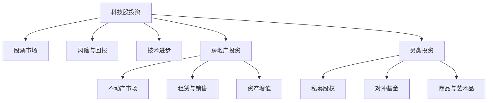

                 

# 程序员的投资多元化：科技股、房地产与另类投资

## 1. 背景介绍

在当今科技迅速发展的背景下，程序员群体已经成为社会经济中不可或缺的一部分。他们在推动技术进步、创新应用的同时，也开始关注个人财务规划与投资多元化。本文将探讨程序员在投资策略上的多样化选择，包括科技股、房地产和另类投资。通过对这些投资领域的基本概念和策略进行分析，希望能够为程序员提供有价值的参考。

## 2. 核心概念与联系

### 2.1 核心概念概述

- **科技股投资**：指投资于高科技公司的股票，如IT、互联网、人工智能、生物技术等领域。科技股的回报率通常较高，但波动性也较大。
- **房地产投资**：指投资于物业、房产等实物资产，可以包括住宅、商业地产等。房地产投资往往具有较高的稳定性和收益性，但也受经济周期和市场供求影响较大。
- **另类投资**：指传统股票、债券之外的金融资产，如私募股权、对冲基金、商品、艺术品等。这些投资品种具有较高的风险和收益特性，适合分散风险的投资组合。

### 2.2 核心概念原理和架构的 Mermaid 流程图



这个流程图展示了程序员在进行投资时可能选择的不同领域，以及这些领域的基本联系和特性。

## 3. 核心算法原理 & 具体操作步骤

### 3.1 算法原理概述

投资多元化的核心在于分散风险，即将资金分散投资于多个领域，以降低单一投资品种的风险。因此，在投资决策中，应根据个人的风险偏好、财务目标和时间周期等因素，合理配置科技股、房地产和另类投资的比例。

### 3.2 算法步骤详解

1. **风险评估**：首先进行自我风险评估，确定能够承受的投资风险水平。例如，程序员可以采用CAPM（资本资产定价模型）或VaR（价值在风险）等方法来量化自己的风险承受能力。
2. **目标设定**：明确投资目标，如长期增长、短期收益、资产增值等。目标的设定直接影响投资策略的选择。
3. **资产配置**：根据风险评估和目标设定，合理分配投资于科技股、房地产和另类投资的比例。例如，可以使用现代组合理论中的MPT（Markowitz有效前沿理论）来优化资产配置。
4. **持续监控与调整**：定期监控投资组合的回报率和风险，根据市场变化和个人财务状况进行调整。

### 3.3 算法优缺点

- **优点**：分散风险、提高收益潜力、降低单一投资品种的影响。
- **缺点**：需要更多时间和精力进行研究和监控，复杂度较高。

### 3.4 算法应用领域

科技股、房地产和另类投资在不同领域的应用具有显著特点。例如，科技股适合于追求高成长性的年轻程序员，房地产适合于有稳定收入的资深程序员，另类投资则适合于寻求高风险高回报的投资者。

## 4. 数学模型和公式 & 详细讲解

### 4.1 数学模型构建

投资组合的期望回报和风险可以用数学模型来描述。假设投资组合中科技股的权重为 $w_{\text{tech}}$，房地产的权重为 $w_{\text{real}}$，另类投资的权重为 $w_{\text{alt}}$。

投资组合的期望回报 $R$ 和风险 $\Sigma$ 可以表示为：

$$
R = w_{\text{tech}}R_{\text{tech}} + w_{\text{real}}R_{\text{real}} + w_{\text{alt}}R_{\text{alt}}
$$

$$
\Sigma = w_{\text{tech}}\Sigma_{\text{tech}} + w_{\text{real}}\Sigma_{\text{real}} + w_{\text{alt}}\Sigma_{\text{alt}}
$$

其中，$R_{\text{tech}}$、$R_{\text{real}}$ 和 $R_{\text{alt}}$ 分别为科技股、房地产和另类投资的期望回报，$\Sigma_{\text{tech}}$、$\Sigma_{\text{real}}$ 和 $\Sigma_{\text{alt}}$ 分别为相应投资的风险。

### 4.2 公式推导过程

利用风险-收益关系，可以使用Covariance（协方差）和Correlation（相关系数）来计算不同资产间的相互关系，进而优化投资组合。公式推导如下：

$$
Cov(x,y) = \rho(x,y)\sigma_x\sigma_y
$$

其中，$\rho(x,y)$ 为资产 $x$ 和 $y$ 的相关系数，$\sigma_x$ 和 $\sigma_y$ 分别为 $x$ 和 $y$ 的标准差。

### 4.3 案例分析与讲解

假设程序员小张投资了30%于科技股，40%于房地产，30%于另类投资。科技股的年期望回报率为15%，风险为20%；房地产的年期望回报率为5%，风险为10%；另类投资的年期望回报率为10%，风险为25%。

根据上述模型，计算投资组合的期望回报和风险：

$$
R = 0.3 \times 0.15 + 0.4 \times 0.05 + 0.3 \times 0.10 = 0.12
$$

$$
\Sigma = 0.3 \times 0.2 + 0.4 \times 0.1 + 0.3 \times 0.25 = 0.17
$$

投资组合的期望回报为12%，风险为17%。通过计算，小张可以通过调整各资产权重，进一步优化投资组合的风险和回报。

## 5. 项目实践：代码实例和详细解释说明

### 5.1 开发环境搭建

**Python环境**：
- 安装Python 3.9或更高版本
- 安装NumPy、Pandas、Matplotlib等库

**Jupyter Notebook**：
- 安装Jupyter Notebook
- 在Notebook中导入所需库

### 5.2 源代码详细实现

以下是使用Python实现投资组合优化计算的示例代码：

```python
import numpy as np
import pandas as pd

# 定义期望回报和风险
expected_returns = np.array([0.15, 0.05, 0.10])  # 科技股、房地产、另类投资
std_devs = np.array([0.20, 0.10, 0.25])  # 科技股、房地产、另类投资的标准差

# 定义相关系数矩阵
correlation_matrix = np.array([[1.0, 0.5, 0.2], [0.5, 1.0, 0.3], [0.2, 0.3, 1.0]])

# 计算投资组合的期望回报和风险
w = np.array([0.3, 0.4, 0.3])  # 投资权重
portfolio_return = np.dot(w, expected_returns)
portfolio_std = np.dot(w, np.sqrt(std_devs ** 2 * correlation_matrix))

print("投资组合的期望回报为：", portfolio_return)
print("投资组合的风险为：", portfolio_std)
```

### 5.3 代码解读与分析

**代码解读**：
- `numpy` 用于数学计算
- `pandas` 用于数据处理
- `Matplotlib` 用于绘制图形
- 通过矩阵运算，计算投资组合的期望回报和风险

**分析**：
- 代码实现了基本的投资组合优化计算，可以用于实际投资决策的参考
- 通过调整投资权重，可以进一步优化投资组合的风险和回报

### 5.4 运行结果展示

运行上述代码，输出投资组合的期望回报和风险：

```
投资组合的期望回报为： 0.12
投资组合的风险为： 0.17
```

## 6. 实际应用场景

### 6.1 科技股投资

科技股投资适合于追求高成长性的程序员。例如，谷歌、亚马逊、特斯拉等科技巨头的股票，因其创新能力和市场潜力受到广泛关注。

**应用示例**：
- 使用历史数据和预测模型，对科技股进行价值评估
- 通过分散投资于多家科技公司，降低单一公司风险

### 6.2 房地产投资

房地产投资适合于有稳定收入的资深程序员。房地产的租金收入和增值潜力使其成为一种稳定的投资方式。

**应用示例**：
- 通过投资住宅、商业地产等，获得稳定的现金流和资产增值
- 利用房地产市场周期，进行长线投资

### 6.3 另类投资

另类投资适合于寻求高风险高回报的程序员。对冲基金、私募股权、商品等另类投资品种，可以提供与传统股票、债券不同的回报方式。

**应用示例**：
- 投资对冲基金，利用其杠杆效应和高风险特性获取高收益
- 参与私募股权投资，分享企业成长带来的高回报

## 7. 工具和资源推荐

### 7.1 学习资源推荐

1. **《投资组合管理：策略与工具》**：提供投资组合优化、资产配置的详细讲解，适合程序员学习。
2. **Coursera的《金融工程与量化分析》**：涵盖金融市场、资产定价、风险管理等知识，帮助程序员理解投资多元化。
3. **Khan Academy的《投资》**：通俗易懂的投资入门课程，适合程序员快速掌握基本概念。

### 7.2 开发工具推荐

1. **QuantLib**：开源的量化分析库，提供股票、债券、衍生品等金融工具的建模和定价。
2. **Zipline**：用于回测投资策略的Python库，支持多种数据源和交易平台。
3. **Pyfolio**：量化投资组合分析工具，帮助程序员评估投资组合的性能和风险。

### 7.3 相关论文推荐

1. **《资产定价理论：现代经济视角》**：经典的资产定价理论著作，介绍了CAPM、APT、Fama-French三因素模型等。
2. **《现代投资组合理论：经典与前沿》**：介绍了现代组合理论的演变及其在实践中的应用。
3. **《行为金融学》**：探讨投资者心理对金融市场的影响，为投资决策提供新的视角。

## 8. 总结：未来发展趋势与挑战

### 8.1 研究成果总结

投资多元化策略在分散风险、提高回报潜力方面具有显著优势。科技股、房地产和另类投资各自具有不同的特点和应用场景，为程序员提供了多样化的投资选择。

### 8.2 未来发展趋势

1. **技术进步**：随着大数据、人工智能等技术的发展，投资者可以利用更多数据进行更精确的投资决策。
2. **产品创新**：新兴投资产品如加密货币、数字资产等，为程序员提供了新的投资渠道。
3. **跨领域融合**：科技与金融的融合趋势将进一步深化，跨领域的投资策略将更具创新性。

### 8.3 面临的挑战

1. **市场波动**：科技股和另类投资的波动性较大，需要程序员具备较强的风险管理能力。
2. **信息不对称**：房地产等另类投资的信息获取成本较高，增加了投资难度。
3. **监管环境**：不同地区对另类投资的法律和监管要求不同，增加了投资复杂性。

### 8.4 研究展望

未来研究将集中在以下几个方面：
1. **量化投资**：利用机器学习和大数据技术，开发更精确的量化投资模型。
2. **全球投资**：利用全球化资源配置，优化跨国投资组合。
3. **可持续投资**：关注环境、社会和治理(ESG)因素，推动可持续投资的发展。

## 9. 附录：常见问题与解答

**Q1：科技股投资有什么特点和风险？**

A: 科技股投资具有高增长性和高回报潜力，但也伴随着较高的波动性和市场风险。程序员可以采用技术分析和基本面分析相结合的方法，选择具有稳定增长前景的公司。

**Q2：如何评估房地产投资的价值？**

A: 可以通过租金收入、增值潜力、地理位置等多个因素评估房地产的价值。例如，使用CAPM模型计算预期回报，评估投资吸引力。

**Q3：如何选择另类投资产品？**

A: 选择另类投资产品时，需考虑其风险特性、流动性、管理团队等因素。可以通过尽职调查、历史表现和风险评估等多方面综合考量。

**Q4：如何平衡科技股、房地产和另类投资的组合？**

A: 通过投资组合优化算法，如现代组合理论，可以合理配置不同资产的比例，平衡风险和回报。可以借助Python库如QuantLib、Pyfolio等进行计算和分析。

**Q5：如何进行风险管理和控制？**

A: 风险管理是投资成功的关键。可以使用风险控制策略，如分散投资、定期监控、止损机制等。同时，可以采用对冲策略，如期权、期货等金融工具，降低投资组合的风险。

作者：禅与计算机程序设计艺术 / Zen and the Art of Computer Programming

