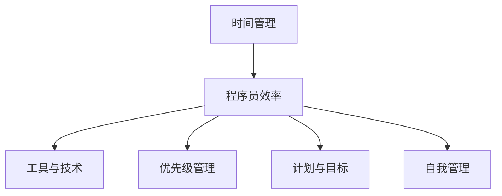

                 

# 程序员的时间管理：效率即财富

> 关键词：时间管理, 程序员效率, 工具, 优先级, 计划, 目标, 自我管理

## 1. 背景介绍

在快速发展的信息时代，技术的更新迭代速度不断加快，程序员们面临着前所未有的工作压力和挑战。如何在有限的时间内高效地完成工作，提升个人和团队的工作效率，成为程序员必须掌握的重要技能。本文将从时间管理的角度出发，探讨如何利用高效的时间管理，让程序员在有限的时间内创造更多价值。

## 2. 核心概念与联系

### 2.1 核心概念概述

为了更好地理解时间管理和效率提升的核心理念，本节将介绍几个密切相关的核心概念：

- **时间管理**：指对时间资源进行合理安排和有效利用，以达到预定的工作目标和方法。包括任务规划、时间分配、优先级排序、工作时间管理等内容。
- **程序员效率**：指程序员在单位时间内完成工作任务的能力。高效率不仅意味着任务完成得更快，还意味着工作质量更高、工作压力更小。
- **工具与技术**：指各种辅助时间管理的工具和技术，如时间跟踪软件、任务管理工具、自动化工具等。
- **优先级管理**：指根据任务的重要性和紧急程度，合理分配工作时间和资源，确保重要任务优先完成。
- **计划与目标**：指制定详细的任务计划和目标，帮助程序员更好地掌握工作进展，确保任务按时完成。
- **自我管理**：指通过自我反思、自我激励等方式，提升个人的工作积极性和自我驱动能力。

这些核心概念之间的逻辑关系可以通过以下Mermaid流程图来展示：



这个流程图展示出时间管理和效率提升的关系及其核心要素：

1. 时间管理是提升程序员效率的基础。
2. 工具和技术是提升效率的重要手段。
3. 优先级管理是时间管理的关键。
4. 计划和目标是提升效率的指南。
5. 自我管理是提升效率的内在动力。

## 3. 核心算法原理 & 具体操作步骤
### 3.1 算法原理概述

程序员的时间管理通常采用基于目标和优先级的任务管理方法，其核心原理是通过合理安排时间和资源，确保最重要和最紧急的任务优先完成。具体步骤如下：

1. **任务清单与优先级排序**：列出所有待办任务，并根据其重要性和紧急程度进行优先级排序。
2. **时间块划分**：将一天的时间划分为若干时间块，每个时间块专门用于处理特定类型任务。
3. **任务分配与执行**：按照优先级顺序，将任务分配到相应的时间块中，并集中精力完成。
4. **时间跟踪与反馈**：使用时间跟踪工具记录任务执行时间，并根据反馈调整计划和优先级。

### 3.2 算法步骤详解

#### 3.2.1 任务清单与优先级排序

- **列出所有任务**：将每日任务详细列出，包括编程、调试、测试、文档撰写等。
- **评估任务优先级**：使用任务矩阵（重要-紧急矩阵）或四象限法，将任务分为四类：重要且紧急、重要但不紧急、紧急但不重要、不紧急也不重要。
- **优先处理重要任务**：优先处理重要且紧急的任务，确保最关键的任务按时完成。

#### 3.2.2 时间块划分

- **全天时间划分**：将一天划分为若干时间块，如上午9:00-12:00、下午2:00-5:00等。
- **确定任务类型**：为每个时间块指定特定类型的任务，如上午9:00-12:00专门处理编程任务，下午2:00-3:00进行代码审查。
- **避免连续任务**：尽量避免同一类型的连续任务，以免疲劳和单调。

#### 3.2.3 任务分配与执行

- **按照优先级执行任务**：按照优先级顺序，将任务安排到相应的时间块中。
- **集中精力完成任务**：在每个时间块内，关闭干扰源，集中精力完成任务。
- **及时反馈与调整**：根据任务完成情况，及时调整时间块安排和优先级。

#### 3.2.4 时间跟踪与反馈

- **使用时间跟踪工具**：如RescueTime、Toggl等，记录每个任务的执行时间和效果。
- **分析任务时间**：分析任务完成时间和效率，找出瓶颈和改进点。
- **调整计划与优先级**：根据分析结果，调整时间块安排和任务优先级，优化时间管理。

### 3.3 算法优缺点

基于目标和优先级的时间管理方法具有以下优点：
1. **高效安排时间**：通过合理分配时间，确保最重要和最紧急的任务优先完成。
2. **提升工作效率**：集中精力处理特定类型的任务，避免分散注意力，提升工作效率。
3. **灵活应对变化**：根据任务执行情况及时调整计划，适应新的工作需求。

同时，该方法也存在一定的局限性：
1. **依赖自我约束**：时间管理的效果很大程度上依赖于个人的自律和执行能力。
2. **需要持续调整**：工作环境和任务需求不断变化，需要持续优化时间管理计划。
3. **可能忽略长期任务**：过于关注短期任务，可能会忽视长期项目的进展。
4. **不适合高变动性工作**：对于高变动性的工作，如紧急问题解决，可能需要灵活调整，不适合严格的时间块划分。

尽管存在这些局限性，但就目前而言，基于目标和优先级的时间管理方法仍是大多数程序员的首选。未来相关研究的重点在于如何进一步提升时间管理的自动化水平，以及如何将时间管理与更高级的决策支持系统结合，以提高工作效率和决策质量。

### 3.4 算法应用领域

基于目标和优先级的时间管理方法，在软件开发、项目管理、团队协作等领域都有广泛的应用，能够显著提升团队的协同效率和工作效果。

1. **软件开发**：对于软件开发任务，时间管理可以帮助程序员合理规划开发进度，确保关键功能按时交付。
2. **项目管理**：项目经理可以通过时间管理工具，合理安排项目任务和资源，确保项目按时完成。
3. **团队协作**：团队成员通过时间管理工具，了解各自的任务进展和优先级，提升团队的协作效率。

## 4. 数学模型和公式 & 详细讲解 & 举例说明
### 4.1 数学模型构建

本节将使用数学语言对时间管理和效率提升的模型进行更加严格的刻画。

假设程序员一天的工作时间为$T$小时，每个任务的时间需求为$D_i$（小时），任务的重要性和紧急程度分别为$I_i$和$E_i$（1-5），任务完成的优先级$P_i$可以表示为：

$$
P_i = \frac{I_i \times E_i}{10}
$$

其中$I_i$和$E_i$的取值范围为1-5，表示任务的重要性和紧急程度，$P_i$的取值范围为0-5，表示任务的优先级。

**总时间模型**：设每天工作时间为$T$小时，任务总时间需求为$D$小时，总任务数为$N$，则总时间模型的数学表达式为：

$$
D = \sum_{i=1}^{N} P_i \times D_i
$$

### 4.2 公式推导过程

将优先级公式代入总时间模型，得：

$$
D = \sum_{i=1}^{N} \frac{I_i \times E_i}{10} \times D_i
$$

假设$I_i$和$E_i$的期望值分别为$\mathbb{E}[I_i]$和$\mathbb{E}[E_i]$，则总时间模型的期望值可以表示为：

$$
\mathbb{E}[D] = \sum_{i=1}^{N} \frac{\mathbb{E}[I_i] \times \mathbb{E}[E_i]}{10} \times D_i
$$

### 4.3 案例分析与讲解

假设一个程序员一天的工作时间为8小时，有10个任务需要完成，每个任务的时间需求和重要-紧急程度如下：

| 任务编号 | 时间需求（小时） | 重要性（1-5） | 紧急程度（1-5） |
|----------|-----------------|--------------|----------------|
| 1        | 2               | 5            | 5              |
| 2        | 1               | 4            | 4              |
| 3        | 3               | 3            | 3              |
| 4        | 4               | 2            | 2              |
| 5        | 5               | 1            | 5              |
| 6        | 2               | 5            | 4              |
| 7        | 1               | 4            | 3              |
| 8        | 3               | 3            | 5              |
| 9        | 4               | 2            | 4              |
| 10       | 5               | 1            | 4              |

计算每个任务的优先级$P_i$，并按照优先级排序，结果如下：

| 任务编号 | 时间需求（小时） | 重要性（1-5） | 紧急程度（1-5） | 优先级（0-5） | 排序 |
|----------|-----------------|--------------|----------------|--------------|------|
| 1        | 2               | 5            | 5              | 5            | 1    |
| 2        | 1               | 4            | 4              | 4            | 2    |
| 3        | 3               | 3            | 3              | 3            | 3    |
| 4        | 4               | 2            | 2              | 2            | 4    |
| 6        | 2               | 5            | 4              | 2.5          | 5    |
| 8        | 3               | 3            | 5              | 1.5          | 6    |
| 7        | 1               | 4            | 3              | 1.2          | 7    |
| 9        | 4               | 2            | 4              | 0.8          | 8    |
| 10       | 5               | 1            | 4              | 0.4          | 9    |

按照优先级排序，任务1和任务2需要优先完成，任务8和任务10则可以延后。根据实际工作情况，安排相应的工作时间块，如下：

| 时间块 | 任务编号 | 时间需求（小时） | 优先级（0-5） |
|--------|----------|-----------------|--------------|
| 9:00-12:00 | 1, 2     | 3               | 4            |
| 1:00-3:00 | 3        | 3               | 3            |
| 3:00-5:00 | 6, 8, 9   | 7               | 1            |
| 5:00-8:00 | 7, 10    | 6               | 0.2          |

在实际工作中，根据时间跟踪工具的反馈，及时调整时间块安排和优先级，以确保高效完成任务。

## 5. 项目实践：代码实例和详细解释说明
### 5.1 开发环境搭建

在进行时间管理实践前，我们需要准备好开发环境。以下是使用Python进行PyTorch开发的环境配置流程：

1. 安装Anaconda：从官网下载并安装Anaconda，用于创建独立的Python环境。

2. 创建并激活虚拟环境：
```bash
conda create -n pytorch-env python=3.8 
conda activate pytorch-env
```

3. 安装PyTorch：根据CUDA版本，从官网获取对应的安装命令。例如：
```bash
conda install pytorch torchvision torchaudio cudatoolkit=11.1 -c pytorch -c conda-forge
```

4. 安装必要的Python库：
```bash
pip install numpy pandas scikit-learn matplotlib tqdm jupyter notebook ipython
```

5. 安装Time tracking工具（如RescueTime）：
```bash
pip install RescueTime
```

完成上述步骤后，即可在`pytorch-env`环境中开始时间管理实践。

### 5.2 源代码详细实现

下面我们以每日任务时间管理为例，给出使用Python进行时间跟踪和优先级排序的代码实现。

首先，定义任务模型类Task：

```python
class Task:
    def __init__(self, task_id, duration, importance, urgency):
        self.id = task_id
        self.duration = duration
        self.importance = importance
        self.urgency = urgency
        self.priority = self._calculate_priority()

    def _calculate_priority(self):
        return self.importance * self.urgency / 10
```

然后，定义任务管理类TaskManager：

```python
class TaskManager:
    def __init__(self, tasks):
        self.tasks = tasks
        self.sort_tasks()

    def sort_tasks(self):
        self.tasks.sort(key=lambda x: x.priority, reverse=True)

    def get_top_tasks(self, num_tasks):
        return self.tasks[:num_tasks]

    def update_task_duration(self, task_id, duration):
        for task in self.tasks:
            if task.id == task_id:
                task.duration = duration
```

接着，定义时间跟踪和反馈函数：

```python
def track_time(task_id, duration):
    task = find_task(task_id)
    task.update_duration(duration)
    print(f"Task {task.id} completed in {duration} minutes.")

def calculate_average_time():
    total_duration = sum(task.duration for task in tasks)
    average_duration = total_duration / len(tasks)
    print(f"Average time per task: {average_duration} minutes.")
```

最后，启动时间跟踪流程：

```python
tasks = [Task(1, 2, 5, 5), Task(2, 1, 4, 4), Task(3, 3, 3, 3), Task(4, 4, 2, 2), Task(5, 5, 1, 5), Task(6, 2, 5, 4), Task(7, 1, 4, 3), Task(8, 3, 3, 5), Task(9, 4, 2, 4), Task(10, 5, 1, 4)]

task_manager = TaskManager(tasks)

while True:
    top_tasks = task_manager.get_top_tasks(5)
    for task in top_tasks:
        track_time(task.id, task.duration)
    calculate_average_time()
```

以上就是使用Python进行每日任务时间管理的基本代码实现。可以看到，通过定义任务类和任务管理类，我们能够方便地对任务进行排序和更新，并通过时间跟踪函数实时记录任务执行情况，提升时间管理的效果。

### 5.3 代码解读与分析

让我们再详细解读一下关键代码的实现细节：

**Task类**：
- `__init__`方法：初始化任务的基本信息，包括ID、时间需求、重要性和紧急程度，并计算优先级。
- `_calculate_priority`方法：根据任务的重要性和紧急程度计算优先级。

**TaskManager类**：
- `__init__`方法：初始化任务管理类，排序所有任务。
- `sort_tasks`方法：根据优先级排序任务。
- `get_top_tasks`方法：获取优先级最高的任务列表。
- `update_task_duration`方法：更新任务的执行时间。

**跟踪时间函数**：
- `track_time`函数：记录任务的完成时间，更新任务持续时间。
- `calculate_average_time`函数：计算平均任务执行时间，提供时间管理效果反馈。

**启动跟踪流程**：
- 定义任务列表，创建任务管理类。
- 不断循环，每次处理最高优先级任务，记录执行时间，计算平均时间，提供反馈。

通过以上代码实现，我们可以简单高效地进行时间跟踪和任务管理，提升工作效率。实际应用中，还可以根据任务类型、工作环境等不同因素，进一步优化时间管理策略。

## 6. 实际应用场景
### 6.1 软件开发

在软件开发中，时间管理尤为重要。程序员可以通过时间管理工具，合理安排编程、测试、调试等任务，确保项目按时完成。

**应用示例**：
- **任务清单**：列出所有开发任务，包括需求分析、设计、编码、测试等。
- **优先级排序**：根据任务的重要性和紧急程度，将任务分为高、中、低优先级。
- **时间块划分**：将一天时间划分为编码、测试、调试等专门的时间块，集中精力完成任务。
- **时间跟踪**：使用时间跟踪工具，记录每个任务的执行时间，分析时间分配是否合理。
- **反馈调整**：根据时间跟踪结果，调整时间块安排和优先级，优化时间管理。

**实际案例**：
- 某公司开发一款新应用，项目时间紧迫，任务繁重。项目经理使用时间管理工具，列出所有开发任务，并根据重要性和紧急程度进行优先级排序。每天安排固定的时间块进行编码、测试和调试，并使用时间跟踪工具记录每个任务的执行时间。通过持续反馈和调整，项目按时完成，开发效率显著提升。

### 6.2 项目管理

项目管理是时间管理的重要应用场景。项目经理通过时间管理工具，合理安排项目任务和资源，确保项目按时完成。

**应用示例**：
- **任务清单**：列出所有项目任务，包括需求、设计、编码、测试、部署等。
- **优先级排序**：根据任务的重要性和紧急程度，将任务分为高、中、低优先级。
- **时间块划分**：将项目周期划分为不同阶段，如需求分析、设计、编码、测试等，集中精力完成任务。
- **时间跟踪**：使用时间跟踪工具，记录每个任务的执行时间，分析时间分配是否合理。
- **反馈调整**：根据时间跟踪结果，调整时间块安排和优先级，优化时间管理。

**实际案例**：
- 某公司需要开发一款新产品，项目时间紧迫。项目经理使用时间管理工具，列出所有项目任务，并根据重要性和紧急程度进行优先级排序。将项目周期划分为需求分析、设计、编码、测试等阶段，集中精力完成任务。使用时间跟踪工具记录每个任务的执行时间，通过持续反馈和调整，项目按时完成，项目进度和质量得到显著提升。

### 6.3 团队协作

团队协作中，时间管理同样重要。通过时间管理工具，团队成员可以了解各自的任务进展和优先级，提升协作效率。

**应用示例**：
- **任务清单**：列出所有团队任务，包括需求、设计、编码、测试等。
- **优先级排序**：根据任务的重要性和紧急程度，将任务分为高、中、低优先级。
- **时间块划分**：将团队工作时间划分为不同的时间块，如编码、测试、设计等，集中精力完成任务。
- **时间跟踪**：使用时间跟踪工具，记录每个任务的执行时间，分析时间分配是否合理。
- **反馈调整**：根据时间跟踪结果，调整时间块安排和优先级，优化时间管理。

**实际案例**：
- 某公司开发一款新应用，需要多部门协作。团队经理使用时间管理工具，列出所有任务，并根据重要性和紧急程度进行优先级排序。将团队工作时间划分为编码、测试、设计等阶段，集中精力完成任务。使用时间跟踪工具记录每个任务的执行时间，通过持续反馈和调整，团队协作效率显著提升，项目按时完成。

## 7. 工具和资源推荐
### 7.1 学习资源推荐

为了帮助开发者系统掌握时间管理和效率提升的理论基础和实践技巧，这里推荐一些优质的学习资源：

1. **《高效能人士的七个习惯》**：史蒂芬·柯维所著，经典的时间管理和个人效率提升书籍，涵盖目标设定、优先级管理、自我激励等内容。

2. **《Getting Things Done》**：大卫·艾伦所著，介绍GTD（Getting Things Done）方法，帮助你整理思路，提高工作效率。

3. **《深度工作》**：卡尔·纽波特所著，探讨深度工作的概念和实践方法，帮助你在工作中保持专注和高效。

4. **Coursera《时间管理》课程**：斯坦福大学课程，涵盖时间管理的基本概念、工具和方法，适合初学者入门。

5. **Udemy《高效能人士的时间管理》课程**：通过案例分析，深入浅出地介绍时间管理的原理和技巧，适合提升工作效能。

通过对这些资源的学习实践，相信你一定能够快速掌握时间管理的精髓，并用于解决实际的工作问题。

### 7.2 开发工具推荐

高效的开发离不开优秀的工具支持。以下是几款用于时间管理的常用工具：

1. **RescueTime**：自动记录每日工作时间，生成详细的时间分析报告，帮助你优化时间分配。

2. **Toggl**：简单易用的时间跟踪工具，支持多种平台和设备，提供详细的时间记录和分析功能。

3. **Todoist**：任务管理工具，支持任务分类、优先级排序、时间块划分等功能，帮助你高效安排任务。

4. **Pomodoro Timer**：番茄工作法计时器，通过25分钟的工作时间和5分钟的休息时间交替，提高工作效率和专注力。

5. **Google Calendar**：时间管理和日程安排工具，支持任务提醒、时间块划分、任务优先级等功能。

合理利用这些工具，可以显著提升时间管理的效果，提高工作效能。

### 7.3 相关论文推荐

时间管理和效率提升的研究涉及多个学科领域，以下是几篇经典的研究论文，推荐阅读：

1. **《Time Management for Software Developers》**：讨论软件开发人员如何有效管理时间，提升工作效率。

2. **《Mastering Time Management》**：深入探讨时间管理的原理和实践方法，提供实用的时间管理技巧。

3. **《The Science of Well-Being》**：研究如何通过时间管理提升个人幸福感和工作效能，提供了科学的时间管理方法。

4. **《Flow: The Psychology of Optimal Experience》**：探讨“心流”状态的概念和实现方法，帮助你进入高效的工作状态。

5. **《The Pomodoro Technique》**：介绍番茄工作法，一种高效的时间管理技巧，适合提高专注力和工作效率。

这些论文代表了大时间管理的研究进展，通过学习这些前沿成果，可以帮助研究者掌握更多时间管理的理论和方法，进一步提升个人和团队的工作效率。

## 8. 总结：未来发展趋势与挑战
### 8.1 研究成果总结

本文对时间管理和效率提升的核心理念进行了全面系统的介绍。首先，我们通过时间管理的基本概念和原理，阐述了时间管理的重要性和核心方法。其次，通过具体的代码实现和案例分析，展示了如何使用工具和技术进行高效的时间管理。最后，通过实际应用场景的讨论，展示了时间管理在软件开发、项目管理、团队协作等领域的应用。

通过本文的系统梳理，可以看到，时间管理和效率提升是程序员必须掌握的重要技能，是提高工作效率和团队协作能力的关键。通过合理规划时间和任务，利用高效的时间管理工具和技术，程序员能够在有限的时间内创造更多价值。

### 8.2 未来发展趋势

展望未来，时间管理和效率提升将呈现以下几个发展趋势：

1. **自动化和智能化**：随着AI技术的进步，时间管理工具将逐渐具备自动化和智能化功能，帮助用户更高效地安排和管理时间。
2. **多模态集成**：时间管理将与多模态数据融合，结合视觉、语音、身体传感器等，提供更全面的时间监控和管理。
3. **跨平台和跨设备同步**：时间管理工具将实现跨平台和跨设备同步，方便用户在不同设备间无缝切换。
4. **实时反馈和优化**：时间管理工具将提供实时反馈和优化建议，帮助用户不断改进时间分配和任务安排。
5. **个性化定制**：时间管理工具将提供个性化定制功能，根据用户的工作习惯和偏好，提供定制化的时间管理方案。

### 8.3 面临的挑战

尽管时间管理和效率提升技术不断发展，但在实践应用中仍面临诸多挑战：

1. **个体差异**：不同个体的习惯、工作方式、时间感知等差异较大，需要灵活调整时间管理策略。
2. **数据隐私**：时间管理工具需要收集和分析大量个人数据，如何在数据隐私和安全方面做好保障，仍需进一步探索。
3. **技术普及**：时间管理工具和技术虽然功能强大，但需要一定的学习和适应时间，如何提高工具的易用性和普及度，仍需努力。
4. **行为改变**：时间管理需要改变固有的工作习惯和行为模式，如何帮助用户建立良好的时间管理习惯，仍需进一步引导和支持。

尽管存在这些挑战，但相信通过持续的研究和实践，时间管理和效率提升技术必将不断完善，进一步提升个人和团队的工作效能。

### 8.4 研究展望

面向未来，时间管理和效率提升的研究需要在以下几个方面寻求新的突破：

1. **机器学习应用**：结合机器学习技术，自动分析和优化时间管理策略，提供个性化的时间管理建议。
2. **多学科融合**：结合心理学、社会学、人类学等多学科知识，深入理解时间管理的原理和应用。
3. **跨文化研究**：研究不同文化背景下的时间管理习惯和效率提升方法，探索全球化的解决方案。
4. **人工智能辅助**：结合人工智能技术，提供智能化的时间管理和效率提升方案，帮助用户更高效地完成工作。

通过这些研究方向的探索，必将推动时间管理和效率提升技术迈向更高的台阶，为提升个人和团队的工作效率提供更强大的工具和支持。

## 9. 附录：常见问题与解答

**Q1：如何选择合适的工具进行时间管理？**

A: 选择合适的工具需要考虑个人的工作习惯、任务的复杂度等因素。以下是一些基本建议：
- **RescueTime**：适合记录详细的日常工作时间，提供详细的时间分析报告。
- **Toggl**：适合记录和管理具体的任务，提供详细的时间记录和分析功能。
- **Todoist**：适合安排和管理任务，支持任务分类、优先级排序等功能。
- **Pomodoro Timer**：适合使用番茄工作法，通过25分钟的工作时间和5分钟的休息时间交替，提高工作效率和专注力。
- **Google Calendar**：适合安排和管理日程，支持任务提醒、时间块划分等功能。

**Q2：如何避免时间管理中的过度计划？**

A: 过度计划往往会降低工作效率，影响工作质量。以下是一些避免过度计划的方法：
- **合理设定任务**：根据实际情况设定合理的任务目标，避免设定过于复杂或庞大的任务。
- **灵活调整计划**：根据实际情况灵活调整计划，避免过于严格的时间安排。
- **注重质量而非数量**：注重任务的质量和完成度，避免为了追求数量而忽略质量。
- **适当休息和放松**：适当安排休息和放松时间，避免疲劳和心理压力过大。
- **定期回顾和反思**：定期回顾和反思时间管理的效果，及时调整和优化。

**Q3：如何平衡工作与生活？**

A: 平衡工作与生活是时间管理的重要目标之一。以下是一些平衡工作与生活的方法：
- **设定界限**：设定明确的工作时间和休息时间，避免过度工作。
- **注重家庭和社交**：注重家庭和社交时间，避免工作占据过多时间。
- **培养兴趣爱好**：培养和发展兴趣爱好，丰富生活内容。
- **保持健康**：注重身体健康，保持适量的运动和良好的饮食。
- **定期休息和放松**：定期安排休息和放松时间，避免疲劳和心理压力过大。

通过以上方法，可以更好地平衡工作与生活，提高整体的生活质量和工作满意度。

---

作者：禅与计算机程序设计艺术 / Zen and the Art of Computer Programming

