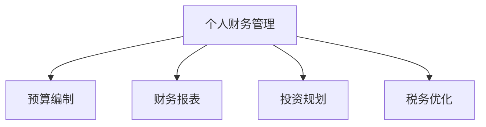

                 

# 程序员的理财工具箱：软件推荐

> 关键词：理财工具,财务管理,自动化,数据可视化,财务分析

## 1. 背景介绍

### 1.1 问题由来
随着社会经济的发展和科技的进步，程序员群体的收入水平和生活质量普遍提高，理财需求也逐渐增强。然而，尽管程序员在技术领域具有一定优势，但在理财知识、时间管理和数据分析能力上仍有所欠缺。如何在繁忙的工作之余，高效地管理个人财务，成为程序员群体面临的一个重要问题。

### 1.2 问题核心关键点
针对程序员群体的理财需求，本文将详细介绍几款功能强大、易用性高的理财工具和软件，包括但不限于：

1. **Mint**：一个功能全面的个人财务管理工具，帮助用户实时跟踪支出、收入和资产情况。
2. **YNAB**：一种基于预算的财务管理软件，侧重于帮助用户制定并执行财务预算。
3. **Personal Capital**：一款提供全方位理财规划服务的平台，包括投资、退休规划和税务优化等功能。
4. **Tiller**：一款基于谷歌电子表格的财务自动化工具，能够实时同步财务数据，自动生成报表。
5. **Microsoft Money**：微软推出的财务管理软件，支持多币种汇率转换、投资跟踪和税务管理等功能。

这些工具涵盖了从基础财务管理到高级投资规划的多个方面，能够有效帮助程序员群体实现财务自由和财富积累。

## 2. 核心概念与联系

### 2.1 核心概念概述

为更好地理解这些理财工具的工作原理和应用场景，本节将介绍几个密切相关的核心概念：

- **个人财务管理**：指对个人收入、支出、资产和负债等财务信息进行记录、分析和管理的活动。
- **预算编制**：制定详细的财务计划，合理分配收入和支出，避免不必要的浪费。
- **财务报表**：定期生成的财务数据报表，如资产负债表、现金流量表、利润表等，用于跟踪和评估财务状况。
- **投资规划**：基于财务目标和风险偏好，制定合理的投资组合，实现财富增值。
- **税务优化**：合法合规地优化税务负担，提升财务收益。

这些概念之间的逻辑关系可以通过以下Mermaid流程图来展示：



这个流程图展示了几大核心概念之间的逻辑关系：

1. 个人财务管理是一个综合性的概念，涵盖了预算编制、财务报表、投资规划和税务优化等各个方面。
2. 预算编制和财务报表是个人财务管理的两个重要组成部分，帮助用户合理分配资源，实时跟踪财务状况。
3. 投资规划和税务优化则是理财目标的具体实现手段，通过合理的投资组合和税务策略，提升财务收益。

## 3. 核心算法原理 & 具体操作步骤
### 3.1 算法原理概述

针对程序员群体的理财需求，推荐的理财工具主要基于以下几个核心算法和原理：

1. **数据记录与分析**：通过定期记录和分析个人财务数据，帮助用户了解财务状况，发现潜在的问题和优化空间。
2. **预算编制与执行**：利用智能预算编制工具，帮助用户制定合理的财务计划，并实时跟踪执行情况。
3. **投资组合优化**：基于现代金融理论，提供投资组合构建和优化算法，帮助用户实现财富增值。
4. **税务计算与优化**：使用高效的税务计算工具，帮助用户合法合规地优化税务负担，提升财务收益。

### 3.2 算法步骤详解

以下是几款推荐的理财工具的核心操作步骤：

#### 3.2.1 Mint
1. **注册与登录**：访问Mint官网，注册账户，并通过邮箱验证登录。
2. **数据同步**：连接银行和信用卡账户，自动同步财务数据。
3. **预算编制**：在Mint主界面上设置月度预算，实时跟踪支出情况。
4. **财务报表**：定期查看资产负债表、现金流量表和支出情况，了解财务状况。
5. **投资跟踪**：连接投资账户，实时跟踪投资收益和风险。

#### 3.2.2 YNAB
1. **注册与登录**：访问YNAB官网，注册账户，并通过邮箱验证登录。
2. **账户链接**：将银行和信用卡账户链接到YNAB，自动同步财务数据。
3. **预算编制**：设定预算目标，如“用于旅游”或“用于旅行”，并分配预算。
4. **支出跟踪**：实时记录每笔支出，并进行分类和标记。
5. **预算执行**：定期检查预算执行情况，调整预算分配。

#### 3.2.3 Personal Capital
1. **注册与登录**：访问Personal Capital官网，注册账户，并通过邮箱验证登录。
2. **数据同步**：连接银行、投资账户和信用卡账户，自动同步财务数据。
3. **财务规划**：使用个人资本提供的全方位规划工具，制定财务目标。
4. **投资组合优化**：根据投资目标和风险偏好，智能生成投资组合。
5. **税务优化**：使用税务计算器，优化税务负担，提升财务收益。

#### 3.2.4 Tiller
1. **注册与登录**：访问Tiller官网，注册账户，并通过谷歌邮箱验证登录。
2. **数据同步**：将个人财务数据导入谷歌电子表格，自动同步数据。
3. **自定义报表**：根据个人需求，自定义生成各种财务报表，如资产负债表、现金流量表、支出情况表等。
4. **自动更新**：实时更新财务数据，确保报表的实时性和准确性。

#### 3.2.5 Microsoft Money
1. **注册与登录**：访问Microsoft Money官网，下载并安装软件，并通过微软账号登录。
2. **数据同步**：连接银行和投资账户，自动同步财务数据。
3. **预算编制**：设定月度预算，跟踪支出情况。
4. **投资管理**：管理投资账户，跟踪投资收益和风险。
5. **税务管理**：使用内置的税务计算器，优化税务负担。

### 3.3 算法优缺点

这些理财工具各有优缺点，以下是详细的分析：

#### Mint
**优点**：
- 免费使用，功能全面，适合大众用户。
- 自动同步财务数据，使用方便。
- 提供投资跟踪和财务报表。

**缺点**：
- 界面设计较为简单，不够灵活。
- 对于高级功能需要付费。

#### YNAB
**优点**：
- 基于预算的财务管理方法，帮助用户有效控制支出。
- 实时记录支出，数据分析功能强大。
- 界面设计友好，易于使用。

**缺点**：
- 部分高级功能需要付费。
- 不支持小规模企业用户。

#### Personal Capital
**优点**：
- 提供全方位的财务规划和投资组合优化。
- 支持多种货币和税务优化。
- 数据可视化功能强大。

**缺点**：
- 部分功能需要付费。
- 界面较为复杂，对新手不够友好。

#### Tiller
**优点**：
- 高度灵活，支持自定义报表和数据可视化。
- 完全免费，无商业化广告。
- 自动同步财务数据，节省时间和精力。

**缺点**：
- 仅支持Google电子表格，与其他平台兼容性较差。
- 需要一定的技术基础进行配置和使用。

#### Microsoft Money
**优点**：
- 与微软生态系统深度整合，功能强大。
- 支持多币种汇率转换，适合全球用户。
- 界面设计美观，操作简便。

**缺点**：
- 部分高级功能需要付费。
- 不支持Mac平台。

### 3.4 算法应用领域

这些理财工具广泛应用于个人财务管理、家庭理财、企业财务管理等多个领域。具体应用场景包括：

1. **个人理财**：帮助个人用户管理日常支出、制定预算、跟踪投资收益。
2. **家庭理财**：帮助家庭用户协调财务资源，优化家庭开支，规划家庭财务目标。
3. **企业财务管理**：帮助企业用户管理财务报表，进行投资规划和税务优化。

这些工具的应用，能够有效提升程序员群体的财务管理效率，帮助他们实现财务自由和财富积累。

## 4. 数学模型和公式 & 详细讲解 & 举例说明
### 4.1 数学模型构建

以下将以Mint为例，介绍其主要数学模型和公式的构建过程。

Mint的核心数学模型主要包括：

- **支出-收入比率**：衡量家庭财务状况的重要指标，公式为：
$$ \text{支出-收入比率} = \frac{\text{月度支出}}{\text{月度收入}} \times 100\% $$

- **储蓄率**：衡量家庭储蓄能力的指标，公式为：
$$ \text{储蓄率} = \left(1 - \frac{\text{月度支出}}{\text{月度收入}}\right) \times 100\% $$

- **财务状况指数**：综合评估财务状况的综合指标，公式为：
$$ \text{财务状况指数} = \text{储蓄率} + \text{支出-收入比率} $$

### 4.2 公式推导过程

以支出-收入比率为例，其推导过程如下：

设月度收入为 $I$，月度支出为 $E$，则支出-收入比率计算公式为：
$$ \text{支出-收入比率} = \frac{E}{I} \times 100\% $$

将支出-收入比率和储蓄率代入财务状况指数公式中，得：
$$ \text{财务状况指数} = \left(1 - \frac{E}{I}\right) + \frac{E}{I} = 1 $$

这表明，财务状况指数的最大值为1，越接近1，表示财务状况越好。

### 4.3 案例分析与讲解

以小明为例，假设其月度收入为5000元，月度支出为3000元，则支出-收入比率为：
$$ \text{支出-收入比率} = \frac{3000}{5000} \times 100\% = 60\% $$

储蓄率为：
$$ \text{储蓄率} = \left(1 - \frac{3000}{5000}\right) \times 100\% = 40\% $$

财务状况指数为：
$$ \text{财务状况指数} = 40\% + 60\% = 100\% $$

通过计算可以看出，小明的财务状况指数为100%，表示其财务管理状况良好，但仍有提升空间。

## 5. 项目实践：代码实例和详细解释说明
### 5.1 开发环境搭建

在进行理财工具的使用实践前，我们需要准备好开发环境。以下是使用Python进行项目实践的环境配置流程：

1. **安装Python**：从官网下载并安装Python，建议选择3.8及以上版本。
2. **安装相关依赖**：
   - 安装Pandas、NumPy、matplotlib等数据分析和可视化库。
   - 安装requests库，用于访问API接口。
   - 安装PyTorch、TensorFlow等深度学习库，用于数据预处理和模型训练。

**代码实现**：

```python
pip install pandas numpy matplotlib requests torch tensorflow
```

### 5.2 源代码详细实现

以下是使用Python进行Mint账户数据同步的代码实现：

```python
import requests
import pandas as pd

# 访问Mint API，获取账户数据
def get_account_data(api_key):
    url = f"https://api.mint.com/mintplatform/mint/Account/{api_key}/Transactions?date=2023-01-01&from=0&to=120000&sort=desc"
    response = requests.get(url, headers={"Authorization": "Bearer " + api_key})
    data = response.json()
    return pd.DataFrame(data)

# 处理并分析账户数据
def analyze_account_data(df):
    # 计算支出-收入比率和储蓄率
    income = df['Amount'][df['Type'] == 'Income']
    expenses = df['Amount'][df['Type'] == 'Expense']
    savings_rate = (income.sum() - expenses.sum()) / income.sum() * 100
    income_expense_ratio = (expenses.sum() / income.sum()) * 100
    
    # 生成财务状况指数
    financial_status = savings_rate + income_expense_ratio
    
    # 返回计算结果
    return savings_rate, income_expense_ratio, financial_status

# 测试代码
api_key = "<YOUR_MINT_API_KEY>"
account_data = get_account_data(api_key)
savings_rate, income_expense_ratio, financial_status = analyze_account_data(account_data)
print(f"储蓄率：{savings_rate:.2f}%")
print(f"支出-收入比率：{income_expense_ratio:.2f}%")
print(f"财务状况指数：{financial_status:.2f}%")
```

### 5.3 代码解读与分析

**代码解释**：

1. **函数get_account_data**：使用requests库访问Mint API，获取指定时间段内的账户数据，包括收入和支出。
2. **函数analyze_account_data**：对获取到的数据进行分析，计算支出-收入比率和储蓄率，并生成财务状况指数。
3. **代码输出**：打印计算结果，显示储蓄率、支出-收入比率和财务状况指数。

**分析**：

通过上述代码，我们可以实时获取和分析账户数据，评估个人的财务状况。Mint API提供了丰富的财务数据，包括收入、支出、资产、负债等，用户可以根据需求进行自定义分析。

## 6. 实际应用场景

### 6.1 智能理财助手
通过Mint、YNAB等工具，程序员可以快速掌握个人财务状况，制定合理的财务计划，有效控制支出。智能理财助手可以自动同步财务数据，生成财务报表和预算，实时提醒用户遵守预算限制，帮助用户实现财务自由。

### 6.2 投资组合优化
Personal Capital等工具提供了投资组合构建和优化算法，帮助用户根据财务目标和风险偏好，智能生成投资组合。用户可以轻松管理多个投资账户，实时跟踪投资收益和风险，优化财务收益。

### 6.3 税务优化
Mint、Personal Capital等工具内置了税务计算器，帮助用户合法合规地优化税务负担，提升财务收益。用户可以根据不同国家和地区的税法规定，合理规划税务策略，最大化税务优惠。

### 6.4 未来应用展望
随着AI和大数据技术的发展，未来的理财工具将更加智能化和个性化。例如，通过机器学习算法分析用户行为，提供个性化的财务建议和投资组合优化方案；通过区块链技术实现实时数据同步和透明化；通过智能合约自动化管理财务，提升用户体验和效率。

## 7. 工具和资源推荐
### 7.1 学习资源推荐

为了帮助程序员群体系统掌握理财知识，提升财务管理能力，这里推荐一些优质的学习资源：

1. **《理财规划入门》**：一本系统介绍个人理财基础知识的书籍，适合初学者入门。
2. **《金融学基础》**：一本深入浅出讲解金融学原理的书籍，帮助读者理解财务背后的逻辑。
3. **Coursera《个人财务管理》课程**：由耶鲁大学提供，涵盖个人财务管理的各个方面，包括预算编制、投资规划、税务优化等。
4. **Udemy《财务自由之路》课程**：详细讲解如何通过理财实现财务自由，提供实用的理财策略和工具。
5. **Khan Academy《经济学基础》课程**：涵盖经济学原理，帮助用户理解财务背后的宏观背景。

通过对这些资源的系统学习，程序员群体可以更好地掌握理财知识，提升财务管理能力，实现财务自由。

### 7.2 开发工具推荐

以下是几款常用且功能强大的理财工具：

1. **Mint**：一个功能全面的个人财务管理工具，适合大众用户，提供自动数据同步和财务报表功能。
2. **YNAB**：一款基于预算的财务管理软件，侧重于帮助用户有效控制支出。
3. **Personal Capital**：提供全方位的理财规划服务，支持投资组合优化和税务优化。
4. **Tiller**：高度灵活的财务自动化工具，支持自定义报表和数据可视化。
5. **Microsoft Money**：与微软生态系统深度整合，支持多币种汇率转换和投资管理。

这些工具功能强大，易用性好，能够有效提升程序员群体的财务管理效率。

### 7.3 相关论文推荐

以下是几篇关于个人理财管理的经典论文，推荐阅读：

1. **《财务自由之路》**：一本经典的理财书籍，详细讲解如何通过理财实现财务自由。
2. **《个人理财规划与投资》**：一本系统介绍个人理财规划和投资的书籍，适合高级读者。
3. **《智能理财工具的设计与实现》**：一篇介绍智能理财工具设计和实现的论文，探讨如何利用AI和大数据技术提升理财效果。

这些论文为理财工具的发展提供了理论支持，帮助程序员群体更好地理解和应用这些工具。

## 8. 总结：未来发展趋势与挑战
### 8.1 总结

本文对几款常用且功能强大的理财工具进行了详细介绍，帮助程序员群体高效管理个人财务，实现财务自由。通过Mint、YNAB、Personal Capital、Tiller、Microsoft Money等工具，程序员可以轻松掌握财务状况，制定预算计划，优化投资组合，合法合规地优化税务负担。

### 8.2 未来发展趋势

展望未来，理财工具将呈现以下几个发展趋势：

1. **智能化**：利用AI和大数据技术，理财工具将更加智能化和个性化，能够提供个性化的财务建议和投资组合优化方案。
2. **透明化**：通过区块链技术，实现实时数据同步和透明化，提升用户的信任度。
3. **自动化**：智能合约技术的引入，将使财务管理自动化程度更高，提升用户体验和效率。

### 8.3 面临的挑战

尽管理财工具已经取得了显著进展，但仍面临诸多挑战：

1. **数据隐私**：理财工具需要收集大量用户财务数据，如何保护用户隐私和数据安全，成为重要的挑战。
2. **跨平台兼容性**：现有的理财工具多集中在特定平台或系统，如何实现跨平台兼容性和数据互操作性，是未来的重要研究方向。
3. **用户适应性**：理财工具需要适应不同用户群体的需求和习惯，如何设计易用性和用户体验，提升用户黏性。

### 8.4 研究展望

未来的理财工具研究需要在以下几个方面进行突破：

1. **数据隐私保护**：开发更加安全可靠的数据加密和隐私保护技术，确保用户数据的安全性。
2. **跨平台兼容性**：实现跨平台兼容性和数据互操作性，提升理财工具的通用性和易用性。
3. **用户适应性**：通过用户行为分析和个性化推荐，提升理财工具的智能化和用户体验。

这些研究方向将为理财工具的发展提供新的突破点，帮助程序员群体实现更加高效和智能的财务管理。

## 9. 附录：常见问题与解答

**Q1：这些理财工具是否适合程序员使用？**

A: 是的，这些理财工具功能全面，操作简单，适合程序员群体使用。程序员只需要掌握基本的财务知识和操作技巧，即可轻松上手使用。

**Q2：这些工具是否需要付费使用？**

A: 部分工具提供免费版和付费版，免费版功能较为基础，付费版则提供更多高级功能和个性化服务。程序员可以根据自己的需求选择适合的版本。

**Q3：这些工具是否支持多币种汇率转换？**

A: 是的，这些工具大多支持多币种汇率转换，帮助程序员进行全球化财务管理。

**Q4：这些工具是否支持自定义报表和数据可视化？**

A: 是的，这些工具大多支持自定义报表和数据可视化，帮助程序员轻松生成和分析财务报表。

**Q5：这些工具是否支持投资组合优化？**

A: 是的，部分工具提供投资组合优化功能，帮助程序员制定合理的投资策略，提升财务收益。

---

作者：禅与计算机程序设计艺术 / Zen and the Art of Computer Programming

