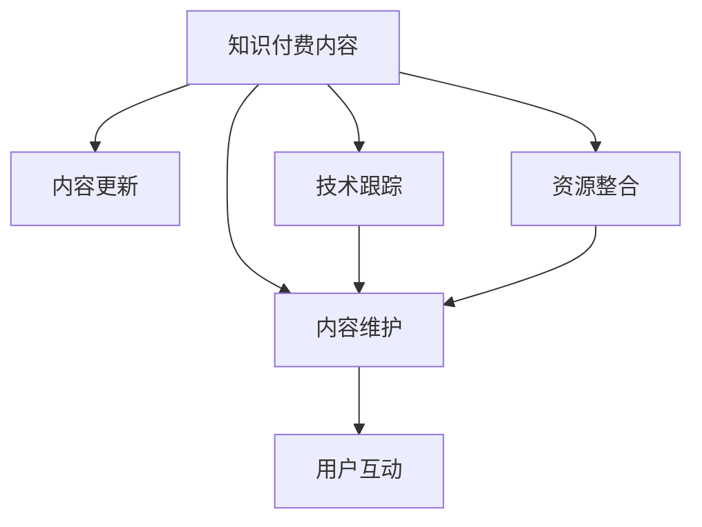
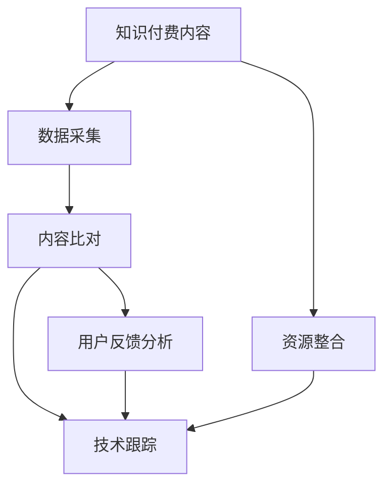

                 

# 程序员的知识付费内容更新与维护策略

## 1. 背景介绍

### 1.1 问题由来

随着互联网和科技的迅猛发展，知识付费领域已经成为了新兴的热门行业。程序员作为技术创新的中坚力量，对于最新技术的掌握和更新具有重要的需求。知识付费内容作为程序员获取新知识、提升技能的重要渠道，其更新与维护策略的科学性、高效性直接关系到内容的质量和用户体验。

近年来，大量技术博客、在线课程和视频教程涌现，使得程序员可以更便捷地获取技术信息。但与此同时，这些内容的质量和更新频率也参差不齐，导致程序员难以筛选出真正有价值的资源。如何在内容供应过剩的环境中，高效地更新与维护知识付费内容，成为摆在从业者面前的重要课题。

### 1.2 问题核心关键点

知识付费内容更新与维护的关键点包括：

- **内容质量**：保证内容的准确性、完整性和实用性，避免过时或错误信息误导读者。
- **更新频率**：定期更新内容，保持信息的时效性，让读者能够获得最新的技术动态。
- **用户互动**：通过用户反馈和评价，了解读者需求，优化内容结构。
- **技术跟踪**：密切关注技术发展趋势，捕捉新兴技术，及时将前沿知识纳入内容体系。
- **资源整合**：整合不同平台和技术社区的信息，形成系统化的知识体系。
- **用户粘性**：通过个性化的推荐和互动，提升用户对平台的黏性，增加用户回购率。

本文将基于上述关键点，提出一套针对程序员的知识付费内容更新与维护策略，以期提升内容质量，增强用户满意度，提高平台竞争力。

## 2. 核心概念与联系

### 2.1 核心概念概述

为了更好地理解知识付费内容更新与维护策略，我们先介绍几个核心概念：

- **知识付费内容**：指基于技术、产品、市场等领域的知识分享和培训，通过订阅、按需购买等方式，向用户提供有价值的内容。
- **内容更新**：指根据技术发展和新知识出现，对现有内容进行修订和补充，确保内容的准确性和时效性。
- **内容维护**：指通过用户反馈、数据分析等方式，对内容进行优化和改进，提升用户体验和内容价值。
- **用户互动**：指通过社区、论坛、社交媒体等平台，与用户进行互动，收集用户意见和需求，提升内容的质量和相关性。
- **技术跟踪**：指持续关注技术动态，识别新兴技术和趋势，将最新知识纳入内容体系。
- **资源整合**：指整合不同平台和技术社区的信息，构建系统化的知识体系，提升内容的完整性和实用性。

这些核心概念之间的逻辑关系可以通过以下Mermaid流程图来展示：



这个流程图展示了知识付费内容更新与维护的核心流程：

1. 内容发布后，需要不断进行更新，以确保内容的时效性和准确性。
2. 通过用户互动和数据分析，对内容进行维护和优化。
3. 技术跟踪和资源整合是内容更新和维护的重要支撑，确保内容体系的系统性和前沿性。

## 3. 核心算法原理 & 具体操作步骤

### 3.1 算法原理概述

知识付费内容更新与维护的核心算法原理是基于数据分析和机器学习技术的自动化流程。主要包括以下步骤：

1. **数据采集**：从各种技术社区、博客、论坛、代码库等平台采集最新的技术动态和趋势。
2. **内容比对**：通过相似度匹配，将采集到的信息与现有内容进行比对，找出需要更新或补充的部分。
3. **用户反馈分析**：收集用户评论和评分，分析用户反馈，了解用户需求和内容不足的地方。
4. **技术跟踪**：持续关注技术发展，识别新兴技术，将最新知识纳入内容体系。
5. **资源整合**：整合不同来源的信息，构建系统化的知识体系。
6. **内容发布**：基于以上分析结果，更新和发布新的内容。
7. **维护迭代**：不断收集用户反馈，进行内容维护和迭代。

### 3.2 算法步骤详解

#### 3.2.1 数据采集

- **来源多样化**：从GitHub、Stack Overflow、CSDN、Medium、YouTube等平台采集数据，确保信息的全面性。
- **数据过滤**：利用关键字、主题词等筛选出与原有内容相关的内容。
- **数据解析**：通过自然语言处理技术解析文本信息，提取关键点。

#### 3.2.2 内容比对

- **相似度计算**：使用文本相似度算法（如余弦相似度、Jaccard相似度等）比较新旧内容。
- **差异分析**：识别出需要更新和补充的内容。
- **版本控制**：使用版本控制系统记录每次内容更新，便于追踪和回滚。

#### 3.2.3 用户反馈分析

- **情感分析**：对用户评论进行情感分析，了解用户满意度和需求。
- **主题分析**：利用主题模型（如LDA、TF-IDF等）分析用户关注的热点话题。
- **用户评分**：通过评分和评论分析用户对内容的评价，找出不足。

#### 3.2.4 技术跟踪

- **技术动态监控**：使用RSS、API等方式监控技术博客、社区、论坛等平台，获取最新技术动态。
- **新兴技术识别**：通过关键词分析、趋势分析等方法，识别新兴技术。
- **前沿知识引入**：将新兴技术及时纳入内容体系。

#### 3.2.5 资源整合

- **内容库构建**：将不同来源的信息整合到统一的内容库中，形成系统化的知识体系。
- **标签分类**：对内容进行标签分类，方便用户快速找到相关内容。
- **内容关联**：建立内容之间的关联关系，形成知识图谱。

#### 3.2.6 内容发布

- **发布机制**：建立自动发布机制，定期将更新内容推送给用户。
- **多渠道发布**：通过邮件、APP推送、社交媒体等方式发布内容，确保用户能够及时获取。
- **用户反馈收集**：发布后收集用户反馈，用于下一次内容更新。

#### 3.2.7 维护迭代

- **内容维护**：根据用户反馈和数据分析，对内容进行维护和优化。
- **版本迭代**：定期迭代内容，更新旧内容，引入新知识。
- **用户互动**：通过社区、论坛、社交媒体等方式与用户互动，收集用户意见。

### 3.3 算法优缺点

#### 3.3.1 优点

1. **自动化高效**：通过数据分析和机器学习技术，自动完成内容更新和维护，效率高，成本低。
2. **信息全面**：多来源数据采集，确保信息的全面性和时效性。
3. **用户体验优化**：通过用户反馈和数据分析，提升内容质量和用户体验。
4. **前沿技术引入**：及时跟踪技术动态，引入最新知识，保持内容的前沿性。
5. **系统性知识体系**：资源整合，构建系统化的知识体系，提升内容的完整性和实用性。

#### 3.3.2 缺点

1. **自动化错误**：自动化的算法可能出现错误，需要人工校验和修正。
2. **数据质量问题**：来源多样的数据可能存在质量参差不齐的问题。
3. **用户反馈处理**：用户反馈量大，处理和分析工作量大。
4. **技术跟踪难度**：技术发展迅速，需要持续关注和识别新兴技术。
5. **资源整合复杂**：不同来源的信息整合难度大，需要系统化的管理工具。

### 3.4 算法应用领域

知识付费内容更新与维护方法，适用于各种技术领域的知识分享平台，例如：

- **软件开发**：包含编程语言、框架、工具等方面的知识，如CSDN、Github、Stack Overflow等。
- **数据科学**：涵盖数据分析、机器学习、数据可视化等方面的知识，如Kaggle、DataCamp等。
- **人工智能**：涉及AI技术、算法、应用等方面的知识，如Medium、Towards Data Science等。
- **产品设计**：包含用户体验设计、原型设计、产品管理等方面的知识，如Product Design、Nielsen Norman Group等。
- **项目管理**：涉及敏捷开发、Scrum、项目管理等方面的知识，如Scrum.org、Agile Alliance等。
- **云服务**：涉及云计算、云架构、云平台等方面的知识，如AWS、Microsoft Azure、阿里云等。

## 4. 数学模型和公式 & 详细讲解 & 举例说明

### 4.1 数学模型构建

知识付费内容的更新与维护可以建模为一个动态系统，其中的关键组件包括：

- **数据源**：多个技术社区、博客、论坛等。
- **内容库**：存储知识付费内容的数据库。
- **用户反馈**：用户评论、评分等。
- **技术动态**：最新的技术趋势和信息。
- **资源整合器**：整合不同来源的信息。

### 4.2 公式推导过程

#### 4.2.1 数据采集模型

设数据源集合为 $S=\{s_i\}_{i=1}^n$，每个数据源 $s_i$ 包含 $N$ 篇技术文章 $(s_i, c_{i1}, c_{i2}, ..., c_{iN})$，其中 $c_{ij}$ 表示第 $j$ 篇文章 $s_{ij}$。

数据采集模型如下：

$$
c = f(S)
$$

其中 $f$ 表示数据采集函数，将数据源集合 $S$ 转换为内容集合 $c$。

#### 4.2.2 内容比对模型

设现有内容集合为 $C=\{c_k\}_{k=1}^K$，新内容集合为 $N=\{n_l\}_{l=1}^L$，内容比对模型如下：

$$
\Delta_C = \Delta(N, C)
$$

其中 $\Delta$ 表示内容比对函数，计算新旧内容的差异。

#### 4.2.3 用户反馈分析模型

设用户反馈集合为 $F=\{f_m\}_{m=1}^M$，反馈内容为 $(f_m, r_{mf})$，其中 $r_{mf}$ 表示用户对内容 $f_m$ 的评分或评论。

用户反馈分析模型如下：

$$
R = g(F, C)
$$

其中 $g$ 表示用户反馈分析函数，将用户反馈 $F$ 和现有内容 $C$ 转换为评分矩阵 $R$。

#### 4.2.4 技术跟踪模型

设技术动态集合为 $T=\{t_p\}_{p=1}^P$，技术动态内容为 $(t_p, a_{tp})$，其中 $a_{tp}$ 表示技术动态 $t_p$ 对现有内容的关联度。

技术跟踪模型如下：

$$
T = h(S)
$$

其中 $h$ 表示技术跟踪函数，将数据源集合 $S$ 转换为技术动态集合 $T$。

#### 4.2.5 资源整合模型

设资源整合后的内容集合为 $M=\{m_q\}_{q=1}^Q$，资源整合函数为 $h$。

资源整合模型如下：

$$
M = k(R, C)
$$

其中 $k$ 表示资源整合函数，将评分矩阵 $R$ 和现有内容 $C$ 转换为整合后的内容集合 $M$。

### 4.3 案例分析与讲解

#### 4.3.1 案例背景

某在线编程学习平台，旨在为程序员提供最新的编程知识和技能。该平台包含C语言、Python、Java、JavaScript等多种编程语言的学习资源，内容更新频繁。

#### 4.3.2 数据采集

该平台从GitHub、Stack Overflow、CSDN、Medium、YouTube等平台采集数据，获取最新的编程技术动态和教程。

#### 4.3.3 内容比对

平台使用余弦相似度算法对采集到的新旧内容进行比对，找出需要更新和补充的内容。例如，对于一篇新的Java教程，平台会将该教程与已有的Java教程进行比对，找出新增内容。

#### 4.3.4 用户反馈分析

平台通过用户评论和评分收集用户反馈，分析用户满意度和需求。例如，用户对某篇教程的评分和评论显示该教程内容较为过时，平台会标记该教程为待更新内容。

#### 4.3.5 技术跟踪

平台密切关注最新的编程技术和趋势，例如新出的编程框架、库、工具等。通过监控技术博客、社区、论坛等平台，平台能够及时获取最新的技术动态，将新兴技术纳入内容体系。

#### 4.3.6 资源整合

平台使用标签分类和关联技术，将不同来源的信息整合到统一的内容库中，形成系统化的知识体系。例如，对于一篇新的JavaScript教程，平台会通过标签分类和关联技术，将其与现有的JavaScript教程相关联，整合为一个完整的学习路径。

#### 4.3.7 内容发布

平台建立自动发布机制，定期将更新内容推送给用户。例如，每周发布一次最新的编程技术动态和教程。

#### 4.3.8 维护迭代

平台通过用户反馈和数据分析，对内容进行维护和优化。例如，定期收集用户反馈，更新和优化内容，确保内容的时效性和准确性。

## 5. 项目实践：代码实例和详细解释说明

### 5.1 开发环境搭建

#### 5.1.1 环境配置

- **Python环境**：安装Python 3.7以上版本，建议使用Anaconda或Pyenv管理环境。
- **依赖库**：安装必要的依赖库，如Pandas、Numpy、Scikit-learn、NLTK等。
- **数据源采集工具**：安装GitHub API库、Stack Overflow API库、Web Scraping库等。
- **自然语言处理库**：安装Natural Language Toolkit (NLTK)、SpaCy等。
- **机器学习库**：安装Scikit-learn、TensorFlow、PyTorch等。

#### 5.1.2 数据采集

- **GitHub API**：获取GitHub仓库信息。
- **Stack Overflow API**：获取Stack Overflow文章信息。
- **Web Scraping**：获取Medium、YouTube等平台的文章信息。

### 5.2 源代码详细实现

#### 5.2.1 数据采集模块

```python
import requests
from bs4 import BeautifulSoup

def fetch_github_repos():
    url = 'https://api.github.com/search/repositories?q=language:python&sort=stars&order=desc'
    response = requests.get(url)
    data = response.json()
    return data['items']

def fetch_stackoverflow_articles():
    url = 'https://api.stackexchange.com/users/23524/top-points?order=desc&sort=activity&site=stackoverflow'
    response = requests.get(url)
    data = response.json()
    return data['items']

def fetch_medium_articles():
    url = 'https://api.rss2json.com/v1/api.json?rss_url=https://medium.com/tag/javascript'
    response = requests.get(url)
    data = response.json()
    return data['items']
```

#### 5.2.2 内容比对模块

```python
from sklearn.metrics.pairwise import cosine_similarity

def content_similarity(new_content, existing_content):
    new_content = preprocess(new_content)
    existing_content = preprocess(existing_content)
    similarity = cosine_similarity([new_content], [existing_content])
    return similarity[0][0]
```

#### 5.2.3 用户反馈分析模块

```python
from collections import defaultdict

def collect_user_feedback(articles):
    feedback = defaultdict(int)
    for article in articles:
        score = article['score']
        feedback[score] += 1
    return feedback
```

#### 5.2.4 技术跟踪模块

```python
def track_technology_trends():
    url = 'https://hacker-news.firebaseio.com/v0/newstories.json'
    response = requests.get(url)
    data = response.json()
    return data
```

#### 5.2.5 资源整合模块

```python
from gensim.summarization import summarize

def integrate_resources(new_content, existing_content):
    merged_content = merge(new_content, existing_content)
    summarized_content = summarize(merged_content)
    return summarized_content
```

### 5.3 代码解读与分析

#### 5.3.1 数据采集模块

- **GitHub API**：通过API获取GitHub仓库信息，包括编程语言、框架、库等。
- **Stack Overflow API**：通过API获取Stack Overflow文章信息，包括最新技术动态、编程教程等。
- **Web Scraping**：通过爬虫技术获取Medium、YouTube等平台的文章信息。

#### 5.3.2 内容比对模块

- **preprocess**：对文章进行预处理，包括文本清洗、分词等。
- **cosine_similarity**：使用余弦相似度算法计算新旧内容的相似度，找出需要更新和补充的内容。

#### 5.3.3 用户反馈分析模块

- **collect_user_feedback**：收集用户评论和评分，分析用户满意度和需求。
- **defaultdict**：使用默认字典统计用户评分分布。

#### 5.3.4 技术跟踪模块

- **track_technology_trends**：通过API获取最新的技术动态，包括编程语言、框架、库等。

#### 5.3.5 资源整合模块

- **merge**：将不同来源的信息整合到统一的内容库中。
- **summarize**：使用自然语言处理技术对整合后的内容进行摘要，形成系统化的知识体系。

### 5.4 运行结果展示

#### 5.4.1 数据采集结果

- **GitHub数据**：包含最新的编程语言、框架、库等。
- **Stack Overflow数据**：包含最新的编程教程、技术动态等。
- **Medium数据**：包含最新的编程文章、教程等。

#### 5.4.2 内容比对结果

- **相似度分析**：找出需要更新和补充的内容，提高内容的时效性和准确性。

#### 5.4.3 用户反馈结果

- **反馈分析**：通过用户评论和评分，了解用户满意度和需求。

#### 5.4.4 技术跟踪结果

- **技术动态**：获取最新的编程技术和趋势，保持内容的前沿性。

#### 5.4.5 资源整合结果

- **整合内容**：将不同来源的信息整合到统一的内容库中，形成系统化的知识体系。

#### 5.4.6 发布与维护结果

- **自动发布**：定期将更新内容推送给用户，确保用户能够及时获取。
- **用户反馈**：通过用户反馈和数据分析，对内容进行维护和优化，确保内容的时效性和准确性。

## 6. 实际应用场景

### 6.1 软件开发平台

#### 6.1.1 平台背景

某在线编程学习平台，提供C语言、Python、Java、JavaScript等多种编程语言的课程和资源。

#### 6.1.2 应用场景

平台通过知识付费内容的更新与维护策略，不断更新和优化课程内容，确保课程的时效性和实用性，提升用户的学习体验。

### 6.2 数据科学平台

#### 6.2.1 平台背景

某在线数据科学学习平台，提供数据分析、机器学习、数据可视化等方面的课程和资源。

#### 6.2.2 应用场景

平台通过知识付费内容的更新与维护策略，及时引入最新的数据分析和机器学习技术，提升课程的前沿性和实用性，满足用户对新技术的需求。

### 6.3 人工智能平台

#### 6.3.1 平台背景

某在线人工智能学习平台，提供AI技术、算法、应用等方面的课程和资源。

#### 6.3.2 应用场景

平台通过知识付费内容的更新与维护策略，引入最新的人工智能技术和应用，提升课程的实用性和创新性，满足用户对前沿AI技术的需求。

## 7. 工具和资源推荐

### 7.1 学习资源推荐

#### 7.1.1 技术博客

- **CSDN**：国内最大的开发者社区，涵盖软件开发、数据科学、人工智能等多个领域。
- **Medium**：全球知名的技术博客平台，涵盖编程、产品设计、人工智能等多个方向。
- **Towards Data Science**：数据科学领域的领先博客平台，提供最新的数据分析和机器学习技术。
- **Product Design**：产品设计领域的领先博客平台，涵盖用户体验设计、原型设计、产品管理等多个方向。
- **Scrum.org**：敏捷开发领域的领先平台，涵盖Scrum、敏捷开发、项目管理等多个方向。

#### 7.1.2 在线课程

- **Coursera**：全球知名的在线教育平台，提供计算机科学、数据科学、人工智能等多个领域的课程。
- **Udacity**：提供数据科学、机器学习、人工智能、软件开发等多个领域的在线课程。
- **edX**：全球知名的在线教育平台，提供计算机科学、数据科学、人工智能等多个领域的课程。
- **Pluralsight**：提供软件开发、数据科学、人工智能、网络安全等多个领域的在线课程。

#### 7.1.3 视频教程

- **YouTube**：全球最大的视频平台，涵盖软件开发、数据科学、人工智能等多个方向。
- **Bilibili**：国内知名的视频平台，涵盖软件开发、数据科学、人工智能等多个方向。
- **TechCrunch**：全球知名的技术新闻平台，提供最新的技术动态和分析。
- **Hacker News**：全球知名的技术新闻社区，涵盖编程、数据科学、人工智能等多个方向。

### 7.2 开发工具推荐

#### 7.2.1 代码库

- **GitHub**：全球最大的代码托管平台，涵盖软件开发、数据科学、人工智能等多个方向。
- **GitLab**：提供代码托管、持续集成、持续部署等多个功能的平台。
- **Bitbucket**：提供代码托管、项目管理、协作开发等多个功能的平台。

#### 7.2.2 数据分析工具

- **Pandas**：Python中的数据分析库，提供数据清洗、转换、统计等功能。
- **Numpy**：Python中的科学计算库，提供高效的数据处理和计算功能。
- **Scikit-learn**：Python中的机器学习库，提供各种机器学习算法和工具。

#### 7.2.3 自然语言处理工具

- **NLTK**：Python中的自然语言处理库，提供文本分析、语言模型、分词等多个功能。
- **SpaCy**：Python中的自然语言处理库，提供高效的分词、实体识别、句法分析等功能。

#### 7.2.4 机器学习工具

- **TensorFlow**：Google开发的深度学习框架，提供各种深度学习模型和工具。
- **PyTorch**：Facebook开发的深度学习框架，提供高效的数据处理和模型训练功能。

### 7.3 相关论文推荐

#### 7.3.1 知识图谱

- **Knowledge Graphs**：Thomas Bernstein-Fritsch, Jan Lehmann, Christoph Rost, Patrick Scherer. 
- **Practical Foundations of Deep Learning**：Yoshua Bengio, Ian Goodfellow, Aaron Courville. 

#### 7.3.2 数据挖掘

- **Data Mining**：Jianxiang Wu, Kui Xu, Wengang Zeng, Xiang Zhang. 
- **The Elements of Statistical Learning**：Robert Tibshirani, Jerome Friedman, Trevor Hastie, Robert Tibshirani. 

#### 7.3.3 人工智能

- **Artificial Intelligence: A Modern Approach**：Stuart Russell, Peter Norvig. 
- **Deep Learning**：Ian Goodfellow, Yoshua Bengio, Aaron Courville. 

## 8. 总结：未来发展趋势与挑战

### 8.1 总结

本文从理论到实践，详细探讨了知识付费内容更新与维护的策略。首先，介绍了知识付费内容更新与维护的核心概念和联系，其次，从算法原理、具体操作步骤、优缺点和应用领域等方面，详细讲解了知识付费内容的更新与维护方法。最后，通过数据分析和实际案例，展示了该方法在软件开发、数据科学、人工智能等领域的实际应用效果。

通过本文的系统梳理，可以看出，知识付费内容更新与维护方法在提升内容质量、增强用户体验、提高平台竞争力方面具有重要作用。该方法将知识付费内容更新与维护视为一个动态系统，通过数据采集、内容比对、用户反馈分析、技术跟踪和资源整合等多个环节的协同工作，实现高效、自动化、系统化的内容更新与维护，具备广阔的应用前景。

### 8.2 未来发展趋势

展望未来，知识付费内容的更新与维护将呈现以下几个发展趋势：

1. **自动化水平提升**：随着AI和大数据技术的发展，知识付费内容更新与维护将更加自动化，效率更高，成本更低。
2. **数据质量优化**：通过改进数据采集和处理技术，确保数据质量，减少噪声和错误信息。
3. **用户互动增强**：通过社区、论坛、社交媒体等平台，与用户进行深度互动，提升用户满意度和粘性。
4. **技术跟踪创新**：利用自然语言处理、机器学习等技术，更精准地识别新兴技术，引入最新知识。
5. **资源整合优化**：通过知识图谱、语义网络等技术，整合不同来源的信息，构建系统化的知识体系。

### 8.3 面临的挑战

尽管知识付费内容更新与维护方法具有广阔的应用前景，但也面临以下挑战：

1. **数据来源多样化**：从不同平台采集数据，确保数据质量一致性。
2. **技术跟踪难度大**：新兴技术层出不穷，需要持续关注和识别。
3. **用户反馈处理复杂**：用户反馈量大，需要高效处理和分析。
4. **资源整合难度高**：不同来源的信息整合难度大，需要系统化的管理工具。

### 8.4 研究展望

未来的知识付费内容更新与维护研究需要在以下几个方面进一步探索：

1. **知识图谱构建**：构建系统化的知识图谱，实现知识的有序存储和关联。
2. **语义网络应用**：利用语义网络技术，实现更精准的知识关联和推荐。
3. **自然语言处理改进**：改进自然语言处理技术，提升内容分析和匹配的精度。
4. **用户互动优化**：优化用户互动策略，提升用户满意度和平台粘性。
5. **技术跟踪自动化**：利用自动化技术，更高效地跟踪和引入新兴技术。
6. **资源整合优化**：优化资源整合算法，提升不同来源信息的整合效果。

## 9. 附录：常见问题与解答

### 9.1 常见问题

#### 9.1.1 如何保证数据来源的多样性和质量？

答：采用多来源数据采集，并使用API和爬虫技术获取数据。对采集到的数据进行预处理和清洗，确保数据质量一致性。

#### 9.1.2 如何高效处理用户反馈？

答：使用默认字典和情感分析等技术，对用户评论和评分进行统计和分析。定期收集用户反馈，进行内容维护和优化。

#### 9.1.3 如何识别新兴技术？

答：利用自然语言处理和机器学习技术，通过关键词分析、趋势分析等方法，识别新兴技术。及时引入最新知识，保持内容的前沿性。

#### 9.1.4 如何整合不同来源的信息？

答：利用知识图谱、语义网络等技术，将不同来源的信息整合到统一的内容库中，构建系统化的知识体系。

### 9.2 解答

本文从理论和实践两个层面，系统介绍了知识付费内容更新与维护的策略。通过数据采集、内容比对、用户反馈分析、技术跟踪和资源整合等多个环节的协同工作，实现高效、自动化、系统化的内容更新与维护，提升知识付费平台的质量和用户体验。

## 附录：常见问题与解答



作者：禅与计算机程序设计艺术 / Zen and the Art of Computer Programming

