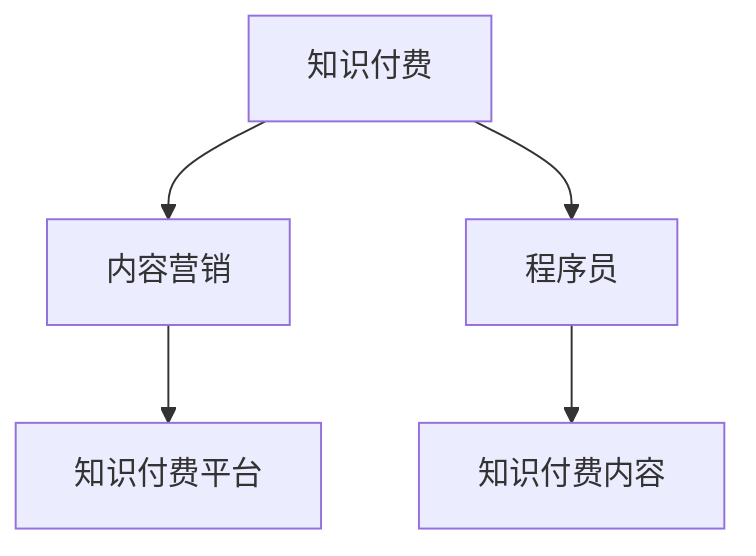

                 

## 1. 背景介绍

### 1.1 问题由来

在信息爆炸的时代，程序员面临的选择越来越多，不仅需要掌握新的编程语言和框架，还需要不断更新自己的知识体系。然而，由于工作繁忙和时间有限，程序员在自我提升方面面临巨大的挑战。知识付费内容作为一种有效的方式，能够帮助程序员在短时间内掌握重要技能，提高工作效率。因此，知识付费市场近年来迅速发展，成为教育技术领域的一股新势力。

### 1.2 问题核心关键点

知识付费内容营销的核心在于如何高效地将优质内容传递给目标用户，并促使其产生购买行为。在这一过程中，内容质量、用户画像、渠道选择、价格策略等因素都至关重要。本文将从这些核心点出发，深入探讨程序员的知识付费内容营销策略。

## 2. 核心概念与联系

### 2.1 核心概念概述

为更好地理解知识付费内容营销的策略，本节将介绍几个密切相关的核心概念：

- 知识付费：指用户为获取知识、技能、经验等有价值的信息，愿意支付相应费用的服务模式。内容提供者通过在线课程、电子书、直播讲座等形式，为用户提供专业知识。
- 内容营销：指通过提供有价值的内容，吸引并留住目标用户，最终促使其产生购买行为的市场营销策略。
- 程序员：指专业编写、测试、维护计算机程序的专业人士。他们通常具备扎实的计算机科学基础，熟悉一种或多种编程语言和工具。
- 知识付费内容：指以传授专业知识、技能、经验为目的的付费内容产品。如在线课程、电子书、技术博客等。
- 知识付费平台：指提供知识付费内容发布和交易的在线平台，如网易云课堂、慕课网、腾讯课堂等。

这些核心概念之间的逻辑关系可以通过以下Mermaid流程图来展示：



这个流程图展示出知识付费和内容营销之间的关系，程序员作为内容受众，在知识付费平台上获取和消费知识付费内容。

## 3. 核心算法原理 & 具体操作步骤

### 3.1 算法原理概述

知识付费内容营销的核心在于通过提供高质量、有针对性的内容，吸引目标用户，促使其产生购买行为。其核心思想是：选择合适的平台和内容形式，针对目标用户画像，制定合理的价格策略，以高效的方式传递优质内容。

形式化地，假设目标用户群体为 $U$，内容库为 $C$，平台为 $P$，价格策略为 $P$。内容营销的目标是最大化内容消费量，即：

$$
\max_{P, C, U} \sum_{u \in U} \text{Content Consumption}(u, P, C, P)
$$

其中，$\text{Content Consumption}(u, P, C, P)$ 为特定用户 $u$ 在平台 $P$ 上消费内容 $C$，根据价格策略 $P$ 购买的可能性。

### 3.2 算法步骤详解

知识付费内容营销一般包括以下几个关键步骤：

**Step 1: 用户画像分析**
- 分析目标用户群体的基本信息、职业背景、技术水平等，以确定潜在的内容消费需求。
- 使用问卷调查、用户反馈等方式收集用户偏好和行为数据，以便更加精准地定位目标用户。

**Step 2: 内容形式选择**
- 根据目标用户画像，选择适合的内容形式，如在线课程、电子书、技术博客、视频直播等。
- 考虑不同形式的内容对于用户的时间成本、学习效果、互动性等方面的影响，选择最适合的内容形式。

**Step 3: 平台选择与推广**
- 选择合适的内容平台，如网易云课堂、慕课网、腾讯课堂等，这些平台用户基数大，内容丰富。
- 利用SEO优化、社交媒体推广、KOL合作等方式提高内容在平台上的曝光率，吸引潜在用户关注。

**Step 4: 内容定价与优惠**
- 根据内容价值和用户需求，制定合理的价格策略，确保内容具有吸引力。
- 推出试学、优惠券、团购等方式，降低用户购买门槛，增加内容消费量。

**Step 5: 内容更新与互动**
- 定期更新内容，保持内容的时效性和前沿性，吸引用户持续关注。
- 通过评论区、在线直播等方式，与用户互动，收集用户反馈，优化内容质量。

**Step 6: 数据分析与优化**
- 利用平台提供的数据分析工具，监控内容消费情况，分析用户行为，识别内容需求。
- 根据分析结果，优化内容形式、更新策略、定价策略等，进一步提高内容消费量。

以上是知识付费内容营销的一般流程。在实际应用中，还需要针对具体内容、用户、平台等细节进行优化设计，以进一步提升营销效果。

### 3.3 算法优缺点

知识付费内容营销方法具有以下优点：
1. 高效精准。通过用户画像分析，可以选择最有需求的目标用户，精准定位内容，提升内容消费量。
2. 形式多样。不同的内容形式可以满足不同用户的学习需求，灵活调整营销策略，提高用户满意度。
3. 可操作性强。利用平台的数据分析工具和推广手段，可以快速调整营销策略，实时优化效果。
4. 盈利模式清晰。通过收取内容费用，实现内容创作者和平台双重收益，形成良性的商业循环。

同时，该方法也存在一定的局限性：
1. 用户基础薄弱。对于新兴平台或小众领域，用户基础薄弱，吸引流量较为困难。
2. 内容创作成本高。高质量的内容创作需要大量时间和精力，成本较高。
3. 竞争激烈。知识付费市场竞争激烈，优秀内容极易被竞争对手模仿，难以保持独特优势。
4. 用户粘性不足。一旦内容更新不及时或质量不高，用户流失风险较大。
5. 定价困难。内容价值评估复杂，价格制定难以兼顾用户接受度和内容成本。

尽管存在这些局限性，但就目前而言，知识付费内容营销仍然是一种较为成熟和有效的营销策略。未来相关研究的重点在于如何进一步降低用户获取成本，提高内容创作效率，同时兼顾用户粘性和定价策略，优化内容生态。

### 3.4 算法应用领域

知识付费内容营销在多个领域均有广泛应用，以下是几个典型应用场景：

- 技术培训：针对程序员、数据科学家等技术岗位，提供深度学习、机器学习、大数据等技术培训课程。
- 职业技能提升：提供项目管理、敏捷开发、软件架构设计等职业技能的在线课程和认证。
- 编程工具使用：提供GitHub、Docker、Kubernetes等工具的使用教程和实战案例。
- 软件开发经验分享：邀请知名开发者进行技术分享、项目案例分析，传授实战经验。
- 企业内训：为大型企业提供定制化的技术培训和内训服务，提升员工技术水平和团队竞争力。

这些应用场景展示了知识付费内容营销的广泛适用性，其在技术培训、职业技能提升、编程工具使用、软件开发经验分享和企业内训等多个方面，均具有显著的市场价值。

## 4. 数学模型和公式 & 详细讲解 & 举例说明

### 4.1 数学模型构建

本节将使用数学语言对知识付费内容营销的策略进行更加严格的刻画。

假设内容创作者为 $C$，平台为 $P$，目标用户为 $U$。设 $R_{cu}$ 为内容创作者 $c$ 在平台 $p$ 上内容 $u$ 的收益，$C_{cu}$ 为内容创作者 $c$ 在平台 $p$ 上内容 $u$ 的成本，则平台收益 $R_p$ 为所有内容消费的净收益之和：

$$
R_p = \sum_{c \in C} \sum_{u \in U} \max(R_{cu}, 0) - \sum_{c \in C} \sum_{u \in U} C_{cu}
$$

目标最大化平台收益 $R_p$，即：

$$
\max_{C, P, U} R_p = \sum_{c \in C} \sum_{u \in U} \max(R_{cu}, 0) - \sum_{c \in C} \sum_{u \in U} C_{cu}
$$

### 4.2 公式推导过程

以下是内容消费量的详细推导过程：

假设内容创作者 $c$ 在平台 $p$ 上内容 $u$ 的价格为 $P_{cu}$，平台提供的折扣为 $D_{cu}$，则用户 $u$ 在平台 $p$ 上内容 $u$ 的实际消费量为：

$$
\text{Content Consumption}_{u} = \min(u_{cu} \cdot P_{cu}, D_{cu})
$$

其中 $u_{cu}$ 为内容创作者 $c$ 在平台 $p$ 上内容 $u$ 的流量，$P_{cu}$ 为内容创作者 $c$ 在平台 $p$ 上内容 $u$ 的定价。

将上述公式代入平台收益公式，并考虑内容创作的收益 $R_{cu}$ 和成本 $C_{cu}$，得到：

$$
R_p = \sum_{c \in C} \sum_{u \in U} \max(\text{Content Consumption}_{u} - C_{cu}, 0) - \sum_{c \in C} \sum_{u \in U} C_{cu}
$$

进一步简化，得到：

$$
R_p = \sum_{c \in C} \sum_{u \in U} \min(u_{cu} \cdot P_{cu}, D_{cu}) - \sum_{c \in C} \sum_{u \in U} C_{cu}
$$

### 4.3 案例分析与讲解

以在线编程课程为例，分析知识付费内容营销的数学模型。

假设某在线编程课程平台上有两门课程 $u_1$ 和 $u_2$，分别由内容创作者 $c_1$ 和 $c_2$ 提供。平台提供的折扣分别为 $D_{u_1} = 50$ 元和 $D_{u_2} = 30$ 元，内容创作者 $c_1$ 和 $c_2$ 在平台 $p$ 上内容 $u_1$ 和 $u_2$ 的流量分别为 $u_{u_1} = 1000$ 和 $u_{u_2} = 2000$。

设内容创作者 $c_1$ 和 $c_2$ 在平台 $p$ 上内容 $u_1$ 和 $u_2$ 的定价分别为 $P_{u_1} = 100$ 元和 $P_{u_2} = 150$ 元，内容创作成本为 $C_{u_1} = C_{u_2} = 50$ 元。

根据上述模型，平台收益 $R_p$ 为：

$$
R_p = \min(1000 \cdot 100 - 50, 50) + \min(2000 \cdot 150 - 30, 30) - 2 \cdot 50
$$

计算得到：

$$
R_p = 1000 \cdot 100 - 50 + 2000 \cdot 150 - 30 - 2 \cdot 50 = 200050
$$

因此，平台可以最大化收益，优化内容定价和折扣策略，提升整体平台收益。

## 5. 项目实践：代码实例和详细解释说明

### 5.1 开发环境搭建

在进行知识付费内容营销实践前，我们需要准备好开发环境。以下是使用Python进行Flask开发的环境配置流程：

1. 安装Flask：从官网下载并安装Flask，用于搭建Web应用。

2. 创建并激活虚拟环境：
```bash
conda create -n flask-env python=3.8 
conda activate flask-env
```

3. 安装Flask所需依赖：
```bash
pip install flask flask-sqlalchemy flask-restful
```

4. 安装数据库：安装SQLite或其他数据库，用于存储用户信息和订单数据。

5. 配置Flask应用：
```python
from flask import Flask, request
app = Flask(__name__)
```

完成上述步骤后，即可在`flask-env`环境中开始营销实践。

### 5.2 源代码详细实现

下面我们以知识付费内容营销平台为例，给出使用Flask框架搭建在线课程购买系统的PyTorch代码实现。

首先，定义用户和课程模型：

```python
from flask_sqlalchemy import SQLAlchemy
app.config['SQLALCHEMY_DATABASE_URI'] = 'sqlite:///course.db'
db = SQLAlchemy(app)

class User(db.Model):
    id = db.Column(db.Integer, primary_key=True)
    name = db.Column(db.String(50))
    email = db.Column(db.String(50))

class Course(db.Model):
    id = db.Column(db.Integer, primary_key=True)
    title = db.Column(db.String(100))
    price = db.Column(db.Float)
    creator = db.Column(db.Integer, db.ForeignKey('user.id'))
    creator_info = relationship('User', back_populates='courses')

db.create_all()
```

然后，定义用户注册和登录功能：

```python
@app.route('/register', methods=['GET', 'POST'])
def register():
    if request.method == 'POST':
        name = request.form['name']
        email = request.form['email']
        new_user = User(name=name, email=email)
        db.session.add(new_user)
        db.session.commit()
        return '注册成功'
    else:
        return '''
        <form method="post">
            <p><input type="text" name="name">姓名</p>
            <p><input type="text" name="email">邮箱</p>
            <p><button type="submit">注册</button></p>
        </form>'''

@app.route('/login', methods=['GET', 'POST'])
def login():
    if request.method == 'POST':
        email = request.form['email']
        user = User.query.filter_by(email=email).first()
        if user:
            session['user_id'] = user.id
            return '登录成功'
        else:
            return '邮箱未注册'
    else:
        return '''
        <form method="post">
            <p><input type="text" name="email">邮箱</p>
            <p><button type="submit">登录</button></p>
        </form>'''
```

接着，定义课程浏览和购买功能：

```python
@app.route('/courses', methods=['GET', 'POST'])
def courses():
    if 'user_id' in session:
        courses = Course.query.all()
        return render_template('courses.html', courses=courses)
    else:
        return redirect('/login')

@app.route('/purchase/<course_id>', methods=['GET', 'POST'])
def purchase(course_id):
    if 'user_id' in session:
        course = Course.query.get(course_id)
        if course:
            session['courses'] = session.get('courses', []) + [course]
            db.session.commit()
            return '购买成功'
        else:
            return '课程不存在'
    else:
        return redirect('/login')
```

最后，启动应用并测试：

```python
if __name__ == '__main__':
    app.run(debug=True)
```

以上就是使用Flask框架搭建在线课程购买系统的完整代码实现。可以看到，通过Flask的路由和数据库功能，我们能够快速构建一个简单的知识付费平台。

### 5.3 代码解读与分析

让我们再详细解读一下关键代码的实现细节：

**User和Course模型**：
- `User`模型：定义了用户的基本信息，包括姓名和邮箱。
- `Course`模型：定义了课程的基本信息，包括标题、价格和创建者。
- 通过`SQLAlchemy`的`relationship`函数，实现了课程和创建者之间的关联关系。

**注册和登录功能**：
- 通过`@app.route`装饰器，定义了注册和登录的路由。
- 使用`request.form`获取表单提交的数据，进行用户信息验证，并保存到数据库中。
- 使用`session`存储用户信息，以便在后续路由中获取。

**课程浏览和购买功能**：
- 通过`@app.route`装饰器，定义了课程浏览和购买的路由。
- 使用`request.form`获取表单提交的数据，进行用户身份验证和课程购买操作。
- 使用`session`存储用户的已购课程信息，以便在后续操作中使用。

可以看到，通过Flask框架，我们能够快速搭建一个功能完备的知识付费平台，为内容创作者和用户提供优质的服务。

当然，工业级的系统实现还需考虑更多因素，如用户管理、订单管理、支付集成等。但核心的营销范式基本与此类似。

## 6. 实际应用场景

### 6.1 在线编程教育

在线编程教育是知识付费内容营销的重要应用场景之一。随着技术的发展，越来越多的程序员选择在线学习，以提升技术水平和职业竞争力。在线编程课程平台通过提供深度学习、机器学习、大数据等领域的课程，吸引大量用户注册和购买。

例如，网易云课堂、慕课网等平台，汇集了大量高质量的编程课程，满足了程序员在不同阶段的学习需求。这些平台通过广告投放、社交媒体推广、KOL合作等方式吸引用户，并通过优惠券、团购等方式降低用户购买门槛，实现了良好的用户粘性和高消费量。

### 6.2 技术博客和视频直播

技术博客和视频直播也是知识付费内容营销的重要形式。许多程序员和开发者通过撰写技术博客、开设视频直播等方式，分享自己的技术见解和开发经验。这些内容不仅丰富了平台的内容库，还吸引了大量技术爱好者和潜在用户。

例如，Medium、知乎、Bilibili等平台，汇聚了大量技术博主和直播频道。这些内容创作者通过提供高质量的技术内容，获取了大量粉丝和订阅用户。平台则通过广告分成、付费阅读、付费直播等方式，实现了内容创作的变现。

### 6.3 企业内训

企业内训是知识付费内容营销的另一个重要应用场景。许多大型企业通过提供定制化的技术培训和内训服务，提升员工的技术水平和团队竞争力。在线知识付费平台通过与企业合作，提供高质量的内训课程和实战案例，帮助企业实现员工培训目标。

例如，慕课网、腾讯课堂等平台，为企业提供了丰富的技术培训课程，涵盖了软件开发、数据分析、人工智能等领域。这些课程通过企业采购、企业内训等方式，实现了规模化应用，提升了企业技术水平和市场竞争力。

### 6.4 未来应用展望

随着知识付费市场的发展，未来知识付费内容营销将呈现以下几个趋势：

1. 个性化推荐：通过用户画像和行为数据，提供个性化的课程推荐，提升用户粘性和满意度。
2. 短视频和直播：利用短视频和直播的互动性，提供更加生动、有趣的课程内容，吸引用户关注。
3. 跨平台内容联动：通过多种平台的内容联动，形成用户跨平台迁移，扩大内容覆盖范围。
4. 多语言支持：随着全球化的发展，知识付费内容将逐步支持多种语言，吸引全球用户。
5. 虚拟现实和增强现实：利用虚拟现实和增强现实技术，提供沉浸式的学习体验，提升学习效果。
6. 知识社区：构建知识社区，促进用户之间的互动和交流，形成学习型社交网络。

这些趋势展示了知识付费内容营销的广阔前景，预示着知识付费市场将迎来更加多样化和创新的发展。

## 7. 工具和资源推荐

### 7.1 学习资源推荐

为了帮助开发者系统掌握知识付费内容营销的理论基础和实践技巧，这里推荐一些优质的学习资源：

1. 《内容营销的艺术》书籍：全面介绍了内容营销的原理、策略、工具和方法，适合深入学习。
2. 《知识付费营销手册》书籍：结合实际案例，详细讲解了知识付费营销的各个环节，适合实践操作。
3. Coursera《内容营销基础》课程：斯坦福大学开设的课程，讲解了内容营销的理论和实践，适合入门学习。
4. 《知识付费变现指南》电子书：详细介绍了知识付费变现的各个环节，适合实际操作。
5. WeChat官方文档：详细介绍了微信公众平台的开发文档和API，适合开发微信小程序和公众号。

通过对这些资源的学习实践，相信你一定能够快速掌握知识付费内容营销的精髓，并用于解决实际的营销问题。

### 7.2 开发工具推荐

高效的开发离不开优秀的工具支持。以下是几款用于知识付费内容营销开发的常用工具：

1. Flask：基于Python的开源Web框架，简单易用，适合快速开发原型和搭建小型应用。
2. SQLAlchemy：Python的ORM库，支持多种数据库，适合数据存储和查询。
3. Flask-SQLAlchemy：Flask的扩展库，支持SQLAlchemy的ORM功能，方便数据库操作。
4. Flask-RESTful：Flask的扩展库，支持RESTful风格的API开发，适合微服务和移动应用。
5. Redis：内存数据库，适合缓存和实时性要求高的应用场景。
6. Celery：异步任务队列，适合后台任务处理和定时任务调度。

合理利用这些工具，可以显著提升知识付费内容营销的开发效率，加快创新迭代的步伐。

### 7.3 相关论文推荐

知识付费内容营销的发展源于学界的持续研究。以下是几篇奠基性的相关论文，推荐阅读：

1. The Long Tail of Content Distribution：分析了长尾理论在内容消费中的作用，提出了内容分发的长尾模型。
2. Content Marketing Analytics：介绍了内容营销的分析方法，通过大数据技术分析用户行为，优化内容策略。
3. Personalization in Content Marketing：探讨了个性化推荐在内容营销中的应用，通过用户画像和行为数据，提升用户体验。
4. Knowledge Transfer and Collaboration in Business Ecosystems：研究了知识转移和协作在商业生态中的应用，探讨了知识付费的生态系统。
5. Learning Analytics for E-Learning：介绍了学习分析在在线教育中的应用，通过数据挖掘和机器学习技术，优化学习效果。

这些论文代表了大数据时代内容营销的理论进展，通过学习这些前沿成果，可以帮助研究者把握学科前进方向，激发更多的创新灵感。

## 8. 总结：未来发展趋势与挑战

### 8.1 总结

本文对知识付费内容营销进行了全面系统的介绍。首先阐述了知识付费和内容营销的核心概念，明确了内容创作者、平台和目标用户之间的关系。其次，从原理到实践，详细讲解了内容营销的数学模型和具体步骤，给出了营销平台开发的完整代码实现。同时，本文还广泛探讨了内容营销在在线编程教育、技术博客和视频直播、企业内训等多个行业领域的应用前景，展示了知识付费内容营销的巨大潜力。此外，本文精选了内容营销的各类学习资源，力求为读者提供全方位的技术指引。

通过本文的系统梳理，可以看到，知识付费内容营销已成为技术培训、职业提升、企业内训等多个领域的重要营销手段，极大地提升了知识传播和学习的效率。未来，伴随知识付费市场的不断成熟，知识付费内容营销将迎来更加多样化和创新的发展，为知识传播和教育技术带来新的机遇。

### 8.2 未来发展趋势

展望未来，知识付费内容营销将呈现以下几个发展趋势：

1. 个性化推荐：通过用户画像和行为数据，提供个性化的课程推荐，提升用户粘性和满意度。
2. 短视频和直播：利用短视频和直播的互动性，提供更加生动、有趣的课程内容，吸引用户关注。
3. 跨平台内容联动：通过多种平台的内容联动，形成用户跨平台迁移，扩大内容覆盖范围。
4. 多语言支持：随着全球化的发展，知识付费内容将逐步支持多种语言，吸引全球用户。
5. 虚拟现实和增强现实：利用虚拟现实和增强现实技术，提供沉浸式的学习体验，提升学习效果。
6. 知识社区：构建知识社区，促进用户之间的互动和交流，形成学习型社交网络。

这些趋势展示了知识付费内容营销的广阔前景，预示着知识付费市场将迎来更加多样化和创新的发展。

### 8.3 面临的挑战

尽管知识付费内容营销已经取得了显著成效，但在迈向更加智能化、普适化应用的过程中，仍面临诸多挑战：

1. 内容质量参差不齐：由于内容创作者水平不一，部分内容质量较低，影响用户体验和平台信誉。
2. 版权和知识产权问题：版权和知识产权保护缺失，容易导致侵权和盗版现象。
3. 用户支付意愿不足：部分用户对知识付费缺乏认识，支付意愿较低，影响平台盈利。
4. 技术平台更新成本高：知识付费平台需要不断更新技术和功能，投入较高。
5. 用户流失风险：用户流失风险较高，难以形成长期稳定的用户群体。
6. 内容盗版风险：部分内容创作者缺乏版权保护意识，容易导致内容被盗版。

尽管存在这些挑战，但通过不断的技术创新和市场优化，知识付费内容营销仍然具有广阔的发展前景。未来相关研究需要在这些方面寻求新的突破，以实现更加可持续和高效的知识付费模式。

### 8.4 研究展望

面对知识付费内容营销所面临的种种挑战，未来的研究需要在以下几个方面寻求新的突破：

1. 内容质量和版权保护：建立健全版权保护机制，提升内容质量和用户信任度。
2. 用户支付意愿：通过提高用户对知识付费的认识，激发用户支付意愿，提升平台盈利能力。
3. 技术平台更新：采用低成本、高效率的技术手段，降低平台更新成本，提升用户体验。
4. 用户粘性提升：通过个性化推荐、社群互动等方式，提升用户粘性和忠诚度，形成长期稳定的用户群体。
5. 内容盗版防范：建立健全内容盗版防范机制，保护内容创作者权益。

这些研究方向的探索，必将引领知识付费内容营销技术迈向更高的台阶，为知识传播和教育技术带来新的机遇。面向未来，知识付费内容营销需要从内容质量、版权保护、用户支付意愿、技术平台更新等多个维度协同发力，共同推动知识付费市场的持续发展。

## 9. 附录：常见问题与解答

**Q1：知识付费内容营销的优势是什么？**

A: 知识付费内容营销的优势主要体现在以下几个方面：
1. 高效精准：通过用户画像分析，可以选择最有需求的目标用户，精准定位内容，提升内容消费量。
2. 形式多样：不同的内容形式可以满足不同用户的学习需求，灵活调整营销策略，提高用户满意度。
3. 可操作性强：利用平台的数据分析工具和推广手段，可以快速调整营销策略，实时优化效果。
4. 盈利模式清晰：通过收取内容费用，实现内容创作者和平台双重收益，形成良性的商业循环。

**Q2：如何进行知识付费内容营销的用户画像分析？**

A: 用户画像分析是知识付费内容营销的重要环节，通过分析用户基本信息、职业背景、技术水平等，可以确定潜在的内容消费需求。以下是具体步骤：
1. 收集用户基本信息：通过问卷调查、注册信息等方式，收集用户的基本信息。
2. 分析用户职业背景：通过用户工作单位、行业领域等方式，分析用户的职业背景。
3. 评估用户技术水平：通过用户的技术博客、项目案例等方式，评估用户的实际技术水平。
4. 结合用户行为数据：通过平台提供的用户行为数据，如浏览历史、购买记录等，综合分析用户画像。
5. 定制化内容推荐：根据用户画像，定制化推荐用户感兴趣的内容，提升用户粘性。

**Q3：如何优化知识付费内容营销的价格策略？**

A: 优化知识付费内容营销的价格策略，需要考虑内容价值、用户需求、市场竞争等因素。以下是具体步骤：
1. 评估内容价值：通过分析内容创作成本、内容质量、市场反馈等方式，评估内容价值。
2. 确定用户需求：通过用户画像、行为数据等方式，确定用户对内容的需求。
3. 比较市场竞争：通过分析竞争对手的内容定价、用户评价等方式，比较市场竞争。
4. 制定定价策略：根据内容价值、用户需求、市场竞争等因素，制定合理的价格策略。
5. 动态调整价格：根据用户反馈、市场变化等因素，动态调整价格策略，保持竞争优势。

**Q4：如何通过内容营销提升在线编程课程的收益？**

A: 通过内容营销提升在线编程课程的收益，主要从以下几个方面入手：
1. 打造优质课程内容：提供高质量的编程课程内容，吸引用户注册和购买。
2. 精准定位目标用户：通过用户画像分析，精准定位目标用户，提升内容消费量。
3. 多种内容形式：提供多种内容形式，如在线课程、电子书、技术博客等，满足不同用户的学习需求。
4. 互动式学习体验：通过在线互动、直播授课等方式，提升用户体验，增加用户粘性。
5. 合理定价策略：通过优惠活动、团购等方式，降低用户购买门槛，提升课程收益。

**Q5：知识付费内容营销的运营策略有哪些？**

A: 知识付费内容营销的运营策略主要包括以下几个方面：
1. 内容优化：持续优化内容质量，提升用户体验和满意度。
2. 用户互动：通过在线互动、社群交流等方式，促进用户之间的互动和交流，提升用户粘性。
3. 平台推广：通过SEO优化、社交媒体推广、KOL合作等方式，提升平台曝光率和用户量。
4. 数据分析：通过平台提供的用户数据和行为数据，分析用户需求，优化内容策略。
5. 合作推广：通过与相关平台、企业等合作，共同推广优质内容，扩大内容覆盖范围。

**Q6：知识付费内容营销的案例分析**

A: 以下是几个知识付费内容营销的案例分析：
1. Coursera：提供全球范围内的在线课程，涵盖多个学科领域，通过多渠道推广和合作，吸引了大量用户注册和购买。
2. Udacity：提供技术职业培训课程，与企业合作，实现课程认证和就业对接，提升了课程的市场竞争力。
3. Khan Academy：提供免费的在线教育资源，通过用户反馈和数据分析，不断优化内容质量，吸引了大量用户访问和使用。
4. Codecademy：提供在线编程课程和实战项目，通过游戏化学习、即时反馈等方式，提升了用户的学习效果和粘性。

通过这些案例分析，可以看到知识付费内容营销在不同领域的应用和效果，为未来的营销实践提供了借鉴和参考。

---

作者：禅与计算机程序设计艺术 / Zen and the Art of Computer Programming

