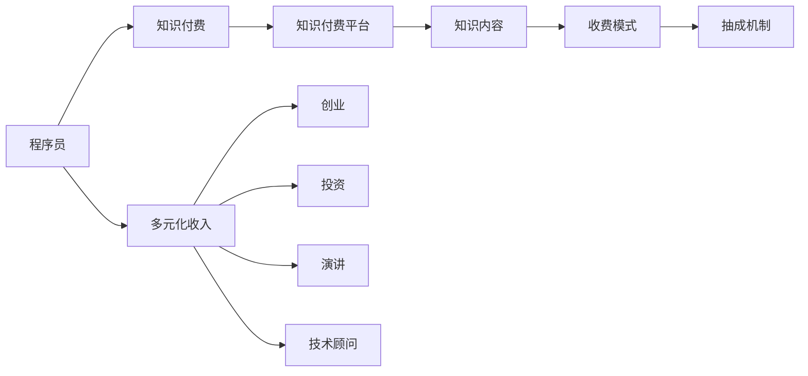

                 

# 程序员的知识付费收入多元化策略

## 1. 背景介绍

随着互联网技术的发展，程序员在社会中扮演的角色越来越重要，不仅限于软件开发，还包括数据分析、网络安全、人工智能等多个领域。然而，单靠工资收入难以实现高收入和职业成长，因此许多程序员开始寻找多元化收入渠道，以提高经济收益。知识付费作为一种新兴的收入方式，逐渐受到程序员们的关注。本文将深入探讨程序员如何进行知识付费收入的多元化策略，结合实际案例和理论分析，提出具体的实施方案。

## 2. 核心概念与联系

### 2.1 核心概念概述

在探讨知识付费多元化收入策略之前，首先需要了解一些核心概念：

- **知识付费**：指通过互联网平台提供有价值的知识内容，向用户收取费用，包括线上线下课程、图书、咨询服务、技术支持等形式。
- **程序员**：具有软件开发、系统维护、数据分析等技术能力的专业人才。
- **多元化收入**：指除了传统工资收入外，通过多种方式获得收入，包括创业、投资、演讲、技术顾问等。
- **知识付费平台**：如Coursera、Udemy、知乎live、腾讯课堂等，提供知识付费内容，并从中抽取佣金。

这些概念之间的联系主要体现在通过知识付费平台，程序员可以将自己的专业知识转化为货币收入，从而实现多元化收入目标。

### 2.2 核心概念原理和架构的 Mermaid 流程图



## 3. 核心算法原理 & 具体操作步骤

### 3.1 算法原理概述

知识付费收入多元化策略的核心在于利用自身的技术优势和专业知识，通过不同的渠道和方式获得收入。具体而言，可以将知识付费的算法分为以下几个步骤：

1. **知识生产与梳理**：将自身的技术知识整理成易于理解、传授的内容。
2. **平台选择与入驻**：选择合适的知识付费平台，创建账号并上传内容。
3. **内容推广与营销**：通过社交媒体、专业论坛、个人博客等渠道推广内容。
4. **用户互动与反馈**：与用户互动，收集反馈，改进内容质量。
5. **数据分析与优化**：利用平台提供的数据分析工具，优化内容和营销策略。

### 3.2 算法步骤详解

以下详细介绍每个步骤的详细操作方法：

#### 3.2.1 知识生产与梳理

知识生产是整个策略的基础。具体步骤包括：

1. **需求分析**：确定目标受众，了解他们的知识需求。
2. **内容设计**：将复杂的知识点拆解成易于理解的部分，如代码示例、视频教程、图文教程等。
3. **内容梳理**：确保内容逻辑清晰、结构合理，便于学习。

#### 3.2.2 平台选择与入驻

选择合适的知识付费平台是成功的重要一步。具体步骤包括：

1. **平台调研**：了解不同平台的优缺点、受众定位、收费模式等。
2. **账号创建**：注册账号并完善个人信息。
3. **内容上传**：按照平台要求上传内容，包括课程大纲、视频、PPT等。
4. **定价策略**：根据成本、市场需求、平台收费标准等因素，制定合理的收费策略。

#### 3.2.3 内容推广与营销

内容推广是增加曝光率和用户参与度的关键步骤。具体步骤包括：

1. **社交媒体**：在LinkedIn、GitHub、Twitter等平台发布内容，吸引关注。
2. **专业论坛**：在Stack Overflow、知乎、Reddit等技术社区分享知识。
3. **个人博客**：在自己的博客中发布文章，引导用户访问付费内容。
4. **SEO优化**：通过关键词优化，提升内容的搜索引擎排名。

#### 3.2.4 用户互动与反馈

与用户互动是提升内容质量和用户体验的重要手段。具体步骤包括：

1. **用户评论**：积极回复用户的评论和提问，解答疑问。
2. **用户反馈**：根据用户反馈调整内容，优化课程结构。
3. **用户社群**：建立用户社群，定期举办问答、讨论活动。

#### 3.2.5 数据分析与优化

数据分析是不断优化内容的关键。具体步骤包括：

1. **数据收集**：利用平台提供的分析工具，收集用户行为数据。
2. **数据解读**：分析用户访问数据、购买数据、互动数据等，识别用户需求。
3. **内容优化**：根据数据反馈，改进内容质量，调整营销策略。

### 3.3 算法优缺点

知识付费收入多元化策略具有以下优点：

1. **灵活性强**：可以自主决定内容、定价、推广方式等。
2. **收入稳定**：通过知识付费平台收取费用，收入相对稳定。
3. **提升影响力**：通过发布高质量内容，提升自身技术水平和影响力。

但同时也存在一些缺点：

1. **成本投入**：初期制作内容和推广费用较高。
2. **竞争激烈**：知识付费市场竞争激烈，需要持续创新。
3. **用户留存**：维持用户长期参与需要不断更新内容。

### 3.4 算法应用领域

知识付费收入多元化策略不仅适用于软件开发者，还适用于数据分析师、网络安全专家、人工智能研究员等多个技术领域。具体应用领域包括：

- **课程制作与销售**：通过平台发布课程，如Python编程、数据科学、网络安全等。
- **书籍撰写与出版**：将自己的技术心得整理成书籍，并通过电商平台销售。
- **技术咨询与辅导**：提供专业解答、项目咨询、代码审查等服务。
- **技术培训与讲座**：在线下或线上进行技术讲座、培训。

## 4. 数学模型和公式 & 详细讲解 & 举例说明

### 4.1 数学模型构建

知识付费收入的数学模型主要涉及用户需求、内容质量、推广效果、用户反馈等多方面因素。假设一个课程的收入为$R$，用户数量为$U$，每个用户的付费率为$P$，推广费用为$C$，内容生产成本为$C_c$，用户反馈改善成本为$C_f$。则收入模型可以表示为：

$$ R = U \cdot P - C - C_c - C_f $$

### 4.2 公式推导过程

1. **用户数量$U$**：
   - 用户数量与内容质量和推广效果相关，可通过数据分析得出。
   - 设内容质量为$Q$，推广效果为$E$，则$U = f(Q, E)$。
   
2. **付费率$P$**：
   - 付费率与用户需求、课程价值、市场竞争相关。
   - 设用户需求为$D$，课程价值为$V$，市场竞争为$C$，则$P = g(D, V, C)$。
   
3. **推广费用$C$**：
   - 推广费用包括社交媒体广告、平台抽成等。
   - 设广告费用为$A$，平台抽成为$T$，则$C = A + T$。
   
4. **内容生产成本$C_c$**：
   - 内容生产成本包括素材准备、视频剪辑、PPT制作等。
   - 设素材成本为$M$，视频剪辑成本为$V$，PPT制作成本为$P$，则$C_c = M + V + P$。
   
5. **用户反馈改善成本$C_f$**：
   - 用户反馈改善成本包括内容更新、用户互动等。
   - 设内容更新成本为$U$，用户互动成本为$I$，则$C_f = U + I$。

### 4.3 案例分析与讲解

假设某个课程的内容质量$Q$为0.9，推广效果$E$为0.8，用户需求$D$为0.7，课程价值$V$为0.9，市场竞争$C$为0.1。通过数据分析，推广费用$C$为1000元，内容生产成本$C_c$为5000元，用户反馈改善成本$C_f$为2000元。

则课程收入$R$为：

$$ R = U \cdot P - C - C_c - C_f $$
$$ = f(0.9, 0.8) \cdot g(0.7, 0.9, 0.1) - 1000 - 5000 - 2000 $$
$$ = 100 \cdot 0.9 - 1000 - 5000 - 2000 $$
$$ = -6000 $$

这说明课程的收入为负，需要进一步优化。例如，可以通过提升内容质量、降低推广费用、控制内容生产成本等方式，提高课程收入。

## 5. 项目实践：代码实例和详细解释说明

### 5.1 开发环境搭建

1. **编程语言选择**：Python是最常用的语言，具有丰富的库和工具支持。
2. **开发工具选择**：可以使用IDE如PyCharm、VSCode，以及版本控制工具如Git。
3. **平台选择**：选择知识付费平台如Coursera、Udemy、知乎live等，注册账号并完善信息。

### 5.2 源代码详细实现

以下是一个简单的Python代码示例，用于在线上知识付费平台上发布课程内容。

```python
import requests

# 登录知识付费平台
def login(username, password):
    # 模拟登录请求，获取session
    login_url = 'https://example.com/login'
    session = requests.Session()
    response = session.post(login_url, data={'username': username, 'password': password})
    if response.status_code == 200:
        return session
    else:
        raise Exception('登录失败')

# 发布课程内容
def publish_content(session, title, content, price):
    # 发布课程请求，返回课程ID
    publish_url = 'https://example.com/publish'
    data = {'title': title, 'content': content, 'price': price}
    response = session.post(publish_url, data=data)
    if response.status_code == 200:
        return response.json()['id']
    else:
        raise Exception('发布失败')

# 上传课程素材
def upload_material(session, course_id, file_path):
    # 上传素材请求，返回素材ID
    upload_url = 'https://example.com/upload'
    file = open(file_path, 'rb')
    response = session.post(upload_url, files={'file': file}, data={'course_id': course_id})
    if response.status_code == 200:
        return response.json()['id']
    else:
        raise Exception('上传失败')

# 使用示例
session = login('username', 'password')
course_id = publish_content(session, 'Python编程入门', 'Python编程教程内容', 99)
material_id = upload_material(session, course_id, 'python_tutorial.mp4')
print('课程发布成功，素材上传成功')
```

### 5.3 代码解读与分析

该代码示例通过Python模拟了在知识付费平台上发布课程和上传素材的过程。其中，`login`函数用于模拟登录请求，获取session；`publish_content`函数用于发布课程内容，返回课程ID；`upload_material`函数用于上传课程素材，返回素材ID。

### 5.4 运行结果展示

运行上述代码后，可以在知识付费平台上看到新发布的课程和上传的素材。用户可以通过该课程进行学习，并支付相应的费用。

## 6. 实际应用场景

### 6.4 未来应用展望

知识付费收入多元化策略在实际应用中前景广阔，未来可能会在以下方面得到进一步发展：

1. **课程多样化**：除了技术类课程，还可以扩展到生活技能、艺术修养、金融投资等领域。
2. **平台多样化**：除了知识付费平台，还可以利用B站、YouTube等视频平台发布内容。
3. **内容形式多样化**：除了课程和书籍，还可以发布技术博客、技术视频、技术讲座等。
4. **全球化推广**：通过多语言翻译和本地化推广，开拓全球市场。

## 7. 工具和资源推荐

### 7.1 学习资源推荐

1. **《知识付费：从0到1》**：详细介绍知识付费行业的现状和发展趋势，适合刚入门的程序员。
2. **《知乎Live实战指南》**：知乎官方出版的实战指南，涵盖知乎Live的创建、推广、运营等各个方面。
3. **Coursera开发者课程**：Coursera平台上的开发者课程，涵盖Python、Java、数据科学等多个技术领域。
4. **Udemy编程课程**：Udemy平台上的编程课程，覆盖从入门到高级的技术内容。

### 7.2 开发工具推荐

1. **PyCharm**：功能强大的IDE，支持Python开发。
2. **VSCode**：轻量级、跨平台的IDE，支持Python开发和调试。
3. **Git**：流行的版本控制工具，方便代码管理和团队协作。
4. **Jupyter Notebook**：支持Python代码和Markdown的混合开发环境，适合数据科学和机器学习任务。

### 7.3 相关论文推荐

1. **《知识付费行业的现状与发展趋势》**：一篇系统介绍知识付费行业的学术文章，适合对行业现状和趋势感兴趣的读者。
2. **《技术知识付费的实践与创新》**：探讨技术知识付费的实践经验和创新模式，适合对技术内容开发感兴趣的读者。
3. **《知识付费平台的商业模式分析》**：分析知识付费平台的商业模式，探讨其盈利模式和市场策略，适合对平台运营感兴趣的读者。

## 8. 总结：未来发展趋势与挑战

### 8.1 研究成果总结

本文详细介绍了程序员如何进行知识付费收入的多元化策略，从知识生产、平台选择、内容推广、用户互动、数据分析等多个方面进行了阐述。通过实际案例和数学模型，展示了知识付费收入多元化的操作路径和关键点。

### 8.2 未来发展趋势

未来知识付费收入多元化策略将呈现以下几个发展趋势：

1. **课程内容多样化**：课程内容将从技术类扩展到生活技能、艺术修养、金融投资等多个领域。
2. **平台多样化**：除了知识付费平台，还会利用B站、YouTube等视频平台发布内容。
3. **内容形式多样化**：除了课程和书籍，还会发布技术博客、技术视频、技术讲座等。
4. **全球化推广**：通过多语言翻译和本地化推广，开拓全球市场。

### 8.3 面临的挑战

尽管知识付费收入多元化策略具有很多优点，但也面临以下挑战：

1. **成本投入**：初期制作内容和推广费用较高。
2. **竞争激烈**：知识付费市场竞争激烈，需要持续创新。
3. **用户留存**：维持用户长期参与需要不断更新内容。
4. **内容质量**：高质量内容的制作需要时间和精力投入。

### 8.4 研究展望

未来的研究需要在以下几个方面寻求新的突破：

1. **内容生产效率**：通过技术手段提升内容制作效率，降低成本。
2. **市场定位**：通过数据分析，精准定位目标用户，优化推广策略。
3. **内容质量提升**：通过算法优化，提升内容质量，提高用户满意度。
4. **多渠道运营**：探索更多平台和渠道，扩大市场影响力。

## 9. 附录：常见问题与解答

**Q1：知识付费多元化收入是否适用于所有程序员？**

A: 知识付费多元化收入策略适用于具有一定技术积累和知识传授能力的程序员。需要注意的是，不同技术领域的知识付费市场不同，需要选择合适的领域进行开发。

**Q2：如何选择知识付费平台？**

A: 选择知识付费平台需要考虑平台的用户基数、用户质量、收费模式、推广效果等因素。可以通过调研、试用等方式，选择适合自己的平台。

**Q3：如何提升内容质量？**

A: 提升内容质量需要从内容设计、内容讲解、用户反馈等多个方面入手。可以参考行业内优秀的内容，不断优化自己的内容。

**Q4：如何进行用户互动？**

A: 用户互动可以通过在线答疑、社群交流、用户调查等方式进行。积极与用户互动，可以提升用户粘性和满意度。

**Q5：如何优化推广策略？**

A: 优化推广策略需要分析用户行为数据，了解用户需求，选择合适的推广渠道和方式。可以利用A/B测试、数据分析等手段，不断优化推广效果。

---

作者：禅与计算机程序设计艺术 / Zen and the Art of Computer Programming

