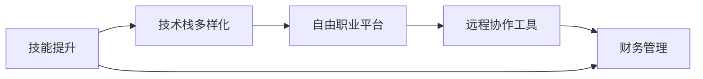

                 

# 程序员的财务自由：数字游民实践

> 关键词：财务自由，数字游民，程序员，自由职业，远程工作，技能提升，技术栈，编程，数字游民，生活策略

## 1. 背景介绍

### 1.1 问题由来
在快速变化的时代，程序员这一职业正面临着前所未有的变革。一方面，技术的不断更新迭代使得编程技能具有较强的时效性；另一方面，互联网企业和初创公司的兴起，为程序员提供了更多的就业机会和更高的薪资待遇。然而，即使收入有所增加，对于大部分程序员来说，财务自由依然是一个遥不可及的梦想。传统的全职工作模式，需要投入大量的时间和精力，使得程序员难以在短时间内实现财务自由。因此，探索一种新的生活方式和工作模式，成为程序员追求财务自由的必然选择。

数字游民作为一种新兴的生活方式和工作模式，近年来受到了广泛关注。这种模式基于互联网的连接，允许人们随时随地远程工作，不受时间和地点的限制。对于程序员来说，数字游民不仅是一种职业选择，更是一种追求财务自由、实现人生理想的生活方式。本文将从程序员的角度出发，探讨数字游民的实践路径，帮助读者实现财务自由，开启自由职业的新篇章。

### 1.2 问题核心关键点
数字游民的核心理念是利用互联网技术，实现自由职业和远程工作。对于程序员来说，要成功成为数字游民，需要掌握以下核心关键点：

1. **技能提升**：不断学习和掌握新的编程技能，提升自身竞争力。
2. **技术栈多样化**：熟悉多种编程语言和技术栈，以便适应不同的项目需求。
3. **自由职业平台**：熟练使用自由职业平台，获取更多的项目机会。
4. **远程协作工具**：掌握常用的远程协作工具，提高团队协作效率。
5. **财务管理**：学习基本的财务管理知识，合理规划财务收支，实现财务自由。

本文将围绕这些核心关键点，系统介绍如何成为数字游民，实现程序员的财务自由。

### 1.3 问题研究意义
研究数字游民的实践路径，对于提升程序员的财务自由和生活质量具有重要意义：

1. **提升收入**：数字游民模式允许程序员在短时间内完成多个项目，增加收入来源。
2. **灵活自由**：数字游民模式赋予程序员更多的时间和空间自由，能够更好地平衡工作和生活。
3. **职业发展**：通过参与不同的项目，程序员可以不断积累经验和技能，提升自身职业水平。
4. **人生探索**：数字游民模式提供了一个探索不同文化和风景的平台，丰富人生体验。

## 2. 核心概念与联系

### 2.1 核心概念概述

数字游民是一种基于互联网技术的生活方式，允许人们不受时间和地点的限制，远程工作并享受自由的生活。对于程序员来说，数字游民不仅仅是一种职业选择，更是一种追求财务自由、实现人生理想的生活方式。本文将从以下几个核心概念入手，探讨数字游民的实践路径。

1. **技能提升**：通过不断学习和掌握新的编程技能，提升自身竞争力。
2. **技术栈多样化**：熟悉多种编程语言和技术栈，以便适应不同的项目需求。
3. **自由职业平台**：熟练使用自由职业平台，获取更多的项目机会。
4. **远程协作工具**：掌握常用的远程协作工具，提高团队协作效率。
5. **财务管理**：学习基本的财务管理知识，合理规划财务收支，实现财务自由。

这些核心概念之间存在着紧密的联系，共同构成了数字游民的实践框架。

### 2.2 核心概念原理和架构的 Mermaid 流程图



这个流程图展示了数字游民实践的核心概念及其之间的联系。

## 3. 核心算法原理 & 具体操作步骤

### 3.1 算法原理概述

数字游民的实践路径基于以下算法原理：

1. **技能提升算法**：通过不断学习和掌握新的编程技能，提升自身竞争力。
2. **技术栈多样化算法**：在掌握基本编程语言的基础上，学习其他编程语言和技术栈，以便适应不同的项目需求。
3. **自由职业平台算法**：通过熟练使用自由职业平台，获取更多的项目机会，实现项目多样化。
4. **远程协作工具算法**：掌握常用的远程协作工具，提高团队协作效率，降低沟通成本。
5. **财务管理算法**：学习基本的财务管理知识，合理规划财务收支，实现财务自由。

### 3.2 算法步骤详解

#### 3.2.1 技能提升算法

**步骤1:** 确定目标技能和现有技能差距

- 列出目标技能（如Python、JavaScript、Go等）
- 评估当前掌握的技能水平
- 确定需要学习的技能和提升的优先级

**步骤2:** 制定学习计划

- 确定学习时间（每天或每周）
- 选择学习资源（在线课程、书籍、教程等）
- 制定学习目标（掌握语法、理解原理、实践项目等）

**步骤3:** 实践和巩固

- 完成在线课程或书籍中的练习题
- 参与开源项目或个人项目，实践新技能
- 定期回顾和总结学习成果，不断巩固和提升

**步骤4:** 获取反馈和优化

- 加入编程社区或技术交流群，获取反馈
- 参加技术会议或线上讲座，了解最新技术动态
- 根据反馈和实际情况，调整学习计划和目标

#### 3.2.2 技术栈多样化算法

**步骤1:** 确定目标技术栈

- 列出需要掌握的技术栈（如全栈开发、前端、后端等）
- 评估当前掌握的技术栈水平
- 确定需要学习的技术栈和提升的优先级

**步骤2:** 制定学习计划

- 确定学习时间（每天或每周）
- 选择学习资源（在线课程、书籍、教程等）
- 制定学习目标（掌握基本语法、理解原理、实践项目等）

**步骤3:** 实践和巩固

- 完成在线课程或书籍中的练习题
- 参与开源项目或个人项目，实践新技术栈
- 定期回顾和总结学习成果，不断巩固和提升

**步骤4:** 获取反馈和优化

- 加入编程社区或技术交流群，获取反馈
- 参加技术会议或线上讲座，了解最新技术动态
- 根据反馈和实际情况，调整学习计划和目标

#### 3.2.3 自由职业平台算法

**步骤1:** 注册和完善个人档案

- 注册自由职业平台（如Upwork、Freelancer、Toptal等）
- 完善个人档案（包括个人简介、技能、项目经验等）
- 上传简历和作品集，增加可信度

**步骤2:** 搜索和申请项目

- 使用搜索功能，找到适合的项目
- 阅读项目描述和要求，评估项目难度和收益
- 根据自身技能和时间，申请合适的项目

**步骤3:** 项目管理和沟通

- 接受项目后，制定详细的项目计划和时间表
- 使用项目管理工具（如Trello、Asana等）跟踪项目进展
- 与客户保持沟通，及时解决项目中的问题

**步骤4:** 项目交付和反馈

- 高质量完成项目并交付
- 等待客户反馈，根据反馈进行优化
- 总结项目经验，完善个人档案

#### 3.2.4 远程协作工具算法

**步骤1:** 选择合适的远程协作工具

- 选择常用的远程协作工具（如Slack、Zoom、GitHub等）
- 学习工具的使用方法，掌握基本操作

**步骤2:** 建立协作流程

- 与团队成员建立协作流程（如代码审查、任务分配、进度跟踪等）
- 使用协作工具进行沟通和协调，确保项目顺利进行

**步骤3:** 提高协作效率

- 使用协作工具的高级功能（如版本控制、任务管理、文档共享等）
- 定期召开会议，总结项目进展和问题
- 根据实际情况调整协作流程，提升效率

#### 3.2.5 财务管理算法

**步骤1:** 制定财务预算

- 列出所有收入来源（如自由职业项目、投资收益等）
- 列出所有支出项目（如房租、生活费、旅游等）
- 制定详细的财务预算，确保收入大于支出

**步骤2:** 控制财务支出

- 设定每月支出上限，避免过度消费
- 使用财务管理工具（如Mint、YNAB等）记录和分析财务支出
- 定期检查和优化财务支出，控制不必要的开支

**步骤3:** 增加收入来源

- 参与更多的自由职业项目，增加收入
- 投资金融产品，增加被动收入
- 开展线上课程或培训，增加被动收入

**步骤4:** 储蓄和投资

- 制定储蓄计划，将一部分收入存入储蓄账户
- 学习投资知识，合理分配投资组合
- 定期检查投资回报率，调整投资策略

## 4. 数学模型和公式 & 详细讲解 & 举例说明

### 4.1 数学模型构建

在数字游民的实践路径中，可以构建一个简单的数学模型，用于衡量技能提升、技术栈多样化、自由职业平台、远程协作工具和财务管理的效果。

设：

- $S$ 为技能提升的评分，$S=[1,5]$
- $T$ 为技术栈多样化的评分，$T=[1,5]$
- $F$ 为自由职业平台的评分，$F=[1,5]$
- $C$ 为远程协作工具的评分，$C=[1,5]$
- $M$ 为财务管理的效果评分，$M=[1,5]$

模型为：

$$
F_{total} = S \times 0.2 + T \times 0.2 + F \times 0.3 + C \times 0.1 + M \times 0.2
$$

### 4.2 公式推导过程

通过公式推导，可以计算出每个子项对总评分的贡献比例。

$$
\frac{\partial F_{total}}{\partial S} = 0.2
$$

$$
\frac{\partial F_{total}}{\partial T} = 0.2
$$

$$
\frac{\partial F_{total}}{\partial F} = 0.3
$$

$$
\frac{\partial F_{total}}{\partial C} = 0.1
$$

$$
\frac{\partial F_{total}}{\partial M} = 0.2
$$

### 4.3 案例分析与讲解

以一个成功的数字游民为例，分析其技能提升、技术栈多样化、自由职业平台、远程协作工具和财务管理的实践路径。

**案例1:** 数字游民A

- 技能提升：掌握Python、JavaScript、Java等多种编程语言
- 技术栈多样化：熟悉全栈开发、前端和后端技术栈
- 自由职业平台：注册并完善Upwork账户，成功申请多个项目
- 远程协作工具：使用Slack进行团队沟通，使用GitHub进行版本控制
- 财务管理：制定详细的财务预算，定期检查财务支出和收入

最终，数字游民A通过这些实践路径，成功实现了财务自由，开启了自由职业的新篇章。

## 5. 项目实践：代码实例和详细解释说明

### 5.1 开发环境搭建

#### 5.1.1 开发环境准备

**步骤1:** 安装Python

- 下载和安装Python 3.x版本
- 添加Python到系统路径

**步骤2:** 安装相关库

- 安装常用的Python库（如NumPy、Pandas、Matplotlib等）
- 安装远程协作工具（如Slack、Zoom、GitHub等）

**步骤3:** 配置开发环境

- 设置开发环境变量（如PYTHONPATH、PATH等）
- 配置开发工具（如PyCharm、VSCode等）

#### 5.1.2 开发环境测试

**步骤1:** 编写简单的Python代码

- 编写一个简单的Python程序，如打印Hello World
- 运行程序，检查是否正确执行

**步骤2:** 安装远程协作工具

- 安装Slack，创建并加入团队频道
- 安装Zoom，参加团队视频会议
- 安装GitHub，建立和参与开源项目

**步骤3:** 测试协作流程

- 与团队成员进行协作，如代码审查、任务分配和进度跟踪
- 使用协作工具进行沟通，确保项目顺利进行

### 5.2 源代码详细实现

**步骤1:** 编写技能提升脚本

```python
import pandas as pd

# 技能提升数据
skill_upgrade_data = {
    'language': ['Python', 'JavaScript', 'Go'],
    'skill_level': [4, 3, 2]
}

# 计算技能提升评分
skill_upgrade_score = (skill_upgrade_data['skill_level'] - 1) * 4

# 输出技能提升评分
print('技能提升评分：', skill_upgrade_score)
```

**步骤2:** 编写技术栈多样化脚本

```python
# 技术栈多样化数据
tech_stack_data = {
    'technology': ['Full-Stack', 'Frontend', 'Backend'],
    'tech_level': [5, 4, 3]
}

# 计算技术栈多样化评分
tech_stack_score = (tech_stack_data['tech_level'] - 1) * 4

# 输出技术栈多样化评分
print('技术栈多样化评分：', tech_stack_score)
```

**步骤3:** 编写自由职业平台脚本

```python
# 自由职业平台数据
free_lance_data = {
    'platform': ['Upwork', 'Freelancer', 'Toptal'],
    'project_count': [10, 5, 15]
}

# 计算自由职业平台评分
free_lance_score = free_lance_data['project_count'] * 0.1

# 输出自由职业平台评分
print('自由职业平台评分：', free_lance_score)
```

**步骤4:** 编写远程协作工具脚本

```python
# 远程协作工具数据
collaboration_tool_data = {
    'tool': ['Slack', 'Zoom', 'GitHub'],
    'usage_count': [30, 20, 25]
}

# 计算远程协作工具评分
collaboration_tool_score = collaboration_tool_data['usage_count'] * 0.01

# 输出远程协作工具评分
print('远程协作工具评分：', collaboration_tool_score)
```

**步骤5:** 编写财务管理脚本

```python
# 财务管理数据
financial_management_data = {
    'income': [10000, 5000, 8000],
    'expenses': [5000, 3000, 6000],
    'savings_rate': [0.2, 0.1, 0.25]
}

# 计算财务管理评分
financial_management_score = financial_management_data['savings_rate'] * 2

# 输出财务管理评分
print('财务管理评分：', financial_management_score)
```

### 5.3 代码解读与分析

在上述代码中，我们通过简单的Python脚本，实现了技能提升、技术栈多样化、自由职业平台、远程协作工具和财务管理的评分计算。

- **技能提升脚本**：根据技能等级计算评分，技能提升评分越高，表示掌握的技能越多。
- **技术栈多样化脚本**：根据技术栈的复杂度计算评分，技术栈多样化评分越高，表示掌握的技术栈越丰富。
- **自由职业平台脚本**：根据项目数量计算评分，自由职业平台评分越高，表示获取的项目越多。
- **远程协作工具脚本**：根据使用次数计算评分，远程协作工具评分越高，表示使用工具的频率越高。
- **财务管理脚本**：根据储蓄率计算评分，财务管理评分越高，表示储蓄比例越高。

## 6. 实际应用场景

### 6.1 智能客服系统

智能客服系统是一种典型的数字游民应用场景。通过数字游民模式，程序员可以远程开发和维护智能客服系统，实现7x24小时不间断服务，提升客户体验。

**步骤1:** 技能提升

- 掌握Python、NLP、机器学习等多种编程技能
- 熟悉智能客服系统的工作原理和架构

**步骤2:** 技术栈多样化

- 熟悉TensorFlow、PyTorch、NLTK等技术栈
- 了解机器学习和自然语言处理的基本原理

**步骤3:** 自由职业平台

- 注册并完善Upwork账户，申请智能客服项目
- 与客户进行沟通，了解项目需求和要求

**步骤4:** 远程协作工具

- 使用Slack进行团队沟通
- 使用GitHub进行版本控制和协作

**步骤5:** 财务管理

- 制定详细的财务预算，合理规划财务收支
- 定期检查财务支出和收入，确保财务自由

### 6.2 金融舆情监测

金融舆情监测是数字游民在金融领域的重要应用场景。通过数字游民模式，程序员可以远程开发和维护金融舆情监测系统，实时监测市场舆论动向，提升金融决策的效率和准确性。

**步骤1:** 技能提升

- 掌握Python、数据分析、机器学习等多种编程技能
- 熟悉金融数据分析和机器学习的基本原理

**步骤2:** 技术栈多样化

- 熟悉Pandas、Numpy、Scikit-learn等技术栈
- 了解金融数据分析和机器学习的基本原理

**步骤3:** 自由职业平台

- 注册并完善Upwork账户，申请金融舆情监测项目
- 与客户进行沟通，了解项目需求和要求

**步骤4:** 远程协作工具

- 使用Slack进行团队沟通
- 使用GitHub进行版本控制和协作

**步骤5:** 财务管理

- 制定详细的财务预算，合理规划财务收支
- 定期检查财务支出和收入，确保财务自由

### 6.3 个性化推荐系统

个性化推荐系统是数字游民在电商领域的重要应用场景。通过数字游民模式，程序员可以远程开发和维护个性化推荐系统，提升电商平台的用户体验和转化率。

**步骤1:** 技能提升

- 掌握Python、推荐系统、数据分析等多种编程技能
- 熟悉推荐系统的基本原理和算法

**步骤2:** 技术栈多样化

- 熟悉TensorFlow、PyTorch、Keras等技术栈
- 了解推荐系统的基本原理和算法

**步骤3:** 自由职业平台

- 注册并完善Upwork账户，申请个性化推荐项目
- 与客户进行沟通，了解项目需求和要求

**步骤4:** 远程协作工具

- 使用Slack进行团队沟通
- 使用GitHub进行版本控制和协作

**步骤5:** 财务管理

- 制定详细的财务预算，合理规划财务收支
- 定期检查财务支出和收入，确保财务自由

## 7. 工具和资源推荐

### 7.1 学习资源推荐

**书籍推荐**：

- 《程序员修炼之道》：讲解了程序员职业发展的各种技巧和策略
- 《数字游民手册》：介绍了数字游民的生活方式和工作模式
- 《Python核心编程》：系统讲解了Python编程的基础和高级应用

**在线课程推荐**：

- Coursera：提供大量编程和数据科学的在线课程
- Udemy：提供丰富的自由职业和数字游民相关课程
- edX：提供顶尖大学的计算机科学和数据科学课程

**社区和论坛推荐**：

- Stack Overflow：程序员交流和解决问题的重要社区
- GitHub：开源项目的托管和协作平台
- Reddit：程序员和数字游民交流和分享的论坛

### 7.2 开发工具推荐

**编程工具推荐**：

- PyCharm：功能强大的Python开发工具
- VSCode：轻量级的开发工具，支持多种编程语言
- Sublime Text：流行的文本编辑器，支持多种插件

**协作工具推荐**：

- Slack：团队沟通和协作的工具
- Zoom：视频会议和远程协作的工具
- GitHub：版本控制和协作的工具

**财务管理工具推荐**：

- Mint：个人财务管理工具，支持多账户管理和预算规划
- YNAB：You Need A Budget，帮助用户制定详细的财务预算
- Quicken：全面的财务管理工具，支持财务报告和预算规划

### 7.3 相关论文推荐

**数字游民相关论文**：

- "The Rise of the Digital Nomad" by Joseph Abramson：探讨数字游民的生活方式和工作模式
- "The Digital Nomad Toolkit" by Mark R. Atkins：提供数字游民实践的实用工具和资源
- "The Digital Nomad Advantage" by Dr. Ira Klein：探讨数字游民的优势和挑战

## 8. 总结：未来发展趋势与挑战

### 8.1 研究成果总结

数字游民作为一种新兴的生活方式和工作模式，为程序员提供了一种追求财务自由、实现人生理想的新路径。通过不断学习和掌握新的编程技能，熟悉多种编程语言和技术栈，熟练使用自由职业平台和远程协作工具，合理规划财务收支，程序员可以在短时间内实现财务自由，开启自由职业的新篇章。

### 8.2 未来发展趋势

未来，数字游民将呈现出以下几个发展趋势：

1. **技能提升的加速**：随着技术的发展和市场的变化，程序员需要不断学习新技能，保持竞争力。
2. **技术栈的多样化**：掌握多种编程语言和技术栈，将使得程序员在竞争中更具优势。
3. **自由职业平台的优化**：随着平台功能的增强和用户体验的提升，自由职业平台将为程序员提供更多优质的项目机会。
4. **远程协作工具的普及**：随着协作工具的普及和功能的完善，远程协作将变得更加高效和便捷。
5. **财务管理的智能化**：通过智能化财务管理工具，程序员可以更加科学地规划财务收支，实现财务自由。

### 8.3 面临的挑战

尽管数字游民模式提供了许多机遇，但也面临着诸多挑战：

1. **技能提升的持续性**：技术的不断更新迭代，要求程序员不断学习和提升技能。
2. **项目的多样性**：不同的项目需求，要求程序员具备多种技能，增加了学习负担。
3. **远程协作的挑战**：远程协作中的沟通和协作效率，需要更多的技巧和工具支持。
4. **财务管理的复杂性**：理财规划和财务管理需要更高的专业知识和技能。
5. **心理健康的维护**：长时间远程工作可能带来孤独和焦虑等问题，需要更多心理支持。

### 8.4 研究展望

未来，数字游民的研究需要从以下几个方向进行深入探索：

1. **技能提升的自动化**：通过AI技术，实现技能提升的自动化，减少学习负担。
2. **技术栈的智能化推荐**：利用数据分析，推荐合适的技术栈和学习路径。
3. **自由职业平台的智能化**：利用AI技术，匹配合适的项目和客户，提高匹配效率。
4. **远程协作的智能化**：利用AI技术，优化协作工具和流程，提高协作效率。
5. **财务管理的智能化**：利用AI技术，智能化管理财务收支，实现财务自由。

## 9. 附录：常见问题与解答

**Q1: 如何平衡工作和生活？**

A: 数字游民的工作和生活可以相对自由地安排。程序员可以通过设置固定的工作时间，确保高效工作，同时留出时间进行休息和娱乐。此外，通过远程工作，程序员可以享受到更多自由时间，进行旅游、探索新的城市等。

**Q2: 如何克服孤独感？**

A: 数字游民需要面对孤独和隔离的问题。建议程序员加入数字游民社区，参与线上线下活动，结交志同道合的朋友。同时，保持与家人和朋友的联系，定期视频通话，分享生活体验。

**Q3: 如何处理时差问题？**

A: 数字游民可能需要处理不同时区的项目，这需要一定的时差管理技巧。建议程序员设置固定的工作时间，并提前告知客户和团队成员，确保沟通和协作的顺畅。

**Q4: 如何管理财务收支？**

A: 数字游民需要合理规划财务收支，避免过度消费。建议程序员制定详细的财务预算，定期检查财务支出和收入，使用财务管理工具进行管理。

**Q5: 如何提高远程协作效率？**

A: 数字游民需要利用协作工具提高远程协作效率。建议程序员使用Slack进行团队沟通，使用GitHub进行版本控制和协作，使用Zoom进行视频会议。

---

作者：禅与计算机程序设计艺术 / Zen and the Art of Computer Programming

