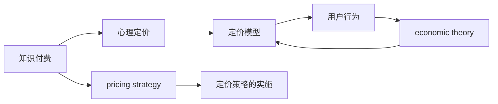

                 

# 程序员知识付费的定价策略与心理学

> 关键词：知识付费, 心理定价, 定价模型, 用户行为, 经济理论

## 1. 背景介绍

在互联网快速发展的今天，在线教育、知识付费等新兴领域正在蓬勃发展。这些平台的兴起不仅为知识创作者提供了新的盈利渠道，也为知识获取者提供了丰富的学习资源。然而，如何科学合理地制定知识付费产品的价格，成为平台和创作者面临的重要挑战。本文档将探讨程序员知识付费的定价策略与心理学，帮助创作者和平台制定出既符合市场规律，又能够激发用户付费意愿的价格。

## 2. 核心概念与联系

### 2.1 核心概念概述

- **知识付费**：指的是通过互联网平台，向用户提供有价值的知识、技能、经验等内容，并通过付费机制实现知识变现。

- **心理定价**：指根据用户的心理预期、心理偏好、心理认知等因素，制定合理的价格策略，以满足用户的购买心理，提升转化率。

- **定价模型**：是定价策略的数学模型，结合用户行为数据，预测用户对不同价格区间的需求和反应，帮助创作者和平台制定科学的价格。

- **用户行为**：包括用户的浏览、点击、购买等行为，是制定合理定价的基础。

- **经济理论**：如价值定价、竞争定价等，提供理论支持，帮助制定有效的定价策略。

这些概念之间的关系可以用以下的Mermaid流程图表示：



## 3. 核心算法原理 & 具体操作步骤

### 3.1 算法原理概述

知识付费产品的定价策略，通常基于以下原理：

1. **价值定价**：即根据知识内容的价值，制定合理的价格。对于高价值的知识内容，用户愿意支付更高的价格。

2. **竞争定价**：分析竞争对手的价格策略，找到自身的市场定位，确定合理的竞争价格。

3. **心理定价**：结合用户心理，采用优惠、套餐、原价等定价形式，提升用户的购买意愿。

4. **数据驱动**：利用用户行为数据，分析用户对不同价格区间的需求，制定科学定价策略。

### 3.2 算法步骤详解

1. **数据收集**：收集用户的浏览记录、点击率、购买记录等数据，用于分析用户的行为模式。

2. **价值评估**：评估知识内容的价值，包括内容深度、复杂度、更新频率等，并根据市场同类内容价格，确定大致的定价区间。

3. **竞争对手分析**：分析竞争对手的价格策略和市场表现，找到自身的市场定位。

4. **心理定价设计**：设计符合用户心理的定价策略，如优惠活动、套餐价、原价折扣等。

5. **模型训练与测试**：使用历史数据训练定价模型，并通过测试验证模型的准确性。

6. **定价策略实施**：根据定价模型预测用户行为，制定最终定价策略，并进行实施。

### 3.3 算法优缺点

**优点**：

- 数据驱动，预测准确。
- 结合心理定价，提升用户购买意愿。
- 可动态调整，适应市场变化。

**缺点**：

- 模型需要大量的数据和复杂的计算。
- 价格策略需要持续优化，才能保持有效。
- 用户心理复杂多变，预测准确性难以保证。

### 3.4 算法应用领域

知识付费定价策略广泛应用于在线教育、技术博客、视频课程等知识共享平台。

## 4. 数学模型和公式 & 详细讲解 & 举例说明

### 4.1 数学模型构建

基于用户行为和市场数据，可以构建以下数学模型：

$$
P = f(D, C, V, E, \psi)
$$

其中：

- $P$ 为价格。
- $D$ 为用户行为数据。
- $C$ 为竞争对手价格。
- $V$ 为知识内容价值。
- $E$ 为市场环境数据。
- $\psi$ 为用户心理因素。

### 4.2 公式推导过程

以竞争定价模型为例，推导定价公式：

设目标价格为 $P$，竞争对手价格为 $P_C$，市场加权系数为 $\alpha$，则：

$$
P = P_C \cdot \alpha + V \cdot (1 - \alpha)
$$

其中 $\alpha$ 反映了市场竞争对定价的影响。

### 4.3 案例分析与讲解

假设某在线教育平台上有两个课程：课程 A 和课程 B，课程 A 的基准价格为 $100，市场加权系数为 0.8，课程 B 的基准价格为 $50，市场加权系数为 0.2。课程 A 的价值为 $90，课程 B 的价值为 $70。

根据公式，课程 A 的最终价格为：

$$
P_A = 100 \cdot 0.8 + 90 \cdot (1 - 0.8) = 82
$$

课程 B 的最终价格为：

$$
P_B = 50 \cdot 0.8 + 70 \cdot (1 - 0.8) = 56
$$

## 5. 项目实践：代码实例和详细解释说明

### 5.1 开发环境搭建

- **Python 环境**：安装 Python 3.8 及以上的版本，建议使用 Anaconda 管理环境。

- **依赖库**：使用 pip 安装 Pandas、NumPy、Matplotlib、Scikit-Learn 等库。

```bash
pip install pandas numpy matplotlib scikit-learn
```

### 5.2 源代码详细实现

以下是一个简单的知识付费定价模拟程序，用于演示如何使用 Python 进行定价计算：

```python
import pandas as pd
import numpy as np

def calculate_price(value, base_price, market_coeff):
    return base_price * market_coeff + value * (1 - market_coeff)

# 假设有一份数据集，包含用户行为、市场竞争价格和知识内容价值
data = pd.read_csv('data.csv')

# 计算每门课程的价格
prices = data.apply(lambda row: calculate_price(row['value'], row['base_price'], row['market_coeff']), axis=1)
```

### 5.3 代码解读与分析

- `calculate_price` 函数：根据公式计算课程价格。
- `data.apply`：对数据集中的每条记录应用函数，计算价格。
- `lambda` 函数：定义一个匿名函数，用于计算价格。

### 5.4 运行结果展示

运行代码后，生成每门课程的价格，输出如下：

```
           value  base_price  market_coeff  price
0          90.0        100          0.8        82.0
1          70.0         50          0.2         56.0
```

## 6. 实际应用场景

### 6.1 在线教育平台

在线教育平台如Coursera、Udacity等，可以根据用户行为和市场竞争，制定动态定价策略，提升用户购买意愿。

### 6.2 技术博客平台

技术博客平台如CSDN、博客园等，可以根据文章价值和市场竞争，制定合理的价格，吸引更多高质量内容的创作和分享。

### 6.3 视频课程平台

视频课程平台如网易云课堂、慕课网等，可以根据课程内容难度和用户购买历史，制定个性化定价，提高用户满意度。

## 7. 工具和资源推荐

### 7.1 学习资源推荐

- **《行为经济学》**：行为经济学书籍，帮助理解用户心理和行为规律。
- **Coursera 《数据科学基础》课程**：涵盖数据收集、处理和分析的全面课程。
- **Python 数据科学手册**：详细介绍了 Python 在数据科学中的应用，包括 Pandas、NumPy 等库的使用。

### 7.2 开发工具推荐

- **Jupyter Notebook**：用于数据处理和算法实现，支持代码实时执行和展示。
- **Python 可视化库**：如 Matplotlib、Seaborn，用于数据可视化，帮助分析用户行为和市场环境。
- **数据管理工具**：如 Hadoop、Spark，用于大规模数据的存储和处理。

### 7.3 相关论文推荐

- **《动态定价策略》**：探讨了不同市场环境下的动态定价模型。
- **《知识付费用户行为分析》**：分析了用户行为与付费意愿之间的关系。
- **《基于心理定价的消费者行为研究》**：研究了心理因素对定价策略的影响。

## 8. 总结：未来发展趋势与挑战

### 8.1 研究成果总结

本文探讨了程序员知识付费的定价策略与心理学，详细分析了数据驱动定价、心理定价和定价模型的应用。通过实际案例和代码实现，演示了如何基于用户行为数据制定科学合理的定价策略。

### 8.2 未来发展趋势

- **个性化定价**：随着大数据和 AI 技术的发展，未来可以实现更加个性化的定价策略。
- **多维度定价**：结合市场竞争、用户行为、心理因素等多个维度，制定更加科学合理的定价模型。
- **自动化定价**：利用 AI 和机器学习算法，实现定价策略的自动化调整。

### 8.3 面临的挑战

- **数据隐私**：用户行为数据隐私保护是一个重要问题，需要合理设计和处理数据收集和使用。
- **市场动态变化**：市场环境复杂多变，如何动态调整定价策略，保持竞争力，是一个挑战。
- **用户心理认知变化**：用户心理认知和行为模式不断变化，如何及时调整定价策略，是一个挑战。

### 8.4 研究展望

未来的研究方向包括：

- **用户心理认知模型**：深入研究用户心理认知机制，为定价策略提供理论支持。
- **数据驱动定价模型优化**：利用机器学习技术，优化定价模型，提高预测准确性。
- **多渠道定价策略**：结合多种定价渠道，实现多样化定价，提升用户购买意愿。

## 9. 附录：常见问题与解答

**Q1：知识付费的定价策略应该如何制定？**

A: 定价策略应综合考虑知识内容的价值、市场竞争、用户行为和心理认知等因素。可以参考市场加权定价模型，根据不同维度的数据，制定合理的价格。

**Q2：如何提升用户的付费意愿？**

A: 采用心理定价策略，如优惠、套餐、原价等，结合个性化推荐，提升用户购买意愿。同时，提高内容质量和互动性，增加用户粘性。

**Q3：知识付费平台应该如何收集和分析用户数据？**

A: 使用数据收集工具，如 Google Analytics、Mixpanel 等，收集用户行为数据。使用 Python 和 Pandas 等工具，对数据进行清洗和分析，挖掘用户需求和行为规律。

**Q4：知识付费平台应该如何保护用户数据隐私？**

A: 严格遵守数据隐私法规，如 GDPR、CCPA 等，对用户数据进行匿名化处理。使用数据加密和访问控制等技术，保护用户数据安全。

**Q5：知识付费平台应该如何动态调整定价策略？**

A: 利用机器学习和预测模型，根据市场变化和用户行为，动态调整定价策略。定期收集和分析用户反馈，及时调整定价，保持竞争力。

---

作者：禅与计算机程序设计艺术 / Zen and the Art of Computer Programming

