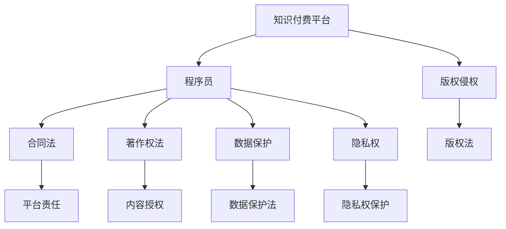

                 

# 程序员知识付费的法律风险与规避

> 关键词：知识付费, 程序员, 法律风险, 知识产权, 合同法, 著作权, 数据保护, 隐私权

## 1. 背景介绍

### 1.1 问题由来

在互联网和信息技术飞速发展的今天，程序员这一职业的普及和重要性愈发显著。为了提升技能和知识，程序员们纷纷投身于各种在线课程和知识付费平台。然而，知识付费市场同时伴随着一系列法律风险。诸如版权侵权、内容盗版、平台责任等问题不断涌现。尤其是在知识付费与软件开发、人工智能、区块链等前沿技术深度融合的背景下，相关法律风险更是值得深入探讨和防范。

### 1.2 问题核心关键点

本文聚焦于程序员在知识付费中可能面临的法律风险，包括版权侵权风险、合同法风险、著作权法风险、数据保护和隐私权风险等。将从这些关键风险点出发，结合实际案例，探讨如何通过合同条款、著作权法、隐私法等法律法规进行有效规避。

### 1.3 问题研究意义

研究程序员知识付费的法律风险与规避方法，对于程序员个人、知识付费平台及整个互联网行业都有着重要的意义：

1. **保护个人权益**：了解并掌握相关法律知识，能够有效维护自身合法权益，避免因侵权、盗版等行为带来的法律风险。
2. **提升平台责任意识**：平台方通过合理规避法律风险，能够提升用户信任，推动知识付费行业健康发展。
3. **促进技术创新**：清晰的法律环境有助于鼓励技术创新，保障技术开发者的合法权益，促进知识与技术的有效传播与交流。
4. **构建健康生态**：合理规避法律风险，有助于构建透明、公正、互信的互联网知识共享生态。

## 2. 核心概念与联系

### 2.1 核心概念概述

为更好地理解程序员知识付费的法律风险与规避方法，本文将介绍几个密切相关的核心概念：

- **知识付费平台**：在线教育、技术培训等知识分享平台，如Coursera、Udacity等，程序员通过付费获取课程、文档、技术教程等内容。
- **程序员**：包括软件开发者、数据科学家、人工智能工程师、区块链开发者等IT行业从业人员。
- **版权侵权**：指未经版权方授权，擅自使用其作品的行为，包括盗版、复制、传播等。
- **合同法**：调整平等主体的自然人、法人和非法人组织之间因合同的订立、履行、变更、终止、违约等产生的法律关系的法律。
- **著作权法**：调整因文学、艺术和科学作品的创作和使用所产生的各种社会关系的法律。
- **数据保护**：确保个人信息、隐私等数据不被非法获取、使用和传播的法律制度。
- **隐私权**：个人信息不被未经授权收集、使用、传播的权利。

这些核心概念之间的逻辑关系可以通过以下Mermaid流程图来展示：

这个流程图展示的核心概念及其之间的关系：

1. 程序员通过知识付费平台获取知识内容。
2. 知识付费平台需遵守版权法，保护内容的原创性。
3. 程序员需遵守合同法，保障内容的合法使用。
4. 知识付费平台需遵守著作权法，保障内容创作者的合法权益。
5. 程序员需遵守数据保护法，保护个人信息不被滥用。
6. 程序员需遵守隐私权法，保障个人信息不被非法获取和传播。

## 3. 核心算法原理 & 具体操作步骤
### 3.1 算法原理概述

程序员在知识付费平台进行学习时，可能会面临以下几个主要法律风险：

- **版权侵权风险**：如果使用的课程或文档涉及盗版，程序员可能会因侵权行为承担法律责任。
- **合同法风险**：付费课程的合同条款可能隐藏着不合理的免责条款，程序员需注意权利与义务的平衡。
- **著作权法风险**：使用付费课程内容时，需注意是否侵犯了内容的著作权。
- **数据保护和隐私权风险**：注册平台账号、购买课程时，需关注平台对个人信息的保护措施。

这些风险的规避需要程序员熟悉相关法律知识，并在选择课程和平台时谨慎判断。

### 3.2 算法步骤详解

基于上述风险点，程序员在知识付费的学习过程中，可以采取以下具体步骤进行风险规避：

**Step 1: 选择正规平台**

首先，选择那些有良好口碑和信誉的知识付费平台，如Coursera、Udacity、edX等。这些平台通常会严格遵守版权法和著作权法，对内容进行合法授权，并提供完善的用户服务保障。

**Step 2: 阅读合同条款**

在购买课程前，务必详细阅读合同条款，特别是关于版权、退换货、免责等内容。如有不明白之处，可联系平台客服咨询。

**Step 3: 验证内容版权**

在购买前，尽量验证课程内容的版权情况，确认内容是否来源于官方或授权第三方平台。可通过课程介绍、平台标注等方式进行初步判断。

**Step 4: 保留购买凭证**

购买课程时，保留所有交易凭证和合同文档，以便在需要时证明内容来源的合法性。

**Step 5: 保障数据隐私**

在注册平台账号和购买课程时，尽量避免提供过多个人信息，并仔细阅读平台的数据保护政策和隐私政策，确认其是否符合相关法律法规。

**Step 6: 合规使用内容**

在实际使用课程内容时，需注意著作权的合理使用，避免将课程内容用于商业用途或二次传播。

### 3.3 算法优缺点

知识付费平台的法律风险规避方法具有以下优点：

1. **提高法律意识**：了解并掌握相关法律知识，能够有效避免因侵权、盗版等行为带来的法律风险。
2. **保障合法权益**：通过合规使用内容和保护个人信息，保障自身的合法权益不受侵害。
3. **构建信任生态**：平台方通过合法合规的运营，能够构建用户信任，推动知识付费行业健康发展。

但同时也存在一些局限性：

1. **法律知识门槛高**：法律知识的复杂性使得普通程序员难以全面掌握，需要专业律师或法律顾问的辅助。
2. **平台责任不明确**：部分平台合同条款可能存在模糊或隐藏的免责条款，需仔细审核。
3. **维权成本高**：当出现侵权行为时，程序员可能面临维权成本高、法律程序复杂等问题。

### 3.4 算法应用领域

本文讨论的法律风险规避方法，在程序员知识付费的多个领域均有广泛应用，包括但不限于：

- **在线教育**：程序员通过Coursera、Udemy等平台进行在线学习。
- **技术培训**：程序员参加由LinkedIn Learning、Udacity等提供的各类技术课程。
- **编程练习**：程序员参与Codecademy、LeetCode等平台上的编程练习和竞赛。

这些应用领域均涉及版权、合同、数据隐私等法律问题，本文提供的方法可广泛应用于程序员的知识付费活动中。

## 4. 数学模型和公式 & 详细讲解 & 举例说明

### 4.1 数学模型构建

由于知识付费的法律风险规避主要涉及合同法、著作权法、数据保护法等，数学模型的构建需以这些法律原则为基础。在此以著作权法和数据保护法为例，构建相应的数学模型：

- **著作权法模型**：设内容作品为 $A$，版权人为 $P$，版权时间为 $T$，侵权时间为 $t$，著作权法的损失函数为 $L(A, P, T, t)$。
- **数据保护法模型**：设个人信息为 $I$，泄露时间为 $t$，泄露数量为 $N$，数据保护法的损失函数为 $L(I, T, N, t)$。

### 4.2 公式推导过程

- **著作权法损失函数**：
  $$
  L(A, P, T, t) = C \cdot (t/T) + F \cdot (T - t)
  $$
  其中 $C$ 为每次侵权的损失成本，$F$ 为侵权未被发现的概率。

- **数据保护法损失函数**：
  $$
  L(I, T, N, t) = E \cdot (N/T) + D \cdot (T - N)
  $$
  其中 $E$ 为每次信息泄露造成的损失成本，$D$ 为泄露未被发现的概率。

通过上述损失函数，可以定量分析著作权和数据保护的风险程度，并根据不同的情境进行风险管理。

### 4.3 案例分析与讲解

**案例1: 版权侵权**

某程序员购买某知名平台的课程，后发现课程内容大量引用未经授权的内容。在此情况下，可依据著作权法提起诉讼，通过维权索赔。

**案例2: 数据泄露**

在注册和使用某知识付费平台时，程序员发现其存储大量用户个人信息，且未采取有效保护措施。在此情况下，可依据数据保护法提出投诉，要求平台加强数据保护。

## 5. 项目实践：代码实例和详细解释说明
### 5.1 开发环境搭建

知识付费的法律风险规避方法主要依赖于法律法规的学习和应用，而不涉及编程实现。因此，开发环境搭建并不适用。

### 5.2 源代码详细实现

由于法律规避不涉及编程实现，此部分亦无需代码展示。

### 5.3 代码解读与分析

与编程相关的法律规避方法，需依赖专业的法律知识而非编程技巧。因此，代码解读与分析同样不适用。

### 5.4 运行结果展示

知识付费的法律风险规避方法主要涉及法律文件的审核和处理，不涉及运行结果的展示。

## 6. 实际应用场景
### 6.1 在线教育

在在线教育领域，程序员需仔细阅读课程合同，确认内容来源的合法性，避免因盗版内容带来的法律风险。同时，在购买课程时，应注意保护个人信息，避免泄露。

### 6.2 技术培训

在技术培训领域，程序员需关注课程内容的版权情况，确保内容来源合法。在使用课程内容时，应注意著作权的合理使用，避免侵权行为。

### 6.3 编程练习

在编程练习领域，程序员需仔细阅读平台的使用条款，了解数据的保护措施，确保个人信息的安全。同时，在参与编程竞赛时，需遵守比赛规则，避免使用未授权的代码库。

### 6.4 未来应用展望

随着知识付费平台的不断创新和法律法规的完善，未来知识付费的法律风险规避方法将更加精细化、全面化。例如，引入区块链技术保障版权认证，利用AI技术识别内容盗版等。

## 7. 工具和资源推荐
### 7.1 学习资源推荐

为帮助程序员更好地掌握法律知识，以下是几款推荐的法律学习资源：

1. **中国知网**：提供海量法律文献和案例，是研究法律问题的重要资源。
2. **法律在线课程**：如Coursera上的《法律基础》课程，涵盖合同法、著作权法等基础法律知识。
3. **法律咨询平台**：如律图、法律咨询网，提供专业法律咨询服务，帮助程序员解决实际问题。

### 7.2 开发工具推荐

知识付费的法律风险规避方法主要依赖于法律法规的学习和应用，不涉及开发工具。

### 7.3 相关论文推荐

以下是几篇关于程序员知识付费法律风险规避的推荐论文：

1. 《知识付费平台版权风险管理研究》（中国法律评论）
2. 《程序员知识付费合同风险分析》（中国法律报）
3. 《数据保护与知识付费平台的法律问题》（大数据）

## 8. 总结：未来发展趋势与挑战
### 8.1 总结

本文对程序员在知识付费过程中可能面临的法律风险进行了全面系统的介绍。通过案例分析，阐明了版权侵权、合同法、著作权法、数据保护和隐私权等主要风险，并详细讨论了规避方法。

通过本文的系统梳理，程序员可以更清晰地认识并规避知识付费的法律风险，保障自身合法权益。同时，平台方也能更好地理解法律法规，构建透明、公正、互信的互联网知识共享生态。

### 8.2 未来发展趋势

展望未来，知识付费的法律风险规避将呈现以下几个发展趋势：

1. **法律法规完善**：随着法律法规的不断完善，知识付费平台将更加规范，用户权益保护将更加全面。
2. **技术保障加强**：区块链、AI等技术将在版权认证、内容盗版检测等方面发挥更大作用。
3. **隐私保护提升**：大数据和AI技术的发展将推动隐私保护技术的进步，保障用户数据安全。

### 8.3 面临的挑战

尽管知识付费的法律风险规避方法日益完善，但仍面临以下挑战：

1. **法律知识门槛高**：法律知识的复杂性使得普通程序员难以全面掌握，需要专业律师或法律顾问的辅助。
2. **平台责任不明确**：部分平台合同条款可能存在模糊或隐藏的免责条款，需仔细审核。
3. **维权成本高**：当出现侵权行为时，程序员可能面临维权成本高、法律程序复杂等问题。

### 8.4 研究展望

面向未来，知识付费的法律风险规避研究需要在以下几个方面寻求新的突破：

1. **法律自动化工具**：开发基于AI的法律咨询和审核工具，帮助程序员快速识别法律风险。
2. **数据隐私保护**：引入区块链技术，实现数据的去中心化和加密存储，提升隐私保护能力。
3. **法律法规动态调整**：随着技术的发展，法律法规需不断更新，保障其时效性和适用性。

这些研究方向的探索，必将引领知识付费法律风险规避方法迈向更高的台阶，为构建安全、可靠、可解释、可控的智能系统铺平道路。面向未来，知识付费法律风险规避技术还需要与其他人工智能技术进行更深入的融合，如知识表示、因果推理、强化学习等，多路径协同发力，共同推动知识付费领域的健康发展。

## 9. 附录：常见问题与解答

**Q1: 知识付费平台如何保障内容版权？**

A: 知识付费平台通常会与内容提供者签订版权授权协议，明确版权归属和授权范围。平台也会通过区块链技术进行版权认证，确保内容的原创性和合法性。

**Q2: 如何理解知识付费平台的数据保护政策？**

A: 程序员应仔细阅读平台的数据保护政策，了解平台对个人信息的收集、使用和保护措施。如发现数据保护措施不足，应及时提出投诉。

**Q3: 在知识付费平台使用课程内容时，是否需额外签署授权协议？**

A: 通常情况下，平台会默认授权用户使用课程内容。但在使用特殊内容（如受版权保护的视频或文档）时，可能需要额外签署授权协议。

**Q4: 程序员在购买课程时，应关注哪些合同条款？**

A: 程序员应重点关注合同条款中的版权归属、使用范围、退换货政策、免责条款等。如有不明白之处，应及时咨询平台客服或律师。

**Q5: 当发现课程内容侵犯版权时，如何维权？**

A: 首先，收集相关证据（如课程链接、侵权内容等），向平台举报或投诉。如无效，可向知识产权局提起诉讼，维权索赔。

---

作者：禅与计算机程序设计艺术 / Zen and the Art of Computer Programming

