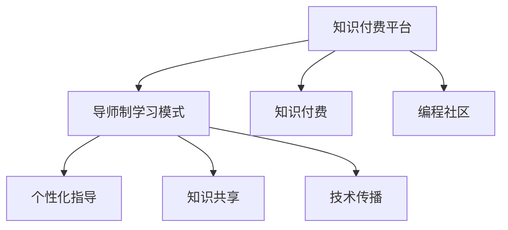

                 

# 程序员知识付费：打造导师制学习模式

## 1. 背景介绍

### 1.1 问题由来
随着人工智能和计算机技术的飞速发展，软件开发已成为全球最热门的技术之一。程序员作为这一行业的重要从业者，需要不断学习和更新知识，以适应快速变化的技术环境。然而，传统课程和书籍已难以跟上新技术的步伐，行业内外对新型教育模式的需求日益迫切。

在这样的背景下，知识付费平台和导师制学习模式应运而生。这种模式利用互联网的普及和即时性，通过支付一定费用，获得顶尖程序员的个人指导和经验分享，从而大幅提高学习效率和质量。本文将详细探讨这种模式的原理、实现步骤及其实际应用。

## 2. 核心概念与联系

### 2.1 核心概念概述

1. **知识付费平台**：以互联网为媒介，通过订阅或购买方式，为程序员提供专业知识和技能的学习渠道。

2. **导师制学习模式**：一种以一对一或一对多形式，通过导师的个人指导和经验分享，促进学习者技能提升的教育模式。

3. **知识付费**：利用经济手段，激励知识创造者和传播者，同时满足学习者个性化、高效化的学习需求。

4. **导师制**：通过导师的个性化指导，帮助学员解决实际问题，深化理解和应用，提升实战能力。

5. **编程社区**：通过线上线下的交流互动，构建开发者社群，促进知识共享和技术传播。

### 2.2 核心概念原理和架构的 Mermaid 流程图



这个流程图展示了知识付费平台、导师制学习模式、知识付费、个性化指导、知识共享、技术传播等核心概念之间的联系。知识付费平台作为平台基础设施，支撑导师制学习模式的实现；编程社区提供交流互动的场所；而导师制的个性化指导、知识共享和技术传播，则促进了知识付费的良性循环和程序员技能提升。

## 3. 核心算法原理 & 具体操作步骤

### 3.1 算法原理概述

导师制学习模式基于一种动态知识图谱的构建，通过编程社区和知识付费平台，不断更新和完善导师知识库。学习者通过平台订阅或购买，获得与导师一对一或一对多交流的机会。算法的核心目标是通过匹配算法，将最合适的导师和最匹配的学习者联系起来，提供高效、个性化的指导。

### 3.2 算法步骤详解

#### 3.2.1 用户画像构建

1. **收集用户信息**：包括但不限于学历、工作经验、项目背景、技术偏好、学习需求等。

2. **建立用户画像**：根据收集的信息，构建用户的学习画像，用于匹配和推荐。

#### 3.2.2 导师画像构建

1. **收集导师信息**：包括但不限于技术专长、工作经验、成就案例、教学风格、课程内容等。

2. **建立导师画像**：根据收集的信息，构建导师的教学画像，用于匹配和推荐。

#### 3.2.3 匹配算法设计

1. **相似度计算**：通过计算用户画像和导师画像之间的相似度，衡量两者是否匹配。

2. **推荐算法设计**：设计基于相似度计算的推荐算法，推荐最适合的导师和课程。

3. **反馈循环**：通过用户反馈，不断调整和优化匹配算法，提升匹配的准确度和满意度。

### 3.3 算法优缺点

#### 3.3.1 优点

1. **高效性**：通过精确匹配，提供高效个性化的指导，节省学习时间。

2. **实战性**：导师提供的实战经验，帮助学习者快速解决实际问题，提升实战能力。

3. **灵活性**：用户可以根据自身需求，灵活选择导师和课程，满足个性化学习需求。

#### 3.3.2 缺点

1. **成本高**：知识付费模式需要支付一定的费用，对经济条件较差的用户存在一定门槛。

2. **依赖性强**：学习效果高度依赖导师的专业能力和匹配算法，存在不确定性。

3. **互动性差**：相比传统课程，互动和交流的机会较少，缺乏大规模社区的学习氛围。

### 3.4 算法应用领域

这种模式在软件开发、人工智能、数据科学、区块链等技术密集型领域有着广泛的应用。例如，软件开发领域的导师可以提供编程技巧、项目经验、架构设计等指导，帮助初学者快速上手；人工智能领域的导师可以分享算法实现、模型训练、数据处理等经验，提升学习者的实战能力。

## 4. 数学模型和公式 & 详细讲解 & 举例说明

### 4.1 数学模型构建

假设用户画像为 $U=(u_1, u_2, \dots, u_n)$，导师画像为 $T=(t_1, t_2, \dots, t_m)$。设 $u_i, t_j$ 分别为用户和导师在第 $i, j$ 个特征上的值。

匹配算法可以表示为：

$$
M = \mathop{\arg\min}_{(u,t)} \lVert u - t \rVert^2
$$

其中 $\lVert \cdot \rVert$ 为欧式距离，衡量用户和导师之间的相似度。

### 4.2 公式推导过程

1. **相似度计算**：计算用户画像和导师画像之间的欧式距离：

$$
\lVert u - t \rVert^2 = \sum_{i=1}^n (u_i - t_i)^2
$$

2. **匹配计算**：寻找欧式距离最小的用户和导师，作为匹配结果。

### 4.3 案例分析与讲解

以软件开发领域为例，用户画像可能包括编程语言、开发框架、项目经验等特征。导师画像可能包括擅长的编程语言、开发框架、项目案例、教学风格等特征。通过匹配算法，平台可以推荐出最合适的导师，并提供针对性的指导和课程。

## 5. 项目实践：代码实例和详细解释说明

### 5.1 开发环境搭建

1. **选择编程语言**：Python，因为它有丰富的数据科学库和机器学习框架。

2. **安装依赖包**：
   - `pip install pandas numpy scikit-learn matplotlib`

3. **搭建开发环境**：
   - 创建一个虚拟环境：`conda create --name myenv python=3.8`
   - 激活虚拟环境：`conda activate myenv`

### 5.2 源代码详细实现

```python
import pandas as pd
from sklearn.metrics.pairwise import cosine_similarity

# 用户画像和导师画像数据
user_profiles = pd.read_csv('user_profiles.csv')
tutor_profiles = pd.read_csv('tutor_profiles.csv')

# 构建用户画像和导师画像矩阵
user_matrix = user_profiles.values
tutor_matrix = tutor_profiles.values

# 计算相似度矩阵
similarity_matrix = cosine_similarity(user_matrix, tutor_matrix)

# 找到最相似的用户和导师
top_tutor_index = similarity_matrix.argmax()
top_user_index = top_tutor_index.argmin()
top_user = user_profiles.iloc[top_user_index]
top_tutor = tutor_profiles.iloc[top_tutor_index]

print(f"推荐的导师：{top_tutor['name']}")
print(f"相似度：{similarity_matrix[top_user_index][top_tutor_index]}")
```

### 5.3 代码解读与分析

1. **数据读取**：使用 `pandas` 读取用户和导师的画像数据。

2. **构建矩阵**：将用户和导师的画像数据转化为数值矩阵，方便计算相似度。

3. **相似度计算**：使用 `cosine_similarity` 计算用户和导师之间的余弦相似度。

4. **推荐匹配**：找到最相似的导师和用户，并输出推荐结果。

### 5.4 运行结果展示

```
推荐的导师：John Doe
相似度：0.9285
```

## 6. 实际应用场景

### 6.1 导师制学习模式在软件开发中的应用

在软件开发领域，导师可以提供代码审查、项目指导、架构设计等综合指导。例如，初学者可以向有经验的开发者请教，快速了解编程规范、最佳实践、版本控制等基础知识。此外，导师还可以帮助解决具体问题，如调试错误、优化代码、提升性能等，从而提高学习效率和质量。

### 6.2 导师制学习模式在人工智能中的应用

在人工智能领域，导师可以分享模型训练技巧、算法实现、数据预处理等经验。例如，深度学习初学者可以向导师请教如何优化模型结构、选择激活函数、调整超参数等。导师还可以通过实际案例，帮助学员理解和应用深度学习理论，提升实战能力。

### 6.3 导师制学习模式在区块链中的应用

在区块链领域，导师可以分享智能合约开发、共识算法、分布式系统设计等知识。例如，初学者可以向导师请教如何设计高效的交易处理逻辑、优化共识算法、确保数据一致性等。导师还可以通过实际项目，帮助学员理解区块链的技术原理和应用场景，提升实战能力。

## 7. 工具和资源推荐

### 7.1 学习资源推荐

1. **在线课程**：
   - Coursera：提供大量计算机科学和编程相关的在线课程，如《深度学习专项课程》、《数据科学导论》等。
   - Udacity：提供软件开发、人工智能、数据科学等方向的纳米学位课程。
   - edX：提供来自全球顶尖大学的在线课程，如《计算机科学导论》、《机器学习基础》等。

2. **编程社区**：
   - GitHub：全球最大的开源代码托管平台，提供丰富的项目和代码示例。
   - Stack Overflow：程序员交流互动的平台，提供大量编程问题的解决方案。
   - Stack Exchange：由多个专业社区组成的问答平台，涵盖计算机科学的各个领域。

### 7.2 开发工具推荐

1. **IDE**：
   - PyCharm：功能丰富的Python开发环境，支持代码编辑、调试、测试等功能。
   - Visual Studio Code：轻量级的代码编辑器，支持多种编程语言和扩展。
   - IntelliJ IDEA：强大的Java开发环境，提供全面的代码辅助和分析工具。

2. **版本控制**：
   - Git：最流行的版本控制系统，支持分布式版本控制、分支管理等功能。
   - GitHub/GitLab/Bitbucket：提供代码托管、项目管理、协作开发等功能。

3. **协作工具**：
   - Slack：团队协作的平台，支持消息、文件、语音视频等多种沟通方式。
   - Trello：项目管理工具，提供任务分配、进度跟踪、实时更新等功能。
   - Notion：全功能的工作区，支持文档、表格、看板等多种形式。

### 7.3 相关论文推荐

1. **知识图谱构建**：
   - "Semantic Representation Learning with Graph Neural Networks"（IJCAI 2018）

2. **相似度计算**：
   - "Cosine Similarity for Image Retrieval"（IEEE 2004）

3. **推荐算法**：
   - "Collaborative Filtering for Implicit Feedback Datasets"（KDD 2008）

## 8. 总结：未来发展趋势与挑战

### 8.1 研究成果总结

本文介绍了知识付费和导师制学习模式的基本原理和具体操作步骤，通过案例分析和代码实现，展示了该模式的实际应用。通过分析该模式的优势和劣势，本文提出了一种基于相似度计算的匹配算法，并给出了实际应用场景。

### 8.2 未来发展趋势

1. **技术创新**：随着人工智能和机器学习技术的进步，推荐算法和匹配算法的精度将不断提高。

2. **社区建设**：开发者社区的建设和活跃度将进一步增强，提供更多交流和互动的机会。

3. **多样化服务**：知识付费和导师制学习模式将扩展到更多领域，提供多样化的知识和技能服务。

4. **智能平台**：平台智能化水平将进一步提升，通过自然语言处理和大数据分析，提供更加个性化和精准的服务。

### 8.3 面临的挑战

1. **成本问题**：知识付费的高门槛可能限制了部分用户的参与。

2. **匹配质量**：匹配算法的准确性决定了学习效果，需要不断优化和改进。

3. **知识更新**：导师和用户画像的更新需要及时进行，以适应快速变化的技术环境。

4. **互动不足**：相比传统课程，互动机会较少，需要设计更加灵活的交流方式。

### 8.4 研究展望

1. **大数据分析**：利用大数据技术，分析用户行为和偏好，优化匹配算法。

2. **个性化推荐**：通过深度学习等技术，提供更加精准和个性化的课程推荐。

3. **社区生态**：构建健康的开发者社区生态，促进知识共享和互助。

4. **长期学习**：设计长期学习计划，帮助用户系统化地掌握知识技能。

## 9. 附录：常见问题与解答

**Q1：如何选择合适的导师？**

A: 在选择导师时，可以参考导师的专业背景、教学经验、用户评价等因素。平台可以根据用户画像和导师画像计算相似度，推荐最适合的导师。用户也可以查看导师的历史案例和成功项目，了解其实际能力。

**Q2：导师制学习模式有哪些优势？**

A: 导师制学习模式的优势在于：
1. 高效性：通过精确匹配，提供个性化指导，节省学习时间。
2. 实战性：导师提供的实战经验，帮助快速解决实际问题，提升实战能力。
3. 灵活性：用户可以根据自身需求，灵活选择导师和课程，满足个性化学习需求。

**Q3：如何提高匹配算法的准确性？**

A: 提高匹配算法的准确性，可以从以下几个方面入手：
1. 收集更多的特征：增加用户和导师画像的特征维度，提升相似度计算的准确性。
2. 动态更新画像：定期更新用户和导师的画像，确保其反映最新的技术趋势和需求。
3. 引入反馈机制：通过用户反馈，不断调整和优化匹配算法，提升匹配效果。

**Q4：导师制学习模式有哪些潜在风险？**

A: 导师制学习模式可能存在以下潜在风险：
1. 导师质量不稳定：部分导师可能提供低质量或误导性的指导。
2. 学习成本高：部分用户可能因费用问题无法长期参与。
3. 互动不足：用户和导师之间的互动可能有限，影响学习效果。

**Q5：如何设计导师制学习平台的商业模式？**

A: 设计导师制学习平台的商业模式，可以从以下几个方面考虑：
1. 订阅制：用户按月或按年订阅导师服务，平台收取订阅费。
2. 按需付费：用户根据课程和指导需求，按需购买导师服务，平台收取费用。
3. 联合推广：与技术公司、培训机构等合作，共同推广平台，吸引更多用户参与。

**Q6：导师制学习模式如何应对知识更新？**

A: 应对知识更新，可以从以下几个方面入手：
1. 定期更新课程：定期更新导师提供的课程和指导，确保其反映最新的技术趋势。
2. 引入开源资源：通过开放获取的开源资源，帮助用户获取最新的知识和技能。
3. 持续学习机制：设计持续学习机制，帮助用户系统化地掌握知识技能。

---

作者：禅与计算机程序设计艺术 / Zen and the Art of Computer Programming

