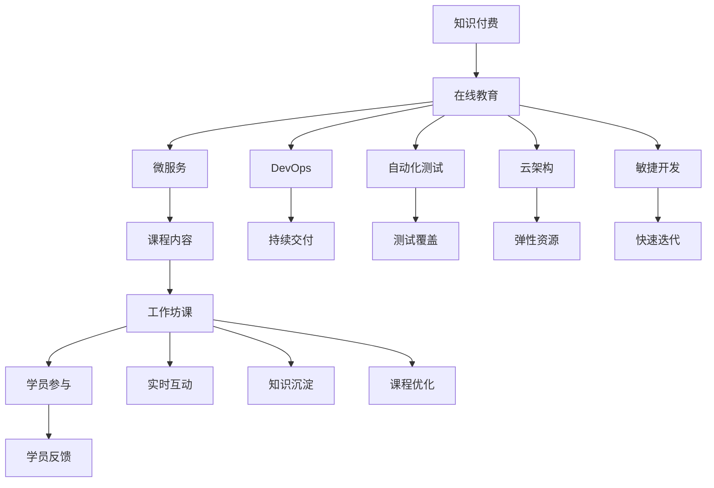

                 

# 程序员知识付费：打造工作坊课模式

> 关键词：程序员,知识付费,工作坊课,在线教育,微服务,DevOps,自动化测试,云架构,敏捷开发

## 1. 背景介绍

### 1.1 问题由来
随着互联网技术的发展和普及，程序员作为软件开发和创新的关键力量，其技能水平和知识结构对企业信息化建设、数字化转型有着至关重要的影响。同时，软件开发过程涉及大量重复性、基础性工作，这些工作的掌握需要大量的时间和经验积累，但由于时间和精力的限制，许多程序员难以通过传统培训模式提升技能水平。

传统培训模式的缺陷主要体现在：
- **资源浪费**：大多数培训机构和课程质量参差不齐，内容缺乏针对性，无法满足不同层次和背景学员的需求。
- **学习效果差**：学员需自行筛选课程，需耗费大量时间，且难以跟进最新技术。
- **互动不足**：大部分课程采用录播或直播的方式，缺乏互动环节，难以实时解决学习中的问题。

在这样的背景下，知识付费模式应运而生，程序员可以高效利用碎片时间学习，通过针对性和实用性强的培训内容提升技能，适应快速变化的技术环境。

## 2. 核心概念与联系

### 2.1 核心概念概述

为了更好地理解知识付费模式和如何打造工作坊课，我们首先介绍几个核心概念：

- **知识付费**：指用户通过购买在线课程或服务，获取有价值的知识内容。知识付费模式让学习过程变得高效、有针对性，是一种新型的学习方式。
- **工作坊课**：是一种以互动、实践为主的在线课程，一般通过视频、直播、线上工作坊等方式进行，强调学员参与和实时互动。
- **在线教育**：利用互联网技术进行远程教育，突破时间和空间的限制，提供灵活、实时的学习方式。
- **微服务架构**：一种以服务为中心的架构模式，通过将应用拆分为多个小服务，提升系统的可维护性和扩展性。
- **DevOps**：涵盖开发、测试、运维等多个环节的集成化管理方法，强调团队协作和持续交付。
- **自动化测试**：利用工具和技术手段自动化执行测试流程，提升测试效率和质量。
- **云架构**：基于云平台进行系统架构设计和管理，实现资源按需扩展，提升系统弹性和稳定性。
- **敏捷开发**：一种快速响应需求变化、注重团队协作的开发方法，强调迭代交付、持续改进。

这些核心概念之间存在着密切的联系，共同构成了在线教育和新工作坊课程的基本框架。以下是一个Mermaid流程图，展示了这些概念之间的联系：



这个流程图展示了在线教育通过微服务、DevOps、自动化测试、云架构和敏捷开发等技术手段，为工作坊课模式提供了坚实的基础。工作坊课注重学员参与和实时互动，强调课程内容和知识沉淀，通过持续优化，提升课程质量和学员满意度。

## 3. 核心算法原理 & 具体操作步骤
### 3.1 算法原理概述

知识付费和微服务工作坊课的核心原理基于以下逻辑：

1. **按需学习**：知识付费模式通过模块化课程，满足学员的个性化需求，节省学习时间和精力。
2. **互动实践**：工作坊课注重实践和互动，学员可以在导师的指导下，快速掌握技能。
3. **实时反馈**：通过学员反馈机制，实时调整课程内容和教学方法，提升学习效果。
4. **知识沉淀**：课程内容持续优化和更新，为后续学员提供高质量的学习资源。

知识付费与工作坊课模式的结合，使得在线教育不再局限于单一的课程传授，而是形成了完整的学习闭环，通过互动、反馈和优化，持续提升课程质量，满足学员的实际需求。

### 3.2 算法步骤详解

以下是打造工作坊课的具体操作步骤：

**Step 1: 需求分析**
- 确定目标学员群体，明确他们的知识水平和技能需求。
- 梳理课程大纲，设计课程模块和目标知识点。
- 结合技术发展和学员反馈，定期更新课程内容。

**Step 2: 课程设计**
- 确定课程的教学目标、学习路径和评估方式。
- 设计课程结构，包括理论讲授、实践操作、互动环节等。
- 选择适合的工作坊课平台和工具，如Zoom、Slack、GitHub等。

**Step 3: 技术支持**
- 搭建课程所需的微服务架构，实现系统的高可用性和可扩展性。
- 实现DevOps工具链，保证代码管理和持续交付的效率。
- 集成自动化测试工具，保证课程内容的准确性和可靠性。
- 采用云架构，确保系统的弹性和稳定性。
- 引入敏捷开发方法，提高课程开发和迭代的速度。

**Step 4: 课程实施**
- 开展课程试讲，根据学员反馈调整教学内容和互动方式。
- 进行课程录制和直播，保持学员的实时互动。
- 通过线上工作坊等方式，促进学员间的互动和讨论。
- 定期组织在线答疑，解决学员的疑难问题。
- 收集学员反馈，进行课程优化和迭代。

**Step 5: 效果评估**
- 采用问卷调查、测试结果等方式，评估学员的学习效果和满意度。
- 统计课程的完成率和通过率，评估课程的质量和效果。
- 根据评估结果，进行课程的优化和改进。

### 3.3 算法优缺点

知识付费和工作坊课模式具有以下优点：
1. **高效学习**：学员可以根据自己的时间安排学习，灵活性强，节省时间。
2. **有针对性**：课程设计有针对性，涵盖重点难点，提升学习效果。
3. **互动性强**：学员与导师可以实时互动，解决学习中的问题。
4. **持续优化**：通过学员反馈和评估，不断优化课程内容和教学方法。
5. **质量保障**：引入DevOps、自动化测试等技术手段，保证课程的质量和稳定性。

同时，这种模式也存在一些缺点：
1. **投入成本高**：课程设计和开发需要较高的技术投入和人力资源。
2. **学习动力不足**：完全依赖学员自觉学习，缺乏强制性的管理。
3. **互动不足**：部分学员可能缺乏与导师互动的机会。
4. **技术门槛高**：课程涉及较多技术手段，学员需要有一定的技术基础。
5. **个性化需求难以满足**：虽然课程设计注重个性化，但仍可能无法满足所有学员的需求。

### 3.4 算法应用领域

知识付费和工作坊课模式在多个领域都有广泛应用，以下是几个典型的应用场景：

1. **软件开发**：面向软件开发者，提供编程语言、框架、工具等课程。
2. **数据科学**：涵盖数据分析、数据可视化、机器学习等课程，帮助学员掌握数据科学技能。
3. **云计算**：涵盖AWS、Azure、Google Cloud等云平台技术，帮助学员掌握云架构和运维技能。
4. **人工智能**：提供深度学习、自然语言处理、计算机视觉等课程，帮助学员掌握AI技术。
5. **项目管理**：涵盖敏捷开发、Scrum、Kanban等项目管理方法，帮助学员提升项目管理和团队协作能力。
6. **前端开发**：提供HTML、CSS、JavaScript等课程，帮助学员掌握前端开发技能。
7. **全栈开发**：涵盖前后端开发、数据库、服务器等全栈技术，帮助学员成为全栈开发者。

## 4. 数学模型和公式 & 详细讲解 & 举例说明

### 4.1 数学模型构建

知识付费和工作坊课模式涉及到多个因素，包括学员的参与度、课程的满意度、知识点的掌握程度等。以下是一个简单的数学模型，用于评估知识付费和学习效果：

假设课程包含 $N$ 个知识点，每个知识点掌握程度为 $x_i$，学员总时间为 $T$，每个知识点学习时间 $t_i$，课程满意度为 $S$，则数学模型可以表示为：

$$
S = \sum_{i=1}^{N} \frac{x_i}{t_i}
$$

其中 $S$ 表示课程满意度，$x_i$ 表示知识点掌握程度，$t_i$ 表示学习时间。

### 4.2 公式推导过程

根据上式，可以推导出课程满意度的优化公式。为了提升 $S$，需要最大化 $x_i$，最小化 $t_i$。因此，学员需要选择合适的知识点进行学习，并分配合理的学习时间。

在实际应用中，可以使用模拟退火等优化算法，对知识点和学习时间进行动态调整，从而最大化课程满意度。

### 4.3 案例分析与讲解

假设有一门课程包含三个知识点 $A$、$B$、$C$，每个知识点学习时间分别为 $t_A=2$ 小时、$t_B=4$ 小时、$t_C=6$ 小时，学员总时间为 $T=20$ 小时。学员需要在 $A$、$B$、$C$ 中进行选择，以最大化课程满意度。

根据上式，假设学员选择 $A$ 和 $B$ 知识点进行学习，则课程满意度为：

$$
S = \frac{x_A}{2} + \frac{x_B}{4}
$$

假设 $x_A=1$，$x_B=1$，$x_C=0$，则课程满意度为：

$$
S = \frac{1}{2} + \frac{1}{4} = \frac{3}{4}
$$

如果学员选择 $A$ 和 $C$ 知识点进行学习，则课程满意度为：

$$
S = \frac{x_A}{2} + \frac{x_C}{6} = \frac{1}{2} + \frac{1}{6} \approx 0.88
$$

通过对比可以看出，选择 $A$ 和 $C$ 知识点时，课程满意度更高。因此，学员需要在有限的时间内，选择最优的知识点进行学习，以最大化课程满意度。

## 5. 项目实践：代码实例和详细解释说明
### 5.1 开发环境搭建

为了更好地实践知识付费和工作坊课模式，需要搭建相应的开发环境。以下是具体步骤：

1. **选择开发平台**：可以选择基于云平台的开发环境，如AWS、Azure、Google Cloud等，或者本地搭建开发环境。
2. **安装开发工具**：安装Python、Docker、Kubernetes等工具，保证开发环境的稳定性和可扩展性。
3. **搭建微服务架构**：基于云平台搭建微服务架构，实现系统的高可用性和可扩展性。
4. **配置DevOps工具链**：集成Jenkins、GitLab CI/CD等工具，实现持续集成和持续交付。
5. **集成自动化测试工具**：集成Selenium、JUnit等自动化测试工具，保证课程内容的准确性和可靠性。
6. **采用云架构**：搭建云平台基础设施，实现弹性资源管理，提升系统的弹性和稳定性。
7. **引入敏捷开发方法**：采用Scrum、Kanban等敏捷开发方法，提高课程开发和迭代的速度。

### 5.2 源代码详细实现

以下是一个基于微服务架构的在线课程系统的实现，包括课程模块、学员模块、导师模块等：

**课程模块**

```python
from flask import Flask, request, jsonify

app = Flask(__name__)

@app.route('/courses', methods=['POST'])
def create_course():
    course_data = request.get_json()
    # 创建课程，保存到数据库
    # ...
    return jsonify({'success': True}), 201

@app.route('/courses', methods=['GET'])
def get_courses():
    # 获取所有课程信息，从数据库读取
    # ...
    return jsonify(courses)

@app.route('/courses/<course_id>', methods=['GET'])
def get_course(course_id):
    # 获取指定课程信息，从数据库读取
    # ...
    return jsonify(course_info)

if __name__ == '__main__':
    app.run(debug=True)
```

**学员模块**

```python
from flask import Flask, request, jsonify

app = Flask(__name__)

@app.route('/enroll', methods=['POST'])
def enroll_course():
    course_id = request.json.get('course_id')
    user_id = request.json.get('user_id')
    # 学员报名，保存到数据库
    # ...
    return jsonify({'success': True}), 201

@app.route('/enroll', methods=['GET'])
def check_enrollment():
    course_id = request.json.get('course_id')
    user_id = request.json.get('user_id')
    # 查询学员是否已报名，从数据库读取
    # ...
    return jsonify(enrollment_status)

if __name__ == '__main__':
    app.run(debug=True)
```

**导师模块**

```python
from flask import Flask, request, jsonify

app = Flask(__name__)

@app.route('/lecture', methods=['POST'])
def upload_lecture():
    course_id = request.json.get('course_id')
    lecture_data = request.json.get('lecture_data')
    # 导师上传课程内容，保存到数据库
    # ...
    return jsonify({'success': True}), 201

@app.route('/lecture/<lecture_id>', methods=['GET'])
def get_lecture(lecture_id):
    # 获取指定课程的某次讲座内容，从数据库读取
    # ...
    return jsonify(lecture_data)

if __name__ == '__main__':
    app.run(debug=True)
```

### 5.3 代码解读与分析

以上代码实现了一个简单的在线课程系统，包括课程管理、学员报名和导师上传课程内容等功能。具体实现细节如下：

- **课程模块**：通过Flask框架实现RESTful API，支持课程创建、获取和查询操作。
- **学员模块**：通过Flask框架实现RESTful API，支持学员报名和查询操作。
- **导师模块**：通过Flask框架实现RESTful API，支持导师上传课程内容和获取操作。

## 6. 实际应用场景
### 6.1 软件开发

面向软件开发人员，提供Java、Python、C++等语言，以及Spring、Django、Flask等框架的课程。通过微服务架构、DevOps、自动化测试等技术手段，提升课程的实用性和可靠性，满足开发人员的技能提升需求。

### 6.2 数据科学

涵盖Python、R语言、机器学习、深度学习等课程，帮助学员掌握数据科学技能。通过微服务架构、云架构和敏捷开发等技术手段，提高课程的灵活性和响应速度，满足数据科学家的技术需求。

### 6.3 云计算

涵盖AWS、Azure、Google Cloud等云平台技术，帮助学员掌握云架构和运维技能。通过微服务架构、DevOps和自动化测试等技术手段，提升课程的稳定性和可靠性，满足云计算工程师的技能提升需求。

### 6.4 人工智能

提供深度学习、自然语言处理、计算机视觉等课程，帮助学员掌握AI技术。通过微服务架构、云架构和敏捷开发等技术手段，提高课程的灵活性和响应速度，满足人工智能工程师的技术需求。

### 6.5 项目管理

涵盖敏捷开发、Scrum、Kanban等项目管理方法，帮助学员提升项目管理和团队协作能力。通过微服务架构、DevOps和自动化测试等技术手段，提升课程的实用性和可靠性，满足项目管理人员的技能提升需求。

### 6.6 前端开发

提供HTML、CSS、JavaScript等课程，帮助学员掌握前端开发技能。通过微服务架构、云架构和敏捷开发等技术手段，提高课程的灵活性和响应速度，满足前端开发工程师的技能提升需求。

### 6.7 全栈开发

涵盖前后端开发、数据库、服务器等全栈技术，帮助学员成为全栈开发者。通过微服务架构、DevOps和自动化测试等技术手段，提升课程的稳定性和可靠性，满足全栈开发工程师的技能提升需求。

## 7. 工具和资源推荐
### 7.1 学习资源推荐

为了帮助开发者掌握知识付费和工作坊课模式，以下是一些优质的学习资源：

1. **《知识付费模式研究》系列论文**：深入探讨知识付费模式及其应用，提供丰富的理论支持和技术指导。
2. **在线教育平台**：如Coursera、Udacity、edX等，提供大量的在线课程，涵盖多个技术领域。
3. **知识付费平台**：如得到、喜马拉雅、知乎live等，提供优质的知识付费内容，满足不同层次的学员需求。
4. **微服务架构书籍**：如《微服务架构设计》等，详细讲解微服务架构的设计原则和实现方法。
5. **DevOps工具书籍**：如《DevOps实践指南》等，介绍DevOps工具链的使用方法和最佳实践。
6. **自动化测试书籍**：如《软件自动化测试实践》等，提供自动化测试的实现方法和案例分析。
7. **云架构书籍**：如《云架构实战》等，讲解云架构的设计和实践方法。
8. **敏捷开发书籍**：如《敏捷开发实践》等，介绍敏捷开发方法的应用和改进。

通过对这些资源的系统学习，相信你一定能够掌握知识付费和工作坊课模式的核心技术，为在线教育的发展贡献力量。

### 7.2 开发工具推荐

为了提升知识付费和工作坊课模式的开发效率，以下是一些推荐的开发工具：

1. **Flask**：基于Python的轻量级Web框架，简单易用，支持RESTful API开发。
2. **Docker**：容器化技术，支持应用部署和迁移，提升系统的稳定性和可扩展性。
3. **Kubernetes**：容器编排工具，支持微服务架构的资源管理和扩展。
4. **Jenkins**：开源的持续集成和持续交付工具，支持自动化测试和部署。
5. **GitLab CI/CD**：基于GitLab的持续集成和持续交付工具，支持版本管理和自动化测试。
6. **Selenium**：自动化测试工具，支持Web应用的前端自动化测试。
7. **JUnit**：Java语言的自动化测试框架，支持单元测试和集成测试。
8. **AWS、Azure、Google Cloud**：云平台，提供弹性资源和稳定的云架构。

合理利用这些工具，可以显著提升知识付费和工作坊课模式的开发效率，快速迭代和优化课程内容，提升学习效果。

### 7.3 相关论文推荐

知识付费和工作坊课模式的研究源于学界的持续探索，以下是几篇奠基性的相关论文，推荐阅读：

1. **《知识付费模式的研究与实践》**：论文详细探讨了知识付费模式的基本原理和应用方法，提供实用的技术指导。
2. **《在线教育技术体系的构建》**：论文介绍了一种基于微服务架构和DevOps的在线教育技术体系，为课程开发提供了技术参考。
3. **《基于云架构的在线教育系统设计》**：论文介绍了云架构在在线教育系统中的应用，提高了系统的可扩展性和稳定性。
4. **《敏捷开发与在线教育课程的结合》**：论文探讨了敏捷开发方法在在线教育课程中的应用，提高了课程的开发速度和质量。
5. **《微服务架构在在线教育中的应用》**：论文介绍了微服务架构在在线教育系统中的应用，提升了系统的灵活性和可扩展性。
6. **《云平台技术在在线教育中的应用》**：论文介绍了云平台技术在在线教育系统中的应用，提高了系统的弹性和稳定性。

这些论文代表了知识付费和工作坊课模式的最新研究成果，阅读这些论文可以为你提供更多的技术支持和研究思路。

## 8. 总结：未来发展趋势与挑战
### 8.1 研究成果总结

本文对知识付费和工作坊课模式进行了全面系统的介绍，涵盖了其核心原理、操作步骤、优缺点、应用领域等。知识付费模式通过按需学习、互动实践和实时反馈，提高了学习效率和效果；工作坊课模式通过实时互动和学员参与，增强了学习体验和满意度。两者结合，形成了完整的学习闭环，满足了学员的实际需求。

### 8.2 未来发展趋势

展望未来，知识付费和工作坊课模式将呈现以下几个发展趋势：

1. **个性化学习**：通过大数据分析和人工智能技术，实现个性化推荐，提升学习效果。
2. **实景教学**：结合虚拟现实和增强现实技术，提供实景教学体验，增强学习互动。
3. **多模态学习**：结合视频、音频、图文等多种形式，提供更加丰富的学习内容。
4. **智能导师**：通过自然语言处理和智能推荐技术，提供智能导师服务，实时解答学员问题。
5. **课程升级**：通过持续更新和迭代，保持课程内容的先进性和实用性。
6. **社交学习**：结合社交网络技术，提供学员间的互动和分享，增强学习动力和效果。

### 8.3 面临的挑战

尽管知识付费和工作坊课模式已经取得了一定的成就，但在迈向更加智能化、普适化应用的过程中，仍面临以下挑战：

1. **技术门槛高**：开发和维护在线课程需要较高的技术门槛，需要大量的投入和资源。
2. **用户粘性不足**：学员在学习过程中容易流失，需要不断优化课程内容和教学方法，提升用户体验。
3. **教学质量控制**：课程内容需要严格控制，避免低质量内容的误导，确保教学质量。
4. **技术更新快**：技术和市场环境变化迅速，课程内容需要不断更新和优化，保持竞争力。
5. **成本控制**：课程开发和运营需要大量成本，需要有效控制成本，确保盈利能力。

### 8.4 研究展望

面对知识付费和工作坊课模式面临的挑战，未来的研究需要在以下几个方面寻求新的突破：

1. **自动化课程生成**：通过自然语言处理和生成对抗网络（GAN）等技术，自动化生成高质量课程内容，降低开发成本。
2. **社区驱动学习**：结合社交网络技术，提供社区驱动学习平台，鼓励学员分享和互动。
3. **自适应学习**：通过学习数据分析和人工智能技术，实现自适应学习，提升学习效果。
4. **多语言支持**：提供多语言课程内容，满足全球学员的学习需求。
5. **元宇宙教育**：结合元宇宙技术，提供沉浸式学习体验，增强学习效果。
6. **持续学习**：通过持续学习算法，保持课程内容的时效性和实用性，满足学员的实时需求。

## 9. 附录：常见问题与解答

**Q1：如何设计知识付费课程？**

A: 设计知识付费课程需要考虑以下几个方面：
1. **目标受众**：明确课程的目标受众，包括他们的技术水平、学习需求和兴趣点。
2. **课程内容**：设计课程大纲，涵盖重点难点，确保内容系统性和实用性。
3. **互动环节**：设计互动环节，如问答、讨论、实践等，增强学员的学习动力和效果。
4. **评估方式**：设计评估方式，如在线测试、作业等，评估学员的学习效果和掌握程度。
5. **持续优化**：根据学员反馈，不断优化课程内容和教学方法，提升课程质量。

**Q2：如何提升学员的学习效果？**

A: 提升学员的学习效果需要综合考虑以下几个方面：
1. **个性化推荐**：通过大数据分析和人工智能技术，提供个性化推荐，提升学习效果。
2. **实时互动**：通过实时互动和学员参与，增强学习体验和满意度。
3. **实景教学**：结合虚拟现实和增强现实技术，提供实景教学体验，增强学习互动。
4. **多模态学习**：结合视频、音频、图文等多种形式，提供更加丰富的学习内容。
5. **智能导师**：通过自然语言处理和智能推荐技术，提供智能导师服务，实时解答学员问题。
6. **社交学习**：结合社交网络技术，提供学员间的互动和分享，增强学习动力和效果。

**Q3：如何降低开发成本？**

A: 降低开发成本需要综合考虑以下几个方面：
1. **自动化课程生成**：通过自然语言处理和生成对抗网络（GAN）等技术，自动化生成高质量课程内容，降低开发成本。
2. **社区驱动学习**：结合社交网络技术，提供社区驱动学习平台，鼓励学员分享和互动，降低平台运营成本。
3. **持续学习**：通过持续学习算法，保持课程内容的时效性和实用性，满足学员的实时需求，减少重复开发。
4. **多语言支持**：提供多语言课程内容，满足全球学员的学习需求，降低平台运营成本。
5. **元宇宙教育**：结合元宇宙技术，提供沉浸式学习体验，增强学习效果，减少课程开发和运营成本。

**Q4：如何提升教学质量控制？**

A: 提升教学质量控制需要综合考虑以下几个方面：
1. **课程评估**：设计评估方式，如在线测试、作业等，评估课程内容和教学方法，确保教学质量。
2. **导师培训**：加强导师培训，提升导师的教学能力和专业水平，确保教学质量。
3. **学员反馈**：收集学员反馈，及时调整课程内容和教学方法，提升教学质量。
4. **持续优化**：根据学员反馈，不断优化课程内容和教学方法，提升教学质量。

**Q5：如何实现多语言支持？**

A: 实现多语言支持需要综合考虑以下几个方面：
1. **课程翻译**：提供课程的翻译版本，满足不同语言背景学员的学习需求。
2. **多语言学习平台**：构建多语言学习平台，支持不同语言的学员互动和分享。
3. **本地化课程内容**：根据不同语言背景学员的特点，本地化课程内容，提升学习效果。
4. **实时翻译**：引入实时翻译技术，支持学员在互动和实践过程中使用不同语言。
5. **多语言导师**：提供多语言导师服务，帮助学员解决学习中的问题，提升学习效果。

**Q6：如何降低开发成本和提升教学质量？**

A: 结合知识付费和工作坊课模式的优点，通过以下方法可以降低开发成本和提升教学质量：
1. **社区驱动学习**：结合社交网络技术，提供社区驱动学习平台，鼓励学员分享和互动，降低平台运营成本。
2. **智能导师**：通过自然语言处理和智能推荐技术，提供智能导师服务，实时解答学员问题，提升教学质量。
3. **自动化课程生成**：通过自然语言处理和生成对抗网络（GAN）等技术，自动化生成高质量课程内容，降低开发成本。
4. **个性化推荐**：通过大数据分析和人工智能技术，提供个性化推荐，提升学习效果。
5. **持续学习**：通过持续学习算法，保持课程内容的时效性和实用性，满足学员的实时需求，减少重复开发。

**Q7：如何提高学员的学习效果和教学质量？**

A: 提高学员的学习效果和教学质量需要综合考虑以下几个方面：
1. **个性化推荐**：通过大数据分析和人工智能技术，提供个性化推荐，提升学习效果。
2. **实时互动**：通过实时互动和学员参与，增强学习体验和满意度。
3. **实景教学**：结合虚拟现实和增强现实技术，提供实景教学体验，增强学习互动。
4. **多模态学习**：结合视频、音频、图文等多种形式，提供更加丰富的学习内容。
5. **智能导师**：通过自然语言处理和智能推荐技术，提供智能导师服务，实时解答学员问题，提升教学质量。
6. **社交学习**：结合社交网络技术，提供学员间的互动和分享，增强学习动力和效果。

通过结合知识付费和工作坊课模式的优点，并针对具体问题和挑战提出解决方案，相信你一定能够掌握知识付费和工作坊课模式的核心技术，为在线教育的发展贡献力量。

