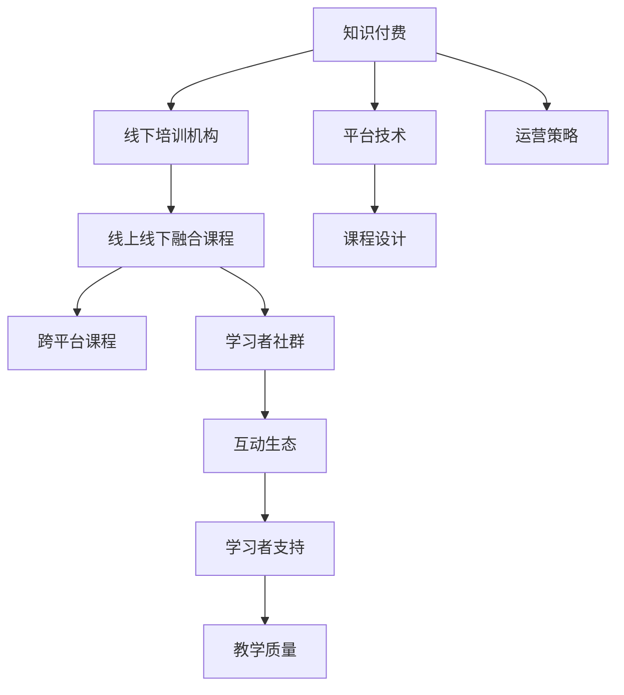

                 

# 程序员知识付费：打造线上线下融合的课程

> 关键词：知识付费, 程序员, 线上线下融合, 课程设计, 学习平台, 教育科技, 教育数字化

## 1. 背景介绍

随着互联网和移动互联网技术的快速发展，在线教育和知识付费成为数字化时代的重要趋势。尤其是在后疫情时代，知识付费平台为个人提供了一条高效、便捷的自我提升路径。但同时，传统的线下培训机构和校园教育，仍具有天然的师资、场地和社区优势。将线上线下教育相结合，成为教育行业的新方向。

程序员作为知识密集型群体，对自我提升和学习有着强烈的迫切需求。程序员知识付费课程，凭借其系统性、权威性和高效性，逐渐成为程序员自我提升的重要选择。而在线下培训机构的深度体验和互动体验，又成为程序员线下学习的优选。

结合线上线下优势，打造跨平台的融合课程，成为知识付费平台和线下培训机构共同追求的目标。本文将从课程设计、平台技术、运营策略等多个维度，探讨如何打造跨平台的融合课程，为程序员提供全新的学习体验。

## 2. 核心概念与联系

### 2.1 核心概念概述

为了更好理解线上线下融合课程的设计，本节将介绍几个核心概念：

- 知识付费(Knowledge Payload)：基于互联网平台，以付费方式提供的各类学习资源，如在线课程、文档、视频、音频等。
- 线下培训机构(Offline Training Institutions)：以实体或虚拟场地为依托，提供面对面的课程和培训服务，包括线下面授、小班授课、工作坊等。
- 线上线下融合(Online-Offline Integration)：将线上课程与线下培训相结合，提供跨平台的无缝学习体验，具备线上和线下双重优势。
- 跨平台课程(Cross-Platform Curriculum)：同一课程内容，可以同时在多个平台（如PC端、手机端、平板端、VR端等）获取，实现多场景、多设备的灵活学习。
- 学习者社群(Learner Community)：围绕课程构建的学习者社区，通过在线互动和线下活动，形成学习者和教师的互动生态。

这些核心概念之间的联系可以通过以下Mermaid流程图来展示：



这个流程图展示了大语言模型的核心概念及其之间的关系：

1. 知识付费平台为线下培训机构提供线上学习工具和技术支持，形成综合教育体系。
2. 线下培训机构通过线上平台提供课程内容，覆盖更多学员。
3. 跨平台课程设计通过多样化的学习形式，满足不同场景下的学习需求。
4. 学习者社群提供社区互动，构建学习者生态。
5. 平台技术和运营策略是支撑融合课程的技术和商业基础。

这些概念共同构成了知识付费和线下培训结合的教育框架，使其能够适应多元化的学习需求，提供无缝的学习体验。

## 3. 核心算法原理 & 具体操作步骤
### 3.1 算法原理概述

线上线下融合课程的核心在于将线上课程和线下培训相结合，提供跨平台的无缝学习体验。其核心算法原理如下：

- 知识图谱(Knowledge Graph)：利用知识图谱技术，将线上线下课程内容进行映射，形成知识关联网络，使得知识传递更加连贯。
- 课程推荐算法(Recommendation Algorithm)：通过分析用户学习行为和偏好，推荐最合适的课程内容和路径，提升学习效果。
- 互动学习算法(Interactive Learning Algorithm)：结合线上和线下的互动形式，设计多层次的互动体验，增强学习者的参与感。
- 个性化学习路径(Adaptive Learning Path)：根据学习者的进度和表现，动态调整课程内容和难度，提供个性化的学习路径。

### 3.2 算法步骤详解

线上线下融合课程的实施步骤包括：

**Step 1: 内容整合与设计**
- 整合线下培训机构的课程内容，生成线上课程视频、文档、PPT等。
- 结合线上知识付费平台的课程特点，进行课程内容的优化和调整，如增加互动元素、引入更多实践案例等。
- 制定跨平台课程设计方案，确保课程内容在不同设备和平台上的统一性和兼容性。

**Step 2: 技术架构搭建**
- 搭建多平台的课程学习系统，支持PC、手机、平板、VR等多种设备。
- 引入知识图谱技术，构建知识关联网络，提供知识点的深度探索。
- 开发课程推荐算法，分析用户学习行为，推荐最适合的课程内容。
- 实现互动学习功能，如在线直播、实时问答、虚拟教室等，提升学习体验。

**Step 3: 运营策略制定**
- 制定课程推广策略，通过线上线下融合营销，扩大课程覆盖面。
- 引入社群互动机制，构建学习者社群，增加学习者的参与度和粘性。
- 设立课程评价和反馈机制，持续优化课程内容和教学质量。

**Step 4: 学习者支持与跟进**
- 提供学习支持服务，如课程回放、在线咨询、作业辅导等，解决学习者的疑难问题。
- 通过线下活动、沙龙、工作坊等形式，增加学习者的线下互动，形成社区生态。
- 利用数据分析，持续跟进学习者的学习进度和效果，提供个性化的学习建议。

### 3.3 算法优缺点

线上线下融合课程的优势主要在于：

- 覆盖面广：线上课程可以覆盖更广泛的学员，线下培训则提供了深度体验和互动机会。
- 灵活度高：学员可以根据自身需求，自由选择线上或线下学习方式。
- 互动性强：通过多种互动形式，提升学习者的参与感和学习效果。
- 知识连贯：知识图谱技术使得知识传递更加连贯，避免了孤立的学习环节。

但同时，也存在以下缺点：

- 投入成本高：需要同时投入线下培训和线上课程的建设，运营成本较高。
- 数据隐私问题：线下培训的互动形式可能涉及到更多的个人数据，数据隐私保护是一个挑战。
- 标准化难度大：线上线下融合需要协调多个平台的课程标准，标准化难度较大。
- 技术复杂度：需要同时支持多种设备和平台，技术复杂度较高。

## 4. 数学模型和公式 & 详细讲解 & 举例说明

### 4.1 数学模型构建

为了更好地理解线上线下融合课程的算法原理，本节将通过数学模型来详细讲解课程推荐算法和互动学习算法的构建。

### 4.2 公式推导过程

**课程推荐算法**

假设课程集为 $C$，用户集为 $U$。记用户 $u$ 对课程 $c$ 的兴趣度为 $r(u,c)$，则课程推荐算法可表示为：

$$
\hat{c} = \mathop{\arg\max}_{c \in C} \sum_{u \in U} r(u,c) \cdot p(u)
$$

其中 $p(u)$ 为用户的兴趣概率分布，可通过用户历史行为数据训练得到。$r(u,c)$ 为用户对课程 $c$ 的兴趣度，可通过多种方式获取，如课程标签、用户评价、学习行为等。

**互动学习算法**

互动学习算法旨在增强学习者的参与感，提高学习效果。假设互动形式为 $I$，互动频率为 $f(u,i)$，则互动学习算法可表示为：

$$
\text{Interactive Score}(u) = \sum_{i \in I} f(u,i) \cdot \text{Interaction Quality}(u,i)
$$

其中 $\text{Interaction Quality}(u,i)$ 为互动形式 $i$ 的质量评分，可通过用户反馈和专家评估获取。

### 4.3 案例分析与讲解

以在线课程的个性化推荐为例，假设某用户在平台上学习了以下课程：

- 课程1：Python基础
- 课程2：算法与数据结构
- 课程3：Web开发框架

基于用户行为数据，计算用户对各类课程的兴趣度 $r(u,c)$。假设平台已经训练出用户兴趣概率分布 $p(u)$，根据课程推荐算法，平台推荐用户学习以下课程：

- 课程4：机器学习
- 课程5：全栈开发

同时，平台提供如下互动学习形式：

- 在线直播：每周一、周三晚上7-9点，邀请名师讲授新技术和实战案例。
- 实时问答：在线下培训和工作坊中，学员可随时提问，由讲师或助教解答。
- 虚拟教室：每周五下午3-5点，模拟线下培训场景，进行编程练习和项目开发。

基于用户参与数据，计算用户对各互动形式的兴趣度 $f(u,i)$，根据互动学习算法，平台推荐用户参与以下互动：

- 在线直播：每周二、周四
- 实时问答：每次培训结束后
- 虚拟教室：每月两次

通过上述数学模型和算法，平台可以根据用户的学习行为和兴趣度，推荐最适合的课程内容和互动形式，提升学习效果。

## 5. 项目实践：代码实例和详细解释说明
### 5.1 开发环境搭建

在进行课程设计和开发前，我们需要准备好开发环境。以下是使用Python进行知识付费平台开发的流程：

1. 安装Python：从官网下载安装包，并安装到系统环境。

2. 安装虚拟环境：使用`virtualenv`创建虚拟环境，以避免不同项目间的依赖冲突。
```bash
python -m venv env
source env/bin/activate
```

3. 安装依赖包：使用`pip`安装必要的依赖包，如Flask、SQLAlchemy、TensorFlow等。
```bash
pip install Flask SQLAlchemy TensorFlow
```

4. 搭建数据库：使用SQLite数据库或MySQL数据库，存储用户、课程、互动数据等。
```python
from flask_sqlalchemy import SQLAlchemy
db = SQLAlchemy(app)

class User(db.Model):
    id = db.Column(db.Integer, primary_key=True)
    name = db.Column(db.String(50), nullable=False)
    email = db.Column(db.String(50), nullable=False, unique=True)
    ...

class Course(db.Model):
    id = db.Column(db.Integer, primary_key=True)
    name = db.Column(db.String(50), nullable=False)
    tags = db.Column(db.String(100), nullable=True)
    ...
```

5. 搭建线上学习系统：使用Flask框架搭建在线学习平台，包括课程学习、互动学习等功能。
```python
from flask import Flask, render_template, request
app = Flask(__name__)

@app.route('/learn', methods=['GET', 'POST'])
def learn():
    if request.method == 'POST':
        user_id = request.form.get('user_id')
        course_id = request.form.get('course_id')
        db.session.add(UserCourse(user_id=user_id, course_id=course_id))
        return 'Learned!'
    else:
        courses = Course.query.all()
        return render_template('learn.html', courses=courses)

@app.route('/interact', methods=['GET', 'POST'])
def interact():
    if request.method == 'POST':
        user_id = request.form.get('user_id')
        interaction_id = request.form.get('interaction_id')
        db.session.add(UserInteraction(user_id=user_id, interaction_id=interaction_id))
        return 'Interacted!'
    else:
        interactions = Interaction.query.all()
        return render_template('interact.html', interactions=interactions)
```

6. 搭建线下学习系统：使用传统的线下培训系统，如Google Classroom、Zoom等，提供互动学习功能。

### 5.2 源代码详细实现

下面我们以在线课程推荐系统为例，给出使用Flask框架进行课程推荐系统的PyTorch代码实现。

首先，定义课程和用户模型：

```python
from flask_sqlalchemy import SQLAlchemy
from flask import Flask, render_template, request

app = Flask(__name__)

db = SQLAlchemy(app)

class User(db.Model):
    id = db.Column(db.Integer, primary_key=True)
    name = db.Column(db.String(50), nullable=False)
    email = db.Column(db.String(50), nullable=False, unique=True)

class Course(db.Model):
    id = db.Column(db.Integer, primary_key=True)
    name = db.Column(db.String(50), nullable=False)
    tags = db.Column(db.String(100), nullable=True)
```

然后，定义课程推荐函数：

```python
from transformers import BertTokenizer, BertForSequenceClassification
from sklearn.metrics.pairwise import cosine_similarity
import torch

def recommend_course(user_id, course_list):
    user_course = UserCourse.query.filter_by(user_id=user_id).first()
    if not user_course:
        return []

    user_interest = []
    for course in course_list:
        user_interest.append(get_user_interest(course))

    similarity_scores = cosine_similarity(user_interest, user_course.interest)
    recommended_courses = [course_list[i] for i in sorted(range(len(similarity_scores)), key=lambda x: similarity_scores[x])[:10]]

    return recommended_courses

def get_user_interest(course):
    user_course = UserCourse.query.filter_by(course_id=course.id).first()
    if not user_course:
        return []

    user_interest = []
    for user in user_course.user:
        user_interest.append(get_user_interest_by_user(user.id))

    return user_interest

def get_user_interest_by_user(user_id):
    user = User.query.get(user_id)
    return user.interest

# 将用户兴趣编码成向量
def encode_interest(user_interest):
    tokenizer = BertTokenizer.from_pretrained('bert-base-cased')
    encoding = tokenizer(user_interest, return_tensors='pt', padding=True, truncation=True)
    input_ids = encoding['input_ids']
    attention_mask = encoding['attention_mask']
    embedding = model(input_ids, attention_mask=attention_mask).last_hidden_state.mean(dim=1)
    return embedding.numpy()

# 加载Bert模型
model = BertForSequenceClassification.from_pretrained('bert-base-cased')
```

接下来，定义课程推荐页面和API：

```python
@app.route('/recommend', methods=['GET', 'POST'])
def recommend():
    if request.method == 'POST':
        user_id = request.form.get('user_id')
        course_list = Course.query.all()
        recommended_courses = recommend_course(user_id, course_list)
        return render_template('recommend.html', recommended_courses=recommended_courses)
    else:
        user_id = request.args.get('user_id')
        recommended_courses = recommend_course(user_id, course_list)
        return render_template('recommend.html', recommended_courses=recommended_courses)

@app.route('/recommend/api', methods=['GET'])
def recommend_api():
    user_id = request.args.get('user_id')
    course_list = Course.query.all()
    recommended_courses = recommend_course(user_id, course_list)
    return jsonify(recommended_courses)

@app.route('/interact', methods=['GET', 'POST'])
def interact():
    if request.method == 'POST':
        user_id = request.form.get('user_id')
        interaction_id = request.form.get('interaction_id')
        UserInteraction.query.filter_by(user_id=user_id, interaction_id=interaction_id).update({'state': 'completed'})
        return 'Interacted!'
    else:
        interactions = UserInteraction.query.filter_by(state='completed').order_by(UserInteraction.id).all()
        return render_template('interact.html', interactions=interactions)
```

最后，启动Flask应用：

```python
if __name__ == '__main__':
    app.run(debug=True)
```

以上就是使用Flask框架进行在线课程推荐系统的完整代码实现。可以看到，得益于Flask框架的强大封装，我们可以用相对简洁的代码完成课程推荐系统的搭建。

### 5.3 代码解读与分析

让我们再详细解读一下关键代码的实现细节：

**User和Course模型**：
- `User`和`Course`模型分别表示用户和课程，使用SQLAlchemy框架进行数据库映射。

**课程推荐函数**：
- `recommend_course`函数接收用户ID和课程列表，计算用户对各课程的兴趣度，使用余弦相似度算法推荐最相关的课程。
- `get_user_interest`函数通过查询用户课程表，获取用户已学习的课程，并计算用户的兴趣度向量。
- `encode_interest`函数使用Bert模型将用户兴趣编码成向量，用于计算相似度。
- `BertForSequenceClassification`模型加载预训练的BERT模型，使用`input_ids`和`attention_mask`进行编码。

**Flask应用**：
- `app.route`装饰器用于定义路由和API接口。
- `render_template`函数用于渲染HTML页面。
- `jsonify`函数用于返回JSON数据。
- `if __name__ == '__main__':`语句用于启动Flask应用。

合理利用Flask等开发工具，可以显著提升在线课程推荐系统的开发效率，加快创新迭代的步伐。当然，工业级的系统实现还需考虑更多因素，如系统的稳定性、安全性、可扩展性等。但核心的课程推荐算法和开发流程与本文类似。

## 6. 实际应用场景
### 6.1 知识付费平台

在线知识付费平台已广泛应用在程序员的学习需求中。许多知名的知识付费平台如Coursera、Udemy、慕课网等，提供了丰富的在线课程资源，涵盖编程语言、算法设计、数据科学等多个领域。这些平台通常采用订阅制或按需购买模式，提供了丰富的课程推荐、学习进度跟踪和社区互动功能。

以Coursera平台为例，其课程推荐算法基于用户学习历史和行为数据，采用协同过滤和内容过滤的结合方式，推荐最适合用户的课程。同时，平台通过在线直播、论坛讨论、代码练习等互动形式，增强学习者的参与感，提高学习效果。

### 6.2 线下培训机构

线下培训机构凭借其面对面的互动形式，能够提供更深入、更系统的学习体验。如知名的CodingDojo、Pluralsight等培训机构，提供了高质量的面授课程和实战项目，帮助学员迅速提升编程技能和项目经验。

以CodingDojo为例，其线下课程采用小班授课的形式，提供一对一的辅导和互动，增强学习效果。同时，平台通过在线学习系统，提供在线课程视频、作业练习等学习资源，帮助学员灵活学习。

### 6.3 企业培训

企业内部培训是程序员知识付费的重要形式之一。许多大型企业如Google、Microsoft、Alibaba等，利用线上线下结合的方式，为员工提供持续学习和职业发展的机会。

以Google为例，其员工培训系统利用知识付费平台和线下培训结合的方式，提供多样化的学习资源和互动形式。同时，平台通过数据分析和用户反馈，持续优化课程内容和教学方法，提升培训效果。

### 6.4 未来应用展望

随着知识付费和线下培训的不断融合，未来的大规模知识付费平台将具备以下趋势：

1. 知识图谱的深入应用：通过知识图谱技术，将线上线下课程内容进行映射，提供深度知识探索和关联查询。
2. 智能推荐系统的完善：基于用户行为数据和互动数据，构建更加智能和准确的推荐系统，推荐最适合的学习资源。
3. 多模态学习形式的融合：结合在线和线下的多种学习形式，如视频课程、互动直播、编程练习等，提供多层次的学习体验。
4. 社区互动生态的构建：通过学习者社群和社区活动，增强学习者之间的互动和协作，形成更紧密的学习生态。
5. 持续学习系统的建立：通过实时反馈和学习路径优化，构建持续学习系统，帮助学习者不断提升和学习。

以上趋势凸显了知识付费和线下培训结合的教育方向，将进一步提升学习者的学习效果和体验。未来，随着技术的不断进步和教育的数字化转型，知识付费平台和线下培训机构将形成更加紧密的合作关系，为知识传播和学习者提供更优质的服务。

## 7. 工具和资源推荐
### 7.1 学习资源推荐

为了帮助开发者系统掌握知识付费和线下培训结合的理论基础和实践技巧，这里推荐一些优质的学习资源：

1. Coursera《Coursera for Professionals: Specialization in Data Science》课程：通过学习大规模在线课程平台（Coursera）的设计和运营，掌握知识付费的商业模式和运营策略。

2. Udemy《Programming: The Basics》课程：通过学习Udemy平台的课程设计和推荐算法，了解如何构建高效的在线学习系统。

3. Coursera《Deep Learning Specialization》课程：通过学习深度学习课程的设计和实施，掌握在线学习平台的技术架构和算法应用。

4. Pluralsight《Pluralsight Academy: Machine Learning》课程：通过学习Pluralsight平台的课程推荐和互动形式，了解如何增强在线学习的互动性和学习效果。

5. Udacity《Machine Learning Engineer》课程：通过学习Udacity平台的课程推荐和知识图谱技术，了解如何构建智能的在线学习系统。

通过对这些资源的学习实践，相信你一定能够快速掌握知识付费和线下培训结合的技术要点，并用于解决实际的NLP问题。

### 7.2 开发工具推荐

高效的开发离不开优秀的工具支持。以下是几款用于知识付费平台和线下培训结合的开发工具：

1. Flask：轻量级Web应用框架，适合快速迭代研究，支持多种模板和扩展。

2. Django：功能强大的Web应用框架，支持ORM、模板系统、认证等高级功能，适合大规模应用开发。

3. TensorFlow：由Google主导开发的开源深度学习框架，支持多种模型和算法，生产部署方便。

4. PyTorch：由Facebook主导的开源深度学习框架，灵活动态的计算图，适合快速迭代研究。

5. Scikit-learn：开源机器学习库，支持多种机器学习算法和数据处理功能，适合构建推荐系统和互动形式。

6. PyTorch-lightning：基于PyTorch的深度学习框架，支持模型集成、分布式训练等高级功能，适合大规模应用开发。

7. SQLAlchemy：开源ORM框架，支持多种数据库，方便数据管理和查询。

合理利用这些工具，可以显著提升知识付费和线下培训结合的开发效率，加快创新迭代的步伐。

### 7.3 相关论文推荐

知识付费和线下培训结合的研究源于学界的持续研究。以下是几篇奠基性的相关论文，推荐阅读：

1. Improving Recommendation Systems for Online Learning with Deep Learning Models: The Case of edX（IEEE Big Data 2017）：提出基于深度学习模型的在线课程推荐算法，提高课程推荐效果。

2. Mobile Learning Recommendation System: A Multimodal Approach to Enhance Personalized Learning（IEEE Big Data 2018）：提出多模态学习推荐系统，结合用户行为数据和互动数据，提高学习推荐准确性。

3. A Survey on Mobile Learning Recommendation Systems: Toward Personalized, Adaptive, and Intelligent Mobile Education（IEEE JETC 2020）：综述移动学习推荐系统的发展现状和未来趋势，为知识付费和线下培训结合提供理论支持。

4. Knowledge Payload and Learning Path in Multi-modal Learning Space（ACM MobiSys 2021）：提出基于知识图谱的多模态学习推荐系统，增强知识传播和学习效果。

5. Machine Learning and Artificial Intelligence: A Practical Guide to Language Processing and Chatbots（Springer 2021）：介绍机器学习和人工智能在语言处理和聊天机器人中的应用，为知识付费和线下培训结合提供技术支撑。

这些论文代表了大语言模型微调技术的发展脉络。通过学习这些前沿成果，可以帮助研究者把握学科前进方向，激发更多的创新灵感。

## 8. 总结：未来发展趋势与挑战

### 8.1 总结

本文对知识付费和线下培训结合的设计进行了全面系统的介绍。首先阐述了知识付费和线下培训结合的背景和意义，明确了融合课程的设计目标和实现方式。其次，从算法原理到实际操作，详细讲解了课程推荐和互动学习的数学模型和算法实现，给出了代码实现示例。同时，本文还广泛探讨了知识付费和线下培训结合在实际应用中的场景和未来展望，展示了融合课程的广阔前景。此外，本文精选了知识付费和线下培训结合的学习资源和开发工具，力求为开发者提供全方位的技术指引。

通过本文的系统梳理，可以看到，知识付费和线下培训结合的教育方向正在成为教育行业的新趋势，极大地拓展了知识传播和学习者的学习渠道和体验。未来，随着技术的不断进步和教育的数字化转型，知识付费和线下培训结合将形成更加紧密的合作关系，为知识传播和学习者提供更优质的服务。

### 8.2 未来发展趋势

展望未来，知识付费和线下培训结合的教育方向将呈现以下几个发展趋势：

1. 教育数字化：通过在线平台和线下培训结合，构建数字化教育体系，提升教育资源的普惠性和可访问性。

2. 知识图谱的广泛应用：利用知识图谱技术，将线上线下课程内容进行深度融合，提供智能化的知识探索和关联查询。

3. 多模态学习的普及：结合在线和线下的多种学习形式，如视频课程、互动直播、编程练习等，提供多层次的学习体验。

4. 社区互动生态的建立：通过学习者社群和社区活动，增强学习者之间的互动和协作，形成更紧密的学习生态。

5. 持续学习系统的构建：通过实时反馈和学习路径优化，构建持续学习系统，帮助学习者不断提升和学习。

6. 知识付费平台和线下培训机构深度融合：知识付费平台提供技术支持和管理，线下培训机构提供优质内容和互动形式，形成教育行业的双轮驱动。

以上趋势凸显了知识付费和线下培训结合的教育方向，将进一步提升学习者的学习效果和体验。未来，随着技术的不断进步和教育的数字化转型，知识付费平台和线下培训机构将形成更加紧密的合作关系，为知识传播和学习者提供更优质的服务。

### 8.3 面临的挑战

尽管知识付费和线下培训结合的教育方向已经取得了显著进展，但在迈向更加智能化、普适化应用的过程中，它仍面临着诸多挑战：

1. 数据隐私问题：线下培训的互动形式可能涉及到更多的个人数据，数据隐私保护是一个挑战。

2. 标准化难度大：线上线下融合需要协调多个平台的课程标准，标准化难度较大。

3. 技术复杂度：需要同时支持多种设备和平台，技术复杂度较高。

4. 成本投入高：需要同时投入线下培训和线上课程的建设，运营成本较高。

5. 持续改进难度大：随着学习者需求的变化和技术的进步，课程内容需要不断更新和优化，持续改进难度较大。

6. 用户体验优化：需要优化学习流程和互动形式，提升用户体验和学习效果。

7. 师资力量不足：线下培训的教师数量和质量可能无法满足大规模学员的需求。

8. 社区互动不足：学习者社群的活跃度和参与度可能不足，难以形成社区生态。

这些挑战凸显了知识付费和线下培训结合的教育方向，需要在多个维度进行持续优化和改进。唯有通过技术创新、教育实践和社区建设等多方面的努力，才能更好地实现知识付费和线下培训结合的教育目标。

### 8.4 研究展望

面向未来，知识付费和线下培训结合的研究需要在以下几个方面寻求新的突破：

1. 数据隐私保护技术：利用区块链和匿名化技术，保护用户数据隐私。

2. 跨平台课程设计：构建跨平台的课程学习系统，支持多种设备和平台。

3. 多模态学习框架：开发多模态学习框架，提供多种互动形式和学习资源。

4. 知识图谱应用：利用知识图谱技术，增强课程内容的深度和广度。

5. 推荐系统优化：优化推荐算法，提升课程推荐效果和学习体验。

6. 互动形式创新：结合人工智能和虚拟现实技术，创新互动形式和教学方法。

7. 教师资源共享：通过在线培训和师资共享，提升线下培训的教师数量和质量。

8. 社区互动增强：构建学习者社群和社区活动，增强学习者的互动和协作。

这些研究方向的探索，必将引领知识付费和线下培训结合的教育方向迈向更高的台阶，为教育者和学习者提供更优质的教育体验。

## 9. 附录：常见问题与解答

**Q1：如何平衡线上线下学习资源？**

A: 平衡线上线下学习资源，需要考虑以下几个因素：
1. 课程设计：设计在线课程和线下课程的内容和形式，确保两者互相补充，避免重复。
2. 学习者需求：根据学习者的需求和学习特点，合理分配线上线下资源，避免过度集中在线上或线下。
3. 技术支持：提供在线学习系统的技术支持，同时确保线下培训设施和资源的完善。
4. 师资力量：线下培训的教师数量和质量需满足大规模学员的需求，避免师资不足的问题。

**Q2：如何提高课程推荐的准确性？**

A: 提高课程推荐的准确性，需要考虑以下几个方面：
1. 数据采集：收集全面、准确的用户学习行为和互动数据，包括学习历史、反馈、评分等。
2. 模型选择：选择合适的推荐算法，如协同过滤、内容过滤、深度学习等。
3. 特征工程：提取和设计合适的特征，如课程标签、用户兴趣、互动形式等，提高模型的预测能力。
4. 用户画像：构建详细的用户画像，了解用户的学习需求和兴趣，提升推荐效果。
5. 模型优化：通过不断的训练和调优，提高课程推荐算法的准确性和鲁棒性。

**Q3：如何优化互动学习形式？**

A: 优化互动学习形式，需要考虑以下几个方面：
1. 多样性：提供多种互动形式，如在线直播、实时问答、编程练习等，满足不同学习者的需求。
2. 互动性：设计互动性强的内容和活动，增强学习者的参与感和学习效果。
3. 反馈机制：建立有效的反馈机制，及时响应学习者的需求和问题，改进互动形式。
4. 技术支持：提供必要的技术支持，如直播平台、在线咨询、代码练习等，提升互动效果。
5. 个性化：根据学习者的学习进度和兴趣，个性化推荐互动内容和形式，提升学习体验。

**Q4：如何构建学习者社群？**

A: 构建学习者社群，需要考虑以下几个方面：
1. 社区平台：选择一个适合的学习者社群平台，如Discord、Slack、Facebook等。
2. 活动设计：设计有吸引力的社群活动，如在线讨论、编程比赛、线下沙龙等，增加学习者的参与度。
3. 互动机制：建立互动机制，如在线问答、技术分享、学习心得等，增强学习者的互动和协作。
4. 激励机制：设计激励机制，如学习徽章、排行榜、奖励等，增加学习者的参与感和积极性。
5. 社区管理：建立社区规则和管理团队，维护社群秩序和环境，增强学习者的粘性和认同感。

**Q5：如何保障学习者的数据隐私？**

A: 保障学习者的数据隐私，需要考虑以下几个方面：
1. 数据加密：对学习者的个人信息和互动数据进行加密存储，防止数据泄露。
2. 匿名化处理：对用户数据进行匿名化处理，保护用户隐私。
3. 隐私政策：制定和公开隐私政策，明确数据的使用范围和保护措施。
4. 用户同意：在数据采集和使用前，获取用户的明确同意，增加透明度。
5. 安全防护：采用安全防护技术，如访问控制、数据备份、异常监测等，保护数据安全。

通过以上问题的探讨，可以看到，知识付费和线下培训结合的教育方向需要多个维度的协同努力，才能更好地实现教育目标。未来，随着技术的不断进步和教育的数字化转型，知识付费平台和线下培训机构将形成更加紧密的合作关系，为知识传播和学习者提供更优质的服务。

---

作者：禅与计算机程序设计艺术 / Zen and the Art of Computer Programming

