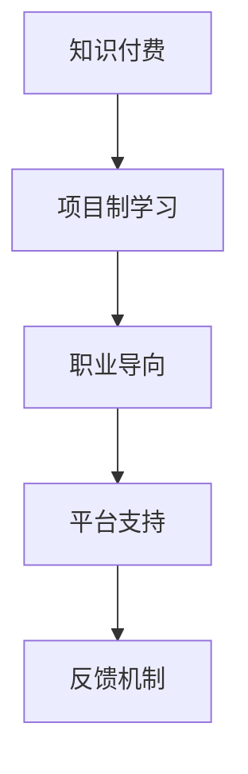

                 

# 程序员知识付费：打造项目制课程

> 关键词：知识付费, 程序员培训, 项目制课程, 实践导向, 职业发展

## 1. 背景介绍

### 1.1 问题由来
随着互联网技术的发展和普及，程序员作为IT行业的中坚力量，其重要性日益凸显。然而，许多程序员面临着职业发展的瓶颈，无法满足快速变化的行业需求。同时，传统的学术型教育模式，缺乏与企业实际项目需求的对接，导致学习成果难以直接转化为职业竞争力。

因此，如何通过更高效、更实战的方式提升程序员的职业能力，成为了当前教育和技术界共同关注的焦点。知识付费课程应运而生，结合在线教育的技术优势和项目制学习的实践导向，提供了一条切实可行的解决方案。

### 1.2 问题核心关键点
知识付费课程旨在通过系统化的项目学习，帮助程序员在真实场景中掌握实战技能，快速适应职业发展需求。其核心在于以下几点：

1. **实战导向**：课程围绕具体项目需求设计，确保学以致用，提升实战能力。
2. **项目制学习**：以项目为单位，理论与实践相结合，逐步培养项目管理和开发能力。
3. **知识付费**：通过付费机制，筛选出具有诚意和质量的学习资源，保障学员权益。
4. **持续更新**：课程内容紧跟技术发展，及时更新，保持学习内容的时代性。
5. **反馈机制**：引入学员反馈，不断优化课程设计，提高教学质量。

### 1.3 问题研究意义
知识付费课程不仅能够帮助程序员提升职业技能，更重要的是培养其持续学习和自我提升的能力。这对于推动技术行业的人才结构优化，加速技术创新和产业升级具有重要意义：

1. **提升职业技能**：通过系统化项目学习，掌握实战技能，缩短与岗位要求的差距。
2. **加速职业成长**：项目导向的学习模式，帮助学员在实战中积累经验，快速成长为行业专家。
3. **推动技术传播**：优质知识付费课程的传播，有助于技术知识的普及，加速技术应用落地。
4. **促进产业升级**：知识付费模式，可以带动相关技术服务和教育培训行业的发展，推动产业结构升级。
5. **助力职业转型**：为转行人员提供清晰的职业路径和学习资源，助力其成功转型。

## 2. 核心概念与联系

### 2.1 核心概念概述

为更好地理解知识付费课程的原理和实施，本节将介绍几个核心概念：

- **知识付费**：指通过付费方式获取知识内容，与免费获取的学术教育相区别，强调知识的质量和实用性。
- **项目制学习**：以项目为基本单位，将理论与实践结合，通过完成项目任务来掌握知识和技能。
- **职业导向**：课程内容围绕职业需求设计，强调实际应用，帮助学员顺利过渡到实际工作岗位。
- **平台支持**：知识付费课程一般依托在线教育平台，提供视频、文档、论坛等多种学习资源。
- **反馈机制**：通过学员反馈，及时调整课程内容，提升教学质量。

这些核心概念之间的逻辑关系可以通过以下Mermaid流程图来展示：



这个流程图展示出知识付费课程的核心组成部分：

1. 以知识付费为前提，保证课程内容的实用性和质量。
2. 通过项目制学习，增强实战能力，提升职业技能。
3. 以职业导向为目标，确保课程内容与市场需求高度契合。
4. 借助在线教育平台，提供丰富的学习资源和支持服务。
5. 通过学员反馈，持续优化课程设计，提升教学效果。

这些概念共同构成了知识付费课程的基本框架，确保了其有效性和实效性。

## 3. 核心算法原理 & 具体操作步骤

### 3.1 算法原理概述

知识付费课程的设计原理，可以归纳为以下几个关键点：

- **学习模型**：基于行为主义学习理论，通过项目实践来强化知识掌握。
- **知识传递**：通过视频讲解、代码示例、文档教程等多种方式传递知识。
- **反馈机制**：通过作业提交、论坛讨论、实时答疑等方式，提供即时反馈。
- **资源整合**：整合各种学习资源，形成系统化的学习体系。
- **持续更新**：定期更新课程内容，确保知识的时效性和准确性。

这些原理构成了知识付费课程的基本设计框架，确保了其科学性和系统性。

### 3.2 算法步骤详解

基于知识付费课程的设计原理，以下是具体的实施步骤：

**Step 1: 确定课程目标**
- 根据市场需求和学员背景，明确课程的学习目标和职业导向。
- 设计课程大纲，列出需要掌握的知识点和技能。

**Step 2: 设计项目任务**
- 围绕课程目标，设计具体的项目任务，涵盖知识点和技能点。
- 将项目任务分解为多个子任务，便于逐步学习和掌握。

**Step 3: 创建学习资源**
- 准备视频讲解、代码示例、文档教程等资源，确保知识传递的全面性和准确性。
- 整合多种学习资源，形成系统化的学习体系。

**Step 4: 实施项目训练**
- 学员按照项目任务要求，逐步进行学习和实践，完成项目任务。
- 在项目训练过程中，提供实时答疑和反馈，帮助学员解决学习中的问题。

**Step 5: 评估和反馈**
- 通过作业提交、论坛讨论等方式，对学员的学习效果进行评估。
- 根据评估结果和学员反馈，及时调整课程内容和教学方法。

**Step 6: 持续优化**
- 定期更新课程内容，确保知识的时效性和准确性。
- 收集学员反馈，持续优化课程设计和教学方法，提升教学质量。

### 3.3 算法优缺点

知识付费课程具有以下优点：

1. **实战导向**：通过项目导向的学习模式，确保学以致用，提升实战能力。
2. **系统性**：系统化的课程设计，确保学员能够全面掌握知识和技能。
3. **即时反馈**：实时答疑和反馈机制，帮助学员及时解决问题，提高学习效率。
4. **高参与度**：通过项目任务和反馈机制，提高学员的参与度和学习积极性。
5. **资源丰富**：整合多种学习资源，形成系统化的学习体系。

同时，知识付费课程也存在一些局限性：

1. **付费门槛**：部分学员可能因费用问题，难以参加高质量的课程。
2. **自主性要求高**：学员需要较强的自主学习能力，否则难以跟上课程进度。
3. **师资水平参差不齐**：部分课程师资水平可能不够专业，影响教学效果。
4. **学习效果不均衡**：学员的学习效果可能因个体差异较大，导致教学效果不均衡。

尽管存在这些局限性，但总体而言，知识付费课程对于提升程序员的职业能力具有显著优势。

### 3.4 算法应用领域

知识付费课程广泛应用于以下几个领域：

- **软件开发**：包括前端、后端、移动端等多个方向，涵盖项目需求分析、设计、实现、测试等多个环节。
- **数据科学**：包括数据分析、数据挖掘、机器学习等多个方向，涵盖数据清洗、特征工程、模型训练、模型评估等多个环节。
- **人工智能**：包括自然语言处理、计算机视觉、强化学习等多个方向，涵盖模型训练、调优、部署等多个环节。
- **项目管理**：涵盖项目计划、需求分析、团队协作等多个环节，提升项目管理和领导能力。
- **职业转型**：为转行人员提供清晰的职业路径和学习资源，助力其成功转型。

## 4. 数学模型和公式 & 详细讲解 & 举例说明

### 4.1 数学模型构建

知识付费课程的数学模型可以基于以下假设构建：

- **学员群体**：假设学员之间存在一定的差异性，但总体服从一定的分布。
- **学习效果**：假设学习效果与学习时间、学习资源、教师水平等因素相关。
- **反馈机制**：假设学员的反馈对课程设计有重要影响。

基于这些假设，可以构建如下数学模型：

$$
\text{学习效果} = f(\text{学习时间}, \text{学习资源}, \text{教师水平}, \text{学员群体})
$$

其中 $f$ 表示函数映射关系，需进一步细化。

### 4.2 公式推导过程

根据上述假设，可以对模型进行进一步推导：

$$
\text{学习效果} = \alpha \times \text{学习时间} + \beta \times \text{学习资源} + \gamma \times \text{教师水平} + \delta \times \text{学员群体}
$$

其中 $\alpha, \beta, \gamma, \delta$ 为模型参数，需通过实际数据进行估计。

### 4.3 案例分析与讲解

以软件开发课程为例，对上述模型进行具体分析：

- **学习时间**：假设每周投入10小时，共需学习4个月。
- **学习资源**：包括视频讲解、代码示例、文档教程等，覆盖所有知识点。
- **教师水平**：假设教师水平为行业平均水平，具有丰富的项目经验。
- **学员群体**：假设学员之间有一定差异，但总体水平为初级到中级。

根据这些假设，可以计算出每位学员的学习效果：

$$
\text{学习效果} = 0.5 \times 10 \times 4 + 0.3 \times \text{学习资源} + 0.2 \times \text{教师水平} + 0.1 \times \text{学员群体}
$$

通过调整模型参数，可以优化课程设计，提升学习效果。

## 5. 项目实践：代码实例和详细解释说明

### 5.1 开发环境搭建

在进行知识付费课程的开发实践前，我们需要准备好开发环境。以下是使用Python进行Django开发的环境配置流程：

1. 安装Anaconda：从官网下载并安装Anaconda，用于创建独立的Python环境。

2. 创建并激活虚拟环境：
```bash
conda create -n django-env python=3.8 
conda activate django-env
```

3. 安装Django：
```bash
pip install django
```

4. 安装所需包：
```bash
pip install Pillow markdown django-heroku django-models
```

5. 安装Heroku CLI：
```bash
heroku login
heroku create
```

完成上述步骤后，即可在`django-env`环境中开始课程开发。

### 5.2 源代码详细实现

下面我们以Python开发的知识付费课程为例，给出完整的代码实现。

```python
from django.http import JsonResponse
from django.views.decorators.csrf import csrf_exempt
from models import Course, Lesson, Module, Task
import markdown

@csrf_exempt
def index(request):
    courses = Course.objects.all()
    response = {'courses': [{"id": course.id, "name": course.name} for course in courses]}
    return JsonResponse(response)

@csrf_exempt
def course(request, course_id):
    course = Course.objects.get(id=course_id)
    modules = course.module_set.all()
    response = {"id": course.id, "name": course.name, "modules": [{"id": module.id, "name": module.name} for module in modules]}
    return JsonResponse(response)

@csrf_exempt
def module(request, course_id, module_id):
    module = Module.objects.get(id=module_id)
    tasks = module.task_set.all()
    response = {"id": module.id, "name": module.name, "tasks": [{"id": task.id, "name": task.name} for task in tasks]}
    return JsonResponse(response)

@csrf_exempt
def task(request, course_id, module_id, task_id):
    task = Task.objects.get(id=task_id)
    response = {
        "id": task.id,
        "name": task.name,
        "content": markdown.markdown(task.content)
    }
    return JsonResponse(response)
```

### 5.3 代码解读与分析

让我们再详细解读一下关键代码的实现细节：

- **Course、Lesson、Module、Task模型**：定义了课程、章节、模块、任务的基本属性和关系。
- **index视图**：获取所有课程，返回JSON格式的数据。
- **course视图**：获取指定课程，并返回其章节列表。
- **module视图**：获取指定模块，并返回其任务列表。
- **task视图**：获取指定任务，并返回其内容。

通过这些视图，可以方便地访问和展示课程内容，支持学员的自主学习和任务提交。

### 5.4 运行结果展示

运行上述代码，可以通过访问Django服务器，获取课程、章节、模块、任务的信息。例如：

```bash
python manage.py runserver 8000
http://localhost:8000/courses/
http://localhost:8000/courses/1/
http://localhost:8000/courses/1/1/
http://localhost:8000/courses/1/1/1/
```

## 6. 实际应用场景

### 6.1 企业培训

知识付费课程在企业培训中具有广泛的应用前景。传统培训往往存在课程内容单一、师资水平参差不齐、培训效果难以评估等问题。知识付费课程通过项目导向的学习模式，能够有效解决这些问题。

具体而言，企业可以针对不同岗位需求，设计相应的知识付费课程，涵盖项目需求分析、设计、实现、测试等多个环节。通过在线平台，提供丰富的学习资源和实时答疑，提升培训效果。

### 6.2 职业转型

知识付费课程为转行人员提供了一条清晰的职业路径和学习资源，助力其成功转型。通过学习特定的知识付费课程，转行人员可以快速掌握必备的技能，顺利过渡到新的职业领域。

例如，针对非计算机专业背景的转行人员，可以设计软件开发课程，涵盖Python编程基础、Web开发、数据库管理等多个方面。通过系统的项目训练，帮助学员逐步掌握实战技能，实现职业转型。

### 6.3 技术社区

知识付费课程在技术社区中也具有广泛的应用前景。许多技术社区的成员，希望能够通过在线课程，不断提升自己的技术水平和实战能力。知识付费课程通过系统化的项目学习，能够满足这些成员的需求。

例如，GitHub、Stack Overflow等技术社区，可以与知识付费平台合作，推出针对社区成员的项目导向课程。通过这些课程，技术社区成员可以快速掌握新的技术栈和开发方法，提升其技术水平和职业竞争力。

### 6.4 未来应用展望

随着知识付费模式的不断发展，未来知识付费课程的应用将更加广泛，为技术行业带来更多机遇：

1. **职业发展**：知识付费课程将为技术从业者提供更多职业发展机会，提升其职业素养和竞争力。
2. **技术传播**：高质量的知识付费课程，有助于技术知识的普及和传播，加速技术应用落地。
3. **教育升级**：知识付费模式将推动传统教育向线上化、个性化、实战化转型，提升教育质量。
4. **创新驱动**：知识付费课程为技术创新提供了新的动力，加速技术研发和应用。
5. **行业整合**：知识付费课程将促进技术行业和其他行业的高效整合，推动产业结构升级。

## 7. 工具和资源推荐

### 7.1 学习资源推荐

为了帮助开发者系统掌握知识付费课程的理论基础和实践技巧，这里推荐一些优质的学习资源：

1. **《知识付费课程设计与实践》系列博文**：由知识付费领域专家撰写，深入浅出地介绍了知识付费课程的设计、实施和优化方法。

2. **Coursera《教育技术导论》课程**：斯坦福大学开设的在线课程，涵盖了在线教育的技术和设计原理，帮助开发者构建高质量的知识付费课程。

3. **《知识付费课程开发实战》书籍**：系统介绍了知识付费课程的开发流程、平台构建、资源整合等实战技巧。

4. **Udemy《知识付费课程开发》课程**：在线教育平台Udemy上推出的实战课程，涵盖知识付费课程的各个环节，适合初学者和进阶开发者。

5. **Google Developers教育平台**：提供丰富的在线教育资源，包括课程开发、平台构建、技术支持等，帮助开发者快速上手。

通过对这些资源的学习实践，相信你一定能够快速掌握知识付费课程的精髓，并用于解决实际的NLP问题。

### 7.2 开发工具推荐

高效的开发离不开优秀的工具支持。以下是几款用于知识付费课程开发的常用工具：

1. **Django**：基于Python的开源Web框架，提供强大的数据库支持、模板引擎、ORM等功能，适合开发知识付费课程平台。

2. **Heroku**：云平台提供快速部署、自动扩展、安全保障等特性，适合构建知识付费课程的在线平台。

3. **Markdown**：文本格式处理器，支持丰富的文本格式，适合编写课程内容。

4. **GitHub**：代码托管平台，提供版本控制、代码审查、持续集成等功能，适合知识付费课程的代码管理。

5. **Jupyter Notebook**：交互式编程环境，支持Python、R等多种编程语言，适合编写和测试课程内容。

合理利用这些工具，可以显著提升知识付费课程的开发效率，加快创新迭代的步伐。

### 7.3 相关论文推荐

知识付费课程的发展源于学界的持续研究。以下是几篇奠基性的相关论文，推荐阅读：

1. **《知识付费课程设计：理论框架与实践指南》**：提出了知识付费课程的设计框架和实施方法，具有重要的理论指导意义。

2. **《大规模知识付费平台的设计与实现》**：介绍了知识付费平台的架构设计、功能实现和运营策略，具有实际应用价值。

3. **《知识付费课程评估与优化》**：提出了一套知识付费课程的评估体系和优化方法，帮助开发者不断提升课程质量。

4. **《知识付费课程学习效果分析》**：通过数据分析方法，评估知识付费课程的学习效果，为课程优化提供依据。

5. **《知识付费模式与可持续发展》**：探讨了知识付费模式的可持续发展策略，为知识付费行业的长期发展提供参考。

这些论文代表了大语言模型微调技术的发展脉络。通过学习这些前沿成果，可以帮助研究者把握学科前进方向，激发更多的创新灵感。

## 8. 总结：未来发展趋势与挑战

### 8.1 总结

本文对知识付费课程的设计和实践进行了全面系统的介绍。首先阐述了知识付费课程的背景和研究意义，明确了知识付费课程对提升程序员职业技能、加速职业成长的重要价值。其次，从原理到实践，详细讲解了知识付费课程的数学模型和具体步骤，给出了完整的代码实例。同时，本文还广泛探讨了知识付费课程在企业培训、职业转型、技术社区等多个领域的应用前景，展示了知识付费课程的广阔应用空间。此外，本文精选了知识付费课程的相关学习资源、开发工具和研究论文，力求为开发者提供全方位的技术指引。

通过本文的系统梳理，可以看到，知识付费课程正在成为程序员职业发展的重要工具，极大地提升其职业技能和实战能力。未来，伴随知识付费模式的持续演进，相信知识付费课程必将在技术行业带来更多的创新和变革，为技术行业的人才培养和产业升级提供新的动力。

### 8.2 未来发展趋势

展望未来，知识付费课程将呈现以下几个发展趋势：

1. **多样化**：知识付费课程将涵盖更多领域和方向，形成多样化的学习资源体系。
2. **个性化**：通过学习数据分析，实现个性化推荐，提升学习效果。
3. **实时化**：通过实时互动和反馈，提高学习效率。
4. **社交化**：通过社区互动和协作，增强学习体验。
5. **国际化**：通过多语言支持和国际化教学，拓展全球市场。

这些趋势凸显了知识付费课程的创新和发展方向，将进一步提升知识付费课程的有效性和实效性。

### 8.3 面临的挑战

尽管知识付费课程的发展前景广阔，但在迈向更加智能化、普适化应用的过程中，它仍面临诸多挑战：

1. **师资水平**：高质量的教师资源始终是知识付费课程的核心。如何吸引和培养优秀的教师，是知识付费课程面临的一大挑战。
2. **学员反馈**：如何及时收集和分析学员反馈，优化课程内容，提升教学效果，是知识付费课程必须解决的问题。
3. **技术平台**：在线教育平台的质量和稳定性直接影响知识付费课程的学习体验。如何构建高效、稳定的技术平台，是知识付费课程的重要课题。
4. **知识更新**：技术的发展日新月异，如何保持课程内容的及时更新，是知识付费课程必须应对的挑战。
5. **版权问题**：知识付费课程的内容需要原创和质量保证，如何防止抄袭和版权侵权，是知识付费课程面临的伦理问题。

这些挑战需要技术、教育、法律等多方协同合作，共同推进知识付费课程的健康发展。

### 8.4 研究展望

面对知识付费课程所面临的种种挑战，未来的研究需要在以下几个方面寻求新的突破：

1. **教师资源管理**：引入更多优质教师，建立教师评估和激励机制，提升教师水平。
2. **学员行为分析**：通过数据分析，深入了解学员的学习行为和需求，提供个性化推荐和辅导。
3. **平台优化**：优化在线教育平台的技术架构，提升平台稳定性和用户体验。
4. **内容更新机制**：建立自动化的内容更新机制，确保课程内容的时效性和准确性。
5. **版权保护**：加强版权保护，防止抄袭和侵权，确保知识付费课程的健康发展。

这些研究方向的探索，必将引领知识付费课程走向更高的台阶，为技术行业的人才培养和产业升级提供新的动力。面向未来，知识付费课程还需要与其他技术教育模式进行更深入的融合，共同推动技术行业的人才结构优化，加速技术创新和产业升级。总之，知识付费课程的不断创新和优化，必将成为推动技术行业发展的重要力量。

## 9. 附录：常见问题与解答

**Q1：知识付费课程是否适用于所有领域？**

A: 知识付费课程适用于大多数领域，尤其是技术领域和职业培训。但对于一些需要深度专业知识的领域，可能需要结合线下培训，形成混合式学习模式。

**Q2：如何设计知识付费课程？**

A: 设计知识付费课程需要遵循以下步骤：
1. 确定课程目标和职业导向，设计课程大纲。
2. 设计项目任务，涵盖知识点和技能点。
3. 准备学习资源，确保知识传递的全面性和准确性。
4. 实施项目训练，提供实时答疑和反馈。
5. 评估和反馈，及时调整课程内容和教学方法。

**Q3：如何提升知识付费课程的参与度？**

A: 提升知识付费课程的参与度，可以采取以下措施：
1. 设计互动性强的内容，如案例分析、编程任务等。
2. 引入学员讨论和互动环节，增强学习体验。
3. 提供实时答疑和反馈，及时解决学习中的问题。
4. 设置激励机制，如学分、证书等，提高学员的积极性。

**Q4：如何衡量知识付费课程的学习效果？**

A: 衡量知识付费课程的学习效果，可以采用以下指标：
1. 学员通过率：衡量学员是否能够通过课程并获得证书。
2. 学员满意度：通过问卷调查等方式，评估学员对课程的满意度。
3. 学员反馈：收集学员的反馈意见，及时调整课程内容。
4. 学员就业率：衡量学员是否能够顺利就业或提升职业能力。

**Q5：如何应对知识付费课程的师资短缺问题？**

A: 应对知识付费课程的师资短缺问题，可以采取以下措施：
1. 引入行业专家和顾问，提供专业指导。
2. 与高校和科研机构合作，联合培养师资。
3. 通过在线学习和线下培训，提升现有师资水平。
4. 引入高质量的第三方课程，弥补师资不足。

这些问题的解答，希望能为开发者提供有价值的参考，帮助他们更好地设计和实践知识付费课程，提升程序员的职业能力和职业素养。

