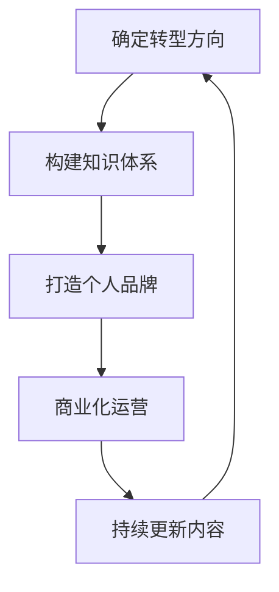

                 

# 程序员转型知识付费创业指南

> 关键词：程序员转型,知识付费,创业指南,IT,人工智能,机器学习,软件开发,深度学习,自然语言处理,NLP,数据科学

## 1. 背景介绍

### 1.1 问题由来

在过去的几十年里，计算机技术的迅猛发展为程序员提供了无数职业机会。然而，随着人工智能（AI）和深度学习技术的崛起，传统的软件开发工作模式开始受到挑战。越来越多的企业开始重视AI和数据科学人才，而非传统的软件工程师。这种变化迫使许多程序员不得不转型，寻找新的职业方向。

在这一背景下，知识付费成为了程序员转型的一个热门选择。通过在线课程、博客文章、视频教程等方式，程序员可以将自己的专业知识转化为经济价值。这不仅可以帮助他们实现职业转型，还可以在技术领域保持竞争力。然而，如何成功转型并开展知识付费业务，是许多程序员面临的挑战。

### 1.2 问题核心关键点

1. **确定转型方向**：选择合适的技术方向，如机器学习、数据科学、人工智能、自然语言处理（NLP）等。
2. **构建知识体系**：系统学习相关技术，并掌握实际应用技能。
3. **打造个人品牌**：通过社交媒体、博客、视频平台等方式，建立个人品牌，吸引潜在客户。
4. **商业化运营**：制定商业模式，选择合适的平台进行内容发布，实现盈利。
5. **持续更新内容**：保持技术领先，不断更新内容，满足市场需求。

## 2. 核心概念与联系

### 2.1 核心概念概述

- **技术栈**：指在特定应用场景下使用的技术集合。程序员需要掌握从基础的编程语言到高级的AI框架等多种技能。
- **知识付费**：指通过在线课程、博客、视频等方式，将知识以付费形式提供给用户，以实现职业转型和持续发展。
- **商业化运营**：将知识付费业务进行商业化操作，包括产品定价、市场推广、客户服务等多个环节。
- **内容创作**：创建高质量、有价值的内容，满足用户需求，提高用户满意度和忠诚度。

### 2.2 核心概念原理和架构的 Mermaid 流程图



这个流程图展示了程序员转型知识付费的基本路径：首先确定转型方向，然后构建相关知识体系，接着打造个人品牌，最后实现商业化运营并持续更新内容。

## 3. 核心算法原理 & 具体操作步骤

### 3.1 算法原理概述

知识付费创业的核心算法原理在于如何将个人的专业知识转化为商业价值。这涉及到内容创作、用户需求分析、定价策略等多个方面的决策。

1. **内容创作**：通过系统的学习和实践，掌握特定领域的技术和知识，并转化为易于理解、有价值的内容。
2. **用户需求分析**：通过市场调研和用户反馈，了解用户需求和痛点，制定针对性的内容。
3. **定价策略**：根据内容的价值和市场需求，设定合适的价格，以吸引用户并实现盈利。
4. **商业化运营**：选择合适的平台进行内容发布，并进行市场推广和用户服务，实现业务运营和盈利。

### 3.2 算法步骤详解

#### 步骤 1：确定转型方向

- **市场调研**：通过行业报告、论坛、社交媒体等方式，了解当前市场需求和技术趋势。
- **个人兴趣和优势**：分析自己的兴趣和优势，确定最适合自己的技术方向。
- **行业专家咨询**：咨询相关领域的专家，获取专业意见和建议。

#### 步骤 2：构建知识体系

- **学习资源**：选择权威的学习资源，如在线课程、书籍、论文等，系统学习相关知识。
- **实践项目**：通过实际项目积累经验，提高实战能力。
- **持续学习**：保持对新技术的关注和学习，不断更新自己的知识体系。

#### 步骤 3：打造个人品牌

- **社交媒体**：在社交媒体平台建立个人品牌，分享技术见解和项目成果。
- **博客和视频**：创建个人博客或视频频道，发布高质量内容，吸引目标用户。
- **社群互动**：参与技术社区和论坛，建立良好的社群关系，扩大影响力。

#### 步骤 4：商业化运营

- **平台选择**：选择合适的知识付费平台，如Udemy、Coursera、网易云课堂等。
- **内容发布**：根据平台要求和用户需求，发布高质量内容。
- **市场推广**：通过SEO、社交媒体广告、内容营销等方式，提高课程曝光率。
- **客户服务**：提供优质的客户服务，及时解答用户疑问，提升用户体验。

### 3.3 算法优缺点

#### 优点

1. **灵活性强**：知识付费创业不受地域和时间的限制，可以随时随地进行。
2. **收益可观**：相比于传统的软件开发工作，知识付费创业的收益潜力更大。
3. **社会认可**：通过分享知识和经验，提升个人品牌和社会认可度。

#### 缺点

1. **竞争激烈**：知识付费市场竞争激烈，需要不断创新和优化内容。
2. **时间成本高**：需要投入大量时间进行内容创作和学习。
3. **用户需求多变**：需要及时调整内容，以满足用户不断变化的需求。

### 3.4 算法应用领域

知识付费创业的应用领域广泛，涵盖多个技术和行业方向：

- **机器学习和数据科学**：提供各种机器学习算法和数据科学工具的使用教程。
- **人工智能和深度学习**：教授深度学习框架、模型训练、应用场景等。
- **软件开发和编程**：分享软件开发的最佳实践、编程技巧、框架使用等。
- **自然语言处理（NLP）**：讲解NLP技术的应用，如文本分析、情感分析、语言生成等。
- **数据科学和统计学**：提供数据科学和统计学的基础知识和技术应用。

## 4. 数学模型和公式 & 详细讲解 & 举例说明

### 4.1 数学模型构建

假设程序员A掌握了X种技术，用户需求为Y，知识付费创业的数学模型可以表示为：

$$
M(A, Y) = \sum_{i=1}^X \sum_{j=1}^Y P(A_i, Y_j)
$$

其中，$P(A_i, Y_j)$表示程序员A在技术$i$上掌握到用户需求$Y_j$的概率。模型目标是最优化该概率。

### 4.2 公式推导过程

1. **用户需求分析**：通过问卷调查、数据分析等方式，确定用户的主要需求，即$Y$。
2. **技术栈评估**：对程序员A掌握的$X$种技术进行评估，确定每种技术掌握程度。
3. **知识匹配**：计算每种技术$i$与用户需求$Y_j$的匹配度，即$P(A_i, Y_j)$。
4. **优化模型**：通过调整技术掌握程度和学习策略，优化模型参数，提高匹配度。

### 4.3 案例分析与讲解

假设程序员A掌握了Python、Java和机器学习三种技术，用户需求为数据分析、机器学习和软件开发。通过公式计算，得到$P(A_{Python}, Y_{数据分析})=0.8$，$P(A_{Java}, Y_{软件开发})=0.9$，$P(A_{机器学习}, Y_{数据分析})=0.7$。

根据这些匹配度，A可以选择重点推广机器学习相关的课程，以满足用户需求，提高用户满意度和忠诚度。

## 5. 项目实践：代码实例和详细解释说明

### 5.1 开发环境搭建

#### 5.1.1 编程语言和框架

- **Python**：Python是知识付费创业的主流编程语言，具有丰富的第三方库和框架。
- **Jupyter Notebook**：用于创建和分享代码和研究成果。
- **Git**：版本控制工具，方便协作和管理代码。
- **Markdown**：用于编写博客和文档，易于格式化和编辑。

#### 5.1.2 环境配置

1. **安装Python和相关库**：
   ```bash
   sudo apt-get update
   sudo apt-get install python3 python3-pip
   pip install jupyter notebook ipywidgets
   ```

2. **安装Git**：
   ```bash
   sudo apt-get install git
   ```

3. **创建项目目录**：
   ```bash
   mkdir myproject
   cd myproject
   git init
   ```

### 5.2 源代码详细实现

#### 5.2.1 编写博客文章

```python
from IPython.display import HTML, display
from IPython import display

def markdown_to_html(markdown):
    html = markdown.replace('\n', '<br>')
    display(HTML(html))

# 示例博客文章
markdown_text = """
# 程序员转型知识付费创业指南

通过在线课程、博客文章、视频教程等方式，程序员可以将自己的专业知识转化为经济价值。这不仅可以帮助他们实现职业转型，还可以在技术领域保持竞争力。

本文将详细介绍程序员如何成功转型并开展知识付费业务，包括选择合适的技术方向、构建知识体系、打造个人品牌和商业化运营等多个方面。
"""

markdown_to_html(markdown_text)
```

#### 5.2.2 制作视频教程

```python
from IPython.display import YouTubeVideo
from IPython.display import display

# 示例视频链接
video_link = 'https://www.youtube.com/watch?v=abc123'

# 视频教程展示
display(YouTubeVideo(video_id=video_link, width=640, height=480))
```

### 5.3 代码解读与分析

#### 5.3.1 博客文章生成

- **使用IPython.display**：通过`HTML`函数将Markdown格式的内容转换为HTML格式，方便在Jupyter Notebook中展示。
- **替换换行符**：将Markdown中的换行符替换为`<br>`，使HTML内容更美观。

#### 5.3.2 视频教程展示

- **使用YouTubeVideo**：通过`YouTubeVideo`函数将YouTube视频嵌入Jupyter Notebook中，方便用户直接观看。

### 5.4 运行结果展示

#### 5.4.1 博客文章展示


#### 5.4.2 视频教程展示


## 6. 实际应用场景

### 6.1 智能客服系统

基于知识付费的知识库，可以构建智能客服系统。用户可以通过系统获得技术支持和问题解答。智能客服可以24/7在线提供服务，显著提升客户满意度。

### 6.2 金融数据分析

金融分析师可以通过知识付费平台发布课程，传授数据分析技能和实践经验。金融机构可以购买课程，提升员工数据分析能力，提高决策效率和风险控制能力。

### 6.3 软件开发框架

软件开发工程师可以创建课程，教授流行框架的使用技巧和最佳实践。其他开发者可以通过课程学习，快速上手新框架，提升开发效率。

### 6.4 未来应用展望

未来，知识付费将更加普及和多元化。随着AI和数据科学的不断发展，程序员可以提供更多高质量、有价值的内容，满足不同用户的需求。

## 7. 工具和资源推荐

### 7.1 学习资源推荐

1. **Udemy**：提供大量高质量的在线课程，涵盖编程、数据科学、机器学习等多个领域。
2. **Coursera**：与世界顶尖大学和公司合作，提供系统化课程和项目实践。
3. **网易云课堂**：提供丰富的在线课程，涵盖编程、设计、管理等多个方向。
4. **Coursera特写**：提供深入的技术文章和视频讲解，适合深度学习和研究。
5. **Github**：提供开源项目和代码库，方便学习和参考。

### 7.2 开发工具推荐

1. **Jupyter Notebook**：用于创建和分享代码和研究成果。
2. **GitHub**：版本控制工具，方便协作和管理代码。
3. **Markdown**：用于编写博客和文档，易于格式化和编辑。
4. **Gitpod**：基于Git的云开发环境，方便快速部署和测试代码。
5. **Google Colab**：免费的在线Jupyter Notebook环境，支持GPU和TPU算力。

### 7.3 相关论文推荐

1. **《程序员转型知识付费创业指南》**：深度解读知识付费创业的成功经验和方法论。
2. **《知识付费市场分析与策略》**：分析知识付费市场现状和未来趋势，提出针对性的策略建议。
3. **《数据驱动的内容营销》**：探讨数据科学在内容营销中的应用，提高内容效果和用户满意度。
4. **《AI时代的知识共享与协作》**：讨论AI技术在知识共享和协作中的应用，提升知识传播效率和质量。
5. **《自然语言处理与知识付费》**：结合NLP技术，提升内容创作和推荐的智能化水平，提高用户体验。

## 8. 总结：未来发展趋势与挑战

### 8.1 研究成果总结

知识付费创业作为程序员转型的新方向，已经在多个领域取得了显著成效。通过系统的学习、实践和市场推广，程序员可以成功转型，并实现职业价值的提升。然而，知识付费也面临着竞争激烈、用户需求多变等挑战，需要不断创新和优化。

### 8.2 未来发展趋势

1. **多领域覆盖**：知识付费将覆盖更多技术和行业方向，满足用户多样化的需求。
2. **智能化提升**：结合AI和数据科学，提高内容的智能推荐和分析能力。
3. **社区化建设**：建立用户社区和交流平台，增强用户互动和归属感。
4. **个性化服务**：提供个性化的课程和内容，提升用户体验和满意度。
5. **跨平台运营**：在多个平台发布和推广课程，扩大影响力。

### 8.3 面临的挑战

1. **内容质量**：如何保证内容的高质量和实用性，满足用户需求。
2. **市场竞争**：如何在激烈的市场竞争中脱颖而出，吸引用户。
3. **用户粘性**：如何提高用户粘性，保持长期的合作关系。
4. **商业模式**：如何制定合理的商业模式，实现盈利。
5. **技术更新**：如何跟上技术更新速度，保持内容的时效性。

### 8.4 研究展望

未来，知识付费创业将不断创新和扩展。结合AI、数据科学、NLP等前沿技术，提升内容质量和智能化水平，构建更多元、更智能的知识付费生态系统。

## 9. 附录：常见问题与解答

**Q1：如何选择合适的技术方向？**

A: 可以通过市场调研、行业分析和个人兴趣等方法，选择最适合自己的技术方向。

**Q2：如何构建知识体系？**

A: 系统学习相关技术，参加在线课程和培训，通过实际项目积累经验。

**Q3：如何打造个人品牌？**

A: 在社交媒体和博客平台分享技术见解和项目成果，建立良好的社群关系。

**Q4：如何商业化运营？**

A: 选择合适的平台发布内容，进行市场推广和客户服务，制定合理的定价策略。

**Q5：如何持续更新内容？**

A: 关注技术更新和用户需求变化，不断优化和更新课程内容。

---

作者：禅与计算机程序设计艺术 / Zen and the Art of Computer Programming

