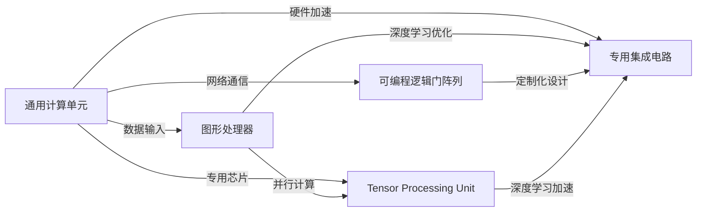

                 

# 第八章：设备加速：CPU、GPU 和更多

> 关键词：设备加速, CPU, GPU, 硬件, 深度学习, 并行计算, 高性能计算, 优化的内存访问, 多核处理, 异步执行, 编程模型, 编译器优化, 动态调度

## 1. 背景介绍

随着深度学习技术的发展，数据中心和云计算服务中处理的深度神经网络越来越复杂，对于计算资源的需求也急剧增加。传统的通用计算硬件（如CPU）在面对深度学习等高并行度和高计算密度的计算任务时显得捉襟见肘。为此，研究人员和工程师们一直在探索更高效、更强大的计算设备，GPU成为了首选。然而，随着硬件和软件架构的不断演进，出现了更多适合于深度学习等计算密集型任务的新型硬件设备，如TPU、FPGA、ASIC等。

### 1.1 问题由来

深度学习模型，尤其是大规模深度学习模型，通常需要大量的计算资源来进行训练和推理。在早期，这一任务只能由高端服务器上的多核CPU完成，但随着模型规模的不断扩大，CPU已经难以满足计算需求，并且其处理速度和能效比也远不及GPU。与此同时，GPU作为图形处理器，由于其在图形渲染和并行计算上的先天优势，被证明是训练深度神经网络的理想选择。GPU的性能超越了CPU，能够提供更高的吞吐量和更低的延迟，但其价格高昂，只能部署在特定的数据中心和云计算服务中。

### 1.2 问题核心关键点

为应对不断增长的计算需求，除了传统的CPU和GPU，研究者和工程师们不断探索新的硬件设备。以下列举了几种主要的加速设备，并探讨了它们在深度学习计算中的应用优势：

- **TPU（Tensor Processing Unit）**：由Google开发，专用于加速深度学习计算。TPU在硬件上进行了特殊设计，优化了矩阵乘法和向量运算等深度学习基本操作，使得深度学习模型的训练速度大幅提升。

- **FPGA（Field Programmable Gate Array）**：是一种可编程逻辑门阵列，可以灵活地重新编程。FPGA对于特定深度学习算法和模型有着高度的定制化能力，能在一定程度上优化性能和降低功耗。

- **ASIC（Application-Specific Integrated Circuit）**：针对特定应用设计的集成电路，具有更高的能效比和更低的延迟。ASIC是专门为深度学习任务设计，具备极高的并行度和可定制性。

这些新型硬件设备的出现，为深度学习的加速提供了更多可能性，但同时也带来了挑战，包括硬件设计、软件开发、性能优化等问题。

## 2. 核心概念与联系

### 2.1 核心概念概述

在探讨加速设备之前，首先需要理解一些核心概念：

- **并行计算（Parallel Computing）**：指将计算任务分解为多个子任务，同时并行执行，以提高计算效率。深度学习模型往往具有高度的并行性质，可以通过并行计算进行加速。

- **并行计算模型（Parallel Computing Model）**：描述并行计算的架构和调度方式。例如，数据并行、任务并行和混合并行等。

- **异步执行（Asynchronous Execution）**：指多个计算任务可以并行执行，且彼此独立，不需要等待彼此完成。这对深度学习训练中的反向传播和优化过程尤为关键。

- **编译器优化（Compiler Optimization）**：编译器在将高级语言代码转换为机器语言时，进行的一系列优化工作，以提高代码的性能和可执行性。

- **动态调度（Dynamic Scheduling）**：指在程序运行时，根据资源可用性和任务优先级，动态调整计算任务的执行顺序。

这些概念共同构成了加速深度学习计算的技术基础。

### 2.2 核心概念原理和架构的 Mermaid 流程图



这个流程图展示了不同硬件设备在深度学习计算中的位置和连接关系。通用CPU是深度学习计算的基础，而GPU、TPU、FPGA和ASIC则提供了更多的加速和优化选择。

## 3. 核心算法原理 & 具体操作步骤

### 3.1 算法原理概述

在深度学习中，计算密集型任务如矩阵乘法、卷积和循环神经网络等，都具有高度的并行性。通过将计算任务分解到多个设备上进行并行执行，可以大幅提升计算效率。以下是几种主要的并行计算模型：

- **数据并行（Data Parallelism）**：将一个大的数据集分成多个子集，每个子集在不同的设备上并行处理，最后将结果合并。这种模型广泛应用于深度学习模型的训练过程。

- **模型并行（Model Parallelism）**：将一个深度学习模型分成多个部分，每个部分在不同的设备上并行处理。这种模型常用于处理超大规模深度学习模型，如BERT等。

- **混合并行（Mixed Parallelism）**：同时使用数据并行和模型并行，通常应用于需要同时处理大量数据和模型参数的任务。

### 3.2 算法步骤详解

深度学习模型的加速通常涉及以下几个关键步骤：

**Step 1: 设备选择**
- 根据任务需求选择最适合的加速设备，如CPU、GPU、TPU等。
- 对于大规模深度学习任务，通常选择GPU或TPU等专用硬件。

**Step 2: 数据分发与聚合**
- 将数据集按照设备的能力进行划分，确保每个设备上的数据规模和计算负载均衡。
- 使用消息传递接口（如MPI）或分布式计算框架（如PyTorch Distributed、TensorFlow Distribute）进行数据分发和聚合。

**Step 3: 模型分割与部署**
- 将深度学习模型按照设备能力和并行计算模型进行分割。
- 将分割后的模型子模块部署到不同的设备上，确保每个设备的负载均衡。

**Step 4: 并行计算与优化**
- 使用并行计算模型（如数据并行、模型并行等）进行并行计算。
- 使用编译器优化和程序优化（如代码重构、向量化、异步执行等）提升并行计算效率。

**Step 5: 性能监控与调优**
- 使用性能监控工具（如NVIDIA Profiler、Google Cloud TPU Profiler）监测计算性能。
- 根据性能数据进行调优，包括调整超参数、优化内存访问模式等。

### 3.3 算法优缺点

并行计算加速深度学习的主要优点包括：

- **计算效率提升**：通过并行计算，深度学习模型的训练和推理速度大大提高。
- **资源利用率优化**：多个设备可以同时工作，提高资源利用率。
- **计算密集型任务优化**：如矩阵乘法、卷积等，可以通过并行计算显著提升效率。

然而，并行计算也存在一些缺点：

- **硬件成本高**：专用硬件（如TPU、ASIC）价格昂贵，增加了计算成本。
- **开发复杂度高**：并行计算的开发和调试复杂度较高，需要额外的编程和调试工作。
- **同步与通信开销**：数据并行和模型并行需要同步和通信，增加了计算时间。

### 3.4 算法应用领域

并行计算加速深度学习技术已经在多个领域得到了广泛应用：

- **深度学习训练**：用于训练大规模深度学习模型，如BERT、GPT等。
- **图像处理**：如图像分类、目标检测等。
- **自然语言处理**：如语言模型训练、机器翻译等。
- **自动驾驶**：如感知和决策系统训练。
- **医疗影像分析**：如医学图像分类、病例分析等。

## 4. 数学模型和公式 & 详细讲解

### 4.1 数学模型构建

在深度学习中，模型的训练和推理过程可以表示为一个损失函数的优化问题。假设模型的参数为 $\theta$，损失函数为 $L(\theta)$，优化目标是最小化损失函数。使用并行计算加速时，可以将训练和推理任务分配到多个设备上，使用 $\parallel$ 表示并行操作，得到如下模型：

$$
L(\theta) = \parallel \bigcup_{i=1}^n L_i(\theta_i)
$$

其中 $n$ 是设备数量，$L_i$ 是在第 $i$ 个设备上计算的损失函数，$\theta_i$ 是第 $i$ 个设备的模型参数。

### 4.2 公式推导过程

为了推导并行计算的数学模型，我们以数据并行为例，假设模型参数 $\theta$ 在 $N$ 个设备上并行训练。每个设备的模型参数更新规则如下：

$$
\theta_i^{t+1} = \theta_i^t - \eta \nabla_{\theta_i} L_i(\theta_i^t)
$$

其中 $\eta$ 是学习率，$\nabla_{\theta_i} L_i(\theta_i^t)$ 是在第 $i$ 个设备上的梯度。通过并行计算，可以将所有设备的梯度求和，得到总的梯度 $\nabla_\theta L$，更新模型参数如下：

$$
\theta^{t+1} = \theta^t - \eta \nabla_\theta L
$$

可以看到，通过并行计算，每个设备的计算负载降低，训练速度加快。

### 4.3 案例分析与讲解

假设我们有一个大规模深度学习模型，使用两个GPU进行并行训练。每个GPU的计算能力不同，需要平衡两个设备的计算负载。可以使用数据并行模型，将数据集 $D$ 平均分配到两个GPU上，每个GPU处理一半的数据，并行更新模型参数。以下是Python代码实现：

```python
import torch
import torch.distributed as dist
from torch.nn.parallel import DistributedDataParallel as DDP

device = torch.device('cuda:0' if torch.cuda.is_available() else 'cpu')

# 定义模型和优化器
model = YourModel()
optimizer = torch.optim.SGD(model.parameters(), lr=0.01)

# 使用数据并行
model = DDP(model)
model.to(device)

# 将数据集分配到两个GPU
train_loader = torch.utils.data.DataLoader(train_dataset, batch_size=32, shuffle=True, num_workers=2)
train_loader = torch.nn.parallel.DistributedSampler(train_loader, num_replicas=2, rank=0, shuffle=True, drop_last=True)

# 训练循环
for epoch in range(10):
    for batch in train_loader:
        input, target = batch
        input, target = input.to(device), target.to(device)
        output = model(input)
        loss = F.cross_entropy(output, target)
        optimizer.zero_grad()
        loss.backward()
        optimizer.step()
```

在这个例子中，我们使用PyTorch的`DistributedDataParallel`模块实现数据并行，将模型和优化器包装起来，并在两个GPU上并行训练。

## 5. 项目实践：代码实例和详细解释说明

### 5.1 开发环境搭建

为了使用并行计算加速深度学习，我们需要以下开发环境：

- **Python**：使用3.7及以上版本。
- **PyTorch**：安装最新版本，支持数据并行和模型并行。
- **NVIDIA CUDA**：如果使用了GPU进行并行计算，需要安装相应的CUDA版本。
- **NVIDIA cuDNN**：与CUDA配合使用，优化GPU上的深度学习计算。
- **NVIDIA NCCL**：用于GPU之间的通信和同步，优化并行计算效率。

以下是Python和PyTorch的安装和配置步骤：

```bash
pip install torch torchvision torchaudio
pip install torch==1.8.0+cu101 torchvision==0.9.0+cu101 torchaudio==0.8.0+cu101
```

### 5.2 源代码详细实现

下面以使用PyTorch进行数据并行训练为例，给出代码实现：

```python
import torch
import torch.distributed as dist
from torch.nn.parallel import DistributedDataParallel as DDP
from torch.utils.data import DataLoader
import torch.multiprocessing as mp

# 初始化分布式环境
dist.init_process_group(backend='nccl', init_method='env://')

# 定义模型和优化器
model = YourModel().to(torch.device('cuda' if torch.cuda.is_available() else 'cpu'))
optimizer = torch.optim.SGD(model.parameters(), lr=0.01)

# 定义数据集和数据加载器
train_dataset = ...
train_loader = DataLoader(train_dataset, batch_size=32, shuffle=True, num_workers=2)

# 定义主进程函数
def train(rank, world_size, data_loader):
    model = DDP(model)
    model.to(rank)
    
    for epoch in range(10):
        for batch in data_loader:
            input, target = batch
            input, target = input.to(rank), target.to(rank)
            optimizer.zero_grad()
            output = model(input)
            loss = F.cross_entropy(output, target)
            loss.backward()
            optimizer.step()

if __name__ == '__main__':
    world_size = 2
    mp.spawn(train, args=(world_size,), nprocs=world_size)
```

### 5.3 代码解读与分析

这个代码示例展示了如何使用数据并行加速深度学习模型的训练。具体步骤如下：

- **初始化分布式环境**：使用`dist.init_process_group`初始化分布式环境，设置通信方式为NCCL，初始化方法为`env://`，表示通过环境变量进行通信。
- **定义模型和优化器**：定义深度学习模型和优化器，并使用`DDP`模块进行数据并行封装。
- **定义数据集和数据加载器**：定义数据集和数据加载器，使用`DataLoader`进行数据划分和分批次加载。
- **定义主进程函数**：定义一个主进程函数，用于在多个进程中并行训练模型。
- **启动并行训练**：使用`mp.spawn`启动并行训练，在多个进程中并行执行`train`函数。

## 6. 实际应用场景

### 6.1 图像处理

图像处理任务如图像分类、目标检测等，通常需要大量的计算资源。使用并行计算设备，如GPU、TPU等，可以显著提升图像处理的效率。

- **图像分类**：如使用ResNet、VGG等模型对图像进行分类，可以使用数据并行模型进行并行训练和推理。
- **目标检测**：如使用Faster R-CNN、YOLO等模型进行目标检测，可以使用模型并行模型进行并行训练和推理。

### 6.2 自然语言处理

自然语言处理任务如语言模型训练、机器翻译等，同样可以利用并行计算设备进行加速。

- **语言模型训练**：如使用GPT、BERT等模型进行语言模型训练，可以使用数据并行模型进行并行训练和推理。
- **机器翻译**：如使用Seq2Seq模型进行机器翻译，可以使用模型并行模型进行并行训练和推理。

### 6.3 自动驾驶

自动驾驶中的感知和决策系统需要实时处理大量传感器数据，深度学习模型是其中的关键部分。使用并行计算设备，可以提升感知和决策系统的计算效率和实时性。

- **感知系统**：如使用卷积神经网络进行图像处理和特征提取，可以使用数据并行模型进行并行训练和推理。
- **决策系统**：如使用深度强化学习进行路径规划和决策，可以使用模型并行模型进行并行训练和推理。

### 6.4 医疗影像分析

医疗影像分析任务如医学图像分类、病例分析等，通常需要处理大量医疗影像数据。使用并行计算设备，可以提升医疗影像分析的计算效率和准确性。

- **医学图像分类**：如使用卷积神经网络进行医学图像分类，可以使用数据并行模型进行并行训练和推理。
- **病例分析**：如使用深度学习模型进行病例分析，可以使用模型并行模型进行并行训练和推理。

## 7. 工具和资源推荐

### 7.1 学习资源推荐

为了帮助开发者掌握并行计算加速深度学习的方法，以下是一些优秀的学习资源：

- **《Deep Learning Specialization》**：由Andrew Ng等讲授的深度学习系列课程，涵盖了深度学习基础、计算架构和优化等内容。
- **《Programming Massive Parallelism》**：由GPU和并行计算专家讲授的编程课程，深入讲解了GPU编程和并行计算的技术细节。
- **《GPU Programming and Design》**：由NVIDIA官方出版的技术手册，详细介绍了CUDA编程和GPU加速的方法。

### 7.2 开发工具推荐

以下是几款用于并行计算加速深度学习的常用工具：

- **NVIDIA CUDA**：NVIDIA开发的并行计算框架，支持GPU编程和加速。
- **NVIDIA cuDNN**：NVIDIA优化的深度学习库，加速GPU上的深度学习计算。
- **NVIDIA NCCL**：NVIDIA优化的通信和同步库，加速GPU之间的数据传输和同步。
- **PyTorch Distributed**：PyTorch提供的分布式计算框架，支持数据并行和模型并行。
- **TensorFlow Distribute**：TensorFlow提供的分布式计算框架，支持数据并行和模型并行。

### 7.3 相关论文推荐

以下是几篇关于并行计算加速深度学习的经典论文，推荐阅读：

- **Deep Learning in Graphical Hardware**：NVIDIA的研究论文，详细介绍了GPU加速深度学习的方法和性能优化技巧。
- **Parallelizing Deep Neural Networks with GPUs and TPUs**：Google的研究论文，讨论了GPU和TPU等加速设备在深度学习中的应用。
- **Optimizing Deep Learning with ASICs**：IBM的研究论文，探讨了ASIC等专用硬件在深度学习中的应用。

## 8. 总结：未来发展趋势与挑战

### 8.1 总结

本章对并行计算加速深度学习进行了全面系统的介绍。首先，介绍了并行计算在深度学习中的重要性，以及并行计算的基本原理和模型。其次，详细讲解了并行计算设备（如GPU、TPU、FPGA、ASIC等）的加速方法，包括数据并行、模型并行、混合并行等。最后，分析了并行计算在深度学习中的应用场景和未来趋势，探讨了并行计算面临的挑战。

通过本章的学习，读者可以全面理解并行计算在深度学习中的应用，掌握并行计算设备的使用方法，为深度学习模型的高效训练和推理打下坚实基础。

### 8.2 未来发展趋势

展望未来，并行计算加速深度学习技术将呈现以下几个发展趋势：

1. **硬件设备多样性**：未来的并行计算设备将更加多样化，包括新型ASIC、FPGA、神经形态芯片等，提供更丰富的选择。
2. **软件工具优化**：随着并行计算设备的普及，更多的软件工具将被开发出来，以简化并行计算的开发和优化。
3. **算力与性能的平衡**：未来的并行计算设备将更加注重算力和性能的平衡，以适应各种应用场景。
4. **异构计算**：结合CPU、GPU、FPGA等不同类型的硬件设备，进行异构并行计算，提高计算效率。
5. **软件定义硬件**：通过软件定义硬件（如GPU指令集），提高并行计算设备的灵活性和可编程性。

### 8.3 面临的挑战

尽管并行计算加速深度学习技术已经取得了巨大成功，但在发展过程中仍面临一些挑战：

1. **硬件成本高**：专用的并行计算设备（如TPU、ASIC）价格昂贵，增加了计算成本。
2. **开发复杂度高**：并行计算的开发和调试复杂度较高，需要额外的编程和调试工作。
3. **同步与通信开销**：数据并行和模型并行需要同步和通信，增加了计算时间。
4. **资源管理难度大**：多个设备之间的资源管理和调度需要更多的计算资源和算法支持。
5. **软件生态不成熟**：并行计算设备的生态系统尚不成熟，缺乏足够的工具和支持。

### 8.4 研究展望

未来，并行计算加速深度学习技术需要在以下几个方面进行深入研究：

1. **硬件优化**：研究和开发更高效的硬件加速设备，提升并行计算的效率和性能。
2. **软件优化**：研究和开发更高效的软件工具，降低并行计算的开发和调试难度。
3. **跨平台优化**：研究和开发跨平台并行计算框架，提高并行计算的灵活性和可移植性。
4. **异构计算**：研究和开发异构并行计算框架，提升并行计算的性能和效率。
5. **软件定义硬件**：研究和开发软件定义硬件技术，提高并行计算设备的灵活性和可编程性。

总之，并行计算加速深度学习技术需要硬件和软件两方面的协同创新，才能实现更高效的计算和更广泛的应用。

## 9. 附录：常见问题与解答

**Q1：并行计算的效率提升是如何实现的？**

A: 并行计算通过将计算任务分解到多个设备上进行并行执行，可以显著提升计算效率。例如，在使用数据并行模型时，每个设备处理一个子集的数据，同时并行更新模型参数，从而提高了整体计算速度。

**Q2：如何选择合适的并行计算设备？**

A: 选择合适的并行计算设备需要考虑任务的计算需求和硬件成本。对于深度学习任务，通常选择GPU或TPU等专用硬件，而对于嵌入式系统等资源受限的应用，可以选择FPGA或ASIC等低成本硬件。

**Q3：并行计算的同步与通信开销是如何处理的？**

A: 同步与通信开销可以通过异步执行和通信优化技术进行降低。例如，使用异步编程模型（如AsyncGPUAxes）和通信优化库（如nccl）可以减少同步和通信开销。

**Q4：并行计算设备的资源管理有哪些方法？**

A: 并行计算设备的资源管理可以使用分布式系统管理工具（如Kubernetes）、资源调度算法（如max-min公平调度算法）和资源监控工具（如NVIDIA Profiler）等方法。

**Q5：并行计算对深度学习模型的影响有哪些？**

A: 并行计算可以显著提升深度学习模型的训练和推理速度，但同时也需要更多的计算资源和算法支持。此外，并行计算的开发和调试复杂度较高，需要额外的编程和调试工作。

