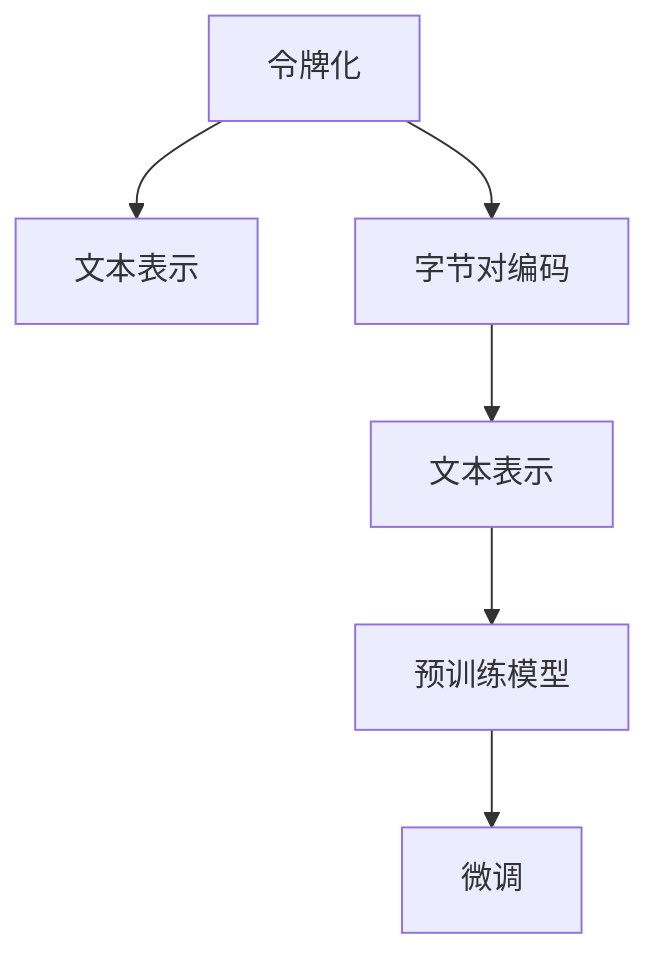

                 

# 第六章：令牌化和字节对编码

## 1. 背景介绍

在自然语言处理（NLP）中，将文本转换为数字形式是处理文本的第一步。这一过程涉及到令牌化和字节对编码两种方法。令牌化（Tokenization）是指将文本分割成单词或短语，而字节对编码（Byte Pair Encoding，BPE）是一种用于处理多语言文本的编码方法，它通过将单词分割成字节对来减少分词的复杂性。这两种方法在自然语言处理中都有着重要的应用。

### 1.1 问题由来
在处理文本数据时，计算机需要将其转换为数字形式，以便于模型进行训练和预测。传统的处理方法包括将单词转换为数字编码（如使用单词ID）或将文本转换为向量（如使用词嵌入）。然而，这些方法在处理多语言文本时面临诸多挑战，尤其是在处理不同语言的混合文本时。为了解决这些问题，出现了令牌化和字节对编码两种方法。

### 1.2 问题核心关键点
令牌化和字节对编码方法的核心关键点在于如何有效地将文本转换为数字形式，以便于模型处理。这两种方法通过将文本分割成更小的单元，即单词或字节对，降低了处理复杂性，使得模型能够更好地处理多语言文本。

## 2. 核心概念与联系

### 2.1 核心概念概述

为更好地理解令牌化和字节对编码方法，本节将介绍几个密切相关的核心概念：

- 令牌化(Tokenization)：将文本分割成单词或短语的过程。令牌化是自然语言处理中的基本预处理步骤，有助于模型理解文本的语义信息。

- 字节对编码(Byte Pair Encoding，BPE)：一种用于处理多语言文本的编码方法，通过将单词分割成字节对来减少分词的复杂性，同时避免语言特定的分词问题。

- 文本表示(Text Representation)：将文本转换为数字形式的过程。常用的文本表示方法包括单词ID、词嵌入（Word Embedding）、字符嵌入（Character Embedding）等。

- 预训练模型(Pre-trained Model)：如BERT、GPT等大型预训练语言模型，通过在大规模无标签文本上预训练，学习到了丰富的语言知识和语义信息。

- 微调(Fine-Tuning)：指在预训练模型的基础上，使用下游任务的少量标注数据，通过有监督学习优化模型在该任务上的性能。

这些核心概念之间的逻辑关系可以通过以下Mermaid流程图来展示：



这个流程图展示了令牌化和字节对编码在文本表示中的作用，以及它们与预训练模型和微调的关系。

## 3. 核心算法原理 & 具体操作步骤

### 3.1 算法原理概述

令牌化和字节对编码方法通过将文本转换为数字形式，使得模型能够更好地处理文本数据。它们的原理分别是基于规则的分割和基于统计的编码。

- 令牌化：基于规则的分割，将文本分割成单词或短语，通常是基于空格、标点符号、空格等规则进行分割。

- 字节对编码：基于统计的编码，将单词分割成字节对，通过训练一个大型的编码表，使得单词能够被编码成字节对的序列。

### 3.2 算法步骤详解

#### 3.2.1 令牌化步骤

1. **分词规则设定**：设定分词规则，通常包括空格、标点符号、空格等。

2. **文本分割**：根据设定的分词规则，将文本分割成单词或短语。

3. **去除停用词**：去除常见的停用词，如“的”、“是”、“在”等。

4. **拼接单词**：将分割后的单词拼接成完整的句子。

#### 3.2.2 字节对编码步骤

1. **创建编码表**：构建一个大型的编码表，包含所有的单词和对应的字节对序列。

2. **训练编码表**：通过训练编码表，使得单词能够被编码成字节对的序列。

3. **编码文本**：根据编码表，将文本编码成字节对的序列。

4. **解码文本**：将编码后的字节对序列解码回单词序列。

### 3.3 算法优缺点

#### 3.3.1 令牌化

- 优点：简单高效，处理速度快。

- 缺点：分词结果可能不准确，不同语言有不同的分词规则，处理多语言文本时复杂度较高。

#### 3.3.2 字节对编码

- 优点：解决了多语言文本处理中的分词问题，能够处理不同语言的混合文本。

- 缺点：编码表较大，训练复杂，处理速度较慢。

### 3.4 算法应用领域

令牌化和字节对编码方法广泛应用于NLP领域，包括：

- 文本分类：如情感分析、主题分类等。

- 命名实体识别：如人名、地名、机构名等。

- 机器翻译：将源语言文本翻译成目标语言。

- 信息检索：文本相似度计算，信息检索。

- 问答系统：根据用户问题，自动给出答案。

## 4. 数学模型和公式 & 详细讲解 & 举例说明

### 4.1 数学模型构建

令牌化和字节对编码的数学模型主要基于统计语言模型和深度学习模型。

#### 4.1.1 统计语言模型

统计语言模型是一种基于概率的语言模型，通过统计文本中各个单词出现的频率，计算文本的概率。

令牌化的数学模型可以通过构建一个N-gram模型来表示，其中N表示分词的顺序，通常为2-gram或3-gram。

$$ P(w_i | w_{i-1}) = \frac{count(w_i, w_{i-1})}{count(w_{i-1})} $$

其中，$w_i$表示单词序列，$w_{i-1}$表示其前一个单词，$count$表示单词序列在文本中出现的次数。

#### 4.1.2 深度学习模型

深度学习模型通过神经网络来学习文本的表示，通常使用词嵌入或字符嵌入作为文本的表示。

令牌化的数学模型可以通过神经网络来学习，使用卷积神经网络（CNN）或递归神经网络（RNN）来学习文本的表示。

$$ P(w_i | w_{i-1}) = \text{softmax}([w_i; w_{i-1}; w_{i-2}; \ldots; w_1] W) $$

其中，$W$表示神经网络的参数，$softmax$表示softmax函数，用于计算概率分布。

### 4.2 公式推导过程

#### 4.2.1 统计语言模型推导

令牌化的推导过程可以通过计算每个单词的出现概率来计算文本的概率。

$$ P(\text{text}) = \prod_{i=1}^{n} P(w_i | w_{i-1}) $$

其中，$n$表示文本中的单词数。

#### 4.2.2 深度学习模型推导

深度学习模型的推导过程可以通过计算文本的向量表示来计算文本的概率。

令牌化的推导过程可以通过计算文本中每个单词的向量表示来计算文本的向量表示。

$$ \text{vec}(\text{text}) = [w_1; w_2; \ldots; w_n] W $$

其中，$w_i$表示单词$i$的向量表示，$W$表示神经网络的参数。

### 4.3 案例分析与讲解

#### 4.3.1 句子分词

假设有一个句子“This is a sentence”，我们可以使用分词规则将句子分割成单词：

- 令牌化：$[\text{This}, \text{is}, \text{a}, \text{sentence}]$

- 字节对编码：$[\text{This}, \text{is}, \text{a}, \text{sentence}] \rightarrow [\text{Thisi}, \text{isis}, \text{as}, \text{sentence}$]，其中$i$表示单词的ID。

#### 4.3.2 单词编码

假设有一个单词“apple”，我们可以使用编码表将其编码为字节对序列：

- 编码表：
  ```
  apple -> [a p p l e]
  is -> [i s]
  ```

- 编码结果：$\text{vec}(\text{apple}) = [a; p; p; l; e] W$

## 5. 项目实践：代码实例和详细解释说明

### 5.1 开发环境搭建

在进行令牌化和字节对编码的实践前，我们需要准备好开发环境。以下是使用Python进行PyTorch开发的环境配置流程：

1. 安装Anaconda：从官网下载并安装Anaconda，用于创建独立的Python环境。

2. 创建并激活虚拟环境：
```bash
conda create -n pytorch-env python=3.8 
conda activate pytorch-env
```

3. 安装PyTorch：根据CUDA版本，从官网获取对应的安装命令。例如：
```bash
conda install pytorch torchvision torchaudio cudatoolkit=11.1 -c pytorch -c conda-forge
```

4. 安装Python文本处理库：
```bash
pip install NLTK
pip install spacy
```

完成上述步骤后，即可在`pytorch-env`环境中开始实践。

### 5.2 源代码详细实现

下面以Python的spaCy库为例，实现基于字节对编码的文本处理。

```python
import spacy

# 加载预训练的spaCy模型
nlp = spacy.load('en_core_web_sm')

# 创建编码表
bpes = BytePairEncoder()
bpes.fit(list(nlp.vocab.keys()))

# 将单词编码为字节对序列
word = "apple"
text = bpes.encode(word)

# 将字节对序列解码回单词
decoded_word = bpes.decode(text)
```

### 5.3 代码解读与分析

让我们再详细解读一下关键代码的实现细节：

- `spacy.load`：加载预训练的spaCy模型，用于分词和编码。

- `BytePairEncoder`：spaCy库中的字节对编码类，用于将单词编码为字节对序列。

- `fit`方法：训练编码表，使得单词能够被编码成字节对的序列。

- `encode`方法：将单词编码为字节对序列。

- `decode`方法：将字节对序列解码回单词。

- 在实际应用中，spaCy库能够很好地处理英文文本，但也需要根据不同的语言和应用场景进行适当的调整。

## 6. 实际应用场景

### 6.1 机器翻译

令牌化和字节对编码在机器翻译中有着重要的应用。机器翻译需要将源语言文本转换为目标语言文本，而令牌化和字节对编码可以将文本转换为数字形式，使得模型能够更好地处理文本数据。

在实践中，可以通过将源语言和目标语言文本转换为单词序列，然后进行机器翻译模型的训练和推理。通过微调，可以提高翻译模型的性能。

### 6.2 文本分类

在文本分类任务中，需要将文本转换为数字形式，以便于模型进行分类。令牌化和字节对编码可以将文本分割成单词或字节对，降低处理的复杂性。

在实践中，可以使用分词规则将文本分割成单词，然后使用编码表将单词转换为数字形式，最后使用分类模型对文本进行分类。

### 6.3 信息检索

在信息检索任务中，需要计算文本的相似度，以便于检索相关文本。令牌化和字节对编码可以将文本转换为数字形式，使得计算文本相似度更加方便。

在实践中，可以使用分词规则将文本分割成单词或字节对，然后使用编码表将单词转换为数字形式，最后使用相似度计算模型计算文本之间的相似度。

### 6.4 未来应用展望

随着令牌化和字节对编码技术的发展，其在NLP领域的应用将越来越广泛。未来，我们可以预见到以下趋势：

- 更多的多语言支持：随着令牌化和字节对编码技术的不断发展，更多的语言将被支持，使得NLP技术更加普及。

- 更高效的编码方式：未来的编码方式将更加高效，能够处理更大规模的文本数据。

- 更准确的编码表：未来的编码表将更加准确，能够更精确地表示单词的语义信息。

- 更智能的自动编码：未来的编码方式将更加智能，能够自动学习编码规则。

## 7. 工具和资源推荐

### 7.1 学习资源推荐

为了帮助开发者系统掌握令牌化和字节对编码的理论基础和实践技巧，这里推荐一些优质的学习资源：

1. 《自然语言处理综论》：涵盖NLP基础概念、分词、编码等核心内容。

2. 《Python文本处理与自然语言处理》：详细讲解Python中的文本处理和自然语言处理技术。

3. 《Deep Learning for NLP》：讲解深度学习在NLP中的应用，包括令牌化和字节对编码等。

4. 《spaCy文档》：spaCy库的官方文档，提供了丰富的代码示例和使用方法。

5. 《Byte Pair Encoding in Machine Translation》：介绍字节对编码在机器翻译中的应用。

通过对这些资源的学习实践，相信你一定能够快速掌握令牌化和字节对编码的精髓，并用于解决实际的NLP问题。

### 7.2 开发工具推荐

高效的开发离不开优秀的工具支持。以下是几款用于令牌化和字节对编码开发的常用工具：

1. spaCy：Python中的自然语言处理库，支持分词、编码、实体识别等。

2. NLTK：Python中的自然语言处理库，支持文本处理、分词、编码等。

3. Byte Pair Encoder：用于训练字节对编码表的Python库。

4. Transformers库：HuggingFace开发的NLP工具库，集成了众多预训练语言模型和编码表。

5. Weights & Biases：模型训练的实验跟踪工具，可以记录和可视化模型训练过程中的各项指标，方便对比和调优。

6. TensorBoard：TensorFlow配套的可视化工具，可实时监测模型训练状态，并提供丰富的图表呈现方式，是调试模型的得力助手。

合理利用这些工具，可以显著提升令牌化和字节对编码任务的开发效率，加快创新迭代的步伐。

### 7.3 相关论文推荐

令牌化和字节对编码技术的发展源于学界的持续研究。以下是几篇奠基性的相关论文，推荐阅读：

1. Byte Pair Encoding: A Simple and Low-Resource Approach to Neural Machine Translation：介绍字节对编码在机器翻译中的应用。

2. Byte Pair Encoding for Machine Translation：提出一种基于字节对编码的机器翻译方法。

3. Byte Pair Encoding with Unigrams for Neural Machine Translation：提出一种结合字节对编码和Unigram的机器翻译方法。

4. Continuous Byte Pair Encoding：提出一种连续字节对编码方法，用于处理多语言文本。

5. Byte Pair Encoding as a Neural Machine Translation Model with Character-Level Training：提出一种基于字节对编码的字符级训练的神经机器翻译模型。

这些论文代表了大语言模型微调技术的发展脉络。通过学习这些前沿成果，可以帮助研究者把握学科前进方向，激发更多的创新灵感。

## 8. 总结：未来发展趋势与挑战

### 8.1 总结

本文对令牌化和字节对编码方法进行了全面系统的介绍。首先阐述了令牌化和字节对编码方法的研究背景和意义，明确了其在大语言模型微调中的重要应用。其次，从原理到实践，详细讲解了令牌化和字节对编码的数学原理和关键步骤，给出了实践任务开发的完整代码实例。同时，本文还广泛探讨了令牌化和字节对编码方法在机器翻译、文本分类、信息检索等多个领域的应用前景，展示了其在NLP技术中的强大潜力。最后，本文精选了令牌化和字节对编码技术的各类学习资源，力求为读者提供全方位的技术指引。

通过本文的系统梳理，可以看到，令牌化和字节对编码方法在NLP领域有着广泛的应用，在处理多语言文本时尤为有效。这些技术的不断发展，必将进一步提升NLP系统的性能和应用范围，为人类认知智能的进化带来深远影响。

### 8.2 未来发展趋势

展望未来，令牌化和字节对编码技术将呈现以下几个发展趋势：

1. 更高的编码效率：未来的编码方式将更加高效，能够处理更大规模的文本数据。

2. 更精确的编码表：未来的编码表将更加准确，能够更精确地表示单词的语义信息。

3. 更智能的自动编码：未来的编码方式将更加智能，能够自动学习编码规则。

4. 更多语言支持：未来的编码方式将支持更多的语言，使得NLP技术更加普及。

5. 更广泛的用途：未来的编码方式将广泛应用于NLP领域，推动NLP技术的发展。

以上趋势凸显了令牌化和字节对编码技术的广阔前景。这些方向的探索发展，必将进一步提升NLP系统的性能和应用范围，为人类认知智能的进化带来深远影响。

### 8.3 面临的挑战

尽管令牌化和字节对编码技术已经取得了一定的成就，但在迈向更加智能化、普适化应用的过程中，它仍面临诸多挑战：

1. 分词准确性问题：分词的准确性对文本处理的效果有很大影响，特别是在处理多语言文本时，分词的准确性会直接影响后续处理的效果。

2. 编码表大小问题：编码表的大小直接决定了编码的复杂度，过大的编码表会增加编码的复杂度，同时也会增加编码的计算量。

3. 编码效率问题：编码的效率对处理大规模文本数据有很大影响，编码效率的提升可以显著提高处理速度。

4. 多语言支持问题：不同的语言有不同的分词规则和编码方式，如何在多语言中统一分词和编码，是一个亟待解决的问题。

5. 编码表的训练问题：编码表的训练需要大量的文本数据，训练的复杂度和效率是一个需要解决的问题。

正视令牌化和字节对编码面临的这些挑战，积极应对并寻求突破，将让这些技术更加成熟和稳定，推动NLP技术的进一步发展。

### 8.4 研究展望

面对令牌化和字节对编码所面临的种种挑战，未来的研究需要在以下几个方面寻求新的突破：

1. 探索更高效的编码方式：开发更加高效的编码方式，在保证编码准确性的同时，提高编码效率。

2. 研究更精确的编码表：研究更加精确的编码表，使得单词能够更准确地表示其语义信息。

3. 引入更多先验知识：将符号化的先验知识，如知识图谱、逻辑规则等，与神经网络模型进行巧妙融合，引导编码过程学习更准确、合理的单词表示。

4. 结合因果分析和博弈论工具：将因果分析方法引入编码过程，识别出单词表示的关键特征，增强编码过程的因果性和逻辑性。

5. 纳入伦理道德约束：在编码目标中引入伦理导向的评估指标，过滤和惩罚有偏见、有害的编码结果，确保编码结果符合人类价值观和伦理道德。

这些研究方向的探索，必将引领令牌化和字节对编码技术迈向更高的台阶，为构建安全、可靠、可解释、可控的智能系统铺平道路。面向未来，令牌化和字节对编码技术还需要与其他人工智能技术进行更深入的融合，如知识表示、因果推理、强化学习等，多路径协同发力，共同推动自然语言理解和智能交互系统的进步。只有勇于创新、敢于突破，才能不断拓展语言模型的边界，让智能技术更好地造福人类社会。

## 9. 附录：常见问题与解答

**Q1：什么是令牌化和字节对编码？**

A: 令牌化是指将文本分割成单词或短语的过程，通常基于空格、标点符号等规则进行分割。而字节对编码是一种用于处理多语言文本的编码方法，通过将单词分割成字节对来减少分词的复杂性。

**Q2：令牌化和字节对编码的优缺点是什么？**

A: 令牌化的优点是简单高效，处理速度快。缺点是分词结果可能不准确，不同语言有不同的分词规则，处理多语言文本时复杂度较高。而字节对编码的优点是解决了多语言文本处理中的分词问题，能够处理不同语言的混合文本。缺点是编码表较大，训练复杂，处理速度较慢。

**Q3：如何在实际应用中使用令牌化和字节对编码？**

A: 在实际应用中，可以使用分词规则将文本分割成单词或短语，然后使用编码表将单词编码为字节对序列。最后使用编码后的序列进行机器翻译、文本分类、信息检索等NLP任务。

**Q4：令牌化和字节对编码的未来发展趋势是什么？**

A: 未来的发展趋势包括更高的编码效率、更精确的编码表、更智能的自动编码、更多语言支持和更广泛的用途。这些趋势将进一步提升NLP系统的性能和应用范围。

**Q5：令牌化和字节对编码面临的主要挑战是什么？**

A: 主要挑战包括分词准确性问题、编码表大小问题、编码效率问题、多语言支持问题和编码表的训练问题。

通过对这些问题的深入研究，我们相信令牌化和字节对编码技术将不断进步，更好地服务于NLP领域的发展。

---

作者：禅与计算机程序设计艺术 / Zen and the Art of Computer Programming

