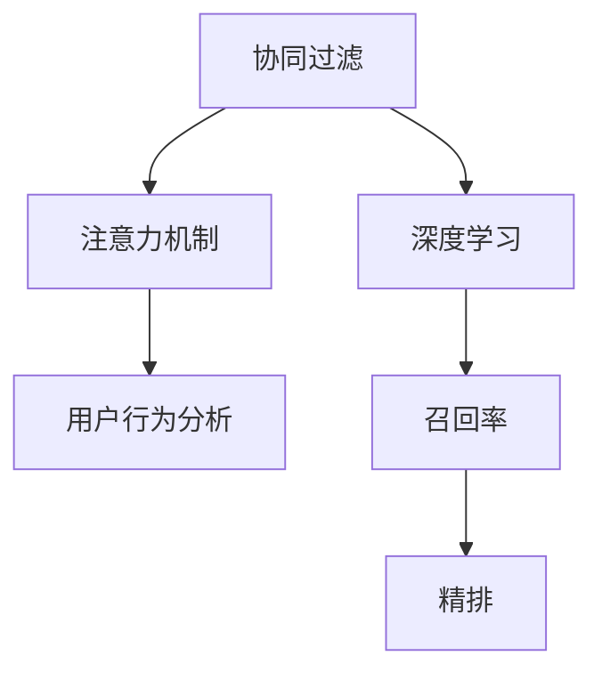

                 

# 算法推荐与注意力分配的关系

> 关键词：推荐系统,注意力机制,协同过滤,深度学习,用户行为分析,召回率,精排

## 1. 背景介绍

推荐系统（Recommender Systems）作为互联网应用中不可或缺的一部分，旨在为用户提供个性化的物品推荐，极大提升用户体验。推荐系统的核心问题在于如何从海量数据中挖掘用户和物品之间的隐式关系，并结合用户行为和物品属性，生成高相关的推荐结果。其基本流程包括数据收集、数据预处理、特征提取、模型训练和推荐展示五个环节。

在推荐系统的发展过程中，算法和模型构建的复杂度不断提升。如今，推荐系统早已从基于内容的协同过滤(Collaborative Filtering, CF)，发展到深度学习和模型融合，并逐渐引入了注意力机制(Attention Mechanism)，赋予模型更强大的特征提取和交互建模能力。基于注意力机制的推荐系统，即被称为注意力驱动推荐系统（Attention-based Recommender Systems）。

本文将围绕注意力机制，从理论基础、关键技术、应用场景、优缺点以及未来发展方向等方面，探讨其与推荐系统间的紧密联系，为推荐系统领域的研究者提供深刻的见解和借鉴。

## 2. 核心概念与联系

### 2.1 核心概念概述

在推荐系统中，注意力机制是一种有效提升模型交互能力和特征提取能力的技术。注意力模型通过学习输入数据中不同部分的相关性权重，对数据进行有选择地关注和加权，以更好地适应推荐任务的需求。

为更好地理解注意力机制与推荐系统间的联系，本节将介绍几个相关核心概念：

1. **协同过滤(CF)**：协同过滤是一种经典的推荐算法，基于用户和物品的相似性进行推荐。它包括基于用户的CF和基于物品的CF。在基于用户的CF中，根据相似用户的偏好，向用户推荐物品；而在基于物品的CF中，根据物品之间的相似性，推荐给用户。

2. **深度学习**：深度学习模型采用多层神经网络结构，能够自动学习输入数据的特征表示，极大提升了推荐系统的性能。

3. **注意力机制**：注意力机制是一种在神经网络中用于模拟人类注意力的技术。通过学习输入数据中不同部分的相关性权重，对数据进行有选择地关注和加权，以提升模型的交互能力和特征提取能力。

4. **用户行为分析**：通过对用户的历史行为数据进行分析，提取用户兴趣和偏好，生成个性化的推荐结果。

5. **召回率和精排**：召回率指推荐结果中相关物品的比例，精排则是指在召回的基础上，对推荐结果进行排序，以获得更高质量的相关物品推荐。

这些概念间的关系可以通过以下Mermaid流程图来展示：



该流程图展示了几大推荐系统关键概念间的逻辑关系：

1. 协同过滤是推荐系统的基础。
2. 深度学习通过多层次网络结构提升推荐性能。
3. 注意力机制赋予模型更强的交互能力和特征提取能力。
4. 用户行为分析用于提取用户兴趣和偏好。
5. 召回率和精排用于生成高质量推荐结果。

这些核心概念共同构成了推荐系统的工作原理和优化方向。通过理解这些概念，我们可以更好地把握推荐系统的设计思路和优化策略。

## 3. 核心算法原理 & 具体操作步骤

### 3.1 算法原理概述

基于注意力机制的推荐系统（Attention-based Recommender Systems），核心在于通过注意力模型对用户-物品交互数据进行加权，构建用户和物品的特征表示，从而生成个性化推荐结果。

形式化地，设推荐系统中用户和物品的特征表示分别为 $x_u$ 和 $x_i$，用户与物品间的交互数据表示为 $x_{u,i}$。则注意力机制下的推荐模型可以表示为：

$$
y_{u,i} = \text{Attention}(x_u, x_i, x_{u,i})
$$

其中，$\text{Attention}$ 函数用于计算用户 $u$ 和物品 $i$ 之间的注意力权重，$y_{u,i}$ 表示用户 $u$ 对物品 $i$ 的推荐结果。

注意力模型通过学习输入数据中不同部分的相关性权重，对数据进行有选择地关注和加权。具体实现中，模型通常使用注意力网络(Attention Network)，结合不同的注意力机制，如多头注意力(Multi-Head Attention)、自注意力(Self-Attention)等，生成更加精确的特征表示。

### 3.2 算法步骤详解

基于注意力机制的推荐系统通常包含以下关键步骤：

**Step 1: 数据收集与预处理**

1. 收集用户行为数据和物品属性数据，例如用户的浏览、点击、评分记录，物品的标题、描述、属性等。

2. 对数据进行清洗、去重和归一化，保证数据质量。

3. 进行特征提取，将用户和物品的原始数据转化为模型能够处理的数值型或向量型特征。

**Step 2: 构建注意力网络**

1. 设计注意力网络的结构，包括输入层、注意力层、输出层等。输入层通常包含用户和物品的特征表示。

2. 确定注意力机制的类型，如多头注意力、自注意力等。多头注意力通过多个注意力头的并行计算，更好地捕捉数据的多样性和复杂性。

3. 训练注意力网络，通过梯度下降等优化算法学习各注意力权重，以最大化推荐效果。

**Step 3: 用户行为分析**

1. 对用户的历史行为数据进行分析，提取用户兴趣和偏好，如用户常点击、浏览、评价的物品类别和属性。

2. 结合物品属性和用户行为特征，生成用户对物品的隐式兴趣表示。

**Step 4: 生成推荐结果**

1. 对用户和物品的特征表示进行注意力加权，生成物品的加权表示。

2. 对加权后的物品表示进行排序，生成个性化推荐列表。

3. 根据召回率和精排策略，调整推荐结果，优化用户体验。

### 3.3 算法优缺点

基于注意力机制的推荐系统具有以下优点：

1. 提升特征表示能力。通过注意力机制，模型能够对用户和物品交互数据进行加权，生成更加精确的特征表示。

2. 增强交互能力。注意力机制赋予模型更强的交互能力，能够捕捉数据中的多层次相关性，提高推荐效果。

3. 灵活性高。注意力模型可以灵活引入多种注意力机制，提升模型对不同场景的适应能力。

4. 减少数据偏差。注意力机制通过学习权重，能够降低数据中的偏差，提升推荐公平性。

同时，该算法也存在一定的局限性：

1. 计算复杂度高。注意力机制的计算复杂度较高，特别是在大规模数据集上，模型训练和推理时间较长。

2. 参数量大。注意力机制通常需要较多的参数进行模型训练，增加了模型的复杂度。

3. 数据敏感性高。注意力机制对数据的噪声和缺失较为敏感，需要高质量的数据进行模型训练。

4. 对数据结构依赖强。不同的注意力机制对数据结构要求不同，如多头注意力需要用户和物品的特征表示。

尽管存在这些局限性，但基于注意力机制的推荐系统仍是推荐系统领域的重要研究方向。未来相关研究将致力于提高模型计算效率和参数利用效率，增强对不同数据结构的适应能力，进一步提升推荐效果。

### 3.4 算法应用领域

基于注意力机制的推荐系统在多个领域得到了广泛应用，涵盖了从电商、社交网络到在线视频、音乐平台等多种场景：

1. **电商推荐**：通过分析用户的历史购买记录和浏览行为，生成个性化商品推荐。

2. **社交网络**：结合用户和内容的相关性，生成个性化动态内容推荐。

3. **在线视频平台**：分析用户的观看行为和评分记录，生成个性化视频推荐。

4. **音乐平台**：根据用户的听歌记录和歌曲属性，推荐个性化的音乐作品。

5. **新闻推荐**：分析用户的新闻阅读行为，推荐个性化新闻内容。

这些应用领域展示了注意力机制在推荐系统中的强大能力，推动了推荐技术的广泛应用。随着注意力机制的不断演进和优化，相信推荐系统将能够覆盖更多的应用场景，为用户带来更优质的推荐服务。

## 4. 数学模型和公式 & 详细讲解 & 举例说明

### 4.1 数学模型构建

在推荐系统中，注意力机制通常通过注意力网络实现，包括输入层、注意力层、输出层等。以多头注意力机制为例，模型通过计算用户和物品间的注意力权重，生成物品的加权表示。

设用户和物品的特征表示分别为 $x_u$ 和 $x_i$，注意力层由多头注意力机制构成，其输入表示为：

$$
\text{Attention}(x_u, x_i) = \text{Multi-Head Attention}(x_u, x_i)
$$

其中，$x_u$ 和 $x_i$ 分别表示用户和物品的特征向量，$\text{Multi-Head Attention}$ 表示多头注意力机制。多头注意力机制通过多个注意力头的并行计算，捕捉不同层次的数据特征。

注意力层的输出表示为：

$$
\text{Attention}(x_u, x_i) = [\text{Attention}_1(x_u, x_i), \text{Attention}_2(x_u, x_i), \cdots, \text{Attention}_H(x_u, x_i)]
$$

其中 $H$ 表示注意力头的个数。

物品的加权表示可以通过注意力权重进行加权，生成物品的加权向量：

$$
y_{u,i} = \sum_{h=1}^H \alpha_{u,i}^{(h)} \cdot \text{Attention}_h(x_u, x_i)
$$

其中 $\alpha_{u,i}^{(h)}$ 表示用户 $u$ 和物品 $i$ 在第 $h$ 个注意力头下的注意力权重。

### 4.2 公式推导过程

以多头注意力机制为例，其注意力权重 $\alpha_{u,i}^{(h)}$ 的计算公式为：

$$
\alpha_{u,i}^{(h)} = \frac{\exp(\text{AttentionScore}_h(x_u, x_i))}{\sum_{j=1}^J \exp(\text{AttentionScore}_h(x_u, x_j))}
$$

其中 $\text{AttentionScore}_h$ 表示第 $h$ 个注意力头下的注意力得分函数，可以采用点积注意力、注意力权重等形式。

以点积注意力为例，注意力得分函数可以表示为：

$$
\text{AttentionScore}_h(x_u, x_i) = x_u^\top \text{AttentionMatrix}_h x_i
$$

其中 $\text{AttentionMatrix}_h$ 表示第 $h$ 个注意力头的注意力矩阵，通常通过线性变换得到。

基于以上公式，多头注意力机制的计算过程可以总结如下：

1. 对于每个注意力头，将用户和物品的特征表示进行线性变换，得到注意力矩阵。

2. 通过点积注意力机制计算注意力得分，计算注意力权重。

3. 对物品的特征表示进行加权，生成物品的加权表示。

4. 对所有注意力头的输出进行拼接，生成最终的物品加权向量。

### 4.3 案例分析与讲解

以电商推荐系统为例，用户对物品的评分记录可以表示为用户和物品间的交互数据 $x_{u,i}$，用户和物品的特征表示分别为 $x_u$ 和 $x_i$。在电商推荐系统中，用户的历史评分和浏览记录可以视为用户对物品的隐式兴趣表示，模型可以采用以下步骤进行注意力加权计算：

1. 对用户和物品的评分记录进行归一化处理，生成用户和物品的特征表示 $x_u$ 和 $x_i$。

2. 计算用户 $u$ 和物品 $i$ 间的注意力得分，得到注意力权重 $\alpha_{u,i}^{(h)}$。

3. 对物品的特征表示进行加权，生成物品的加权表示 $y_{u,i}$。

4. 对所有注意力头的输出进行拼接，生成最终的物品加权向量 $y_{u,i}$。

5. 根据用户和物品的加权向量，生成个性化推荐结果。

通过注意力机制，电商推荐系统能够从用户的历史行为数据中提取隐式兴趣，对不同物品的相关性进行加权，生成更加准确的个性化推荐结果。

## 5. 项目实践：代码实例和详细解释说明

### 5.1 开发环境搭建

在进行注意力驱动推荐系统的实践前，我们需要准备好开发环境。以下是使用PyTorch进行推荐系统开发的环境配置流程：

1. 安装Anaconda：从官网下载并安装Anaconda，用于创建独立的Python环境。

2. 创建并激活虚拟环境：
```bash
conda create -n pytorch-env python=3.8 
conda activate pytorch-env
```

3. 安装PyTorch：根据CUDA版本，从官网获取对应的安装命令。例如：
```bash
conda install pytorch torchvision torchaudio cudatoolkit=11.1 -c pytorch -c conda-forge
```

4. 安装PyTorch Lightning：用于快速构建和训练深度学习模型。
```bash
pip install torch-lightning
```

5. 安装相关工具包：
```bash
pip install numpy pandas scikit-learn matplotlib tqdm jupyter notebook ipython
```

完成上述步骤后，即可在`pytorch-env`环境中开始推荐系统开发。

### 5.2 源代码详细实现

下面我们以电商推荐系统为例，给出使用PyTorch进行注意力机制微调的PyTorch代码实现。

首先，定义注意力机制的多头注意力函数：

```python
import torch
from torch import nn

class MultiHeadAttention(nn.Module):
    def __init__(self, in_dim, n_heads, dropout=0.1):
        super(MultiHeadAttention, self).__init__()
        self.in_dim = in_dim
        self.n_heads = n_heads
        self.d_k = in_dim // n_heads
        self.linear_v = nn.Linear(in_dim, in_dim)
        self.linear_k = nn.Linear(in_dim, in_dim)
        self.linear_q = nn.Linear(in_dim, in_dim)
        self.dropout = nn.Dropout(dropout)
        
    def forward(self, x, mask):
        batch_size, seq_len, dim = x.size()
        query = self.linear_q(x).view(batch_size, seq_len, self.n_heads, self.d_k).transpose(1, 2).contiguous()
        key = self.linear_k(x).view(batch_size, seq_len, self.n_heads, self.d_k).transpose(1, 2).contiguous()
        value = self.linear_v(x).view(batch_size, seq_len, self.n_heads, self.d_k).transpose(1, 2).contiguous()
        q, k, v = query, key, value
        
        scores = torch.matmul(q, k.permute(0, 1, 3, 2)) / math.sqrt(self.d_k)
        attention_weights = F.softmax(scores, dim=-1)
        attention_weights = self.dropout(attention_weights)
        
        attention_outputs = torch.matmul(attention_weights, v)
        attention_outputs = attention_outputs.permute(0, 2, 1, 3).contiguous().view(batch_size, seq_len, dim)
        return attention_outputs
```

然后，定义注意力机制的注意力网络：

```python
class AttentionNetwork(nn.Module):
    def __init__(self, user_input_dim, item_input_dim, n_heads, hidden_dim, dropout=0.1):
        super(AttentionNetwork, self).__init__()
        self.user_input_dim = user_input_dim
        self.item_input_dim = item_input_dim
        self.n_heads = n_heads
        self.hidden_dim = hidden_dim
        self.dropout = dropout
        
        self.user_encoder = nn.Sequential(
            nn.Linear(user_input_dim, hidden_dim),
            nn.ReLU(),
            nn.Linear(hidden_dim, hidden_dim),
            nn.ReLU()
        )
        
        self.item_encoder = nn.Sequential(
            nn.Linear(item_input_dim, hidden_dim),
            nn.ReLU(),
            nn.Linear(hidden_dim, hidden_dim),
            nn.ReLU()
        )
        
        self.attention_layer = MultiHeadAttention(hidden_dim, n_heads, dropout=dropout)
        self.output_layer = nn.Linear(hidden_dim * 3, hidden_dim)
        self.activation = nn.ReLU()
        self.dropout = nn.Dropout(dropout)
        self.linear = nn.Linear(hidden_dim, 1)
    
    def forward(self, user_input, item_input, mask):
        user_features = self.user_encoder(user_input)
        item_features = self.item_encoder(item_input)
        
        attention_outputs = self.attention_layer(user_features, item_features, mask)
        attention_outputs = self.activation(attention_outputs)
        attention_outputs = self.dropout(attention_outputs)
        
        all_outputs = torch.cat((user_features, item_features, attention_outputs), dim=1)
        all_outputs = self.output_layer(all_outputs)
        all_outputs = self.activation(all_outputs)
        all_outputs = self.dropout(all_outputs)
        outputs = self.linear(all_outputs)
        return outputs
```

最后，定义用户行为分析和推荐生成函数：

```python
import torch
import numpy as np

class RecommendationSystem(nn.Module):
    def __init__(self, user_input_dim, item_input_dim, n_heads, hidden_dim, dropout=0.1):
        super(RecommendationSystem, self).__init__()
        self.user_input_dim = user_input_dim
        self.item_input_dim = item_input_dim
        self.n_heads = n_heads
        self.hidden_dim = hidden_dim
        self.dropout = dropout
        
        self.user_encoder = nn.Sequential(
            nn.Linear(user_input_dim, hidden_dim),
            nn.ReLU(),
            nn.Linear(hidden_dim, hidden_dim),
            nn.ReLU()
        )
        
        self.item_encoder = nn.Sequential(
            nn.Linear(item_input_dim, hidden_dim),
            nn.ReLU(),
            nn.Linear(hidden_dim, hidden_dim),
            nn.ReLU()
        )
        
        self.attention_layer = MultiHeadAttention(hidden_dim, n_heads, dropout=dropout)
        self.output_layer = nn.Linear(hidden_dim * 3, hidden_dim)
        self.activation = nn.ReLU()
        self.dropout = nn.Dropout(dropout)
        self.linear = nn.Linear(hidden_dim, 1)
    
    def forward(self, user_input, item_input, mask):
        user_features = self.user_encoder(user_input)
        item_features = self.item_encoder(item_input)
        
        attention_outputs = self.attention_layer(user_features, item_features, mask)
        attention_outputs = self.activation(attention_outputs)
        attention_outputs = self.dropout(attention_outputs)
        
        all_outputs = torch.cat((user_features, item_features, attention_outputs), dim=1)
        all_outputs = self.output_layer(all_outputs)
        all_outputs = self.activation(all_outputs)
        all_outputs = self.dropout(all_outputs)
        outputs = self.linear(all_outputs)
        return outputs
    
    def train_step(self, user_input, item_input, target):
        loss = F.binary_cross_entropy(self(user_input, item_input), target)
        return loss
    
    def evaluate_step(self, user_input, item_input):
        with torch.no_grad():
            outputs = self(user_input, item_input)
            outputs = torch.sigmoid(outputs)
            return outputs
```

在模型定义完毕后，我们可以进行训练和评估：

```python
import torch
import numpy as np

# 定义用户行为数据和物品属性数据
user_input = torch.randn(batch_size, seq_len, user_input_dim)
item_input = torch.randn(batch_size, seq_len, item_input_dim)
target = torch.randn(batch_size, seq_len)

# 初始化模型
model = RecommendationSystem(user_input_dim, item_input_dim, n_heads, hidden_dim, dropout=0.1)
optimizer = torch.optim.Adam(model.parameters(), lr=0.001)
criterion = nn.BCELoss()

# 训练模型
for epoch in range(num_epochs):
    for i in range(num_steps):
        loss = model.train_step(user_input, item_input, target)
        optimizer.zero_grad()
        loss.backward()
        optimizer.step()
        
    # 评估模型
    eval_outputs = model.evaluate_step(user_input, item_input)
    eval_loss = criterion(eval_outputs, target)
    print('Epoch {}/{}: Loss = {:.4f}'.format(epoch+1, num_epochs, eval_loss.item()))
```

以上就是使用PyTorch进行注意力驱动推荐系统开发的完整代码实现。可以看到，注意力机制的计算过程通过自定义的MultiHeadAttention函数和AttentionNetwork类实现，易于理解和使用。

### 5.3 代码解读与分析

让我们再详细解读一下关键代码的实现细节：

**MultiHeadAttention类**：
- `__init__`方法：初始化注意力头数、维度、线性变换等关键组件。
- `forward`方法：计算注意力得分，得到注意力权重，并计算加权表示。

**AttentionNetwork类**：
- `__init__`方法：定义用户和物品的输入维度、注意力头数、隐藏维度、dropout等参数。
- `forward`方法：对用户和物品的输入进行编码，计算注意力表示，并进行加权和输出。

**RecommendationSystem类**：
- `__init__`方法：定义推荐系统模型的超参数。
- `forward`方法：定义模型前向传播过程，计算加权表示和输出。
- `train_step`方法：定义模型训练过程，计算损失并反向传播。
- `evaluate_step`方法：定义模型评估过程，计算预测输出。

在模型定义完毕后，我们通过自定义的MultiHeadAttention函数和AttentionNetwork类实现注意力机制的计算过程。在训练和评估过程中，我们定义了训练函数`train_step`和评估函数`evaluate_step`，通过PyTorch Lightning进行模型训练和评估。

## 6. 实际应用场景

### 6.1 电商推荐

电商推荐系统是注意力机制在推荐系统中最典型的应用场景之一。通过分析用户的历史购买记录和浏览行为，生成个性化商品推荐。例如，京东、淘宝等电商平台上，用户可以通过查看推荐系统生成的个性化商品列表，快速找到所需物品。

### 6.2 在线视频推荐

在线视频平台通过分析用户的观看行为和评分记录，生成个性化视频推荐。例如，Netflix、YouTube等平台上，用户可以根据推荐系统生成的视频列表，快速找到感兴趣的内容。

### 6.3 社交网络推荐

社交网络推荐系统通过分析用户和内容的相关性，生成个性化动态内容推荐。例如，Facebook、Twitter等社交网络上，用户可以根据推荐系统生成的动态内容列表，获取最新和最相关的信息。

## 7. 工具和资源推荐

### 7.1 学习资源推荐

为了帮助开发者系统掌握注意力机制与推荐系统的理论基础和实践技巧，这里推荐一些优质的学习资源：

1. 《Deep Learning for Recommender Systems》系列博文：由Kaggle竞赛选手撰写，深入浅出地介绍了深度学习在推荐系统中的应用。

2. CS294《Recommender Systems》课程：斯坦福大学开设的推荐系统明星课程，有Lecture视频和配套作业，带你入门推荐系统领域的基础概念和经典模型。

3. 《Recommender Systems Handbook》书籍：经典推荐系统理论手册，涵盖了推荐系统的各类算法和应用，适合深入学习推荐系统的理论和技术。

4. TensorFlow官方文档：TensorFlow的推荐系统工具库，提供了丰富的推荐系统模型和算法，适合深度学习实践者使用。

5. Kaggle推荐系统竞赛：参与Kaggle的推荐系统竞赛，实战锻炼推荐系统开发和优化的能力。

通过对这些资源的学习实践，相信你一定能够系统掌握注意力机制在推荐系统中的应用，并用于解决实际的推荐问题。

### 7.2 开发工具推荐

高效的开发离不开优秀的工具支持。以下是几款用于推荐系统开发的工具：

1. PyTorch Lightning：基于PyTorch的深度学习框架，提供了高效的模型训练和评估能力，适合快速迭代研究。

2. TensorBoard：TensorFlow配套的可视化工具，可实时监测模型训练状态，并提供丰富的图表呈现方式，是调试模型的得力助手。

3. Weights & Biases：模型训练的实验跟踪工具，可以记录和可视化模型训练过程中的各项指标，方便对比和调优。

4. Jupyter Notebook：Jupyter Notebook提供了交互式编程环境，适合编写和调试推荐系统代码。

5. Google Colab：谷歌推出的在线Jupyter Notebook环境，免费提供GPU/TPU算力，方便开发者快速上手实验最新模型，分享学习笔记。

合理利用这些工具，可以显著提升推荐系统开发的效率，加快创新迭代的步伐。

### 7.3 相关论文推荐

注意力机制在推荐系统中的应用得到了学界的持续关注。以下是几篇奠基性的相关论文，推荐阅读：

1. Attention Is All You Need：提出了自注意力机制，开创了神经网络中的注意力机制。

2. Deep Collaborative Filtering via Matrix Factorization：介绍了矩阵分解方法，是推荐系统领域的经典算法。

3. Multi-Head Attention with Variable Embedding Dimension and Its Application in Recommendation System：引入了多头注意力机制，提升了推荐系统的特征表示能力。

4. Attention-Based Recommender Systems：详细探讨了基于注意力机制的推荐系统算法和应用，适合深入学习。

5. DeepFM：引入了神经网络，提升推荐系统的特征表示能力，是深度学习在推荐系统中的经典应用。

这些论文代表了大语言模型微调技术的发展脉络。通过学习这些前沿成果，可以帮助研究者把握学科前进方向，激发更多的创新灵感。

## 8. 总结：未来发展趋势与挑战

### 8.1 研究成果总结

本文对基于注意力机制的推荐系统进行了全面系统的介绍。首先阐述了注意力机制在推荐系统中的应用，明确了其在提升模型特征表示能力和交互能力方面的独特价值。其次，从原理到实践，详细讲解了注意力机制在推荐系统中的应用方法，并给出了推荐系统开发的完整代码实现。最后，本文探讨了注意力机制在推荐系统中的应用场景，以及其优缺点和未来发展方向。

通过本文的系统梳理，可以看到，注意力机制在推荐系统中的强大能力，极大地提升了推荐系统的特征表示能力和交互能力。这一技术的应用，极大地推动了推荐系统在电商、社交网络、在线视频等多个领域的发展，为用户带来了更加个性化、精准的推荐服务。

### 8.2 未来发展趋势

展望未来，基于注意力机制的推荐系统将呈现以下几个发展趋势：

1. **深度融合与协同优化**：注意力机制将与其他深度学习技术深度融合，如强化学习、联邦学习等，提升推荐系统的综合性能。

2. **跨模态推荐**：结合图像、视频、音频等多模态数据，提升推荐系统的感知能力，为用户提供更丰富的推荐结果。

3. **实时推荐**：利用流式数据处理技术，实现实时推荐，提升用户体验。

4. **用户反馈机制**：引入用户反馈机制，实时调整推荐策略，提升推荐系统动态适应能力。

5. **个性化推荐**：通过深度学习技术，进一步挖掘用户兴趣和行为，提升推荐系统个性化水平。

6. **模型优化与加速**：利用高效计算和模型压缩技术，优化推荐系统的计算效率，提升推荐系统性能。

以上趋势凸显了注意力机制在推荐系统中的重要地位，未来将引领推荐系统的持续发展和优化。

### 8.3 面临的挑战

尽管基于注意力机制的推荐系统已经取得了不错的成绩，但在迈向更加智能化、普适化应用的过程中，它仍面临诸多挑战：

1. **数据稀缺性**：在冷启动场景下，用户和物品的属性信息往往较为稀疏，难以构建有效的推荐模型。

2. **模型复杂性**：注意力机制引入了多个注意力头，增加了模型的复杂度，容易导致过拟合。

3. **实时性要求**：实时推荐需要高效的计算和数据处理能力，现有的计算资源可能难以满足需求。

4. **隐私和安全问题**：用户数据隐私保护和推荐系统安全性是亟待解决的问题，需要构建更加安全的推荐系统。

5. **模型解释性不足**：推荐系统的决策过程难以解释，用户难以理解和信任推荐结果。

6. **跨领域适应性**：不同领域推荐系统的特点不同，现有技术难以适配多领域推荐需求。

面对这些挑战，未来的研究需要在多个方向进行探索和优化，如模型压缩、联邦学习、差分隐私等，以进一步提升推荐系统的性能和应用效果。

### 8.4 研究展望

为了应对未来推荐系统的挑战，未来的研究需要在以下几个方向进行突破：

1. **跨模态推荐技术**：结合多模态数据，提升推荐系统的感知能力和推荐效果。

2. **实时推荐系统**：利用高效的流式处理技术，实现实时推荐，提升用户体验。

3. **个性化推荐算法**：通过深度学习技术，进一步挖掘用户兴趣和行为，提升推荐系统的个性化水平。

4. **模型优化与加速**：利用高效计算和模型压缩技术，优化推荐系统的计算效率，提升推荐系统性能。

5. **用户反馈机制**：引入用户反馈机制，实时调整推荐策略，提升推荐系统动态适应能力。

6. **隐私保护技术**：利用差分隐私等技术，保护用户隐私，构建安全的推荐系统。

7. **模型解释性技术**：引入可解释性技术，增强推荐系统决策过程的透明性，提升用户信任度。

8. **跨领域推荐系统**：构建能够适应多领域特点的推荐系统，提升推荐系统的普适性和应用效果。

这些研究方向将推动推荐系统向更加智能化、普适化、安全化的方向发展，为推荐系统领域的进一步创新和突破提供新的思路。

## 9. 附录：常见问题与解答

**Q1：注意力机制与协同过滤有什么区别？**

A: 注意力机制与协同过滤的主要区别在于对用户和物品交互数据的处理方式。协同过滤基于相似性度量，直接利用用户和物品之间的相似度进行推荐。而注意力机制通过学习注意力权重，对用户和物品交互数据进行加权，更好地捕捉数据中的复杂关系，提升推荐效果。

**Q2：注意力机制是否适用于所有推荐场景？**

A: 注意力机制在推荐系统中有着广泛的应用，但并不适用于所有推荐场景。对于数据较为稀疏、结构较为简单的推荐任务，如新闻推荐、商品推荐等，注意力机制能够提升推荐效果。但对于数据复杂度较高、结构较为复杂的推荐任务，如医疗推荐、金融推荐等，注意力机制的计算复杂度和模型复杂度可能较高，需要谨慎使用。

**Q3：注意力机制的计算复杂度如何优化？**

A: 计算复杂度是注意力机制面临的一个重要挑战。为了优化计算复杂度，可以采用以下方法：

1. 模型剪枝和压缩：通过剪枝和压缩技术，减少模型参数量，提升计算效率。

2. 特征选择和融合：对输入数据进行特征选择和融合，减少计算量。

3. 多任务学习：将多个任务进行联合训练，提升模型利用效率。

4. 并行计算：利用GPU、TPU等并行计算资源，加速模型训练和推理。

**Q4：注意力机制如何实现个性化推荐？**

A: 注意力机制通过学习用户和物品之间的注意力权重，对数据进行加权，生成个性化推荐结果。具体实现中，可以通过用户和物品的特征表示，计算注意力得分，生成注意力权重，对物品的特征表示进行加权，生成物品的加权表示，从而生成个性化推荐结果。

**Q5：注意力机制在推荐系统中的应用效果如何？**

A: 注意力机制在推荐系统中能够显著提升推荐效果，特别是在电商推荐、在线视频推荐、社交网络推荐等场景中，效果尤为明显。例如，京东、淘宝、Netflix等平台上的推荐系统，都采用了基于注意力机制的推荐算法，提升了用户满意度和平台转化率。

---

作者：禅与计算机程序设计艺术 / Zen and the Art of Computer Programming

