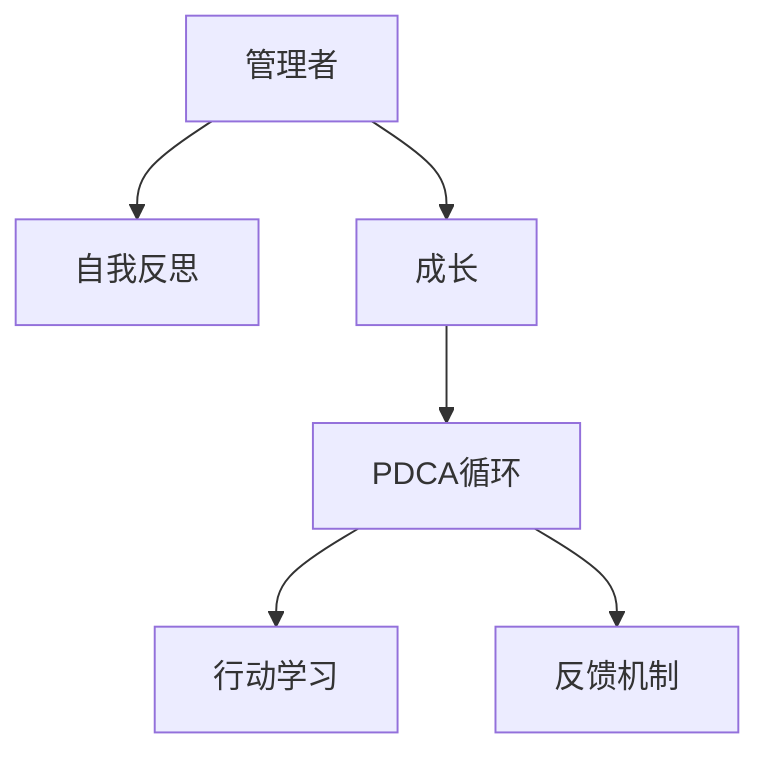

                 

# 管理者的自我反思与成长

管理者的自我反思与成长是企业持续发展的关键。在快速变化的商业环境中，管理者不断学习、提升自我，才能引领团队走向成功。本文将从背景介绍、核心概念、算法原理、实践技巧、应用场景、工具推荐、未来展望和常见问题解答等多个方面，深入探讨管理者如何通过自我反思与成长，实现卓越的领导力。

## 1. 背景介绍

### 1.1 问题由来

在当今商业环境中，竞争激烈，变化莫测。管理者面临的挑战日益复杂，需要不断提升自身的领导力、决策能力和执行力。然而，现实情况是许多管理者缺乏系统性的自我提升方法，导致无法在快速变化的市场中保持竞争力。

### 1.2 问题核心关键点

管理者需要不断学习新知识、掌握新技能，以应对不断变化的业务环境。但学习的过程中，如何高效、系统地进行反思与成长，是一个关键问题。

### 1.3 问题研究意义

自我反思与成长不仅有助于管理者的个人提升，还能够促进团队和组织的共同进步。它能够帮助管理者在职业生涯中持续保持竞争优势，提升企业的市场响应能力和创新能力。

## 2. 核心概念与联系

### 2.1 核心概念概述

为了更好地理解管理者的自我反思与成长，本节将介绍几个密切相关的核心概念：

- **管理者**：在组织中负有领导职责的人员，负责战略规划、团队管理、资源分配等关键任务。
- **自我反思**：管理者对自己行为的思考和分析，旨在识别优势和不足，并采取行动进行改进。
- **成长**：通过学习、实践和反馈，不断提升管理者的领导力、执行力和团队管理能力。
- **PDCA循环**：Plan-Do-Check-Act，即计划-执行-检查-行动，是一种系统化的改进方法。
- **行动学习**：通过实际问题解决的过程，持续学习和提升自身能力。
- **反馈机制**：从团队成员、上级、同事等多渠道获取反馈，进行持续改进。

这些核心概念之间的逻辑关系可以通过以下Mermaid流程图来展示：



这个流程图展示了一个持续成长的管理者发展路径：

1. 管理者通过反思和成长提升自身能力。
2. 成长过程遵循PDCA循环，不断优化自身行为。
3. 通过行动学习获取实际经验，进行反馈改进。

## 3. 核心算法原理 & 具体操作步骤

### 3.1 算法原理概述

管理者的自我反思与成长，本质上是一个通过系统化的方法，不断优化自身行为和能力的持续改进过程。其核心思想是：通过反思、学习、实践和反馈，不断提升领导力和执行力。

### 3.2 算法步骤详解

管理者通过自我反思与成长的过程，可以分为以下四个关键步骤：

**Step 1: 制定成长计划**
- 明确自身的成长目标，制定详细的成长计划。
- 确定需要提升的关键能力，如决策能力、团队管理、沟通能力等。

**Step 2: 实施行动学习**
- 在实际工作中应用新的管理理念和技能，解决问题。
- 主动承担新的挑战和任务，积累实际经验。

**Step 3: 获取反馈与改进**
- 从团队成员、上级、同事等渠道获取反馈。
- 分析和识别反馈中的关键信息，进行自我反思。
- 针对反馈中指出的不足，制定改进计划，并进行调整。

**Step 4: 持续优化与提升**
- 定期回顾和评估自身行为和决策，进行总结反思。
- 根据实际效果，不断调整和优化成长计划。

### 3.3 算法优缺点

自我反思与成长方法具有以下优点：
1. 系统化：通过PDCA循环，实现有计划、有执行、有检查和有行动的持续改进。
2. 实践性：通过实际工作中的行动学习，提升自身能力。
3. 灵活性：反馈机制可以根据实际情况灵活调整。

同时，该方法也存在一定的局限性：
1. 主观性：反思和改进过程受个人主观意识影响，容易偏离目标。
2. 时间成本：持续反思和改进需要大量时间和精力投入。
3. 效果滞后：改进效果往往需要较长时间才能显现。

### 3.4 算法应用领域

自我反思与成长的方法广泛应用于企业管理的各个层面，如：

- 组织战略规划：通过反思和改进，确保战略目标和业务方向符合市场变化。
- 团队管理：提升领导力，优化团队协作，提高团队绩效。
- 个人发展：明确自身成长目标，提升关键能力。
- 决策能力：通过实际问题解决，提升决策质量。
- 沟通能力：通过反馈和改进，提升与团队和外部的沟通效果。

## 4. 数学模型和公式 & 详细讲解 & 举例说明

### 4.1 数学模型构建

本节将使用数学语言对管理者的自我反思与成长过程进行更加严格的刻画。

管理者通过PDCA循环进行成长，可以表示为以下公式：

$$
G(t+1) = F(G(t), A(t+1))
$$

其中，$G(t)$ 表示在时间$t$时的管理能力，$A(t+1)$ 表示在时间$t+1$时的行动计划，$F$ 表示行动计划和现有能力的融合函数。

### 4.2 公式推导过程

假设管理者的能力由以下几个关键维度组成：决策能力、沟通能力、团队管理能力等。每个维度的提升都可以表示为一个连续函数$f_i$，则：

$$
G(t+1) = \sum_{i=1}^n f_i(G_i(t), A_i(t+1))
$$

其中，$G_i(t)$ 表示在时间$t$时，管理者在第$i$个维度的能力，$A_i(t+1)$ 表示在时间$t+1$时，针对第$i$个维度的行动计划。

### 4.3 案例分析与讲解

假设管理者在沟通能力上存在不足，通过反思和改进，制定了提升沟通能力的行动计划，可以表示为：

$$
G_{沟通}(t+1) = f_{沟通}(G_{沟通}(t), A_{沟通}(t+1))
$$

其中，$f_{沟通}$ 表示沟通能力的提升函数。通过实际工作中不断应用新的沟通技巧，进行反思和改进，最终实现沟通能力的提升。

## 5. 项目实践：代码实例和详细解释说明

### 5.1 开发环境搭建

在进行自我反思与成长实践前，我们需要准备好开发环境。以下是使用Python进行Jupyter Notebook开发的简单配置：

1. 安装Anaconda：从官网下载并安装Anaconda，用于创建独立的Python环境。

2. 创建并激活虚拟环境：
```bash
conda create -n py36 python=3.6 
conda activate py36
```

3. 安装必要的Python包：
```bash
pip install jupyter notebook sympy
```

4. 启动Jupyter Notebook：
```bash
jupyter notebook
```

完成上述步骤后，即可在`py36`环境中进行反思与成长实践。

### 5.2 源代码详细实现

下面，我们将通过一个简化的例子，展示如何使用Python进行自我反思与成长过程的建模和分析。

假设我们希望通过一个简单的PDCA循环，提升自身的时间管理能力。我们可以使用Sympy库进行数学建模，并通过Jupyter Notebook进行可视化展示。

```python
import sympy as sp

# 定义时间管理能力的变量
time_management_ability = sp.Symbol('time_management_ability')

# 定义PDCA循环中的四个阶段
plan = sp.Function('plan')
do = sp.Function('do')
check = sp.Function('check')
act = sp.Function('act')

# 假设时间管理能力从0开始提升，每个阶段的提升量不同
initial_ability = 0
plan_increase = 0.1
do_increase = 0.2
check_increase = 0.3
act_increase = 0.4

# PDCA循环中的四个阶段
plan_value = plan(time_management_ability, initial_ability, plan_increase)
do_value = do(time_management_ability, plan_value)
check_value = check(time_management_ability, do_value, check_increase)
act_value = act(time_management_ability, check_value, act_increase)

# 输出每个阶段的提升量
print("Initial ability:", initial_ability)
print("Plan increase:", plan_increase)
print("Do increase:", do_increase)
print("Check increase:", check_increase)
print("Act increase:", act_increase)

# 输出最终的时间管理能力
final_ability = act_value
print("Final ability:", final_ability)
```

通过这个例子，我们可以看到，通过系统化的PDCA循环，可以逐步提升时间管理能力。在实际应用中，我们可以根据具体情况调整每个阶段的提升量，以实现最优的成长效果。

### 5.3 代码解读与分析

让我们再详细解读一下关键代码的实现细节：

**定义变量与函数**：
- 使用Sympy库定义时间管理能力变量，以及PDCA循环中的四个函数。
- 初始能力设定为0，每个阶段的提升量设定为不同的值，表示不同阶段的效果。

**PDCA循环的四个阶段**：
- 计划阶段，通过初始能力和计划提升量计算新的能力值。
- 执行阶段，通过计划后的能力和执行提升量计算新的能力值。
- 检查阶段，通过执行后的能力和检查提升量计算新的能力值。
- 行动阶段，通过检查后的能力和行动提升量计算最终的提升能力值。

**输出结果**：
- 输出初始能力、每个阶段的提升量以及最终的能力值，以展示PDCA循环的效果。

这个例子展示了如何通过数学建模和编程，系统化地进行自我反思与成长。在实际应用中，我们可以根据具体需求，进一步优化模型，实现更精确的自我提升过程。

## 6. 实际应用场景

### 6.1 企业战略规划

管理者通过反思与成长，可以更好地理解和执行企业的战略规划，确保战略目标的实现。在制定和执行战略规划时，管理者需要：

- 定期反思：通过PDCA循环，不断优化战略规划的执行效果。
- 获取反馈：从团队成员、上级和外部市场获取反馈，进行持续改进。
- 灵活调整：根据市场变化和内部反馈，灵活调整战略规划的实施路径。

### 6.2 团队管理

管理者通过提升领导力和团队管理能力，可以更好地激励和引导团队成员，提升团队绩效。在团队管理中，管理者需要：

- 提升沟通能力：通过行动学习和反馈机制，提升与团队成员的沟通效果。
- 优化资源分配：通过实际工作中的行动学习，优化资源配置和利用。
- 激励团队成员：通过反馈和改进，识别团队成员的优势和不足，进行有针对性的激励。

### 6.3 个人发展

管理者通过自我反思与成长，可以明确自身成长目标，提升关键能力。在个人发展中，管理者需要：

- 制定成长计划：明确自身需要提升的能力，制定详细的成长计划。
- 实施行动学习：在实际工作中应用新的管理理念和技能，解决问题。
- 持续优化：通过反思和改进，不断调整和优化成长计划。

## 7. 工具和资源推荐

### 7.1 学习资源推荐

为了帮助管理者系统掌握自我反思与成长的理论基础和实践技巧，这里推荐一些优质的学习资源：

1. **《卓有成效的管理者》**：彼得·德鲁克著，经典的管理学著作，涵盖目标管理、时间管理等多个方面。
2. **《领导力与组织变革》**：约翰·科特著，探讨领导力的本质和组织变革的路径。
3. **《行动学习》**：戴维·胡斯曼著，介绍行动学习的理论和实践方法。
4. **《PDCA循环与质量管理》**：讲解PDCA循环的理论和应用，帮助管理者系统化地进行改进。
5. **《组织学习与知识管理》**：吉姆·柯林斯著，探讨组织学习和知识管理的重要性。

通过对这些资源的学习实践，相信管理者一定能够快速掌握自我反思与成长的精髓，并用于解决实际的组织和团队问题。

### 7.2 开发工具推荐

高效的开发离不开优秀的工具支持。以下是几款用于自我反思与成长开发的常用工具：

1. **Jupyter Notebook**：基于Python的交互式编程环境，支持数学建模和可视化展示，适合进行自我反思与成长的系统化建模。
2. **Microsoft Excel**：强大的数据分析和可视化工具，适合进行数据驱动的自我反思与成长分析。
3. **Google Docs**：在线文档编辑工具，方便团队协作和反思记录。
4. **Trello**：项目管理工具，帮助管理者制定和跟踪成长计划。
5. **Notion**：全能型笔记应用，支持文本、表格、任务管理等多种功能，适合进行综合性的自我反思与成长记录。

合理利用这些工具，可以显著提升自我反思与成长的开发效率，加快创新迭代的步伐。

### 7.3 相关论文推荐

自我反思与成长的研究源于学界的持续研究。以下是几篇奠基性的相关论文，推荐阅读：

1. **《团队动态与组织学习》**：Yves Morin和Jean-François Dufour，探讨团队动态和组织学习的互动关系。
2. **《行动学习与组织变革》**：Arthur Kay和Deborah Woolley，研究行动学习的理论基础和应用效果。
3. **《PDCA循环与质量管理》**：George Edwards，讲解PDCA循环的理论和实际应用。
4. **《领导力与组织学习》**：Diana Knee和Katherine Lyons，探讨领导力和组织学习的协同效应。
5. **《组织学习与知识管理》**：Paul C. Drake和Susan B. Myers，讨论组织学习和知识管理的理论和方法。

这些论文代表了自己反思与成长理论的发展脉络。通过学习这些前沿成果，可以帮助管理者把握学科前进方向，激发更多的创新灵感。

## 8. 总结：未来发展趋势与挑战

### 8.1 总结

本文对管理者的自我反思与成长方法进行了全面系统的介绍。首先阐述了自我反思与成长的研究背景和意义，明确了管理者通过自我反思与成长提升自身能力的目标。其次，从原理到实践，详细讲解了自我反思与成长的数学原理和关键步骤，给出了反思与成长任务开发的完整代码实例。同时，本文还广泛探讨了反思与成长方法在战略规划、团队管理、个人发展等多个领域的应用前景，展示了反思与成长范式的巨大潜力。此外，本文精选了反思与成长技术的各类学习资源，力求为管理者提供全方位的技术指引。

通过本文的系统梳理，可以看到，管理者的自我反思与成长方法是实现卓越领导力的重要途径。管理者通过反思、学习、实践和反馈，不断优化自身行为和能力，能够在不断变化的商业环境中保持竞争力，引领团队和组织走向成功。

### 8.2 未来发展趋势

展望未来，管理者的自我反思与成长方法将呈现以下几个发展趋势：

1. **数据驱动的决策**：通过数据分析和可视化工具，帮助管理者进行科学的决策和改进。
2. **人工智能辅助**：利用AI技术进行数据分析、预测和决策支持，提升管理者的工作效率和效果。
3. **全员参与的改进**：通过全员参与的改进机制，增强组织的学习能力和创新能力。
4. **跨部门协同**：跨部门协同改进，提升组织的整体执行力和创新能力。
5. **敏捷管理**：通过敏捷管理方法，提升组织的灵活性和响应速度。

以上趋势凸显了自我反思与成长方法的广阔前景。这些方向的探索发展，必将进一步提升管理者的领导力和组织的学习能力，为构建高效、创新的组织奠定基础。

### 8.3 面临的挑战

尽管自我反思与成长方法已经取得了瞩目成就，但在迈向更加智能化、普适化应用的过程中，它仍面临着诸多挑战：

1. **数据隐私和伦理问题**：在收集和分析个人数据时，需要严格遵守数据隐私和伦理规定。
2. **技术依赖性**：过度依赖技术工具，可能导致管理者的自主反思能力下降。
3. **资源投入**：开发和应用自我反思与成长方法，需要大量资源投入，包括时间、人力和技术支持。
4. **效果评估**：如何客观评估反思与成长方法的效果，并持续改进，仍然是一个难题。

### 8.4 研究展望

面对自我反思与成长方法所面临的挑战，未来的研究需要在以下几个方面寻求新的突破：

1. **增强自主反思能力**：通过技术辅助，提升管理者的自主反思和自我改进能力。
2. **优化反馈机制**：建立更有效的反馈机制，确保反馈信息的真实性和可操作性。
3. **提升数据驱动决策能力**：通过数据分析和可视化，提升管理者的决策能力。
4. **促进全员参与**：通过激励机制和协同工具，促进全员参与自我反思与成长。
5. **探索新技术应用**：利用新兴技术，如区块链、物联网等，提升反思与成长方法的效能。

这些研究方向的探索，必将引领自我反思与成长方法迈向更高的台阶，为构建高效、创新的组织和团队提供更多可能。

## 9. 附录：常见问题与解答

**Q1：自我反思与成长是否适用于所有管理者？**

A: 自我反思与成长方法适用于所有具备领导职责的管理者，但不同层级和职位的管理者，其重点和应用方式可能有所不同。

**Q2：如何制定科学的成长计划？**

A: 制定科学的成长计划需要明确目标、评估现状、设定具体步骤和时间表。可以参考SMART原则（具体、可测量、可实现、相关、时限）进行制定。

**Q3：如何获取有效的反馈？**

A: 获取有效的反馈需要建立开放、透明的沟通机制，鼓励团队成员提出建设性意见。可以使用360度反馈工具和匿名反馈渠道，确保反馈的全面性和真实性。

**Q4：如何应用行动学习？**

A: 行动学习需要结合实际工作中的具体问题，进行系统化的反思和改进。可以通过项目管理工具和问题跟踪系统，将反思和改进过程系统化。

**Q5：如何平衡技术工具和自主反思？**

A: 技术工具可以作为辅助，但管理者应保持自主反思和自主决策的能力。可以采用混合模式，结合技术工具和自主反思，实现最优的成长效果。

通过本文的系统梳理，管理者可以看到，自我反思与成长方法是实现卓越领导力的重要途径。通过反思、学习、实践和反馈，管理者能够不断优化自身行为和能力，在不断变化的商业环境中保持竞争力，引领团队和组织走向成功。

