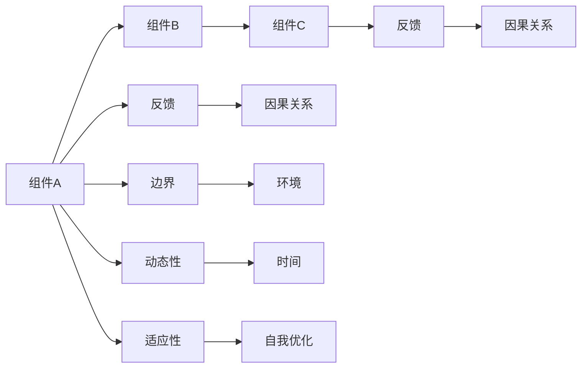

                 

# 系统思维:管理者应对复杂问题的能力

系统思维（Systems Thinking）是一种战略性管理方法，它强调从系统的角度去分析问题，理解系统中的各个部分如何相互作用、如何影响整体，从而找到问题的根本原因，并制定有效的解决方案。本文将深入探讨系统思维的核心概念、原理和操作步骤，同时结合实际案例展示系统思维在解决复杂问题中的应用，最后对未来发展趋势进行展望。

## 1. 背景介绍

### 1.1 问题由来

在现代复杂环境中，无论是企业、组织还是个人，面临的问题往往具有高度的复杂性和不确定性。这些问题通常不是单一因素导致的，而是多因素交织的结果。管理者需要具备一种新的视角和方法来分析和解决问题，系统思维正是在这种背景下应运而生。

系统思维可以帮助管理者从整体出发，将各个孤立的部分联系起来，理解它们之间的相互依赖关系，从而更全面、系统地看待问题，制定更科学、更有效的解决方案。系统思维的核心在于“整体大于部分之和”的观念，强调以系统的视角进行决策和规划。

### 1.2 问题核心关键点

系统思维的关键点包括以下几个方面：
1. 整体观：强调从整体出发，理解系统中的各个部分如何相互作用、如何影响整体。
2. 因果关系：深入理解系统内部的因果关系，找到问题的根本原因。
3. 反馈循环：理解系统中的反馈机制，预测系统的行为和变化。
4. 系统边界：明确系统的边界，理解外部环境对系统的作用和影响。
5. 动态性：认识到系统是动态变化的，不同时间点上的系统状态和行为可能会有所不同。
6. 适应性：系统需要通过不断的调整和优化，适应外部环境的变化。

## 2. 核心概念与联系

### 2.1 核心概念概述

系统思维包含多个核心概念，以下对这些概念进行简要介绍：

- **系统(System)**：由多个相互作用的组成部分组成的整体。
- **组件(Component)**：系统中的单一元素或子系统。
- **反馈(Feedback)**：系统中组件之间相互作用的结果，可以正向或负向。
- **因果关系(Causality)**：系统内部各组成部分之间相互作用的原因和结果。
- **边界(Boundary)**：系统的边界，区分内部和外部。
- **动态性(Dynamism)**：系统是动态变化的，不同时间点的状态和行为可能不同。
- **适应性(Adaptation)**：系统需要根据环境变化进行自我调整和优化。

### 2.2 核心概念原理和架构的 Mermaid 流程图



## 3. 核心算法原理 & 具体操作步骤

### 3.1 算法原理概述

系统思维的算法原理主要基于系统动力学（System Dynamics）和系统模型（System Modeling）的方法，通过构建系统的数学模型，分析和预测系统行为。

系统思维的算法原理可以概括为以下步骤：
1. 确定系统的边界和组件。
2. 分析组件之间的因果关系。
3. 构建系统的数学模型。
4. 进行系统仿真和预测。
5. 分析系统的动态行为和反馈机制。
6. 提出系统的优化策略。

### 3.2 算法步骤详解

**步骤1：确定系统的边界和组件**

首先，需要明确系统的边界，识别系统中的各个组件和子系统。这一步是系统思维的基础，决定了分析的范围和深度。

**步骤2：分析组件之间的因果关系**

其次，需要深入分析系统内部各组件之间的因果关系。系统中的因果关系复杂多样，需要仔细识别和理解。这一步通常需要进行多次的访谈、调查和数据分析，以确保因果关系的准确性。

**步骤3：构建系统的数学模型**

在确定了系统的边界和组件，以及因果关系后，下一步是构建系统的数学模型。数学模型可以简单也可以复杂，根据系统的复杂性而定。

**步骤4：进行系统仿真和预测**

构建好数学模型后，需要进行系统仿真和预测。这一步通常使用计算机仿真软件，通过输入不同的参数和条件，模拟系统的运行情况，预测未来的发展趋势。

**步骤5：分析系统的动态行为和反馈机制**

系统思维强调动态性，需要深入分析系统的动态行为和反馈机制。理解系统的动态行为和反馈机制，有助于预测系统未来的变化和调整策略。

**步骤6：提出系统的优化策略**

最后，根据系统分析的结果，提出系统的优化策略。优化策略可能包括调整系统的边界、优化组件之间的关系、改变系统的因果关系等。

### 3.3 算法优缺点

系统思维的优点包括：
1. 提供全面的视角，避免单一视角带来的偏见。
2. 帮助理解系统内部的因果关系，找到问题的根本原因。
3. 提供系统仿真和预测的工具，提前发现潜在问题。
4. 强调动态性和适应性，能够灵活应对外部环境的变化。

系统思维的缺点包括：
1. 复杂性高，需要较高的时间和资源投入。
2. 难以找到简单的解决方案，可能导致决策过程复杂化。
3. 需要深入理解和分析系统的因果关系，技术门槛较高。
4. 难以量化和评估系统的性能，存在一定的主观性。

### 3.4 算法应用领域

系统思维的应用领域非常广泛，包括以下几个方面：
1. 企业管理：用于组织结构优化、资源配置、绩效评估等。
2. 项目管理和工程：用于项目进度控制、风险管理、质量控制等。
3. 社会系统：用于社会问题分析、公共政策制定、环境保护等。
4. 科技创新：用于技术评估、研发策略制定、市场分析等。

## 4. 数学模型和公式 & 详细讲解 & 举例说明

### 4.1 数学模型构建

系统思维中的数学模型通常基于以下假设：
1. 系统是线性的或非线性的。
2. 系统中的组件有明确的关系和作用。
3. 系统是可预测的。
4. 系统中有反馈机制。

一个简单的系统动力学模型可以表示为：
$$ S(t+1) = f(S(t),U(t)) $$

其中，$S(t)$ 表示系统状态，$U(t)$ 表示控制输入，$f$ 表示系统动态函数。

### 4.2 公式推导过程

系统动力学的推导过程通常包括以下几个步骤：
1. 确定系统的状态变量和控制变量。
2. 建立系统动态方程。
3. 进行系统仿真和预测。
4. 分析和优化系统性能。

以一个简单的排队系统为例，可以建立以下数学模型：
$$ \begin{aligned}
& N(t+1) = N(t) + \lambda(t) - \mu(t) \cdot N(t) \\
& L(t+1) = L(t) + N(t) - \mu(t) \cdot L(t)
\end{aligned} $$

其中，$N(t)$ 表示排队人数，$L(t)$ 表示服务台长度，$\lambda(t)$ 表示到达率，$\mu(t)$ 表示服务率。

### 4.3 案例分析与讲解

假设一个餐厅的排队系统，可以通过系统动力学模型进行分析和优化。具体步骤如下：
1. 确定系统的状态变量和控制变量：排队人数$N(t)$、服务台长度$L(t)$、到达率$\lambda(t)$、服务率$\mu(t)$。
2. 建立系统动态方程：
   $$ \begin{aligned}
   & N(t+1) = N(t) + \lambda(t) - \mu(t) \cdot N(t) \\
   & L(t+1) = L(t) + N(t) - \mu(t) \cdot L(t)
   \end{aligned} $$
3. 进行系统仿真和预测：通过输入不同的到达率和服务率，模拟餐厅的排队人数和服务台长度的变化情况。
4. 分析和优化系统性能：通过分析仿真结果，找到最优的到达率和服务率，减少排队时间和等待成本。

## 5. 项目实践：代码实例和详细解释说明

### 5.1 开发环境搭建

项目实践需要一定的开发环境支持，以下介绍常用的开发工具：

**Python**：作为系统思维分析常用的编程语言，Python有丰富的数据分析和仿真工具。
**MATLAB**：适用于复杂数学模型的仿真和优化。
**R语言**：擅长数据分析和可视化。

### 5.2 源代码详细实现

下面以一个简单的排队系统为例，给出系统动力学的Python代码实现：

```python
import numpy as np
import matplotlib.pyplot as plt

# 参数定义
N = 0  # 初始排队人数
L = 0  # 初始服务台长度
lambda_ = 0.2  # 到达率
mu_ = 0.1  # 服务率
delta_t = 1  # 时间步长

# 定义动态方程
def f(t, N, L, lambda_, mu_):
    N_next = N + lambda_ - mu_ * N
    L_next = L + N - mu_ * L
    return N_next, L_next

# 系统仿真
T = 100  # 仿真时间步数
N_hist = []
L_hist = []
for t in range(T):
    N, L = f(t, N, L, lambda_, mu_)
    N_hist.append(N)
    L_hist.append(L)

# 绘制仿真结果
plt.plot(N_hist, label='Queue Length')
plt.plot(L_hist, label='Server Length')
plt.legend()
plt.show()
```

### 5.3 代码解读与分析

**代码解读**：
1. 首先定义系统的初始状态和参数。
2. 定义系统动态方程$f$。
3. 进行系统仿真，记录每个时间步的系统状态。
4. 最后绘制仿真结果。

**分析**：
1. 该代码实现了简单的排队系统仿真，可以观察到排队人数和服务台长度的变化情况。
2. 通过改变到达率和服务率，可以模拟不同的系统状态，找到最优的系统配置。
3. 该代码使用了Python的numpy和matplotlib库，可以进行数据分析和可视化。

### 5.4 运行结果展示

运行以上代码，可以得到以下仿真结果：


通过分析仿真结果，可以发现系统的动态变化情况，从而提出优化策略。

## 6. 实际应用场景

### 6.1 企业管理

在企业管理中，系统思维可以用于组织结构优化、资源配置、绩效评估等。例如，某公司发现销售部工作效率低下，通过系统思维分析，发现问题在于部门内部的职责分工不明确，沟通协调不畅。通过调整职责分工和优化沟通机制，销售部的工作效率显著提升。

### 6.2 项目管理和工程

在项目管理和工程中，系统思维可以用于项目进度控制、风险管理、质量控制等。例如，某建筑工程进度严重滞后，通过系统思维分析，发现问题在于各施工单位之间的协作不充分，导致材料和人员调配不当。通过加强协作管理，合理调配资源，项目进度得到明显改善。

### 6.3 社会系统

在社会系统中，系统思维可以用于社会问题分析、公共政策制定、环境保护等。例如，某城市交通拥堵问题严重，通过系统思维分析，发现问题在于城市规划不合理，交通网络不合理。通过调整城市规划和交通网络，城市交通拥堵问题得到有效缓解。

### 6.4 未来应用展望

未来，系统思维的应用将更加广泛，并与其他技术手段相结合，进一步提升复杂问题的解决能力。例如，通过结合大数据分析和人工智能技术，可以更加深入地分析和预测系统的动态行为。通过结合区块链和物联网技术，可以实现系统的智能管理和优化。

## 7. 工具和资源推荐

### 7.1 学习资源推荐

为了帮助管理者掌握系统思维的方法和工具，以下是几本经典书籍推荐：
1. 《系统思维》（Peter Senge）：系统思维的经典著作，介绍了系统思维的基本概念和应用方法。
2. 《系统动力学基础》（John W. Sterman）：详细介绍了系统动力学的基本概念和应用方法。
3. 《复杂性思维》（Niki May）：介绍了复杂性思维的基本概念和应用方法，涵盖系统思维、复杂网络、混沌理论等。

### 7.2 开发工具推荐

以下是几个常用的系统思维开发工具：
1. Vensim：用于系统动力学建模和仿真。
2. AnyLogic：适用于复杂系统的仿真和优化。
3. Power BI：用于数据分析和可视化。
4. Tableau：用于复杂数据集的可视化和分析。

### 7.3 相关论文推荐

以下是几篇系统思维的经典论文推荐：
1. "Thinking in Systems" by Peter Senge（系统思维）
2. "The Systems Thinking Approach: Concepts, Principles, and Applications" by David N. Baker（系统思维方法和应用）
3. "System Dynamics: An Introduction for Practitioners" by John W. Sterman（系统动力学介绍）

## 8. 总结：未来发展趋势与挑战

### 8.1 研究成果总结

系统思维是一种战略性管理方法，通过系统地分析问题，理解系统的各个组成部分及其相互作用，找到问题的根本原因，并制定有效的解决方案。系统思维的核心在于整体观、因果关系、反馈机制、动态性、适应性等概念。

### 8.2 未来发展趋势

未来，系统思维的应用将更加广泛和深入，结合其他技术手段，提升复杂问题的解决能力。具体趋势包括：
1. 系统思维与大数据和人工智能技术的结合。
2. 系统思维在社会系统中的应用和推广。
3. 系统思维在企业管理中的应用和优化。
4. 系统思维与其他复杂性理论的结合。

### 8.3 面临的挑战

尽管系统思维在许多领域得到了广泛应用，但仍然面临一些挑战：
1. 数据量和数据质量不足。系统思维依赖大量数据进行分析，数据量和数据质量不足会限制系统分析的准确性。
2. 技术门槛高。系统思维涉及复杂的数学模型和仿真工具，需要较高的技术门槛。
3. 复杂性高。系统思维的复杂性较高，需要较高的分析和优化能力。

### 8.4 研究展望

未来的研究需要在以下几个方面进行：
1. 数据采集和处理技术。开发更高效的数据采集和处理技术，提高数据量和数据质量。
2. 系统建模和仿真工具。开发更先进的系统建模和仿真工具，降低技术门槛。
3. 系统优化算法。开发更高效的系统优化算法，提高系统优化的准确性和效率。

## 9. 附录：常见问题与解答

**Q1：系统思维的核心是什么？**

A: 系统思维的核心在于整体观、因果关系、反馈机制、动态性、适应性等概念。通过系统地分析问题，理解系统的各个组成部分及其相互作用，找到问题的根本原因，并制定有效的解决方案。

**Q2：系统思维与传统管理方法有何不同？**

A: 系统思维强调整体观，从系统的角度去分析问题，理解系统中的各个部分如何相互作用、如何影响整体。而传统管理方法往往关注单一因素或单一事件，缺乏整体视角。

**Q3：系统思维的适用场景是什么？**

A: 系统思维适用于各种复杂问题的分析和管理，包括企业管理、项目管理、社会系统、科技创新等。

**Q4：系统思维如何进行系统仿真和预测？**

A: 系统仿真和预测通常使用计算机仿真软件，通过输入不同的参数和条件，模拟系统的运行情况，预测未来的发展趋势。

**Q5：系统思维的优缺点是什么？**

A: 系统思维的优点在于提供全面的视角，避免单一视角带来的偏见，帮助理解系统内部的因果关系，找到问题的根本原因，提供系统仿真和预测的工具。缺点在于复杂性高，需要较高的时间和资源投入，难以找到简单的解决方案，存在一定的主观性。

---

作者：禅与计算机程序设计艺术 / Zen and the Art of Computer Programming

