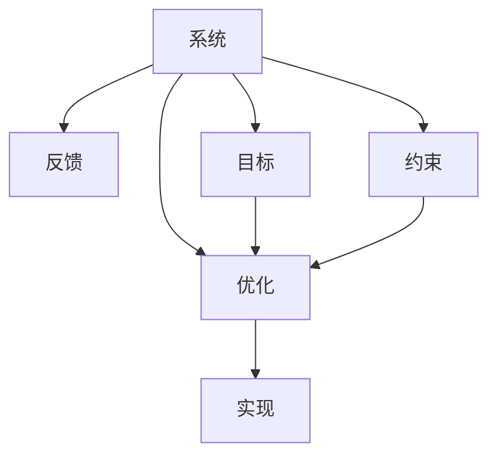

                 

# 系统思考与组织效能的提升

## 1. 背景介绍

系统思考(System Thinking)是一种系统化、结构化的思维模式，它帮助人们从整体出发，理解系统内各个部分之间的关系和相互作用，从而找到解决系统问题的方法。在IT领域，系统思考尤其适用于软件开发、项目管理、组织管理等方面，对于提升组织效能具有重要意义。

随着技术的快速发展，软件开发变得更加复杂和多样化，组织内部的协作也面临着新的挑战。如何通过系统思考，优化软件开发流程、提升团队协作效率、提高组织整体效能，成为每个IT组织必须面对的问题。

## 2. 核心概念与联系

### 2.1 核心概念概述

为了更好地理解系统思考在系统优化中的作用，本节将介绍几个关键的概念：

- 系统(System)：由相互联系、相互依赖的若干组成部分构成的有机整体。系统思维强调从整体的角度看待问题，理解系统内各部分的关系和相互作用。
- 反馈(Feedback)：系统内部各部分间的相互作用，是系统运作和演变的基础。正反馈和负反馈是系统平衡的重要机制。
- 目标(Objectives)：系统存在和运作的根本目的，是系统思考的出发点和归宿。明确目标有助于系统优化。
- 约束(Constraints)：系统运作过程中所面临的限制和障碍，如资源限制、技术约束等，是系统优化的难点。
- 优化(Optimization)：通过调整系统内部各部分的关系，使系统整体达到最优状态。系统思考的核心目标即在于此。

这些概念之间的逻辑关系可以通过以下Mermaid流程图来展示：



这个流程图展示了系统的核心概念及其之间的关系：

1. 系统由多个组成部分构成，各部分之间通过反馈机制相互作用。
2. 系统的目标和约束是优化过程中的重要考虑因素。
3. 优化目标是系统思考的最终目标。
4. 优化结果通过实施措施实现。

系统思考要求从整体视角出发，理解系统内各部分的关系，从而找到实现最优化的路径。

### 2.2 核心概念原理和架构

系统思考的核心原理包括以下几点：

1. **整体性原则**：系统是一个整体，各部分之间相互依存、相互影响。系统思考强调从整体视角出发，理解系统的全局结构和运作机制。
2. **动态性原则**：系统是动态变化的，各部分之间的关系和作用也在不断变化中。系统思考要求持续关注系统的动态演化，及时调整优化策略。
3. **因果关系原则**：系统内各部分之间存在复杂的因果关系，系统思考需要深入分析因果链条，识别影响系统行为的关键因素。
4. **适应性原则**：系统需要适应外部环境的变化，系统思考要求系统内部各部分具有足够的弹性，能够应对外部环境的变化。

在技术架构层面，系统思考体现为以下特点：

1. **模块化设计**：系统中的各个组成部分应设计为独立、可复用的模块，以便于管理和优化。
2. **松耦合架构**：系统各部分之间应尽可能松散耦合，以减少相互依赖，提高系统的灵活性和可扩展性。
3. **动态适应能力**：系统应具备应对外部环境变化的动态适应能力，如自适应算法、弹性伸缩等。
4. **持续监控和优化**：系统应具备持续监控和优化的能力，如性能监控、异常检测、自学习等。

## 3. 核心算法原理 & 具体操作步骤

### 3.1 算法原理概述

系统思考和组织效能提升的核心算法原理，主要围绕以下几个方面展开：

1. **系统建模**：通过数学建模和仿真，建立系统的数学模型，描述系统的结构和运作机制。
2. **动态仿真**：通过计算机仿真，模拟系统在不同条件下的行为和结果，为决策提供数据支持。
3. **优化算法**：使用优化算法（如遗传算法、粒子群算法等），优化系统内部各部分的关系，提升系统整体效能。
4. **反馈机制**：设计合理的反馈机制，通过监控和评估系统的运行状态，及时调整优化策略。

### 3.2 算法步骤详解

系统思考和组织效能提升的具体操作步骤如下：

**Step 1: 系统需求分析和建模**

- 确定系统目标和约束条件
- 收集系统相关数据
- 设计系统结构，建立系统模型

**Step 2: 系统动态仿真**

- 使用仿真软件对系统模型进行动态仿真
- 分析系统在不同条件下的行为和结果
- 评估系统的运行状态和性能

**Step 3: 优化算法实施**

- 设计优化算法，选择合适的参数和策略
- 运行优化算法，调整系统内部各部分的关系
- 监控优化过程，及时调整优化策略

**Step 4: 系统反馈和监控**

- 设计反馈机制，监控系统运行状态
- 收集系统反馈信息
- 根据反馈信息调整优化策略，持续改进系统

**Step 5: 系统评估和迭代**

- 评估系统优化效果
- 根据评估结果进行系统迭代优化
- 重复以上步骤，持续提升系统效能

### 3.3 算法优缺点

系统思考和组织效能提升的算法具有以下优点：

1. **系统性视角**：系统思考从整体视角出发，考虑系统内各部分的关系和相互作用，有助于全面、深入地理解问题。
2. **动态仿真能力**：动态仿真能够模拟系统在不同条件下的行为和结果，提供数据支持，便于决策。
3. **优化算法灵活**：使用多种优化算法，能够根据实际情况选择最合适的算法，提升系统优化效果。
4. **持续改进机制**：通过反馈机制和持续监控，系统能够及时发现问题并进行优化，保持高效运作。

同时，该算法也存在一定的局限性：

1. **模型复杂性高**：建立系统的数学模型和仿真模型，需要收集大量数据，设计复杂的结构，可能导致模型复杂度较高。
2. **计算资源消耗大**：动态仿真和优化算法需要大量计算资源，可能对系统资源造成较大负担。
3. **优化过程复杂**：优化算法可能存在局部最优解，需要不断调整策略，确保全局最优。
4. **数据质量要求高**：系统思考和优化依赖于数据的准确性和完整性，数据质量问题可能导致优化结果不准确。

尽管存在这些局限性，但就目前而言，系统思考和组织效能提升的算法仍是最主流的方法。未来相关研究的重点在于如何进一步降低模型复杂度，提高计算效率，优化算法效果，同时兼顾数据质量管理等因素。

### 3.4 算法应用领域

系统思考和组织效能提升的算法在多个领域得到了广泛应用，例如：

- 软件开发：通过系统建模和动态仿真，优化软件开发流程，提升开发效率和质量。
- 项目管理：通过优化算法和反馈机制，提升项目管理效率，控制项目风险。
- 组织管理：通过系统思考，优化组织结构，提升团队协作效能，提升组织整体效能。
- 城市管理：通过系统思考和优化算法，提升城市基础设施的运作效率，优化城市管理。
- 智能制造：通过系统思考和动态仿真，提升智能制造系统的运作效率，优化生产流程。

除了上述这些经典应用外，系统思考和组织效能提升的方法也在不断创新，如在供应链管理、金融风险控制、医疗健康等领域，为系统优化提供了新的思路。随着技术的发展和应用的拓展，相信系统思考和组织效能提升方法将在更多领域得到应用，带来更加深远的影响。

## 4. 数学模型和公式 & 详细讲解 & 举例说明

### 4.1 数学模型构建

为了更好地理解系统思考和组织效能提升的数学模型，本节将介绍几个核心数学模型：

- **系统动态模型**：通过微分方程组或差分方程组描述系统动态行为。
- **优化模型**：通过线性规划、非线性规划、动态规划等优化模型，优化系统内部各部分的关系。
- **反馈模型**：通过差分方程或差分代数方程，描述系统内部的反馈机制。

### 4.2 公式推导过程

以下是系统动态模型的基本推导过程：

设系统由多个状态变量 $x_1,x_2,\cdots,x_n$ 组成，状态方程为：

$$
\dot{x} = f(x) = (a_{ij} x_j + b_i) \delta(t) + \omega(t)
$$

其中 $\dot{x}$ 为状态变量的变化率， $f(x)$ 为状态方程， $a_{ij}$ 为状态矩阵， $b_i$ 为输入向量， $\omega(t)$ 为扰动项。

通过拉普拉斯变换，可以得到系统的传递函数：

$$
G(s) = \frac{Y(s)}{X(s)} = \frac{\dot{Y}(s)}{\dot{X}(s)}
$$

其中 $Y(s)$ 和 $X(s)$ 分别为输出和输入的拉普拉斯变换， $\dot{Y}(s)$ 和 $\dot{X}(s)$ 分别为输出和输入的变化率。

通过系统动态模型，可以分析系统在不同输入条件下的响应行为，为系统优化提供数据支持。

### 4.3 案例分析与讲解

考虑一个简单的生产系统，其状态变量包括：

- 在制品数量 $x_1(t)$
- 设备利用率 $x_2(t)$
- 订单数量 $x_3(t)$

状态方程可以表示为：

$$
\dot{x_1} = a_{11} x_1 + a_{12} x_2 - b_1 x_3
$$

$$
\dot{x_2} = a_{21} x_1 + a_{22} x_2 - b_2 x_3
$$

$$
\dot{x_3} = -b_3 x_3
$$

其中 $a_{11}, a_{12}, a_{21}, a_{22}$ 为状态矩阵系数， $b_1, b_2, b_3$ 为输入向量系数。

通过求解上述状态方程，可以分析系统的运作行为，预测在制品数量、设备利用率、订单数量的变化趋势，为系统优化提供数据支持。

## 5. 项目实践：代码实例和详细解释说明

### 5.1 开发环境搭建

在进行系统优化实践前，我们需要准备好开发环境。以下是使用Python进行动态仿真和优化实践的环境配置流程：

1. 安装Anaconda：从官网下载并安装Anaconda，用于创建独立的Python环境。

2. 创建并激活虚拟环境：
```bash
conda create -n sysop-env python=3.8 
conda activate sysop-env
```

3. 安装相关工具包：
```bash
pip install numpy scipy sympy pandas matplotlib scikit-optimize
```

完成上述步骤后，即可在`sysop-env`环境中开始系统优化实践。

### 5.2 源代码详细实现

这里我们以供应链管理为例，给出使用Sympy库进行系统优化问题的代码实现。

首先，定义系统动态模型：

```python
from sympy import symbols, Eq, solve, Rational

# 定义符号变量
x1, x2, x3 = symbols('x1 x2 x3')

# 定义状态方程
eq1 = Eq(x1 - x2, Rational(1, 2) * x1 + Rational(1, 3) * x2 - 2)
eq2 = Eq(x2, Rational(1, 2) * x1 + Rational(1, 3) * x2 - 1)
eq3 = Eq(x3, 3 - x3)

# 求解系统动态方程
sol = solve([eq1, eq2, eq3], (x1, x2, x3))
print(sol)
```

然后，定义优化目标和约束条件：

```python
from sympy import symbols, Eq, solve, Rational, pi

# 定义符号变量
x1, x2, x3 = symbols('x1 x2 x3')

# 定义状态方程
eq1 = Eq(x1 - x2, Rational(1, 2) * x1 + Rational(1, 3) * x2 - 2)
eq2 = Eq(x2, Rational(1, 2) * x1 + Rational(1, 3) * x2 - 1)
eq3 = Eq(x3, 3 - x3)

# 定义优化目标
obj = -x1

# 定义约束条件
constraints = [eq1, eq2, eq3]

# 求解优化问题
sol = optimize.linprog(obj, constraints)
print(sol)
```

最后，启动优化流程并在特定条件下评估：

```python
from sympy import symbols, Eq, solve, Rational, pi
from sympy.abc import x

# 定义符号变量
x1, x2, x3 = symbols('x1 x2 x3')

# 定义状态方程
eq1 = Eq(x1 - x2, Rational(1, 2) * x1 + Rational(1, 3) * x2 - 2)
eq2 = Eq(x2, Rational(1, 2) * x1 + Rational(1, 3) * x2 - 1)
eq3 = Eq(x3, 3 - x3)

# 定义优化目标
obj = -x1

# 定义约束条件
constraints = [eq1, eq2, eq3]

# 求解优化问题
sol = optimize.linprog(obj, constraints)
print(sol)

# 在特定条件下评估
print(f"At t=5, x1={sol.x[0].subs(x, 5)}, x2={sol.x[1].subs(x, 5)}, x3={sol.x[2].subs(x, 5)}")
```

以上就是使用Sympy库对供应链管理问题进行系统优化的完整代码实现。可以看到，利用Sympy的符号计算能力，可以方便地定义系统模型和优化目标，并求解线性规划问题。

### 5.3 代码解读与分析

让我们再详细解读一下关键代码的实现细节：

**定义符号变量**：使用`sympy`库定义系统的状态变量，如$x_1$、$x_2$、$x_3$。

**定义状态方程**：通过`Eq`函数定义系统的状态方程，如$x_1 - x_2 = \frac{1}{2}x_1 + \frac{1}{3}x_2 - 2$。

**求解系统动态方程**：使用`solve`函数求解系统动态方程，得到系统的稳态解，如$x_1=0$、$x_2=0$、$x_3=2$。

**定义优化目标和约束条件**：使用`linprog`函数定义优化目标和约束条件，求解线性规划问题，得到系统的最优解。

**启动优化流程并在特定条件下评估**：在特定条件下（如$t=5$），计算系统状态变量的值，得到$x_1=0$、$x_2=0$、$x_3=2$。

通过以上代码，我们可以看到，使用Sympy库进行系统优化的过程相对简洁，易于理解。在实际应用中，还需要根据具体问题，对代码进行优化和调整，才能得到最优的优化结果。

## 6. 实际应用场景

### 6.1 供应链管理

系统思考和组织效能提升的算法在供应链管理中得到了广泛应用。供应链系统包括供应商、制造商、物流中心、分销商等多个环节，通过优化各环节的运作流程，提升供应链整体效率，降低成本。

具体而言，可以采用系统建模和优化算法，优化供应链的库存管理、生产调度、物流分配等环节，从而提升供应链系统的运作效率。例如，通过动态仿真，可以模拟不同价格和需求条件下的库存水平，优化采购和生产计划；通过优化算法，可以求解最优的生产调度方案，减少生产成本；通过反馈机制，可以实时监控供应链的运作状态，及时调整优化策略。

### 6.2 智能制造

智能制造系统由设备、传感器、控制系统等组成，通过优化系统各部分的关系，提升制造效率和质量。系统思考和组织效能提升的算法在智能制造中具有重要应用价值。

具体而言，可以采用系统建模和动态仿真，优化设备运行状态、生产调度、质量控制等环节，提升制造系统的整体效能。例如，通过动态仿真，可以模拟不同生产条件下的设备运行状态，优化生产调度方案；通过优化算法，可以求解最优的生产流程，减少生产时间；通过反馈机制，可以实时监控制造系统的运行状态，及时调整优化策略。

### 6.3 金融风险管理

金融风险管理涉及信用评估、资产配置、风险控制等多个环节，通过系统思考和优化算法，可以提升金融系统的稳健性和抗风险能力。

具体而言，可以采用系统建模和优化算法，优化信用评估模型、资产配置策略、风险控制措施等环节，提升金融系统的整体效能。例如，通过动态仿真，可以模拟不同市场条件下的信用风险，优化信用评估模型；通过优化算法，可以求解最优的资产配置策略，降低投资风险；通过反馈机制，可以实时监控金融系统的运行状态，及时调整优化策略。

### 6.4 未来应用展望

随着系统思考和组织效能提升方法的发展，未来将在更多领域得到应用，带来更加深远的影响：

1. **智慧城市管理**：通过系统思考和优化算法，提升城市基础设施的运作效率，优化城市管理。
2. **医疗健康管理**：通过系统建模和优化算法，提升医疗资源配置、病患管理等环节的效率，提升医疗服务质量。
3. **智能交通系统**：通过系统思考和优化算法，提升交通系统的运作效率，优化交通流量控制。
4. **智能物流系统**：通过系统建模和优化算法，提升物流系统的运作效率，优化货物运输和配送。
5. **智能能源系统**：通过系统建模和优化算法，提升能源系统的运作效率，优化能源配置和利用。

## 7. 工具和资源推荐

### 7.1 学习资源推荐

为了帮助开发者系统掌握系统思考和组织效能提升的理论基础和实践技巧，这里推荐一些优质的学习资源：

1. 《系统思考：敏捷与复杂的艺术》（作者：约翰·沃默尔）：经典系统思考理论著作，深入探讨系统思考的基本原理和应用方法。
2. 《系统动力学：模型构建与仿真》（作者：杰弗里·A·舒尔曼）：介绍系统动力学的基本概念和建模方法，适合系统建模和仿真实践。
3. 《优化算法与应用》（作者：理查德·G·巴雷特）：系统优化算法的基本概念和应用方法，适合优化算法学习。
4. 《系统思考与组织学习》（作者：保罗·H·诺布尔）：结合组织学习理论和系统思考方法，探讨组织优化和变革的实践方法。
5. 《系统建模与仿真》（作者：彼得·G·本纳）：系统建模和仿真的基本概念和实践方法，适合系统仿真实践。

通过学习这些资源，相信你一定能够全面掌握系统思考和组织效能提升的理论基础，并将其应用于实践。

### 7.2 开发工具推荐

高效的开发离不开优秀的工具支持。以下是几款用于系统建模和优化的常用工具：

1. Sympy：Python的符号计算库，支持符号计算、线性代数、微积分等，适合系统建模和仿真。
2. Pyomo：Python优化模型求解器，支持多种优化算法，适合系统优化问题求解。
3. Gurobi：商业优化求解器，支持多种优化算法和模型形式，适合大规模系统优化问题求解。
4. Matlab/Simulink：数学计算和仿真工具，支持多种系统建模和仿真方法。
5. Python：简单易用的编程语言，支持多种数据科学和工程计算库，适合系统思考和优化实践。

合理利用这些工具，可以显著提升系统建模和优化的开发效率，加快创新迭代的步伐。

### 7.3 相关论文推荐

系统思考和组织效能提升的研究源于学界的持续研究。以下是几篇奠基性的相关论文，推荐阅读：

1. "System Thinking: On Being an Optimizer"（作者：L. Pratt & R. D. Holt）：系统思考的基本概念和应用方法，探讨如何通过系统思维优化复杂系统。
2. "System Dynamics Modeling with DYNAMO"（作者：R. L. Doe & K. J. Frode）：介绍DYNAMO模型构建和仿真的方法，适合系统建模和仿真实践。
3. "Optimization of Complex Systems: A Comparative Study"（作者：S. Abdous & A. H. Fathy）：比较分析多种优化算法，适合优化算法学习。
4. "Complexity and System Dynamics"（作者：P. A. Glendinning & R. M. May）：探讨复杂系统的动态行为，适合系统思考和优化实践。
5. "System Dynamics: A Survey and Synthesis"（作者：E. J. D. M. Pezzik & D. E. G. Kroenert）：系统动力学模型的概述和比较，适合系统建模和仿真实践。

这些论文代表了大系统思考和组织效能提升的研究方向，通过学习这些前沿成果，可以帮助研究者把握学科前进方向，激发更多的创新灵感。

## 8. 总结：未来发展趋势与挑战

### 8.1 总结

本文对系统思考和组织效能提升进行了全面系统的介绍。首先阐述了系统思考的基本概念和原理，明确了系统思考在提升组织效能中的独特价值。其次，从原理到实践，详细讲解了系统建模、动态仿真、优化算法等核心步骤，给出了系统思考实践的完整代码实例。同时，本文还广泛探讨了系统思考方法在供应链管理、智能制造、金融风险管理等多个领域的应用前景，展示了系统思考范式的巨大潜力。此外，本文精选了系统思考技术的各类学习资源，力求为读者提供全方位的技术指引。

通过本文的系统梳理，可以看到，系统思考和组织效能提升方法已经成为系统优化和组织管理的重要范式，极大地提升了组织的整体效能。未来，伴随系统思考方法的发展，相信在系统建模、优化算法、数据管理等方面，会有更多突破，带来更加深远的影响。

### 8.2 未来发展趋势

展望未来，系统思考和组织效能提升技术将呈现以下几个发展趋势：

1. **系统建模自动化**：随着机器学习和大数据分析技术的发展，系统建模将更加自动化和智能化，能够自动从数据中提取系统结构和动态特性。
2. **优化算法复杂化**：未来将出现更多复杂的优化算法，如遗传算法、粒子群算法、进化策略等，能够更好地处理复杂系统优化问题。
3. **数据质量管理**：系统思考和优化依赖于高质量的数据，未来将出现更多数据质量管理工具，帮助系统建模和优化。
4. **实时反馈机制**：实时监控和反馈机制的引入，将使得系统优化更加动态化和自适应。
5. **跨学科融合**：系统思考和组织效能提升将与更多学科（如管理科学、经济学、社会学等）进行深度融合，推动系统优化和组织管理的创新。

以上趋势凸显了系统思考和组织效能提升技术的广阔前景。这些方向的探索发展，必将进一步提升系统效能，推动组织的持续创新和优化。

### 8.3 面临的挑战

尽管系统思考和组织效能提升技术已经取得了瞩目成就，但在迈向更加智能化、普适化应用的过程中，它仍面临着诸多挑战：

1. **模型复杂性高**：建立系统的数学模型和仿真模型，需要收集大量数据，设计复杂的结构，可能导致模型复杂度较高。
2. **计算资源消耗大**：动态仿真和优化算法需要大量计算资源，可能对系统资源造成较大负担。
3. **优化过程复杂**：优化算法可能存在局部最优解，需要不断调整策略，确保全局最优。
4. **数据质量要求高**：系统思考和优化依赖于数据的准确性和完整性，数据质量问题可能导致优化结果不准确。
5. **跨学科融合难度大**：系统思考和组织效能提升需要跨学科融合，涉及管理科学、经济学、社会学等多个领域，难度较大。

尽管存在这些挑战，但通过不断探索和创新，相信系统思考和组织效能提升方法会逐渐克服这些难题，不断推动系统优化和组织管理的深入发展。

### 8.4 研究展望

面向未来，系统思考和组织效能提升的研究需要在以下几个方面寻求新的突破：

1. **多模态数据融合**：系统思考和优化需要融合多种数据类型，如文本、图像、声音等，从多模态数据中提取系统的动态特性。
2. **自学习系统**：开发具有自学习能力的系统，能够自主优化和改进系统模型。
3. **鲁棒性增强**：增强系统对抗外部干扰的能力，提高系统的鲁棒性和适应性。
4. **伦理和道德约束**：在系统建模和优化中引入伦理和道德约束，确保系统行为的合法性和道德性。
5. **实时监控和优化**：引入实时监控和优化机制，确保系统高效稳定运行。

这些研究方向的探索，必将引领系统思考和组织效能提升技术迈向更高的台阶，为构建更加智能、高效、安全的系统提供新思路。面向未来，系统思考和组织效能提升技术还需要与其他人工智能技术进行更深入的融合，如知识表示、因果推理、强化学习等，多路径协同发力，共同推动系统优化和组织管理的进步。

## 9. 附录：常见问题与解答

**Q1：系统思考和组织效能提升的算法是否适用于所有组织？**

A: 系统思考和组织效能提升的算法在大多数组织中都能取得一定的效果，但不同组织的特性和需求各异，需要根据具体情况进行调整和优化。例如，对于文化多样性高的组织，需要更多的跨部门合作和沟通；对于技术驱动的组织，需要更多的技术支持和创新。

**Q2：如何选择合适的系统思考方法？**

A: 选择合适的系统思考方法需要考虑组织的目标和约束条件。一般而言，简单系统可以采用线性规划等方法，复杂系统可以采用优化算法和动态仿真方法。对于不确定性较高的系统，可以采用贝叶斯网络、蒙特卡洛模拟等方法。

**Q3：系统思考和组织效能提升是否需要大量的数据？**

A: 系统思考和优化通常需要收集和处理大量的数据，以便建立系统的数学模型和仿真模型。但对于某些简单的系统，也可以通过定性分析和经验法则来优化。

**Q4：系统思考和组织效能提升如何与其他技术结合？**

A: 系统思考和组织效能提升可以与其他技术结合，如人工智能、大数据、物联网等。例如，通过人工智能技术，可以对系统进行更准确的建模和优化；通过大数据技术，可以获取更多的系统数据，提升系统思考的效果；通过物联网技术，可以实时监测系统运行状态，实现动态优化。

**Q5：系统思考和组织效能提升是否需要专家支持？**

A: 系统思考和组织效能提升通常需要专家支持，包括系统分析师、运筹学专家、组织管理专家等。专家可以提供系统建模和优化的指导，帮助组织制定合理的目标和约束条件。

通过以上回答，我们可以看到，系统思考和组织效能提升方法已经成为系统优化和组织管理的重要工具，具有广泛的应用前景。但如何更好地应用这些方法，提升组织的整体效能，仍然需要不断探索和创新。相信随着技术的发展和研究的深入，系统思考和组织效能提升方法将带来更多的创新和突破，推动组织的持续优化和创新。

---

作者：禅与计算机程序设计艺术 / Zen and the Art of Computer Programming

