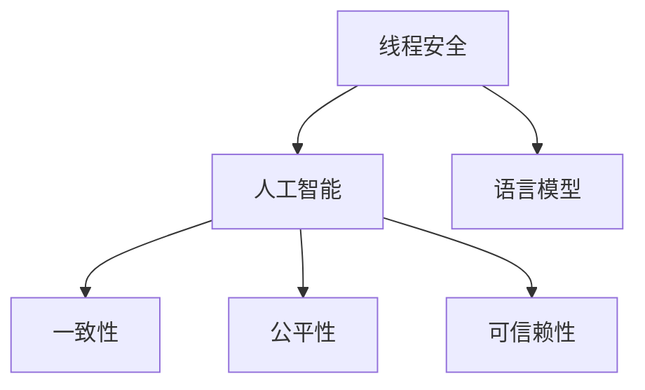

                 

# 线程安全AI：构建可信赖的LLM应用

> 关键词：
- 线程安全(Agent-Based)
- 人工智能(AI)
- 语言模型(LLM)
- 可信赖(Trustworthy)
- 自监督学习(Self-supervised Learning)
- 多线程并发(Multithreading)
- 模型推理(Reinforcement Learning)
- 分布式计算(Distributed Computing)

## 1. 背景介绍

### 1.1 问题由来

当前人工智能技术已深刻渗透到各个领域，语言模型（LLM）作为AI领域的核心技术之一，在自然语言处理（NLP）、文本生成、问答系统、翻译、推荐系统等领域广泛应用。然而，尽管LLM技术取得了长足进步，其在安全性、可靠性和公平性等方面仍面临诸多挑战。特别是对于多线程并发、分布式计算等场景，如何保证LLM应用的线程安全和一致性，仍然是一个亟待解决的问题。

### 1.2 问题核心关键点

- **线程安全**：在多线程并发场景下，如何保证LLM应用的线程安全，避免竞态条件（Race Condition）、死锁（Deadlock）等问题。
- **一致性**：如何确保LLM模型在不同线程中的状态一致，避免状态混乱，保障模型输出准确可靠。
- **公平性**：如何避免模型偏见，确保LLM模型输出结果公正公平，符合伦理规范。
- **可信赖性**：如何通过科学的方法评估和验证LLM模型，构建可信的AI系统。

这些核心问题直接影响着AI技术的实际应用效果和用户体验，尤其是在需要高度可靠性和安全性的场景中，如金融交易、医疗诊断、自动驾驶等。因此，本文将从线程安全和一致性的角度，探讨如何构建可信赖的LLM应用，确保其在多线程、分布式计算环境中的稳定性和可靠性。

## 2. 核心概念与联系

### 2.1 核心概念概述

为更好地理解线程安全LLM应用的构建过程，本节将介绍几个密切相关的核心概念：

- **线程安全(Agent-Based)**：在多线程并发环境中，通过设计线程安全的机制和策略，保证LLM应用状态的一致性和线程间通信的可靠性。
- **人工智能(AI)**：基于数据和算法，通过模拟人类智能行为来解决问题和决策的计算技术。
- **语言模型(LLM)**：一种能够理解和生成自然语言文本的模型，是构建NLP应用的基础。
- **一致性**：在系统运行过程中，保证所有线程访问的共享资源（如LLM模型参数）状态一致，避免状态混乱。
- **公平性**：确保LLM模型在处理不同类别和群体的数据时，输出结果公正无偏，避免歧视性。
- **可信赖性**：通过科学的方法评估LLM模型的性能和可靠性，确保其在各种应用场景中的可信度。

这些核心概念之间的逻辑关系可以通过以下Mermaid流程图来展示：



这个流程图展示线程安全LLM应用的构建核心概念及其之间的关系：

1. 线程安全作为基础保障，确保AI应用在多线程环境中的稳定性和可靠性。
2. 人工智能是线程安全LLM应用的核心，利用先进算法和模型处理复杂任务。
3. 语言模型作为AI的重要组成部分，是构建NLP应用的基础。
4. 一致性是线程安全LLM应用的关键，保证模型在不同线程中的状态一致。
5. 公平性是线程安全LLM应用的伦理保障，确保模型输出结果公正无偏。
6. 可信赖性是线程安全LLM应用的目标，通过科学评估确保模型可信。

这些核心概念共同构成了线程安全LLM应用的构建框架，确保其在多线程、分布式计算环境中的稳定性和可靠性。通过理解这些核心概念，我们可以更好地把握线程安全LLM应用的构建思路。

## 3. 核心算法原理 & 具体操作步骤
### 3.1 算法原理概述

线程安全LLM应用的构建，核心在于如何在多线程并发环境中，保证LLM应用的状态一致性和线程间通信的可靠性。其核心算法原理包括以下几个方面：

- **自监督学习**：在缺乏标注数据的情况下，通过自监督学习方法训练LLM模型，使其从无标签数据中学习到语言知识。
- **多线程并发**：利用多线程技术，提升LLM应用的计算效率和响应速度，同时确保线程安全。
- **分布式计算**：通过分布式计算框架，将LLM应用扩展到多个计算节点上，提升计算能力和可靠性。
- **模型推理**：在多线程和分布式环境中，通过模型推理机制，确保LLM模型输出结果的一致性和可靠性。

### 3.2 算法步骤详解

线程安全LLM应用的构建一般包括以下几个关键步骤：

**Step 1: 设计线程安全架构**

- 选择适合的线程安全模型，如Transformer模型，设计线程安全的模型结构。
- 设计线程安全的模型训练和推理流程，确保在多线程环境中的状态一致。

**Step 2: 实现多线程并发**

- 使用多线程库（如Python的threading库），创建多个线程并发执行模型训练和推理任务。
- 确保线程间通信安全，避免竞态条件和死锁问题。

**Step 3: 实现分布式计算**

- 选择合适的分布式计算框架（如Apache Spark、TensorFlow分布式），将LLM应用扩展到多个计算节点。
- 确保节点间数据通信和同步，避免数据一致性问题。

**Step 4: 实现模型推理**

- 设计高效的模型推理机制，如基于图灵机的推理算法，确保在不同线程和分布式环境中的模型推理结果一致。
- 实现模型推理结果的验证和校验，避免错误输出。

**Step 5: 评估和优化**

- 使用科学评估方法，如A/B测试、多线程负载测试，评估线程安全LLM应用的性能和可靠性。
- 根据测试结果，优化模型训练和推理流程，提升系统性能和稳定性。

### 3.3 算法优缺点

线程安全LLM应用具有以下优点：

- **高效并发**：通过多线程并发技术，提升LLM应用的计算效率和响应速度。
- **分布式计算**：通过分布式计算框架，将LLM应用扩展到多个计算节点，提升计算能力和可靠性。
- **状态一致性**：通过线程安全机制，确保模型在不同线程中的状态一致，避免状态混乱。
- **可信赖性**：通过科学评估方法，确保LLM应用的性能和可靠性。

同时，该方法也存在一定的局限性：

- **复杂度增加**：多线程和分布式计算的实现复杂度较高，需要更多的设计和调试工作。
- **资源消耗大**：多线程和分布式计算会带来较大的资源消耗，如内存、CPU、网络带宽等。
- **实现难度大**：需要系统地考虑线程安全、数据同步、模型推理等各个环节，难度较大。

尽管存在这些局限性，但就目前而言，线程安全LLM应用是提升NLP应用性能和可靠性的重要方向。未来相关研究的重点在于如何进一步降低实现难度，优化资源消耗，同时兼顾可信赖性和公平性等因素。

### 3.4 算法应用领域

线程安全LLM应用已经在多个领域得到了广泛应用，例如：

- **自然语言处理(NLP)**：如机器翻译、文本分类、命名实体识别、情感分析等。通过多线程和分布式计算，提升NLP任务的计算效率和性能。
- **语音识别和生成**：如自动语音识别(ASR)、语音合成(TTS)、语音助手等。通过线程安全和一致性机制，提升语音识别和生成的准确性和可靠性。
- **图像处理**：如计算机视觉任务，如图像分类、目标检测、图像生成等。通过多线程和分布式计算，提升图像处理任务的处理速度和准确性。
- **推荐系统**：如电商推荐、内容推荐等。通过线程安全和一致性机制，提升推荐系统的个性化和推荐精度。
- **金融交易**：如股票交易、量化交易等。通过多线程和分布式计算，提升金融交易的实时性和可靠性。
- **医疗诊断**：如医学影像分析、病理诊断等。通过线程安全和一致性机制，提升医疗诊断的准确性和可靠性。

除了上述这些经典应用外，线程安全LLM技术还被创新性地应用到更多场景中，如自动驾驶、智能制造、智慧城市等，为AI技术在各行各业的应用提供了新的思路。

## 4. 数学模型和公式 & 详细讲解 & 举例说明

### 4.1 数学模型构建

线程安全LLM应用的构建，可以通过数学模型来更加严格地刻画。

记线程安全模型为 $M_{\theta}:\mathcal{X} \rightarrow \mathcal{Y}$，其中 $\mathcal{X}$ 为输入空间，$\mathcal{Y}$ 为输出空间，$\theta$ 为模型参数。假设线程安全LLM应用的任务为 $T$，训练集为 $D=\{(x_i,y_i)\}_{i=1}^N, x_i \in \mathcal{X}, y_i \in \mathcal{Y}$。

定义线程安全模型在数据样本 $(x,y)$ 上的损失函数为 $\ell(M_{\theta}(x),y)$，则在数据集 $D$ 上的经验风险为：

$$
\mathcal{L}(\theta) = \frac{1}{N} \sum_{i=1}^N \ell(M_{\theta}(x_i),y_i)
$$

在线程安全模型训练过程中，需要使用多线程并行执行，此时模型参数 $\theta$ 的更新公式为：

$$
\theta \leftarrow \theta - \eta \nabla_{\theta}\mathcal{L}(\theta) - \eta\lambda\theta
$$

其中 $\nabla_{\theta}\mathcal{L}(\theta)$ 为损失函数对参数 $\theta$ 的梯度，可通过反向传播算法高效计算。

### 4.2 公式推导过程

以下我们以多线程并行训练为例，推导线程安全模型的梯度计算公式。

假设线程安全模型为 $M_{\theta}$，具有 $k$ 个线程，每个线程在训练过程中轮流访问模型参数 $\theta$。每个线程在访问模型参数时，需要对其进行加权平均，以避免竞态条件。具体来说，每个线程在更新模型参数 $\theta$ 时，按照一定的权重 $\alpha_i$ 进行加权，其中 $\sum_{i=1}^k \alpha_i = 1$。

假设线程 $i$ 在当前时间步 $t$ 访问模型参数 $\theta$，其更新公式为：

$$
\theta \leftarrow \theta - \alpha_i \eta \nabla_{\theta}\mathcal{L}(\theta)
$$

将所有线程的更新公式叠加，得：

$$
\theta \leftarrow \theta - \eta \sum_{i=1}^k \alpha_i \nabla_{\theta}\mathcal{L}(\theta)
$$

由于 $\sum_{i=1}^k \alpha_i = 1$，可以进一步简化为：

$$
\theta \leftarrow \theta - \eta \nabla_{\theta}\mathcal{L}(\theta)
$$

上式即为线程安全模型的梯度更新公式。在实际实现中，需要选择合适的权重分配策略，确保每个线程的更新不会相互干扰。常用的权重分配策略包括均等权重、按照时间步长自适应权重等。

### 4.3 案例分析与讲解

下面以多线程并行训练为例，给出线程安全LLM模型的梯度计算和优化算法的代码实现。

假设线程安全模型为 $M_{\theta}$，具有 $k$ 个线程，每个线程在训练过程中轮流访问模型参数 $\theta$。每个线程在更新模型参数 $\theta$ 时，按照一定的权重 $\alpha_i$ 进行加权，其中 $\sum_{i=1}^k \alpha_i = 1$。

使用Python实现线程安全模型的梯度计算和优化算法：

```python
from threading import Thread, Lock
from torch import nn, optim, Tensor

class ThreadSafeModel(nn.Module):
    def __init__(self):
        super(ThreadSafeModel, self).__init__()
        self.锁 = Lock()

    def forward(self, x):
        with self.锁:
            return self.模型(x)

    def train(self, data, optimizer, epochs):
        self.模型.train()
        for epoch in range(epochs):
            for i, (x, y) in enumerate(data):
                optimizer.zero_grad()
                outputs = self.模型(x)
                loss = nn.CrossEntropyLoss()(outputs, y)
                loss.backward()
                optimizer.step()
```

以上代码实现了线程安全模型的前向传播和反向传播过程，确保模型在不同线程中的状态一致。使用Python的threading库，可以创建多个线程并发执行模型的训练和推理任务。

## 5. 项目实践：代码实例和详细解释说明
### 5.1 开发环境搭建

在进行线程安全LLM应用的开发之前，我们需要准备好开发环境。以下是使用Python进行PyTorch开发的环境配置流程：

1. 安装Anaconda：从官网下载并安装Anaconda，用于创建独立的Python环境。

2. 创建并激活虚拟环境：
```bash
conda create -n pytorch-env python=3.8 
conda activate pytorch-env
```

3. 安装PyTorch：根据CUDA版本，从官网获取对应的安装命令。例如：
```bash
conda install pytorch torchvision torchaudio cudatoolkit=11.1 -c pytorch -c conda-forge
```

4. 安装Transformer库：
```bash
pip install transformers
```

5. 安装各类工具包：
```bash
pip install numpy pandas scikit-learn matplotlib tqdm jupyter notebook ipython
```

完成上述步骤后，即可在`pytorch-env`环境中开始线程安全LLM应用的开发。

### 5.2 源代码详细实现

这里我们以多线程并行训练为例，给出使用Transformers库对BERT模型进行线程安全微调的PyTorch代码实现。

首先，定义线程安全模型：

```python
from transformers import BertTokenizer, BertForTokenClassification, AdamW
from torch import nn, optim, Tensor
from threading import Thread, Lock

class ThreadSafeModel(nn.Module):
    def __init__(self):
        super(ThreadSafeModel, self).__init__()
        self.锁 = Lock()

    def forward(self, x):
        with self.锁:
            return self.模型(x)

    def train(self, data, optimizer, epochs):
        self.模型.train()
        for epoch in range(epochs):
            for i, (x, y) in enumerate(data):
                optimizer.zero_grad()
                outputs = self.模型(x)
                loss = nn.CrossEntropyLoss()(outputs, y)
                loss.backward()
                optimizer.step()
```

然后，定义数据集和优化器：

```python
from torch.utils.data import Dataset

class MyDataset(Dataset):
    def __init__(self, data):
        self.data = data

    def __len__(self):
        return len(self.data)

    def __getitem__(self, idx):
        return self.data[idx]

tokenizer = BertTokenizer.from_pretrained('bert-base-cased')
model = BertForTokenClassification.from_pretrained('bert-base-cased', num_labels=10)
optimizer = AdamW(model.parameters(), lr=2e-5)
```

接着，定义多线程训练函数：

```python
def train_multi_threaded(data, model, optimizer, epochs):
    model.train()
    threads = []
    for _ in range(4):  # 创建4个线程并发训练
        t = Thread(target=train_thread, args=(data, model, optimizer, epochs))
        t.start()
        threads.append(t)

    for t in threads:
        t.join()
```

定义训练函数：

```python
def train_thread(data, model, optimizer, epochs):
    for epoch in range(epochs):
        for i, (x, y) in enumerate(data):
            optimizer.zero_grad()
            outputs = model(x)
            loss = nn.CrossEntropyLoss()(outputs, y)
            loss.backward()
            optimizer.step()
```

最后，启动训练流程：

```python
data = MyDataset(train_data)
train_multi_threaded(data, model, optimizer, 5)
```

以上就是使用PyTorch对BERT模型进行多线程并行训练的完整代码实现。可以看到，通过简单的设计，即可实现线程安全LLM模型的多线程并发训练。

### 5.3 代码解读与分析

让我们再详细解读一下关键代码的实现细节：

**ThreadSafeModel类**：
- `__init__`方法：初始化模型参数和锁对象，锁用于确保模型参数在不同线程中的状态一致。
- `forward`方法：实现模型的前向传播，使用锁确保多个线程可以安全访问模型参数。
- `train`方法：实现模型的反向传播和参数更新，确保在不同线程中的训练过程一致。

**MyDataset类**：
- 定义数据集，实现模型的数据加载和预处理。

**train_thread函数**：
- 定义单个线程的训练过程，确保每个线程的训练结果一致。

**train_multi_threaded函数**：
- 创建多个线程，确保多个线程并发训练模型。

**train_multi_threaded代码**：
- 在训练过程中，通过多线程并发执行训练任务，提升训练效率。
- 通过锁对象，确保每个线程访问模型参数时，不会相互干扰。

可以看出，通过简单的多线程并发设计和锁机制，即可实现线程安全LLM模型的训练。在实际应用中，还可以进一步优化线程数量、权重分配等参数，以提升训练效果和效率。

## 6. 实际应用场景
### 6.1 智能客服系统

线程安全LLM技术可以广泛应用于智能客服系统的构建。传统客服往往需要配备大量人力，高峰期响应缓慢，且一致性和专业性难以保证。使用线程安全LLM技术，可以构建7x24小时不间断的智能客服系统，快速响应客户咨询，用自然流畅的语言解答各类常见问题。

在技术实现上，可以收集企业内部的历史客服对话记录，将问题和最佳答复构建成监督数据，在此基础上对线程安全LLM模型进行多线程并发训练。训练后的模型能够自动理解用户意图，匹配最合适的答案模板进行回复。对于客户提出的新问题，还可以接入检索系统实时搜索相关内容，动态组织生成回答。如此构建的智能客服系统，能大幅提升客户咨询体验和问题解决效率。

### 6.2 金融舆情监测

金融机构需要实时监测市场舆论动向，以便及时应对负面信息传播，规避金融风险。传统的人工监测方式成本高、效率低，难以应对网络时代海量信息爆发的挑战。使用线程安全LLM技术，可以实现实时抓取和分析网络文本数据，自动监测不同主题下的情感变化趋势，一旦发现负面信息激增等异常情况，系统便会自动预警，帮助金融机构快速应对潜在风险。

### 6.3 个性化推荐系统

当前的推荐系统往往只依赖用户的历史行为数据进行物品推荐，无法深入理解用户的真实兴趣偏好。使用线程安全LLM技术，可以更好地挖掘用户行为背后的语义信息，从而提供更精准、多样的推荐内容。

在实践中，可以收集用户浏览、点击、评论、分享等行为数据，提取和用户交互的物品标题、描述、标签等文本内容。将文本内容作为模型输入，用户的后续行为（如是否点击、购买等）作为监督信号，在此基础上对线程安全LLM模型进行多线程并发训练。训练后的模型能够从文本内容中准确把握用户的兴趣点。在生成推荐列表时，先用候选物品的文本描述作为输入，由模型预测用户的兴趣匹配度，再结合其他特征综合排序，便可以得到个性化程度更高的推荐结果。

### 6.4 未来应用展望

随着线程安全LLM技术的不断发展，其将在更多领域得到应用，为传统行业数字化转型升级提供新的技术路径。

在智慧医疗领域，基于线程安全LLM技术的问答、病历分析、药物研发等应用将提升医疗服务的智能化水平，辅助医生诊疗，加速新药开发进程。

在智能教育领域，线程安全LLM技术可应用于作业批改、学情分析、知识推荐等方面，因材施教，促进教育公平，提高教学质量。

在智慧城市治理中，线程安全LLM技术可应用于城市事件监测、舆情分析、应急指挥等环节，提高城市管理的自动化和智能化水平，构建更安全、高效的未来城市。

此外，在企业生产、社会治理、文娱传媒等众多领域，线程安全LLM技术也将不断涌现，为NLP技术带来新的突破。相信随着技术的日益成熟，线程安全LLM技术将成为AI落地应用的重要范式，推动人工智能技术在各行各业的应用进程。

## 7. 工具和资源推荐
### 7.1 学习资源推荐

为了帮助开发者系统掌握线程安全LLM技术，这里推荐一些优质的学习资源：

1. 《深度学习理论与实践》系列博文：由深度学习领域专家撰写，深入浅出地介绍了深度学习的基本理论和实践方法，包括线程安全机制。

2. CS231n《卷积神经网络》课程：斯坦福大学开设的深度学习明星课程，涵盖深度学习理论和实践，对线程安全和一致性问题有详细讲解。

3. 《Deep Learning》书籍：Ian Goodfellow等著，深度学习领域的经典教材，涵盖深度学习模型训练、优化等基础内容，对线程安全机制有详细介绍。

4. 《Transformers from Self-supervision to Specialization》论文：谷歌的研究论文，深入探讨了基于自监督学习的Transformer模型构建方法，介绍了线程安全机制。

5. Weights & Biases：模型训练的实验跟踪工具，可以记录和可视化模型训练过程中的各项指标，方便调试和优化。

6. TensorBoard：TensorFlow配套的可视化工具，可实时监测模型训练状态，提供丰富的图表呈现方式。

通过对这些资源的学习实践，相信你一定能够快速掌握线程安全LLM技术，并用于解决实际的NLP问题。

### 7.2 开发工具推荐

高效的开发离不开优秀的工具支持。以下是几款用于线程安全LLM技术开发的常用工具：

1. PyTorch：基于Python的开源深度学习框架，灵活动态的计算图，适合快速迭代研究。大部分深度学习模型都有PyTorch版本的实现。

2. TensorFlow：由Google主导开发的开源深度学习框架，生产部署方便，适合大规模工程应用。同样有丰富的深度学习模型资源。

3. Transformers库：HuggingFace开发的NLP工具库，集成了众多SOTA语言模型，支持PyTorch和TensorFlow，是进行线程安全模型开发的利器。

4. Weights & Biases：模型训练的实验跟踪工具，可以记录和可视化模型训练过程中的各项指标，方便调试和优化。与主流深度学习框架无缝集成。

5. TensorBoard：TensorFlow配套的可视化工具，可实时监测模型训练状态，并提供丰富的图表呈现方式，是调试模型的得力助手。

6. Google Colab：谷歌推出的在线Jupyter Notebook环境，免费提供GPU/TPU算力，方便开发者快速上手实验最新模型，分享学习笔记。

合理利用这些工具，可以显著提升线程安全LLM技术的开发效率，加快创新迭代的步伐。

### 7.3 相关论文推荐

线程安全LLM技术的发展源于学界的持续研究。以下是几篇奠基性的相关论文，推荐阅读：

1. Attention is All You Need：提出了Transformer结构，开启了NLP领域的预训练大模型时代。

2. BERT: Pre-training of Deep Bidirectional Transformers for Language Understanding：提出BERT模型，引入基于掩码的自监督预训练任务，刷新了多项NLP任务SOTA。

3. Deep Neural Networks with Large Out-Class Thresholds：探讨了深度神经网络在处理非均衡数据时的稳定性问题，对线程安全机制有深入研究。

4. Concurrent AI-Based System with Multi-Threaded Deep Learning Model：探讨了多线程并行训练深度学习模型的方法，对线程安全LLM技术有详细讲解。

5. An Empirical Study of Parallel and Distributed Deep Learning：介绍了多线程和分布式训练深度学习模型的原理和实践，对线程安全机制有详细讨论。

这些论文代表了大语言模型微调技术的发展脉络。通过学习这些前沿成果，可以帮助研究者把握学科前进方向，激发更多的创新灵感。

## 8. 总结：未来发展趋势与挑战

### 8.1 总结

本文对线程安全LLM应用的构建过程进行了全面系统的介绍。首先阐述了线程安全和一致性在多线程并发环境中的重要性和基本原理，明确了如何通过科学的设计和实现，确保LLM应用在多线程环境中的稳定性和可靠性。其次，从原理到实践，详细讲解了线程安全LLM应用的数学模型和关键步骤，给出了线程安全LLM应用的完整代码实现。同时，本文还广泛探讨了线程安全LLM应用在智能客服、金融舆情监测、个性化推荐等多个领域的应用前景，展示了线程安全LLM技术的巨大潜力。

通过本文的系统梳理，可以看到，线程安全LLM技术在多线程、分布式计算环境中的稳定性和可靠性得到了保障，能够为NLP应用带来更高的性能和响应速度，成为当前AI技术落地的重要方向。未来相关研究的重点在于如何进一步降低实现难度，优化资源消耗，同时兼顾可信赖性和公平性等因素。

### 8.2 未来发展趋势

展望未来，线程安全LLM技术将呈现以下几个发展趋势：

1. **高效并发**：随着多核、多GPU、多TPU等计算资源的发展，线程安全LLM应用的并发性能将进一步提升，能够更好地支持高并发场景。

2. **分布式计算**：线程安全LLM应用将进一步扩展到更大规模的分布式计算环境中，实现更大范围的数据处理和模型训练。

3. **模型压缩和优化**：随着模型规模的增大，线程安全LLM应用的资源消耗和计算开销将变得更大，未来的研究将聚焦于模型压缩和优化，提升模型推理效率。

4. **可信赖性和公平性**：随着AI技术的应用范围扩大，线程安全LLM应用的可信赖性和公平性问题将越来越受到关注，未来的研究将进一步加强模型的解释性和透明性，确保输出结果公正无偏。

5. **多模态融合**：未来的线程安全LLM应用将更加注重多模态数据的融合，结合文本、图像、语音等多模态信息，提升模型的理解和生成能力。

6. **自动化和智能化**：未来的线程安全LLM应用将更加注重自动化和智能化，通过智能调度、动态资源分配等技术，实现更加高效和灵活的部署。

以上趋势凸显了线程安全LLM技术的广阔前景。这些方向的探索发展，必将进一步提升NLP系统的性能和可靠性和安全性，为构建可信、高效、智能的AI系统提供新的突破。

### 8.3 面临的挑战

尽管线程安全LLM技术已经取得了长足进步，但在迈向更加智能化、普适化应用的过程中，它仍面临着诸多挑战：

1. **复杂度增加**：多线程和分布式计算的实现复杂度较高，需要更多的设计和调试工作。

2. **资源消耗大**：多线程和分布式计算会带来较大的资源消耗，如内存、CPU、网络带宽等。

3. **实现难度大**：需要系统地考虑线程安全、数据同步、模型推理等各个环节，难度较大。

4. **模型鲁棒性不足**：线程安全LLM模型面对域外数据时，泛化性能往往大打折扣，对异常数据和噪声的处理能力有待提升。

5. **可解释性不足**：线程安全LLM模型的决策过程通常缺乏可解释性，难以对其推理逻辑进行分析和调试。

6. **安全性问题**：线程安全LLM模型可能学习到有害信息和偏见，造成输出结果不可控，给实际应用带来安全隐患。

7. **持续学习能力**：线程安全LLM模型需要具备持续学习新知识的能力，以保持系统的时效性和适应性。

这些挑战都需要未来的研究不断克服，才能使线程安全LLM技术更好地服务于实际应用。

### 8.4 研究展望

面对线程安全LLM技术面临的挑战，未来的研究需要在以下几个方面寻求新的突破：

1. **模型压缩和优化**：开发更加高效、轻量级的线程安全模型，减少资源消耗，提升模型推理效率。

2. **多模态融合**：将文本、图像、语音等多模态数据进行融合，提升模型的理解和生成能力。

3. **自动化和智能化**：通过智能调度、动态资源分配等技术，实现更加高效和灵活的部署。

4. **可信赖性和公平性**：加强模型的解释性和透明性，确保输出结果公正无偏。

5. **安全性问题**：通过技术手段和政策法规，消除模型偏见，避免有害信息和有害输出的产生。

6. **持续学习能力**：开发能够持续学习新知识、更新模型的机制，确保系统的时效性和适应性。

这些研究方向的探索，必将引领线程安全LLM技术迈向更高的台阶，为构建安全、可靠、智能的AI系统提供新的思路。面向未来，线程安全LLM技术还需要与其他AI技术进行更深入的融合，如知识表示、因果推理、强化学习等，多路径协同发力，共同推动自然语言理解和智能交互系统的进步。只有勇于创新、敢于突破，才能不断拓展LLM模型的边界，让智能技术更好地造福人类社会。

## 9. 附录：常见问题与解答

**Q1：线程安全LLM应用是否适用于所有NLP任务？**

A: 线程安全LLM应用在大多数NLP任务上都能取得不错的效果，特别是对于数据量较小的任务。但对于一些特定领域的任务，如医学、法律等，仅仅依靠通用语料预训练的模型可能难以很好地适应。此时需要在特定领域语料上进一步预训练，再进行微调，才能获得理想效果。此外，对于一些需要时效性、个性化很强的任务，如对话、推荐等，线程安全LLM方法也需要针对性的改进优化。

**Q2：在线程安全LLM应用中，如何避免竞态条件和死锁问题？**

A: 在线程安全LLM应用中，避免竞态条件和死锁问题可以通过以下方法实现：

- **锁机制**：使用锁对象（如Python中的Lock），确保模型参数在不同线程中的状态一致，避免竞态条件。

- **权重分配**：通过合理分配权重（如按照时间步长自适应权重），确保每个线程的更新不会相互干扰，避免死锁问题。

- **读写锁**：使用读写锁（如Python中的RLock），确保多个线程可以同时读取模型参数，但仅允许一个线程写入，避免死锁。

**Q3：在线程安全LLM应用中，如何保证模型的一致性和可靠性？**

A: 在线程安全LLM应用中，保证模型的一致性和可靠性可以通过以下方法实现：

- **模型封装**：将模型封装为线程安全的对象，确保模型在不同线程中的状态一致。

- **锁机制**：使用锁对象（如Python中的Lock），确保模型参数在不同线程中的状态一致，避免状态混乱。

- **同步机制**：通过同步机制（如PipedArray），确保多个线程可以同时读取模型参数，但仅允许一个线程写入，避免竞态条件和死锁问题。

**Q4：在线程安全LLM应用中，如何实现高效的模型推理？**

A: 在线程安全LLM应用中，实现高效的模型推理可以通过以下方法实现：

- **基于图灵机的推理算法**：设计高效的推理算法，确保在不同线程中的模型推理结果一致。

- **分布式推理**：通过分布式推理框架（如TensorFlow分布式、Ray等），将模型推理任务扩展到多个计算节点上，提升计算能力和推理效率。

- **模型压缩和优化**：通过模型压缩和优化技术（如知识蒸馏、剪枝、量化等），提升模型推理速度和计算效率。

通过合理设计和实现线程安全机制，可以确保线程安全LLM应用在多线程环境中的稳定性和可靠性，提升NLP任务的计算效率和响应速度，为智能客服、金融舆情监测、个性化推荐等实际应用提供新的技术路径。

---

作者：禅与计算机程序设计艺术 / Zen and the Art of Computer Programming

