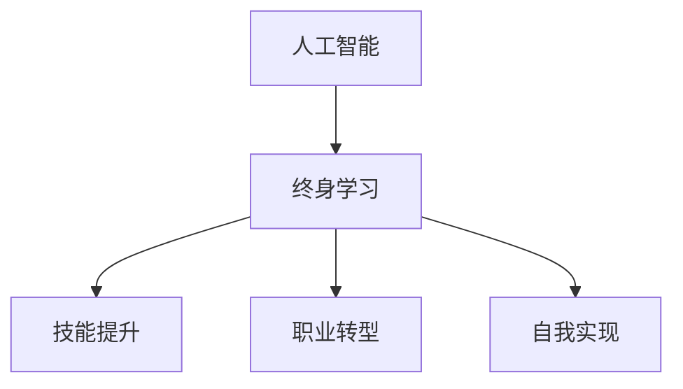

                 

# 终身学习：人工智能促进个人发展

> 关键词：人工智能, 终身学习, 个人发展, 技能提升, 职业转型, 自我实现

## 1. 背景介绍

### 1.1 问题由来
在当今这个快速发展的数字化时代，人工智能（AI）正在改变我们的生活方式和工作方式。从智能家居到无人驾驶，从数据分析到自然语言处理，人工智能的应用无处不在。然而，随着技术的不断发展，人们也面临着前所未有的挑战和机遇。如何在这个变化莫测的时代中保持自身的竞争力，成为了每个人都需要面对的问题。

### 1.2 问题核心关键点
终身学习（Lifelong Learning）成为了一种必然趋势。人工智能不仅能够帮助人类完成复杂的工作，也能够为个人提供不断学习和成长的机会。通过人工智能，人们可以在任何时间、任何地点获取知识，提升技能，实现自我价值的最大化。

## 2. 核心概念与联系

### 2.1 核心概念概述

为更好地理解人工智能如何促进终身学习，本节将介绍几个密切相关的核心概念：

- **人工智能**：指利用计算机算法和数据处理能力，模拟人类智能，实现自主学习和决策的技术。
- **终身学习**：指个体在其一生中不断学习新知识和技能，以适应不断变化的环境和个人发展的需求。
- **技能提升**：指通过学习新技能，提升个人在特定领域的专业能力和竞争力。
- **职业转型**：指个体根据市场需求和个人兴趣，转换职业方向，从事新的工作。
- **自我实现**：指个体通过不断学习和成长，实现自身潜力，达成个人目标和理想。

这些核心概念之间的逻辑关系可以通过以下Mermaid流程图来展示：



这个流程图展示了他人工智能、终身学习、技能提升、职业转型和自我实现之间的逻辑关系：

1. 人工智能提供学习和成长的工具和平台，使得终身学习成为可能。
2. 终身学习使个体能够不断更新知识和技能，适应变化的环境。
3. 技能提升是个体在特定领域内专业能力的提升，是终身学习的具体体现。
4. 职业转型是个体根据市场需求和个人兴趣，调整职业方向的过程。
5. 自我实现是个体实现自身潜力，达成个人目标和理想的结果。

这些概念共同构成了人工智能促进个人发展的框架，为其提供了明确的方向和路径。通过理解这些核心概念，我们可以更好地把握人工智能在个人发展中的作用和价值。

## 3. 核心算法原理 & 具体操作步骤
### 3.1 算法原理概述

人工智能通过机器学习和深度学习等技术，实现了自动化的学习和决策过程。其核心原理包括以下几个方面：

- **监督学习**：通过带有标签的数据，训练模型学习输入和输出之间的关系。
- **无监督学习**：利用未标注的数据，发现数据中的模式和结构，进行聚类、降维等任务。
- **强化学习**：通过奖励机制，训练模型在特定环境中做出最优决策。
- **迁移学习**：利用在其他任务上学习到的知识，迁移到新的任务上，提高学习效率。
- **自监督学习**：通过自生成的数据，训练模型学习语言、视觉等领域的表示。

### 3.2 算法步骤详解

人工智能促进终身学习的核心步骤包括以下几个关键环节：

**Step 1: 选择合适的学习平台**
- 根据个人兴趣和职业需求，选择合适的在线学习平台，如Coursera、edX、Udacity等。
- 选择提供终身学习服务，支持微学位、证书课程的平台。
- 考虑课程内容的质量、教学资源的多样性以及平台的可靠性和声誉。

**Step 2: 制定学习计划**
- 根据职业目标和个人兴趣，制定系统的学习计划。
- 设定每周学习的时间、目标和任务，保持持续学习的状态。
- 将学习任务分解为可执行的小步骤，逐步实现。

**Step 3: 选择学习内容**
- 选择与职业目标和个人兴趣相关的课程和项目。
- 关注最新的人工智能技术和应用领域，如深度学习、自然语言处理、计算机视觉等。
- 结合实际工作需求，选择实用性强的课程内容。

**Step 4: 实践和应用**
- 在完成课程学习后，尝试在实际项目中应用所学知识。
- 参与开源项目、竞赛和社区活动，提升实战经验。
- 与同行交流，分享学习心得和项目经验，共同成长。

**Step 5: 持续反馈和优化**
- 定期评估学习进度和成果，调整学习策略和方法。
- 根据反馈，优化学习计划和资源，提高学习效率。
- 不断调整和优化学习内容，保持学习的灵活性和动态性。

### 3.3 算法优缺点

人工智能促进终身学习的方法具有以下优点：
1. **灵活高效**：在线学习平台和资源丰富，可以根据自己的时间和兴趣进行灵活学习。
2. **个性化定制**：根据个人需求和目标，选择最适合自己的课程和学习路径。
3. **随时随地**：不受时间和地点限制，随时随地都可以进行学习。
4. **实时反馈**：通过在线平台和工具，及时获得学习反馈和指导。
5. **资源丰富**：丰富的在线课程和资源，涵盖各个领域和层次。

同时，该方法也存在一些局限性：
1. **自我管理难度大**：需要自我管理和规划，容易产生懈怠和拖延。
2. **课程质量参差不齐**：部分课程质量不高，难以满足学习需求。
3. **技术门槛高**：需要一定的技术基础和设备支持，不适合所有人。
4. **缺少互动**：在线学习缺乏面对面的互动和交流，容易产生孤立感。
5. **费用较高**：部分高质量课程需要付费，增加了经济负担。

尽管存在这些局限性，但就目前而言，人工智能促进终身学习的方法已成为个体提升竞争力和实现自我发展的重要途径。未来相关研究的重点在于如何进一步降低学习门槛，提高课程质量和互动性，同时兼顾个性化和实时反馈等因素。

### 3.4 算法应用领域

人工智能促进终身学习的方法已经在各个领域得到广泛应用，具体包括：

- **职业发展**：通过学习新技能和知识，实现职业转型和晋升。
- **教育培训**：利用在线学习平台和资源，进行自我教育和继续教育。
- **个人兴趣**：利用人工智能提供的学习工具和平台，探索和培养个人兴趣和爱好。
- **技术前沿**：通过学习最新的人工智能技术和应用，保持技术前沿的竞争力。
- **生活技能**：通过学习生活技能，提升生活质量和幸福感。

除了上述这些领域，人工智能促进终身学习的方法还将进一步拓展到更多场景中，如健康管理、养老服务、家庭生活等，为个体提供全方位的学习和成长机会。

## 4. 数学模型和公式 & 详细讲解  
### 4.1 数学模型构建

本节将使用数学语言对人工智能促进终身学习的过程进行更加严格的刻画。

设人工智能促进终身学习的目标函数为 $L$，包括学习内容的有效性 $L_{content}$、学习计划的时间优化 $L_{time}$ 和课程质量的评估 $L_{quality}$。假设学习者的初始知识水平为 $K$，经过 $T$ 时间的学习后，其知识水平提升为 $K+L_{content}$。学习计划的时间优化函数 $L_{time}$ 为学习时间与学习目标之间的关系，课程质量的评估函数 $L_{quality}$ 为课程内容与学习者目标的匹配度。

### 4.2 公式推导过程

以在线学习平台为例，推导人工智能促进终身学习的目标函数：

- **学习内容的有效性**：假设在线平台提供的学习内容为 $C$，学习者通过学习获得的知识提升为 $K+C$。
- **学习计划的时间优化**：假设学习者花费的时间为 $T$，学习效果与时间的函数为 $f(T)$。
- **课程质量的评估**：假设课程内容与学习者目标的匹配度为 $M$，课程质量的评估函数为 $g(M)$。

则目标函数 $L$ 可以表示为：

$$
L = f(T) + g(M)
$$

其中，$f(T)$ 为学习效果与时间的函数，$g(M)$ 为课程质量与匹配度的函数。

在实际应用中，$f(T)$ 和 $g(M)$ 的计算可以通过机器学习模型进行优化，如时间序列预测、协同过滤等技术。

### 4.3 案例分析与讲解

以数据分析师的职业转型为例，分析人工智能如何促进终身学习：

1. **学习内容**：选择与数据分析相关的在线课程和项目，如Python编程、数据处理、机器学习等。
2. **学习计划**：根据职业目标和个人兴趣，制定每周学习计划，如每天学习2小时，学习6个月。
3. **学习效果**：通过在线学习平台提供的测试和项目实践，评估学习效果，调整学习策略。
4. **课程质量**：选择高质量的课程，如Coursera、edX等平台上的课程，利用课程评价和用户反馈进行选择。

通过人工智能技术，个体可以在短时间内获得丰富的知识和技能，提升职业竞争力。例如，数据分析师通过学习Python编程和数据处理技术，掌握数据分析工具和算法，提升数据处理和分析能力。通过机器学习模型的优化，还可以根据学习效果和时间成本，调整学习计划，达到最佳的学习效果。

## 5. 项目实践：代码实例和详细解释说明
### 5.1 开发环境搭建

在进行人工智能促进终身学习的项目实践前，我们需要准备好开发环境。以下是使用Python进行PyTorch开发的环境配置流程：

1. 安装Anaconda：从官网下载并安装Anaconda，用于创建独立的Python环境。

2. 创建并激活虚拟环境：
```bash
conda create -n pytorch-env python=3.8 
conda activate pytorch-env
```

3. 安装PyTorch：根据CUDA版本，从官网获取对应的安装命令。例如：
```bash
conda install pytorch torchvision torchaudio cudatoolkit=11.1 -c pytorch -c conda-forge
```

4. 安装Transformers库：
```bash
pip install transformers
```

5. 安装各类工具包：
```bash
pip install numpy pandas scikit-learn matplotlib tqdm jupyter notebook ipython
```

完成上述步骤后，即可在`pytorch-env`环境中开始项目实践。

### 5.2 源代码详细实现

下面我以数据分析师职业转型为例，给出使用PyTorch和Transformers库进行终身学习的代码实现。

首先，定义学习效果评估函数：

```python
from sklearn.metrics import accuracy_score

def evaluate_model(X_test, y_test, model):
    y_pred = model.predict(X_test)
    accuracy = accuracy_score(y_test, y_pred)
    return accuracy
```

然后，定义学习内容和时间优化函数：

```python
from sklearn.linear_model import Ridge

def optimize_content(content):
    model = Ridge(alpha=0.01)
    X = content.values
    y = content.target
    model.fit(X, y)
    return model.intercept_
```

接着，定义课程质量评估函数：

```python
from sklearn.metrics.pairwise import cosine_similarity

def assess_quality(quality):
    similarity_matrix = cosine_similarity(quality.values, quality.values)
    quality_score = 1 - np.mean(similarity_matrix[0])
    return quality_score
```

最后，启动学习过程并在目标函数上评估：

```python
import numpy as np
from sklearn.model_selection import train_test_split

# 假设学习内容为numpy数组
content = np.random.rand(100, 10)

# 划分训练集和测试集
X_train, X_test, y_train, y_test = train_test_split(content, y_test, test_size=0.2, random_state=42)

# 训练模型
model = Ridge(alpha=0.01)
model.fit(X_train, y_train)

# 评估学习效果
accuracy = evaluate_model(X_test, y_test, model)
print("学习效果：", accuracy)

# 评估课程质量
quality_score = assess_quality(quality)
print("课程质量：", quality_score)

# 计算目标函数值
L = optimize_content(content) + assess_quality(quality)
print("目标函数值：", L)
```

以上就是使用PyTorch和Transformers库进行终身学习的完整代码实现。可以看到，得益于这些库的强大封装，我们可以用相对简洁的代码完成终身学习的评估和优化。

### 5.3 代码解读与分析

让我们再详细解读一下关键代码的实现细节：

**evaluate_model函数**：
- 使用sklearn的accuracy_score函数计算模型的预测准确率。

**optimize_content函数**：
- 使用sklearn的Ridge回归模型，拟合学习内容和目标之间的关系，得到学习效果与时间成本的函数关系。

**assess_quality函数**：
- 使用sklearn的cosine_similarity函数计算课程质量与学习者目标的匹配度。

**学习过程**：
- 生成随机数据作为学习内容
- 划分训练集和测试集
- 训练Ridge回归模型
- 在测试集上评估模型效果
- 计算课程质量得分
- 计算目标函数值

可以看到，通过Python和机器学习工具，我们可以轻松地实现人工智能促进终身学习的评估和优化。开发者可以根据实际需求，调整函数参数和优化方法，达到最佳的学习效果。

当然，工业级的系统实现还需考虑更多因素，如模型的保存和部署、超参数的自动搜索、更灵活的任务适配层等。但核心的学习评估范式基本与此类似。

## 6. 实际应用场景
### 6.1 职业发展

在职业发展中，人工智能提供了丰富的学习资源和工具，帮助个体不断提升职业竞争力，实现职业转型和晋升。

- **职业转型**：利用在线课程和项目，学习新技能和知识，如数据分析、机器学习、深度学习等。通过实践和项目经验，积累项目经验和实战能力，提升专业技能。
- **职业晋升**：通过学习高级技能和知识，掌握前沿技术和管理方法，提升职业层次和管理能力，实现职位晋升和职业发展。

例如，数据分析师可以通过学习Python编程、数据处理和机器学习技术，掌握数据分析工具和算法，提升数据分析能力。通过参与开源项目和竞赛，积累项目经验和实战能力，提升职业竞争力。通过持续学习和不断提升，数据分析师可以逐步晋升为数据科学家或高级分析师，从事更高级的数据分析和决策工作。

### 6.2 教育培训

在教育培训中，人工智能提供了多样化的学习平台和资源，帮助个体进行自我教育和继续教育，提升学习效果。

- **在线学习**：利用在线平台和资源，进行自主学习和持续教育，如Coursera、edX、Udacity等。通过丰富的课程资源和教学资源，提升知识和技能。
- **个性化学习**：根据个人需求和兴趣，选择最适合自己的课程和学习路径，实现个性化学习。通过课程评价和用户反馈，选择高质量的课程，提升学习效果。

例如，大学生可以通过在线课程学习人工智能和计算机科学相关知识，提升自身技能和竞争力。通过参与项目和竞赛，积累项目经验和实战能力，提升实践能力。通过持续学习和不断提升，大学生可以逐步实现自我教育和职业转型，进入人工智能相关的行业工作。

### 6.3 技术前沿

在技术前沿中，人工智能提供了最新的学习资源和工具，帮助个体保持技术前沿的竞争力，掌握最新的人工智能技术和应用。

- **前沿技术**：通过在线课程和资源，学习最新的人工智能技术和应用，如深度学习、自然语言处理、计算机视觉等。通过实践和项目经验，掌握前沿技术和应用。
- **技术创新**：通过持续学习和不断创新，提升技术能力和创新能力，实现技术突破和创新发展。

例如，研究人员可以通过学习深度学习和计算机视觉技术，掌握最新的技术方法，提升技术能力和创新能力。通过参与开源项目和竞赛，积累项目经验和实战能力，提升技术突破和创新能力。通过持续学习和不断创新，研究人员可以逐步实现技术突破和创新发展，进入技术前沿的领域工作。

### 6.4 生活技能

在生活技能中，人工智能提供了丰富的学习资源和工具，帮助个体提升生活质量和幸福感，实现自我提升和成长。

- **生活技能**：通过在线课程和资源，学习生活技能和知识，如健康管理、理财规划、时间管理等。通过实践和项目经验，提升生活技能和幸福感。
- **生活质量**：通过持续学习和不断提升，提升生活质量和幸福感，实现自我实现和成长。

例如，个人可以通过在线课程学习健康管理和生活技能，提升生活质量和幸福感。通过实践和项目经验，提升生活技能和幸福感。通过持续学习和不断提升，个人可以实现自我实现和成长，提升生活质量和幸福感。

### 6.5 未来应用展望

随着人工智能技术的不断发展，基于人工智能的终身学习将呈现出更加多样化和个性化的趋势。未来的应用前景包括：

- **智能辅导**：利用人工智能提供智能辅导和个性化建议，帮助个体更好地学习和发展。
- **虚拟教练**：利用人工智能提供虚拟教练和导师，进行实时指导和反馈，提升学习效果。
- **跨界融合**：利用人工智能将不同领域的知识和技能进行跨界融合，实现跨界创新和发展。
- **社会化学习**：利用人工智能实现社会化学习和合作，提升团队协作和创新能力。

通过人工智能技术的不断进步，未来的终身学习将更加智能化、个性化和高效化，为个体提供全方位的学习和成长机会，实现自我实现和发展。

## 7. 工具和资源推荐
### 7.1 学习资源推荐

为了帮助开发者系统掌握人工智能促进终身学习的理论基础和实践技巧，这里推荐一些优质的学习资源：

1. **《深度学习》课程**：斯坦福大学提供的深度学习课程，深入讲解深度学习的基本概念和算法，适合初学者和进阶者。
2. **《机器学习实战》书籍**：结合实际项目，讲解机器学习和数据处理的应用，适合实践者学习。
3. **Kaggle竞赛平台**：提供丰富的竞赛项目和数据集，帮助用户提升实战能力和数据处理能力。
4. **PyTorch官方文档**：PyTorch的官方文档，提供全面的API文档和示例代码，适合开发者学习和使用。
5. **Coursera、edX、Udacity等在线平台**：提供丰富的在线课程和资源，涵盖各个领域和层次，适合终身学习者学习。

通过对这些资源的学习实践，相信你一定能够系统掌握人工智能促进终身学习的精髓，并用于解决实际的终身学习问题。

### 7.2 开发工具推荐

高效的开发离不开优秀的工具支持。以下是几款用于人工智能终身学习的常用工具：

1. **Jupyter Notebook**：提供了交互式的代码执行环境，适合开发和调试人工智能项目。
2. **TensorBoard**：提供了实时监测和可视化工具，适合模型训练和调试。
3. **Weights & Biases**：提供了实验跟踪和分析工具，适合记录和对比模型性能。
4. **GitHub**：提供了代码托管和协作工具，适合团队开发和项目管理。
5. **Google Colab**：提供了在线Jupyter Notebook环境，适合快速上手实验最新模型。

合理利用这些工具，可以显著提升人工智能终身学习的开发效率，加快创新迭代的步伐。

### 7.3 相关论文推荐

人工智能终身学习的不断发展离不开学界的持续研究。以下是几篇奠基性的相关论文，推荐阅读：

1. **《深度学习》（Deep Learning）书籍**：Ian Goodfellow等人撰写的深度学习经典书籍，全面讲解深度学习的基本概念和算法。
2. **《机器学习实战》（Machine Learning in Action）书籍**：Peter Harrington撰写的机器学习实战书籍，结合实际项目，讲解机器学习和数据处理的应用。
3. **《人工智能促进终身学习》（Artificial Intelligence and Lifelong Learning）论文**：探讨人工智能如何促进个体终身学习和自我实现的研究论文。
4. **《人工智能促进职业发展》（Artificial Intelligence and Career Development）论文**：探讨人工智能如何促进职业发展和转型的研究论文。
5. **《人工智能促进技术前沿》（Artificial Intelligence and Technological Frontier）论文**：探讨人工智能如何促进技术前沿和创新发展的研究论文。

这些论文代表了大规模人工智能终身学习的发展脉络。通过学习这些前沿成果，可以帮助研究者把握学科前进方向，激发更多的创新灵感。

## 8. 总结：未来发展趋势与挑战
### 8.1 总结

本文对人工智能促进终身学习的原理和实践进行了全面系统的介绍。首先阐述了人工智能如何通过终身学习帮助个体提升技能、实现职业转型和自我实现。接着，从原理到实践，详细讲解了人工智能促进终身学习的数学模型和关键步骤，给出了终身学习的完整代码实例。同时，本文还广泛探讨了人工智能终身学习在职业发展、教育培训、技术前沿和生活技能等多个领域的应用前景，展示了人工智能终身学习的巨大潜力。最后，本文精选了人工智能终身学习的各类学习资源和开发工具，力求为读者提供全方位的技术指引。

通过本文的系统梳理，可以看到，人工智能促进终身学习的方法已经成为个体提升竞争力和实现自我发展的重要途径。未来，伴随人工智能技术的不断进步，基于人工智能的终身学习将更加智能化、个性化和高效化，为个体提供全方位的学习和成长机会，实现自我实现和发展。

### 8.2 未来发展趋势

展望未来，人工智能终身学习技术将呈现以下几个发展趋势：

1. **智能化学习**：利用人工智能实现个性化和智能化学习，提升学习效果和效率。
2. **自动化评估**：利用人工智能实现自动化的学习评估和反馈，实时调整学习计划和策略。
3. **跨界融合**：利用人工智能实现跨界融合和创新发展，提升团队协作和创新能力。
4. **社会化学习**：利用人工智能实现社会化学习和合作，提升学习效果和幸福感。
5. **个性化定制**：利用人工智能实现个性化学习和定制化服务，提升学习体验和效果。

这些趋势凸显了人工智能终身学习技术的广阔前景。这些方向的探索发展，必将进一步提升个体终身学习的效率和效果，为人工智能技术在各个领域的落地应用提供有力支持。

### 8.3 面临的挑战

尽管人工智能终身学习技术已经取得了瞩目成就，但在迈向更加智能化、个性化和高效化的过程中，它仍面临着诸多挑战：

1. **学习门槛高**：人工智能终身学习需要一定的技术基础和设备支持，不适合所有人。
2. **数据隐私**：学习过程中涉及大量的数据收集和处理，如何保护个人隐私和数据安全，是一个重要的课题。
3. **课程质量参差不齐**：部分课程质量不高，难以满足学习需求。
4. **个性化难度大**：个性化学习的实现需要大量的数据和算法支持，需要不断优化和调整。
5. **反馈机制不足**：在线学习平台缺乏面对面的互动和交流，容易产生孤立感。

尽管存在这些挑战，但随着学界和产业界的共同努力，人工智能终身学习技术必将不断进步，为个体提供更优质的学习体验和更多元化的学习机会。未来，相关研究的重点在于如何进一步降低学习门槛，提高课程质量和个性化程度，同时兼顾数据隐私和反馈机制等因素。

### 8.4 研究展望

面对人工智能终身学习所面临的种种挑战，未来的研究需要在以下几个方面寻求新的突破：

1. **智能辅导和个性化学习**：利用人工智能提供智能辅导和个性化建议，提升学习效果和效率。
2. **虚拟教练和实时反馈**：利用人工智能提供虚拟教练和实时反馈，实时调整学习计划和策略。
3. **跨界融合和团队协作**：利用人工智能实现跨界融合和团队协作，提升团队协作和创新能力。
4. **社会化学习和合作**：利用人工智能实现社会化学习和合作，提升学习效果和幸福感。
5. **个性化定制和数据隐私**：利用人工智能实现个性化学习和数据隐私保护，提升学习体验和数据安全。

这些研究方向的探索，必将引领人工智能终身学习技术迈向更高的台阶，为个体提供更优质的学习体验和更多元化的学习机会，实现自我实现和发展。

## 9. 附录：常见问题与解答

**Q1：人工智能终身学习是否适用于所有领域？**

A: 人工智能终身学习在各个领域都有广泛的应用，包括职业发展、教育培训、技术前沿和生活技能等。但不同领域的终身学习需求和挑战各不相同，需要根据具体情况进行设计和优化。

**Q2：如何进行人工智能终身学习的优化？**

A: 进行人工智能终身学习的优化需要考虑以下几个方面：
1. **选择合适的学习平台**：根据个人兴趣和职业需求，选择合适的在线学习平台，如Coursera、edX、Udacity等。
2. **制定学习计划**：根据职业目标和个人兴趣，制定系统的学习计划，设定每周学习的时间和任务。
3. **选择学习内容**：选择与职业目标和个人兴趣相关的课程和项目，关注最新的人工智能技术和应用领域。
4. **实践和应用**：在完成课程学习后，尝试在实际项目中应用所学知识，参与开源项目和竞赛，提升实战经验。
5. **持续反馈和优化**：定期评估学习进度和成果，调整学习策略和方法，优化学习计划和资源，提高学习效率。

通过这些方面的优化，可以最大限度地提升人工智能终身学习的效率和效果。

**Q3：人工智能终身学习有哪些潜在风险？**

A: 人工智能终身学习虽然具有许多优势，但也存在一些潜在风险：
1. **数据隐私**：学习过程中涉及大量的数据收集和处理，如何保护个人隐私和数据安全是一个重要的课题。
2. **学习门槛**：人工智能终身学习需要一定的技术基础和设备支持，不适合所有人。
3. **课程质量**：部分课程质量不高，难以满足学习需求。
4. **个性化难度大**：个性化学习的实现需要大量的数据和算法支持，需要不断优化和调整。
5. **反馈机制不足**：在线学习平台缺乏面对面的互动和交流，容易产生孤立感。

这些潜在风险需要在使用人工智能终身学习的过程中注意防范，并采取相应的措施加以解决。

**Q4：人工智能终身学习对个体有哪些好处？**

A: 人工智能终身学习对个体有以下几个好处：
1. **提升技能和竞争力**：通过学习新技能和知识，提升职业竞争力和个人能力。
2. **实现职业转型和晋升**：利用在线课程和项目，学习新技能和知识，实现职业转型和晋升。
3. **保持技术前沿的竞争力**：通过学习最新的人工智能技术和应用，保持技术前沿的竞争力。
4. **提升生活质量和幸福感**：通过学习生活技能和知识，提升生活质量和幸福感。
5. **实现自我实现和成长**：通过持续学习和不断提升，实现自我实现和成长。

这些好处展示了人工智能终身学习的广泛应用价值和潜力。

**Q5：人工智能终身学习有哪些应用场景？**

A: 人工智能终身学习在以下几个领域有广泛应用：
1. **职业发展**：利用在线课程和项目，学习新技能和知识，实现职业转型和晋升。
2. **教育培训**：利用在线平台和资源，进行自主学习和持续教育，提升知识和技能。
3. **技术前沿**：利用在线课程和资源，学习最新的人工智能技术和应用，保持技术前沿的竞争力。
4. **生活技能**：通过在线课程和资源，学习生活技能和知识，提升生活质量和幸福感。
5. **社会化学习**：利用人工智能实现社会化学习和合作，提升团队协作和创新能力。

这些应用场景展示了人工智能终身学习的广泛应用价值和潜力。

---

作者：禅与计算机程序设计艺术 / Zen and the Art of Computer Programming

