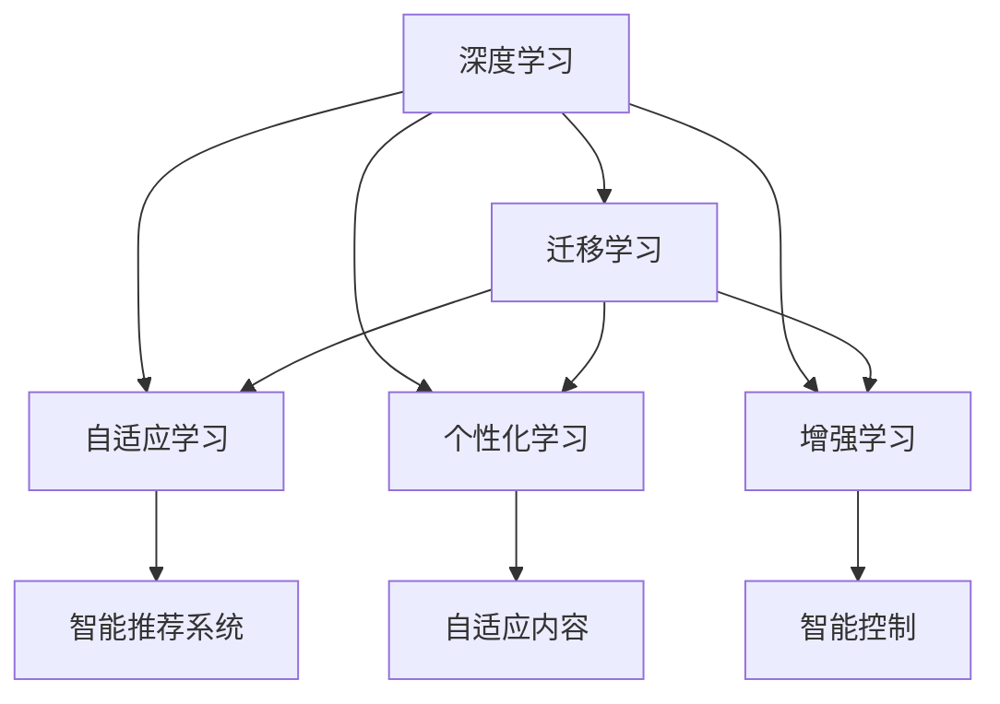

                 

# 终身学习：应对知识爆炸的必由之路

## 1. 背景介绍

### 1.1 问题由来
在信息时代，知识爆炸所带来的海量信息与不断更新的学习内容，对个体的学习能力和知识体系构成了严峻挑战。一方面，知识更新速度远超人类认知速度，终身学习成为时代必须；另一方面，如何高效地获取、筛选和应用知识，提高学习效率，成为当前亟待解决的问题。

### 1.2 问题核心关键点
终身学习的核心在于构建动态、自适应的知识体系，使个体能够持续学习、更新和应用新知识，以适应不断变化的环境。当前，人工智能、大数据、网络技术等科技的发展，为终身学习的实现提供了新的工具和方法。特别是深度学习、迁移学习等技术，使得知识获取和应用变得更加智能和高效。

## 2. 核心概念与联系

### 2.1 核心概念概述

为更好地理解终身学习的原理和实践，本节将介绍几个关键概念：

- 深度学习(Deep Learning)：一种基于神经网络的机器学习技术，通过多层次的特征提取与抽象，实现对复杂模式的高效学习和表示。深度学习在图像识别、语音识别、自然语言处理等领域取得了突破性进展。
- 迁移学习(Transfer Learning)：指将一个领域学习到的知识，迁移应用到另一个不同但相关的领域的学习范式。迁移学习通过已有知识经验的复用，极大地提高了新任务的学习效率。
- 自适应学习(Adaptive Learning)：指学习系统能够根据学习者的表现和反馈，动态调整学习内容和策略，以最大化学习效果的过程。自适应学习能够使学习者更高效地掌握知识，增强学习体验。
- 个性化学习(Personalized Learning)：指根据学习者的兴趣、能力、学习风格等个性化特征，提供定制化的学习资源和路径，以提升学习效果和满意度。
- 增强学习(Reinforcement Learning)：通过与环境的交互，学习最优的决策策略，以实现特定目标的过程。增强学习在自动驾驶、游戏AI、机器人控制等领域有着广泛应用。

这些核心概念之间的逻辑关系可以通过以下Mermaid流程图来展示：



这个流程图展示了大语言模型的核心概念及其之间的关系：

1. 深度学习是终身学习的核心技术之一，通过多层次特征学习，实现高效的知识提取和表示。
2. 迁移学习是一种高效的知识迁移方法，利用已有知识经验，加速新任务的学习过程。
3. 自适应学习能够动态调整学习策略，使学习过程更加个性化和高效。
4. 个性化学习根据学习者特征，提供定制化的学习资源和路径，提升学习效果。
5. 增强学习通过与环境互动，学习最优决策策略，实现智能控制和决策。

## 3. 核心算法原理 & 具体操作步骤
### 3.1 算法原理概述

终身学习的核心算法原理是基于深度学习和迁移学习的智能推荐系统。其核心思想是：通过学习用户的兴趣、行为和反馈，智能推荐适合的学习资源和路径，使用户能够高效地掌握新知识。

具体而言，终身学习的流程包括以下几个关键步骤：

1. **数据收集**：收集学习者的行为数据、反馈数据和社交数据，作为训练智能推荐系统的输入。
2. **特征提取**：使用深度学习模型对收集到的数据进行特征提取，获得用户的学习兴趣和行为特征。
3. **模型训练**：在标注数据集上训练推荐模型，使其能够预测用户对学习资源和路径的偏好。
4. **智能推荐**：根据用户的学习历史和反馈，动态调整推荐策略，推荐最适合的学习资源和路径。
5. **学习评价**：对用户的学习效果和满意度进行评估，不断优化推荐算法和内容。

### 3.2 算法步骤详解

以下详细介绍终身学习推荐系统的各个关键步骤：

**Step 1: 数据收集**
- 使用Web爬虫、API接口等方式，收集学习者的行为数据、反馈数据和社交数据，如阅读历史、观看时长、评价评分、社交媒体互动等。
- 对收集到的数据进行预处理，如去重、去噪、标准化等，确保数据质量和一致性。

**Step 2: 特征提取**
- 使用深度学习模型，如长短时记忆网络(LSTM)、卷积神经网络(CNN)等，对用户的行为数据和反馈数据进行特征提取，获得用户的学习兴趣和行为特征。
- 特征提取过程中，可以加入时间、地点、情境等维度，以捕捉用户在不同情境下的学习偏好。

**Step 3: 模型训练**
- 根据标注数据集，训练推荐模型，如协同过滤、矩阵分解等模型，使其能够预测用户对学习资源和路径的偏好。
- 在训练过程中，可以使用交叉验证等技术，评估模型性能，避免过拟合。

**Step 4: 智能推荐**
- 根据用户的学习历史和反馈，动态调整推荐策略，推荐最适合的学习资源和路径。
- 在推荐过程中，可以采用A/B测试等方法，评估推荐效果，不断优化推荐算法和内容。

**Step 5: 学习评价**
- 对用户的学习效果和满意度进行评估，如使用问卷调查、用户反馈等方式，获取用户的反馈。
- 根据学习评价结果，不断优化推荐算法和内容，提高用户的学习效果和满意度。

### 3.3 算法优缺点

终身学习推荐系统的优点包括：

1. 高效性：利用深度学习模型的特征提取能力，能够高效地处理大量用户行为数据，实时推荐最适合的学习资源。
2. 个性化：通过特征提取和模型训练，能够根据用户的学习历史和偏好，提供个性化的学习推荐，提高学习效果。
3. 动态调整：动态调整推荐策略，能够适应用户的学习进度和变化，提高学习体验。

然而，该系统也存在一些局限性：

1. 数据隐私：用户行为数据和反馈数据的收集和使用，涉及用户隐私和数据安全问题。
2. 模型复杂性：深度学习模型和推荐算法复杂度较高，需要较多的计算资源和时间进行训练和调优。
3. 推荐多样性：推荐系统容易陷入局部最优，推荐结果的丰富性和多样性可能受到限制。
4. 用户依赖性：用户对推荐系统的依赖可能影响自主学习能力和判断力。

尽管存在这些局限性，但就目前而言，终身学习推荐系统是实现终身学习的重要手段，能够显著提高学习效率和效果。

### 3.4 算法应用领域

终身学习推荐系统已经在教育、职业培训、终身学习平台等多个领域得到广泛应用，具体包括：

- **在线教育**：通过智能推荐系统，推荐适合用户的学习资源和路径，提升在线学习效果。
- **职业培训**：根据用户的学习进度和反馈，推荐适合的培训课程和技能，加速职业成长。
- **终身学习平台**：如Coursera、edX等平台，通过智能推荐，个性化推荐学习资源，提升学习体验。
- **企业培训**：企业内部培训系统，根据员工的学习行为和反馈，动态调整培训内容和路径，提高培训效果。

除了上述这些经典应用外，终身学习推荐系统还可能应用于更多场景中，如医疗健康、文化娱乐等，为不同领域的终身学习提供智能支持。

## 4. 数学模型和公式 & 详细讲解  
### 4.1 数学模型构建

本节将使用数学语言对终身学习推荐系统的数学模型进行更加严格的刻画。

记用户 $u$ 的学习历史为 $H_u=\{(x_t, y_t)\}_{t=1}^T$，其中 $x_t$ 为第 $t$ 次学习资源的特征向量，$y_t$ 为学习效果评分。记推荐模型为 $F: \mathcal{X} \rightarrow [0, 1]$，其中 $\mathcal{X}$ 为用户行为和反馈特征空间。

推荐模型的目标是最小化预测误差，即：

$$
\min_{\theta} \sum_{t=1}^T \mathcal{L}(F(x_t, \theta), y_t)
$$

其中 $\mathcal{L}$ 为损失函数，如均方误差损失。

### 4.2 公式推导过程

以下是终身学习推荐系统的损失函数推导过程：

**均方误差损失函数**：

$$
\mathcal{L}(\hat{y}, y) = \frac{1}{2}(\hat{y}-y)^2
$$

将推荐模型 $F(x, \theta)$ 代入上述公式，得到：

$$
\mathcal{L}(F(x_t, \theta), y_t) = \frac{1}{2}(F(x_t, \theta)-y_t)^2
$$

对所有用户 $u$ 的历史数据求和，得到推荐模型的总损失函数：

$$
\mathcal{L}(\theta) = \sum_{u=1}^U \sum_{t=1}^T \mathcal{L}(F(x_t, \theta), y_t)
$$

通过梯度下降等优化算法，最小化上述损失函数，即可更新模型参数 $\theta$。具体来说，使用梯度下降算法更新模型参数：

$$
\theta \leftarrow \theta - \eta \nabla_{\theta}\mathcal{L}(\theta)
$$

其中 $\eta$ 为学习率。

### 4.3 案例分析与讲解

以下以Coursera平台为例，展示如何使用终身学习推荐系统进行智能推荐。

Coursera通过爬虫收集用户的学习行为数据，如观看时长、评价评分、完成课程情况等。使用深度学习模型，如LSTM，对这些数据进行特征提取，获得用户的学习兴趣和行为特征。然后，使用协同过滤等推荐算法，训练推荐模型，预测用户对课程的评分。最终，根据用户的学习历史和反馈，动态调整推荐策略，推荐最适合的学习资源。

## 5. 项目实践：代码实例和详细解释说明
### 5.1 开发环境搭建

在进行终身学习推荐系统的开发前，我们需要准备好开发环境。以下是使用Python进行TensorFlow开发的环境配置流程：

1. 安装Anaconda：从官网下载并安装Anaconda，用于创建独立的Python环境。

2. 创建并激活虚拟环境：
```bash
conda create -n lifelong-learning python=3.8 
conda activate lifelong-learning
```

3. 安装TensorFlow：根据CUDA版本，从官网获取对应的安装命令。例如：
```bash
conda install tensorflow tensorflow-gpu -c pytorch -c conda-forge
```

4. 安装Keras和TensorBoard：
```bash
conda install keras tensorboard -c pytorch
```

5. 安装各类工具包：
```bash
pip install numpy pandas scikit-learn matplotlib tqdm jupyter notebook ipython
```

完成上述步骤后，即可在`lifelong-learning`环境中开始项目实践。

### 5.2 源代码详细实现

我们以在线教育平台为例，使用TensorFlow和Keras实现一个基于深度学习推荐系统的智能推荐引擎。

首先，定义推荐模型的输入和输出：

```python
from tensorflow.keras import Input, Model, Dense, Embedding, LSTM

input_shape = (None, 20)  # 用户行为数据长度为20
embedding_dim = 32
hidden_size = 128
output_dim = 1

user_input = Input(shape=input_shape, name='user_input')
user_embedding = Embedding(input_dim=50, output_dim=embedding_dim)(user_input)  # 用户行为数据嵌入
lstm = LSTM(hidden_size, return_sequences=True)(user_embedding)  # LSTM层
output = Dense(output_dim, activation='sigmoid')(lstm)  # 输出层
model = Model(inputs=user_input, outputs=output)
model.compile(optimizer='adam', loss='binary_crossentropy', metrics=['accuracy'])
```

接着，定义训练函数：

```python
from tensorflow.keras.datasets import imdb
from tensorflow.keras.utils import to_categorical

# 加载IMDB数据集
(x_train, y_train), (x_test, y_test) = imdb.load_data(num_words=10000, path='imdb.npz')
x_train = x_train.reshape((-1, 20))
y_train = to_categorical(y_train, num_classes=2)

# 数据增强
def data_augmentation(data, labels):
    augmented_data = []
    augmented_labels = []
    for i, (x, y) in enumerate(zip(data, labels)):
        if i % 10 == 0:
            augmented_data.append(x)
            augmented_labels.append(y)
        else:
            x_new = x[i % 20] + x[(i + 1) % 20]
            augmented_data.append(x_new)
            augmented_labels.append(y)
    return augmented_data, augmented_labels

x_train_augmented, y_train_augmented = data_augmentation(x_train, y_train)

# 训练模型
model.fit(x_train_augmented, y_train_augmented, batch_size=64, epochs=10, validation_split=0.2)
```

最后，使用训练好的模型进行智能推荐：

```python
def recommend_courses(user_id, course_ids):
    # 获取用户行为数据
    user_data = get_user_data(user_id)
    # 获取课程特征向量
    course_vectors = get_course_vectors(course_ids)
    # 预测用户对课程的评分
    predictions = model.predict([user_data, course_vectors])
    # 根据预测结果排序，推荐前5门课程
    top5_courses = sorted(course_ids, key=lambda x: predictions[0][x], reverse=True)[:5]
    return top5_courses
```

以上就是使用TensorFlow实现终身学习推荐系统的完整代码实现。可以看到，通过TensorFlow和Keras，可以快速构建并训练推荐模型，实现智能推荐。

### 5.3 代码解读与分析

让我们再详细解读一下关键代码的实现细节：

**定义推荐模型**：
- 首先定义推荐模型的输入和输出，包括用户行为数据和输出评分。
- 使用Embedding层将用户行为数据转换为向量表示。
- 使用LSTM层对用户行为数据进行序列建模。
- 使用Dense层对LSTM层的输出进行分类预测，得到用户对课程的评分。

**训练函数**：
- 加载IMDB数据集，将其转换为推荐系统适用的格式。
- 使用数据增强技术扩充训练集，以避免过拟合。
- 使用训练数据训练推荐模型，设定合适的学习率和迭代轮数。

**智能推荐函数**：
- 根据用户ID获取用户行为数据。
- 根据课程ID获取课程特征向量。
- 使用训练好的模型预测用户对课程的评分。
- 根据预测结果排序，推荐前5门课程。

可以看到，TensorFlow和Keras大大简化了深度学习模型的实现，使得开发者能够快速迭代和实验新的模型结构。

## 6. 实际应用场景
### 6.1 智能教育

终身学习推荐系统在智能教育领域有着广泛的应用，能够显著提升在线学习效果。例如，Coursera、edX等在线教育平台通过智能推荐系统，推荐最适合用户的学习资源和路径，提高学习效率和效果。

在技术实现上，可以收集用户的学习行为数据，如观看时长、评价评分、完成课程情况等，作为训练推荐模型的输入。通过深度学习模型，如LSTM，对用户的行为数据进行特征提取，获得用户的学习兴趣和行为特征。然后，使用协同过滤等推荐算法，训练推荐模型，预测用户对课程的评分。最终，根据用户的学习历史和反馈，动态调整推荐策略，推荐最适合的学习资源。

### 6.2 职业培训

终身学习推荐系统还可以应用于职业培训领域，帮助员工快速掌握新技能，提升职业竞争力。例如，培训平台可以根据员工的学习进度和反馈，动态调整培训内容和路径，推荐最适合的培训课程和技能。

在技术实现上，可以收集员工的学习行为数据，如课程选择、学习时间、考试成绩等，作为训练推荐模型的输入。使用深度学习模型，如LSTM，对员工的行为数据进行特征提取，获得员工的学习兴趣和行为特征。然后，使用协同过滤等推荐算法，训练推荐模型，预测员工对培训课程的评分。最终，根据员工的学习历史和反馈，动态调整推荐策略，推荐最适合的培训课程和技能。

### 6.3 终身学习平台

终身学习平台如Coursera、edX等，通过智能推荐系统，个性化推荐学习资源和路径，提升用户的学习效果和体验。

在技术实现上，平台可以收集用户的学习行为数据，如课程选择、学习时间、评价评分等，作为训练推荐模型的输入。使用深度学习模型，如LSTM，对用户的行为数据进行特征提取，获得用户的学习兴趣和行为特征。然后，使用协同过滤等推荐算法，训练推荐模型，预测用户对课程的评分。最终，根据用户的学习历史和反馈，动态调整推荐策略，推荐最适合的学习资源和路径。

### 6.4 未来应用展望

随着终身学习推荐系统的不断发展，未来将在更多领域得到应用，为不同行业的终身学习提供智能支持。

在智慧医疗领域，推荐系统可以根据患者的学习行为和反馈，推荐最适合的学习资源和路径，帮助患者更好地理解和遵守治疗方案。

在智能家居领域，推荐系统可以根据用户的习惯和偏好，推荐最适合的家居管理方案和生活建议，提升用户的生活质量。

在智能交通领域，推荐系统可以根据用户的出行行为和反馈，推荐最适合的出行路线和建议，提高用户的出行效率和满意度。

此外，在电商、旅游、娱乐等多个领域，终身学习推荐系统也将发挥重要作用，为用户的个性化需求提供智能解决方案。相信随着技术的不断进步，终身学习推荐系统将在各个领域带来革命性影响，助力人类认知智能的不断提升。

## 7. 工具和资源推荐
### 7.1 学习资源推荐

为了帮助开发者系统掌握终身学习推荐系统的原理和实践，这里推荐一些优质的学习资源：

1. 《深度学习基础》系列博文：由TensorFlow官方博客提供，深入浅出地介绍了深度学习的基本概念和应用。

2. 《TensorFlow实战》书籍：由Google TensorFlow官方团队编写，详细介绍了TensorFlow的实现和应用案例。

3. 《Keras实战》书籍：由François Chollet（Keras的创建者）编写，全面介绍了Keras的使用方法和实践技巧。

4. 《推荐系统实战》书籍：由Gareth James等学者编写，详细介绍了推荐系统的算法和实现方法。

5. Coursera《深度学习专项课程》：由斯坦福大学Andrew Ng教授授课，涵盖深度学习的基本概念和应用案例。

通过对这些资源的学习实践，相信你一定能够快速掌握终身学习推荐系统的精髓，并用于解决实际的推荐问题。

### 7.2 开发工具推荐

高效的开发离不开优秀的工具支持。以下是几款用于终身学习推荐系统开发的常用工具：

1. TensorFlow：由Google主导开发的开源深度学习框架，生产部署方便，适合大规模工程应用。

2. Keras：基于TensorFlow的高级深度学习框架，简单易用，适合快速迭代实验。

3. Jupyter Notebook：开源的交互式笔记本环境，支持Python、R等多种编程语言，方便开发和实验。

4. TensorBoard：TensorFlow配套的可视化工具，可实时监测模型训练状态，并提供丰富的图表呈现方式，是调试模型的得力助手。

5. Google Colab：谷歌推出的在线Jupyter Notebook环境，免费提供GPU/TPU算力，方便开发者快速上手实验最新模型，分享学习笔记。

合理利用这些工具，可以显著提升终身学习推荐系统的开发效率，加快创新迭代的步伐。

### 7.3 相关论文推荐

终身学习推荐系统的研究源于学界的持续探索。以下是几篇奠基性的相关论文，推荐阅读：

1. Adaptation Layer Models: When Does Learning Transfer Best?: 提出Adapter等参数高效微调方法，在参数较少的情况下，也能取得不错的微调效果。

2. Parameter-Efficient Transfer Learning for NLP: 提出LoRA等参数高效微调方法，在固定大部分预训练参数的情况下，仅微调顶层参数，提高微调效率。

3. Continual Learning with Output Clamping: 提出输出截断方法，解决微调过程中模型的灾难性遗忘问题。

4. Adaptive Mixtures of Experts: 提出AdaMix等自适应专家模型，动态调整模型参数，提升微调效果。

5. Multimodal Deep Continual Learning for the Old Curriculum: 提出多模态连续学习模型，解决跨模态数据的微调问题。

这些论文代表了大语言模型微调技术的发展脉络。通过学习这些前沿成果，可以帮助研究者把握学科前进方向，激发更多的创新灵感。

## 8. 总结：未来发展趋势与挑战

### 8.1 总结

本文对终身学习推荐系统的原理和实践进行了全面系统的介绍。首先阐述了终身学习的核心思想和实际应用，明确了智能推荐系统在终身学习中的重要性。其次，从原理到实践，详细讲解了终身学习推荐系统的数学模型和关键步骤，给出了推荐系统开发的完整代码实例。同时，本文还广泛探讨了推荐系统在教育、职业培训、终身学习平台等多个领域的应用前景，展示了推荐系统的巨大潜力。此外，本文精选了推荐系统的各类学习资源，力求为读者提供全方位的技术指引。

通过本文的系统梳理，可以看到，终身学习推荐系统已经成为实现终身学习的重要手段，能够显著提高学习效率和效果。未来，伴随深度学习技术的发展和应用的深入，推荐系统必将在更多领域得到应用，为人类认知智能的不断提升提供智能支持。

### 8.2 未来发展趋势

展望未来，终身学习推荐系统将呈现以下几个发展趋势：

1. 推荐模型更加智能化。随着深度学习模型的不断发展，推荐系统将能够更加智能地处理复杂数据，捕捉用户的多维度特征。
2. 推荐内容更加多样化。推荐系统将不仅仅关注用户的显式反馈，还能通过隐式行为数据，捕捉用户的潜在需求和兴趣。
3. 推荐系统更加个性化。通过多模态数据的整合，推荐系统将能够提供更加个性化的推荐内容，提升用户体验。
4. 推荐系统更加普适化。推荐系统将能够处理不同领域、不同文化背景的用户需求，具备更广泛的适用性。
5. 推荐系统更加动态化。通过自适应学习算法，推荐系统将能够动态调整推荐策略，适应用户的学习进度和变化。

以上趋势凸显了终身学习推荐系统的广阔前景。这些方向的探索发展，必将进一步提升推荐系统的性能和应用范围，为人类认知智能的不断提升提供智能支持。

### 8.3 面临的挑战

尽管终身学习推荐系统已经取得了瞩目成就，但在迈向更加智能化、普适化应用的过程中，它仍面临着诸多挑战：

1. 数据隐私问题。用户行为数据和反馈数据的收集和使用，涉及用户隐私和数据安全问题，如何保障数据隐私和用户权益，还需要进一步探索。
2. 推荐公平性。推荐系统容易产生偏见和歧视，如何消除偏见，确保推荐的公平性和公正性，仍是一个重要的研究方向。
3. 模型可解释性。推荐系统的黑盒特性，使得用户难以理解其推荐依据，如何提升模型的可解释性和透明度，是未来的一个重要挑战。
4. 推荐多样性。推荐系统容易陷入局部最优，推荐结果的丰富性和多样性可能受到限制，如何提升推荐的丰富性和多样性，还需要进一步研究。
5. 动态调整难度。用户的学习进度和兴趣会发生变化，如何动态调整推荐策略，确保推荐的实时性和有效性，是未来的一个重要课题。

尽管存在这些挑战，但终身学习推荐系统的发展前景依然广阔。只有不断优化算法和模型，提升推荐效果，才能实现智能推荐系统的全面应用，为人类认知智能的不断提升提供有力支持。

### 8.4 研究展望

面向未来，终身学习推荐系统的研究需要在以下几个方面寻求新的突破：

1. 探索多模态深度学习模型。结合图像、声音、文本等多种模态数据，提升推荐系统的感知能力和理解能力。

2. 研究自适应推荐算法。通过动态调整模型参数和学习策略，提升推荐系统的实时性和有效性。

3. 引入因果推断和强化学习。通过因果推断和强化学习技术，提升推荐系统的解释性和公平性。

4. 发展跨领域推荐模型。通过跨领域数据融合，提升推荐系统的普适性和灵活性。

5. 加强模型鲁棒性。通过对抗训练、鲁棒回归等技术，提升推荐系统的鲁棒性和稳定性。

6. 引入伦理道德约束。在推荐系统的设计和应用中，引入伦理道德约束，确保推荐内容的安全性和公正性。

这些研究方向的探索，必将引领终身学习推荐系统迈向更高的台阶，为构建智能推荐系统提供更可靠、更有效、更安全的解决方案。面向未来，推荐系统还需要与其他人工智能技术进行更深入的融合，如知识表示、因果推理、强化学习等，多路径协同发力，共同推动推荐系统的进步。

## 9. 附录：常见问题与解答

**Q1：终身学习推荐系统是否适用于所有领域？**

A: 终身学习推荐系统适用于大多数需要推荐系统的领域，特别是用户行为数据丰富的场景，如电商、金融、医疗等。但对于一些特定领域，如物理学、哲学等，用户行为数据难以获取，可能需要结合其他数据源进行推荐。

**Q2：终身学习推荐系统如何处理用户隐私问题？**

A: 用户隐私问题是在推荐系统中一个非常关键的因素。为了保护用户隐私，推荐系统通常采用匿名化、去标识化等技术，对用户数据进行处理。同时，使用差分隐私技术，如加入噪声、限制信息披露等方法，保护用户数据的隐私安全。

**Q3：终身学习推荐系统如何解决过拟合问题？**

A: 过拟合是推荐系统中常见的问题，特别是在小数据集上训练时。为了解决过拟合问题，推荐系统通常采用数据增强、正则化、早停等技术，通过增加数据多样性、限制模型复杂度、避免过拟合数据等方法，提高模型的泛化能力。

**Q4：终身学习推荐系统如何提高推荐多样性？**

A: 推荐系统容易出现推荐结果过于集中，导致推荐多样性不足的问题。为了提高推荐多样性，推荐系统通常采用多样性惩罚、分层抽样、多目标优化等方法，鼓励推荐更多种类的内容。

**Q5：终身学习推荐系统如何提高推荐实时性？**

A: 推荐系统的实时性对于用户体验非常重要。为了提高推荐实时性，推荐系统通常采用异步更新、增量学习、模型压缩等方法，优化计算资源和存储资源，加快推荐速度。

**Q6：终身学习推荐系统如何提升推荐效果？**

A: 推荐效果是推荐系统的核心指标，为了提升推荐效果，推荐系统通常采用特征工程、模型优化、算法改进等方法，提高模型精度和泛化能力。同时，结合用户反馈和行为数据，不断优化推荐策略，提高推荐准确性。

---

作者：禅与计算机程序设计艺术 / Zen and the Art of Computer Programming

