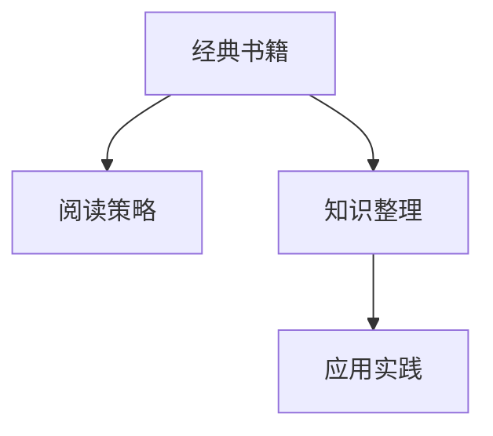

                 

# 经典书籍:管理者构建知识体系的基石

## 1. 背景介绍

### 1.1 问题由来
在当今快速变化和信息爆炸的时代，管理者面临的挑战日益复杂多样，如何在不断变化的环境中保持竞争力，是每个管理者必须面对的问题。经典书籍的阅读被广泛认为是一种有效的方式，能够提供深刻的理论基础和实践经验。然而，如何有效地构建和应用这些知识，仍然是一个值得深入探讨的话题。本文将深入探讨管理者构建知识体系的基石，包括如何选择合适的书籍、阅读策略、知识整理和应用等关键环节。

### 1.2 问题核心关键点
管理者构建知识体系的基石包括以下几个关键点：
- **选书原则**：如何选择适合自己的经典书籍。
- **阅读策略**：如何高效阅读和理解经典书籍。
- **知识整理**：如何将书籍中的知识进行系统整理。
- **应用实践**：如何将知识应用到实际工作中。

这些关键点构成了管理者构建知识体系的基石，帮助他们在快速变化的环境中保持竞争力。

## 2. 核心概念与联系

### 2.1 核心概念概述

为了更好地理解管理者构建知识体系的基石，本节将介绍几个密切相关的核心概念：

- **经典书籍**：指那些经过时间考验、具有深远影响的书籍。它们往往涵盖广泛的领域，提供深刻的理论基础和实践经验。
- **阅读策略**：指管理者在阅读经典书籍时采用的方法和技巧，以最大化吸收和应用书中的知识。
- **知识整理**：指将阅读到的知识进行系统化整理和归纳，形成结构化的知识体系。
- **应用实践**：指将学到的知识应用到实际管理工作中，解决问题和提升绩效的过程。

这些核心概念之间的逻辑关系可以通过以下Mermaid流程图来展示：



这个流程图展示了我们构建知识体系的核心步骤：通过阅读经典书籍获取知识，然后通过知识整理形成系统化的知识体系，最终应用到实际工作中。

## 3. 核心算法原理 & 具体操作步骤

### 3.1 算法原理概述

管理者构建知识体系的基石，本质上是一个系统的知识获取、整理和应用过程。其核心思想是：通过阅读经典书籍，获取前沿理论和实践经验；通过知识整理，形成结构化的知识体系；通过应用实践，将知识应用于实际管理工作，解决问题和提升绩效。

### 3.2 算法步骤详解

管理者构建知识体系的步骤主要包括：

**Step 1: 选书原则**
- 根据个人兴趣和职业需求，选择经典书籍。尽量选择与自己工作相关或感兴趣的领域，以提高阅读兴趣和实用性。
- 参考书籍的评价、作者的背景和专业性，选择有权威和影响力的书籍。
- 确定书籍的阅读难度和覆盖范围，确保阅读内容既不过于简单，也不过于复杂。

**Step 2: 阅读策略**
- 制定详细的阅读计划，包括每天或每周的阅读时间、目标章节等。
- 采用多种阅读方法，如快速阅读、精读、笔记等，结合自己的阅读习惯和目标进行灵活调整。
- 定期回顾和复习已读内容，确保知识点的理解和记忆。

**Step 3: 知识整理**
- 利用思维导图、框架图等工具，将书籍中的知识点进行分类整理。
- 建立知识库，将整理好的知识点进行系统化存储和管理。
- 定期更新和回顾知识库，保持其时效性和实用性。

**Step 4: 应用实践**
- 将学到的知识应用到实际工作中，如项目管理、团队管理、决策分析等。
- 结合实际情况，灵活应用知识，解决实际问题，提升工作绩效。
- 定期总结和反思应用过程，总结经验教训，持续改进。

### 3.3 算法优缺点

管理者构建知识体系的基石具有以下优点：
- **系统性**：通过系统化的阅读和知识整理，能够形成结构化的知识体系，提高知识的应用效率。
- **实践性**：通过将知识应用于实际工作，能够直接解决实际问题，提升工作绩效。
- **通用性**：经典书籍覆盖广泛的领域，能够提供多方面的知识，满足不同职业需求。

同时，该方法也存在一定的局限性：
- **时间和精力投入**：系统化的知识构建需要投入大量时间和精力，对于忙碌的管理者来说可能是个挑战。
- **实用性局限**：经典书籍的阅读和应用需要一定的专业背景和实践经验，对于缺乏相关经验的管理者来说，可能会感到困难。
- **时效性问题**：经典书籍的内容可能与当前的市场和技术环境有所不同，需要结合实际情况进行更新和补充。

尽管存在这些局限性，但就目前而言，基于系统阅读和知识整理的知识体系构建方法，仍然是大多数管理者构建知识体系的基石。未来相关研究的重点在于如何进一步降低阅读和应用的知识门槛，提高知识的时效性和实用性。

### 3.4 算法应用领域

管理者构建知识体系的基石不仅适用于传统管理领域，还广泛应用于以下多个领域：

- **项目管理**：通过阅读经典项目管理书籍，学习项目管理的理论和方法，提升项目管理能力。
- **人力资源管理**：通过阅读经典人力资源管理书籍，学习人力资源管理的最佳实践，提升团队管理能力。
- **金融管理**：通过阅读经典金融管理书籍，学习金融管理的理论和方法，提升财务决策能力。
- **技术管理**：通过阅读经典技术管理书籍，学习技术管理的最佳实践，提升技术团队管理能力。

## 4. 数学模型和公式 & 详细讲解 & 举例说明

### 4.1 数学模型构建

假设管理者希望构建的知识体系包括 $N$ 个主题，每个主题包含 $M$ 个知识点。用 $T$ 表示主题，$K$ 表示知识点，则知识体系的数学模型可以表示为：

$$
\mathcal{K} = \{T_i, K_{ij}\}_{i=1}^N, \{i=1}^M
$$

其中 $T_i$ 表示第 $i$ 个主题，$K_{ij}$ 表示第 $i$ 个主题下的第 $j$ 个知识点。

### 4.2 公式推导过程

假设管理者希望在 $T_1$ 主题下掌握 $K_{11}, K_{12}, K_{13}$ 三个知识点，则该主题的知识点的数学模型可以表示为：

$$
T_1 = \{K_{11}, K_{12}, K_{13}\}
$$

### 4.3 案例分析与讲解

假设管理者阅读了《管理学原理》这本书，并希望掌握其中的两个知识点："战略管理"和"组织设计"。他可以将这两个知识点归纳为：

$$
T_1 = \{K_{11}(\text{战略管理}), K_{12}(\text{组织设计})\}
$$

## 5. 项目实践：代码实例和详细解释说明

### 5.1 开发环境搭建

在进行知识体系构建的实践前，我们需要准备好开发环境。以下是使用Python进行知识管理系统的环境配置流程：

1. 安装Anaconda：从官网下载并安装Anaconda，用于创建独立的Python环境。

2. 创建并激活虚拟环境：
```bash
conda create -n knowledge-management python=3.8 
conda activate knowledge-management
```

3. 安装PyTorch：根据CUDA版本，从官网获取对应的安装命令。例如：
```bash
conda install pytorch torchvision torchaudio cudatoolkit=11.1 -c pytorch -c conda-forge
```

4. 安装各类工具包：
```bash
pip install numpy pandas scikit-learn matplotlib tqdm jupyter notebook ipython
```

完成上述步骤后，即可在`knowledge-management`环境中开始知识体系构建实践。

### 5.2 源代码详细实现

这里我们以项目管理知识体系的构建为例，给出使用Python进行知识管理的代码实现。

首先，定义知识体系的基本数据结构：

```python
from py2neo import Graph, Node, Relationship

# 连接Neo4j数据库
graph = Graph("bolt://localhost:7474", auth=("neo4j", "password"))

# 定义知识体系的数据结构
class KnowledgeSystem:
    def __init__(self, name):
        self.name = name
        self.knowledge_points = []
        self.topics = {}
    
    def add_knowledge_point(self, topic, point):
        self.knowledge_points.append(point)
        if topic in self.topics:
            self.topics[topic].append(point)
        else:
            self.topics[topic] = [point]

    def add_topic(self, topic, points):
        self.topics[topic] = points

# 创建知识体系
knowledge_system = KnowledgeSystem("项目管理")
```

然后，定义知识点的分类整理和应用实践：

```python
from py2neo import Node, Relationship

# 定义知识点的分类整理
def categorize_knowledge(knowledge_points):
    categorized_knowledge = {}
    for point in knowledge_points:
        category = point["category"]
        if category not in categorized_knowledge:
            categorized_knowledge[category] = []
        categorized_knowledge[category].append(point)
    return categorized_knowledge

# 定义知识点的应用实践
def apply_knowledge(knowledge_points, application):
    for point in knowledge_points:
        graph.create(Node("KnowledgePoint", name=point["name"], category=point["category"]))
        if application in point["practices"]:
            graph.create(Relationship("AppliesTo", Node("KnowledgePoint", name=point["name"], category=point["category"]), Node("Application", name=application)))
```

最后，启动知识体系构建流程并应用到实际工作中：

```python
# 知识点列表
knowledge_points = [
    {"name": "项目规划", "category": "规划", "practices": ["制定项目计划", "资源分配"]},
    {"name": "项目执行", "category": "执行", "practices": ["进度跟踪", "风险管理"]},
    {"name": "项目监控", "category": "监控", "practices": ["绩效评估", "变更管理"]}
]

# 分类整理知识点
categorized_knowledge = categorize_knowledge(knowledge_points)

# 应用实践到项目管理中
for topic, points in categorized_knowledge.items():
    knowledge_system.add_topic(topic, points)
    apply_knowledge(points, "项目管理")

# 查询应用实践的知识点
for node in graph.nodes.match("KnowledgePoint"):
    print(node["name"], node["category"])
    for relationship in node.incoming_relationships("AppliesTo"):
        print(" ->", relationship.end_node["name"])
```

以上就是使用Python进行项目管理知识体系构建的完整代码实现。可以看到，通过将知识体系抽象为对象和关系图，我们能够方便地进行分类整理和应用实践。

### 5.3 代码解读与分析

让我们再详细解读一下关键代码的实现细节：

**KnowledgeSystem类**：
- `__init__`方法：初始化知识体系的名称和知识点列表。
- `add_knowledge_point`方法：向知识体系中添加知识点，并归入相应主题。
- `add_topic`方法：向知识体系中添加主题，并包含该主题下的所有知识点。

**categorize_knowledge函数**：
- 通过遍历知识点的分类信息，将知识点分类整理为字典形式，便于后续应用和查询。

**apply_knowledge函数**：
- 根据知识点的应用实践，创建Neo4j图数据库中的关系节点，表示知识点与实际应用之间的关联。

**项目管理知识体系构建**：
- 定义项目管理的知识点列表。
- 分类整理知识点，创建主题和应用关系。
- 通过查询数据库，输出应用到项目管理的知识点和应用实践。

可以看到，Python结合Neo4j数据库，能够方便地实现知识体系的分类整理和应用实践，是知识管理系统开发的利器。

当然，工业级的系统实现还需考虑更多因素，如数据备份、权限管理、用户交互等，但核心的知识体系构建逻辑基本与此类似。通过构建系统化的知识体系，管理者可以更好地掌握和应用经典书籍中的知识，提升管理绩效。

## 6. 实际应用场景

### 6.1 项目管理

基于知识管理体系构建的项目管理，可以大幅提升项目管理的系统性和执行力。传统项目管理往往依赖经验，难以应对复杂的项目需求和变化。通过构建项目管理知识体系，管理者可以系统性地掌握项目管理的相关知识和实践，提升项目管理的科学性和效率。

具体而言，可以收集和整理项目管理相关的经典书籍和文献，将项目管理的各个环节进行分类整理，形成系统化的知识体系。通过定期复习和应用这些知识，管理者能够更好地应对项目管理中的各种挑战，提高项目的成功率和交付效率。

### 6.2 人力资源管理

人力资源管理是企业发展的重要支撑，但传统的人力资源管理往往缺乏系统的理论和实践指导。通过构建人力资源管理知识体系，管理者可以系统地掌握人力资源管理的理论和实践，提升团队管理和员工发展的能力。

具体而言，可以收集和整理人力资源管理的经典书籍和文献，将人力资源管理的各个环节进行分类整理，形成系统化的知识体系。通过定期复习和应用这些知识，管理者能够更好地优化人力资源管理策略，提升团队的凝聚力和工作效率。

### 6.3 金融管理

金融管理涉及复杂的财务决策和风险控制，传统金融管理往往依赖经验，难以应对市场的快速变化。通过构建金融管理知识体系，管理者可以系统地掌握金融管理的理论和实践，提升财务决策和风险控制的能力。

具体而言，可以收集和整理金融管理的经典书籍和文献，将金融管理的各个环节进行分类整理，形成系统化的知识体系。通过定期复习和应用这些知识，管理者能够更好地应对市场变化和风险挑战，提高金融管理的科学性和稳健性。

### 6.4 技术管理

技术管理是企业技术创新和发展的关键，但传统技术管理往往缺乏系统的理论和实践指导。通过构建技术管理知识体系，管理者可以系统地掌握技术管理的理论和实践，提升技术团队的管理能力和技术创新能力。

具体而言，可以收集和整理技术管理的经典书籍和文献，将技术管理的各个环节进行分类整理，形成系统化的知识体系。通过定期复习和应用这些知识，管理者能够更好地优化技术管理策略，提升技术团队的创新力和执行力。

## 7. 工具和资源推荐

### 7.1 学习资源推荐

为了帮助管理者系统掌握知识体系构建的理论基础和实践技巧，这里推荐一些优质的学习资源：

1. **《管理学原理》**：被广泛认为是最经典的管理学教材之一，涵盖管理学的基础理论、方法和实践。
2. **《组织行为学》**：帮助管理者理解组织行为和人性，提升团队管理和领导力。
3. **《项目管理知识体系指南》(PMBOK)**：项目管理领域的经典指南，涵盖项目管理的各个环节。
4. **《领导力精粹》**：哈佛商学院的畅销书，提供领导力和团队管理的深刻见解。
5. **Coursera和edX**：提供大量经典管理课程，涵盖管理学、金融管理、技术管理等多个领域。

通过对这些资源的学习实践，相信管理者一定能够更好地掌握知识体系构建的精髓，并用于解决实际的组织管理问题。

### 7.2 开发工具推荐

高效的开发离不开优秀的工具支持。以下是几款用于知识管理体系构建开发的常用工具：

1. **Python**：作为一种通用编程语言，Python以其简洁、灵活的特性，适合用于知识管理体系构建的开发。
2. **Neo4j**：一款高性能的图数据库，适合存储和管理知识体系中的关系数据。
3. **Jupyter Notebook**：一款交互式编程环境，适合用于数据分析和可视化。
4. **Trello和Asana**：项目管理工具，帮助管理者更好地规划和管理项目。
5. **Slack和Microsoft Teams**：团队协作工具，帮助管理者更好地沟通和协作。

合理利用这些工具，可以显著提升知识管理体系构建的开发效率，加快创新迭代的步伐。

### 7.3 相关论文推荐

知识管理体系构建的研究源于学界的持续研究。以下是几篇奠基性的相关论文，推荐阅读：

1. **《项目管理知识体系指南》(PMBOK)**：项目管理领域的经典指南，提供系统化的项目管理知识体系。
2. **《组织行为学》**：管理学的经典教材，提供组织行为和人性管理的理论基础。
3. **《管理学原理》**：管理学领域的经典教材，提供管理学的基础理论和实践方法。
4. **《领导力精粹》**：哈佛商学院的畅销书，提供领导力和团队管理的深刻见解。

这些论文代表了大规模知识管理体系构建的理论研究，帮助管理者构建更加系统和科学的知识体系，提升管理绩效。

## 8. 总结：未来发展趋势与挑战

### 8.1 总结

本文对管理者构建知识体系的基石进行了全面系统的介绍。首先阐述了知识体系构建的背景和意义，明确了选书原则、阅读策略、知识整理和应用等关键环节。其次，从原理到实践，详细讲解了知识体系构建的数学模型和具体步骤，给出了知识管理体系构建的完整代码实现。同时，本文还广泛探讨了知识体系在项目管理、人力资源管理、金融管理、技术管理等多个行业领域的应用前景，展示了知识体系构建的巨大潜力。此外，本文精选了知识体系构建的学习资源、开发工具和相关论文，力求为管理者提供全方位的技术指引。

通过本文的系统梳理，可以看到，管理者构建知识体系的基石不仅适用于传统管理领域，还广泛应用于多个行业领域。通过系统化的阅读、知识整理和应用实践，管理者能够更好地掌握经典书籍中的知识，提升管理绩效和组织竞争力。未来，伴随知识体系构建技术的发展，管理者将能够更好地应对复杂多变的管理环境，实现组织的可持续发展。

### 8.2 未来发展趋势

展望未来，知识管理体系构建将呈现以下几个发展趋势：

1. **智能化**：随着人工智能技术的发展，知识管理体系将变得更加智能化。例如，基于知识图谱的智能推荐系统，能够根据管理者的需求和背景，推荐合适的阅读和学习资源。
2. **个性化**：知识管理体系将更加注重个性化。通过分析管理者的学习行为和偏好，提供量身定制的学习路径和内容，提高学习效率和效果。
3. **实时化**：知识管理体系将更加实时化。例如，基于实时数据分析和反馈，管理者能够及时调整学习策略和应用实践，提升管理绩效。
4. **可视化**：知识管理体系将更加可视化。例如，通过图表、仪表盘等可视化工具，管理者能够直观地了解知识体系的结构和应用效果，更好地进行管理和优化。
5. **跨领域融合**：知识管理体系将更加跨领域融合。例如，将项目管理、人力资源管理、金融管理等多个领域知识进行整合，形成更加综合的知识体系。

以上趋势凸显了知识管理体系构建的广阔前景。这些方向的探索发展，必将进一步提升知识管理体系的科学性和实用性，为管理者提供更加全面和高效的知识获取和应用工具。

### 8.3 面临的挑战

尽管知识管理体系构建技术已经取得了瞩目成就，但在迈向更加智能化、个性化和实时化的过程中，它仍面临着诸多挑战：

1. **数据隐私和安全**：在知识管理体系构建过程中，涉及大量的个人和学习数据。如何保护这些数据隐私和安全，将是重要的挑战。
2. **数据质量**：知识管理体系构建需要大量高质量的数据。如何获取和处理高质量的数据，是知识管理体系构建的关键。
3. **学习效率**：知识管理体系构建需要大量时间和精力。如何提高学习效率，缩短学习时间，是管理者面临的挑战。
4. **应用效果**：知识管理体系构建的最终目标是提升管理绩效。如何评估和优化知识应用效果，确保知识真正转化为管理实践，是知识管理体系构建的关键。
5. **技术复杂度**：知识管理体系构建涉及多种技术和工具。如何降低技术复杂度，提高易用性，是知识管理体系构建的挑战。

尽管存在这些挑战，但伴随技术的发展和管理者对知识管理体系构建的重视，相信这些挑战将逐步被克服，知识管理体系构建必将在管理者职业发展中扮演越来越重要的角色。

### 8.4 研究展望

面对知识管理体系构建所面临的种种挑战，未来的研究需要在以下几个方面寻求新的突破：

1. **智能化推荐**：开发基于知识图谱的智能推荐系统，推荐适合管理者的阅读和学习资源。
2. **个性化学习**：利用机器学习算法，分析管理者的学习行为和偏好，提供个性化的学习路径和内容。
3. **实时数据分析**：开发实时数据分析工具，帮助管理者及时调整学习策略和应用实践，提升管理绩效。
4. **可视化工具**：开发更加直观的可视化工具，如图表、仪表盘等，帮助管理者直观地了解知识体系的结构和应用效果。
5. **跨领域融合**：将不同领域的知识进行整合，形成更加综合的知识体系，提升管理者的综合素质和跨领域能力。

这些研究方向的探索，必将引领知识管理体系构建技术迈向更高的台阶，为管理者提供更加全面和高效的知识获取和应用工具。面向未来，知识管理体系构建需要与其他人工智能技术进行更深入的融合，如知识表示、因果推理、强化学习等，多路径协同发力，共同推动管理者的职业发展和组织的可持续发展。只有勇于创新、敢于突破，才能不断拓展知识管理体系构建的边界，让知识管理体系构建技术更好地造福管理者。

## 9. 附录：常见问题与解答

**Q1：如何选择适合自己的经典书籍？**

A: 选择适合自己的经典书籍，需要考虑以下几个因素：
1. 书籍的权威性和专业性。选择有权威、有影响力的书籍。
2. 书籍的覆盖范围。选择涵盖自己职业领域相关内容的书籍。
3. 书籍的难度和实用价值。选择适合自己阅读水平和职业需求的书籍。
4. 书籍的更新性和时效性。选择最新的、与当前市场和技术环境相符的书籍。

**Q2：如何快速阅读和理解经典书籍？**

A: 快速阅读和理解经典书籍，可以采用以下方法：
1. 阅读摘要和目录，了解书籍的框架和内容。
2. 精读关键章节，掌握核心概念和理论。
3. 做笔记和思维导图，帮助记忆和理解。
4. 与其他管理者交流，分享学习经验和理解。
5. 利用在线课程和讲座，补充和扩展学习内容。

**Q3：如何将知识系统整理成知识体系？**

A: 将知识系统整理成知识体系，可以采用以下方法：
1. 建立知识库，将知识按主题进行分类和存储。
2. 利用思维导图、框架图等工具，帮助整理和归纳知识。
3. 定期回顾和更新知识库，保持其时效性和实用性。
4. 建立知识共享平台，促进知识的传播和应用。

**Q4：如何将知识应用到实际工作中？**

A: 将知识应用到实际工作中，可以采用以下方法：
1. 制定行动计划，明确应用目标和步骤。
2. 利用知识图谱和智能推荐系统，快速定位和应用知识。
3. 结合实际情况，灵活应用知识，解决实际问题。
4. 定期总结和反思应用过程，总结经验教训，持续改进。

**Q5：知识管理体系构建需要投入大量时间和精力，如何应对？**

A: 应对知识管理体系构建投入大量时间和精力的挑战，可以采用以下方法：
1. 制定详细的阅读和学习计划，分阶段进行。
2. 利用工具和自动化技术，提高效率和效果。
3. 将知识管理融入日常工作，形成习惯。
4. 与团队成员协作，共同学习和应用知识。

---

作者：禅与计算机程序设计艺术 / Zen and the Art of Computer Programming

