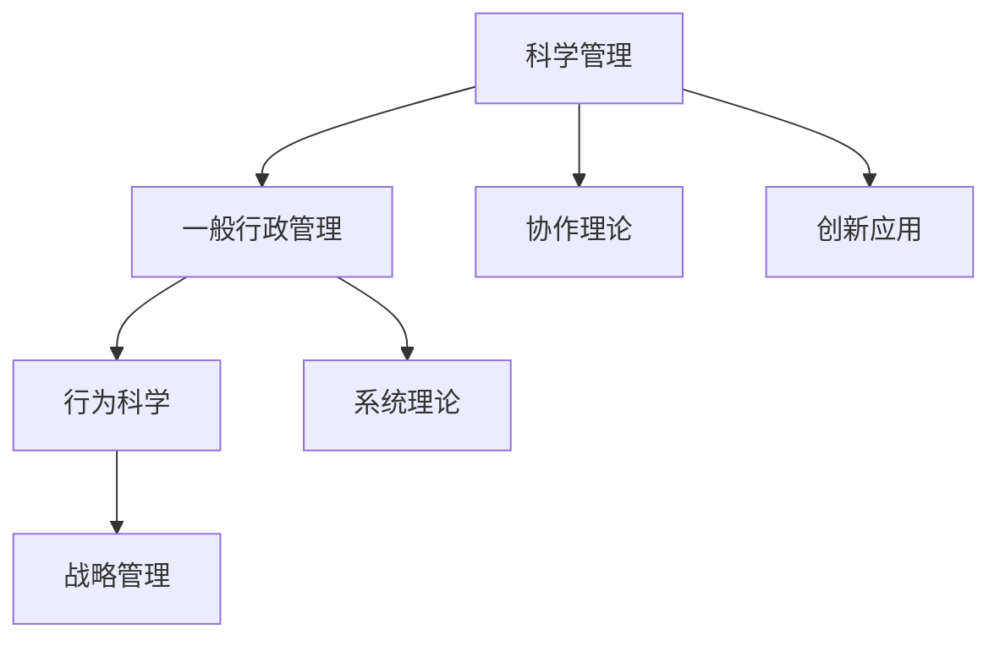

                 

# 经典管理理论在现代企业中的创新应用

> 关键词：经典管理理论,创新应用,企业战略,组织结构,领导力,敏捷管理,数据分析,人工智能

## 1. 背景介绍

### 1.1 问题由来

在现代社会中，企业的生存和发展面临着前所未有的挑战。随着市场的快速变化、技术的不断进步、消费者需求的日益多样化，企业管理者需要寻找新的方法来提高效率、优化资源配置、提升创新能力。与此同时，历史悠久的经典管理理论，如泰勒的科学管理、法约尔的行政管理、巴纳德的协作理论等，仍然具有重要的指导意义。这些理论不仅奠定了现代管理的基础，还为现代企业提供了多种创新应用的灵感。

### 1.2 问题核心关键点

在探讨经典管理理论在现代企业中的创新应用时，我们需要关注以下几个核心关键点：

1. **理论的有效性**：经典的理论在经历了长时间的应用和检验后，其核心思想是否仍然有效，是否适用于现代企业环境？
2. **理论的适用性**：如何将经典理论的核心理念与现代企业的实际情况相结合，实现理论与实践的有效对接？
3. **创新点**：在现代企业管理中，有哪些地方可以通过经典理论进行创新，提升企业的竞争力和创新能力？
4. **应用效果**：经典理论在实际应用中的效果如何？有哪些成功案例可以作为参考？

### 1.3 问题研究意义

研究经典管理理论在现代企业中的创新应用，具有重要的理论和实践意义：

1. **理论的更新与完善**：通过现代企业实践的检验，经典管理理论可以进行更新和完善，使其更符合现代企业发展的需求。
2. **实践的指导**：经典管理理论的核心理念可以为现代企业提供指导，帮助企业更好地应对复杂多变的外部环境。
3. **创新的驱动力**：经典管理理论的创新应用可以激发企业的创新思维，推动企业持续发展。
4. **全球化视角**：现代企业的国际化运营需要借鉴全球管理理论的最新研究成果，提升全球竞争力。

## 2. 核心概念与联系

### 2.1 核心概念概述

为了更好地理解经典管理理论在现代企业中的创新应用，本节将介绍几个密切相关的核心概念：

1. **科学管理（Scientific Management）**：由弗雷德里克·泰勒（Frederick Taylor）提出，强调通过科学方法提高工作效率。
2. **一般行政管理（Administrative Management）**：由亨利·法约尔（Henry Fayol）提出，强调组织的五个职能：计划、组织、指挥、协调和控制。
3. **协作理论（Theory of Social Systems）**：由切斯特·巴纳德（Chester Barnard）提出，强调组织中成员之间的协作与沟通。
4. **行为科学（Behavioral Science）**：研究人类在组织中的行为规律，包括领导行为、组织文化、员工激励等方面。
5. **系统理论（System Theory）**：强调企业作为一个系统，通过系统分析和管理提高整体效率。
6. **战略管理（Strategic Management）**：研究企业长期目标的制定和实现，包括竞争战略、公司战略等方面。

这些核心概念之间的逻辑关系可以通过以下Mermaid流程图来展示：



这个流程图展示了大企业管理理论的核心理念及其关联：

1. 科学管理通过提高工作效率，为企业的日常运营提供了基础保障。
2. 一般行政管理通过组织管理，确保各项工作的有序进行。
3. 协作理论关注组织内部成员的协作与沟通，提升整体团队效能。
4. 行为科学研究人类行为，为领导力和员工激励提供理论支持。
5. 系统理论将企业视为系统，通过系统方法实现整体优化。
6. 战略管理指导企业的长期发展方向，确保企业在竞争中占据优势。
7. 创新应用则是在这些理论的基础上，针对现代企业特点进行的创新实践。

## 3. 核心算法原理 & 具体操作步骤

### 3.1 算法原理概述

经典管理理论在现代企业中的创新应用，本质上是将这些经典理论的核心思想与现代企业的实际情况相结合，通过理论指导实践，实现管理效率和创新能力的提升。这一过程可以大致分为以下几个步骤：

1. **理论学习与理解**：深入研究经典管理理论的核心思想和应用方法。
2. **理论适用性分析**：评估理论是否适用于现代企业的具体情况，包括外部环境和内部管理需求。
3. **创新应用设计**：基于理论指导，设计创新的应用方案，以解决现代企业的实际问题。
4. **实践验证与优化**：在企业中实施创新应用，并通过反馈不断优化和改进。

### 3.2 算法步骤详解

以下将以“敏捷管理（Agile Management）”为例，详细讲解经典管理理论在现代企业中的应用步骤：

1. **理论学习与理解**：敏捷管理基于经典的项目管理和行为科学理论，强调快速响应变化、持续交付、以客户为中心等原则。
2. **理论适用性分析**：现代企业的快速变化和高不确定性环境，使得敏捷管理成为提高企业灵活性和市场响应能力的重要方法。
3. **创新应用设计**：设计敏捷管理的应用方案，包括Scrum框架、Kanban流程、DevOps实践等，以提高项目的执行效率和团队协作能力。
4. **实践验证与优化**：在企业中实施敏捷管理，通过持续改进和反馈，不断优化管理流程和工具，提升企业整体的敏捷性。

### 3.3 算法优缺点

敏捷管理的核心思想和应用方法，既有优点也有缺点：

**优点**：

1. **快速响应变化**：敏捷管理能够快速适应市场和环境的变化，提高企业的灵活性和适应性。
2. **提高团队协作**：敏捷管理通过团队协作和沟通，提升整体工作效率和团队凝聚力。
3. **持续改进**：敏捷管理强调持续改进，通过反馈循环不断优化管理过程。

**缺点**：

1. **实施难度大**：敏捷管理需要企业文化的深度变革，管理层和员工需要投入大量时间和精力进行培训和学习。
2. **过程复杂**：敏捷管理涉及多个角色和环节，管理复杂度较高，需要专业的指导和支持。
3. **效果评估困难**：敏捷管理的效果评估需要长期跟踪和数据支持，短期内难以看到明显成效。

### 3.4 算法应用领域

敏捷管理作为经典管理理论在现代企业中的应用之一，已经在多个领域得到了广泛的应用：

1. **软件开发**：敏捷管理通过Scrum框架和DevOps实践，提高了软件开发项目的执行效率和质量。
2. **市场营销**：敏捷市场管理通过快速响应市场变化，提高了产品和服务的市场适应性和客户满意度。
3. **运营管理**：敏捷运营管理通过持续改进和流程优化，提高了生产效率和供应链管理能力。
4. **人力资源管理**：敏捷人力资源管理通过灵活的招聘和培训，提升了员工的技能和积极性。

## 4. 数学模型和公式 & 详细讲解 & 举例说明

### 4.1 数学模型构建

在现代企业中，经典管理理论的创新应用往往需要构建数学模型来描述和分析企业的运作过程。以“系统理论（System Theory）”为例，可以构建如下数学模型：

设企业系统为一个有向图 $G(V, E)$，其中 $V$ 为节点集，表示企业中的各个组成部分（如部门、流程、员工等），$E$ 为边集，表示各组成部分之间的关系（如依赖、协作、信息流等）。

企业系统的状态可以用一个向量 $S$ 表示，其中每个分量 $S_i$ 表示节点 $V_i$ 的状态。企业系统的演化可以用动态系统方程描述：

$$
\frac{dS}{dt} = f(S, E)
$$

其中 $f$ 为系统动态方程，描述系统的演化规律。通过求解上述方程，可以预测企业系统在给定初始状态和系统结构下的未来状态。

### 4.2 公式推导过程

以“敏捷管理（Agile Management）”为例，推导其效果评估的数学模型：

设敏捷管理实施后，项目的完成时间、质量、成本等指标的变化量为 $X_1, X_2, X_3$。则项目的整体效果可以用加权平均指标 $X$ 表示：

$$
X = \alpha_1 X_1 + \alpha_2 X_2 + \alpha_3 X_3
$$

其中 $\alpha_1, \alpha_2, \alpha_3$ 为各指标的权重系数。通过分析敏捷管理实施前后的各项指标变化量，可以计算出敏捷管理的效果。

### 4.3 案例分析与讲解

以“精益生产（Lean Manufacturing）”为例，分析其数学模型：

设企业生产系统中的原材料、加工和成品的库存分别为 $S_{原材料}, S_{加工}, S_{成品}$，企业系统每天的生产量和需求量为 $P, D$。则企业的库存变化可以用以下动态系统方程描述：

$$
\frac{dS_{原材料}}{dt} = -P
$$

$$
\frac{dS_{加工}}{dt} = P - D
$$

$$
\frac{dS_{成品}}{dt} = D
$$

通过求解上述方程，可以预测企业库存的变化趋势，优化生产计划和库存管理，降低成本和提高效率。

## 5. 项目实践：代码实例和详细解释说明

### 5.1 开发环境搭建

在进行企业管理理论创新应用的项目实践前，我们需要准备好开发环境。以下是使用Python进行数据分析和模型构建的环境配置流程：

1. 安装Anaconda：从官网下载并安装Anaconda，用于创建独立的Python环境。

2. 创建并激活虚拟环境：
```bash
conda create -n management-env python=3.8 
conda activate management-env
```

3. 安装必要的库：
```bash
conda install numpy pandas scipy matplotlib seaborn scikit-learn statsmodels jupyter notebook ipython
```

完成上述步骤后，即可在`management-env`环境中开始项目实践。

### 5.2 源代码详细实现

以下是使用Python实现敏捷管理（Agile Management）的Scrum框架的代码实例：

```python
from collections import defaultdict

class ScrumProject:
    def __init__(self, team_size):
        self.team_size = team_size
        self.user_story_points = defaultdict(int)
        self.story_buffer = defaultdict(int)
        self.sprint_backlog = []

    def add_story(self, story, points):
        self.user_story_points[story] = points
        self.story_buffer[story] = points

    def start_sprint(self, sprint_id, iterations):
        sprint_backlog = []
        remaining_points = sum(self.user_story_points.values())
        for _ in range(iterations):
            for story in list(self.user_story_points):
                if remaining_points > 0:
                    points = min(self.user_story_points[story], remaining_points)
                    self.user_story_points[story] -= points
                    remaining_points -= points
                    sprint_backlog.append((story, points))
            remaining_points = 0
        self.sprint_backlog = sprint_backlog

    def run_sprint(self, sprint_id, iterations):
        remaining_points = sum(self.user_story_points.values())
        for _ in range(iterations):
            for story, points in self.sprint_backlog:
                if remaining_points > 0:
                    self.user_story_points[story] -= points
                    remaining_points -= points

    def report(self, sprint_id):
        print(f"Sprint {sprint_id}:")
        for story, points in self.user_story_points.items():
            print(f"{story}: {points} points remaining")

# 示例使用
project = ScrumProject(team_size=5)
project.add_story("Implement login feature", 20)
project.add_story("Implement search feature", 15)
project.add_story("Implement user profile feature", 10)
project.start_sprint(1, iterations=2)
project.run_sprint(1, iterations=2)
project.report(1)
```

### 5.3 代码解读与分析

让我们再详细解读一下关键代码的实现细节：

**ScrumProject类**：
- `__init__`方法：初始化敏捷项目管理的关键参数，如团队大小、用户故事点和故事缓冲区等。
- `add_story`方法：向项目中添加用户故事及其估算的积分（点数）。
- `start_sprint`方法：开始一个Sprint，按照Sprint计划将用户故事分解为任务并分配到团队成员。
- `run_sprint`方法：执行Sprint中的任务，根据实际完成情况更新故事进度。
- `report`方法：打印Sprint结束时的项目状态，显示未完成的用户故事及其剩余积分。

**示例使用**：
- 创建一个敏捷项目管理实例，并添加三个用户故事及其估算的积分。
- 开始一个Sprint，将任务分配给团队成员。
- 执行两个Sprint，并报告项目进展情况。

可以看到，敏捷管理的方法通过简单的数据结构设计和基本的操作，实现了Scrum框架的自动化实现。这种代码实现方法不仅适用于敏捷管理，也可以扩展到其他管理理论的实践应用中。

## 6. 实际应用场景

### 6.1 企业战略管理

在现代企业中，企业战略管理（Strategic Management）是决定企业长期发展的关键因素。经典的管理理论，如迈克尔·波特（Michael Porter）的五力模型、SWOT分析等，提供了分析市场竞争和制定战略的框架。

企业可以通过经典理论进行战略规划，制定长期发展目标和行动计划，提高竞争力和市场份额。例如，波特的五力模型可以帮助企业分析市场竞争环境，识别竞争对手、供应商、顾客和替代品的威胁和机会，从而制定相应的市场竞争策略。

### 6.2 组织结构设计

现代企业的组织结构设计（Organization Structure Design）需要考虑如何有效协调各个部门和成员，提高整体效率。经典的管理理论，如马克斯·韦伯（Max Weber）的官僚组织理论、赫茨伯格（Fredrick Herzberg）的双因素理论等，提供了组织结构设计的理论基础。

企业可以通过经典理论设计扁平化、去中心化的组织结构，提高决策效率和员工积极性。例如，韦伯的官僚组织理论强调层级结构、职责分工和标准化流程，有助于提高组织结构的稳定性和可控性。

### 6.3 领导力发展

领导力在现代企业管理中至关重要，经典的管理理论，如约翰·马克斯威尔（John Maxwell）的领导力五大原则、德鲁克（Peter Drucker）的目标管理等，提供了提升领导力的有效方法。

企业可以通过经典理论培养和提升领导者的影响力、沟通能力和决策能力，从而实现企业的战略目标。例如，马克斯威尔的领导力五大原则强调诚信、服务、人际关系、增值和成果导向，为领导者提供了提升领导力的指导。

### 6.4 人力资源管理

人力资源管理（Human Resource Management）是现代企业中不可或缺的一环。经典的管理理论，如厄威克（Luther Gulick）和厄尔·达文波特（Lyndall Urwick）的管理职能理论、马斯洛（Abraham Maslow）的需求层次理论等，提供了人力资源管理的理论基础。

企业可以通过经典理论优化人力资源管理流程，提高员工满意度和工作效率。例如，厄威克和达文波特的管理职能理论强调计划、组织、人事、指挥和协调五大职能，为企业的日常运营提供了管理指导。

### 6.5 数据分析与决策支持

数据分析（Data Analysis）和决策支持（Decision Support）是现代企业管理的重要工具。经典的管理理论，如戴明（W. Edwards Deming）的PDCA循环、朱兰（Joseph M. Juran）的三大质量工具等，提供了数据分析和决策支持的理论基础。

企业可以通过经典理论构建数据分析模型，优化生产流程和质量控制。例如，戴明的PDCA循环通过计划、执行、检查和行动四个步骤，持续改进企业运营效果。

### 6.6 人工智能与自动化

人工智能（Artificial Intelligence）和自动化（Automation）正在深刻改变现代企业的运营模式。经典的管理理论，如威廉·奥兹（William Orrick）的“人是技术”理论、梅尔文·柯宁（Melvin Konigsberg）的自组织理论等，提供了人工智能和自动化的管理视角。

企业可以通过经典理论优化人工智能和自动化系统的设计和应用，提升企业运营效率。例如，奥兹的“人是技术”理论强调人工智能和自动化系统应以人为中心，提升员工的参与感和工作效率。

## 7. 工具和资源推荐

### 7.1 学习资源推荐

为了帮助企业管理者系统掌握经典管理理论的创新应用，这里推荐一些优质的学习资源：

1. 《管理学》（Management）系列书籍：包括经典管理理论的基础知识和应用案例，适合企业管理者全面学习。
2. 《组织理论与设计》（Organization Theory and Design）课程：哈佛商学院开设的课程，涵盖组织结构和人力资源管理等内容。
3. 《领导力与变革》（Leadership and Change）书籍：研究领导力的经典著作，提供提升领导力的系统方法和案例分析。
4. 《数据驱动的决策》（Data-Driven Decision Making）课程：教授数据分析和决策支持的技术和方法，适合企业管理者应用。
5. 《人工智能与未来》（AI and the Future）书籍：探讨人工智能对现代企业管理的影响，提供企业应用人工智能的指导。

通过对这些资源的学习实践，相信你一定能够全面掌握经典管理理论的创新应用，并用于解决实际的企业管理问题。

### 7.2 开发工具推荐

高效的开发离不开优秀的工具支持。以下是几款用于企业管理理论创新应用开发的常用工具：

1. Jupyter Notebook：支持Python编程的交互式环境，适合进行数据分析和模型构建。
2. Microsoft Excel：强大的数据分析工具，适合进行财务分析和决策支持。
3. Tableau：数据可视化工具，适合进行企业数据分析和报告展示。
4. SQL：数据库查询语言，适合进行结构化数据的管理和分析。
5. Tableau Public：免费的数据可视化平台，适合进行公开数据分析和报告。

合理利用这些工具，可以显著提升企业管理理论创新应用的开发效率，加速创新迭代的步伐。

### 7.3 相关论文推荐

经典管理理论的创新应用源于学界的持续研究。以下是几篇奠基性的相关论文，推荐阅读：

1. "The Principles of Scientific Management"（弗雷德里克·泰勒）：阐述了科学管理的基本原理和方法。
2. "The 14 Principles of Management"（亨利·法约尔）：总结了一般管理理论的核心原则。
3. "The Theory of the Social System"（切斯特·巴纳德）：研究协作理论的基本框架和应用方法。
4. "Human Resource Management: A Critical Review of Current Trends and Research"（人力资源管理）：综述了人力资源管理的发展和最新研究成果。
5. "The Balanced Scorecard: Translating Strategy into Action"（平衡计分卡）：提出平衡计分卡的理论框架，用于企业战略管理。
6. "The Five Competitive Forces That Shape Strategy"（五力模型）：阐述了市场竞争的五种力量，指导企业的战略制定。

这些论文代表了大企业管理理论的发展脉络。通过学习这些前沿成果，可以帮助研究者把握学科前进方向，激发更多的创新灵感。

## 8. 总结：未来发展趋势与挑战

### 8.1 总结

本文对经典管理理论在现代企业中的创新应用进行了全面系统的介绍。首先阐述了经典管理理论的研究背景和创新应用的价值，明确了这些理论在现代企业管理中的指导意义。其次，从原理到实践，详细讲解了敏捷管理、企业战略、组织结构、领导力、数据分析等经典理论的创新应用，给出了具体的代码实现和案例分析。同时，本文还广泛探讨了经典理论在智能制造、人力资源、人工智能等领域的创新应用，展示了经典理论的广泛适用性和强大生命力。

通过本文的系统梳理，可以看到，经典管理理论在现代企业管理中仍然具有重要的指导意义，可以通过创新应用，提升企业的管理效率和创新能力。未来，随着企业管理环境的不断变化，经典理论需要不断更新和完善，以适应新的管理需求。

### 8.2 未来发展趋势

展望未来，经典管理理论在现代企业中的创新应用将呈现以下几个发展趋势：

1. **数据驱动管理**：随着大数据和人工智能技术的成熟，数据驱动的管理将成为企业决策的重要手段。通过数据分析和建模，企业可以更好地理解和优化管理过程。
2. **跨界融合管理**：经典管理理论将与其他学科如心理学、社会学、计算机科学等进行跨界融合，产生更多创新应用。例如，人工智能与行为科学结合，提升员工的情感管理和工作效率。
3. **持续改进管理**：敏捷管理和持续改进方法将被进一步推广，企业通过不断迭代和优化，提升运营效率和市场适应能力。
4. **文化管理**：企业文化建设将成为企业管理的重要环节，经典管理理论中的人本管理和价值观管理将得到更广泛的应用。
5. **全球化管理**：随着全球化进程的加速，企业将需要更多全球化管理的理论和实践，经典理论中的国际合作和多元化管理思想将得到更广泛的应用。

以上趋势凸显了经典管理理论在现代企业管理中的广阔前景。这些方向的探索发展，必将进一步提升企业的管理效率和创新能力，为企业管理带来新的变革。

### 8.3 面临的挑战

尽管经典管理理论在现代企业管理中具有重要的指导意义，但在迈向更加智能化、普适化应用的过程中，它仍面临着诸多挑战：

1. **理论与实践脱节**：经典理论的核心理念在现代企业管理中的应用需要不断调整和适应，有时理论的普适性会受到挑战。
2. **管理复杂性**：现代企业的管理复杂性不断增加，经典理论在应对复杂多变的环境时可能难以提供全面有效的解决方案。
3. **创新应用难度大**：经典理论的创新应用需要企业管理者具备高水平的管理素养和实践能力，往往难以广泛普及。
4. **适应性不足**：经典理论可能在特定领域或特定管理情景下难以取得理想的效果，需要进行针对性改进。
5. **变革阻力**：企业管理者对经典理论的创新应用可能存在抵触情绪，需要更多沟通和培训来推动变革。

### 8.4 研究展望

面对经典管理理论在现代企业管理中面临的挑战，未来的研究需要在以下几个方面寻求新的突破：

1. **理论与实践的深度融合**：通过管理实践的不断检验，对经典理论进行更新和完善，使其更加符合现代企业的发展需求。
2. **技术与管理结合**：将现代技术如大数据、人工智能、区块链等与经典管理理论相结合，提升企业管理效率和创新能力。
3. **全球化视角**：结合全球化管理理论和实践，推动企业管理国际化进程，提升企业的全球竞争力。
4. **跨学科研究**：将经典管理理论与心理学、社会学、计算机科学等学科进行跨学科研究，提供更全面的管理方法和视角。
5. **理论与数据驱动结合**：结合数据驱动管理方法，提升经典理论在企业管理中的应用效果，实现数据驱动与理论指导的双重支持。

这些研究方向将推动经典管理理论的进一步发展，为现代企业提供更全面、高效的管理指导。总之，经典管理理论在现代企业管理中仍然具有重要的指导意义，需要通过不断创新和优化，实现理论与实践的深度融合，推动企业持续发展。

## 9. 附录：常见问题与解答

**Q1：经典管理理论是否适用于所有类型的企业？**

A: 经典管理理论在不同类型的企业中都有其适用性，但也需根据企业的具体情况进行调整和适应。例如，敏捷管理适用于快速变化的市场环境，而传统制造企业可能更适合通过精益生产提高效率。

**Q2：经典管理理论在现代企业中如何进行创新应用？**

A: 经典管理理论的创新应用需要结合企业的实际情况，将其核心理念与现代管理技术和实践相结合。例如，敏捷管理通过Scrum框架和DevOps实践，将经典的项目管理和组织结构设计理论应用于软件开发和项目管理中。

**Q3：经典管理理论的创新应用有哪些成功案例？**

A: 经典管理理论的创新应用已经在一些成功的企业中得到了广泛应用。例如，谷歌（Google）通过敏捷管理和精益生产，提高了项目管理效率和产品质量；海尔（Haier）通过组织变革和文化管理，提升了企业创新能力和市场竞争力。

**Q4：经典管理理论在现代企业中存在哪些挑战？**

A: 经典管理理论在现代企业中的应用也面临一些挑战。例如，理论的普适性可能受到企业类型的限制，理论的复杂性可能增加管理难度，理论的创新应用需要企业管理者具备高水平的管理素养和实践能力。

**Q5：经典管理理论在现代企业中有哪些新的应用趋势？**

A: 经典管理理论在现代企业中的应用趋势包括数据驱动管理、跨界融合管理、持续改进管理、文化管理、全球化管理等。这些趋势将推动经典理论的进一步发展，提升企业管理效率和创新能力。

总之，经典管理理论在现代企业中仍然具有重要的指导意义，通过创新应用，可以提升企业管理效率和创新能力。同时，经典理论也需要不断更新和完善，以适应不断变化的管理需求。通过理论与实践的深度融合，经典管理理论将在企业管理中发挥更大的作用。

