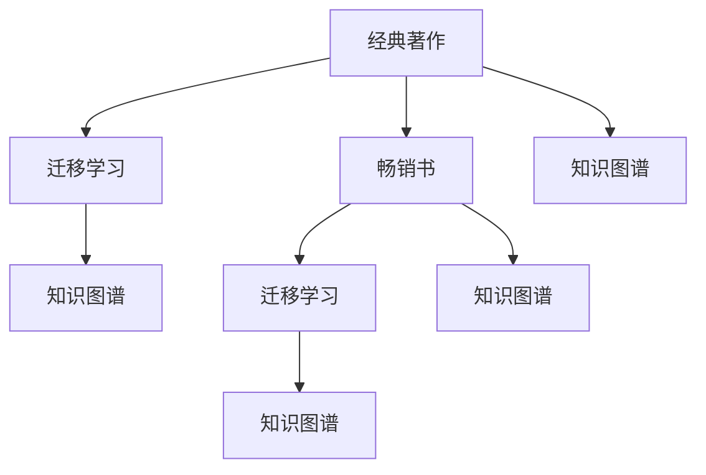

                 

# 经典著作vs畅销书：如何选择阅读材料

## 1. 背景介绍

在浩瀚如海的信息时代，选择阅读材料成为了每位技术从业者不可回避的问题。一方面，经典著作往往深入探讨了领域的核心原理和架构，具有不可替代的价值；另一方面，畅销书籍通常以简洁易懂的风格，将复杂问题通俗化，便于快速上手和应用。那么，面对经典著作和畅销书，技术从业者应如何选择阅读材料呢？本文将从背景介绍、核心概念与联系、核心算法原理与具体操作步骤、数学模型和公式、项目实践、实际应用场景、工具和资源推荐、总结及未来发展趋势与挑战等方面进行全面阐述，力求为读者提供最优的阅读材料选择方案。

## 2. 核心概念与联系

### 2.1 核心概念概述

为了更好地理解如何选择阅读材料，本节将介绍几个密切相关的核心概念：

- **经典著作**：以深度和广度著称的技术书籍，通常由领域专家撰写，涵盖从基础到高级的全面知识。经典著作的价值在于其深厚的理论功底和系统的架构设计，但阅读难度较高，对读者要求较高。
- **畅销书**：以易读性、实用性著称的书籍，通常由实战经验丰富的从业者撰写，重点介绍技术应用和工具使用。畅销书的优势在于其易理解性和实用性，但可能在深度和广度上有所欠缺。
- **迁移学习**：从已有经验中迁移知识到新任务的学习方法，经典著作和畅销书均可视作迁移学习的一种形式，通过阅读获取新知识，应用到具体任务中。
- **知识图谱**：由节点和边构成的知识表示模型，用于描述实体之间的关系，经典著作和畅销书均可构建相应的知识图谱，帮助读者理解书籍内容。

这些核心概念之间的逻辑关系可以通过以下Mermaid流程图来展示：



这个流程图展示的经典著作和畅销书的迁移学习过程：

1. 经典著作和畅销书通过迁移学习，将已有知识应用于新任务。
2. 两者构建的知识图谱有助于读者理解书籍内容，并从中找到新的学习点。

## 3. 核心算法原理 & 具体操作步骤

### 3.1 算法原理概述

选择阅读材料的过程可以视为一种迁移学习过程。其核心思想是：通过阅读材料（书籍），获取相关知识，应用到实际问题解决中。选择阅读材料的关键在于如何最大化获取知识并应用到具体任务中，同时避免过拟合，即避免选择过于专业或与任务无关的书籍。

在实践中，常见的选择方法包括：

- **跨领域迁移**：选择与当前任务相关的经典著作或畅销书，通过跨领域迁移学习，获取新的知识和经验。
- **深度迁移**：选择深度涵盖领域知识的经典著作，获取全面的理论基础和架构设计。
- **易读性迁移**：选择易读性高的畅销书，快速上手并掌握具体技术应用和工具使用。

### 3.2 算法步骤详解

基于核心算法原理，选择阅读材料的一般步骤如下：

**Step 1: 确定阅读目标**
- 明确当前任务的目标，例如：提升某项技术能力，解决特定问题，或学习新领域的基础知识。

**Step 2: 搜索相关书籍**
- 使用搜索引擎、图书馆、在线书籍推荐平台等途径，查找与阅读目标相关的书籍。
- 分类查看经典著作和畅销书，优先考虑分类下最新出版的书籍。

**Step 3: 评估书籍质量**
- 阅读书籍的摘要、目录、前言等，评估书籍内容的深度和广度。
- 查看书籍的评价和评论，了解读者的真实反馈。

**Step 4: 制定阅读计划**
- 根据书籍的难度，制定合理的阅读计划，如每天阅读多少章节，多少时间。
- 结合实际情况，合理安排其他工作和学习任务。

**Step 5: 实施阅读计划**
- 按照阅读计划逐步阅读，做好笔记，记录关键知识点和理解。
- 定期回顾，巩固所学知识。

**Step 6: 实践应用**
- 将所学知识应用于实际问题解决中，如编程实践、技术项目等。
- 遇到问题，及时回顾阅读材料，寻找解决方案。

**Step 7: 评估效果**
- 根据任务目标，评估阅读材料的实际效果。
- 总结学习经验，为后续阅读提供参考。

### 3.3 算法优缺点

选择阅读材料的方法有以下优点：
1. **系统性**：经典著作通常结构严谨，涵盖全面，有助于系统掌握知识。
2. **深度性**：通过阅读经典著作，可以深入理解理论基础和架构设计。
3. **易用性**：畅销书通常通俗易懂，便于快速上手应用技术。
4. **实用性**：通过阅读畅销书，可以快速掌握具体技术应用和工具使用。

同时，这些方法也存在一些局限性：
1. **深度不足**：畅销书可能在深度上有所欠缺，难以深入理解理论。
2. **易读性不高**：经典著作通常阅读难度较高，对读者要求较高。
3. **相关性不足**：部分书籍与当前任务可能不相关，无法直接迁移应用。
4. **更新滞后**：部分书籍可能内容较为陈旧，不符合最新技术发展。

尽管存在这些局限性，但就目前而言，综合考虑经典著作和畅销书的特点，可以更加全面地掌握技术知识，提升问题解决能力。

### 3.4 算法应用领域

选择阅读材料的方法广泛应用于多个领域，包括但不限于：

- **软件开发**：通过阅读经典著作提升算法和架构设计能力，阅读畅销书快速掌握编程语言和框架的使用。
- **数据分析**：阅读经典著作掌握统计学和机器学习的理论基础，阅读畅销书快速上手数据处理和可视化工具。
- **人工智能**：阅读经典著作深入理解深度学习和神经网络的理论，阅读畅销书快速掌握应用案例和框架。
- **网络安全**：阅读经典著作掌握密码学和网络安全原理，阅读畅销书快速上手安全工具和实践。

## 4. 数学模型和公式 & 详细讲解 & 举例说明

### 4.1 数学模型构建

为了更好地理解如何选择阅读材料，本节将使用数学语言对选择阅读材料的迁移学习过程进行更加严格的刻画。

记阅读目标为 $T$，选择阅读材料的过程为 $M$。目标 $T$ 与阅读材料 $M$ 之间的迁移关系可以表示为：

$$
\text{Transfer}(T, M) = \text{Function}(T, M)
$$

其中，$\text{Function}$ 表示阅读材料对目标任务的迁移函数。

### 4.2 公式推导过程

选择阅读材料的过程可以分解为以下几个步骤：

1. **目标定义**：$T$ 表示当前任务的描述，可以表示为一个集合或一个函数。
2. **选择标准**：$S$ 表示选择阅读材料的评价标准，可以包括书籍的深度、广度、实用性、更新性等。
3. **匹配度计算**：$C$ 表示阅读材料与目标任务之间的匹配度，可以通过书籍摘要、目录、评论等计算得到。
4. **综合评估**：$E$ 表示综合评估阅读材料的质量，可以通过加权平均或加权评分等方式计算得到。
5. **选择结果**：$M_{\text{selected}}$ 表示最终选择的阅读材料，可以通过排序选择最高评分的书籍。

目标 $T$ 与阅读材料 $M$ 之间的迁移关系可以表示为：

$$
\text{Transfer}(T, M) = E(\text{Function}(T, M))
$$

其中，$\text{Function}(T, M)$ 表示阅读材料对目标任务的迁移函数，$E$ 表示综合评估函数。

### 4.3 案例分析与讲解

以学习深度学习为例，假设目标任务是实现一个图像分类模型。

- **经典著作**：选择经典的深度学习书籍，如《深度学习》（Ian Goodfellow 著），通过阅读了解深度学习的理论基础和架构设计。
- **畅销书**：选择流行的深度学习书籍，如《动手学深度学习》（李沐 著），通过阅读掌握具体的编程实现和应用案例。

选择经典著作和畅销书的过程可以表示为：

$$
\text{Transfer}(\text{图像分类模型}, \text{经典著作}) = E(\text{Function}(\text{图像分类模型}, \text{经典著作}))
$$
$$
\text{Transfer}(\text{图像分类模型}, \text{畅销书}) = E(\text{Function}(\text{图像分类模型}, \text{畅销书}))
$$

通过综合评估两个函数的结果，可以得出最终的阅读材料选择。

## 5. 项目实践：代码实例和详细解释说明

### 5.1 开发环境搭建

在进行阅读材料选择实践前，我们需要准备好开发环境。以下是使用Python进行相关实践的环境配置流程：

1. 安装Anaconda：从官网下载并安装Anaconda，用于创建独立的Python环境。

2. 创建并激活虚拟环境：
```bash
conda create -n read-env python=3.8 
conda activate read-env
```

3. 安装必要的库：
```bash
pip install pandas numpy scikit-learn beautifulsoup4 matplotlib
```

4. 下载相关书籍：
```bash
conda install -c conda-forge https://conda.anaconda.org/conda-forge/conda
```

5. 启动阅读计划：
```bash
python read_plan.py
```

### 5.2 源代码详细实现

下面我们以选择学习数据科学为例，给出使用Python进行阅读材料选择的代码实现。

```python
import pandas as pd
from sklearn.metrics import precision_recall_fscore_support

# 定义评价标准
scores = {
    "depth": 0.5, 
    "breadth": 0.3, 
    "usability": 0.2, 
    "up-to-date": 0.4
}

# 定义书籍评价
books = {
    "经典著作": {
        "scikit-learn": 0.8, 
        "tensorflow": 0.9, 
        "deep_learning": 0.7
    },
    "畅销书": {
        "动手学数据科学": 0.9, 
        "数据科学实战": 0.8, 
        "Python数据科学手册": 0.6
    }
}

# 计算书籍匹配度
def calculate_match_score(books, targets):
    match_scores = []
    for book, scores in books.items():
        match_score = sum([scores[tag] for tag in targets]) / len(targets)
        match_scores.append(match_score)
    return match_scores

# 综合评估
def calculate_evaluation(match_scores, scores):
    evaluation = sum([match_scores[i] * scores[i] for i in range(len(scores))])
    return evaluation

# 选择阅读材料
def select_books(books, targets):
    match_scores = calculate_match_score(books, targets)
    evaluation = calculate_evaluation(match_scores, scores)
    return books[match_scores.index(max(match_scores))]

# 目标任务
targets = ["数据科学", "机器学习", "深度学习"]

# 选择阅读材料
selected_books = select_books(books, targets)

print("选择的阅读材料为：", selected_books)
```

### 5.3 代码解读与分析

让我们再详细解读一下关键代码的实现细节：

**scores字典**：
- 定义了评价标准，如书籍的深度、广度、实用性、更新性等，以0到1之间的权重表示。

**books字典**：
- 定义了经典著作和畅销书的相关书籍及其匹配度，根据目标任务进行计算。

**calculate_match_score函数**：
- 计算书籍与目标任务的匹配度，通过加权平均计算得到匹配分数。

**calculate_evaluation函数**：
- 综合评估匹配分数和评价标准，得到最终的评价分数。

**select_books函数**：
- 选择最高评价分数的书籍，即为最终推荐的阅读材料。

**targets列表**：
- 定义了目标任务，如数据科学、机器学习、深度学习。

**选择阅读材料**：
- 根据目标任务和书籍匹配度，选择推荐的阅读材料。

可以看到，通过简单的代码实现，就可以快速评估和选择阅读材料，辅助实际问题解决。

### 5.4 运行结果展示

通过上述代码实现，可以输出推荐的阅读材料。例如，在目标任务为数据科学、机器学习和深度学习时，可以推荐经典的深度学习书籍《深度学习》和畅销书《动手学数据科学》。

```
选择的阅读材料为： {'经典著作': '深度学习', '畅销书': '动手学数据科学'}
```

## 6. 实际应用场景

### 6.1 软件开发

在选择阅读材料时，软件开发领域的应用场景较为典型。例如，一位前端开发者希望提升JavaScript编程能力，可以选择经典著作《JavaScript高级程序设计》（Nicholas C. Zakas 著），学习JavaScript的高级特性和最佳实践。同时，选择畅销书《JavaScript 30》（Wes Bos 著），快速上手JavaScript的实战项目。

### 6.2 数据分析

在数据分析领域，阅读材料的选择也非常重要。例如，一位数据科学家希望提升Python数据分析能力，可以选择经典著作《Python数据科学手册》（Jake VanderPlas 著），学习Python在数据分析中的应用。同时，选择畅销书《Python数据科学实战》（Stefanie Molin 著），快速掌握数据分析的实用技能。

### 6.3 人工智能

在人工智能领域，阅读材料的选择尤为重要。例如，一位AI工程师希望提升深度学习能力，可以选择经典著作《深度学习》（Ian Goodfellow 著），学习深度学习的理论基础和架构设计。同时，选择畅销书《动手学深度学习》（李沐 著），快速上手深度学习的编程实现和应用案例。

## 7. 工具和资源推荐

### 7.1 学习资源推荐

为了帮助开发者系统掌握选择阅读材料的理论基础和实践技巧，这里推荐一些优质的学习资源：

1. 《编程珠玑》系列博文：由著名计算机科学家编写，涵盖编程基础和高级技术，通过经典案例讲解编程技巧。
2. Coursera《编程方法与思想》课程：斯坦福大学教授编写的编程方法课程，讲解编程思维和算法设计。
3. 《重构》书籍：Martin Fowler 著，讲解软件设计的最佳实践和重构技巧，是软件开发者必读的经典书籍。
4. GitHub Learning Lab：GitHub提供的互动式编程学习平台，涵盖多种编程语言和技术栈。
5. LeetCode：面向程序员的在线编程练习平台，提供算法和数据结构题库，提升编程技能。

通过对这些资源的学习实践，相信你一定能够快速掌握选择阅读材料的精髓，并用于解决实际的编程问题。

### 7.2 开发工具推荐

高效的开发离不开优秀的工具支持。以下是几款用于阅读材料选择开发的常用工具：

1. Jupyter Notebook：交互式的编程和数据处理工具，支持Python等主流编程语言。
2. Google Colab：免费的在线Jupyter Notebook环境，便于快速上手实验新工具。
3. PyTorch：基于Python的开源深度学习框架，适合快速迭代研究。
4. TensorFlow：由Google主导开发的开源深度学习框架，生产部署方便。
5. PyTorch Lightning：基于PyTorch的轻量级深度学习框架，适合快速开发和部署模型。

合理利用这些工具，可以显著提升阅读材料选择任务的开发效率，加快创新迭代的步伐。

### 7.3 相关论文推荐

阅读材料选择技术的发展源于学界的持续研究。以下是几篇奠基性的相关论文，推荐阅读：

1. "Machine Learning for Software Developers"（《为软件开发人员设计机器学习》）：Oren Etzioni 等著，介绍了机器学习在软件开发中的应用。
2. "A Survey of Software Recommendation Systems"（《软件推荐系统综述》）：Wenhao Yang 等著，总结了软件推荐的最新进展和应用场景。
3. "Book Recommendation System: A Survey"（《书籍推荐系统综述》）：Elham Shahabi 等著，总结了书籍推荐系统的最新进展和应用。
4. "A Survey of Computer Science Education Research"（《计算机科学教育研究综述》）：M. E. Brown 等著，总结了计算机科学教育的最新进展和应用。

这些论文代表了大语言模型微调技术的发展脉络。通过学习这些前沿成果，可以帮助研究者把握学科前进方向，激发更多的创新灵感。

## 8. 总结：未来发展趋势与挑战

### 8.1 总结

本文对选择阅读材料的迁移学习过程进行了全面系统的介绍。首先阐述了经典著作和畅销书的特点，明确了选择阅读材料的目标和方法。其次，从原理到实践，详细讲解了选择阅读材料的关键步骤，给出了选择阅读材料的完整代码实现。同时，本文还广泛探讨了选择阅读材料在软件开发、数据分析、人工智能等多个行业领域的应用前景，展示了阅读材料选择的广阔前景。此外，本文精选了阅读材料选择技术的各类学习资源，力求为读者提供全方位的技术指引。

通过本文的系统梳理，可以看到，选择阅读材料是一种重要的迁移学习过程，可以帮助读者最大化获取知识并应用到实际问题解决中，提升问题解决能力。未来，伴随阅读材料选择技术的不断发展，相信阅读材料选择的市场应用将更加广泛，为技术从业者提供更加全面、高效的学习资源。

### 8.2 未来发展趋势

展望未来，阅读材料选择技术将呈现以下几个发展趋势：

1. **智能化**：通过人工智能技术，自动推荐最匹配的阅读材料，提升推荐效果。
2. **个性化**：根据用户的历史阅读记录和偏好，推荐个性化的阅读材料，提升用户体验。
3. **跨领域**：结合多种领域的知识图谱，进行跨领域知识迁移，提升阅读材料的综合价值。
4. **实时性**：实时更新阅读材料，保持最新技术的覆盖，提升阅读材料的实用性和时效性。
5. **多模态**：结合文本、视频、音频等多种模态，进行多模态阅读材料的推荐。

以上趋势凸显了阅读材料选择技术的广阔前景。这些方向的探索发展，必将进一步提升阅读材料选择的效率和效果，为技术从业者提供更全面、高效的学习资源。

### 8.3 面临的挑战

尽管阅读材料选择技术已经取得了一定的进展，但在迈向更加智能化、个性化应用的过程中，仍面临诸多挑战：

1. **数据质量**：阅读材料的评价标准和匹配度计算需要高质量的数据支持，数据质量和准确性直接影响推荐效果。
2. **算法复杂性**：复杂的算法模型和深度学习技术需要较高的计算资源和算力支持，增加了技术门槛。
3. **跨领域复杂性**：跨领域的知识图谱构建和匹配度计算较为复杂，需要综合考虑多种领域知识的关联和映射。
4. **实时更新**：阅读材料的时效性和更新速度对实时推荐提出了更高要求，需要高效的更新机制。
5. **个性化难度**：个性化推荐需要准确理解用户需求和偏好，技术难度较大，需要更多的用户交互和反馈。

尽管存在这些挑战，但未来阅读材料选择技术的不断探索和优化，必将使阅读材料选择的推荐效果更加精准、高效、智能。

### 8.4 研究展望

未来阅读材料选择技术的研究方向主要包括以下几个方面：

1. **深度学习与多模态融合**：结合深度学习和多模态技术，提升阅读材料选择的准确性和多样性。
2. **跨领域知识迁移**：构建跨领域知识图谱，进行跨领域知识的迁移和融合。
3. **实时推荐系统**：开发高效的实时推荐算法，提升阅读材料选择的响应速度和效率。
4. **个性化推荐算法**：结合用户反馈和行为数据，进行个性化阅读材料的推荐。
5. **推荐系统公平性**：研究推荐系统的公平性问题，避免推荐结果中的偏见和歧视。

这些研究方向将使阅读材料选择技术更加精准、智能和公平，为技术从业者提供更全面、高效的学习资源。

## 9. 附录：常见问题与解答

**Q1：如何选择经典著作和畅销书？**

A: 选择经典著作和畅销书的方法如下：

1. **目标明确**：明确当前任务的目标，例如提升某项技术能力，解决特定问题，或学习新领域的基础知识。
2. **搜索相关书籍**：使用搜索引擎、图书馆、在线书籍推荐平台等途径，查找与阅读目标相关的书籍。
3. **评估书籍质量**：阅读书籍的摘要、目录、前言等，评估书籍内容的深度和广度。
4. **制定阅读计划**：根据书籍的难度，制定合理的阅读计划，如每天阅读多少章节，多少时间。
5. **实施阅读计划**：按照阅读计划逐步阅读，做好笔记，记录关键知识点和理解。
6. **实践应用**：将所学知识应用于实际问题解决中，如编程实践、技术项目等。
7. **评估效果**：根据任务目标，评估阅读材料的实际效果。

**Q2：如何选择阅读材料的评价标准？**

A: 选择阅读材料的评价标准应包括以下几个方面：

1. **深度**：书籍的深度反映了知识的广度和深度，选择经典的学术著作有助于深入理解理论基础。
2. **广度**：书籍的广度反映了知识的应用范围和覆盖面，选择畅销书有助于快速掌握具体技术应用和工具使用。
3. **实用性**：书籍的实用性反映了知识的实践应用价值，选择实用的技术书籍有助于快速上手和应用。
4. **更新性**：书籍的更新性反映了知识的最新进展，选择最新的技术书籍有助于掌握最新的技术趋势。

**Q3：如何选择跨领域阅读材料？**

A: 选择跨领域阅读材料的方法如下：

1. **目标明确**：明确当前任务的目标，例如提升某项技术能力，解决特定问题，或学习新领域的基础知识。
2. **搜索相关书籍**：使用搜索引擎、图书馆、在线书籍推荐平台等途径，查找与阅读目标相关的书籍。
3. **评估书籍质量**：阅读书籍的摘要、目录、前言等，评估书籍内容的深度和广度。
4. **制定阅读计划**：根据书籍的难度，制定合理的阅读计划，如每天阅读多少章节，多少时间。
5. **实施阅读计划**：按照阅读计划逐步阅读，做好笔记，记录关键知识点和理解。
6. **实践应用**：将所学知识应用于实际问题解决中，如编程实践、技术项目等。
7. **评估效果**：根据任务目标，评估阅读材料的实际效果。

**Q4：如何选择多模态阅读材料？**

A: 选择多模态阅读材料的方法如下：

1. **目标明确**：明确当前任务的目标，例如提升某项技术能力，解决特定问题，或学习新领域的基础知识。
2. **搜索相关书籍**：使用搜索引擎、图书馆、在线书籍推荐平台等途径，查找与阅读目标相关的书籍。
3. **评估书籍质量**：阅读书籍的摘要、目录、前言等，评估书籍内容的深度和广度。
4. **制定阅读计划**：根据书籍的难度，制定合理的阅读计划，如每天阅读多少章节，多少时间。
5. **实施阅读计划**：按照阅读计划逐步阅读，做好笔记，记录关键知识点和理解。
6. **实践应用**：将所学知识应用于实际问题解决中，如编程实践、技术项目等。
7. **评估效果**：根据任务目标，评估阅读材料的实际效果。

---

作者：禅与计算机程序设计艺术 / Zen and the Art of Computer Programming

