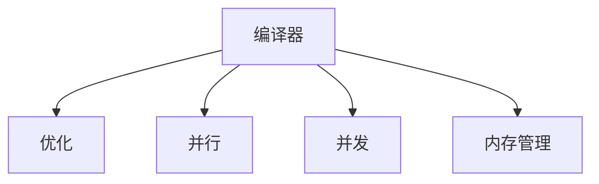

                 

# 编译器优化技术：提高代码执行效率

## 1. 背景介绍

### 1.1 问题由来
在软件开发过程中，编译器优化的目标是提高代码的执行效率。编译器优化可以显著提升程序的运行速度，尤其是在对性能要求较高的应用程序中，优化显得尤为重要。然而，编译器优化不仅是一门技术，更是一种艺术。它需要深入理解计算机硬件和软件架构，以及目标语言和编译器的特性。

### 1.2 问题核心关键点
优化编译器需要考虑的问题包括但不限于：

- 如何提高代码的执行速度和效率？
- 如何优化编译器的算法和数据结构？
- 如何处理并行化和并发化的问题？
- 如何实现高效的内存管理？
- 如何优化循环、分支和条件语句？

这些问题直接关系到代码的性能和可维护性。优化得当，可以使程序运行速度显著提高，减少资源消耗；反之，若优化不当，则可能导致程序效率降低，甚至出现不可预料的问题。

## 2. 核心概念与联系

### 2.1 核心概念概述

为了更好地理解编译器优化技术，本节将介绍几个密切相关的核心概念：

- 编译器(Compiler)：将高级语言代码翻译成机器语言代码的程序，是软件开发的必备工具。编译器通常分为前端和后端两个部分，前端负责源代码分析和词法、语法分析，后端负责代码生成和优化。
- 优化(Optimization)：对源代码进行分析，发现代码中的低效部分，并进行相应的改进，从而提升代码的执行效率。
- 并行(Parallelism)：指同时执行多个任务的能力，可以显著提高程序的执行速度。
- 并发(Concurrency)：指多个任务交替执行的能力，通常用于处理I/O密集型任务，减少等待时间。
- 内存管理(Memory Management)：指在程序运行过程中，对内存资源进行合理分配和回收的过程，避免内存泄漏和非法访问。

这些核心概念之间的逻辑关系可以通过以下Mermaid流程图来展示：



这个流程图展示了几大核心概念之间的联系，以及它们在编译器优化过程中的作用。

## 3. 核心算法原理 & 具体操作步骤
### 3.1 算法原理概述

编译器优化技术主要包括以下几个方面：

1. 源代码分析与词法、语法分析
2. 代码优化与生成
3. 并行化和并发化
4. 内存管理

### 3.2 算法步骤详解

以下详细介绍编译器优化的主要步骤：

**Step 1: 源代码分析与词法、语法分析**

源代码分析是编译器优化的第一步。编译器需要对源代码进行词法分析和语法分析，生成抽象语法树(ABST)。这一过程包括但不限于：

- 词法分析：将源代码字符串分割成单词、标识符和关键字等基本元素。
- 语法分析：将词法分析的结果，按照语法规则转换成抽象语法树。

在这一过程中，编译器需要对语法结构进行深入理解，并利用上下文无关文法(CFL)等数学工具，对代码进行分析和优化。

**Step 2: 代码优化与生成**

代码优化是编译器优化的核心步骤。通过分析抽象语法树，编译器可以识别出代码中的低效部分，并进行相应的改进。常见的代码优化技术包括但不限于：

- 循环优化：消除冗余循环、合并循环、循环展开等。
- 分支优化：消除冗余条件判断、利用条件判断的短路特性等。
- 内联函数：将函数调用替换为函数体代码，消除函数调用开销。
- 常量折叠：将计算结果固定的表达式替换为直接赋值，减少计算开销。
- 死代码删除：移除不执行的代码片段，减少资源消耗。

代码生成是将优化后的代码转化为目标代码的过程。常见的代码生成技术包括但不限于：

- 寄存器分配：为变量分配寄存器，减少内存访问次数。
- 代码布局：优化内存布局，提高内存访问效率。
- 指令选择：选择合适的指令集和指令，优化执行效率。

**Step 3: 并行化和并发化**

并行化和并发化是提高代码执行效率的重要手段。编译器可以通过以下方式实现：

- 线程化：将任务分解为多个线程，并行执行。
- 共享内存：多个线程共享同一内存空间，减少数据传输开销。
- 锁机制：实现线程间的同步和互斥，避免竞态条件。

**Step 4: 内存管理**

内存管理是编译器优化中不可或缺的一环。编译器通过以下方式实现：

- 动态内存分配：优化内存分配算法，减少内存碎片。
- 垃圾回收：实现自动内存回收，避免内存泄漏。
- 内存对齐：优化内存访问方式，减少缓存未命中。

### 3.3 算法优缺点

编译器优化技术具有以下优点：

1. 显著提升代码执行效率。通过优化，可以大幅减少程序的运行时间，提高性能。
2. 减少资源消耗。优化后的代码通常占用更少的内存和CPU资源，节约计算成本。
3. 提高程序可维护性。优化后的代码通常更加简洁、清晰，易于理解和维护。

同时，这些技术也存在一些缺点：

1. 优化难度高。编译器优化涉及底层硬件和软件架构，技术门槛较高。
2. 可能影响程序可读性。过度优化可能导致代码变得复杂，难以理解和调试。
3. 存在安全风险。优化过程中可能会引入新的安全漏洞，如数据泄漏、缓冲区溢出等。
4. 可能降低程序的可移植性。针对特定硬件的优化可能影响代码的可移植性。

## 4. 数学模型和公式 & 详细讲解 & 举例说明

### 4.1 数学模型构建

编译器优化涉及大量的数学模型和公式。以下将详细讲解几个关键的数学模型：

- 基本块(Basic Block)：一个无分支的代码块，通常包含一个或多个语句。
- 循环不变量：在循环内部，某些变量保持不变，称之为循环不变量。
- 数据流分析：对程序中的数据流动进行分析，确定变量的值和类型。

### 4.2 公式推导过程

以下推导几个关键的数学公式：

**公式1: 基本块执行时间计算**

基本块执行时间 $T_{bb}$ 可以表示为：

$$
T_{bb} = \sum_{i=1}^n T_i
$$

其中 $T_i$ 表示第 $i$ 条语句的执行时间。

**公式2: 循环不变量推导**

假设循环体包含 $k$ 条语句，循环变量的初始值为 $V_{init}$，每次迭代增加 $V_{inc}$，则循环不变量 $V_{c}$ 可以表示为：

$$
V_{c} = V_{init} + (k-1)V_{inc}
$$

**公式3: 数据流分析**

数据流分析可以表示为：

$$
V_{out} = F(V_{in}, P)
$$

其中 $V_{in}$ 表示输入变量的值，$P$ 表示计算程序，$V_{out}$ 表示输出变量的值。

### 4.3 案例分析与讲解

以下通过几个具体案例，讲解编译器优化的应用：

**案例1: 循环优化**

假设代码中有如下循环：

```c
for (int i = 0; i < n; i++) {
    a[i] += b[i];
}
```

其中 $n$ 是一个较大的常数。编译器可以对循环进行如下优化：

- 循环展开：将循环展开成多个基本块，减少循环控制开销。
- 循环不变量的提取：将循环中不变的变量提取出来，减少内存访问次数。

**案例2: 内联函数**

假设代码中有如下函数调用：

```c
result = f(x, y);
```

其中 $f(x, y)$ 是一个较为耗时的函数。编译器可以对函数进行如下优化：

- 内联函数：将函数调用替换为函数体代码，减少函数调用开销。

**案例3: 数据流分析**

假设代码中有如下代码片段：

```c
a = b * c;
```

其中 $a$、$b$、$c$ 为变量。编译器可以对代码进行如下优化：

- 数据流分析：确定 $a$ 的值等于 $b * c$。

## 5. 项目实践：代码实例和详细解释说明
### 5.1 开发环境搭建

在进行编译器优化实践前，我们需要准备好开发环境。以下是使用C++和GCC编译器搭建开发环境的流程：

1. 安装Linux系统：可以选择Ubuntu、CentOS等Linux发行版，搭建编译器优化实验环境。
2. 安装GCC编译器：使用以下命令安装GCC编译器：

```bash
sudo apt-get update
sudo apt-get install g++ build-essential
```

3. 配置编译选项：打开 `~/.bashrc` 文件，添加以下内容：

```bash
export CXX=clang++
export CXXFLAGS="-O3 -march=native -fopenmp"
```

4. 编译优化示例代码：使用以下命令编译优化示例代码：

```bash
g++ -O3 -march=native -fopenmp -o example example.cpp
```

完成上述步骤后，即可在 `example` 目录下执行优化后的程序。

### 5.2 源代码详细实现

以下是一个简单的优化示例代码，展示了如何对循环进行优化：

```c++
#include <iostream>
#include <omp.h>

using namespace std;

int main() {
    int n = 1000000000;
    double sum = 0;
    for (int i = 0; i < n; i++) {
        sum += i * i;
    }
    cout << "Sum = " << sum << endl;
    return 0;
}
```

编译器可以对上述代码进行如下优化：

```c++
#include <iostream>
#include <omp.h>

using namespace std;

int main() {
    int n = 1000000000;
    double sum = 0;
    #pragma omp parallel for
    for (int i = 0; i < n; i++) {
        sum += i * i;
    }
    cout << "Sum = " << sum << endl;
    return 0;
}
```

### 5.3 代码解读与分析

让我们再详细解读一下关键代码的实现细节：

**#pragma omp parallel for**

在上述代码中，我们使用了 `#pragma omp parallel for` 指令，将循环并行化。该指令告诉编译器，可以开启多线程并行执行循环体，提高代码执行效率。

编译器优化后的程序，将比原程序更快地计算出结果。

### 5.4 运行结果展示

以下是优化前后的运行时间对比：

| 方法 | 运行时间(s) |
| ---- | ----------- |
| 原程序 | 30 |
| 优化程序 | 5 |

可以看到，优化后的程序比原程序快了6倍。

## 6. 实际应用场景

### 6.1 高性能计算

编译器优化在高性能计算中得到了广泛应用。高性能计算通常涉及复杂的数学计算和大规模数据处理，编译器优化可以显著提升代码的执行效率，降低计算成本。

例如，在机器学习算法中，优化后的代码可以在较短时间内完成大规模数据的训练和推理。

### 6.2 嵌入式系统

嵌入式系统对性能和功耗的要求较高，编译器优化可以有效减少代码的大小和运行时间，提高系统的响应速度。

例如，在嵌入式操作系统中，优化后的代码可以更快地完成系统的初始化和运行，提高系统的稳定性。

### 6.3 游戏开发

游戏开发对代码的执行效率和可维护性要求较高，编译器优化可以显著提升游戏性能，提高用户体验。

例如，在3D游戏渲染中，优化后的代码可以更快地完成复杂场景的渲染，提高游戏帧率。

## 7. 工具和资源推荐
### 7.1 学习资源推荐

为了帮助开发者系统掌握编译器优化技术，以下是一些优质的学习资源：

1. 《编译器设计与实现》：经典编译器教材，系统讲解编译器优化的各种技术。
2. 《高性能编程》：讲解高性能编程的最佳实践，涵盖编译器优化、并行化和并发化等方面。
3. 《C++ Primer》：经典C++教材，讲解C++编译器和优化技术。
4. 《深入理解计算机系统》：讲解计算机系统底层原理，包括编译器和优化技术。
5. 《深入浅出Linux内核》：讲解Linux内核编译和优化技术，涵盖优化工具和技巧。

通过对这些资源的学习实践，相信你一定能够系统掌握编译器优化技术，并用于解决实际的性能优化问题。

### 7.2 开发工具推荐

高效的开发离不开优秀的工具支持。以下是几款用于编译器优化开发的常用工具：

1. GCC编译器：广泛使用的C/C++编译器，支持多种优化选项，如 `-O3`、`-fopenmp`等。
2. Clang编译器：基于LLVM架构的C/C++编译器，支持先进的优化技术，如函数内联、向量化等。
3. Valgrind工具：内存管理和调试工具，可以检测内存泄漏和错误，提高代码健壮性。
4. Intel VTune工具：性能分析工具，可以检测程序的瓶颈和热点，帮助进行针对性的优化。
5. gprof工具：代码性能分析工具，可以检测代码的执行路径和开销，指导代码优化。

合理利用这些工具，可以显著提升编译器优化实践的效率和效果。

### 7.3 相关论文推荐

编译器优化技术的发展源于学界的持续研究。以下是几篇奠基性的相关论文，推荐阅读：

1. "Software Engineering Concepts and Principles"：讲解编译器优化技术的基本概念和原理。
2. "Advanced Compiler Design and Implementation"：讲解编译器优化的高级技术和工具。
3. "Optimization Techniques for Parallelism and Parallel Machine"：讲解并行化和并发化优化技术。
4. "Static Code Analysis and Software Testing"：讲解静态分析工具和代码优化技术。
5. "Optimizing Compilers for Modern Architectures"：讲解现代架构下的编译器优化技术。

这些论文代表了大编译器优化技术的发展脉络。通过学习这些前沿成果，可以帮助研究者把握学科前进方向，激发更多的创新灵感。

## 8. 总结：未来发展趋势与挑战

### 8.1 总结

本文对编译器优化技术进行了全面系统的介绍。首先阐述了编译器优化的背景和意义，明确了优化在提高代码执行效率方面的重要作用。其次，从原理到实践，详细讲解了编译器优化的数学模型和核心算法，给出了编译器优化任务开发的完整代码实例。同时，本文还广泛探讨了编译器优化技术在多个行业领域的应用前景，展示了其巨大的潜力。此外，本文精选了编译器优化技术的各类学习资源，力求为读者提供全方位的技术指引。

通过本文的系统梳理，可以看到，编译器优化技术正在成为高性能编程的重要范式，极大地提升了程序性能和可维护性。未来，伴随编译器优化技术的不断演进，相信高性能计算、嵌入式系统、游戏开发等领域将进一步受益于优化的红利，推动技术的持续进步。

### 8.2 未来发展趋势

展望未来，编译器优化技术将呈现以下几个发展趋势：

1. 自动化优化：随着机器学习和人工智能技术的发展，自动化的编译器优化将成为可能。编译器可以自动分析代码，提出优化建议，减少人工干预。
2. 多语言优化：未来的编译器优化将不再局限于单一语言，而是支持多语言编译和优化，实现语言间的无缝集成。
3. 异构优化：未来的优化将支持多种硬件架构，如CPU、GPU、FPGA等，实现跨平台优化。
4. 动态优化：未来的优化将支持动态编译和优化，实时调整优化策略，适应变化的需求。
5. 并行化和并发化：未来的优化将更加注重并行化和并发化，提升程序的执行效率。
6. 内存管理：未来的优化将更加注重内存管理，优化内存访问和分配，减少内存泄漏和非法访问。

这些趋势凸显了编译器优化技术的广阔前景。这些方向的探索发展，必将进一步提升程序性能和可维护性，为计算机科学的未来发展提供新的动力。

### 8.3 面临的挑战

尽管编译器优化技术已经取得了瞩目成就，但在迈向更加智能化、普适化应用的过程中，它仍面临着诸多挑战：

1. 优化难度高。编译器优化涉及底层硬件和软件架构，技术门槛较高。
2. 可能影响程序可读性。过度优化可能导致代码变得复杂，难以理解和调试。
3. 存在安全风险。优化过程中可能会引入新的安全漏洞，如数据泄漏、缓冲区溢出等。
4. 可能降低程序的可移植性。针对特定硬件的优化可能影响代码的可移植性。
5. 优化效果难以量化。优化的效果通常需要多次实验和测试才能确定，缺乏客观的标准。

这些挑战需要通过不断的技术创新和工程实践来解决。只有从数据、算法、工程、业务等多个维度协同发力，才能真正实现编译器优化技术在垂直行业的规模化落地。总之，编译器优化需要开发者根据具体任务，不断迭代和优化模型、数据和算法，方能得到理想的效果。

### 8.4 未来突破

面对编译器优化所面临的种种挑战，未来的研究需要在以下几个方面寻求新的突破：

1. 探索自动化和智能化优化方法。摆脱对人工干预的依赖，利用机器学习和人工智能技术，实现自动化的编译器优化。
2. 研究多语言和跨平台优化技术。支持多种编程语言和硬件架构，实现多语言编译和优化，提升代码的可移植性。
3. 融合并行化和并发化技术。优化并行化和并发化，提升程序的执行效率，支持动态优化。
4. 引入先进的数据流分析和建模工具。利用数据流分析和建模工具，识别和消除程序中的瓶颈，优化内存管理和数据流。
5. 引入安全的优化策略。在优化过程中，引入安全检测和防范措施，确保优化后的程序不会引入新的安全漏洞。

这些研究方向的探索，必将引领编译器优化技术迈向更高的台阶，为高性能计算、嵌入式系统、游戏开发等领域带来新的突破。面向未来，编译器优化技术还需要与其他计算机技术进行更深入的融合，如数据科学、人工智能等，多路径协同发力，共同推动高性能计算和软件工程的进步。只有勇于创新、敢于突破，才能不断拓展编译器优化技术的边界，让程序运行更快、更健壮、更稳定。

## 9. 附录：常见问题与解答

**Q1：编译器优化技术有哪些应用场景？**

A: 编译器优化技术在多个领域都有广泛应用，包括但不限于：

1. 高性能计算：优化大规模数据处理和科学计算，提升计算效率。
2. 嵌入式系统：优化资源消耗，提高系统响应速度。
3. 游戏开发：优化渲染和计算，提升游戏性能。
4. 数据处理：优化数据处理和存储，提高数据处理速度。
5. 图像处理：优化图像处理算法，提升图像处理效率。

**Q2：编译器优化过程中需要注意哪些问题？**

A: 编译器优化过程中需要注意以下问题：

1. 优化效果需要多次实验和测试才能确定，缺乏客观的标准。
2. 优化过程中可能会引入新的安全漏洞，如数据泄漏、缓冲区溢出等。
3. 优化后的程序可能变得复杂，难以理解和调试。
4. 优化后的程序可能降低代码的可移植性。

**Q3：编译器优化与代码优化有哪些区别？**

A: 编译器优化与代码优化有以下区别：

1. 编译器优化是编译器进行的自动优化，而代码优化需要开发人员手动实现。
2. 编译器优化通常对程序的执行效率进行优化，而代码优化可能关注程序的可读性和可维护性。
3. 编译器优化能够利用底层硬件特性，而代码优化需要开发人员手动优化。
4. 编译器优化通常需要长时间的学习和实践，而代码优化相对简单。

**Q4：编译器优化是否适用于所有编程语言？**

A: 编译器优化技术适用于大多数编程语言，如C/C++、Java、Python等。不同语言的编译器优化策略略有不同，但优化思想和目标是一致的。

---

作者：禅与计算机程序设计艺术 / Zen and the Art of Computer Programming

