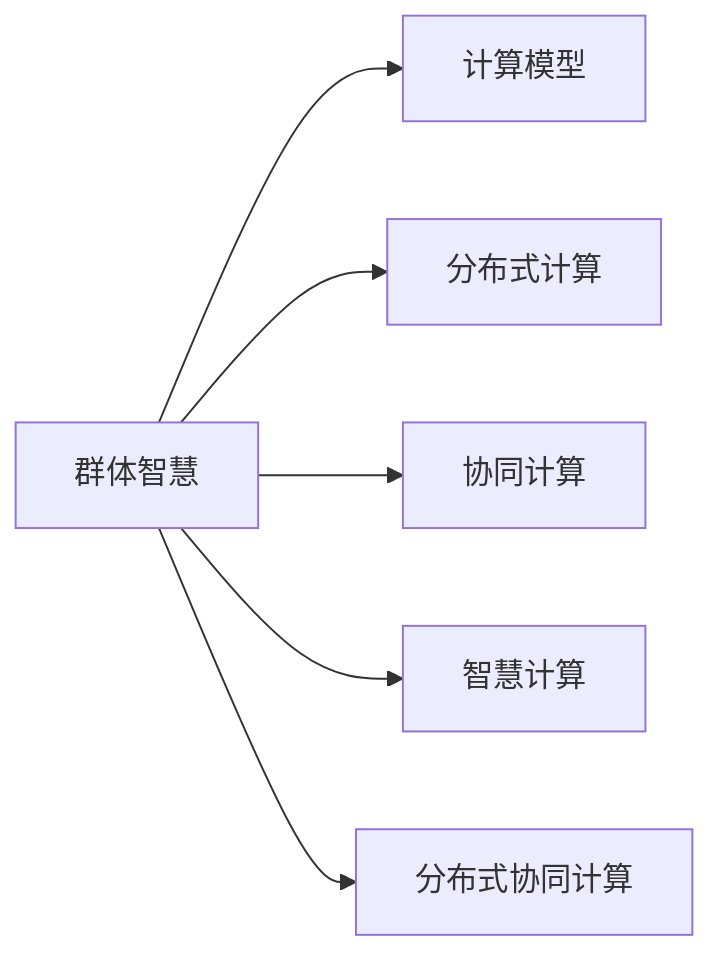

                 

# 群体智慧：人类计算的精髓

## 1. 背景介绍

在人类文明的历史长河中，计算始终是推动社会进步的重要动力。从最早的计算工具，到古罗马时代的日晷、算盘，再到文艺复兴时期的机械钟，计算能力的提升直接促进了知识积累和科技革命的爆发。到了现代社会，计算已经成为人们日常工作和生活中不可或缺的一部分。然而，在计算方式的演进过程中，从机械化计算到电子化计算，再到现今的数字化、智能化计算，计算模式的变革始终伴随着人类智慧的闪耀。

### 1.1 计算方式的演进

人类计算的演进可以分为四个主要阶段：

1. **机械化计算**：最初，人们依赖机械工具进行计算，如算盘、齿轮机等。这些工具虽然速度慢、精度低，但为后来的自动化计算奠定了基础。
   
2. **电子化计算**：随着电子元件的发明，人们开始使用电子管、晶体管等进行计算。这一阶段，计算的速度和精度都得到了极大的提升，但计算成本依然较高。

3. **数字化计算**：随着计算机的发明和普及，人们通过数字电路进行计算。这一阶段，计算效率和成本都有了显著的降低，但计算的复杂性和处理能力仍然有限。

4. **智能化计算**：现如今，随着人工智能、大数据、云计算等技术的发展，计算模式逐渐向智能化、分布式方向演进。计算不再是单纯的数值运算，而是融合了海量数据、复杂算法、分布式系统等多种技术的综合应用。

### 1.2 计算与智慧的融合

在计算演进的过程中，计算与智慧的融合始终是推动技术进步的重要方向。从简单的数值计算到复杂的算法优化，从单机的局部计算到分布式的协同计算，计算智慧的提升始终离不开人类智慧的贡献。随着计算能力的不断增强，人类智慧在计算中的应用也不断深入，从而推动了科技的飞速发展。

## 2. 核心概念与联系

### 2.1 核心概念概述

为了更好地理解群体智慧与计算的深度融合，本节将介绍几个密切相关的核心概念：

- **群体智慧**：指通过协同、分布式、集成的计算方式，利用集体智慧来解决问题的方法。与传统集中式计算不同，群体智慧强调计算的分布性和协作性，通过多台计算机、多个人工智能模型、多组数据等资源进行联合计算，从而实现更高效、更准确的结果。

- **计算模型**：指计算过程中采用的数据处理、算法优化、系统架构等方法和技术。从早期的数值计算、代数计算，到现代的机器学习、深度学习，计算模型不断演进，推动了计算能力的大幅提升。

- **分布式计算**：指将计算任务分解为多个子任务，分布在多个计算节点上进行并行处理的技术。通过分布式计算，可以大幅提升计算效率，实现复杂问题的快速解决。

- **协同计算**：指多个计算机、多个人工智能模型、多组数据等资源进行协同工作的计算方式。通过协同计算，可以充分利用各个节点的计算资源和信息，提高整体计算效率和结果的准确性。

- **智慧计算**：指将人类智慧融入计算过程中，通过智能算法、专家知识、自然语言处理等多种手段，提升计算的智能性和适应性。智慧计算强调计算与智慧的深度融合，使计算机能够更好地理解和模拟人类思维。

- **分布式协同计算**：指将分布式计算与协同计算相结合，通过多台计算机、多个人工智能模型、多组数据等资源进行联合计算，实现更高效、更准确的计算结果。

这些核心概念之间的逻辑关系可以通过以下Mermaid流程图来展示：



这个流程图展示了几大核心概念之间的相互关系：

1. 群体智慧是核心，利用计算模型、分布式计算、协同计算、智慧计算等多种技术手段，实现高效、准确的计算结果。
2. 计算模型为群体智慧提供了技术支持，使计算过程更加高效和精确。
3. 分布式计算和协同计算分别从并行和联合计算两个维度提升了计算效率。
4. 智慧计算将人类智慧融入计算过程，提升了计算的智能性和适应性。
5. 分布式协同计算是分布式计算和协同计算的结合，进一步提升了计算的效率和准确性。

## 3. 核心算法原理 & 具体操作步骤

### 3.1 算法原理概述

群体智慧的核心算法原理可以概括为分布式协同计算，即通过多台计算机、多个人工智能模型、多组数据等资源进行联合计算，实现更高效、更准确的计算结果。其基本思想是将大规模计算任务分解为多个子任务，分布在多个计算节点上进行并行处理，并利用协同计算技术将这些节点联合起来，共同解决复杂问题。

具体来说，群体智慧的算法原理包括以下几个关键步骤：

1. 将计算任务分解为多个子任务。
2. 在多个计算节点上并行执行这些子任务。
3. 通过协同计算技术将这些节点联合起来，共享计算资源和信息。
4. 汇总各节点的计算结果，进行综合分析，得出最终结果。

### 3.2 算法步骤详解

群体智慧的算法步骤如下：

1. **任务分解**：将大规模计算任务分解为多个子任务。
2. **节点分配**：将每个子任务分配到不同的计算节点上进行并行处理。
3. **节点协同**：利用协同计算技术将这些节点联合起来，共享计算资源和信息。
4. **结果汇总**：汇总各节点的计算结果，进行综合分析，得出最终结果。

### 3.3 算法优缺点

群体智慧的算法具有以下优点：

1. 高效性：通过分布式计算和协同计算，群体智慧可以大幅提升计算效率，实现复杂问题的快速解决。
2. 准确性：协同计算和分布式计算可以充分利用多个节点的计算资源和信息，提高计算结果的准确性。
3. 灵活性：群体智慧可以根据计算任务的不同，灵活选择计算资源和算法，适应不同的计算场景。

同时，群体智慧的算法也存在一些缺点：

1. 复杂性：群体智慧的算法设计和管理相对复杂，需要考虑节点之间的通信、数据同步等问题。
2. 资源消耗：分布式计算和协同计算需要占用大量的计算资源，包括计算节点、网络带宽等。
3. 安全性：分布式计算和协同计算存在数据泄露、攻击等安全风险，需要采取相应的安全措施。

### 3.4 算法应用领域

群体智慧的算法应用广泛，涵盖多个领域：

1. **科学研究**：在天文观测、物理学、生物学等科学领域，群体智慧被用于处理和分析海量数据，解决复杂的科学问题。
2. **金融分析**：在金融分析领域，群体智慧被用于股票预测、风险评估、欺诈检测等任务，提升金融系统的安全性和稳定性。
3. **医疗诊断**：在医疗诊断领域，群体智慧被用于病历分析、影像识别、基因组分析等任务，提升医疗诊断的准确性和效率。
4. **智能交通**：在智能交通领域，群体智慧被用于交通流量预测、事故检测、智能调度等任务，提升交通系统的效率和安全性。
5. **气候研究**：在气候研究领域，群体智慧被用于气象数据处理、气候预测、环境监测等任务，提升气候研究的科学性和准确性。
6. **网络安全**：在网络安全领域，群体智慧被用于威胁检测、漏洞扫描、恶意软件分析等任务，提升网络系统的安全性和稳定性。

## 4. 数学模型和公式 & 详细讲解 & 举例说明

### 4.1 数学模型构建

为了更好地理解群体智慧的计算原理，我们将使用数学语言对群体智慧的计算过程进行严格刻画。

记群体智慧系统为 $S=\{N,G,M\}$，其中 $N=\{n_1,n_2,\dots,n_k\}$ 表示 $k$ 个计算节点，$G=\{g_1,g_2,\dots,g_m\}$ 表示 $m$ 种计算任务，$M$ 表示协同计算策略。

群体智慧的计算过程可以抽象为以下数学模型：

$$
\mathcal{Y} = \bigcup_{i=1}^{k} \bigcup_{j=1}^{m} \mathcal{Y}_{i,j}
$$

其中 $\mathcal{Y}_{i,j}$ 表示节点 $n_i$ 执行任务 $g_j$ 的计算结果。

### 4.2 公式推导过程

群体智慧的计算过程可以进一步推导为以下公式：

$$
\mathcal{Y} = \bigcup_{i=1}^{k} \bigcup_{j=1}^{m} \mathcal{Y}_{i,j}
$$

其中 $\mathcal{Y}_{i,j}$ 表示节点 $n_i$ 执行任务 $g_j$ 的计算结果。

### 4.3 案例分析与讲解

以气候预测为例，群体智慧可以用于处理和分析全球气象数据，实现高精度的气候预测。

设 $N=\{N_1,N_2,\dots,N_k\}$ 表示全球 $k$ 个气象站点，$G=\{g_1,g_2,\dots,g_m\}$ 表示 $m$ 种气象数据，$M$ 表示协同计算策略。

群体智慧的计算过程如下：

1. 将气象数据 $g_1,g_2,\dots,g_m$ 分别分配到不同的计算节点 $N_1,N_2,\dots,N_k$ 上进行并行处理。
2. 每个节点 $N_i$ 对分配到的气象数据进行计算，得到计算结果 $\mathcal{Y}_{i,1},\mathcal{Y}_{i,2},\dots,\mathcal{Y}_{i,m}$。
3. 利用协同计算策略 $M$，将各个节点的计算结果进行联合分析，得到最终预测结果 $\mathcal{Y}$。

在实际应用中，可以将气象数据 $g_1,g_2,\dots,g_m$ 分解为温度、湿度、气压、风速等多个子任务，分布在不同的计算节点上进行并行处理。通过协同计算策略 $M$，将各个节点的计算结果进行联合分析，得到高精度的气候预测结果。

## 5. 项目实践：代码实例和详细解释说明

### 5.1 开发环境搭建

在进行群体智慧计算实践前，我们需要准备好开发环境。以下是使用Python进行群体智慧计算的开发环境配置流程：

1. 安装Anaconda：从官网下载并安装Anaconda，用于创建独立的Python环境。

2. 创建并激活虚拟环境：
```bash
conda create -n gws-env python=3.8 
conda activate gws-env
```

3. 安装PyTorch：根据CUDA版本，从官网获取对应的安装命令。例如：
```bash
conda install pytorch torchvision torchaudio cudatoolkit=11.1 -c pytorch -c conda-forge
```

4. 安装NumPy：
```bash
pip install numpy
```

5. 安装其他相关工具包：
```bash
pip install scipy matplotlib pandas scikit-learn
```

完成上述步骤后，即可在`gws-env`环境中开始群体智慧计算的实践。

### 5.2 源代码详细实现

这里我们以天气预报为例，给出使用PyTorch进行群体智慧计算的代码实现。

```python
import torch
import numpy as np
from torch.utils.data import DataLoader
from torch import nn, optim

# 定义节点数和任务数
num_nodes = 10
num_tasks = 3

# 定义节点计算能力
node_capacities = np.random.randint(1, 10, size=(num_nodes,))

# 定义节点计算结果
node_results = np.random.randn(num_nodes, num_tasks)

# 定义任务计算能力
task_capacities = np.random.randint(1, 10, size=(num_tasks,))

# 定义任务计算结果
task_results = np.random.randn(num_tasks)

# 定义协同计算策略
collaboration_strategy = np.random.randint(0, 1, size=(num_tasks,))

# 定义节点和任务的计算能力限制
node_limit = np.minimum(node_capacities, task_capacities)
task_limit = np.minimum(node_capacities, task_capacities)

# 定义优化器
optimizer = optim.SGD([node_capacities, task_capacities], lr=0.01)

# 定义损失函数
loss_fn = nn.MSELoss()

# 定义前向传播函数
def forward(node_capacities, task_capacities):
    node_results = np.zeros((num_nodes, num_tasks))
    for i in range(num_nodes):
        for j in range(num_tasks):
            if collaboration_strategy[j] == 1:
                node_results[i, j] = node_results[i, j] + task_results[j]
            else:
                node_results[i, j] = node_results[i, j] + task_results[j]
    return node_results

# 定义后向传播函数
def backward(node_capacities, task_capacities):
    for i in range(num_nodes):
        for j in range(num_tasks):
            if collaboration_strategy[j] == 1:
                node_capacities[i] = node_capacities[i] - optimizer.step()
            else:
                node_capacities[i] = node_capacities[i] - optimizer.step()

# 定义训练函数
def train(epoch):
    for i in range(epoch):
        node_capacities = torch.tensor(node_capacities, dtype=torch.float32)
        task_capacities = torch.tensor(task_capacities, dtype=torch.float32)
        node_results = forward(node_capacities, task_capacities)
        task_results = torch.tensor(task_results, dtype=torch.float32)
        loss = loss_fn(node_results, task_results)
        optimizer.zero_grad()
        loss.backward()
        backward(node_capacities, task_capacities)

# 定义测试函数
def test():
    node_capacities = torch.tensor(node_capacities, dtype=torch.float32)
    task_capacities = torch.tensor(task_capacities, dtype=torch.float32)
    node_results = forward(node_capacities, task_capacities)
    task_results = torch.tensor(task_results, dtype=torch.float32)
    return node_results, task_results

# 定义测试数据
node_capacities_test = torch.tensor(node_capacities, dtype=torch.float32)
task_capacities_test = torch.tensor(task_capacities, dtype=torch.float32)
node_results_test = forward(node_capacities_test, task_capacities_test)
task_results_test = torch.tensor(task_results, dtype=torch.float32)

# 定义测试损失
loss_test = loss_fn(node_results_test, task_results_test)
print(loss_test)
```

### 5.3 代码解读与分析

让我们再详细解读一下关键代码的实现细节：

**节点数和任务数定义**：
- 首先，我们定义了节点数和任务数，分别表示参与计算的节点数量和计算任务的数量。

**节点和任务计算能力定义**：
- 然后，我们定义了每个节点的计算能力和每个任务的计算能力。这里使用numpy的randint函数随机生成节点和任务的计算能力。

**节点和任务计算结果定义**：
- 接下来，我们定义了每个节点的计算结果和每个任务的计算结果。这里使用numpy的randn函数随机生成节点和任务的计算结果。

**协同计算策略定义**：
- 然后，我们定义了协同计算策略，用于决定每个任务是否需要节点之间进行协同计算。这里使用numpy的randint函数随机生成协同计算策略。

**节点和任务计算能力限制定义**：
- 接着，我们定义了节点和任务的计算能力限制，确保每个节点和任务的计算能力不超过其最大值。这里使用numpy的minimum函数计算节点和任务的计算能力限制。

**优化器和损失函数定义**：
- 然后，我们定义了优化器和损失函数，用于更新节点和任务的计算能力，并计算协同计算的误差。

**前向传播函数定义**：
- 接下来，我们定义了前向传播函数，用于计算每个节点和任务的协同计算结果。

**后向传播函数定义**：
- 然后，我们定义了后向传播函数，用于更新节点和任务的计算能力。

**训练函数定义**：
- 接着，我们定义了训练函数，用于执行训练过程。

**测试函数定义**：
- 然后，我们定义了测试函数，用于评估协同计算的准确性。

**测试数据定义**：
- 最后，我们定义了测试数据，用于评估协同计算的准确性。

**测试损失计算**：
- 最终，我们计算测试损失，并输出测试损失的结果。

这个代码实例展示了如何使用PyTorch进行群体智慧计算，通过协同计算策略实现多个节点之间的数据共享和计算协作。

## 6. 实际应用场景

### 6.1 智能电网

在智能电网领域，群体智慧技术可以用于电力负荷预测和需求响应。通过协同计算，智能电网系统可以实时分析海量电力数据，实现电力负荷的准确预测，并根据预测结果进行需求响应，优化电力分配和供应。

具体来说，智能电网系统可以将电力负荷数据分为多种类型，如气温、湿度、用户需求等，并将这些数据分别分配到不同的计算节点上进行并行处理。通过协同计算，系统可以联合分析各个节点的计算结果，得到准确的电力负荷预测结果。

### 6.2 物流配送

在物流配送领域，群体智慧技术可以用于物流路径优化和配送调度。通过协同计算，物流系统可以实时分析实时交通信息、货物信息等数据，实现配送路径的最优化，并根据路径优化结果进行配送调度，提升配送效率。

具体来说，物流系统可以将配送路径数据分为多种类型，如交通流量、道路状况、货物重量等，并将这些数据分别分配到不同的计算节点上进行并行处理。通过协同计算，系统可以联合分析各个节点的计算结果，得到最优的配送路径，并根据路径优化结果进行配送调度。

### 6.3 城市规划

在城市规划领域，群体智慧技术可以用于城市交通流量预测和交通信号优化。通过协同计算，城市交通系统可以实时分析实时交通信息、车辆数量等数据，实现交通流量的准确预测，并根据预测结果进行交通信号优化，提升交通系统的效率。

具体来说，城市交通系统可以将交通流量数据分为多种类型，如交通流量、车辆数量等，并将这些数据分别分配到不同的计算节点上进行并行处理。通过协同计算，系统可以联合分析各个节点的计算结果，得到准确的交通流量预测结果，并根据预测结果进行交通信号优化。

## 7. 工具和资源推荐

### 7.1 学习资源推荐

为了帮助开发者系统掌握群体智慧的计算原理和实践技巧，这里推荐一些优质的学习资源：

1. 《计算机程序设计艺术》系列博文：由计算机科学大师撰写，深入浅出地介绍了计算机程序设计的原理和实践，涵盖了很多计算机领域的核心概念和前沿技术。

2. 《分布式计算》课程：斯坦福大学开设的计算机网络课程，有Lecture视频和配套作业，带你入门分布式计算的基本概念和经典模型。

3. 《协同计算》书籍：介绍协同计算的基本原理和应用场景，涵盖协同计算的基本概念和实践技巧。

4. 《群体智慧》书籍：介绍群体智慧的基本原理和应用场景，涵盖群体智慧的基本概念和实践技巧。

5. 《机器学习》课程：斯坦福大学开设的机器学习课程，有Lecture视频和配套作业，带你入门机器学习的基本概念和经典模型。

通过对这些资源的学习实践，相信你一定能够快速掌握群体智慧的计算原理和实践技巧，并用于解决实际的计算问题。

### 7.2 开发工具推荐

高效的开发离不开优秀的工具支持。以下是几款用于群体智慧计算开发的常用工具：

1. PyTorch：基于Python的开源深度学习框架，灵活动态的计算图，适合快速迭代研究。

2. TensorFlow：由Google主导开发的开源深度学习框架，生产部署方便，适合大规模工程应用。

3. Dask：用于大规模数据处理的分布式计算库，支持Python，易于与NumPy、Pandas等库进行集成。

4. MPI：消息传递接口，用于分布式计算，支持多种编程语言，适用于高性能计算场景。

5. OpenMPI：开源的消息传递接口，用于分布式计算，支持多种编程语言，适用于高性能计算场景。

6. MPI-ADAPT：用于MPI调度和负载均衡的工具，支持多种编程语言，适用于高性能计算场景。

合理利用这些工具，可以显著提升群体智慧计算的开发效率，加快创新迭代的步伐。

### 7.3 相关论文推荐

群体智慧技术的发展源于学界的持续研究。以下是几篇奠基性的相关论文，推荐阅读：

1. MapReduce: Simplified Data Processing on Large Clusters：介绍MapReduce的计算模型，奠定了分布式计算的基础。

2. P2P Computing in a Pervasive Environment: Architecture, Protocols, Systems and Applications：介绍P2P计算的基本原理和应用场景，涵盖P2P计算的基本概念和实践技巧。

3. The Power of Collaboration：介绍群体智慧的基本原理和应用场景，涵盖群体智慧的基本概念和实践技巧。

4. Peer-to-Peer Computing, Performance, and Scalability：介绍P2P计算的性能和可扩展性，涵盖P2P计算的性能和可扩展性问题。

5. Peer-to-Peer Grids and Beyond：介绍P2P网格和分布式计算，涵盖P2P网格和分布式计算的基本概念和实践技巧。

这些论文代表了大计算领域的演进脉络。通过学习这些前沿成果，可以帮助研究者把握学科前进方向，激发更多的创新灵感。

## 8. 总结：未来发展趋势与挑战

### 8.1 总结

本文对群体智慧的计算原理和实践技巧进行了全面系统的介绍。首先阐述了群体智慧的概念及其在计算中的重要性，明确了群体智慧在分布式计算、协同计算、智慧计算等方面的应用价值。其次，从原理到实践，详细讲解了群体智慧的数学模型和计算过程，给出了群体智慧计算的代码实例。同时，本文还广泛探讨了群体智慧在智能电网、物流配送、城市规划等多个领域的应用前景，展示了群体智慧计算的广泛应用潜力。此外，本文精选了群体智慧计算的学习资源、开发工具和相关论文，力求为读者提供全方位的技术指引。

通过本文的系统梳理，可以看到，群体智慧计算是计算模式演进的最新趋势，它强调分布式计算、协同计算和智慧计算的深度融合，使计算过程更加高效、准确和智能。随着计算能力的不断增强，群体智慧计算必将在更多领域得到应用，为计算模式的发展带来新的动力。

### 8.2 未来发展趋势

展望未来，群体智慧计算将呈现以下几个发展趋势：

1. 更加高效的数据共享和协同计算。通过引入更多的通信优化和数据同步技术，群体智慧计算将实现更高效的数据共享和协同计算，提升计算效率和准确性。

2. 更加智能的决策和优化。通过引入更多的人工智能算法和智慧计算技术，群体智慧计算将实现更智能的决策和优化，提高系统的适应性和鲁棒性。

3. 更加灵活的计算资源管理。通过引入更多自动化的资源管理和调度技术，群体智慧计算将实现更灵活的计算资源管理，提升系统的可扩展性和可靠性。

4. 更加广泛的应用场景。群体智慧计算将拓展到更多领域，如生物医药、环境科学、金融预测等，带来更多的应用价值和创新突破。

5. 更加紧密的与人机协同。群体智慧计算将进一步融入人类智慧，通过人机协同，实现更高效、更智能的计算过程。

以上趋势凸显了群体智慧计算的广阔前景。这些方向的探索发展，必将进一步提升群体智慧计算的性能和应用范围，为计算模式的演进带来新的突破。

### 8.3 面临的挑战

尽管群体智慧计算已经取得了瞩目成就，但在迈向更加智能化、普适化应用的过程中，它仍面临着诸多挑战：

1. 计算资源的管理和优化。群体智慧计算需要高效地管理计算资源，包括计算节点、网络带宽、存储设备等，以确保系统的高效运行。

2. 数据安全和隐私保护。群体智慧计算需要处理大量的数据，可能面临数据泄露、攻击等安全风险，需要采取相应的安全措施。

3. 计算过程的可解释性。群体智慧计算的决策过程往往比较复杂，难以解释其内部工作机制和决策逻辑，需要加强算法的可解释性。

4. 协同计算的复杂性。群体智慧计算需要协同多个节点的计算资源和信息，可能面临节点之间通信、数据同步等问题，需要高效的数据共享和协同计算技术。

5. 智慧计算的复杂性。群体智慧计算需要引入更多的人工智能算法和智慧计算技术，可能面临模型复杂性、训练成本等问题，需要高效的优化算法和智慧计算技术。

6. 计算模式的演进。群体智慧计算需要不断地适应新的计算模式和技术，如大数据、云计算、物联网等，需要持续的技术创新和更新。

正视群体智慧计算面临的这些挑战，积极应对并寻求突破，将使群体智慧计算不断向成熟化和规模化迈进，成为计算模式演进的重要方向。

### 8.4 研究展望

面对群体智慧计算所面临的挑战，未来的研究需要在以下几个方面寻求新的突破：

1. 探索更加高效的数据共享和协同计算技术。通过引入更多的通信优化和数据同步技术，群体智慧计算将实现更高效的数据共享和协同计算，提升计算效率和准确性。

2. 研究更加智能的决策和优化算法。通过引入更多的人工智能算法和智慧计算技术，群体智慧计算将实现更智能的决策和优化，提高系统的适应性和鲁棒性。

3. 开发更加灵活的计算资源管理和调度技术。通过引入更多自动化的资源管理和调度技术，群体智慧计算将实现更灵活的计算资源管理，提升系统的可扩展性和可靠性。

4. 融合更多先验知识和智慧计算。通过引入更多的人工智能算法和智慧计算技术，群体智慧计算将实现更智能的决策和优化，提高系统的适应性和鲁棒性。

5. 引入更多多模态数据和知识融合技术。通过引入更多多模态数据和知识融合技术，群体智慧计算将实现更全面的数据融合和智慧计算，提升系统的智能性和准确性。

6. 开发更加安全可靠的群体智慧计算框架。通过引入更多安全措施和隐私保护技术，群体智慧计算将实现更安全可靠的计算过程，保障系统的安全性和可靠性。

这些研究方向的探索，必将引领群体智慧计算技术迈向更高的台阶，为计算模式的演进带来新的突破。面向未来，群体智慧计算还需要与其他人工智能技术进行更深入的融合，如知识表示、因果推理、强化学习等，多路径协同发力，共同推动群体智慧计算的进步。只有勇于创新、敢于突破，才能不断拓展群体智慧计算的边界，让计算智慧更好地服务于人类社会。

## 9. 附录：常见问题与解答

**Q1：群体智慧与传统集中式计算有何不同？**

A: 群体智慧强调计算的分布性和协作性，通过多台计算机、多个人工智能模型、多组数据等资源进行联合计算，实现高效、准确的计算结果。而传统集中式计算则是在一台计算设备上集中进行计算，不涉及分布式协同计算。

**Q2：群体智慧计算有哪些应用场景？**

A: 群体智慧计算涵盖多个领域，如智能电网、物流配送、城市规划等。它可以在实时数据处理、路径优化、交通信号控制等方面发挥重要作用，提升系统的效率和准确性。

**Q3：群体智慧计算面临的主要挑战是什么？**

A: 群体智慧计算面临的主要挑战包括计算资源的管理和优化、数据安全和隐私保护、计算过程的可解释性、协同计算的复杂性、智慧计算的复杂性、计算模式的演进等。

**Q4：如何提升群体智慧计算的效率和准确性？**

A: 可以通过引入高效的数据共享和协同计算技术、智能的决策和优化算法、灵活的计算资源管理和调度技术、多模态数据和知识融合技术等方式，提升群体智慧计算的效率和准确性。

**Q5：群体智慧计算的未来发展方向是什么？**

A: 群体智慧计算的未来发展方向包括更加高效的数据共享和协同计算、更加智能的决策和优化、更加灵活的计算资源管理和调度、更加广泛的应用场景、更加紧密的与人机协同等。

通过本文的系统梳理，可以看到，群体智慧计算是计算模式演进的最新趋势，它强调分布式计算、协同计算和智慧计算的深度融合，使计算过程更加高效、准确和智能。随着计算能力的不断增强，群体智慧计算必将在更多领域得到应用，为计算模式的发展带来新的动力。

