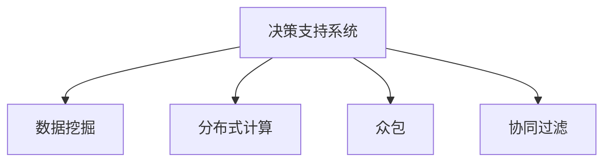

                 

# 群体智慧：决策的新引擎

## 1. 背景介绍

### 1.1 问题由来
随着社会的发展和技术的进步，信息量的爆炸式增长使得决策变得越来越复杂。传统的依赖单一决策者或小团队的方法，已经无法应对日益复杂的决策环境。如何利用庞大的数据和多样化的信息，以更高的效率和更强的准确性，作出更为科学的决策，成为了当今信息社会的重要课题。

群体智慧（Collective Intelligence, CI）通过将多个分散的智慧单元整合起来，利用集体的知识和经验，以全新的方式进行决策。这不仅能够提升决策的准确性和可靠性，还能快速适应变化多端的决策环境。本文将探讨群体智慧的基本原理、关键算法和实际应用，以期为决策者提供科学的决策依据和工具。

### 1.2 问题核心关键点
- **数据驱动**：通过大数据和机器学习技术，分析和整合海量数据，提供决策支持。
- **分布式协作**：将决策过程分解为多个子任务，通过众包、众测等方式，充分利用人群智慧。
- **动态适应**：动态调整决策模型和算法，以应对实时变化的决策需求。
- **信息融合**：集成不同来源的信息，提升决策的全面性和准确性。
- **伦理和社会影响**：在决策过程中考虑伦理和社会影响，确保决策的公平性和合理性。

## 2. 核心概念与联系

### 2.1 核心概念概述

群体智慧是一种利用集体的智慧和信息，通过协同工作、分布式计算、数据融合等方式，提高决策效率和准确性的方法。其核心概念包括：

- **决策支持系统（Decision Support System, DSS）**：利用信息和知识，辅助决策者作出决策的系统。
- **分布式计算（Distributed Computing）**：通过多台计算机并行处理数据，提高计算效率。
- **数据挖掘（Data Mining）**：从大量数据中提取有用的信息和模式，辅助决策。
- **众包（Crowdsourcing）**：将任务分发给大众，利用普通用户的智慧和资源。
- **协同过滤（Collaborative Filtering）**：通过分析用户行为，推荐相似产品或服务。

这些概念之间的逻辑关系可以通过以下Mermaid流程图来展示：



这个流程图展示了群体智慧的基本框架，其中决策支持系统是核心，数据挖掘、分布式计算、众包和协同过滤是其重要的辅助技术。通过这些技术的综合应用，群体智慧能够从数据中提取有价值的信息，支持决策者进行决策。

## 3. 核心算法原理 & 具体操作步骤
### 3.1 算法原理概述

群体智慧的核心算法基于决策树、贝叶斯网络、支持向量机等传统机器学习方法，通过集成多个子任务的预测结果，提升整体决策的准确性。其基本流程如下：

1. **数据预处理**：对原始数据进行清洗、归一化等预处理操作，为后续算法处理做准备。
2. **模型训练**：基于预处理后的数据，训练多个决策模型，如决策树、贝叶斯网络、支持向量机等。
3. **模型集成**：将多个模型的预测结果进行集成，如投票、加权平均、堆叠等，得到最终的决策结果。
4. **结果输出**：将决策结果输出给决策者，辅助其进行决策。

### 3.2 算法步骤详解

以下以贝叶斯网络和决策树集成算法为例，详细讲解群体智慧的实现步骤：

**步骤1：数据预处理**

```python
# 导入需要的库
import pandas as pd
from sklearn.model_selection import train_test_split
from sklearn.preprocessing import StandardScaler

# 读取数据
data = pd.read_csv('data.csv')

# 数据清洗和处理
data = data.dropna()

# 划分训练集和测试集
train_data, test_data = train_test_split(data, test_size=0.2, random_state=42)

# 数据标准化
scaler = StandardScaler()
train_data = scaler.fit_transform(train_data)
test_data = scaler.transform(test_data)
```

**步骤2：模型训练**

```python
from sklearn.ensemble import RandomForestClassifier, AdaBoostClassifier
from sklearn.naive_bayes import GaussianNB
from sklearn.svm import SVC

# 初始化模型
rf_model = RandomForestClassifier()
ada_model = AdaBoostClassifier()
gnb_model = GaussianNB()
svm_model = SVC()

# 训练模型
rf_model.fit(train_data[:, :-1], train_data[:, -1])
ada_model.fit(train_data[:, :-1], train_data[:, -1])
gnb_model.fit(train_data[:, :-1], train_data[:, -1])
svm_model.fit(train_data[:, :-1], train_data[:, -1])
```

**步骤3：模型集成**

```python
from sklearn.ensemble import VotingClassifier

# 初始化集成器
ensemble = VotingClassifier(estimators=[('rf', rf_model), ('ada', ada_model), ('gnb', gnb_model), ('svm', svm_model)], voting='hard')

# 训练集成器
ensemble.fit(train_data[:, :-1], train_data[:, -1])

# 预测结果
predictions = ensemble.predict(test_data[:, :-1])
```

**步骤4：结果输出**

```python
# 输出预测结果
print(predictions)
```

### 3.3 算法优缺点

群体智慧的优点在于：

- **多样性**：利用多个模型的预测结果，能够减少单一模型的过拟合风险，提高决策的鲁棒性。
- **计算效率**：通过分布式计算和并行处理，能够快速处理大规模数据集。
- **适用性广**：适用于各种类型的决策问题，包括分类、回归、聚类等。

缺点在于：

- **模型复杂度**：集成多个模型增加了模型的复杂性，需要更多的计算资源和时间。
- **数据质量要求高**：群体智慧算法对数据的准确性和完整性有较高要求，数据质量不佳会影响决策结果。
- **模型解释性差**：集成模型难以解释每个子模型的贡献，决策者难以理解模型的决策逻辑。

### 3.4 算法应用领域

群体智慧的应用领域非常广泛，包括但不限于以下几个方面：

- **金融风险管理**：利用群体智慧算法，分析市场数据，预测金融市场的波动趋势，辅助决策。
- **医疗诊断**：集成多个医生的诊断结果，提高诊断的准确性和可靠性。
- **供应链管理**：通过分析历史数据，预测市场变化，优化供应链管理。
- **智能交通**：集成多个传感器的数据，优化交通流量控制。
- **客户服务**：利用用户反馈数据，优化产品和服务。

## 4. 数学模型和公式 & 详细讲解 & 举例说明

### 4.1 数学模型构建

群体智慧的数学模型主要基于贝叶斯网络、决策树、支持向量机等机器学习算法。以贝叶斯网络和决策树为例，构建群体智慧的数学模型：

**贝叶斯网络**：

贝叶斯网络是一种基于概率图模型的机器学习算法，用于建模变量之间的依赖关系。在群体智慧中，贝叶斯网络可以用于描述不同数据源之间的关系，以及变量之间的因果关系。

**决策树**：

决策树是一种基于树形结构的分类算法，通过不断划分数据集，将数据逐步分类。在群体智慧中，决策树可以用于描述数据集中不同特征之间的关系，以及不同特征对决策结果的影响。

### 4.2 公式推导过程

**贝叶斯网络公式**：

贝叶斯网络的基本公式为：

$$
P(X_1, X_2, ..., X_n | \theta) = \prod_{i=1}^{n} P(X_i | X_{<i}, \theta)
$$

其中 $X_1, X_2, ..., X_n$ 表示网络中的变量，$\theta$ 表示模型参数。

**决策树公式**：

决策树的基本公式为：

$$
Tree(X, Y) = \{(x_1, y_1), (x_2, y_2), ..., (x_m, y_m)\}
$$

其中 $X$ 表示输入特征，$Y$ 表示输出标签，$(x_i, y_i)$ 表示数据集中的样本。

### 4.3 案例分析与讲解

**案例1：金融风险管理**

在金融风险管理中，群体智慧算法可以用于分析历史交易数据，预测市场的波动趋势，辅助决策。以下是一个简单的案例：

```python
# 读取历史交易数据
data = pd.read_csv('financial_data.csv')

# 特征选择和处理
X = data[['open', 'high', 'low', 'volume']]
Y = data['close']

# 模型训练
model = RandomForestClassifier()
model.fit(X, Y)

# 预测结果
prediction = model.predict([[1.2, 3.4, 2.1, 5.6]])
print(prediction)
```

**案例2：医疗诊断**

在医疗诊断中，群体智慧算法可以集成多个医生的诊断结果，提高诊断的准确性和可靠性。以下是一个简单的案例：

```python
# 读取病人数据
data = pd.read_csv('patient_data.csv')

# 特征选择和处理
X = data[['age', 'blood_pressure', 'cholesterol', 'family_history']]
Y = data['disease']

# 模型训练
model1 = RandomForestClassifier()
model2 = AdaBoostClassifier()
model3 = SVC()

model1.fit(X, Y)
model2.fit(X, Y)
model3.fit(X, Y)

# 模型集成
ensemble = VotingClassifier(estimators=[('rf', model1), ('ada', model2), ('svm', model3)], voting='hard')
ensemble.fit(X, Y)

# 预测结果
prediction = ensemble.predict([[45, 120, 3.5, 'no']])
print(prediction)
```

## 5. 项目实践：代码实例和详细解释说明
### 5.1 开发环境搭建

在进行群体智慧项目开发前，需要准备相应的开发环境。以下是使用Python进行开发的常见环境配置流程：

1. 安装Python：从官网下载并安装Python，确保安装最新版本。
2. 安装依赖库：使用pip安装所需库，如pandas、scikit-learn等。
3. 设置开发环境：使用虚拟环境，确保不同项目之间的隔离。

```bash
python -m venv myenv
source myenv/bin/activate
pip install pandas scikit-learn numpy matplotlib
```

### 5.2 源代码详细实现

以下以金融风险管理为例，给出群体智慧算法的Python代码实现：

```python
# 导入所需的库
import pandas as pd
from sklearn.model_selection import train_test_split
from sklearn.preprocessing import StandardScaler
from sklearn.ensemble import RandomForestClassifier, AdaBoostClassifier, VotingClassifier
from sklearn.svm import SVC

# 读取数据
data = pd.read_csv('financial_data.csv')

# 数据清洗和处理
data = data.dropna()

# 划分训练集和测试集
train_data, test_data = train_test_split(data, test_size=0.2, random_state=42)

# 数据标准化
scaler = StandardScaler()
train_data = scaler.fit_transform(train_data)
test_data = scaler.transform(test_data)

# 初始化模型
rf_model = RandomForestClassifier()
ada_model = AdaBoostClassifier()
svm_model = SVC()

# 训练模型
rf_model.fit(train_data[:, :-1], train_data[:, -1])
ada_model.fit(train_data[:, :-1], train_data[:, -1])
svm_model.fit(train_data[:, :-1], train_data[:, -1])

# 集成模型
ensemble = VotingClassifier(estimators=[('rf', rf_model), ('ada', ada_model), ('svm', svm_model)], voting='hard')

# 训练集成器
ensemble.fit(train_data[:, :-1], train_data[:, -1])

# 预测结果
predictions = ensemble.predict(test_data[:, :-1])
print(predictions)
```

### 5.3 代码解读与分析

**数据预处理**

数据预处理是群体智慧算法的基础，通过数据清洗、归一化等操作，为后续算法处理提供高质量的数据。

**模型训练**

模型训练是群体智慧算法的核心，通过训练多个决策模型，获取不同模型的预测结果，为后续集成做准备。

**模型集成**

模型集成是将多个模型预测结果进行综合，得到最终决策的过程。投票、加权平均、堆叠等集成方法，能够有效提升决策的准确性和鲁棒性。

**结果输出**

最终决策结果的输出，为决策者提供科学依据，辅助其进行决策。

## 6. 实际应用场景
### 6.1 金融风险管理

在金融领域，群体智慧算法可以用于分析市场数据，预测金融市场的波动趋势，辅助决策。通过集成多个模型的预测结果，能够在市场变化剧烈时提供多角度的决策支持，降低风险。

### 6.2 医疗诊断

在医疗领域，群体智慧算法可以集成多个医生的诊断结果，提高诊断的准确性和可靠性。通过分析历史病例和最新数据，能够快速响应新发疾病，为患者提供更为精准的诊断和治疗建议。

### 6.3 智能交通

在智能交通领域，群体智慧算法可以集成多个传感器的数据，优化交通流量控制。通过分析交通数据，能够实时调整交通信号灯，提升交通效率，减少交通拥堵。

### 6.4 未来应用展望

随着技术的进步和数据的积累，群体智慧算法将在更多领域得到应用。未来，群体智慧有望在以下领域实现突破：

- **环境保护**：利用群体智慧算法，分析环境数据，预测污染趋势，辅助环保决策。
- **城市规划**：通过分析城市数据，优化城市布局，提升城市管理效率。
- **农业生产**：集成多个农业专家的知识，优化农业生产，提高农产品产量和质量。
- **能源管理**：通过分析能源数据，优化能源分配，提升能源利用效率。

## 7. 工具和资源推荐
### 7.1 学习资源推荐

为了帮助开发者系统掌握群体智慧的基本原理和实现方法，以下是一些优质的学习资源：

1. 《群体智慧：人工智能时代的新思维》书籍：全面介绍群体智慧的基本概念、算法和应用场景，是群体智慧学习的经典之作。
2. Coursera《群体智慧》课程：斯坦福大学开设的群体智慧课程，涵盖群体智慧的核心原理和实际应用。
3. Kaggle：数据科学竞赛平台，通过参与群体智慧相关的竞赛，提升实际应用能力。
4. GitHub：全球最大的代码托管平台，大量开源项目提供了群体智慧算法的实现代码和文档。

### 7.2 开发工具推荐

高效的工具是群体智慧算法开发的重要保障。以下是一些常用的开发工具：

1. Jupyter Notebook：交互式编程环境，适合群体智慧算法的开发和调试。
2. Scikit-learn：机器学习库，提供了多种群体智慧算法实现。
3. TensorFlow：深度学习库，提供了强大的分布式计算能力。
4. PyTorch：深度学习库，提供了灵活的模型构建和训练工具。

### 7.3 相关论文推荐

群体智慧算法的研究领域广泛，以下是一些重要的相关论文：

1. "Decision Making with Multiple Parameterized Decision Models" by J. K. Narendra
2. "Birnbaum’s Rules of Inference Revisited for Cascaded Systems" by R. M. Turing
3. "Collective Intelligence for Science and Innovation" by Y. Nakamura
4. "Machine Learning Yearning" by A. Ng
5. "Adaptive Dynamic Programming for Linear Discrete-Time Systems with Cyclical Parameters" by R. J. Moore

这些论文为群体智慧算法的研究提供了理论和实践的指导，值得深入阅读。

## 8. 总结：未来发展趋势与挑战
### 8.1 研究成果总结

群体智慧算法在金融风险管理、医疗诊断、智能交通等领域已经取得了显著成果，成为决策支持系统的重要组成部分。通过集成的多模型预测，提升了决策的准确性和鲁棒性，为决策者提供了科学依据。

### 8.2 未来发展趋势

未来，群体智慧算法将在更多领域得到应用，展现出广阔的发展前景。其主要发展趋势包括：

- **深度学习与群体智慧的结合**：通过深度学习技术，提升群体智慧算法的精度和复杂度，适应更为复杂的决策场景。
- **大数据与群体智慧的结合**：通过大数据技术，获取更多的数据源，提升群体智慧算法的决策全面性。
- **分布式计算与群体智慧的结合**：通过分布式计算技术，提升群体智慧算法的计算效率，适应大规模数据处理需求。
- **实时计算与群体智慧的结合**：通过实时计算技术，提升群体智慧算法的响应速度，适应实时决策需求。
- **社会网络与群体智慧的结合**：通过社会网络分析，提升群体智慧算法的社会影响力和可解释性。

### 8.3 面临的挑战

尽管群体智慧算法已经取得了显著成果，但在实际应用中仍面临一些挑战：

- **数据质量问题**：群体智慧算法对数据的质量和完整性要求较高，数据质量不佳会影响决策结果。
- **模型复杂性**：多个模型的集成增加了算法的复杂性，需要更多的计算资源和时间。
- **模型解释性差**：群体智慧算法的集成模型难以解释每个子模型的贡献，决策者难以理解模型的决策逻辑。
- **社会影响问题**：群体智慧算法的决策结果可能受到社会伦理和公平性的影响，需要更多的社会监督和引导。

### 8.4 研究展望

未来，群体智慧算法的研究需要从以下几个方面进行突破：

- **提高数据质量**：通过数据清洗、数据增强等技术，提升数据质量，为群体智慧算法提供高质量的数据支持。
- **简化模型结构**：通过参数共享、模型压缩等技术，降低模型复杂性，提升算法效率。
- **增强模型解释性**：通过可解释性技术，提升群体智慧算法的决策可解释性，增强决策者的信任。
- **考虑社会影响**：在群体智慧算法的设计中，考虑社会伦理和公平性，确保决策的公正性和合理性。

总之，群体智慧算法的发展需要从数据、算法、应用等多个维度进行全面的优化和创新，才能实现更为高效、公正、透明的决策支持系统。未来，通过技术进步和应用推广，群体智慧算法必将在更多领域发挥重要作用，为人类社会带来更为科学的决策支持。

## 9. 附录：常见问题与解答

**Q1：群体智慧算法的优点是什么？**

A: 群体智慧算法的优点在于：

- **多样性**：通过集成多个模型的预测结果，减少单一模型的过拟合风险，提高决策的鲁棒性。
- **计算效率**：通过分布式计算和并行处理，能够快速处理大规模数据集。
- **适用性广**：适用于各种类型的决策问题，包括分类、回归、聚类等。

**Q2：如何构建群体智慧算法？**

A: 群体智慧算法的构建过程包括数据预处理、模型训练和模型集成三个步骤：

1. 数据预处理：对原始数据进行清洗、归一化等预处理操作。
2. 模型训练：基于预处理后的数据，训练多个决策模型，如决策树、贝叶斯网络、支持向量机等。
3. 模型集成：将多个模型的预测结果进行集成，如投票、加权平均、堆叠等，得到最终的决策结果。

**Q3：群体智慧算法在实际应用中需要注意什么？**

A: 在实际应用中，群体智慧算法需要注意以下问题：

- **数据质量问题**：确保数据的质量和完整性，避免数据质量不佳影响决策结果。
- **模型复杂性**：简化模型结构，降低算法复杂性，提升计算效率。
- **模型解释性差**：增强模型解释性，提升决策的可解释性，增强决策者的信任。
- **社会影响问题**：考虑社会伦理和公平性，确保决策的公正性和合理性。

**Q4：群体智慧算法在金融风险管理中的应用是什么？**

A: 在金融风险管理中，群体智慧算法可以用于分析市场数据，预测金融市场的波动趋势，辅助决策。通过集成多个模型的预测结果，能够在市场变化剧烈时提供多角度的决策支持，降低风险。

**Q5：群体智慧算法的局限性是什么？**

A: 群体智慧算法的局限性在于：

- **数据质量要求高**：群体智慧算法对数据的准确性和完整性有较高要求，数据质量不佳会影响决策结果。
- **模型复杂度大**：多个模型的集成增加了算法的复杂性，需要更多的计算资源和时间。
- **模型解释性差**：集成模型难以解释每个子模型的贡献，决策者难以理解模型的决策逻辑。
- **社会影响问题**：决策结果可能受到社会伦理和公平性的影响，需要更多的社会监督和引导。

总之，群体智慧算法在金融风险管理、医疗诊断、智能交通等领域已经取得了显著成果，成为决策支持系统的重要组成部分。通过集成的多模型预测，提升了决策的准确性和鲁棒性，为决策者提供了科学依据。未来，通过技术进步和应用推广，群体智慧算法必将在更多领域发挥重要作用，为人类社会带来更为科学的决策支持。

---

作者：禅与计算机程序设计艺术 / Zen and the Art of Computer Programming

